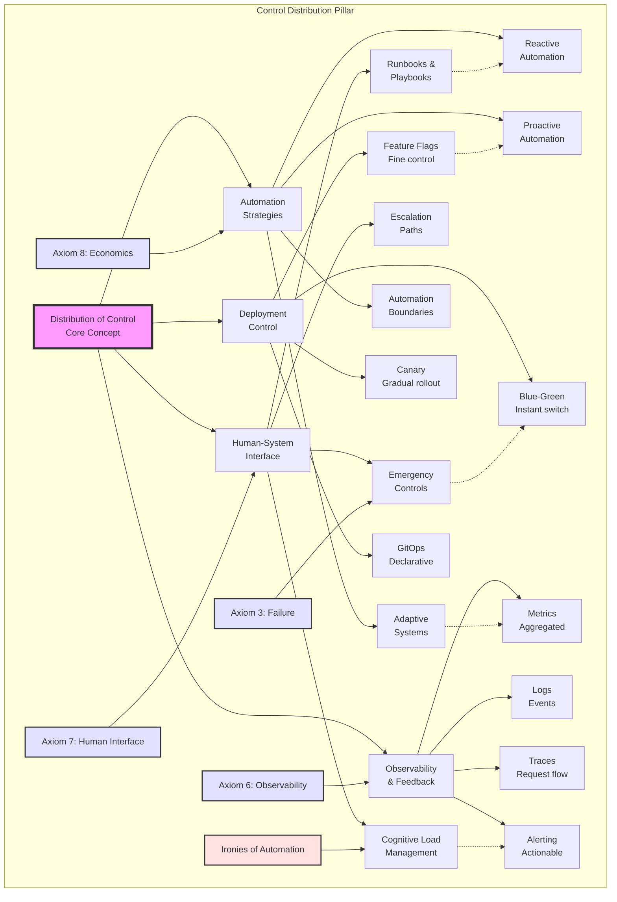

## Level 1: Intuition (Start Here) 🌱

### The Cruise Control Metaphor

Think about driving a car:
- **Manual Control**: You control speed with gas pedal
- **Cruise Control**: Set speed, car maintains it
- **Adaptive Cruise**: Adjusts to traffic automatically
- **Emergency Override**: Brake instantly takes control back
- **Driver Still Essential**: For decisions and emergencies

**This is distributed control**: Automation handles routine, humans handle exceptions.

### Real-World Analogy: Restaurant Kitchen

```yaml
Busy Restaurant Kitchen Control:

Head Chef: "Fire table 12!"
Grill Cook: Starts steaks automatically
Sauce Chef: Begins reduction on cue
Expediter: Coordinates timing

What's the control system?
- Standard procedures (recipes)
- Real-time coordination (expediter)
- Quality checks (head chef)
- Emergency overrides (stop everything!)

When rush hits:
- Procedures scale the operation
- Humans handle exceptions
- Clear escalation paths
- Everyone knows their role
```

### Your First Control Experiment

### The Beginner's Control Stack

```proto
         🧠 Strategic Control
          (Business decisions)
                |
                |
         📊 Tactical Control
           (Service goals)
                |
                |
         ⚙️ Operational Control
           (Day-to-day running)
                |
                |
         🚨 Emergency Control
           (Break glass procedures)
```

---

## 📋 Questions This Pillar Answers

---

## Level 2: Foundation (Understand Why) 🌿

### Core Principle: The Control Paradox

### Control Theory Basics

### The Control Hierarchy

```proto
Strategic Level (Days/Weeks)
├─ Business metrics
├─ Capacity planning
├─ Budget allocation
└─ Architecture decisions

Tactical Level (Hours/Days)
├─ Service objectives
├─ Deployment decisions
├─ Resource allocation
└─ Incident management

Operational Level (Minutes/Hours)
├─ Auto-scaling
├─ Load balancing
├─ Health checks
└─ Alerts

Emergency Level (Seconds)
├─ Circuit breakers
├─ Kill switches
├─ Rollbacks
└─ Failovers
```

### 🎬 Failure Vignette: Knight Capital Meltdown

### Control System Properties

---

## Level 3: Deep Dive (Master the Patterns) 🌳

### PID Controllers: The Workhorses

### Circuit Breaker Pattern

### Deployment Control Strategies

### Concept Map: Distribution of Control



This concept map illustrates how control distribution balances human oversight with automation, deployment strategies, and observability. The "Ironies of Automation" remind us that more automation often requires more sophisticated human control.

### Observability: The Eyes of Control

### Control System Decision Framework

### Alert Design Philosophy

---

## Level 4: Expert (Production Patterns) 🌲

### Case Study: Netflix Chaos Engineering

### 🎯 Decision Framework: Control Strategy

### Advanced Pattern: Adaptive Control

### Production Anti-Patterns

---

## Level 5: Mastery (Push the Boundaries) 🌴

### The Future: Autonomous Operations

### Control Planes at Scale

### The Philosophy of Control

## Summary: Key Insights by Level

### 🌱 Beginner
1. **Control frees humans for important decisions**
2. **Automation handles routine, humans handle exceptions**
3. **Good control needs good observability**

### 🌿 Intermediate
1. **Control paradox: More automation = More critical human role**
2. **Feedback loops essential for stability**
3. **Multiple control levels for different timescales**

### 🌳 Advanced
1. **PID control universal pattern**
2. **Circuit breakers prevent cascades**
3. **Progressive deployment reduces risk**

### 🌲 Expert
1. **Chaos engineering builds confidence**
2. **Adaptive control handles changing conditions**
3. **Control strategy depends on failure modes**

### 🌴 Master
1. **Autonomous operations are coming**
2. **Control plane isolation critical at scale**
3. **Best systems make failures boring**

## Quick Reference Card

---

**Next**: [Pillar 5: Intelligence →](../intelligence/index.md)

*"The best control system is one you never notice—until you need it."*
