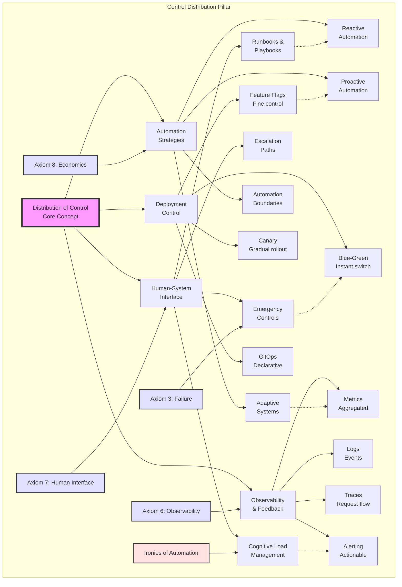

# Pillar 4: Distribution of Control

<div class="pillar-header">
  <div class="learning-objective">
    <strong>Learning Objective</strong>: Master building systems that humans can operate, understand, and evolve while maintaining reliability at scale.
  </div>
</div>

---

## Level 1: Intuition (Start Here) 🌱

### The Cruise Control Metaphor

Think about driving a car:
- **Manual Control**: You control speed with gas pedal
- **Cruise Control**: Set speed, car maintains it
- **Adaptive Cruise**: Adjusts to traffic automatically
- **Emergency Override**: Brake instantly takes control back
- **Driver Still Essential**: For decisions and emergencies

**This is distributed control**: Automation handles routine, humans handle exceptions.

### Real-World Analogy: Restaurant Kitchen

```
Busy Restaurant Kitchen Control:

Head Chef: "Fire table 12!"
Grill Cook: Starts steaks automatically
Sauce Chef: Begins reduction on cue
Expediter: Coordinates timing

What's the control system?
- Standard procedures (recipes)
- Real-time coordination (expediter)
- Quality checks (head chef)
- Emergency overrides (stop everything!)

When rush hits:
- Procedures scale the operation
- Humans handle exceptions
- Clear escalation paths
- Everyone knows their role
```

### Your First Control Experiment

<div class="experiment-box">
<h4>🧪 The Thermostat Game</h4>

Try this temperature control simulation:

**Round 1: Manual Control**
- Watch thermometer
- Turn heater on when cold
- Turn heater off when hot
- Exhausting and imprecise!

**Round 2: Simple Automation**
- Set target temperature
- Thermostat maintains it
- But overshoots happen
- System oscillates

**Round 3: Smart Control**
- Learns your patterns
- Predicts when to start/stop
- Smooth temperature
- You just set goals

**Lesson**: Good control frees humans for higher-level decisions
</div>

### The Beginner's Control Stack

```
         🧠 Strategic Control
          (Business decisions)
                |
                |
         📊 Tactical Control
           (Service goals)
                |
                |
         ⚙️ Operational Control
           (Day-to-day running)
                |
                |
         🚨 Emergency Control
           (Break glass procedures)
```

---

## 📋 Questions This Pillar Answers

<div class="questions-box">

### Fundamental Questions
- **How do I make my system operable by humans?**
- **What level of automation is appropriate?**
- **How do I balance automation with human oversight?**
- **When should operators intervene vs let systems self-heal?**

### Design Questions
- **What controls do operators actually need?**
- **How do I design effective circuit breakers?**
- **Should I use push-button deploys or GitOps?**
- **How do I implement gradual rollouts safely?**

### Operational Questions
- **How do I know when something needs human intervention?**
- **What's the right escalation path for incidents?**
- **How do I prevent automation from making things worse?**
- **When should I disable automated recovery?**

### Performance Questions
- **How fast can operators understand system state?**
- **What's the MTTR impact of better controls?**
- **How do I measure operator cognitive load?**
- **What's the cost of manual vs automated operations?**

</div>

---

## Level 2: Foundation (Understand Why) 🌿

### Core Principle: The Control Paradox

<div class="principle-box">
<h3>The Fundamental Control Paradox</h3>

```
The more automated a system becomes,
the more critical human control becomes.

When everything works: Humans unnecessary
When something breaks: Humans essential
But by then: Humans have lost context
```

**Example**: Air France 447
- Autopilot flew for hours
- Ice crystals disabled sensors
- Autopilot disconnected
- Pilots had seconds to understand situation
- Crashed due to loss of situational awareness
</div>

### Control Theory Basics

<div class="control-theory">
<h3>🎯 Three Types of Control Systems</h3>

```
1. Open-Loop Control (Predictive)
   Input → Controller → Output
   Example: Toaster timer
   No feedback, relies on model

2. Closed-Loop Control (Reactive)
   Input → Controller → Output
     ↑                      ↓
     └──── Feedback ────────┘
   Example: Thermostat
   Measures output, adjusts input

3. Feedforward Control (Proactive)
   Disturbance
        ↓
   Input → Controller → Output
   Example: See hill, press gas early
   Anticipates problems
```
</div>

### The Control Hierarchy

```
Strategic Level (Days/Weeks)
├─ Business metrics
├─ Capacity planning
├─ Budget allocation
└─ Architecture decisions

Tactical Level (Hours/Days)
├─ Service objectives
├─ Deployment decisions
├─ Resource allocation
└─ Incident management

Operational Level (Minutes/Hours)
├─ Auto-scaling
├─ Load balancing
├─ Health checks
└─ Alerts

Emergency Level (Seconds)
├─ Circuit breakers
├─ Kill switches
├─ Rollbacks
└─ Failovers
```

### 🎬 Failure Vignette: Knight Capital Meltdown

<div class="failure-story">
<h3>When Control Systems Lose Control</h3>

**Date**: August 1, 2012
**Company**: Knight Capital Group
**Loss**: $440 million in 45 minutes

**The Cascade**:
```
7:00 AM:  New trading software deployed
9:30 AM:  Markets open, software activates
9:31 AM:  Algorithm starts buying everything
9:35 AM:  $100M in unwanted positions
9:40 AM:  Traders notice unusual volume
9:45 AM:  Cannot find kill switch
10:00 AM: Manual shutdown attempted
10:15 AM: Finally stopped
Result:   Company nearly bankrupt

Root Causes:
1. No gradual rollout
2. No circuit breakers
3. No position limits
4. No emergency stops
5. Old code accidentally activated
```

**Lesson**: Automation without control = disaster
**Fix**: Multiple independent safety mechanisms
</div>

### Control System Properties

<div class="control-properties">
<h3>📐 Key Control Metrics</h3>

| Property | Definition | Example |
|----------|------------|---------|
| **Stability** | Returns to steady state | Thermostat settles |
| **Accuracy** | How close to target | ±1°F temperature |
| **Settling Time** | Time to reach target | 5 min to warm room |
| **Overshoot** | Exceeds target | Room gets too hot |
| **Robustness** | Handles disturbances | Door opens, still OK |
</div>

---

## Level 3: Deep Dive (Master the Patterns) 🌳

### PID Controllers: The Workhorses

<div class="pid-explanation">
<h3>⚙️ Proportional-Integral-Derivative Control</h3>

**The Universal Control Algorithm**:
```
Error = Target - Current

P (Proportional): How far off are we?
  → Stronger push when further from target
  → Like pressing gas harder when slower

I (Integral): How long have we been off?
  → Fixes persistent small errors
  → Like cruise control on a hill

D (Derivative): How fast is error changing?
  → Prevents overshoot
  → Like easing off gas approaching target

Output = Kp×Error + Ki×∫Error + Kd×(dError/dt)
```

**Real Example: Auto-scaling**
```
Target: 70% CPU utilization
Current: 85% CPU (overloaded!)

P says: "Add 3 servers now!"
I says: "We've been high for 5min, add 1 more"
D says: "Load dropping fast, maybe wait"

Result: Add 3 servers, smoother scaling
```
</div>

### Circuit Breaker Pattern

<div class="circuit-breaker-visual">
<h3>🔌 The Safety Switch for Services</h3>

```
States of a Circuit Breaker:

CLOSED (Normal Operation)
├─ Requests flow through
├─ Monitor success/failure
├─ Count consecutive failures
└─ Trip if threshold exceeded

OPEN (Service Protected)
├─ Requests fail immediately  
├─ No load on failing service
├─ Wait for timeout period
└─ Prevents cascade failures

HALF-OPEN (Testing Recovery)
├─ Allow single test request
├─ Success → Return to CLOSED
├─ Failure → Return to OPEN
└─ Gradual recovery
```

**Implementation Pattern**:
```
CircuitBreaker Config:
- Failure threshold: 5 errors
- Timeout: 30 seconds
- Success threshold: 3 successes
- Monitor window: 60 seconds
```
</div>

### Deployment Control Strategies

<div class="deployment-patterns">
<h3>🚀 Safe Deployment Patterns</h3>

**1. Blue-Green Deployment**
```
Current State:
[Users] → [Load Balancer] → [Blue: v1.0]
                              [Green: idle]

Deploy v2.0:
[Users] → [Load Balancer] → [Blue: v1.0]
                              [Green: v2.0] ← Deploy here

Switch:
[Users] → [Load Balancer] → [Blue: idle]
                              [Green: v2.0] ← Instant switch

Rollback = Switch back to Blue
```

**2. Canary Deployment**
```
5% Traffic:  v2.0 (canary)
95% Traffic: v1.0 (stable)
    ↓
Monitor metrics
    ↓
If OK: Increase to 25%
If Bad: Roll back to 0%
    ↓
Gradual rollout: 5% → 25% → 50% → 100%
```

**3. Feature Flags**
```
if (featureFlag.isEnabled("newAlgorithm", user)) {
    return newAlgorithm.process(request)
} else {
    return oldAlgorithm.process(request)
}

Control dimensions:
- User percentage
- Geographic region
- User attributes
- Time windows
```
</div>

### Concept Map: Distribution of Control



This concept map illustrates how control distribution balances human oversight with automation, deployment strategies, and observability. The "Ironies of Automation" remind us that more automation often requires more sophisticated human control.

### Observability: The Eyes of Control

<div class="observability-pillars">
<h3>👁️ The Three Pillars</h3>

**1. Metrics (Aggregated Numbers)**
```
What to measure:
- Golden Signals (Rate, Errors, Duration, Saturation)
- Business KPIs (Revenue, Users, Conversion)
- Resource Usage (CPU, Memory, Disk, Network)

Example Dashboard:
┌─────────────┬──────────────┐
│ Requests/s  │ Error Rate   │
│   📈 2.5k   │  📉 0.05%   │
├─────────────┼──────────────┤
│ P95 Latency │ CPU Usage    │
│   📊 45ms   │  📊 68%     │
└─────────────┴──────────────┘
```

**2. Logs (Event Details)**
```
Structured Logging:
{
  "timestamp": "2024-01-15T10:30:45Z",
  "service": "payment-api",
  "level": "ERROR",
  "user_id": "u123",
  "transaction_id": "tx456",
  "error": "Payment gateway timeout",
  "latency_ms": 5000,
  "retry_count": 3
}
```

**3. Traces (Request Journey)**
```
Request Flow Visualization:
Frontend (5ms)
  └→ API Gateway (2ms)
      └→ User Service (10ms)
      └→ Payment Service (4000ms) ⚠️
          └→ Payment Gateway (timeout)
              └→ Retry Logic (3x)
```
</div>

### Control System Decision Framework

<div class="decision-framework">
<h4>🎯 Automation Level Selection</h4>

| System Type | Full Auto | Human-in-Loop | Manual | Why |
|-------------|-----------|---------------|---------|-----|
| **Scaling** | ✅ Predictable load | ⚠️ Cost sensitive | ❌ Never | Machines react faster |
| **Deployments** | ⚠️ After validation | ✅ Most systems | ⚠️ Critical changes | Balance speed vs safety |
| **Incident Response** | ⚠️ Known issues | ✅ Complex failures | ⚠️ Novel problems | Humans handle unknowns |
| **Security Response** | ✅ DDoS mitigation | ✅ Suspicious activity | ❌ Never | Speed crucial |
| **Cost Optimization** | ⚠️ Within bounds | ✅ Major changes | ❌ Never | Prevent bill shock |

<h4>🔧 Control Pattern Selection</h4>

| Pattern | Use When | Avoid When | Example |
|---------|----------|------------|---------|
| **Circuit Breaker** | • Protect dependencies<br>• Fail fast needed<br>• Cascading risk | • Intermittent issues OK<br>• No fallback available<br>• Stateless operations | Payment gateway |
| **Bulkhead** | • Isolate failures<br>• Multi-tenant systems<br>• Resource pools | • Shared nothing arch<br>• Single purpose system<br>• Low traffic | Thread pools |
| **Rate Limiting** | • Public APIs<br>• Prevent abuse<br>• Resource protection | • Internal services<br>• Trusted clients<br>• Batch processing | API gateway |
| **Backpressure** | • Queue buildup risk<br>• Producer > consumer<br>• Memory sensitive | • Unlimited resources<br>• Loss acceptable<br>• Real-time systems | Stream processing |
| **Adaptive Control** | • Variable load<br>• Learning patterns<br>• Cost optimization | • Predictable systems<br>• Strict SLAs<br>• Simple requirements | Auto-scaling |

<h4>🚨 Observability Strategy</h4>

| Need | Metrics | Logs | Traces | Profiles |
|------|---------|------|--------|----------|
| **System Health** | ✅ Primary | ⚠️ Support | ❌ Overkill | ❌ N/A |
| **Error Investigation** | ⚠️ Detection | ✅ Primary | ✅ Complex cases | ⚠️ If performance |
| **Performance Issues** | ✅ Detection | ⚠️ Context | ✅ User journey | ✅ Deep dive |
| **Capacity Planning** | ✅ Primary | ❌ Not needed | ❌ Not needed | ⚠️ Optimization |
| **Security Incidents** | ✅ Anomalies | ✅ Forensics | ✅ Attack path | ❌ N/A |

</div>

### Alert Design Philosophy

<div class="alerting-strategy">
<h3>🚨 Effective Alerting</h3>

**Alert Quality Checklist**:
```
Good Alert:
✓ Actionable
✓ Indicates user impact
✓ Has clear runbook
✓ Includes context
✓ Avoids redundancy

Bad Alert:
✗ "CPU is high" (So what?)
✗ "Disk will fill in 6 months" (Not urgent)
✗ "Same alert 100 times" (Alert fatigue)
✗ "Something is wrong" (What exactly?)
```

**Alert Hierarchy**:
```
CRITICAL: User-facing outage
  → Page on-call immediately
  → Revenue/data loss risk
  → Example: Payment system down

HIGH: Degraded service
  → Notify team channel
  → Users impacted but working
  → Example: Slow response times

MEDIUM: Proactive issues
  → Email/ticket
  → Fix within days
  → Example: Disk 80% full

LOW: Informational
  → Dashboard only
  → Trends and analytics
  → Example: New deployment
```
</div>

---

## Level 4: Expert (Production Patterns) 🌲

### Case Study: Netflix Chaos Engineering

<div class="case-study">
<h3>🎬 Controlling Chaos at Scale</h3>

**Challenge**: Ensure reliability across 200M+ users

**The Netflix Control Stack**:
```
1. Chaos Monkey (Random Failures)
   - Kills instances in production
   - Forces resilient design
   - Runs during business hours

2. Chaos Kong (Region Failures)
   - Simulates entire region outage
   - Tests cross-region failover
   - Planned exercises

3. Chaos Gorilla (Zone Failures)
   - Takes out availability zones
   - Tests zone redundancy
   - Continuous validation

4. Latency Monkey (Performance)
   - Injects artificial delays
   - Tests timeout handling
   - Finds cascading failures
```

**Control Mechanisms**:
```
Automated Recovery:
├─ Instance failure → Auto-scaling replaces
├─ Zone failure → Traffic shifts zones
├─ Region failure → Global load balancer redirects
└─ Service failure → Circuit breaker activates

Human Control:
├─ Red/black deployments (instant rollback)
├─ Automated canaries (1% → 5% → 25% → 50% → 100%)
├─ Feature flags (disable features, not services)
└─ "Big Red Button" (emergency stops)
```

**Results**:
- 99.99% availability despite constant failures
- Engineers confident in system resilience
- Failures become routine, not emergencies
</div>

### 🎯 Decision Framework: Control Strategy

<div class="decision-framework">
<h3>🎯 Choosing Control Mechanisms</h3>

```
1. What's your failure mode?
├─ Fast failures? → Circuit breakers
│   Example: Network timeouts
├─ Slow degradation? → Auto-scaling
│   Example: Growing traffic
├─ Cascade risks? → Bulkheads
│   Example: Shared thread pools
└─ Data corruption? → Rollback capability
    Example: Bad deployments

2. What's your recovery time objective?
├─ Seconds? → Automatic failover
│   Use: Stateless services
├─ Minutes? → Human-triggered recovery
│   Use: Stateful services
├─ Hours? → Manual intervention
│   Use: Data recovery
└─ Days? → Rebuild from backups
    Use: Disaster recovery

3. What's your blast radius?
├─ Single user? → Retry with backoff
├─ Service component? → Feature flags
├─ Entire service? → Circuit breakers
└─ Multiple services? → Kill switches

4. What's your operational maturity?
├─ Starting out? → Simple health checks
├─ Growing? → Basic automation
├─ Scaling? → Full observability
└─ Mature? → Chaos engineering
```
</div>

### Advanced Pattern: Adaptive Control

<div class="adaptive-control">
<h3>🧬 Self-Tuning Systems</h3>

**Traditional vs Adaptive Control**:
```
Traditional PID:
- Fixed parameters (Kp, Ki, Kd)
- Works well in stable conditions
- Fails when system changes

Adaptive Control:
- Parameters adjust automatically
- Learns from system behavior
- Handles changing conditions
```

**Example: Adaptive Load Balancing**
```
Morning Pattern (8-10 AM):
- Login surge
- CPU-bound
- Route to high-CPU instances

Afternoon Pattern (1-3 PM):
- Report generation
- Memory-intensive
- Route to high-memory instances

Evening Pattern (6-8 PM):
- Video streaming
- Network-intensive
- Route to well-connected instances

System learns patterns and pre-adjusts
```

**Implementation Approach**:
```
1. Collect performance data
2. Identify patterns (ML/statistics)
3. Predict future load
4. Pre-position resources
5. Continuously refine model
```
</div>

### Production Anti-Patterns

<div class="antipattern-box">
<h3>⚠️ Control Mistakes That Hurt</h3>

**1. The Automation Paradox**
```
WRONG: Automate everything
- Operators lose context
- Can't handle novel failures
- Automation becomes brittle

RIGHT: Human-in-the-loop
- Automate routine tasks
- Keep humans engaged
- Clear manual overrides
```

**2. The Alert Storm**
```
WRONG: Alert on everything
- 1000 alerts per hour
- Alert fatigue sets in
- Critical alerts missed

RIGHT: Alert on symptoms
- User-visible impact only
- Aggregate related issues
- Clear severity levels
```

**3. The Perfect Availability Trap**
```
WRONG: Never accept failure
- Complex systems
- Expensive redundancy
- Brittle when fails

RIGHT: Fail gracefully
- Accept partial failures
- Degrade functionality
- Maintain core features
```
</div>

---

## Level 5: Mastery (Push the Boundaries) 🌴

### The Future: Autonomous Operations

<div class="future-operations">
<h3>🚀 Self-Operating Systems</h3>

**Current State**: Human-driven with automation
**Future State**: AI-driven with human oversight

```
Level 1: Manual Operations
- Humans do everything
- Scripts for common tasks

Level 2: Automated Runbooks
- Known issues auto-resolve
- Humans handle unknowns

Level 3: Intelligent Automation
- ML predicts failures
- Proactive mitigation
- Humans set policies

Level 4: Autonomous Operations
- Self-healing systems
- Continuous optimization
- Humans handle strategy

Level 5: Cognitive Systems
- Understands business goals
- Makes architectural decisions
- Humans provide vision
```

**Example: AIOps Platform**
```
Anomaly Detection:
├─ Learns normal patterns
├─ Detects deviations early
├─ Correlates across services
└─ Predicts impact

Root Cause Analysis:
├─ Traces failure propagation
├─ Identifies likely causes
├─ Suggests remediation
└─ Learns from outcomes

Automated Response:
├─ Executes proven fixes
├─ Tests in sandbox first
├─ Monitors results
└─ Rolls back if needed
```
</div>

### Control Planes at Scale

<div class="control-planes">
<h3>🌍 Planetary-Scale Control</h3>

**Google's Borg: Global Control**
```
Hierarchy:
Universe (Global)
  └─ Cells (Regions)
      └─ Machines (Servers)
          └─ Jobs (Containers)

Control Flow:
1. Global policy set by SREs
2. Regional controllers optimize
3. Local agents execute
4. Feedback flows upward

Scale:
- Millions of containers
- Thousands of changes/second
- Sub-second scheduling
- 99.99% availability
```

**Amazon's Region Isolation**
```
Principle: Regions never depend on each other

Control Isolation:
- Each region has own control plane
- No cross-region dependencies
- Can survive global network partition
- Independent failure domains

Benefits:
- Blast radius limited to region
- Simple reasoning about failures
- Can innovate per region
- Regulatory compliance easier
```
</div>

### The Philosophy of Control

<div class="philosophy-box">
<h3>🤔 Deep Thoughts on Control</h3>

**Control in Different Domains**:

| Domain | Control Method | Key Insight |
|--------|----------------|-------------|
| **Aviation** | Redundancy + Procedures | Checklists save lives |
| **Nuclear** | Defense in Depth | Multiple barriers |
| **Finance** | Risk Limits + Audits | Prevent, don't just detect |
| **Medicine** | Protocols + Monitoring | Standard care + customization |
| **Software** | Automation + Observability | Fast feedback loops |

**Universal Principles**:
1. **Make normal operations visible**
2. **Design for partial failure**
3. **Enable graceful degradation**
4. **Keep humans in the loop**
5. **Learn from every incident**

**The Ultimate Goal**:
*"Build systems that are boringly reliable, where failures are routine non-events, and operators sleep soundly."*
</div>

## Summary: Key Insights by Level

### 🌱 Beginner
1. **Control frees humans for important decisions**
2. **Automation handles routine, humans handle exceptions**
3. **Good control needs good observability**

### 🌿 Intermediate
1. **Control paradox: More automation = More critical human role**
2. **Feedback loops essential for stability**
3. **Multiple control levels for different timescales**

### 🌳 Advanced
1. **PID control universal pattern**
2. **Circuit breakers prevent cascades**
3. **Progressive deployment reduces risk**

### 🌲 Expert
1. **Chaos engineering builds confidence**
2. **Adaptive control handles changing conditions**
3. **Control strategy depends on failure modes**

### 🌴 Master
1. **Autonomous operations are coming**
2. **Control plane isolation critical at scale**
3. **Best systems make failures boring**

## Quick Reference Card

<div class="reference-card">
<h3>📋 Control Patterns Cheat Sheet</h3>

**Deployment Strategies**:
```
┌────────────────────────────────┐
│ Risk Tolerance?                │
│ ↓ LOW           ↓ MEDIUM      │
│ Canary          Blue-Green    │
│                                │
│ Change Scope?                  │
│ ↓ FEATURE       ↓ SERVICE     │
│ Feature Flag    Deployment    │
└────────────────────────────────┘
```

**Alert Design**:
```
Severity = Impact × Urgency
CRITICAL: Immediate user impact
HIGH: Degraded experience
MEDIUM: Proactive fixes needed
LOW: Informational only
```

**Control Mechanisms**:
```
Speed of Response:
- Circuit Breakers: Milliseconds
- Auto-scaling: Seconds to minutes
- Deployments: Minutes to hours
- Capacity: Days to weeks
```

**Golden Signals**:
```
1. Rate: How many requests?
2. Errors: How many fail?
3. Duration: How long they take?
4. Saturation: How full is system?
```
</div>

---

**Next**: [Pillar 5: Intelligence →](../intelligence/)

*"The best control system is one you never notice—until you need it."*