## Level 1: Intuition (Start Here) 🌱

### The Cruise Control Metaphor

Think about driving a car:
- **Manual Control**: You control speed with gas pedal
- **Cruise Control**: Set speed, car maintains it
- **Adaptive Cruise**: Adjusts to traffic automatically
- **Emergency Override**: Brake instantly takes control back
- **Driver Still Essential**: For decisions and emergencies

**This is distributed control**: Automation handles routine, humans handle exceptions.

### Real-World Analogy: Restaurant Kitchen

```mermaid
graph LR
    subgraph "Restaurant Kitchen Control System"
        HC[Head Chef<br/>Strategic Control] -->|"Fire table 12!"| EX[Expediter<br/>Coordination]
        
        EX -->|Timing signals| GC[Grill Cook<br/>Automated Process]
        EX -->|Timing signals| SC[Sauce Chef<br/>Automated Process]
        EX -->|Timing signals| PC[Prep Cook<br/>Support Process]
        
        GC -->|Status| EX
        SC -->|Status| EX
        PC -->|Status| EX
        
        EX -->|Quality Check| HC
        
        EM[Emergency Override<br/>"Stop Everything!"] -.->|Override| GC
        EM -.->|Override| SC
        EM -.->|Override| PC
    end
    
    subgraph "Control Elements"
        R[📋 Recipes<br/>Standard Procedures]
        T[⏱️ Timing<br/>Real-time Coordination]
        Q[✅ Quality<br/>Continuous Checks]
        E[🚨 Emergency<br/>Override Controls]
    end
    
    style HC fill:#ff9999
    style EX fill:#99ccff
    style EM fill:#ffcc99
```

### Your First Control Experiment

### The Beginner's Control Stack

```mermaid
graph TD
    subgraph "Control Hierarchy"
        S[🧠 Strategic Control<br/>Business Decisions<br/>Days/Weeks] 
        T[📊 Tactical Control<br/>Service Goals<br/>Hours/Days]
        O[⚙️ Operational Control<br/>Day-to-day Running<br/>Minutes/Hours]
        E[🚨 Emergency Control<br/>Break Glass Procedures<br/>Seconds]
        
        S -->|Policy & Goals| T
        T -->|Objectives & Limits| O
        O -->|Triggers & Thresholds| E
        
        E -.->|Escalation| O
        O -.->|Reports| T
        T -.->|Analytics| S
    end
    
    style S fill:#e6f3ff
    style T fill:#cce6ff
    style O fill:#b3d9ff
    style E fill:#ff9999
```



---

## Questions This Pillar Answers

---

## Level 2: Foundation (Understand Why) 🌿

### Core Principle: The Control Paradox

### Control Theory Basics

Control systems in distributed environments follow classic control theory principles adapted for network delays, partial failures, and eventual consistency.


### The Control Hierarchy


### Failure Vignette: Knight Capital Meltdown

**Date**: August 1, 2012  
**Loss**: $440 million in 45 minutes  
**Root Cause**: Deployment control failure


### Control System Properties

**1. Stability**: System returns to desired state after disturbance  
**2. Responsiveness**: How quickly system reacts to changes  
**3. Accuracy**: How close to setpoint system maintains  
**4. Robustness**: Tolerance to model errors and disturbances

---

## Level 3: Deep Dive (Master the Patterns) 🌳

### PID Controllers: The Workhorses

PID (Proportional-Integral-Derivative) controllers are the backbone of control systems, from thermostats to autoscalers.

```mermaid
graph TB
    subgraph "PID Controller Flow"
        Input[Measured Value] --> Error[Calculate Error<br/>error = setpoint - measured]
        
        Error --> P[Proportional Term<br/>P = Kp × error<br/>React to current]
        Error --> I[Integral Term<br/>I = Ki × Σerror<br/>Fix accumulated]
        Error --> D[Derivative Term<br/>D = Kd × Δerror/Δt<br/>Predict future]
        
        P --> Sum[Sum Terms<br/>output = P + I + D]
        I --> Sum
        D --> Sum
        
        Sum --> Output[Control Signal]
        Output --> Bounds[Apply Bounds<br/>min ≤ output ≤ max]
        Bounds --> Action[Actuator Action]
    end
    
    subgraph "CPU Autoscaling Example"
        CPU[Current CPU: 85%] -->|Target: 70%| PID[PID Controller]
        PID -->|Kp=0.1, Ki=0.01, Kd=0.05| Signal[Control Signal: +1.5]
        Signal --> Replicas[Current: 10<br/>Desired: 12]
        Replicas --> Bounded[Bounded: 2-100<br/>Result: 12 replicas]
    end
    
    style Error fill:#ffcccc
    style Sum fill:#ccffcc
    style Output fill:#ccccff
```



### Circuit Breaker Pattern

Stop cascading failures by breaking connections to failing services.

```mermaid
stateDiagram-v2
    [*] --> CLOSED: Initial State
    
    CLOSED --> CLOSED: Success
    CLOSED --> CLOSED: Failure < Threshold
    CLOSED --> OPEN: Failures ≥ Threshold
    
    OPEN --> OPEN: Reject Requests
    OPEN --> HALF_OPEN: Timeout Expired
    
    HALF_OPEN --> CLOSED: Success
    HALF_OPEN --> OPEN: Failure
    
    note right of CLOSED
        Normal operation
        All requests pass through
        Count failures
    end note
    
    note right of OPEN
        Circuit tripped
        Reject all requests
        Wait for timeout
    end note
    
    note right of HALF_OPEN
        Testing recovery
        Allow one request
        Success → CLOSED
        Failure → OPEN
    end note
```



### Deployment Control Strategies

Control risk during deployments with progressive rollout strategies.

```mermaid
graph LR
    subgraph "Blue-Green Deployment"
        B1[Blue Environment<br/>v1.0 Active] -->|Deploy v2.0| G1[Green Environment<br/>v2.0 Standby]
        G1 -->|Health Check ✓| Switch[Switch Traffic]
        Switch --> G2[Green Active<br/>Blue Standby]
        Switch -->|Rollback Ready| B2[Blue Available<br/>for Quick Rollback]
    end
    
    subgraph "Canary Deployment"
        C1[100% v1.0] -->|1%| C2[1% v2.0<br/>99% v1.0]
        C2 -->|Monitor 5min| C3[5% v2.0<br/>95% v1.0]
        C3 -->|Monitor 5min| C4[10% v2.0<br/>90% v1.0]
        C4 -->|Monitor 5min| C5[50% v2.0<br/>50% v1.0]
        C5 -->|Monitor 5min| C6[100% v2.0]
        
        C2 & C3 & C4 & C5 -.->|Failure| Rollback[Rollback to v1.0]
    end
    
    subgraph "Rolling Deployment"
        R1[Instance Group] -->|Batch 1| R2[Drain Traffic]
        R2 --> R3[Deploy v2.0]
        R3 --> R4[Health Check]
        R4 -->|Success| R5[Re-enable Traffic]
        R5 -->|Next Batch| R2
        R4 -.->|Failure| R6[Emergency Rollback]
    end
    
    style Switch fill:#99ff99
    style Rollback fill:#ff9999
    style R6 fill:#ff9999
```



### Concept Map: Distribution of Control

```mermaid
graph TB
    subgraph "Control Distribution Pillar"
        Core[Distribution of Control<br/>Core Concept]

        Core --> Human[Human-System<br/>Interface]
        Core --> Auto[Automation<br/>Strategies]
        Core --> Deploy[Deployment<br/>Control]
        Core --> Observe[Observability<br/>& Feedback]

        %% Human interface branch
        Human --> Cognitive[Cognitive Load<br/>Management]
        Human --> Emergency[Emergency<br/>Controls]
        Human --> Runbooks[Runbooks &<br/>Playbooks]
        Human --> Escalation[Escalation<br/>Paths]

        %% Automation branch
        Auto --> Reactive[Reactive<br/>Automation]
        Auto --> Proactive[Proactive<br/>Automation]
        Auto --> Adaptive[Adaptive<br/>Systems]
        Auto --> Limits[Automation<br/>Boundaries]

        %% Deployment branch
        Deploy --> BlueGreen[Blue-Green<br/>Instant switch]
        Deploy --> Canary[Canary<br/>Gradual rollout]
        Deploy --> Feature[Feature Flags<br/>Fine control]
        Deploy --> GitOps[GitOps<br/>Declarative]

        %% Observability branch
        Observe --> Metrics[Metrics<br/>Aggregated]
        Observe --> Logs[Logs<br/>Events]
        Observe --> Traces[Traces<br/>Request flow]
        Observe --> Alerts[Alerting<br/>Actionable]

        %% Key relationships
        Emergency -.-> BlueGreen
        Cognitive -.-> Alerts
        Adaptive -.-> Metrics
        Runbooks -.-> Reactive
        Feature -.-> Proactive

        %% Law connections
        Law1[Law 1: Law of Correlated Failure ⛓️] --> Emergency
        Law5[Law 5: Law of Distributed Knowledge 🧠] --> Observe
        Law6[Law 6: Law of Cognitive Load 🤯] --> Human
        Law7[Law 7: Law of Economic Reality 💰] --> Auto
        Ironies[Ironies of Automation] --> Cognitive
    end

    style Core fill:#f9f,stroke:#333,stroke-width:4px
    style Law1 fill:#e1e1ff,stroke:#333,stroke-width:2px
    style Law5 fill:#e1e1ff,stroke:#333,stroke-width:2px
    style Law6 fill:#e1e1ff,stroke:#333,stroke-width:2px
    style Law7 fill:#e1e1ff,stroke:#333,stroke-width:2px
    style Ironies fill:#ffe1e1,stroke:#333,stroke-width:2px
```



This concept map illustrates how control distribution balances human oversight with automation, deployment strategies, and observability. The "Ironies of Automation" remind us that more automation often requires more sophisticated human control.

### Observability: The Eyes of Control

Effective control requires comprehensive visibility into system behavior. Observability transforms raw data into actionable insights.


#### The Three Pillars of Observability

**1. Metrics: The Vital Signs**


**2. Logs: The Event Stream**

<div class="responsive-table" markdown>

| Log Level | Purpose | Example | Action Required |
|-----------|---------|---------|-----------------|
| DEBUG | Development info | "Cache miss for key: user_123" | None |
| INFO | Normal operations | "Request processed in 45ms" | None |
| WARN | Potential issues | "Connection pool 80% full" | Monitor |
| ERROR | Failures needing attention | "Database connection failed" | Investigate |
| FATAL | System-critical failures | "Cannot bind to port 8080" | Immediate |

</div>


**3. Traces: The Request Journey**


#### Observability Patterns

**Pattern 1: Correlation Through Context**


**Pattern 2: Synthetic Monitoring**


#### Observability Anti-Patterns to Avoid

```mermaid
graph TB
    subgraph "Anti-Patterns"
        A1[🚫 Metric Explosion<br/>Millions of time series]
        A2[🚫 Log Flooding<br/>GB/s of debug logs]
        A3[🚫 Missing Context<br/>Isolated signals]
        A4[🚫 Tool Proliferation<br/>15 monitoring tools]
        A5[🚫 Dashboard Sprawl<br/>1000+ dashboards]
    end
    
    subgraph "Better Practices"
        B1[✅ Selective Metrics<br/>What matters for decisions]
        B2[✅ Dynamic Logging<br/>Adjust verbosity on demand]
        B3[✅ Correlated Signals<br/>TraceID everywhere]
        B4[✅ Unified Platform<br/>Single pane of glass]
        B5[✅ Service Dashboards<br/>One per service + overview]
    end
    
    A1 -.->|Instead| B1
    A2 -.->|Instead| B2
    A3 -.->|Instead| B3
    A4 -.->|Instead| B4
    A5 -.->|Instead| B5
```



### Control System Decision Framework

Making informed decisions about control strategies requires evaluating multiple dimensions of your system.


#### Decision Matrix: Control Strategy Selection

<div class="responsive-table" markdown>

| Factor | Circuit Breaker | Rate Limiter | Auto-scaler | Load Shedding | Bulkhead |
|--------|----------------|--------------|-------------|---------------|----------|
| **Response Time** | Milliseconds | Microseconds | Minutes | Milliseconds | Microseconds |
| **Failure Mode** | Total failure | Overload | Capacity | Overload | Partial failure |
| **Complexity** | Low | Low | Medium | Medium | High |
| **State Required** | Minimal | Counter | Metrics | Priority queue | Pool tracking |
| **Recovery** | Automatic | Immediate | Gradual | Immediate | Automatic |
| **Best For** | External deps | API protection | Variable load | Graceful degradation | Isolation |

</div>


#### Control Loop Design Patterns


#### Multi-Level Control Architecture


#### Control Decision Checklist

```mermaid
graph LR
    subgraph "Before Implementing Control"
        Q1[✓ What am I controlling?<br/>Be specific about scope]
        Q2[✓ What are failure modes?<br/>List all possibilities]
        Q3[✓ What is the cost of false positives?<br/>Over-reaction impact]
        Q4[✓ What is the cost of false negatives?<br/>Under-reaction impact]
        Q5[✓ How will I test it?<br/>Chaos engineering plan]
        Q6[✓ How will I monitor it?<br/>Observability strategy]
        Q7[✓ How will humans interact?<br/>Override mechanisms]
    end
    
    Q1 --> Q2 --> Q3 --> Q4 --> Q5 --> Q6 --> Q7 --> Implement[Ready to Implement]
```



### Alert Design Philosophy

Alerts are the critical interface between automated systems and human operators. Poor alerts lead to fatigue, missed incidents, and system failures.

```mermaid
graph TB
    subgraph "Alert Quality Spectrum"
        subgraph "Terrible Alerts 🚨"
            T1[CPU is high]
            T2[Error occurred]
            T3[Something is wrong]
            T4[Disk space low on server-42]
            
            TF[Features:<br/>- No context<br/>- No action<br/>- No impact<br/>- No priority]
        end
        
        subgraph "Good Alerts ✅"
            G1[API latency p99 > 500ms for 5min<br/>affecting checkout flow]
            G2[Payment service error rate 15%<br/>$2k/min revenue impact]
            G3[Database replication lag 30s<br/>affecting read consistency]
            G4[SSL cert expires in 7 days<br/>for api.example.com]
            
            GF[Features:<br/>- Clear impact<br/>- Actionable<br/>- Prioritized<br/>- Contextual]
        end
        
        T1 & T2 & T3 & T4 -.->|Transform| G1 & G2 & G3 & G4
    end
```



#### The Four Rules of Alerting

```mermaid
graph LR
    subgraph "Rule 1: Alert on Symptoms, Not Causes"
        C1[❌ CPU 90%] -->|Better| S1[✅ User requests timing out]
        C2[❌ Disk full] -->|Better| S2[✅ Writes failing]
        C3[❌ Memory high] -->|Better| S3[✅ Service degraded]
    end
    
    subgraph "Rule 2: Every Alert Must Be Actionable"
        NA[Non-Actionable] -->|Fix| A[Actionable]
        A --> Action1[Clear first step]
        A --> Action2[Runbook link]
        A --> Action3[Escalation path]
    end
    
    subgraph "Rule 3: Minimize False Positives"
        Sensitive[Too Sensitive] -->|Tune| Balanced[Balanced]
        Balanced --> Thresh[Appropriate thresholds]
        Balanced --> Duration[Minimum duration]
        Balanced --> Context[Environmental awareness]
    end
    
    subgraph "Rule 4: Include Business Impact"
        Tech[Technical Metric] -->|Add| Impact[Business Impact]
        Impact --> Revenue[Revenue loss]
        Impact --> Users[Users affected]
        Impact --> SLA[SLA impact]
    end
```

#### Alert Fatigue Prevention

```mermaid
graph TB
    subgraph "Sources of Alert Fatigue"
        S1[Too Many Alerts]
        S2[Duplicate Alerts]
        S3[Non-Actionable]
        S4[Poor Priority]
        S5[No Context]
        S6[Flapping Alerts]
    end
    
    subgraph "Prevention Strategies"
        P1[Alert Budgets<br/>Max 5 per service]
        P2[Deduplication<br/>Group related]
        P3[Action Required<br/>Or don't alert]
        P4[Clear Severity<br/>P0-P4 system]
        P5[Rich Context<br/>Dashboard links]
        P6[Hysteresis<br/>Prevent flapping]
    end
    
    S1 --> P1
    S2 --> P2
    S3 --> P3
    S4 --> P4
    S5 --> P5
    S6 --> P6
    
    P1 & P2 & P3 & P4 & P5 & P6 --> Quality[High-Quality Alerts]
```

#### Alert Severity Framework

<div class="responsive-table" markdown>

| Severity | Response Time | Example | Action | Notification |
|----------|--------------|---------|--------|--------------|
| **P0 - Critical** | Immediate | Complete outage | Page on-call | Phone, SMS, Slack |
| **P1 - High** | 15 minutes | Degraded service | Page on-call | SMS, Slack |
| **P2 - Medium** | 1 hour | Single component fail | Notify team | Slack, Email |
| **P3 - Low** | Next business day | Non-critical issue | Queue for review | Email |
| **P4 - Info** | When convenient | Optimization opportunity | Dashboard only | None |

</div>


#### Alert Lifecycle Management

```mermaid
stateDiagram-v2
    [*] --> Proposed: New Alert Idea
    
    Proposed --> Review: Team Review
    Review --> Approved: Meets Criteria
    Review --> Rejected: Not Actionable
    
    Approved --> Implemented: Add to System
    Implemented --> Active: Monitoring
    
    Active --> Triggered: Condition Met
    Triggered --> Acknowledged: Human Response
    Acknowledged --> Investigating: Working on Fix
    Investigating --> Resolved: Issue Fixed
    
    Active --> Tuning: Regular Review
    Tuning --> Active: Adjusted
    Tuning --> Deprecated: No Longer Needed
    
    Resolved --> Active: Reset
    Deprecated --> [*]
    Rejected --> [*]
    
    note right of Review
        Criteria:
        - Actionable?
        - Business impact?
        - Clear resolution?
        - Appropriate severity?
    end note
    
    note right of Tuning
        Monthly review:
        - False positive rate
        - Time to acknowledge
        - Time to resolve
        - Still relevant?
    end note
```

#### Alert Design Patterns

```mermaid
graph TB
    subgraph "Pattern 1: Composite Alerts"
        M1[Metric 1: Latency] --> Correlate
        M2[Metric 2: Error Rate] --> Correlate
        M3[Metric 3: Traffic] --> Correlate
        Correlate --> Composite[Service Degraded Alert<br/>when 2+ metrics bad]
    end
    
    subgraph "Pattern 2: Predictive Alerts"
        Trend[Historical Data] --> Model[Prediction Model]
        Model --> Forecast[24hr Forecast]
        Forecast --> Check{Will breach<br/>threshold?}
        Check -->|Yes| PreAlert[Alert: Capacity needed<br/>in 18 hours]
    end
    
    subgraph "Pattern 3: Business Hours Alerts"
        Event[Event Occurs] --> TimeCheck{Business<br/>Hours?}
        TimeCheck -->|Yes| Immediate[Page Immediately]
        TimeCheck -->|No| Severity{Severity?}
        Severity -->|P0-P1| Immediate
        Severity -->|P2-P4| Queue[Queue for Morning]
    end
    
    subgraph "Pattern 4: Alert Suppression"
        Primary[Primary Alert:<br/>Database Down]
        Primary --> Suppress[Suppress These:<br/>- API errors<br/>- Timeout alerts<br/>- User complaints]
        Suppress --> Focus[Focus on Root Cause]
    end
```

#### Alert Template

```markdown
# Alert: [Service] [Symptom]

**Severity**: P[0-4]
**Time**: [Timestamp]
**Duration**: [How long condition persisted]

## Impact
- Users affected: [Number or percentage]
- Features impacted: [List affected features]
- Revenue impact: [$X per hour]
- SLA impact: [Availability percentage]

## Current State
- Metric value: [Current vs threshold]
- Trend: [Improving/Degrading/Stable]
- Related systems: [Status]

## Immediate Actions
1. [First action - verify impact]
2. [Second action - apply mitigation]
3. [Third action - gather data]

## Runbook
[Link to detailed runbook]

## Dashboard
[Link to relevant dashboard]

## Recent Changes
- [Any deployments in last 24h]
- [Config changes]
- [Traffic patterns]

## Escalation
- Primary: [On-call engineer]
- Secondary: [Team lead]
- Manager: [If duration > 1hr]
```

#### Alert Quality Metrics

```mermaid
graph LR
    subgraph "Track These Metrics"
        M1[Alert Count<br/>per Week]
        M2[False Positive<br/>Rate]
        M3[Time to<br/>Acknowledge]
        M4[Time to<br/>Resolve]
        M5[Alert<br/>Usefulness]
        M6[Duplicate<br/>Rate]
    end
    
    subgraph "Target Values"
        T1[< 10 per service]
        T2[< 5%]
        T3[< 5 minutes]
        T4[< 30 minutes]
        T5[> 90% useful]
        T6[< 10%]
    end
    
    M1 --> T1
    M2 --> T2
    M3 --> T3
    M4 --> T4
    M5 --> T5
    M6 --> T6
    
    subgraph "Actions"
        T1 & T2 & T3 & T4 & T5 & T6 --> Review[Weekly Review]
        Review --> Tune[Tune Thresholds]
        Review --> Remove[Remove Bad Alerts]
        Review --> Improve[Improve Context]
    end
```

---

## Level 4: Expert (Production Patterns) 🌲

### Case Study: Netflix Chaos Engineering

Netflix pioneered using controlled chaos to build resilient systems.

```mermaid
sequenceDiagram
    participant CM as Chaos Monkey
    participant Cluster
    participant Instance
    participant Team
    participant Health
    
    Note over CM: Check Business Hours (9-5 M-F)
    
    CM->>Cluster: Get Instance List
    Cluster-->>CM: Instances[]
    
    loop For Each Instance
        alt Not in Exclusions & Random < 0.1
            CM->>Instance: terminate()
            CM->>Team: notify(instance_id)
            CM->>Health: verify_health()
            
            alt System Unhealthy
                CM->>Instance: emergency_restore()
                Note over CM: Abort Chaos
            else System Healthy
                Note over CM: Continue Testing
            end
        end
    end
    
    Note over CM: Chaos Engineering Principles:
    Note over CM: 1. Test during business hours
    Note over CM: 2. Start with small blast radius
    Note over CM: 3. Have rollback ready
    Note over CM: 4. Monitor system health
```

**Netflix's Chaos Principles**:
1. **Build confidence through testing** - Regular failures prevent surprise
2. **Fail during optimal conditions** - Business hours with engineers available
3. **Start small, grow scope** - Instance → Service → Region
4. **Automate everything** - Including failure injection

### Decision Framework: Control Strategy

```mermaid
graph TD
    Start[System to Control]
    
    Start --> Q1{Response Time?}
    Q1 -->|Seconds| Q2A{Failure Impact?}
    Q1 -->|Minutes| Q2B{Change Frequency?}
    Q1 -->|Hours| Manual[Manual Control<br/>Runbooks]
    
    Q2A -->|Catastrophic| Circuit[Circuit Breaker<br/>Kill Switch]
    Q2A -->|Degraded| Adaptive[Adaptive Control<br/>Graceful Degradation]
    
    Q2B -->|Continuous| PID[PID Controller<br/>Smooth Scaling]
    Q2B -->|Discrete| Threshold[Threshold-based<br/>Step Functions]
    
    Circuit --> Monitor1[Real-time Monitoring]
    Adaptive --> Monitor2[Feedback Loops]
    PID --> Monitor3[Continuous Metrics]
    Threshold --> Monitor4[Event Triggers]
```

### Advanced Pattern: Adaptive Control

Systems that learn and adjust their control parameters based on observed behavior.

```mermaid
graph TB
    subgraph "Adaptive Load Balancer"
        Req[Incoming Request] --> LB[Load Balancer]
        
        LB --> WC[Weighted Choice<br/>Based on Performance]
        
        WC --> B1[Backend 1<br/>Weight: 1.2]
        WC --> B2[Backend 2<br/>Weight: 0.8]
        WC --> B3[Backend 3<br/>Weight: 1.5]
        
        B1 & B2 & B3 --> Measure[Measure Response]
        
        Measure -->|Success + Latency| History[Performance History]
        Measure -->|Failure| History
        
        History --> Adapt[Adapt Weights<br/>Every 100 requests]
        
        Adapt -->|Update| WC
    end
    
    subgraph "Adaptive Rate Limiter (AIMD)"
        Rate[Current Rate: 1000 req/s]
        
        Rate --> Check{Token Available?}
        Check -->|Yes| Allow[Allow Request]
        Check -->|No| Reject[Reject Request]
        
        Allow --> Response[Record Response]
        Response -->|Success Rate > 95%<br/>Low Latency| Increase[Rate += 10]
        Response -->|Failures or<br/>High Latency| Decrease[Rate *= 0.8]
        
        Increase & Decrease --> Rate
    end
    
    style Adapt fill:#99ccff
    style Increase fill:#99ff99
    style Decrease fill:#ff9999
```

### Production Anti-Patterns

Learn from common control system failures:

```mermaid
graph LR
    subgraph "Anti-Pattern 1: Aggressive Scaling"
        CPU1[CPU: 85%] -->|Instant| Scale1[+10 instances]
        Scale1 --> CPU2[CPU: 15%]
        CPU2 -->|Instant| Scale2[-10 instances]
        Scale2 --> CPU3[CPU: 85%]
        CPU3 -.->|Oscillation| Scale1
        
        Note1[❌ Oscillation Loop]
    end
    
    subgraph "Better: Damped Response"
        CPU4[CPU: 85%] -->|PID Controller| Smooth[+2 instances]
        Smooth --> CPU5[CPU: 75%]
        CPU5 -->|Wait & Measure| Stable[Stable at 70%]
        
        Note2[✓ Smooth Convergence]
    end
    
    subgraph "Anti-Pattern 2: No Backpressure"
        Req1[1000 req/s] --> Svc1[Service]
        Svc1 -->|Overwhelmed| Slow[Slowing Down]
        Slow -->|More Requests| Crash[Service Crash]
        Crash -->|Cascade| Down[System Down]
        
        Note3[❌ Cascade Failure]
    end
    
    subgraph "Better: Flow Control"
        Req2[1000 req/s] --> Queue[Queue Check]
        Queue -->|Full| Reject[503 Response]
        Queue -->|Space| Process[Process Request]
        Process --> Healthy[Service Healthy]
        
        Note4[✓ Protected Service]
    end
    
    style Scale1 fill:#ff9999
    style Crash fill:#ff6666
    style Stable fill:#99ff99
    style Healthy fill:#99ff99
```

**Common Production Mistakes**:
1. **Oscillation** - Control loop reacts too quickly
2. **Cascade failures** - No circuit breakers between services  
3. **Thundering herd** - All instances retry simultaneously
4. **No backpressure** - Accept requests faster than processing
5. **Alert fatigue** - Too many non-actionable alerts

---

## Level 5: Mastery (Push the Boundaries) 🌴

### The Future: Autonomous Operations

Self-healing systems that require minimal human intervention.

```mermaid
sequenceDiagram
    participant M as Monitor
    participant AD as Anomaly Detector
    participant RC as Root Cause Analyzer
    participant KB as Knowledge Base
    participant RP as Remediation Predictor
    participant E as Executor
    participant H as Human Operator
    
    loop Continuous Monitoring
        M->>AD: Check Metrics
        AD->>M: Anomalies Detected
        
        alt Anomaly Found
            M->>RC: Analyze Anomaly
            RC->>KB: Find Similar Cases
            KB-->>RC: Historical Cases
            RC->>RP: Predict Remediation
            
            RP->>RP: Extract Features
            RP->>RP: ML Prediction
            RP-->>M: Recommended Action
            
            alt Action is Safe
                M->>E: Execute Action
                E-->>M: Result
                M->>KB: Store Result
                M->>RP: Learn from Outcome
                
                Note over M,RP: Every 100 actions:<br/>Retrain ML models
            else Action is Risky
                M->>H: Escalate to Human
                H->>M: Human Decision
            end
        end
    end
```

### Control Planes at Scale

Managing millions of containers across thousands of nodes.

```mermaid
graph TB
    subgraph "Global Control Plane"
        GCP[Global Control Plane]
        GSS[Global State Store]
        PE[Policy Engine]
        
        GCP --> GSS
        GCP --> PE
    end
    
    subgraph "Regional Controllers"
        RC1[Region Controller<br/>US-East]
        RC2[Region Controller<br/>EU-West]
        RC3[Region Controller<br/>Asia-Pacific]
        
        RC1 --> C1[Cluster 1]
        RC1 --> C2[Cluster 2]
        RC2 --> C3[Cluster 3]
        RC2 --> C4[Cluster 4]
        RC3 --> C5[Cluster 5]
        RC3 --> C6[Cluster 6]
    end
    
    GCP -->|Policies| RC1
    GCP -->|Policies| RC2
    GCP -->|Policies| RC3
    
    RC1 & RC2 & RC3 -->|Metrics| GCP
    
    subgraph "Event Handling"
        E1[Region Failure] -->|Redistribute| GCP
        E2[Policy Update] -->|Propagate| GCP
        E3[Optimization] -->|Migrate| GCP
    end
    
    subgraph "Workload Distribution"
        W[Workload] -->|Schedule| RC1
        RC1 -->|Full| RC2
        RC2 -->|Balance| RC3
    end
    
    style GCP fill:#ff9999
    style RC1 fill:#99ccff
    style RC2 fill:#99ccff
    style RC3 fill:#99ccff
```

### The Philosophy of Control

Control in distributed systems is about managing complexity through abstraction and automation while maintaining human agency.

```mermaid
graph TB
    subgraph "Control Philosophy Principles"
        P1[Principle 1: Autonomy with Oversight]
        P1A[Handle Routine Automatically]
        P1B[Clear Visibility of Decisions]
        P1C[Human Override Always Available]
        P1D[Full Audit Trail]
        
        P1 --> P1A & P1B & P1C & P1D
        
        P2[Principle 2: Graceful Degradation]
        P2A[Full Functionality]
        P2B[Reduced Functionality]
        P2C[Essential Only]
        P2D[Safe Mode]
        P2E[Controlled Shutdown]
        
        P2 --> P2A --> P2B --> P2C --> P2D --> P2E
        
        P3[Principle 3: Human in the Loop]
        P3A[Automation: Mundane Tasks]
        P3B[Humans: Exceptional Cases]
        P3C[Together: Complex Decisions]
        
        P3 --> P3A & P3B --> P3C
        
        P4[Principle 4: Control as Conversation]
        P4A[System Suggests]
        P4B[Human Provides Context]
        P4C[Joint Decision]
        P4D[Both Learn]
        
        P4 --> P4A --> P4B --> P4C --> P4D
    end
    
    subgraph "Ironies of Automation"
        I1[Irony 1: Skill Atrophy]
        I1M[Mitigation: Regular Drills]
        
        I2[Irony 2: Novel Failures]
        I2M[Mitigation: Explainable AI]
        
        I3[Irony 3: Increased Complexity]
        I3M[Mitigation: Good Abstractions]
        
        I1 -.->|Causes| I1M
        I2 -.->|Causes| I2M
        I3 -.->|Causes| I3M
    end
    
    style P1 fill:#e6f3ff
    style P2 fill:#e6f3ff
    style P3 fill:#e6f3ff
    style P4 fill:#e6f3ff
    style I1 fill:#ffe6e6
    style I2 fill:#ffe6e6
    style I3 fill:#ffe6e6
```

## Summary: Key Insights by Level

### 🌱 Beginner
1. **Control frees humans for important decisions**
2. **Automation handles routine, humans handle exceptions**
3. **Good control needs good observability**

### 🌿 Intermediate
1. **Control paradox: More automation = More critical human role**
2. **Feedback loops essential for stability**
3. **Multiple control levels for different timescales**

### 🌳 Advanced
1. **PID control universal pattern**
2. **Circuit breakers prevent cascades**
3. **Progressive deployment reduces risk**

### 🌲 Expert
1. **Chaos engineering builds confidence**
2. **Adaptive control handles changing conditions**
3. **Control strategy depends on failure modes**

### 🌴 Master
1. **Autonomous operations are coming**
2. **Control plane isolation critical at scale**
3. **Best systems make failures boring**

## Practical Exercises

### Exercise 1: Build Your Own Circuit Breaker 🌱

Create a basic circuit breaker to understand state management:

```mermaid
flowchart LR
    subgraph "Exercise: Implement Circuit Breaker"
        Start[Start] --> Track[Track These:<br/>- Failure count<br/>- Threshold (e.g., 5)<br/>- Recovery timeout<br/>- Last failure time]
        
        Track --> States[Implement States:<br/>CLOSED → OPEN → HALF_OPEN]
        
        States --> Logic[Logic:<br/>- Count failures in CLOSED<br/>- Trip to OPEN at threshold<br/>- Time-based HALF_OPEN<br/>- Reset on success]
    end
```

### Exercise 2: PID Controller Tuning 🌿

Experiment with PID parameters:

<div class="responsive-table" markdown>

| Parameter | Too Low | Just Right | Too High |
|-----------|---------|------------|----------|
| Kp (Proportional) | Slow response | Quick, stable | Overshoot |
| Ki (Integral) | Steady-state error | No drift | Oscillation |
| Kd (Derivative) | No damping | Smooth | Nervous/jittery |

</div>


### Exercise 3: Design a Deployment Strategy 🌳

Match deployment strategy to scenario:

<div class="responsive-table" markdown>

| Scenario | Best Strategy | Why |
|----------|--------------|-----|
| Critical financial system | Blue-Green | Instant rollback |
| Large user base | Canary | Gradual risk |
| Microservices mesh | Rolling | Maintain capacity |
| Experimental feature | Feature Flag | User control |

</div>


### Exercise 4: Chaos Engineering Plan 🌲

Design chaos experiments for your system:

1. **Start Small**: Random pod deletion in dev
2. **Increase Scope**: Service failures in staging  
3. **Network Chaos**: Latency injection
4. **Data Chaos**: Corrupt responses
5. **Full Region**: Disaster recovery test

### Exercise 5: Alert Design Workshop 🌴

Create actionable alerts:

```mermaid
graph TB
    subgraph "Alert Design Comparison"
        subgraph "Bad Alert ❌"
            B1[CPU > 80%] --> B2["CPU is high"]
            B2 --> B3[Now what?]
            
            BProblems[Problems:<br/>- No context<br/>- No action<br/>- No severity<br/>- No owner]
        end
        
        subgraph "Good Alert ✓"
            G1[p99 Latency > 500ms<br/>for 5 minutes] --> G2[API Latency Degradation]
            G2 --> G3[Current: 750ms]
            G3 --> G4[Endpoints: /api/search]
            G4 --> G5[Runbook Link]
            G5 --> G6[Page api-oncall]
            
            GFeatures[Features:<br/>- User impact clear<br/>- Actionable data<br/>- Runbook provided<br/>- Team assigned]
        end
    end
    
    style B1 fill:#ffcccc
    style G1 fill:#ccffcc
```

## Quick Reference Card

```mermaid
graph TB
    subgraph "Quick Reference: Control Strategies"
        subgraph "Response Time Decision"
            RT{Response Time?}
            RT -->|Seconds| CB[Circuit Breaker<br/>Fail fast, protect]
            RT -->|Minutes| PID[PID Controller<br/>Smooth adjustments]
            RT -->|Hours| HP[Human Process<br/>Runbook + automation]
        end
        
        subgraph "Deployment Strategy"
            Risk{Risk Level?}
            Risk -->|High| BG[Blue-Green<br/>Instant rollback]
            Risk -->|Medium| Can[Canary<br/>Gradual rollout]
            Risk -->|Low| Roll[Rolling<br/>Continuous delivery]
        end
        
        subgraph "Automation Boundaries"
            Auto[Fully Automated]
            Auto --> A1[Scaling within limits]
            Auto --> A2[Health checks]
            Auto --> A3[Load balancing]
            Auto --> A4[Failover]
            
            Human[Human Approval]
            Human --> H1[Capacity expansion]
            Human --> H2[Cross-region failover]
            Human --> H3[Major upgrades]
            Human --> H4[Security incidents]
            
            Only[Human Only]
            Only --> O1[Architecture changes]
            Only --> O2[Vendor selection]
            Only --> O3[Incident command]
            Only --> O4[Business decisions]
        end
        
        subgraph "Control Metrics"
            M1[📊 Stability<br/>Time between oscillations]
            M2[📈 Responsiveness<br/>Time to setpoint]
            M3[📉 Accuracy<br/>Deviation from target]
            M4[🔄 Efficiency<br/>Resources used]
        end
    end
    
    style Auto fill:#ccffcc
    style Human fill:#ffffcc
    style Only fill:#ffcccc
```

### Common Control Patterns

<div class="responsive-table" markdown>

| Pattern | When to Use | Example |
|---------|-------------|---------|
| **Circuit Breaker** | Prevent cascade failures | Database timeouts |
| **Bulkhead** | Isolate failures | Thread pool per service |
| **Retry + Backoff** | Transient failures | Network hiccups |
| **Rate Limiting** | Protect resources | API throttling |
| **Load Shedding** | Overload protection | Drop low-priority requests |
| **Timeout** | Bound wait time | HTTP calls |
| **Deadlines** | End-to-end time limit | Request processing |
| **Compensation** | Undo on failure | Saga pattern |

</div>


---

**Next**: [Pillar 5: Intelligence →](/part2-pillars/intelligence/)

*"The best control system is one you never notice—until you need it."*