## Level 1: Intuition (Start Here) 🌱

### The Cruise Control Metaphor

Think about driving a car:
- **Manual Control**: You control speed with gas pedal
- **Cruise Control**: Set speed, car maintains it
- **Adaptive Cruise**: Adjusts to traffic automatically
- **Emergency Override**: Brake instantly takes control back
- **Driver Still Essential**: For decisions and emergencies

**This is distributed control**: Automation handles routine, humans handle exceptions.

### Real-World Analogy: Restaurant Kitchen

```mermaid
graph LR
    subgraph "Restaurant Kitchen Control System"
        HC[Head Chef<br/>Strategic Control] -->|"Fire table 12!"| EX[Expediter<br/>Coordination]
        
        EX -->|Timing signals| GC[Grill Cook<br/>Automated Process]
        EX -->|Timing signals| SC[Sauce Chef<br/>Automated Process]
        EX -->|Timing signals| PC[Prep Cook<br/>Support Process]
        
        GC -->|Status| EX
        SC -->|Status| EX
        PC -->|Status| EX
        
        EX -->|Quality Check| HC
        
        EM[Emergency Override<br/>"Stop Everything!"] -.->|Override| GC
        EM -.->|Override| SC
        EM -.->|Override| PC
    end
    
    subgraph "Control Elements"
        R[📋 Recipes<br/>Standard Procedures]
        T[⏱️ Timing<br/>Real-time Coordination]
        Q[✅ Quality<br/>Continuous Checks]
        E[🚨 Emergency<br/>Override Controls]
    end
    
    style HC fill:#ff9999
    style EX fill:#99ccff
    style EM fill:#ffcc99
```

### Your First Control Experiment

### The Beginner's Control Stack

```mermaid
graph TD
    subgraph "Control Hierarchy"
        S[🧠 Strategic Control<br/>Business Decisions<br/>Days/Weeks] 
        T[📊 Tactical Control<br/>Service Goals<br/>Hours/Days]
        O[⚙️ Operational Control<br/>Day-to-day Running<br/>Minutes/Hours]
        E[🚨 Emergency Control<br/>Break Glass Procedures<br/>Seconds]
        
        S -->|Policy & Goals| T
        T -->|Objectives & Limits| O
        O -->|Triggers & Thresholds| E
        
        E -.->|Escalation| O
        O -.->|Reports| T
        T -.->|Analytics| S
    end
    
    style S fill:#e6f3ff
    style T fill:#cce6ff
    style O fill:#b3d9ff
    style E fill:#ff9999
```

---

## 📋 Questions This Pillar Answers

---

## Level 2: Foundation (Understand Why) 🌿

### Core Principle: The Control Paradox

### Control Theory Basics

Control systems in distributed environments follow classic control theory principles adapted for network delays, partial failures, and eventual consistency.


### The Control Hierarchy


### 🎬 Failure Vignette: Knight Capital Meltdown

**Date**: August 1, 2012  
**Loss**: $440 million in 45 minutes  
**Root Cause**: Deployment control failure


### Control System Properties

**1. Stability**: System returns to desired state after disturbance  
**2. Responsiveness**: How quickly system reacts to changes  
**3. Accuracy**: How close to setpoint system maintains  
**4. Robustness**: Tolerance to model errors and disturbances

---

## Level 3: Deep Dive (Master the Patterns) 🌳

### PID Controllers: The Workhorses

PID (Proportional-Integral-Derivative) controllers are the backbone of control systems, from thermostats to autoscalers.

```mermaid
graph TB
    subgraph "PID Controller Flow"
        Input[Measured Value] --> Error[Calculate Error<br/>error = setpoint - measured]
        
        Error --> P[Proportional Term<br/>P = Kp × error<br/>React to current]
        Error --> I[Integral Term<br/>I = Ki × Σerror<br/>Fix accumulated]
        Error --> D[Derivative Term<br/>D = Kd × Δerror/Δt<br/>Predict future]
        
        P --> Sum[Sum Terms<br/>output = P + I + D]
        I --> Sum
        D --> Sum
        
        Sum --> Output[Control Signal]
        Output --> Bounds[Apply Bounds<br/>min ≤ output ≤ max]
        Bounds --> Action[Actuator Action]
    end
    
    subgraph "CPU Autoscaling Example"
        CPU[Current CPU: 85%] -->|Target: 70%| PID[PID Controller]
        PID -->|Kp=0.1, Ki=0.01, Kd=0.05| Signal[Control Signal: +1.5]
        Signal --> Replicas[Current: 10<br/>Desired: 12]
        Replicas --> Bounded[Bounded: 2-100<br/>Result: 12 replicas]
    end
    
    style Error fill:#ffcccc
    style Sum fill:#ccffcc
    style Output fill:#ccccff
```

### Circuit Breaker Pattern

Stop cascading failures by breaking connections to failing services.

```mermaid
stateDiagram-v2
    [*] --> CLOSED: Initial State
    
    CLOSED --> CLOSED: Success
    CLOSED --> CLOSED: Failure < Threshold
    CLOSED --> OPEN: Failures ≥ Threshold
    
    OPEN --> OPEN: Reject Requests
    OPEN --> HALF_OPEN: Timeout Expired
    
    HALF_OPEN --> CLOSED: Success
    HALF_OPEN --> OPEN: Failure
    
    note right of CLOSED
        Normal operation
        All requests pass through
        Count failures
    end note
    
    note right of OPEN
        Circuit tripped
        Reject all requests
        Wait for timeout
    end note
    
    note right of HALF_OPEN
        Testing recovery
        Allow one request
        Success → CLOSED
        Failure → OPEN
    end note
```

### Deployment Control Strategies

Control risk during deployments with progressive rollout strategies.

```mermaid
graph LR
    subgraph "Blue-Green Deployment"
        B1[Blue Environment<br/>v1.0 Active] -->|Deploy v2.0| G1[Green Environment<br/>v2.0 Standby]
        G1 -->|Health Check ✓| Switch[Switch Traffic]
        Switch --> G2[Green Active<br/>Blue Standby]
        Switch -->|Rollback Ready| B2[Blue Available<br/>for Quick Rollback]
    end
    
    subgraph "Canary Deployment"
        C1[100% v1.0] -->|1%| C2[1% v2.0<br/>99% v1.0]
        C2 -->|Monitor 5min| C3[5% v2.0<br/>95% v1.0]
        C3 -->|Monitor 5min| C4[10% v2.0<br/>90% v1.0]
        C4 -->|Monitor 5min| C5[50% v2.0<br/>50% v1.0]
        C5 -->|Monitor 5min| C6[100% v2.0]
        
        C2 & C3 & C4 & C5 -.->|Failure| Rollback[Rollback to v1.0]
    end
    
    subgraph "Rolling Deployment"
        R1[Instance Group] -->|Batch 1| R2[Drain Traffic]
        R2 --> R3[Deploy v2.0]
        R3 --> R4[Health Check]
        R4 -->|Success| R5[Re-enable Traffic]
        R5 -->|Next Batch| R2
        R4 -.->|Failure| R6[Emergency Rollback]
    end
    
    style Switch fill:#99ff99
    style Rollback fill:#ff9999
    style R6 fill:#ff9999
```

### Concept Map: Distribution of Control


This concept map illustrates how control distribution balances human oversight with automation, deployment strategies, and observability. The "Ironies of Automation" remind us that more automation often requires more sophisticated human control.

### Observability: The Eyes of Control

### Control System Decision Framework

### Alert Design Philosophy

---

## Level 4: Expert (Production Patterns) 🌲

### Case Study: Netflix Chaos Engineering

Netflix pioneered using controlled chaos to build resilient systems.

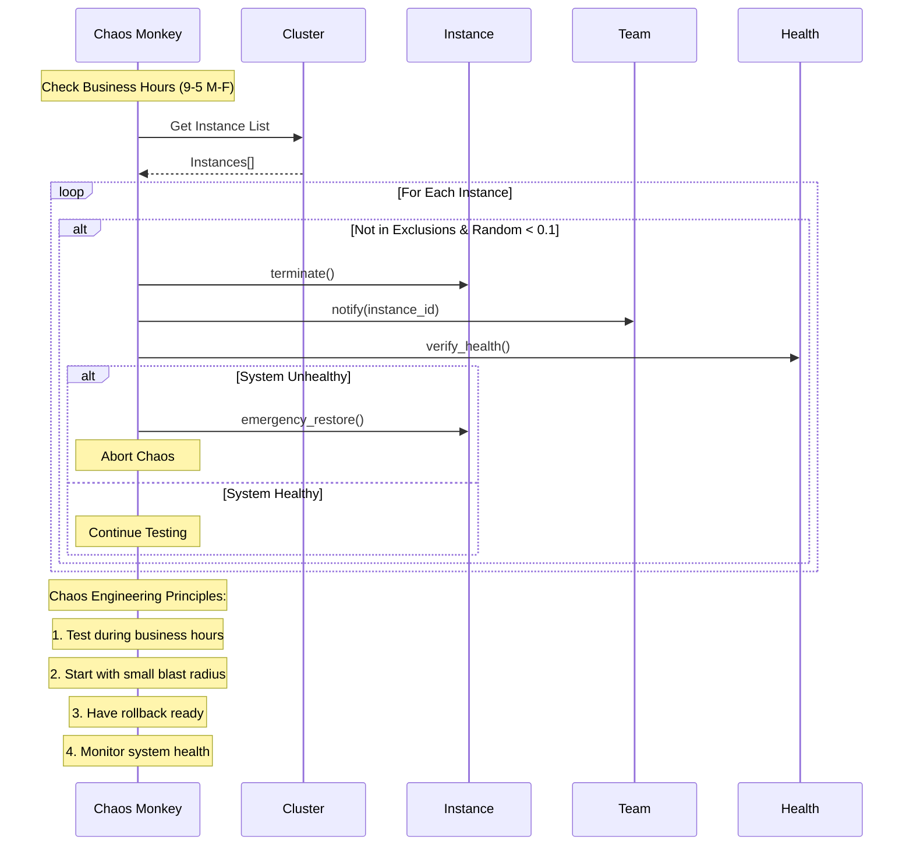

**Netflix's Chaos Principles**:
1. **Build confidence through testing** - Regular failures prevent surprise
2. **Fail during optimal conditions** - Business hours with engineers available
3. **Start small, grow scope** - Instance → Service → Region
4. **Automate everything** - Including failure injection

### 🎯 Decision Framework: Control Strategy


### Advanced Pattern: Adaptive Control

Systems that learn and adjust their control parameters based on observed behavior.

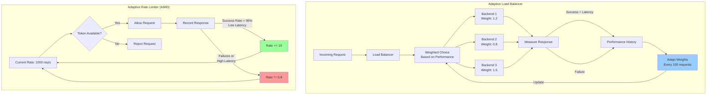

### Production Anti-Patterns

Learn from common control system failures:

```mermaid
graph LR
    subgraph "Anti-Pattern 1: Aggressive Scaling"
        CPU1[CPU: 85%] -->|Instant| Scale1[+10 instances]
        Scale1 --> CPU2[CPU: 15%]
        CPU2 -->|Instant| Scale2[-10 instances]
        Scale2 --> CPU3[CPU: 85%]
        CPU3 -.->|Oscillation| Scale1
        
        Note1[❌ Oscillation Loop]
    end
    
    subgraph "Better: Damped Response"
        CPU4[CPU: 85%] -->|PID Controller| Smooth[+2 instances]
        Smooth --> CPU5[CPU: 75%]
        CPU5 -->|Wait & Measure| Stable[Stable at 70%]
        
        Note2[✓ Smooth Convergence]
    end
    
    subgraph "Anti-Pattern 2: No Backpressure"
        Req1[1000 req/s] --> Svc1[Service]
        Svc1 -->|Overwhelmed| Slow[Slowing Down]
        Slow -->|More Requests| Crash[Service Crash]
        Crash -->|Cascade| Down[System Down]
        
        Note3[❌ Cascade Failure]
    end
    
    subgraph "Better: Flow Control"
        Req2[1000 req/s] --> Queue[Queue Check]
        Queue -->|Full| Reject[503 Response]
        Queue -->|Space| Process[Process Request]
        Process --> Healthy[Service Healthy]
        
        Note4[✓ Protected Service]
    end
    
    style Scale1 fill:#ff9999
    style Crash fill:#ff6666
    style Stable fill:#99ff99
    style Healthy fill:#99ff99
```

**Common Production Mistakes**:
1. **Oscillation** - Control loop reacts too quickly
2. **Cascade failures** - No circuit breakers between services  
3. **Thundering herd** - All instances retry simultaneously
4. **No backpressure** - Accept requests faster than processing
5. **Alert fatigue** - Too many non-actionable alerts

---

## Level 5: Mastery (Push the Boundaries) 🌴

### The Future: Autonomous Operations

Self-healing systems that require minimal human intervention.

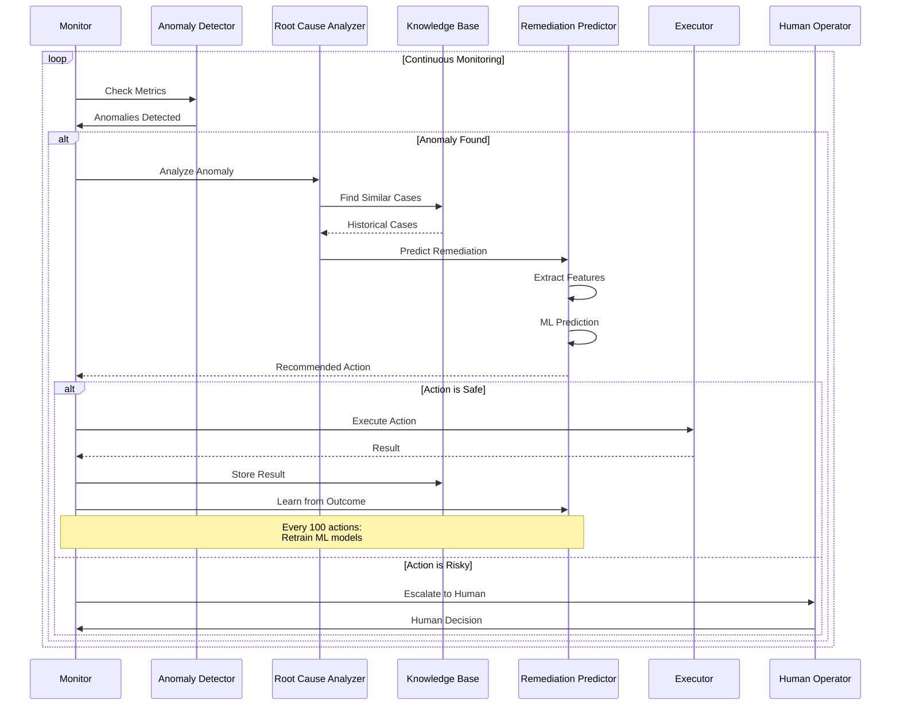

### Control Planes at Scale

Managing millions of containers across thousands of nodes.

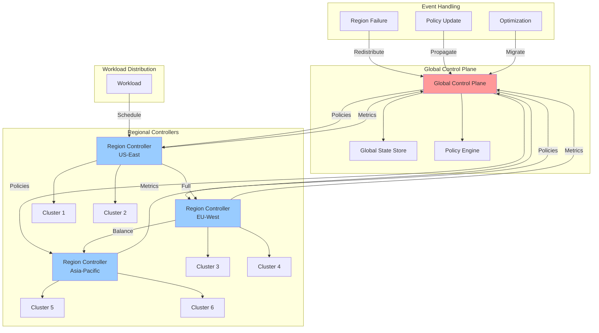

### The Philosophy of Control

Control in distributed systems is about managing complexity through abstraction and automation while maintaining human agency.

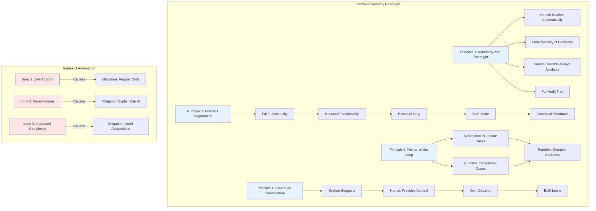

## Summary: Key Insights by Level

### 🌱 Beginner
1. **Control frees humans for important decisions**
2. **Automation handles routine, humans handle exceptions**
3. **Good control needs good observability**

### 🌿 Intermediate
1. **Control paradox: More automation = More critical human role**
2. **Feedback loops essential for stability**
3. **Multiple control levels for different timescales**

### 🌳 Advanced
1. **PID control universal pattern**
2. **Circuit breakers prevent cascades**
3. **Progressive deployment reduces risk**

### 🌲 Expert
1. **Chaos engineering builds confidence**
2. **Adaptive control handles changing conditions**
3. **Control strategy depends on failure modes**

### 🌴 Master
1. **Autonomous operations are coming**
2. **Control plane isolation critical at scale**
3. **Best systems make failures boring**

## Practical Exercises

### Exercise 1: Build Your Own Circuit Breaker 🌱

Create a basic circuit breaker to understand state management:

```mermaid
flowchart LR
    subgraph "Exercise: Implement Circuit Breaker"
        Start[Start] --> Track[Track These:<br/>- Failure count<br/>- Threshold (e.g., 5)<br/>- Recovery timeout<br/>- Last failure time]
        
        Track --> States[Implement States:<br/>CLOSED → OPEN → HALF_OPEN]
        
        States --> Logic[Logic:<br/>- Count failures in CLOSED<br/>- Trip to OPEN at threshold<br/>- Time-based HALF_OPEN<br/>- Reset on success]
    end
```

### Exercise 2: PID Controller Tuning 🌿

Experiment with PID parameters:

| Parameter | Too Low | Just Right | Too High |
|-----------|---------|------------|----------|
| Kp (Proportional) | Slow response | Quick, stable | Overshoot |
| Ki (Integral) | Steady-state error | No drift | Oscillation |
| Kd (Derivative) | No damping | Smooth | Nervous/jittery |

### Exercise 3: Design a Deployment Strategy 🌳

Match deployment strategy to scenario:

| Scenario | Best Strategy | Why |
|----------|--------------|-----|
| Critical financial system | Blue-Green | Instant rollback |
| Large user base | Canary | Gradual risk |
| Microservices mesh | Rolling | Maintain capacity |
| Experimental feature | Feature Flag | User control |

### Exercise 4: Chaos Engineering Plan 🌲

Design chaos experiments for your system:

1. **Start Small**: Random pod deletion in dev
2. **Increase Scope**: Service failures in staging  
3. **Network Chaos**: Latency injection
4. **Data Chaos**: Corrupt responses
5. **Full Region**: Disaster recovery test

### Exercise 5: Alert Design Workshop 🌴

Create actionable alerts:

```mermaid
graph TB
    subgraph "Alert Design Comparison"
        subgraph "Bad Alert ❌"
            B1[CPU > 80%] --> B2["CPU is high"]
            B2 --> B3[Now what?]
            
            BProblems[Problems:<br/>- No context<br/>- No action<br/>- No severity<br/>- No owner]
        end
        
        subgraph "Good Alert ✓"
            G1[p99 Latency > 500ms<br/>for 5 minutes] --> G2[API Latency Degradation]
            G2 --> G3[Current: 750ms]
            G3 --> G4[Endpoints: /api/search]
            G4 --> G5[Runbook Link]
            G5 --> G6[Page api-oncall]
            
            GFeatures[Features:<br/>- User impact clear<br/>- Actionable data<br/>- Runbook provided<br/>- Team assigned]
        end
    end
    
    style B1 fill:#ffcccc
    style G1 fill:#ccffcc
```

## Quick Reference Card

```mermaid
graph TB
    subgraph "Quick Reference: Control Strategies"
        subgraph "Response Time Decision"
            RT{Response Time?}
            RT -->|Seconds| CB[Circuit Breaker<br/>Fail fast, protect]
            RT -->|Minutes| PID[PID Controller<br/>Smooth adjustments]
            RT -->|Hours| HP[Human Process<br/>Runbook + automation]
        end
        
        subgraph "Deployment Strategy"
            Risk{Risk Level?}
            Risk -->|High| BG[Blue-Green<br/>Instant rollback]
            Risk -->|Medium| Can[Canary<br/>Gradual rollout]
            Risk -->|Low| Roll[Rolling<br/>Continuous delivery]
        end
        
        subgraph "Automation Boundaries"
            Auto[Fully Automated]
            Auto --> A1[Scaling within limits]
            Auto --> A2[Health checks]
            Auto --> A3[Load balancing]
            Auto --> A4[Failover]
            
            Human[Human Approval]
            Human --> H1[Capacity expansion]
            Human --> H2[Cross-region failover]
            Human --> H3[Major upgrades]
            Human --> H4[Security incidents]
            
            Only[Human Only]
            Only --> O1[Architecture changes]
            Only --> O2[Vendor selection]
            Only --> O3[Incident command]
            Only --> O4[Business decisions]
        end
        
        subgraph "Control Metrics"
            M1[📊 Stability<br/>Time between oscillations]
            M2[📈 Responsiveness<br/>Time to setpoint]
            M3[📉 Accuracy<br/>Deviation from target]
            M4[🔄 Efficiency<br/>Resources used]
        end
    end
    
    style Auto fill:#ccffcc
    style Human fill:#ffffcc
    style Only fill:#ffcccc
```

### Common Control Patterns

| Pattern | When to Use | Example |
|---------|-------------|---------|
| **Circuit Breaker** | Prevent cascade failures | Database timeouts |
| **Bulkhead** | Isolate failures | Thread pool per service |
| **Retry + Backoff** | Transient failures | Network hiccups |
| **Rate Limiting** | Protect resources | API throttling |
| **Load Shedding** | Overload protection | Drop low-priority requests |
| **Timeout** | Bound wait time | HTTP calls |
| **Deadlines** | End-to-end time limit | Request processing |
| **Compensation** | Undo on failure | Saga pattern |

---

**Next**: [Pillar 5: Intelligence →](../intelligence/index.md)

*"The best control system is one you never notice—until you need it."*
