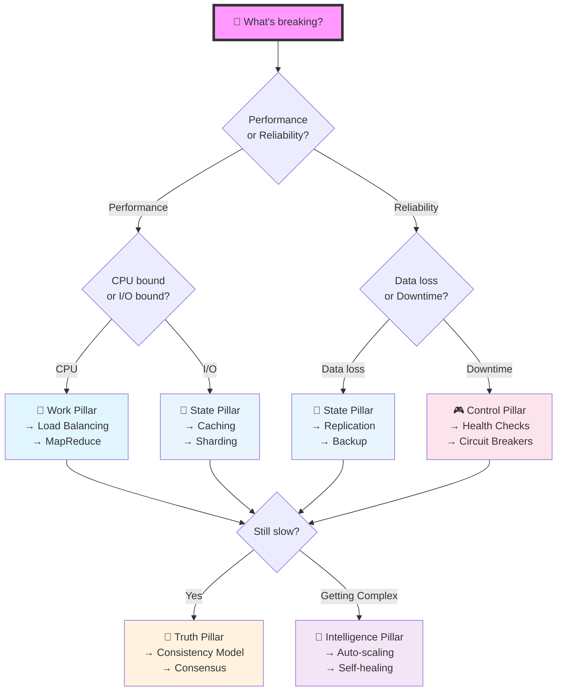
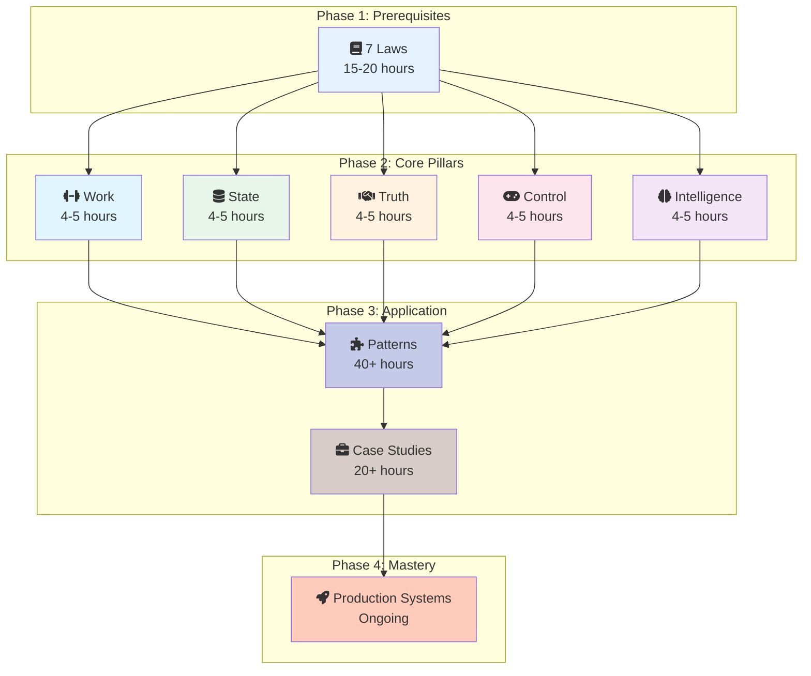
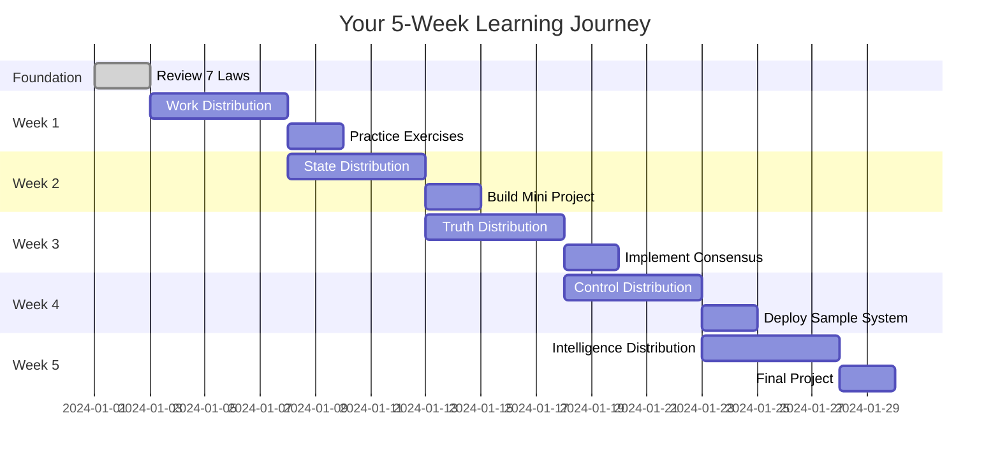

# The 5 Pillars: Your Distributed Systems Survival Kit

[Home](/) > The 5 Pillars > Overview

<div class="axiom-box">
<h2>⚡ The One-Inch Punch</h2>
<p><strong>"Your system is distributed the moment you have 2 computers. Everything after that is damage control."</strong></p>
<p>5 pillars. 95% of problems solved. The rest is implementation details.</p>
</div>

## 🎯 The 30-Second Decision Tree

```
┌─────────────────────────────────────────┐
│         WHAT'S BREAKING?                │
└────────────┬────────────────────────────┘
             │
    ┌────────┴────────┐
    │                 │
┌───▼────┐      ┌────▼────┐
│ SPEED   │      │ UPTIME  │
└───┬─────┘      └────┬────┘
    │                 │
┌───▼────────┐  ┌────▼──────────┐
│ CPU bound? │  │ Data loss?    │
│ → WORK 💪  │  │ → STATE 💾    │
│            │  │               │
│ I/O bound? │  │ Conflicts?    │
│ → STATE 💾 │  │ → TRUTH 🤝    │
└────────────┘  │               │
                │ Can't debug?  │
                │ → CONTROL 🎮  │
                │               │
                │ Too complex?  │
                │ → INTEL 🧠    │
                └───────────────┘
```

<div class="decision-box">
<h3>Your 5-Second Compass</h3>
<ul>
<li><strong>System too slow?</strong> → Start with Work Pillar</li>
<li><strong>Losing data?</strong> → Jump to State Pillar</li>
<li><strong>Conflicts everywhere?</strong> → Learn Truth Pillar</li>
<li><strong>Can't debug prod?</strong> → Master Control Pillar</li>
<li><strong>Drowning in complexity?</strong> → Build Intelligence Pillar</li>
</ul>
</div>

## The 5 Pillars That Rule Them All

| Pillar | The Brutal Truth | The Solution | The Scale |
|--------|------------------|--------------|------------|
| **💪 Work** | One computer = one death point | Split work or die trying | Google: 100B searches/day across 1M+ servers |
| **💾 State** | Hard drives fail. Always. | Copy everything, everywhere | DynamoDB: 10 trillion requests/day, zero data loss |
| **🤝 Truth** | "Eventually consistent" = "eventually wrong" | Make computers agree or accept chaos | Visa: 150M transactions/day, perfect consistency |
| **🎮 Control** | Humans can't manage 10,000 servers | Automate or drown | Kubernetes: Managing 5.6M developers' nightmares |
| **🧠 Intelligence** | 3am pages kill engineers | Systems that fix themselves | Netflix: 1000+ auto-recoveries while you sleep |


## The Shocking Truth: Why These 5 Pillars Exist

```
┌─────────────────────────────────────────────────────┐
│                  THE 7 LAWS                         │
│         (What physics won't let you do)             │
├─────────────────────────────────────────────────────┤
│ 🔴 Failure: "Things break together"                │
│ ⏱️ Time: "No global clock exists"                  │
│ 🌀 Chaos: "Simple → Complex → Dead"                │
│ ⚖️ Trade-offs: "Pick 2 of 3. Always."              │
│ 🧩 Knowledge: "Nobody knows everything"            │
│ 🧠 Humans: "Your brain has 7±2 slots"              │
│ 💰 Economics: "Everything costs something"         │
└──────────────────┬──────────────────────────────────┘
                   │
                   ▼
┌─────────────────────────────────────────────────────┐
│                 THE 5 PILLARS                       │
│           (How to build anyway)                     │
├─────────────────────────────────────────────────────┤
│ 💪 Work: Distribute load before it kills you       │
│ 💾 State: Keep data alive when servers die         │
│ 🤝 Truth: Get agreement in a lying world           │
│ 🎮 Control: Manage chaos without losing sanity     │
│ 🧠 Intelligence: Build systems smarter than you    │
└─────────────────────────────────────────────────────┘
```

<div class="truth-box">
<h3>The Uncomfortable Reality</h3>
<p>Every distributed system is a negotiation with physics. The laws tell you what you can't have. The pillars show you what you can build instead.</p>
</div>

## The Pattern Selection Matrix

```
┌─────────────────────────────────────────────────────────────┐
│ YOUR NIGHTMARE          │ START HERE │ THEN ADD  │ ENDGAME  │
├─────────────────────────┼────────────┼───────────┼───────────┤
│ "CPU at 100%"          │ 💪 Work    │ 💾 State  │ ∞ Scale   │
│ "Database on fire"     │ 💾 State   │ 🤝 Truth  │ Sharding  │
│ "Who has the real data"│ 🤝 Truth   │ 🎮 Control│ Consensus │
│ "Can't see what broke" │ 🎮 Control │ 🧠 Intel  │ Self-heal │
│ "Pagers never stop"    │ 🧠 Intel   │ 💪 Work   │ Auto-fix  │
└─────────────────────────────────────────────────────────────┘
```

<div class="failure-vignette">
<h3>⚠️ The $10M Mistake Pattern</h3>
<p><strong>Company X</strong> tried to solve a Work problem with a Truth solution. They implemented complex consensus for a simple scale issue. Result: 10x latency, 100x cost, 0x improvement.</p>
<p><strong>Lesson</strong>: Pick the right pillar or pay the price.</p>
</div>


## Visual Decision Tree: Pattern Selection



## The Pillar Combination Playbook

```
┌────────────────────────────────────────────────────────────┐
│           PILLAR POWER COMBOS (Tested in Battle)           │
├────────────────────────────────────────────────────────────┤
│                                                            │
│ 💪 + 💾 = SPEED DEMON                                      │
│ Work + State                                               │
│ ├─ Pattern: Stateless workers + Redis cache               │
│ ├─ Scale: 1M requests/sec                                 │
│ └─ Used by: Twitter, Pinterest                            │
│                                                            │
│ 💾 + 🤝 = NEVER LOSE DATA                                  │
│ State + Truth                                              │
│ ├─ Pattern: Multi-Paxos replication                       │
│ ├─ Guarantee: Zero data loss                              │
│ └─ Used by: Google Spanner, CockroachDB                   │
│                                                            │
│ 🎮 + 🧠 = SELF-DRIVING INFRASTRUCTURE                      │
│ Control + Intelligence                                     │
│ ├─ Pattern: Kubernetes + ML auto-scaling                  │
│ ├─ Result: 70% fewer incidents                            │
│ └─ Used by: Netflix, Uber                                 │
│                                                            │
│ ALL 5 = THE HOLY GRAIL                                    │
│ ├─ Pattern: Full autonomous system                        │
│ ├─ Complexity: ████████████ (Don't try at home)          │
│ └─ Achieved by: Google Borg, Facebook Tupperware          │
└────────────────────────────────────────────────────────────┘
```


!!! tip "Pro Tip"
    Start with one pillar. Master it. Then add complexity. 
    Most systems fail from premature optimization, not simplicity.

## The 5-Minute Architecture Review

Use this checklist for any distributed system:

**☑️ Work Distribution**
- [ ] Load balancing strategy?
- [ ] Scaling triggers defined?
- [ ] Batch vs stream processing?

**☑️ State Distribution**  
- [ ] Data partitioning scheme?
- [ ] Replication factor?
- [ ] Backup strategy?

**☑️ Truth Distribution**
- [ ] Consistency model chosen?
- [ ] Conflict resolution strategy?
- [ ] Transaction boundaries?

**☑️ Control Distribution**
- [ ] Health check mechanism?
- [ ] Deployment strategy?
- [ ] Rollback plan?

**☑️ Intelligence Distribution**
- [ ] Auto-recovery mechanisms?
- [ ] Anomaly detection?
- [ ] Learning from failures?

## Pattern Comparison: When to Use What

| Pattern | Use When | Don't Use When | Complexity | Cost |
|---------|----------|----------------|------------|------|
| **Load Balancer** | Traffic > 1000 req/s | < 100 req/s | Low | $ |
| **Sharding** | Data > 1TB | < 100GB | Medium | $$ |
| **Replication** | Need 99.9%+ uptime | Single region OK | Low | $$ |
| **Consensus (Raft)** | Strong consistency required | Eventually consistent OK | High | $$$ |
| **Event Sourcing** | Need audit trail | Simple CRUD | High | $$$ |
| **Service Mesh** | > 10 microservices | Monolith/few services | High | $$$ |
| **Chaos Engineering** | > $1M/hour downtime cost | Non-critical system | Medium | $$ |


## Deep Dive: The Five Pillars

### 1. 💪 Work Distribution: Make Many Hands Light Work

<div class="axiom-box">
<h4>⚡ The Brutal Reality</h4>
<p><strong>"One server = one point of failure. Always."</strong></p>
<p>Your 64-core beast server? It's still ONE failure waiting to happen.</p>
</div>

```
THE WORK DISTRIBUTION DECISION TREE
┌───────────────────────────────────────┐
│ WHAT'S YOUR BOTTLENECK?               │
└───────────┬───────────────────────────┘
            │
    ┌───────┴───────┐
    │              │
┌───▼───┐    ┌───▼───┐
│ CPU?  │    │ I/O?  │
└───┬───┘    └───┬───┘
    │            │
    ▼            ▼
MapReduce    Async Queue
│            │
├─ 20TB/30min├─ 1M msg/sec
├─ Google    ├─ Kafka
└─ 2004      └─ LinkedIn

BURSTY LOAD?
    │
    ▼
Serverless
│
├─ 0→1M scale
├─ Pay per use
└─ AWS Lambda
```

**Real Numbers That Matter**:
- Google: 20TB processed across 1800 machines in 30 minutes (2004)
- AWS Lambda: 0 to 1M concurrent executions in seconds
- Netflix: 1M+ requests/sec across 100,000+ servers

### 2. 💾 State Distribution: Data That Refuses to Die

<div class="failure-vignette">
<h4>💥 The $300M Data Loss</h4>
<p><strong>GitLab (2017)</strong>: Deleted 300GB of production data. No working backups. 6 hours of data gone forever.</p>
<p><strong>Lesson</strong>: "Replicated" ≠ "Backed up" ≠ "Recoverable"</p>
</div>

```
THE CAP THEOREM REALITY CHECK
┌────────────────────────────────────────────────┐
│ PICK 2 (The 3rd Will Haunt You)              │
├───────────────┬────────────────┬───────────────┤
│ CONSISTENCY   │ AVAILABILITY   │ PARTITION     │
│ (C)           │ (A)            │ TOLERANCE (P) │
├───────────────┼────────────────┼───────────────┤
│ CP: Banking   │ ✓              │ ✓             │
│ Lose: Uptime  │                │               │
│ "ATM offline" │                │               │
├───────────────┼────────────────┼───────────────┤
│ AP: Social    │                │ ✓             │
│ Lose: Truth   │ ✓              │               │
│ "Likes wrong" │                │               │
├───────────────┼────────────────┼───────────────┤
│ CA: Fantasy   │ ✓              │               │
│ Lose: Reality │                │ ✓             │
│ "Not possible"│                │               │
└───────────────┴────────────────┴───────────────┘
```

**Production Reality**:
- Netflix Cassandra: 200M users, chose AP (availability > consistency)
- Your bank: Chose CP (consistency > availability)
- That startup that died: Chose CA (didn't understand distributed systems)

### 3. 🤝 Truth Distribution: Getting Liars to Agree

<div class="truth-box">
<h4>🎭 The Byzantine Generals Problem</h4>
<p><strong>The Setup</strong>: Generals surrounding a city must coordinate attack. Some are traitors.</p>
<p><strong>The Reality</strong>: Your servers are the generals. Network failures are the traitors.</p>
</div>

```
CONSENSUS ALGORITHMS: PICK YOUR POISON
┌────────────┬─────────────┬───────────┬───────────────┐
│ ALGORITHM  │ TOLERANCE   │ PAIN LEVEL│ REAL USE      │
├────────────┼─────────────┼───────────┼───────────────┤
│ 2PC        │ 0 failures  │ 😊        │ Never in prod │
│            │ (fantasy)   │           │ (or regret it)│
├────────────┼─────────────┼───────────┼───────────────┤
│ Raft       │ (n-1)/2     │ 😐        │ etcd, Consul  │
│            │             │           │ (metadata)    │
├────────────┼─────────────┼───────────┼───────────────┤
│ Paxos      │ (n-1)/2     │ 🤯        │ Chubby, Zab   │
│            │             │           │ (Google scale)│
├────────────┼─────────────┼───────────┼───────────────┤
│ Byzantine  │ (n-1)/3     │ 😱        │ Blockchain    │
│            │ + crypto    │           │ (when trust=0)│
└────────────┴─────────────┴───────────┴───────────────┘
```

**Google's Answer**: Spanner + TrueTime = Global consistency with atomic clocks

### 4. 🎮 Control Distribution: Herding Cats at Scale

<div class="failure-vignette">
<h4>🎪 The Circus Fire</h4>
<p><strong>Knight Capital (2012)</strong>: Deployed to 7 of 8 servers. The 8th had old code. Lost $460M in 45 minutes.</p>
<p><strong>Lesson</strong>: "Mostly deployed" = "Completely broken"</p>
</div>

```
ORCHESTRATION VS CHOREOGRAPHY
┌─────────────────────────────────────────────────────┐
│              THE CONTROL PLANE DILEMMA              │
├─────────────────────────┬───────────────────────────┤
│ ORCHESTRATION 🎭           │ CHOREOGRAPHY 💃             │
│ (Central brain)           │ (Distributed dance)         │
├─────────────────────────┼───────────────────────────┤
│ Control:    █████        │ Control:    █░░░░          │
│ Flexibility:█░░░░        │ Flexibility:█████          │
│ Debugging:  █████        │ Debugging:  █░░░░          │
│ Scale:      ███░░        │ Scale:      █████          │
├─────────────────────────┼───────────────────────────┤
│ Example: Kubernetes       │ Example: Event streams      │
│ "I am the boss"           │ "We figure it out"          │
│ 5.6M developers           │ Netflix, Uber               │
└─────────────────────────┴───────────────────────────┘
```

### 5. 🧠 Intelligence Distribution: Systems Smarter Than Their Creators

<div class="axiom-box">
<h4>🤖 The Automation Paradox</h4>
<p><strong>"The more you automate, the more devastating human errors become."</strong></p>
<p>Your smart system is only as smart as its dumbest assumption.</p>
</div>

```
INTELLIGENCE MATURITY LADDER
┌───────────────────────────────────────────────────┐
│ LEVEL 5: SELF-EVOLVING                           │
│ └─ Learns from every incident                   │
│   └─ Google Borg: "We don't operate it anymore" │
├───────────────────────────────────────────────────┤
│ LEVEL 4: SELF-HEALING                            │
│ └─ Fixes problems without waking you            │
│   └─ Netflix: 1000+ auto-recoveries/day         │
├───────────────────────────────────────────────────┤
│ LEVEL 3: PREDICTIVE                              │
│ └─ Acts before problems occur                   │
│   └─ AWS: Pre-scales for Black Friday           │
├───────────────────────────────────────────────────┤
│ LEVEL 2: REACTIVE                                │
│ └─ Responds to current conditions               │
│   └─ Basic auto-scaling: "CPU > 80% = scale"    │
├───────────────────────────────────────────────────┤
│ LEVEL 1: ALERTING (You are here 👈)              │
│ └─ Wakes you up at 3am                          │
│   └─ PagerDuty: "Everything is on fire"         │
└───────────────────────────────────────────────────┘
```

**The Chaos Engineering Revolution**:
- Netflix Chaos Monkey: Randomly kills servers in production
- Result: Systems that expect failure and handle it gracefully
- Philosophy: "The best way to avoid failure is to fail constantly"

## Example: How Netflix Serves Your Next Episode

<div class="truth-box">
<h3>🎬 The 200ms Magic Show</h3>
<p>From click to play, 5 pillars dance in perfect harmony. Miss one beat = buffering wheel of death.</p>
</div>

```
THE NETFLIX PILLAR SYMPHONY (200ms total)
┌───────────────────────────────────────────────────────────┐
│ USER CLICKS PLAY                                          │
└─────────────────────┬─────────────────────────────────────┘
                      │
    ┌─────────────────▼─────────────────┐
    │ 💪 WORK (5ms)                     │
    │ ├─ Find nearest of 200,000 servers│
    │ ├─ Route through optimal CDN      │
    │ └─ Balance load across regions    │
    └─────────────────┬─────────────────┘
                      │
    ┌─────────────────▼─────────────────┐
    │ 💾 STATE (50ms)                   │
    │ ├─ Check 10TB edge cache         │
    │ ├─ Fallback to regional cache     │
    │ └─ Stream first 10 seconds       │
    └─────────────────┬─────────────────┘
                      │
    ┌─────────────────▼─────────────────┐
    │ 🤝 TRUTH (30ms)                   │
    │ ├─ Sync viewing position globally │
    │ ├─ Update recommendation engine   │
    │ └─ Bill watch time to account     │
    └─────────────────┬─────────────────┘
                      │
    ┌─────────────────▼─────────────────┐
    │ 🎮 CONTROL (ongoing)              │
    │ ├─ Monitor 1000 quality metrics   │
    │ ├─ Detect ISP throttling          │
    │ └─ Switch servers if degraded     │
    └─────────────────┬─────────────────┘
                      │
    ┌─────────────────▼─────────────────┐
    │ 🧠 INTELLIGENCE (115ms)           │
    │ ├─ Predict next 30s bandwidth     │
    │ ├─ Pre-buffer based on behavior   │
    │ └─ Adjust quality before you notice│
    └─────────────────┬─────────────────┘
                      │
                      ▼
         VIDEO PLAYS FLAWLESSLY
         (Or someone gets fired)
```

## Real-World Tech Stack Mapping

| Layer | AWS | Google Cloud | Azure | Open Source |
|-------|-----|--------------|-------|-------------|
| 💪 Work | Lambda, ECS | Cloud Run, GKE | Functions, AKS | Kubernetes |
| 💾 State | DynamoDB, S3 | Firestore, GCS | CosmosDB, Blob | Cassandra |
| 🤝 Truth | DynamoDB Transactions | Spanner | CosmosDB | etcd, Consul |
| 🎮 Control | CloudWatch, Systems Manager | Stackdriver, Anthos | Monitor, Arc | Prometheus |
| 🧠 Intelligence | SageMaker | Vertex AI | ML Studio | Kubeflow |


## 🏯 Your Personalized Learning Path

### Choose Your Journey Based on Experience

<div class="grid cards" markdown>

- :material-school:{ .lg .middle } **New Graduate (0-2 years)**
    
    ---
    
    **Path**: Linear progression  
    **Order**: Work → State → Truth → Control → Intelligence  
    **Time**: 5-6 weeks  
    **Focus**: Build foundation systematically  
    
    [🚀 Start with Work Distribution](work/index.md)

- :material-code-tags:{ .lg .middle } **Senior Engineer (3-5 years)**
    
    ---
    
    **Path**: Problem-focused  
    **Order**: Truth → State → Intelligence  
    **Time**: 3-4 weeks  
    **Focus**: Fill knowledge gaps  
    
    [🎯 Jump to Truth Distribution](truth/index.md)

- :material-account-tie:{ .lg .middle } **Engineering Manager**
    
    ---
    
    **Path**: Operations-first  
    **Order**: Control → Intelligence → Work  
    **Time**: 3-4 weeks  
    **Focus**: Team productivity & reliability  
    
    [🎮 Start with Control](control/index.md)

- :material-city:{ .lg .middle } **System Architect (5+ years)**
    
    ---
    
    **Path**: Holistic view  
    **Order**: All pillars in parallel  
    **Time**: 2-3 weeks intensive  
    **Focus**: Pattern interactions  
    
    [📊 View All Pillars](#the-5-minute-architecture-review)

</div>

### Visual Learning Flow



## 🎯 Next Steps: Your Action Plan

### 🚀 Quick Start Guide

!!! success "30-Second Decision Tree"
    1. **Struggling with scale?** → Start with [💪 Work](work/index.md)
    2. **Losing data?** → Jump to [💾 State](state/index.md)  
    3. **Conflicts everywhere?** → Learn [🤝 Truth](truth/index.md)
    4. **Can't debug prod?** → Master [🎮 Control](control/index.md)
    5. **Too many alerts?** → Build [🧠 Intelligence](intelligence/index.md)

### 📊 Progress Tracker

<div class="grid cards" markdown>

- :material-progress-check:{ .lg .middle } **Track Your Learning**
    
    ---
    
    **Pillar Checklist**:
    - [ ] 💪 Work - Load balancing, scaling
    - [ ] 💾 State - Sharding, replication
    - [ ] 🤝 Truth - Consensus, consistency
    - [ ] 🎮 Control - Orchestration, deployment
    - [ ] 🧠 Intelligence - Auto-scaling, self-healing
    
    **Milestone Goals**:
    - [ ] Complete 1 pillar (1 week)
    - [ ] Apply to real project (2 weeks)
    - [ ] Complete all pillars (5 weeks)
    - [ ] Build something (6 weeks)

- :material-trophy:{ .lg .middle } **Success Metrics**
    
    ---
    
    **You're ready when you can**:
    ✓ Explain each pillar in 2 minutes
    ✓ Identify pillars in any architecture
    ✓ Choose right pillar for problems
    ✓ Combine pillars effectively
    
    **Next Level**:
    ✓ Design with all 5 pillars
    ✓ Predict failure modes
    ✓ Optimize trade-offs
    ✓ Teach others

</div>

### 🎓 Recommended Learning Sequence



[**→ Begin Your Journey with Work Distribution**](work/index.md)

---

## 🔗 Quick Links

**Foundations**: [7 Laws](part1-axioms) | [Patterns](patterns) | [Case Studies](case-studies)

**By Problem**:
- **Scale**: [Load Balancing](patterns/load-balancing) | [Sharding](patterns/sharding) | [Caching](patterns/caching-strategies)
- **Reliability**: Geo-Replication | [Circuit Breaker](patterns/circuit-breaker)
- **Consistency**: [Event Sourcing](patterns/event-sourcing) | [Saga](patterns/saga) | [CQRS](patterns/cqrs)
- **Operations**: Service Mesh (Coming Soon) | [Health Check](patterns/health-check)
- **Intelligence**: [Auto-scaling](patterns/auto-scaling) | [Chaos Engineering](human-factors/chaos-engineering)

---

## The Ultimate Truth About Distributed Systems

<div class="axiom-box">
<h3>⚡ The Final One-Inch Punch</h3>
<p><strong>"Every distributed system is eventually consistent with failure."</strong></p>
<p>The only question is: Will you be ready when it happens?</p>
</div>

```
THE DISTRIBUTED SYSTEMS REALITY CHECK
┌────────────────────────────────────────────────────┐
│ IF YOU REMEMBER NOTHING ELSE, REMEMBER THIS:      │
├────────────────────────────────────────────────────┤
│                                                    │
│ 1. Your system WILL fail                           │
│    └─ Design for it (State + Truth)               │
│                                                    │
│ 2. Your scale WILL change                          │
│    └─ Design for it (Work + State)                │
│                                                    │
│ 3. Your team WILL make mistakes                   │
│    └─ Design for it (Control + Intelligence)      │
│                                                    │
│ 4. Your requirements WILL conflict                 │
│    └─ Design for it (All 5 Pillars)               │
│                                                    │
│ 5. Physics WILL win                                │
│    └─ Accept it (You can't beat light speed)      │
│                                                    │
├────────────────────────────────────────────────────┤
│ MASTER THESE 5 PILLARS OR BE MASTERED BY CHAOS    │
└────────────────────────────────────────────────────┘
```

<div class="decision-box">
<h3>Your Next Move</h3>
<p><strong>Option A</strong>: Continue to the patterns and learn specific implementations</p>
<p><strong>Option B</strong>: Go deeper into one pillar that matches your current pain</p>
<p><strong>Option C</strong>: Build something and learn by breaking it</p>
<p><em>Hint: Option C teaches fastest.</em></p>
</div>

---

## References

¹ [Dean, J., & Ghemawat, S. (2004). MapReduce: Simplified data processing on large clusters](https://research.google/pubs/pub62/)

² [Brewer, E. (2000). Towards robust distributed systems (CAP Theorem)](https://www.cs.berkeley.edu/~brewer/cs262b-2004/PODC-keynote.pdf)

³ [Netflix Tech Blog: Scaling Time Series Data Storage](https://netflixtechblog.com/scaling-time-series-data-storage-part-i-ec2b6d44ba39)

⁴ [Fischer, M. J., Lynch, N. A., & Paterson, M. S. (1985). Impossibility of distributed consensus with one faulty process](https://groups.csail.mit.edu/tds/papers/Lynch/jacm85.pdf)

⁵ [Lamport, L. (1998). The part-time parliament (Paxos)](https://lamport.azurewebsites.net/pubs/lamport-paxos.pdf)

⁶ [Ongaro, D., & Ousterhout, J. (2014). In search of an understandable consensus algorithm (Raft)](https://raft.github.io/raft.pdf)

⁷ [Corbett, J. C., et al. (2012). Spanner: Google's globally distributed database](https://research.google/pubs/pub39966/)

⁸ [Kubernetes: Production-Grade Container Orchestration](https://kubernetes.io/docs/concepts/overview/)

⁹ [Verma, A., et al. (2015). Large-scale cluster management at Google with Borg](https://research.google/pubs/pub43438/)

¹⁰ [Basiri, A., et al. (2016). Chaos Engineering: Building confidence in system behavior through experiments](https://netflixtechblog.com/tagged/chaos-engineering)

*Estimated figures based on publicly available information and company-published data about system scale and performance.

## 🔗 Learning Resources & Community

<div class="grid cards" markdown>

- :material-book-education:{ .lg .middle } **Study Materials**
    
    ---
    
    📚 [Recommended Books](reference/#books)  
    🎬 [Video Lectures](reference/#videos)  
    🗞️ [Interactive Tools](tools/)  
    🧪 [Hands-on Labs](examples/)  

- :material-account-group:{ .lg .middle } **Join the Community**
    
    ---
    
    👥 [Discussion Forum](#)  
    💬 [Discord Server](#)  
    🐦 [Twitter Community](#)  
    👨‍💻 [GitHub Contributors](#)  

</div>

---

<div class="page-nav" markdown>
[:material-arrow-left: The 7 Laws](part1-axioms) | 
[:material-arrow-up: Home](/) | 
[:material-arrow-right: Pillar 1: Work](part2-pillars/work/index)
</div>