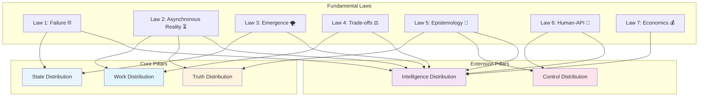
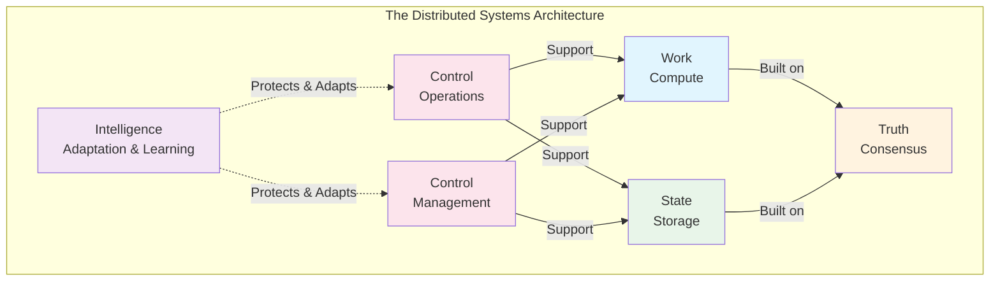
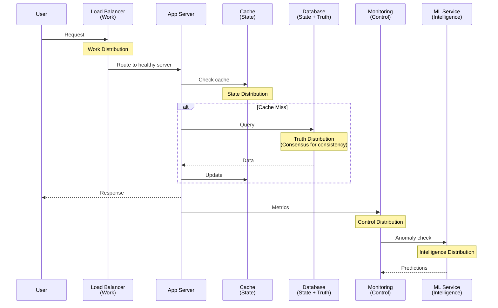

<!-- Navigation -->
[Home](../introduction/index.md) → [Part II: Pillars](index.md) → **Part II: Foundational Pillars**

# Part II: Foundational Pillars

**Learning Objective**: Understand how laws combine to create fundamental architectural patterns.

## Why Pillars?

The laws teach us *what* constrains distributed systems. The pillars teach us *how* to work within those constraints.

Think of it this way: if laws are Newton's laws of motion, then pillars are aerospace engineering. Physics constrains what's possible; engineering shows us how to achieve it.

## The Emergence Principle

```dockerfile
Laws = Constraints (what you cannot change)
Pillars = Patterns (how you work within constraints)

Just as chemistry emerges from physics, and biology from chemistry,
distributed system patterns emerge from fundamental constraints.
```

## From Constraints to Capabilities

The seven fundamental laws reveal inescapable limits:
- Law 1: Failure ⛓️ - Components fail together in unexpected ways
- Law 2: Asynchronous Reality ⏳ - Time and causality are relative
- Law 3: Emergence 🌪️ - Complex behavior emerges from simple rules
- Law 4: Trade-offs ⚖️ - You can't optimize everything
- Law 5: Epistemology 🧠 - Information is fragmented and stale
- Law 6: Human-API 🤯 - Human capacity is the ultimate constraint
- Law 7: Economics 💰 - Everything has a cost

But within these constraints, we can build remarkable systems. The five pillars show us how:

## The Three Core + Two Extension Model



## Why These Five?

**Coverage Analysis**:
```text
System Aspect               Covered By Pillar
-------------               -----------------
Request handling           → Work Distribution
Data persistence          → State Distribution
Consistency               → Truth Distribution
Operations                → Control Distribution
Adaptation                → Intelligence Distribution

Completeness check: ✓ All aspects covered
Minimality check: ✓ No redundant pillars
Orthogonality check: ✓ Pillars independent
```

**Historical Evolution**:
```yaml
1960s: Mainframes (no distribution needed)
1970s: Client-server (Work distribution emerges)
1980s: Databases (State distribution emerges)
1990s: Internet (Truth distribution critical)
2000s: Web-scale (Control distribution needed)
2010s: Cloud (All pillars mature)
2020s: AI/Edge (Intelligence distribution emerges)
```

## The Emergence Property

Here's something beautiful: when you master these five pillars, something emerges that's greater than their sum. You develop *systems intuition*—the ability to see how changes ripple through complex architectures, to predict where bottlenecks will form, to design for failures you haven't seen yet.

This intuition is what separates senior engineers from junior ones. It's what lets you walk into a room full of smart people arguing about architecture and quietly suggest the solution that makes everyone say "oh, obviously."

## The Pillar Interaction Model

```text
Work × State = Stateless vs Stateful services
Work × Truth = Consistency models for compute
State × Truth = CAP theorem territory
Control × All = Orchestration patterns
Intelligence × All = Self-healing systems
```

## Mental Model: The Distributed Systems House



## How Pillars Build on Laws

Each pillar respects all seven laws, but typically wrestles most directly with a subset:
- **Work** primarily grapples with [Law 2: Asynchronous Reality](../part1-axioms/axiom2-asynchrony/index.md) and [Law 4: Trade-offs](../part1-axioms/axiom4-tradeoffs/index.md)
- **State** wrestles with [Law 1: Failure](../part1-axioms/axiom1-failure/index.md) and [Law 3: Emergence](../part1-axioms/axiom3-emergence/index.md)
- **Truth** deals with [Law 2: Asynchronous Reality](../part1-axioms/axiom2-asynchrony/index.md) and [Law 5: Epistemology](../part1-axioms/axiom5-epistemology/index.md)
- **Control** balances [Law 5: Epistemology](../part1-axioms/axiom5-epistemology/index.md) and [Law 6: Human-API](../part1-axioms/axiom6-human-api/index.md)
- **Intelligence** emerges from [all laws](../part1-axioms/index.md) working together

## The Five Pillars with Theoretical Foundations

## 1. Work Distribution: Distributing Computation
**Theoretical Foundation**: Load balancing theory, queueing theory (M/M/c models)

**Key Concepts**:
- Load balancing algorithms
- MapReduce and parallel processing
- Service mesh patterns
- Serverless architectures

[Related: Law 2: Asynchronous Reality](../part1-axioms/axiom2-asynchrony/index.md) | [Law 4: Trade-offs](../part1-axioms/axiom4-tradeoffs/index.md) | [Load Balancing Pattern](../patterns/load-balancing.md) | [Serverless Pattern](../patterns/serverless-faas.md)

**Real-World Example**: **Google MapReduce**
In 2004, Google published the MapReduce paper¹, showing how to process 20TB of data across 1800 machines in just 30 minutes. This work distribution pattern spawned Hadoop and revolutionized big data processing.

!!! example "Industry Implementation"
    Google processes exabytes of data daily using descendants of MapReduce, distributing work across hundreds of thousands of machines. The key insight: move computation to data, not data to computation.

## 2. State Distribution: Distributing Data
**Theoretical Foundation**: CAP theorem², consistent hashing, quorum systems

**Key Concepts**:
- Sharding and partitioning strategies
- Replication for fault tolerance
- Consistency models (eventual, strong, causal)
- Distributed storage systems

[Related: Law 1: Failure](../part1-axioms/axiom1-failure/index.md) | [Law 3: Emergence](../part1-axioms/axiom3-emergence/index.md) | [Sharding Pattern](../patterns/sharding.md) | [CDC Pattern](../patterns/cdc.md)

**Real-World Example**: **Apache Cassandra at Netflix**
Netflix uses Cassandra³ to store viewing history for 200+ million users across multiple regions. They chose AP (availability + partition tolerance) over consistency, accepting that viewing history might be slightly out of sync between regions.

!!! info "CAP Theorem in Practice"
    As Brewer's CAP theorem states: "A distributed system cannot simultaneously provide Consistency, Availability, and Partition tolerance"². The State pillar is fundamentally about navigating these trade-offs.

## 3. Truth Distribution: Achieving Consensus
**Theoretical Foundation**: FLP impossibility⁴, Paxos⁵, Raft⁶ consensus algorithms

**Key Concepts**:
- Consensus protocols
- Distributed transactions
- Clock synchronization
- Byzantine fault tolerance

[Related: Law 2: Asynchronous Reality](../part1-axioms/axiom2-asynchrony/index.md) | [Law 5: Epistemology](../part1-axioms/axiom5-epistemology/index.md) | [Event Sourcing Pattern](../patterns/event-sourcing.md) | [Saga Pattern](../patterns/saga.md)

**Real-World Example**: **Google Spanner**
Google Spanner⁷ uses atomic clocks (TrueTime) to achieve globally consistent transactions across continents. It's the first system to provide consistency + availability at global scale by cleverly working around CAP theorem limitations.

!!! warning "FLP Impossibility"
    The Fischer-Lynch-Paterson result⁴ proves that deterministic consensus is impossible in asynchronous systems with even one faulty process. This fundamental limit shapes all consensus protocols.

## 4. Control Distribution: Managing Operations
**Theoretical Foundation**: Control theory, feedback loops, observability theory

**Key Concepts**:
- Orchestration vs choreography
- Service discovery
- Health checking and circuit breaking
- Deployment strategies

[Related: Law 5: Epistemology](../part1-axioms/axiom5-epistemology/index.md) | [Law 6: Human-API](../part1-axioms/axiom6-human-api/index.md) | [Service Mesh Pattern](../patterns/service-mesh.md) | [Circuit Breaker Pattern](../patterns/circuit-breaker.md)

**Real-World Example**: **Kubernetes**
Kubernetes⁸ exemplifies control distribution, managing millions of containers across thousands of nodes. Its control plane continuously reconciles desired state with actual state, handling failures automatically.

!!! example "Control at Scale"
    Google's Borg (Kubernetes' predecessor) manages over 2 billion containers per week⁹, demonstrating how control distribution enables planet-scale operations.

## 5. Intelligence Distribution: Adaptive Systems
**Theoretical Foundation**: Machine learning, control theory, chaos engineering

**Key Concepts**:
- Self-healing systems
- Predictive scaling
- Anomaly detection
- Chaos engineering

[Related: All 7 Laws](../part1-axioms/index.md) | [Auto-Scaling Pattern](../patterns/auto-scaling.md) | [Spotify ML Case Study](../case-studies/spotify-recommendations.md)

**Real-World Example**: **Netflix Chaos Engineering**
Netflix pioneered chaos engineering¹⁰ with Chaos Monkey, deliberately breaking production systems to build resilience. Their intelligent systems detect and route around failures automatically.

!!! success "Intelligence in Action"
    Netflix's adaptive streaming adjusts video quality in real-time based on network conditions, device capabilities, and server load - a perfect example of distributed intelligence.

## Real-World System Analysis

Let's see how a single user request touches all five pillars:



## Industry Framework Alignment

Our five pillars map to well-known industry concepts:

| Our Pillar | Industry Equivalent | Key Technologies |
|------------|-------------------|------------------|
| Work | Compute Layer | Kubernetes, Lambda, MapReduce |
| State | Storage Layer | DynamoDB, Cassandra, S3 |
| Truth | Coordination Layer | ZooKeeper, etcd, Consul |
| Control | Management Plane | Prometheus, Grafana, PagerDuty |
| Intelligence | ML/Adaptive Layer | TensorFlow Serving, Seldon |

This alignment ensures our mental model matches industry practice while providing clearer conceptual boundaries.

## The Journey Ahead

In the following sections, we'll dive deep into each pillar:

1. [**Pillar 1: Work**](work/index.md) - Master load balancing and parallel processing
2. [**Pillar 2: State**](state/index.md) - Navigate CAP theorem and data distribution
3. [**Pillar 3: Truth**](truth/index.md) - Understand consensus and coordination
4. [**Pillar 4: Control**](control/index.md) - Build observable, manageable systems
5. [**Pillar 5: Intelligence**](intelligence/index.md) - Create self-healing architectures

Each pillar builds on the previous ones, so we recommend reading them in order. However, experienced engineers may jump directly to pillars that address their current challenges.

!!! tip "Learning Strategy"
    For each pillar:
    1. **Understand the theory** - Know the fundamental limits
    2. **Study the patterns** - Learn proven solutions
    3. **Analyze real systems** - See how others applied it
    4. **Practice with exercises** - Build intuition through doing

Ready to see how work gets distributed across the planet?

[**→ Continue to Pillar 1: Work Distribution**](work/index.md)

---

## 🔗 Quick Navigation

## From Laws to Pillars
- [7 Fundamental Laws](../part1-axioms/index.md) - The constraints that shape these pillars
- [Law 2: Asynchronous Reality](../part1-axioms/axiom2-asynchrony/index.md) → Work Distribution
- [Law 1: Failure](../part1-axioms/axiom1-failure/index.md) → State Distribution
- [Law 5: Epistemology](../part1-axioms/axiom5-epistemology/index.md) → Truth Distribution
- [Law 6: Human-API](../part1-axioms/axiom6-human-api/index.md) → Control Distribution

## Pillars in Practice
- [CQRS Pattern](../patterns/cqrs.md) - Separating reads and writes (Work + State)
- [Event Sourcing](../patterns/event-sourcing.md) - State as events (State + Truth)
- [Service Mesh](../patterns/service-mesh.md) - Infrastructure for control (Control)
- [Saga Pattern](../patterns/saga.md) - Distributed transactions (Truth + Work)

## Real-World Applications
- [Uber's Work Distribution](../case-studies/uber-location.md) - 40M concurrent users
- [DynamoDB's State Distribution](../case-studies/amazon-dynamo.md) - 99.999% availability
- [PayPal's Truth Distribution](../case-studies/paypal-payments.md) - $1.36T/year processing
- [Spotify's Intelligence Distribution](../case-studies/spotify-recommendations.md) - 5B recommendations/day

---

## References

¹ [Dean, J., & Ghemawat, S. (2004). MapReduce: Simplified data processing on large clusters](https://research.google/pubs/pub62/)

² [Brewer, E. (2000). Towards robust distributed systems (CAP Theorem)](https://www.cs.berkeley.edu/~brewer/cs262b-2004/PODC-keynote.pdf)

³ [Netflix Tech Blog: Scaling Time Series Data Storage](https://netflixtechblog.com/scaling-time-series-data-storage-part-i-ec2b6d44ba39)

⁴ [Fischer, M. J., Lynch, N. A., & Paterson, M. S. (1985). Impossibility of distributed consensus with one faulty process](https://groups.csail.mit.edu/tds/papers/Lynch/jacm85.pdf)

⁵ [Lamport, L. (1998). The part-time parliament (Paxos)](https://lamport.azurewebsites.net/pubs/lamport-paxos.pdf)

⁶ [Ongaro, D., & Ousterhout, J. (2014). In search of an understandable consensus algorithm (Raft)](https://raft.github.io/raft.pdf)

⁷ [Corbett, J. C., et al. (2012). Spanner: Google's globally distributed database](https://research.google/pubs/pub39966/)

⁸ [Kubernetes: Production-Grade Container Orchestration](https://kubernetes.io/docs/concepts/overview/)

⁹ [Verma, A., et al. (2015). Large-scale cluster management at Google with Borg](https://research.google/pubs/pub43438/)

¹⁰ [Basiri, A., et al. (2016). Chaos Engineering: Building confidence in system behavior through experiments](https://netflixtechblog.com/tagged/chaos-engineering)