# Part II: Foundational Pillars

**5 patterns that solve 95% of distributed systems problems.**

!!! success "The Big Idea"
    Laws = Physics (what breaks)
    Pillars = Engineering (how to build anyway)

## Quick Reference: The 5 Pillars

| Pillar | Problem It Solves | Key Pattern | Real Example |
|--------|-------------------|-------------|---------------|
| **Work** 💪 | "Too much for one machine" | Load balancing | Google processes 100B+ searches/day* |
| **State** 💾 | "Data won't fit/survive" | Sharding + replication | DynamoDB: 10 trillion requests/day* |
| **Truth** 🤝 | "Who's right?" | Consensus algorithms | Visa: 150M transactions/day* |
| **Control** 🎮 | "How do I manage this mess?" | Orchestration | Kubernetes: 5.6M developers* |
| **Intelligence** 🧠 | "Can it fix itself?" | Self-healing | Netflix: 1000+ auto-recoveries/day* |

## From Laws to Pillars: The Mapping

```mermaid
graph LR
    subgraph "7 Laws (Problems)"
        L1["🔴 Failure<br/>Things break together"]
        L2["⏱️ Time<br/>No global clock"]
        L3["🌀 Chaos<br/>Simple→Complex"]
        L4["⚖️ Trade-offs<br/>Pick 2 of 3"]
        L5["🧩 Knowledge<br/>Partial views"]
        L6["🧠 Humans<br/>Limited capacity"]
        L7["💰 Economics<br/>Everything costs"]
    end
    
    subgraph "5 Pillars (Solutions)"
        P1["💪 Work<br/>Distribute load"]
        P2["💾 State<br/>Distribute data"]
        P3["🤝 Truth<br/>Agree on facts"]
        P4["🎮 Control<br/>Manage complexity"]
        P5["🧠 Intelligence<br/>Adapt and heal"]
    end
    
    L2 & L4 --> P1
    L1 & L3 --> P2
    L2 & L5 --> P3
    L5 & L6 --> P4
    L1 & L2 & L3 & L4 & L5 & L6 & L7 --> P5
    
    style P1 fill:#e1f5fe
    style P2 fill:#e8f5fe
    style P3 fill:#fff3e0
    style P4 fill:#fce4ec
    style P5 fill:#f3e5f5
```



## Decision Matrix: Which Pillar Do You Need?

| Your Problem | Primary Pillar | Secondary Pillar | Pattern to Start With |
|--------------|----------------|------------------|----------------------|
| "System too slow" | Work | State | Load Balancer → Caching |
| "Can't handle load" | Work | Control | Horizontal Scaling → Auto-scaling |
| "Data keeps getting lost" | State | Truth | Replication → Consensus |
| "Updates conflict" | Truth | State | Event Sourcing → CQRS |
| "Can't debug failures" | Control | Intelligence | Observability → Chaos Testing |
| "Too many false alarms" | Intelligence | Control | ML Anomaly Detection → SLOs |
| "Costs out of control" | Intelligence | Work | Auto-scaling → Spot Instances |

## Visual Decision Tree: Pattern Selection

```mermaid
graph TD
    Start["🤔 What's breaking?"] --> Q1{"Performance<br/>or Reliability?"}
    
    Q1 -->|Performance| P1{"CPU bound<br/>or I/O bound?"}
    Q1 -->|Reliability| R1{"Data loss<br/>or Downtime?"}
    
    P1 -->|CPU| W1["💪 Work Pillar<br/>→ Load Balancing<br/>→ MapReduce"]
    P1 -->|I/O| S1["💾 State Pillar<br/>→ Caching<br/>→ Sharding"]
    
    R1 -->|Data loss| S2["💾 State Pillar<br/>→ Replication<br/>→ Backup"]
    R1 -->|Downtime| C1["🎮 Control Pillar<br/>→ Health Checks<br/>→ Circuit Breakers"]
    
    W1 --> Check{"Still slow?"}
    S1 --> Check
    S2 --> Check
    C1 --> Check
    
    Check -->|Yes| T1["🤝 Truth Pillar<br/>→ Consistency Model<br/>→ Consensus"]
    Check -->|Getting Complex| I1["🧠 Intelligence Pillar<br/>→ Auto-scaling<br/>→ Self-healing"]
    
    style Start fill:#f9f,stroke:#333,stroke-width:4px
    style W1 fill:#e1f5fe
    style S1 fill:#e8f5fe
    style S2 fill:#e8f5fe  
    style C1 fill:#fce4ec
    style T1 fill:#fff3e0
    style I1 fill:#f3e5f5
```



## Pillar Interactions: When to Combine

| Combination | Use Case | Example Pattern | Real-World Example |
|-------------|----------|-----------------|--------------------|
| Work + State | High-throughput processing | Stateless workers + shared cache | Redis + Lambda |
| Work + Truth | Distributed transactions | Saga pattern | Payment processing |
| State + Truth | Strong consistency | Multi-Paxos | Google Spanner |
| Control + Work | Auto-scaling | Reactive scaling | Kubernetes HPA |
| Intelligence + All | Self-healing systems | Chaos engineering | Netflix Simian Army |

!!! tip "Pro Tip"
    Start with one pillar. Master it. Then add complexity. 
    Most systems fail from premature optimization, not simplicity.

## The 5-Minute Architecture Review

Use this checklist for any distributed system:

**☑️ Work Distribution**
- [ ] Load balancing strategy?
- [ ] Scaling triggers defined?
- [ ] Batch vs stream processing?

**☑️ State Distribution**  
- [ ] Data partitioning scheme?
- [ ] Replication factor?
- [ ] Backup strategy?

**☑️ Truth Distribution**
- [ ] Consistency model chosen?
- [ ] Conflict resolution strategy?
- [ ] Transaction boundaries?

**☑️ Control Distribution**
- [ ] Health check mechanism?
- [ ] Deployment strategy?
- [ ] Rollback plan?

**☑️ Intelligence Distribution**
- [ ] Auto-recovery mechanisms?
- [ ] Anomaly detection?
- [ ] Learning from failures?

## Pattern Comparison: When to Use What

| Pattern | Use When | Don't Use When | Complexity | Cost |
|---------|----------|----------------|------------|------|
| **Load Balancer** | Traffic > 1000 req/s | < 100 req/s | Low | $ |
| **Sharding** | Data > 1TB | < 100GB | Medium | $$ |
| **Replication** | Need 99.9%+ uptime | Single region OK | Low | $$ |
| **Consensus (Raft)** | Strong consistency required | Eventually consistent OK | High | $$$ |
| **Event Sourcing** | Need audit trail | Simple CRUD | High | $$$ |
| **Service Mesh** | > 10 microservices | Monolith/few services | High | $$$ |
| **Chaos Engineering** | > $1M/hour downtime cost | Non-critical system | Medium | $$ |

## Deep Dive: The Five Pillars

### 1. 💪 Work Distribution

!!! success "One-Line Summary"
    Split big jobs into small parallel tasks.

**Theory**: Load balancing, queueing theory (M/M/c)
**Patterns**: MapReduce, Load Balancing, Serverless
**Laws**: [Asynchrony](/part1-axioms/law2-asynchrony/), [Trade-offs](/part1-axioms/law4-tradeoffs/)

**Quick Decision Guide**:
```
CPU-bound? → MapReduce
I/O-bound? → Async workers  
Bursty? → Serverless
Steady? → Load balancer
```

**Example**: Google MapReduce (2004) - 20TB across 1800 machines in 30 min¹

### 2. 💾 State Distribution

!!! success "One-Line Summary"
    Keep data alive and accessible at scale.

**Theory**: CAP theorem², consistent hashing
**Patterns**: Sharding, Replication, CDC
**Laws**: [Failure](/part1-axioms/law1-failure/), [Chaos](/part1-axioms/law3-emergence/)

**CAP Trade-offs**:
| Choose 2 | Sacrifice | Example |
|----------|-----------|----------|
| CP | Availability | Banking |
| AP | Consistency | Social media |
| CA | Partition tolerance | Single datacenter |

**Example**: Netflix Cassandra - 200M users, chose AP over C³

### 3. 🤝 Truth Distribution  

!!! success "One-Line Summary"
    Get distributed nodes to agree on facts.

**Theory**: FLP impossibility⁴, Paxos⁵, Raft⁶
**Patterns**: Event Sourcing, Saga, 2PC
**Laws**: [Asynchrony](/part1-axioms/law2-asynchrony/), [Knowledge](/part1-axioms/law5-epistemology/)

**Consensus Comparison**:
| Algorithm | Fault Tolerance | Complexity | Use Case |
|-----------|----------------|------------|----------|
| 2PC | None | Low | Same datacenter |
| Raft | n/2 - 1 | Medium | Config/metadata |
| Paxos | n/2 - 1 | High | Core infrastructure |
| PBFT | n/3 - 1 | Very High | Blockchain |

**Example**: Google Spanner - TrueTime for global consistency⁷

### 4. 🎮 Control Distribution

!!! success "One-Line Summary" 
    Keep the circus running without a ringmaster.

**Theory**: Control theory, observability
**Patterns**: Service Mesh, Circuit Breakers, Blue-Green
**Laws**: [Knowledge](/part1-axioms/law5-epistemology/), [Human API](/part1-axioms/law6-human-api/)

**Orchestration vs Choreography**:
| Approach | Control | Flexibility | Debugging | Example |
|----------|---------|-------------|-----------|----------|
| Orchestration | Central | Low | Easy | Kubernetes |
| Choreography | Distributed | High | Hard | Event-driven |

**Example**: Kubernetes manages 5.6M developers' apps⁸

### 5. 🧠 Intelligence Distribution

!!! success "One-Line Summary"
    Systems that learn, adapt, and heal themselves.

**Theory**: ML systems, chaos engineering
**Patterns**: Auto-scaling, Self-healing, Chaos testing  
**Laws**: [All 7 Laws](/part1-axioms/) combined

**Intelligence Maturity Levels**:
| Level | Capability | Example |
|-------|------------|----------|
| 1 | Alerts | "CPU > 80%" |
| 2 | Auto-scaling | Scale on metrics |
| 3 | Predictive | Scale before spike |
| 4 | Self-healing | Fix without humans |
| 5 | Self-optimizing | Improve over time |

**Example**: Netflix Chaos Monkey - breaks prod to build resilience¹⁰

## Example: How Netflix Serves Your Next Episode

```mermaid
graph LR
    U[User clicks play] --> W["💪 Work<br/>CDN routes to<br/>nearest server"]
    W --> S["💾 State<br/>Fetch video<br/>from cache"]
    S --> T["🤝 Truth<br/>Update viewing<br/>position"]
    T --> C["🎮 Control<br/>Monitor stream<br/>health"]
    C --> I["🧠 Intelligence<br/>Predict bandwidth<br/>adjust quality"]
    I --> U
    
    style W fill:#e1f5fe
    style S fill:#e8f5fe
    style T fill:#fff3e0
    style C fill:#fce4ec
    style I fill:#f3e5f5
```



**What happens in 200ms**:
1. **Work**: Load balancer picks optimal server (5ms)
2. **State**: Fetch from geographically closest cache (50ms)
3. **Truth**: Record viewing position across regions (30ms)
4. **Control**: Health checks, metrics collection (ongoing)
5. **Intelligence**: ML adjusts bitrate for your connection (115ms)

## Real-World Tech Stack Mapping

| Layer | AWS | Google Cloud | Azure | Open Source |
|-------|-----|--------------|-------|-------------|
| 💪 Work | Lambda, ECS | Cloud Run, GKE | Functions, AKS | Kubernetes |
| 💾 State | DynamoDB, S3 | Firestore, GCS | CosmosDB, Blob | Cassandra |
| 🤝 Truth | DynamoDB Transactions | Spanner | CosmosDB | etcd, Consul |
| 🎮 Control | CloudWatch, Systems Manager | Stackdriver, Anthos | Monitor, Arc | Prometheus |
| 🧠 Intelligence | SageMaker | Vertex AI | ML Studio | Kubeflow |

## Your Learning Path

```mermaid
graph LR
    Start[Start Here] --> Assessment{Your Role?}
    
    Assessment -->|New Grad| Path1[Work → State → Truth → Control → Intelligence]
    Assessment -->|Senior Eng| Path2[Truth → State → Intelligence]
    Assessment -->|Manager| Path3[Control → Intelligence → Work]
    Assessment -->|Architect| Path4[All pillars in parallel]
    
    style Start fill:#f9f,stroke:#333,stroke-width:4px
    style Path1 fill:#e1f5fe
    style Path2 fill:#fff3e0
    style Path3 fill:#fce4ec
    style Path4 fill:#f3e5f5
```



!!! success "30-Second Action Plan"
    1. **Struggling with scale?** → Start with [💪 Work](work/index.md)
    2. **Losing data?** → Jump to [💾 State](state/index.md)  
    3. **Conflicts everywhere?** → Learn [🤝 Truth](truth/index.md)
    4. **Can't debug prod?** → Master [🎮 Control](control/index.md)
    5. **Too many alerts?** → Build [🧠 Intelligence](intelligence/index.md)

[**→ Start Your Journey**](work/index.md)

---

## 🔗 Quick Links

**Foundations**: [7 Laws](/part1-axioms/) | [Patterns](/patterns/) | [Case Studies](/case-studies/)

**By Problem**:
- **Scale**: [Load Balancing](/patterns/load-balancing) | [Sharding](/patterns/sharding) | [Caching](/patterns/caching-strategies)
- **Reliability**: Geo-Replication (Coming Soon) | [Circuit Breaker](/patterns/circuit-breaker)
- **Consistency**: [Event Sourcing](/patterns/event-sourcing) | [Saga](/patterns/saga) | [CQRS](/patterns/cqrs)
- **Operations**: Service Mesh (Coming Soon) | [Health Check](/patterns/health-check)
- **Intelligence**: [Auto-scaling](/patterns/auto-scaling) | [Chaos Engineering](/human-factors/chaos-engineering)

---

## References

¹ [Dean, J., & Ghemawat, S. (2004). MapReduce: Simplified data processing on large clusters](https://research.google/pubs/pub62/)

² [Brewer, E. (2000). Towards robust distributed systems (CAP Theorem)](https://www.cs.berkeley.edu/~brewer/cs262b-2004/PODC-keynote.pdf)

³ [Netflix Tech Blog: Scaling Time Series Data Storage](https://netflixtechblog.com/scaling-time-series-data-storage-part-i-ec2b6d44ba39)

⁴ [Fischer, M. J., Lynch, N. A., & Paterson, M. S. (1985). Impossibility of distributed consensus with one faulty process](https://groups.csail.mit.edu/tds/papers/Lynch/jacm85.pdf)

⁵ [Lamport, L. (1998). The part-time parliament (Paxos)](https://lamport.azurewebsites.net/pubs/lamport-paxos.pdf)

⁶ [Ongaro, D., & Ousterhout, J. (2014). In search of an understandable consensus algorithm (Raft)](https://raft.github.io/raft.pdf)

⁷ [Corbett, J. C., et al. (2012). Spanner: Google's globally distributed database](https://research.google/pubs/pub39966/)

⁸ [Kubernetes: Production-Grade Container Orchestration](https://kubernetes.io/docs/concepts/overview/)

⁹ [Verma, A., et al. (2015). Large-scale cluster management at Google with Borg](https://research.google/pubs/pub43438/)

¹⁰ [Basiri, A., et al. (2016). Chaos Engineering: Building confidence in system behavior through experiments](https://netflixtechblog.com/tagged/chaos-engineering)

*Estimated figures based on publicly available information and company-published data about system scale and performance.