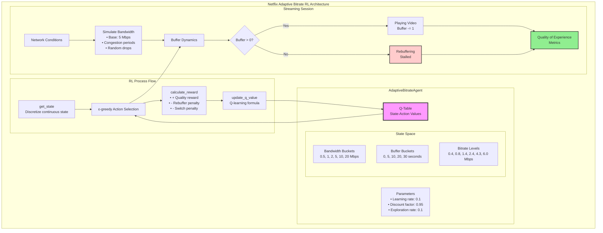
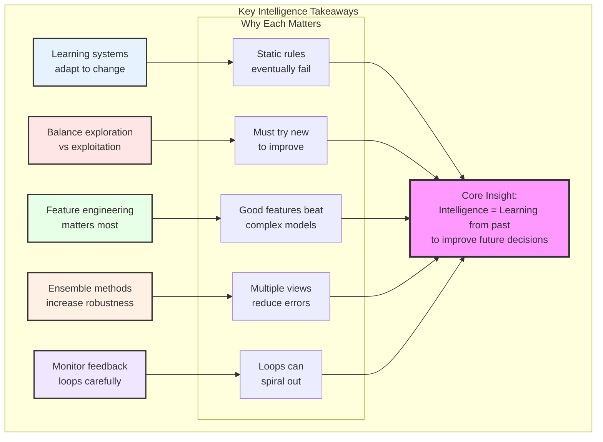

# Intelligence & Learning Examples

## Real-World Case Studies

### 1. Google's Borg: Learning from History

**Problem**: Predict resource requirements for better bin packing

**Solution**: Machine learning on historical usage patterns

```mermaid
graph TB
    subgraph "Google Borg Resource Prediction Architecture"
        subgraph "BorgResourcePredictor"
            JH[Job History<br/>defaultdict(list)]
            Models[Trained Models<br/>per job type]
            
            Record[record_job_execution]
            Train[train_model]
            Predict[predict_resources]
            
            Record --> JH
            JH --> Train
            Train --> Models
            Models --> Predict
        end
        
        subgraph "Data Flow"
            Input[Job Execution Data]
            Input --> Features[Feature Extraction<br/>• Hour of day<br/>• Day of week<br/>• Requested resources<br/>• Job run count]
            Features --> ML[Linear Regression<br/>Models]
            ML --> CPUModel[CPU Usage Model]
            ML --> MemModel[Memory Usage Model]
        end
        
        subgraph "IntelligentScheduler"
            SJ[schedule_job]
            PredUsage[Predicted Usage]
            FragScore[fragmentation_score]
            Placement[Best Fit Placement]
            
            SJ --> PredUsage
            PredUsage --> FragScore
            FragScore --> Placement
        end
        
        subgraph "Prediction Logic"
            NoModel[No Model Yet?]
            NoModel -->|Yes| Heuristic[Use Heuristic<br/>CPU: 70% of requested<br/>Memory: 85% of requested]
            NoModel -->|No| UseTrained[Use Trained Model<br/>with bounds checking]
        end
        
        Models --> SJ
        Predict --> PredUsage
    end
    
    style Models fill:#f9f,stroke:#333,stroke-width:3px
    style Placement fill:#90EE90,stroke:#333,stroke-width:2px
```

### 2. Netflix's Adaptive Streaming: Real-time Quality Optimization

**Problem**: Optimize video quality based on network conditions

**Solution**: Reinforcement learning for bitrate adaptation



### 3. Cloudflare's Intelligent DDoS Mitigation

**Problem**: Distinguish DDoS traffic from legitimate traffic

**Solution**: Adaptive learning with traffic fingerprinting

```mermaid
graph TB
    subgraph "Cloudflare DDoS Mitigation System"
        subgraph "Traffic Analysis"
            Request[Incoming Request]
            Profile[Traffic Profile<br/>per Source IP]
            Features[Feature Extraction]
            
            Request --> Profile
            Profile --> Features
            
            subgraph "Profile Components"
                RR[Request Rates<br/>Sliding window]
                PS[Packet Sizes]
                GD[Geo Distribution]
                UA[User Agents]
                PD[Path Distribution]
            end
            
            subgraph "Statistical Features"
                F1[Request Rate<br/>req/hour]
                F2[Rate Variance]
                F3[Avg Packet Size]
                F4[Geo Entropy]
                F5[UA Entropy]
                F6[Path Entropy]
                F7[Top Geo<br/>Concentration]
            end
        end
        
        subgraph "Anomaly Detection"
            AD[Isolation Forest<br/>Anomaly Detector]
            Trees[100 Isolation Trees]
            Score[Anomaly Score]
            
            Features --> AD
            AD --> Trees
            Trees --> Score
        end
        
        subgraph "Threat Assessment"
            ThreatCalc[calculate_threat_score]
            Rules[Rule-based Scoring<br/>• High request rate: +0.3<br/>• Low UA entropy: +0.2<br/>• Low path entropy: +0.2<br/>• Geo concentration: +0.2<br/>• Regular intervals: +0.3]
            
            Score --> ThreatCalc
            Rules --> ThreatCalc
        end
        
        subgraph "Mitigation Actions"
            Decision{Threat Score}
            Block[Block IP<br/>1 hour]
            Challenge[Progressive Challenge]
            Allow[Allow Traffic]
            
            ThreatCalc --> Decision
            Decision -->|>0.8| Block
            Decision -->|0.5-0.8| Challenge
            Decision -->|<0.5| Allow
            
            subgraph "Challenge Types"
                C1[Level 1:<br/>JavaScript]
                C2[Level 2:<br/>CAPTCHA]
                C3[Level 3+:<br/>Proof of Work]
            end
            
            Challenge --> C1
            Challenge --> C2
            Challenge --> C3
        end
    end
    
    style AD fill:#f9f,stroke:#333,stroke-width:3px
    style Block fill:#ff9999,stroke:#333,stroke-width:2px
    style Allow fill:#90EE90,stroke:#333,stroke-width:2px
```



### 4. Amazon's Predictive Auto-scaling

**Problem**: Scale resources before demand spike hits

**Solution**: Time-series forecasting with multiple signals

```mermaid
graph TB
    subgraph "Amazon Predictive Auto-scaling System"
        subgraph "Data Collection"
            Metrics[System Metrics]
            History[4 Weeks Historical Data<br/>Sliding Window]
            
            Metrics --> History
        end
        
        subgraph "Forecasting Pipeline"
            subgraph "Prophet Model"
                TS[Time Series Data]
                Features[Feature Engineering<br/>• Hour of day<br/>• Day of week<br/>• Is weekend<br/>• Holiday calendar]
                Model[Prophet Model<br/>• Yearly seasonality<br/>• Weekly seasonality<br/>• Daily seasonality<br/>• Custom hourly]
                Forecast[24-hour Forecast<br/>with confidence intervals]
                
                TS --> Features
                Features --> Model
                Model --> Forecast
            end
        end
        
        subgraph "Scaling Decision Logic"
            Peak[Peak Demand<br/>Next 2 hours]
            Calc[Calculate Instances<br/>Target: 80% CPU]
            Safety[Safety Margin<br/>1.2x multiplier]
            Trend[Trend Analysis<br/>Rising quickly?]
            
            Forecast --> Peak
            Peak --> Calc
            Calc --> Safety
            Safety --> Trend
            
            Decision{Scaling Decision}
            Trend --> Decision
            
            ScaleUp[Scale Up<br/>Δ > +10%]
            ScaleDown[Scale Down<br/>Δ < -10%]
            Maintain[Maintain<br/>|Δ| < 10%]
            
            Decision --> ScaleUp
            Decision --> ScaleDown
            Decision --> Maintain
        end
        
        subgraph "Multi-Signal Ensemble"
            P1[Time Series<br/>Weight: 40%]
            P2[Business Events<br/>Weight: 30%]
            P3[External Signals<br/>Weight: 20%]
            P4[ML Model<br/>Weight: 10%]
            
            Ensemble[Weighted Ensemble<br/>Prediction]
            
            P1 --> Ensemble
            P2 --> Ensemble
            P3 --> Ensemble
            P4 --> Ensemble
        end
        
        History --> TS
        Ensemble --> Decision
    end
    
    style Model fill:#f9f,stroke:#333,stroke-width:3px
    style Ensemble fill:#bbf,stroke:#333,stroke-width:3px
    style Decision fill:#fbb,stroke:#333,stroke-width:2px
```

### 5. Adaptive Load Balancing with Multi-Armed Bandits

**Problem**: Route traffic to best performing backend without knowing performance a priori

**Solution**: Thompson Sampling for exploration/exploitation

```mermaid
graph TB
    subgraph "Thompson Sampling Load Balancer"
        subgraph "Core Algorithm"
            Backends[Available Backends]
            Beta[Beta Distribution<br/>Parameters per Backend<br/>α: successes + 1<br/>β: failures + 1]
            Sample[Sample from Beta<br/>for each backend]
            Select[Select backend with<br/>highest sample]
            
            Backends --> Beta
            Beta --> Sample
            Sample --> Select
        end
        
        subgraph "Update Process"
            Request[Route Request]
            Response[Observe Response]
            Update{Success?}
            IncAlpha[Increment α<br/>successes++]
            IncBeta[Increment β<br/>failures++]
            
            Select --> Request
            Request --> Response
            Response --> Update
            Update -->|Yes & Fast| IncAlpha
            Update -->|No or Slow| IncBeta
            
            IncAlpha --> Beta
            IncBeta --> Beta
        end
        
        subgraph "Statistics"
            Stats[Backend Statistics]
            SR[Success Rate<br/>α / (α + β)]
            CI[95% Confidence<br/>Interval]
            Total[Total Requests<br/>α + β - 2]
            
            Beta --> Stats
            Stats --> SR
            Stats --> CI
            Stats --> Total
        end
    end
    
    subgraph "Contextual Bandit Extension"
        Context[Request Context]
        Classify[classify_context]
        
        Mobile[Mobile Context<br/>Bandit]
        Desktop[Desktop Context<br/>Bandit]
        API[API Context<br/>Bandit]
        
        Context --> Classify
        Classify --> Mobile
        Classify --> Desktop
        Classify --> API
        
        Mobile --> Sample
        Desktop --> Sample
        API --> Sample
    end
    
    style Beta fill:#f9f,stroke:#333,stroke-width:3px
    style Select fill:#90EE90,stroke:#333,stroke-width:2px
    style Update fill:#ffcccc,stroke:#333,stroke-width:2px
```

## Learning System Implementations

### 1. Anomaly Detection in Metrics

```mermaid
graph TB
    subgraph "Metric Anomaly Detection System"
        subgraph "Time Series Decomposition"
            Raw[Raw Time Series]
            MA[Moving Average<br/>Extract Trend]
            Detrend[Detrended Data]
            Seasonal[Seasonal Pattern<br/>by Hour of Day]
            Residual[Residuals]
            
            Raw --> MA
            MA --> Trend[Trend Component]
            Raw --> Detrend
            Trend --> Detrend
            Detrend --> Seasonal
            Seasonal --> Residual
        end
        
        subgraph "Anomaly Detection Flow"
            NewPoint[New Data Point]
            Model[Time Series Model<br/>per Metric]
            Predict[predict()<br/>Trend + Seasonal]
            Compare[Compare Actual<br/>vs Predicted]
            StdDev[Calculate Std Dev<br/>of Residuals]
            Check{|Residual| > 3σ?}
            
            NewPoint --> Model
            Model --> Predict
            NewPoint --> Compare
            Predict --> Compare
            Compare --> StdDev
            StdDev --> Check
        end
        
        subgraph "Model Management"
            Window[Sliding Window<br/>2 weeks data]
            Retrain[Retrain every<br/>100 points]
            Models[Model Registry<br/>per metric]
            
            Window --> Retrain
            Retrain --> Models
            Models --> Model
        end
        
        subgraph "Severity Calculation"
            ZScore[Z-Score<br/>|actual - predicted| / σ]
            Severity[Severity Score<br/>min(1.0, z/10)]
            
            Check -->|Yes| ZScore
            ZScore --> Severity
        end
        
        Check -->|No| Normal[Normal]
        Severity --> Anomaly[Anomaly Alert]
    end
    
    style Model fill:#f9f,stroke:#333,stroke-width:3px
    style Check fill:#ffcccc,stroke:#333,stroke-width:2px
    style Anomaly fill:#ff9999,stroke:#333,stroke-width:3px
```

### 2. Intelligent Caching with Learning

```mermaid
graph TB
    subgraph "Intelligent Cache with Learning"
        subgraph "Cache Operations"
            Get[get(key)]
            Put[put(key, value)]
            Hit{Cache Hit?}
            Miss[Cache Miss]
            
            Get --> Hit
            Hit -->|Yes| UpdateStats[Update Access Stats<br/>• Last access time<br/>• Access count<br/>• Access history]
            Hit -->|No| Miss
            Miss --> RecordMiss[Record Miss<br/>for Learning]
        end
        
        subgraph "Eviction Strategy"
            Full{Cache Full?}
            Score[Score Each Item]
            
            Put --> Full
            Full -->|Yes| Score
            
            subgraph "Scoring Factors"
                F1[Frequency<br/>Weight: 0.3]
                F2[Recency<br/>Weight: 0.2]
                F3[Predicted Reuse<br/>Weight: 0.3]
                F4[Value Density<br/>cost/size<br/>Weight: 0.2]
            end
            
            F1 --> FinalScore[Final Score]
            F2 --> FinalScore
            F3 --> FinalScore
            F4 --> FinalScore
            
            FinalScore --> Evict[Evict Lowest<br/>Scoring Item]
        end
        
        subgraph "Pattern Learning"
            Features[Feature Extraction<br/>• Hour of day<br/>• Day of week<br/>• Key prefix<br/>• Key length]
            
            Patterns[Access Patterns<br/>Database]
            
            Predictor[predict_reuse_probability]
            
            Features --> Patterns
            Patterns --> Predictor
            Predictor --> F3
            
            subgraph "Pattern Analysis"
                PK[Pattern Key:<br/>(prefix, hour)]
                Intervals[Reuse Intervals]
                Prob[P(reuse < 5min)]
                
                PK --> Intervals
                Intervals --> Prob
            end
        end
        
        RecordMiss --> Features
        UpdateStats --> Features
        Evict --> LearnEvict[Learn from<br/>Eviction]
    end
    
    style Score fill:#f9f,stroke:#333,stroke-width:3px
    style Predictor fill:#bbf,stroke:#333,stroke-width:3px
    style FinalScore fill:#90EE90,stroke:#333,stroke-width:2px
```

## Key Takeaways



Remember: Intelligence in distributed systems means learning from the past to make better decisions in the future. Start simple and add sophistication as you learn what matters.
