<!-- Navigation -->
[Home](../../introduction/index.md) → [Part II: Pillars](../index.md) → [Intelligence](index.md) → **Intelligence & Learning Exercises**

# Intelligence & Learning Exercises

## Exercise 1: Build a Learning Load Balancer

**Challenge**: Implement a load balancer that learns from response times and error rates.

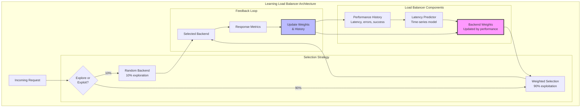

### Implementation Tasks:
1. **Epsilon-Greedy Selection**: Balance exploration (10%) vs exploitation (90%)
2. **Performance Tracking**: Store latency, error rate, success rate per backend
3. **Weight Updates**: Use exponential moving average for smooth adaptation
4. **Decay Old Data**: Give more weight to recent performance
5. **New Backend Handling**: Start with neutral weight, force initial exploration

<details>
<summary>Solution</summary>

### Learning Load Balancer: Visual Architecture

#### 1. Algorithm Overview: Epsilon-Greedy Backend Selection

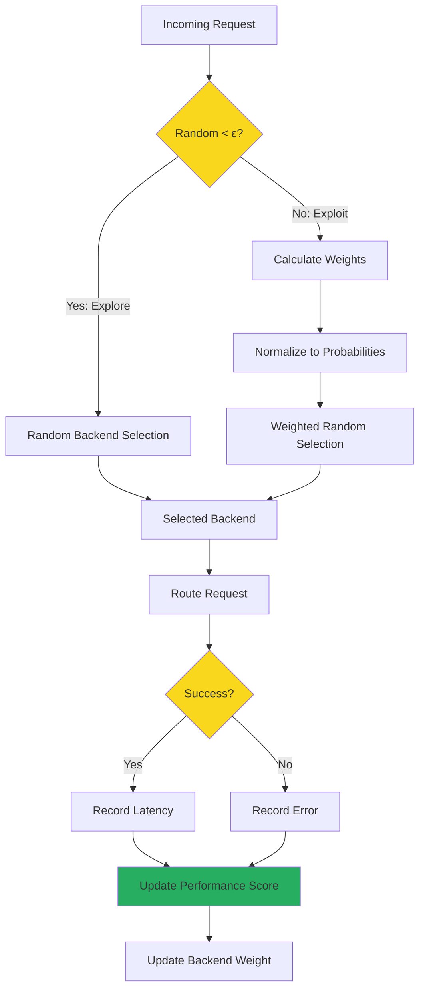

#### 2. Data Structure Components

<div class="truth-box">

**Core Data Structures**

| Component | Structure | Purpose | Size Limit |
|-----------|-----------|---------|------------|
| **Weights** | `{backend: weight}` | Selection probabilities | Dynamic |
| **History** | Per-backend deques | Performance tracking | 1000 entries |
| **Latencies** | `deque[float]` | Response time history | Rolling window |
| **Errors** | `deque[0\|1]` | Success/failure tracking | Rolling window |
| **Timestamps** | `deque[time]` | Time-based filtering | Rolling window |

**Configuration Parameters**

| Parameter | Default | Range | Impact |
|-----------|---------|-------|---------|
| **Learning Rate (α)** | 0.1 | 0.01-0.5 | Weight update speed |
| **Exploration Rate (ε)** | 0.1 | 0.05-0.2 | Random selection frequency |
| **History Window** | 1000 | 100-5000 | Memory vs accuracy |
| **Recent Data Window** | 5 min | 1-15 min | Adaptation speed |

</div>

#### 3. Performance Scoring Visualization

```mermaid
graph LR
    subgraph "Raw Metrics"
        A1[Latency History]
        A2[Error History]
        A3[Timestamps]
    end
    
    subgraph "Time Filter"
        B[Last 5 Minutes]
    end
    
    subgraph "Calculate Scores"
        C1[Error Rate<br/>sum(errors)/count]
        C2[Latency Score<br/>1/(1 + avg/target)]
        C3[Variance Penalty<br/>1/(1 + var/1000)]
    end
    
    subgraph "Weighted Combination"
        D[Final Score]
    end
    
    A1 --> B
    A2 --> B
    A3 --> B
    
    B --> C1
    B --> C2
    B --> C3
    
    C1 -->|50%| D
    C2 -->|30%| D
    C3 -->|20%| D
    
    style D fill:#27ae60
```

**Score Calculation Formula:**
```
Score = 0.5 × (1 - ErrorRate) + 0.3 × LatencyScore + 0.2 × VariancePenalty
```

#### 4. Weight Update Process (Exponential Moving Average)

<div class="decision-box">

**EMA Update Visualization**

```text
Time →
─────────────────────────────────────────────────────►

Old Weight: ━━━━━━━━━━━━━━━━━━━━━━━━━━━━━━━━━━━━
                         ↓
                    (1 - α) × old
                         ↓
New Weight: ━━━━━━━━━━━━━━━━━━━━━━━━━━━━━━━━━━━━━━━
                         ↑
                    α × score
                         ↑
Performance Score: ▬▬▬▬▬▬▬▬▬▬▬▬▬▬▬▬▬▬▬▬▬▬▬▬▬▬▬▬▬▬

Formula: weight_new = (1 - α) × weight_old + α × score
```

**Update Rules:**
- Minimum weight: 0.001 (prevent zero division)
- Normalization: Every 100 requests
- Learning rate α: Controls adaptation speed

</div>

#### 5. Latency Prediction Model

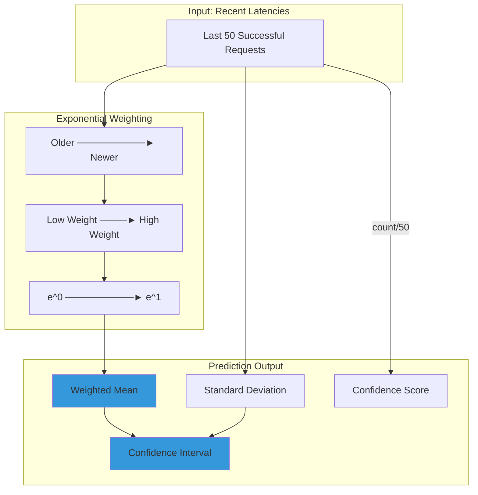

**Prediction Components:**
- **Mean**: Exponentially weighted average
- **Bounds**: Mean ± standard deviation
- **Confidence**: min(sample_size / 50, 1.0)

#### 6. Testing Strategy Visualization

<div class="failure-vignette">

**Simulated Backend Profiles**

| Backend | Base Latency | Error Rate | Variance | Expected Behavior |
|---------|--------------|------------|----------|-------------------|
| Backend1 | 50ms | 1% | ±10ms | Fast & Reliable → High Weight |
| Backend2 | 100ms | 5% | ±30ms | Medium Performance → Medium Weight |
| Backend3 | 200ms | 10% | ±50ms | Slow & Unreliable → Low Weight |

**Learning Progression**

```text
Requests:     0 ────────► 100 ────────► 500 ────────► 1000
              
Backend1:    0.33 ━━━━━━━━━━━━━━━━━━━━━━━━━━━━━━━━━━━━► 0.65
Backend2:    0.33 ━━━━━━━━━━━━━━━━━━━━━━━━━━━━━━━━━━━━► 0.30
Backend3:    0.33 ━━━━━━━━━━━━━━━━━━━━━━━━━━━━━━━━━━━━► 0.05
              
              Equal Start          Learning            Converged
```

</div>

#### 7. Complete System Flow

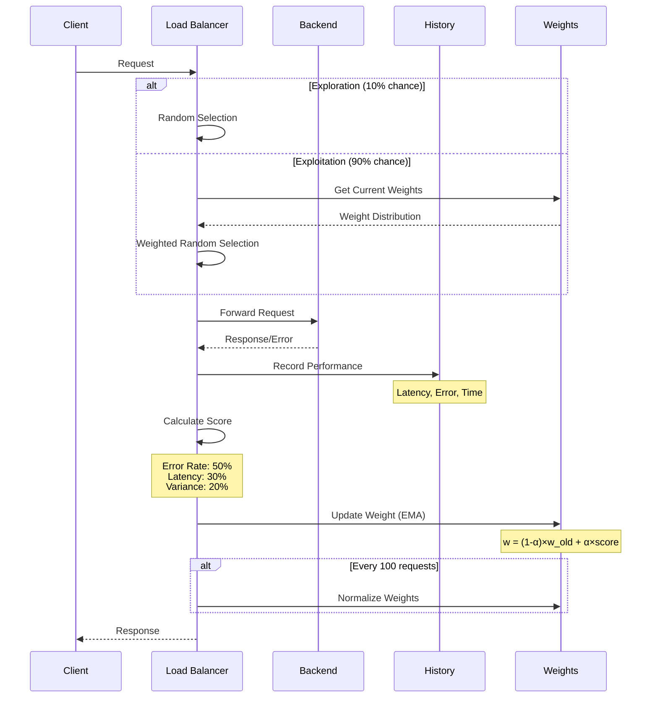

### Key Algorithms Summary

<div class="law-box">

**1. Epsilon-Greedy Selection**
- ε probability: Random exploration
- (1-ε) probability: Weighted exploitation
- Balances learning vs performance

**2. Exponential Moving Average**
- Smooths weight updates
- Prevents oscillation
- Learning rate controls adaptation speed

**3. Multi-Factor Scoring**
- Reliability (50%): Error rate impact
- Performance (30%): Latency optimization
- Consistency (20%): Variance reduction

**4. Time-Windowed Analysis**
- 5-minute recent data window
- 1000-entry rolling history
- Adapts to changing conditions

</div>

</details>

## Exercise 2: Implement Anomaly Detection

**Challenge**: Build a system that learns normal behavior and detects anomalies.

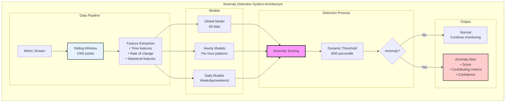

### Implementation Tasks:
1. **Sliding Window**: Maintain recent 1000 data points
2. **Time-based Models**: Separate models for different time periods
3. **Feature Engineering**: Extract time, statistical, and rate-of-change features
4. **Ensemble Scoring**: Combine multiple model outputs
5. **Dynamic Thresholds**: Adapt to changing baselines

<details>
<summary>Solution</summary>

#### 1. Data Preprocessing Pipeline

```mermaid
graph LR
    subgraph "Data Ingestion"
        Raw[Raw Metrics<br/>• CPU, Memory<br/>• Requests/sec<br/>• Response time]
        TS[Add Timestamp<br/>• Unix timestamp<br/>• Extract hour<br/>• Day of week]
    end
    
    subgraph "Feature Engineering"
        Base[Base Features<br/>• Raw metric values<br/>• Time components]
        Temporal[Temporal Features<br/>• Hour (0-23)<br/>• Day (0-6)<br/>• Is weekend<br/>• Minute fraction]
        Rate[Rate of Change<br/>• Δ metrics / Δ time<br/>• Acceleration<br/>• Trend direction]
    end
    
    subgraph "Sliding Window"
        Window[1000-Point Window<br/>deque(maxlen=1000)]
        Stats[Window Statistics<br/>• Mean, std dev<br/>• Percentiles<br/>• Min/max]
    end
    
    subgraph "Normalization"
        Scale[StandardScaler<br/>• Zero mean<br/>• Unit variance<br/>• Per-feature scaling]
        Feature[Feature Vector<br/>Ready for models]
    end
    
    Raw --> TS
    TS --> Base
    Base --> Temporal
    Base --> Rate
    Temporal --> Window
    Rate --> Window
    Window --> Stats
    Stats --> Scale
    Scale --> Feature
    
    style Raw fill:#e6f3ff,stroke:#333,stroke-width:2px
    style Window fill:#f9f,stroke:#333,stroke-width:3px
    style Feature fill:#90EE90,stroke:#333,stroke-width:2px
```

#### 2. Statistical Model Comparison

| Model Type | Purpose | Training Data | Update Frequency | Contamination Rate | Use Case |
|------------|---------|---------------|------------------|--------------------|----------|
| **Global Model** | Baseline anomaly detection | All 1000 points in window | Every 100 points | 5% | General anomalies across all time periods |
| **Hourly Models** | Hour-specific patterns | Points from same hour (min 20) | Every 100 points | 10% | Business hours vs. off-hours patterns |
| **Daily Models** | Day-of-week patterns | Points from same weekday (min 20) | Every 100 points | 10% | Weekday vs. weekend behavior |
| **Ensemble** | Combined scoring | Max score from all models | Real-time | Dynamic percentile | Robust detection across patterns |

**Model Parameters:**
- **Isolation Forest**: 100 estimators (global), 50 (time-specific)
- **Minimum Samples**: 50 for global, 20 for time-specific
- **Score Normalization**: [-0.5, 0.5] → [0, 1] range
- **Threshold**: 95th percentile of recent scores

#### 3. Anomaly Scoring Flowchart

```mermaid
graph TD
    subgraph "Scoring Pipeline"
        Input[New Data Point]
        Extract[Extract Features<br/>• Metrics<br/>• Time features<br/>• Rate of change]
        
        subgraph "Model Scoring"
            Global{Global Model<br/>Exists?}
            GlobalScore[Calculate<br/>Global Score]
            
            Hour{Hourly Model<br/>for Current Hour?}
            HourScore[Calculate<br/>Hourly Score]
            
            Day{Daily Model<br/>for Current Day?}
            DayScore[Calculate<br/>Daily Score]
        end
        
        Combine[Combine Scores<br/>score = max(all scores)]
        
        subgraph "Threshold Calculation"
            History{≥100 Historical<br/>Scores?}
            Dynamic[Dynamic Threshold<br/>95th percentile]
            Default[Default Threshold<br/>0.5]
        end
        
        Compare{Score ><br/>Threshold?}
        
        subgraph "Anomaly Analysis"
            Identify[Identify Anomalous Metrics<br/>• Z-score > 3<br/>• Outside 2σ range]
            Confidence[Calculate Confidence<br/>data_points / window_size]
        end
        
        Normal[Normal<br/>Return details]
        Anomaly[Anomaly Detected<br/>Return full analysis]
    end
    
    Input --> Extract
    Extract --> Global
    Global -->|Yes| GlobalScore
    Global -->|No| Hour
    GlobalScore --> Hour
    
    Hour -->|Yes| HourScore
    Hour -->|No| Day
    HourScore --> Day
    
    Day -->|Yes| DayScore
    Day -->|No| Combine
    DayScore --> Combine
    
    Combine --> History
    History -->|Yes| Dynamic
    History -->|No| Default
    Dynamic --> Compare
    Default --> Compare
    
    Compare -->|No| Normal
    Compare -->|Yes| Identify
    Identify --> Confidence
    Confidence --> Anomaly
    
    style Combine fill:#f9f,stroke:#333,stroke-width:3px
    style Compare fill:#bbf,stroke:#333,stroke-width:2px
    style Anomaly fill:#ffcccc,stroke:#333,stroke-width:2px
```

#### 4. Time-Based Pattern Visualization

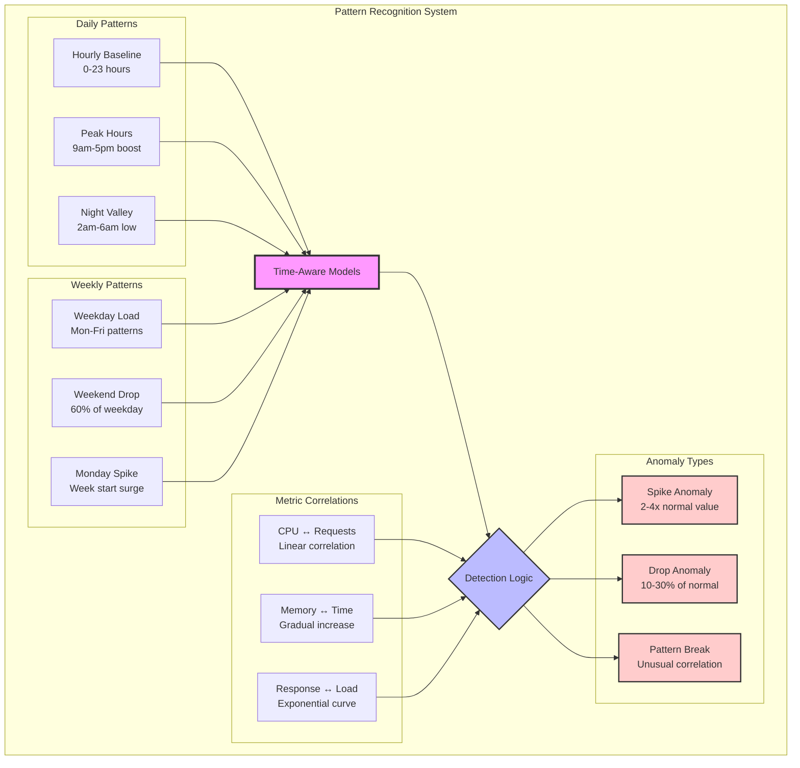

#### 5. Alert Generation Workflow

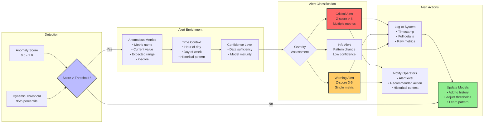

### Key Implementation Details

**Sliding Window Approach:**
- Maintains 1000 most recent data points using `deque(maxlen=1000)`
- Enables efficient FIFO operations with O(1) append/pop
- Automatically discards old data beyond window size
- Provides sufficient history for pattern learning

**Multiple Time-Based Models:**
- **Global Model**: Captures overall system behavior
- **24 Hourly Models**: One per hour for daily patterns
- **7 Daily Models**: One per weekday for weekly patterns
- **Model Selection**: Based on current timestamp
- **Ensemble Scoring**: Uses maximum score for sensitivity

**Dynamic Threshold Calculation:**
- Collects anomaly scores in sliding window
- Calculates 95th percentile of recent scores
- Adapts to changing system behavior
- Prevents alert fatigue from static thresholds
- Falls back to 0.5 default with insufficient data

</details>

## Exercise 3: Build a Predictive Autoscaler

**Challenge**: Implement an autoscaler that predicts future load and scales proactively.

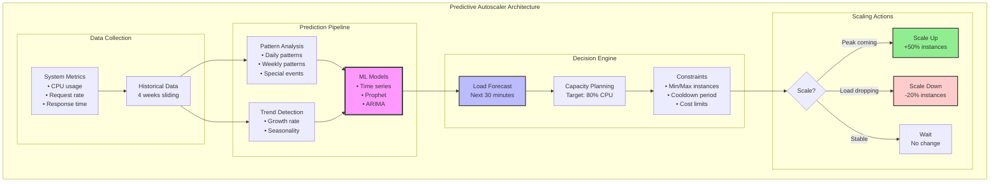

### Implementation Tasks:
1. **Time Series Storage**: Efficient storage of metrics with timestamps
2. **Pattern Recognition**: Identify daily, weekly, monthly patterns
3. **Multiple Prediction Models**: Ensemble of time series models
4. **Confidence Intervals**: Quantify prediction uncertainty
5. **Smart Scaling**: Consider cooldown, cost, and business constraints

<details>
<summary>Solution</summary>

### Predictive Autoscaler Architecture

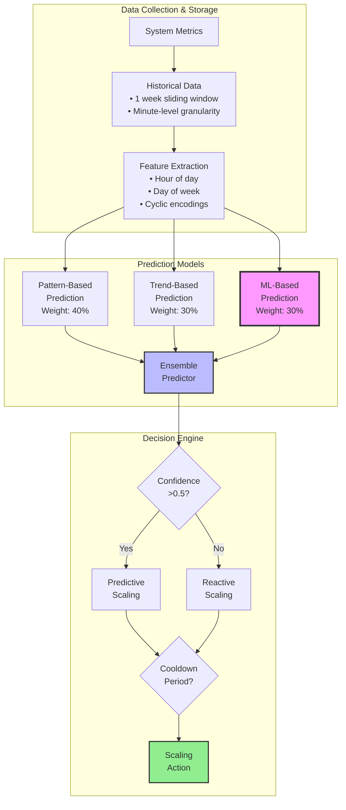

### Prediction Algorithm Flow

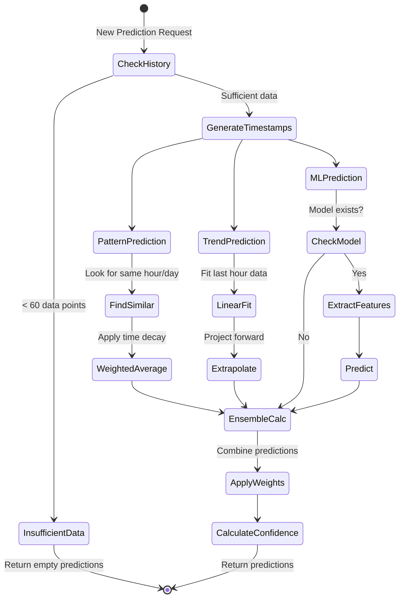

### Configuration Parameters

| Parameter | Default Value | Description |
|-----------|---------------|-------------|
| `min_instances` | 1 | Minimum number of instances |
| `max_instances` | 100 | Maximum number of instances |
| `scale_up_threshold` | 80% | CPU threshold for scaling up |
| `scale_down_threshold` | 40% | CPU threshold for scaling down |
| `cooldown_period` | 300s | Minimum time between scaling actions |
| `history_size` | 10,080 | One week of minute-level data |
| `prediction_horizon` | 30 min | How far ahead to predict |
| `confidence_decay` | e^(-t/30) | Confidence decay over time |

### Model Training Process

```mermaid
flowchart LR
    subgraph "Feature Engineering"
        Raw[Raw Metrics]
        Time[Time Features<br/>• Hour<br/>• Day of week<br/>• Minute]
        Cyclic[Cyclic Encoding<br/>• sin(2π×hour/24)<br/>• cos(2π×hour/24)<br/>• sin(2π×day/7)<br/>• cos(2π×day/7)]
    end
    
    subgraph "Training Data"
        Window[30-min Lookahead<br/>Window]
        Features[Feature Vector<br/>8 dimensions]
        Targets[Target Values<br/>• Future CPU<br/>• Future requests]
    end
    
    subgraph "Model Training"
        RF1[Random Forest<br/>CPU Model<br/>50 trees, depth 10]
        RF2[Random Forest<br/>Requests Model<br/>50 trees, depth 10]
    end
    
    Raw --> Time
    Raw --> Cyclic
    Time --> Features
    Cyclic --> Features
    
    Features --> Window
    Window --> Targets
    
    Features --> RF1
    Targets --> RF1
    Features --> RF2
    Targets --> RF2
```

### Scaling Decision Logic

```mermaid
flowchart TD
    Start[Current State]
    Cooldown{Within<br/>Cooldown?}
    GetPred[Get Predictions]
    ConfCheck{Confidence<br/>> 0.5?}
    
    Start --> Cooldown
    Cooldown -->|Yes| Wait[Action: Wait]
    Cooldown -->|No| GetPred
    
    GetPred --> ConfCheck
    
    subgraph "Predictive Path"
        FindPeak[Find Peak Load<br/>Next 15 min]
        CalcCPU[Required for CPU:<br/>instances × peak_cpu /<br/>threshold]
        CalcReq[Required for Requests:<br/>peak_requests /<br/>100 req/s]
        MaxReq[Required =<br/>max(CPU, Requests)]
        ApplyLimits[Apply min/max<br/>constraints]
    end
    
    subgraph "Reactive Path"
        AvgRecent[Average Last<br/>5 Minutes]
        CheckThresh{Check<br/>Thresholds}
        ScaleUp[Scale Up<br/>×1.5]
        ScaleDown[Scale Down<br/>×0.8]
    end
    
    ConfCheck -->|High| FindPeak
    FindPeak --> CalcCPU
    FindPeak --> CalcReq
    CalcCPU --> MaxReq
    CalcReq --> MaxReq
    MaxReq --> ApplyLimits
    
    ConfCheck -->|Low| AvgRecent
    AvgRecent --> CheckThresh
    CheckThresh -->|>80%| ScaleUp
    CheckThresh -->|<40%| ScaleDown
    CheckThresh -->|40-80%| Wait
    
    ApplyLimits --> Decision{Scale<br/>Decision}
    ScaleUp --> Decision
    ScaleDown --> Decision
    
    Decision -->|>10% change| Execute[Execute Scaling]
    Decision -->|<10% change| Wait
```

### Load Pattern Simulation

```mermaid
graph LR
    subgraph "Daily Pattern"
        Base[Base Load:<br/>50 + 30×sin(hour-6)π/12]
        Business[Business Hours<br/>9-17: ×1.5]
        Lunch[Lunch Spike<br/>12:00: ×1.2]
        Weekend[Weekend<br/>All day: ×0.6]
    end
    
    subgraph "Load Calculation"
        Pattern[Pattern Load]
        Noise[Random Noise<br/>N(0, 5)]
        Final[Final Load<br/>max(10, pattern + noise)]
    end
    
    Base --> Pattern
    Business --> Pattern
    Lunch --> Pattern
    Weekend --> Pattern
    
    Pattern --> Final
    Noise --> Final
```

### Key Learning Components

| Component | Purpose | Update Frequency |
|-----------|---------|------------------|
| **Pattern Model** | Captures daily/weekly cycles | Every 60 data points |
| **Trend Model** | Linear regression on recent data | Real-time |
| **ML Model** | Random Forest for complex patterns | Every 60 data points |
| **Confidence Calculator** | Weights predictions by reliability | Per prediction |
| **Ensemble Combiner** | Merges multiple predictions | Per prediction |

### Performance Metrics Tracking

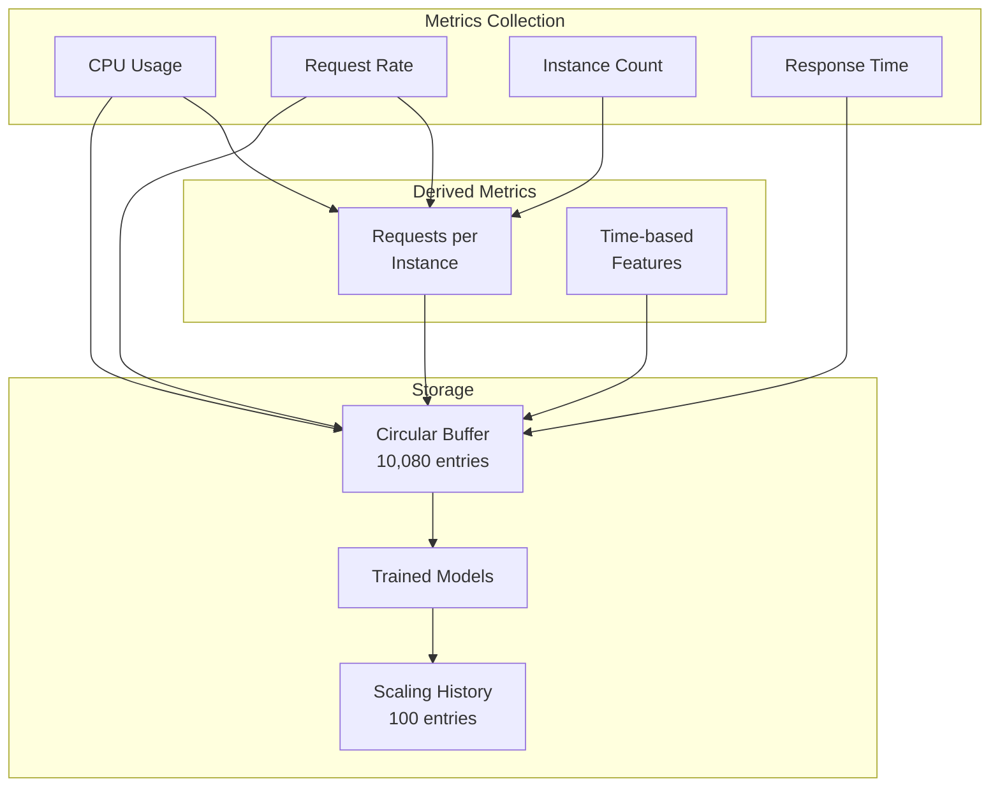

</details>

## Exercise 4: Build a Learning Cache

**Challenge**: Implement a cache that learns access patterns and pre-fetches data.

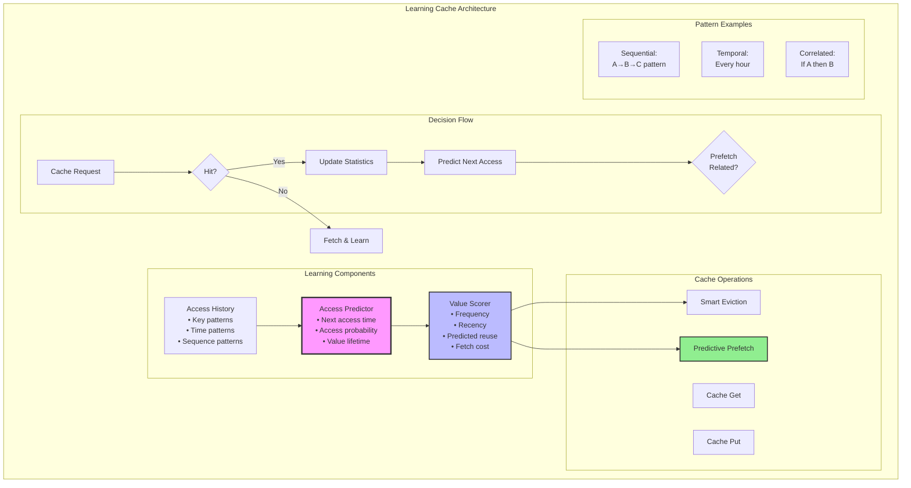

### Implementation Tasks:
1. **Access Pattern Tracking**: Record key, time, and context
2. **Pattern Mining**: Identify sequential, temporal, and correlation patterns
3. **Reuse Prediction**: Estimate probability and time of next access
4. **Smart Eviction**: Evict items with lowest predicted value
5. **Proactive Prefetching**: Fetch items before they're needed

## Exercise 5: Implement Reinforcement Learning for Resource Allocation

**Challenge**: Build a system that learns optimal resource allocation through trial and error.

```mermaid
graph TD
    subgraph "RL Resource Allocator Architecture"
        subgraph "State Space"
            S1[Resource State<br/>• CPU available<br/>• Memory available<br/>• Network bandwidth]
            S2[Service State<br/>• Current load<br/>• Queue length<br/>• SLA status]
        end
        
        subgraph "Action Space"
            A1[Allocate More<br/>to Service A]
            A2[Allocate More<br/>to Service B]
            A3[Rebalance<br/>Resources]
            A4[Hold Current<br/>Allocation]
        end
        
        subgraph "Q-Learning Process"
            State[Current State]
            QTable[Q-Table<br/>(State, Action) → Value]
            Policy[ε-greedy Policy<br/>Explore 10%<br/>Exploit 90%]
            Action[Selected Action]
        end
        
        State --> QTable
        QTable --> Policy
        Policy --> Action
        
        subgraph "Feedback Loop"
            Execute[Execute Action]
            Observe[Observe Results<br/>• Performance<br/>• SLA violations<br/>• Resource usage]
            Reward[Calculate Reward<br/>+Performance<br/>-Violations<br/>-Waste]
            Update[Update Q-Value<br/>Q ← Q + α(R + γmax(Q') - Q)]
        end
        
        Action --> Execute
        Execute --> Observe
        Observe --> Reward
        Reward --> Update
        Update --> QTable
    end
    
    style QTable fill:#f9f,stroke:#333,stroke-width:3px
    style Policy fill:#bbf,stroke:#333,stroke-width:2px
    style Update fill:#90EE90,stroke:#333,stroke-width:2px
```

### Implementation Tasks:
1. **State Representation**: Encode resource and service states
2. **Action Space Design**: Define meaningful allocation actions
3. **Reward Function**: Balance performance, SLA, and efficiency
4. **Q-Learning**: Implement value updates with learning rate decay
5. **Exploration Strategy**: ε-greedy with decreasing ε over time

## Exercise 6: Build an Intelligent Request Router

**Challenge**: Route requests to services based on learned performance characteristics.

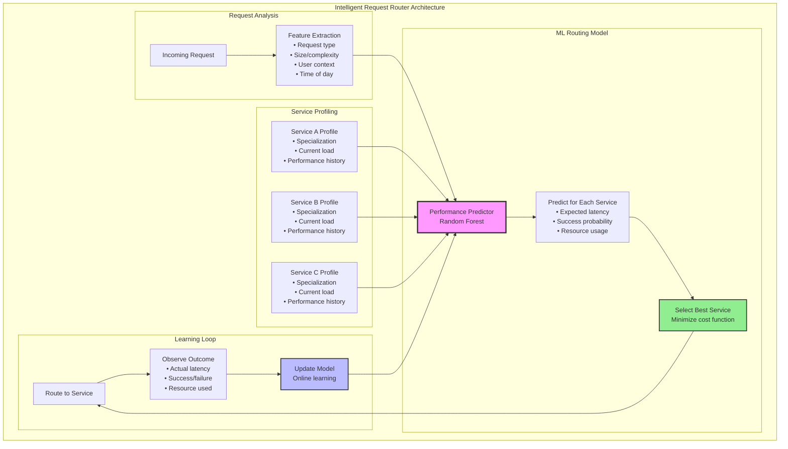

### Implementation Tasks:
1. **Feature Engineering**: Extract meaningful request characteristics
2. **Service Profiling**: Track capabilities and performance per service
3. **ML Model**: Train predictor for service performance
4. **Routing Decision**: Balance latency, reliability, and load
5. **Online Learning**: Continuously improve predictions

## Exercise 7: Implement Distributed Learning

**Challenge**: Build a system where multiple nodes collaboratively learn patterns.

```mermaid
graph TD
    subgraph "Federated Learning Architecture"
        subgraph "Node A"
            DataA[Local Data A<br/>Private]
            ModelA[Local Model A]
            TrainA[Train on<br/>Local Data]
            UpdateA[Model Update ΔA]
        end
        
        subgraph "Node B"
            DataB[Local Data B<br/>Private]
            ModelB[Local Model B]
            TrainB[Train on<br/>Local Data]
            UpdateB[Model Update ΔB]
        end
        
        subgraph "Node C"
            DataC[Local Data C<br/>Private]
            ModelC[Local Model C]
            TrainC[Train on<br/>Local Data]
            UpdateC[Model Update ΔC]
        end
        
        subgraph "Aggregation Server"
            Collect[Collect Updates<br/>(not raw data)]
            Average[Federated Average<br/>W_new = Σ(n_i/N * ΔW_i)]
            Global[Global Model]
            Distribute[Distribute<br/>New Model]
        end
        
        DataA --> TrainA
        TrainA --> UpdateA
        UpdateA --> Collect
        
        DataB --> TrainB
        TrainB --> UpdateB
        UpdateB --> Collect
        
        DataC --> TrainC
        TrainC --> UpdateC
        UpdateC --> Collect
        
        Collect --> Average
        Average --> Global
        Global --> Distribute
        
        Distribute --> ModelA
        Distribute --> ModelB
        Distribute --> ModelC
        
        Privacy[Privacy Preserved:<br/>Only model updates shared,<br/>never raw data]
    end
    
    style DataA fill:#ffcccc,stroke:#333,stroke-width:2px
    style DataB fill:#ffcccc,stroke:#333,stroke-width:2px
    style DataC fill:#ffcccc,stroke:#333,stroke-width:2px
    style Average fill:#f9f,stroke:#333,stroke-width:3px
    style Privacy fill:#90EE90,stroke:#333,stroke-width:3px
```

### Implementation Tasks:
1. **Local Training**: Train model on node's private data
2. **Update Extraction**: Calculate model parameter changes
3. **Secure Aggregation**: Collect updates without exposing individual models
4. **Weighted Averaging**: Weight by dataset size or quality
5. **Model Distribution**: Efficiently broadcast new global model

## Thought Experiments

### 1. The Cold Start Problem
Your learning system has no historical data.
- How do you bootstrap learning?
- What's the cost of early bad decisions?
- Design a solution that balances exploration with safety.

### 2. The Adversarial User
Users discover your caching predictions and start gaming the system.
- How do you detect adversarial behavior?
- Should the system adapt or resist?
- Design a robust learning mechanism.

### 3. The Concept Drift
Your system learned patterns, but user behavior suddenly changes (e.g., pandemic).
- How quickly should the system adapt?
- How do you distinguish temporary spikes from permanent changes?
- Design an adaptive learning rate mechanism.

## Practical Scenarios

### Scenario 1: Smart CDN
Design a CDN that learns content popularity patterns to:
- Pre-position content at edge locations
- Predict viral content before it spikes
- Optimize storage allocation
- Minimize cache misses

### Scenario 2: Intelligent Database
Build a database system that:
- Learns query patterns
- Automatically creates indexes
- Adjusts query plans based on history
- Predicts resource needs

### Scenario 3: Self-Tuning Application
Create an application that:
- Learns optimal configuration values
- Adjusts parameters based on workload
- Predicts performance impacts
- Prevents configuration drift

## Research Questions

1. **How do you prevent feedback loops in learning systems?**
   - What happens when predictions influence behavior?
   - How do you maintain stability?

2. **When is learning worth the complexity?**
   - What's the break-even point?
   - How do you measure learning effectiveness?

3. **How do you handle privacy in distributed learning?**
   - Can you learn without seeing raw data?
   - What about differential privacy?

## Key Concepts to Master

1. **Exploration vs Exploitation**
   - Thompson Sampling
   - Upper Confidence Bounds
   - Epsilon-greedy strategies

2. **Online Learning**
   - Incremental updates
   - Concept drift detection
   - Adaptive learning rates

3. **Distributed Learning**
   - Federated learning
   - Model aggregation
   - Privacy preservation

## Reflection

After completing these exercises:

1. What makes distributed learning different from centralized ML?

2. How do you handle the uncertainty inherent in predictions?

3. When should systems learn automatically vs. require human input?

4. What are the risks of autonomous learning systems?

Remember: Intelligence in distributed systems isn't about perfect predictions—it's about continuous improvement and adaptation. Start simple, measure everything, and let the system teach you what it needs to learn.
