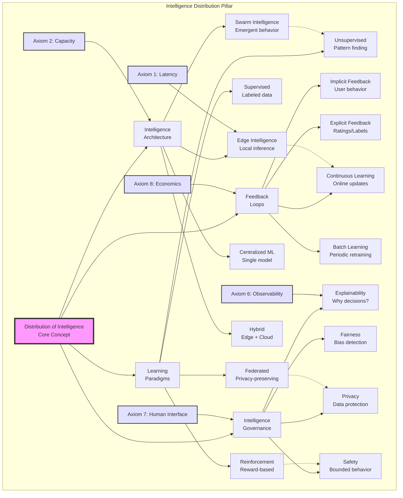

## Level 1: Intuition (Start Here) 🌱

### The Thermostat Evolution Metaphor

Think about temperature control evolution:
- **Manual**: You adjust heat when cold
- **Basic Thermostat**: Maintains set temperature
- **Smart Thermostat**: Learns your schedule
- **Intelligent Home**: Predicts needs, saves energy
- **Adaptive System**: Optimizes comfort vs cost

**This is distributed intelligence**: Systems that learn from experience and improve autonomously.

### Real-World Analogy: Restaurant Kitchen Intelligence

```yaml
Evolution of a Restaurant Kitchen:

Week 1: Manual Everything
- Chef tastes every dish
- Writes down popular items
- Adjusts portions by memory

Month 1: Basic Patterns
- Track bestsellers
- Standard portion sizes
- Rush hour prep lists

Year 1: Smart Operations
- Predict busy nights
- Dynamic menu pricing
- Inventory optimization
- Staff scheduling AI

Intelligence emerges from:
- Data (orders, feedback)
- Patterns (busy times)
- Adaptation (menu changes)
- Feedback loops (reviews)
```

### Your First Intelligence Experiment

### The Beginner's Intelligence Stack

```text
         🧠 Human Intelligence
          (Strategic decisions)
                |
                |
         🤖 Augmented Intelligence
           (AI assists humans)
                |
                |
         📊 Automated Intelligence
           (Rule-based systems)
                |
                |
         🔄 Adaptive Intelligence
           (Learning systems)
```

---

## 📋 Questions This Pillar Answers

---

## Level 2: Foundation (Understand Why) 🌿

### Core Principle: Intelligence Emerges from Feedback

### The Intelligence Spectrum

### The Learning Hierarchy

```dockerfile
Supervised Learning 📚
├─ Learn from labeled examples
├─ "This email is spam"
├─ Predict labels for new data
└─ Use case: Classification

Unsupervised Learning 🔍
├─ Find patterns without labels
├─ "These users are similar"
├─ Discover hidden structure
└─ Use case: Clustering

Reinforcement Learning 🎮
├─ Learn from rewards/penalties
├─ "That action increased revenue"
├─ Optimize future actions
└─ Use case: Decision making

Transfer Learning 🔄
├─ Apply knowledge across domains
├─ "Image recognition → Medical imaging"
├─ Leverage existing models
└─ Use case: Limited data scenarios
```

### 🎬 Failure Vignette: The Flash Crash of 2010

### Building Blocks of Intelligence

### Concept Map: Distribution of Intelligence



This concept map shows how distributed intelligence encompasses learning paradigms, architectural choices, feedback mechanisms, and governance requirements. Each aspect must balance performance, privacy, and practical constraints.

---

## Level 3: Deep Dive (Master the Patterns) 🌳

### Multi-Armed Bandits: Exploration vs Exploitation

### Online Learning Systems

### Recommendation Systems Architecture

### Anomaly Detection Patterns

### Intelligence System Decision Framework

### A/B Testing at Scale

---

## Level 4: Expert (Production Patterns) 🌲

### Case Study: Netflix Recommendation Evolution

### 🎯 Decision Framework: ML Strategy

### Advanced Pattern: Federated Learning

### Production Anti-Patterns

---

## Level 5: Mastery (Push the Boundaries) 🌴

### The Future: Autonomous AI Systems

### Neuromorphic Computing

### The Philosophy of Intelligence

## Summary: Key Insights by Level

### 🌱 Beginner
1. **Intelligence emerges from data + feedback**
2. **Start simple: rules before ML**
3. **Learning systems improve over time**

### 🌿 Intermediate
1. **Different problems need different ML types**
2. **Feature engineering often beats complex models**
3. **Feedback loops can spiral (good or bad)**

### 🌳 Advanced
1. **Exploration/exploitation balance crucial**
2. **Online learning handles changing worlds**
3. **Ensemble methods increase robustness**

### 🌲 Expert
1. **Business metrics > ML metrics**
2. **Federated learning preserves privacy**
3. **Production ML needs interpretability**

### 🌴 Master
1. **AutoML automates ML engineering**
2. **Neuromorphic computing changes efficiency**
3. **True intelligence requires understanding**

## Quick Reference Card

---

**Next**: [Tools →](../../tools/index.md)

*"The best AI systems make humans smarter, not obsolete."*
