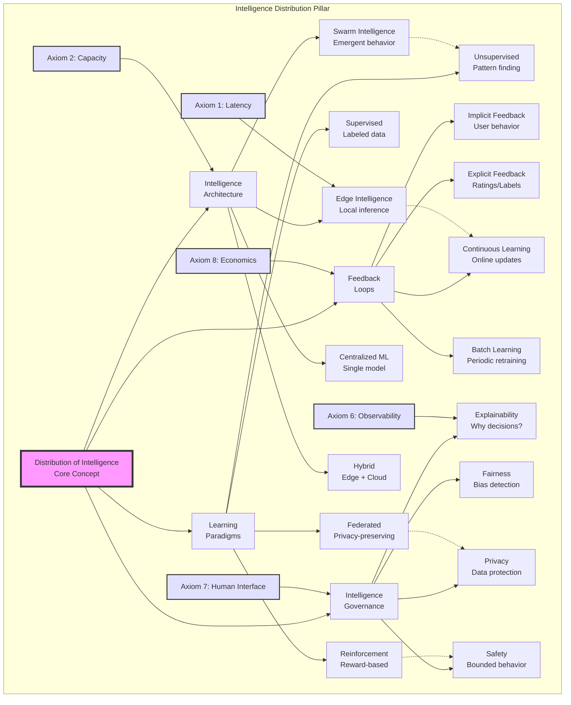
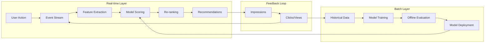
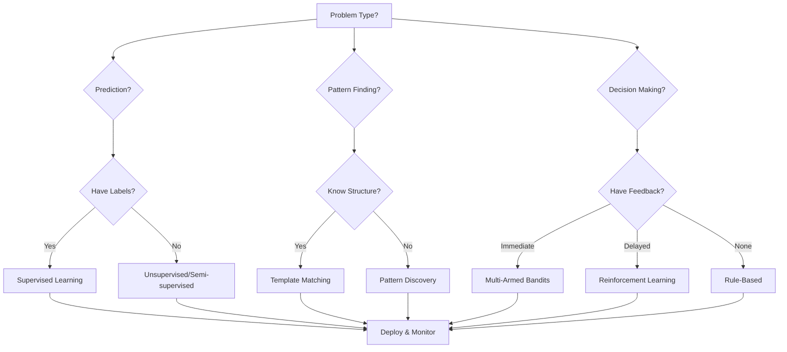
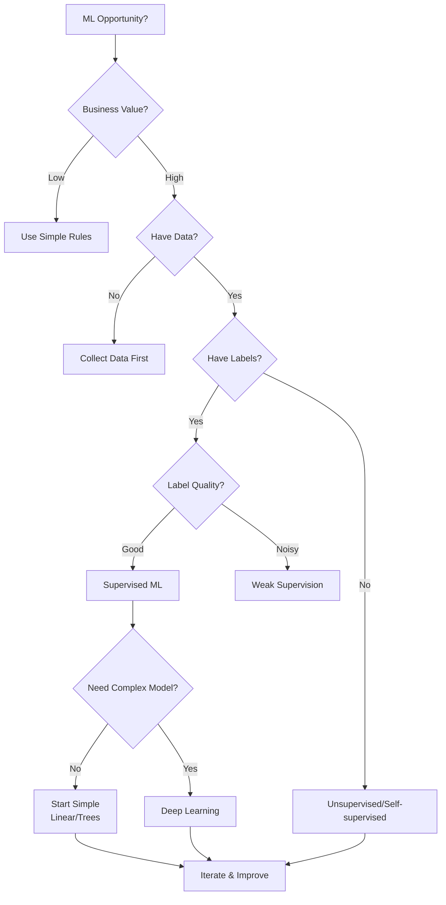

## Level 1: Intuition (Start Here) 🌱

### The Thermostat Evolution Metaphor

Think about temperature control evolution:
- **Manual**: You adjust heat when cold
- **Basic Thermostat**: Maintains set temperature
- **Smart Thermostat**: Learns your schedule
- **Intelligent Home**: Predicts needs, saves energy
- **Adaptive System**: Optimizes comfort vs cost

**This is distributed intelligence**: Systems that learn from experience and improve autonomously.

### Real-World Analogy: Restaurant Kitchen Intelligence

```yaml
Evolution of a Restaurant Kitchen:

Week 1: Manual Everything
- Chef tastes every dish
- Writes down popular items
- Adjusts portions by memory

Month 1: Basic Patterns
- Track bestsellers
- Standard portion sizes
- Rush hour prep lists

Year 1: Smart Operations
- Predict busy nights
- Dynamic menu pricing
- Inventory optimization
- Staff scheduling AI

Intelligence emerges from:
- Data (orders, feedback)
- Patterns (busy times)
- Adaptation (menu changes)
- Feedback loops (reviews)
```

### Your First Intelligence Experiment

### The Beginner's Intelligence Stack

```text
         🧠 Human Intelligence
          (Strategic decisions)
                |
                |
         🤖 Augmented Intelligence
           (AI assists humans)
                |
                |
         📊 Automated Intelligence
           (Rule-based systems)
                |
                |
         🔄 Adaptive Intelligence
           (Learning systems)
```

---

## 📋 Questions This Pillar Answers

---

## Level 2: Foundation (Understand Why) 🌿

### Core Principle: Intelligence Emerges from Feedback

### The Intelligence Spectrum

### The Learning Hierarchy

| Learning Type | How It Works | Example | When to Use |
|--------------|--------------|---------|-------------|
| **Supervised** 📚 | Learn from labeled examples | Email spam detection | Known categories |
| **Unsupervised** 🔍 | Find patterns without labels | Customer segmentation | Unknown structure |
| **Reinforcement** 🎮 | Learn from rewards/penalties | Game playing, routing | Sequential decisions |
| **Transfer** 🔄 | Apply knowledge across domains | Pre-trained models | Limited data |
| **Federated** 🔐 | Learn without centralizing data | Mobile keyboards | Privacy critical |

### Learning System Comparison

```yaml
Supervised Learning:
  Pros: High accuracy, interpretable
  Cons: Needs labeled data, can't adapt
  Example: Fraud detection

Unsupervised Learning:  
  Pros: No labels needed, finds novelty
  Cons: Hard to evaluate, noisy results
  Example: Anomaly detection

Reinforcement Learning:
  Pros: Handles sequences, improves over time
  Cons: Slow to train, can be unstable
  Example: Resource allocation

Online Learning:
  Pros: Adapts to drift, low memory
  Cons: Can forget, sensitive to order
  Example: Recommendation systems
```

### 🎬 Failure Vignette: The Flash Crash of 2010

**Date**: May 6, 2010, 2:45 PM  
**Loss**: $1 trillion in minutes (recovered)  
**Cause**: Algorithmic trading feedback loop

```yaml
The Timeline:
14:32 - Large mutual fund starts selling E-Mini futures
14:41 - HFT algorithms detect selling pressure
14:42 - Algorithms start "hot potato" trading
14:44 - Liquidity disappears as algos withdraw
14:45:28 - Dow drops 600 points in 5 minutes
14:47 - Some stocks trade at $0.01
14:48 - Others trade at $100,000
14:50 - Circuit breakers trigger
15:07 - Market stabilizes

The Feedback Loop:
1. Selling pressure detected
2. Algos sell to avoid losses
3. More pressure created
4. More algos sell
5. Liquidity crisis
6. Prices become meaningless

Lessons Learned:
- ML systems can create feedback loops
- Need circuit breakers for algorithms
- Diversity in strategies prevents herding
- Human oversight still critical
- Test for market-wide effects
```

### Building Blocks of Intelligence

| Component | Purpose | Example Implementation |
|-----------|---------|----------------------|
| **Data Pipeline** | Collect and prepare data | Kafka → Spark → S3 |
| **Feature Store** | Reusable feature engineering | Feast, Tecton |
| **Model Registry** | Version and track models | MLflow, Neptune |
| **Serving Layer** | Deploy models to production | TensorFlow Serving, Seldon |
| **Monitoring** | Track model performance | Evidently AI, Arize |
| **Experimentation** | A/B test and measure impact | Optimizely, LaunchDarkly |

### Concept Map: Distribution of Intelligence



This concept map shows how distributed intelligence encompasses learning paradigms, architectural choices, feedback mechanisms, and governance requirements. Each aspect must balance performance, privacy, and practical constraints.

---

## Level 3: Deep Dive (Master the Patterns) 🌳

### Multi-Armed Bandits: Exploration vs Exploitation

The fundamental problem in learning systems: Should you exploit what you know works, or explore to find something better?

| Strategy | Description | When to Use | Trade-offs |
|----------|-------------|-------------|------------|
| **ε-greedy** | Random exploration ε% of time | Simple problems | Can waste time on bad options |
| **Upper Confidence Bound** | Optimistic about uncertainty | Need confidence intervals | Complex to compute |
| **Thompson Sampling** | Sample from probability distribution | Bayesian approach | Most theoretically sound |
| **Contextual Bandits** | Consider context (user, time) | Personalization | Requires more data |

### Real Example: Netflix Adaptive Streaming

Netflix uses reinforcement learning to optimize video quality in real-time:

```yaml
State Space:
  - Current bandwidth: 0.5 - 100 Mbps
  - Buffer level: 0 - 30 seconds  
  - Last quality: 480p/720p/1080p/4K
  - Network variance: stable/variable

Actions:
  - Choose bitrate: 0.4/0.8/1.4/2.4/4.3/6.0 Mbps
  - Corresponds to: 480p/720p/1080p/1440p/4K/4K+

Reward Function:
  + Video quality (higher better)
  - Rebuffering time (stalls bad)
  - Quality switches (jarring)
  = Quality of Experience (QoE)

Learning:
  - Updates every chunk (2-10 seconds)
  - Adapts to network conditions
  - Personalizes to viewing device
```

### Online Learning Systems

| Aspect | Batch Learning | Online Learning |
|--------|----------------|-----------------|
| **Data** | All at once | Stream continuously |
| **Model Updates** | Periodic retraining | Continuous updates |
| **Memory** | High (store all data) | Low (discard after use) |
| **Concept Drift** | Requires manual retraining | Adapts automatically |
| **Use Cases** | Stable patterns | Dynamic environments |

### Recommendation Systems Architecture



### Anomaly Detection Patterns

| Pattern | How It Works | Pros | Cons |
|---------|--------------|------|------|
| **Statistical** | Z-score, percentiles | Simple, fast | Assumes distribution |
| **Isolation Forest** | Isolate anomalies in trees | No training needed | Black box |
| **Autoencoders** | Reconstruction error | Handles complex data | Needs normal data |
| **One-Class SVM** | Learn normal boundary | Robust | Hard to tune |
| **Ensemble** | Combine multiple methods | Most accurate | Complex, slow |

### Production Example: DDoS Detection

```yaml
Feature Extraction:
  Request Rate:
    - Requests per second
    - Variance in inter-arrival time
    - Burst detection
  
  Traffic Patterns:
    - Geographic entropy
    - User agent diversity  
    - Path distribution
    - Protocol mix
  
  Behavioral:
    - Session duration
    - Click patterns
    - Resource access order

Detection Pipeline:
  1. Real-time features (1-second window)
  2. Statistical anomaly detection
  3. ML classifier for attack types
  4. Severity scoring
  5. Mitigation decision

Feedback:
  - False positive tracking
  - Attack pattern learning
  - Threshold adaptation
```

### Intelligence System Decision Framework



### A/B Testing at Scale

| Challenge | Solution | Example |
|-----------|----------|---------|
| **Multiple Tests** | Statistical correction | Bonferroni, FDR |
| **Long-term Effects** | Holdout groups | 1% never sees changes |
| **Network Effects** | Cluster randomization | By geographic region |
| **Novelty Effects** | Longer experiments | 2+ weeks minimum |
| **Sample Size** | Power analysis | Calculate before starting |

### Example: Feature Rollout Decision

```yaml
Experiment Setup:
  Control: Current algorithm
  Treatment: New ML model
  
  Metrics:
    Primary: User engagement (+2% target)
    Secondary: Revenue, latency
    Guardrails: Error rate, complaints
  
  Sample Size: 1M users per group
  Duration: 14 days
  
Results Analysis:
  Week 1:
    Engagement: +3.5% (novelty effect?)
    Revenue: +1.2%
    Latency: +20ms (acceptable)
    
  Week 2:
    Engagement: +2.1% (stabilizing)
    Revenue: +1.8%
    Latency: +18ms
    
Decision Framework:
  ✓ Primary metric hit target
  ✓ Secondary metrics positive
  ✓ Guardrails not violated
  ✓ Effect persisted past novelty
  
  → Ship to 100%
```

---

## Level 4: Expert (Production Patterns) 🌲

### Case Study: Google Borg Resource Prediction

Google's Borg system uses ML to predict actual resource usage vs requested, improving cluster utilization by 20%+.

```yaml
The Problem:
  - Jobs request 2-3x resources they actually use
  - Wasted capacity = wasted money
  - But underprovisioning = failures

The Solution:
  Historical Learning:
    - Track requested vs actual for every job
    - Learn patterns by job type, time, user
    - Predict actual needs

  Features Used:
    - Job name/type
    - Time of day/week
    - Historical usage patterns
    - User/team identity
    - Cluster load

  Results:
    - 20% better utilization
    - 10% fewer job failures
    - $10M+ annual savings

Key Insights:
  - Simple linear models often sufficient
  - Feature engineering > model complexity
  - Online learning handles drift
  - Safety margins still needed
```

### 🎯 Decision Framework: ML Strategy



### ML Readiness Checklist

| Requirement | Red Flags | Green Flags |
|-------------|-----------|-------------|
| **Problem Definition** | "Use AI for everything" | Clear success metrics |
| **Data Quality** | No ground truth | Clean, labeled data |
| **Infrastructure** | No monitoring | MLOps pipeline ready |
| **Team Skills** | No ML experience | ML + Domain experts |
| **Business Buy-in** | "Just try something" | Clear ROI expectations |

### Advanced Pattern: Federated Learning

Train models on distributed data without centralizing it - critical for privacy.

```yaml
Traditional ML:
  1. Collect all data centrally
  2. Train model on all data
  3. Deploy model
  Problem: Privacy, bandwidth, regulations

Federated Learning:
  1. Send model to edge devices
  2. Train locally on private data
  3. Send only model updates back
  4. Aggregate updates centrally
  Benefits: Privacy preserved, bandwidth saved

Example: Google Keyboard
  - 600M+ devices
  - Never see user typing
  - Still improve predictions
  - Model updates ~10KB
  
Process:
  1. Download global model
  2. Train on local typing
  3. Compute model delta
  4. Add noise (differential privacy)
  5. Upload encrypted delta
  6. Server aggregates updates
  7. New global model
```

### Production Anti-Patterns

| Anti-Pattern | Why It Fails | Better Approach |
|--------------|--------------|-----------------|
| **ML for ML's Sake** | No business value | Start with metrics |
| **Ignore Drift** | Models degrade | Monitor + retrain |
| **Black Box Everything** | Can't debug/explain | Interpretability first |
| **Perfect Accuracy** | Overfitting, slow | Good enough + fast |
| **Forget Feedback Loops** | Models affect reality | Test for loops |

### Real Example: Amazon's Predictive Scaling

```yaml
Multi-Signal Prediction:
  Time Series:
    - Historical load patterns
    - Seasonal decomposition
    - Holiday calendars
    Weight: 40%
    
  Business Events:
    - Marketing campaigns
    - Product launches
    - Sales events
    Weight: 30%
    
  External Signals:
    - Weather forecasts
    - Sports events
    - News sentiment
    Weight: 20%
    
  ML Model:
    - Ensemble predictions
    - Uncertainty quantification
    - Safety bounds
    Weight: 10%

Results:
  - 15% reduction in over-provisioning
  - 90% reduction in under-provisioning
  - $50M annual savings
  - 50ms better latency (right-sized instances)
```

### ML in Production Checklist

```yaml
Before Launch:
  ✓ Offline metrics meet targets
  ✓ A/B test shows positive impact
  ✓ Monitoring dashboards ready
  ✓ Rollback plan documented
  ✓ Inference latency acceptable
  
First Week:
  ✓ Watch for distribution shift
  ✓ Monitor business metrics
  ✓ Check model calibration
  ✓ Gather user feedback
  ✓ Verify no feedback loops
  
Ongoing:
  ✓ Weekly performance review
  ✓ Monthly retrain evaluation
  ✓ Quarterly architecture review
  ✓ Annual strategy assessment
```

---

## Level 5: Mastery (Push the Boundaries) 🌴

### The Future: Autonomous AI Systems

### Neuromorphic Computing

### The Philosophy of Intelligence

## Summary: Key Insights by Level

### 🌱 Beginner
1. **Intelligence emerges from data + feedback**
2. **Start simple: rules before ML**
3. **Learning systems improve over time**

### 🌿 Intermediate
1. **Different problems need different ML types**
2. **Feature engineering often beats complex models**
3. **Feedback loops can spiral (good or bad)**

### 🌳 Advanced
1. **Exploration/exploitation balance crucial**
2. **Online learning handles changing worlds**
3. **Ensemble methods increase robustness**

### 🌲 Expert
1. **Business metrics > ML metrics**
2. **Federated learning preserves privacy**
3. **Production ML needs interpretability**

### 🌴 Master
1. **AutoML automates ML engineering**
2. **Neuromorphic computing changes efficiency**
3. **True intelligence requires understanding**

## Practical Exercises

### Exercise 1: Build a Multi-Armed Bandit 🌱

Implement Thompson Sampling for A/B testing:

```python
# Track success/failure for each variant
# Sample from Beta distribution
# Select variant with highest sample
# Update based on results
```

### Exercise 2: Anomaly Detection Pipeline 🌿

Design a production anomaly detector:

| Step | Implementation | Considerations |
|------|----------------|----------------|
| **Feature Engineering** | Time series decomposition | Seasonality, trend |
| **Model Selection** | Isolation Forest + Statistics | Ensemble approach |
| **Threshold Setting** | Dynamic percentiles | Avoid alert fatigue |
| **Feedback Loop** | User labels anomalies | Improve over time |

### Exercise 3: Design ML Architecture 🌳

Match ML patterns to use cases:

| Use Case | Pattern | Why |
|----------|---------|-----|
| Fraud Detection | Real-time scoring + batch training | Speed + accuracy |
| Recommendations | Collaborative filtering + content | Cold start problem |
| Demand Forecasting | Time series + external signals | Multiple factors |
| Chatbot | Fine-tuned LLM + RAG | Context + knowledge |

### Exercise 4: Implement Online Learning 🌲

Build adaptive system that learns from stream:

```yaml
Requirements:
  - Handle concept drift
  - Bounded memory usage
  - Incremental updates
  - Performance tracking

Components:
  - Sliding window for recent data
  - Exponential decay for old patterns
  - Change detection algorithm
  - Model versioning
```

### Exercise 5: ML Monitoring Dashboard 🌴

Design comprehensive ML monitoring:

| Metric Type | Examples | Alert Threshold |
|-------------|----------|-----------------|
| **Data Quality** | Missing values, distribution shift | >5% change |
| **Model Performance** | Accuracy, precision, recall | <95% of baseline |
| **Business Impact** | Revenue, engagement, satisfaction | Depends on SLA |
| **System Health** | Latency, errors, throughput | P99 > 100ms |

## Quick Reference Card

```yaml
ML Decision Tree:

Have Labels?
├─ Yes → Supervised Learning
│   ├─ Classification → Logistic Regression/Trees/Neural Nets
│   └─ Regression → Linear/Trees/Neural Nets
│
└─ No → Unsupervised Learning
    ├─ Clustering → K-means/DBSCAN/Hierarchical
    ├─ Dimensionality → PCA/t-SNE/Autoencoders
    └─ Anomaly → Isolation Forest/One-class SVM

Real-time Requirements?
├─ <100ms → Pre-computed/Cached/Simple Model
├─ <1s → Online Model/Approximations
└─ >1s → Full Model/Ensemble

Data Volume?
├─ <1GB → Single Machine/Scikit-learn
├─ <1TB → Spark MLlib/Distributed
└─ >1TB → Deep Learning/Specialized

Common Patterns:
┌─────────────────────────────────────┐
│ Batch Training + Real-time Serving  │
│ Most common production pattern      │
├─────────────────────────────────────┤
│ Online Learning + Periodic Reset    │
│ For changing environments           │
├─────────────────────────────────────┤
│ Ensemble + Fallback                 │
│ Robustness through redundancy       │
├─────────────────────────────────────┤
│ Human-in-the-Loop                   │
│ For high-stakes decisions           │
└─────────────────────────────────────┘
```

### ML Pipeline Components

| Stage | Tools | Best Practices |
|-------|-------|----------------|
| **Data Collection** | Kafka, Kinesis, Pub/Sub | Schema validation, versioning |
| **Feature Engineering** | Spark, Pandas, Feast | Reusable features, monitoring |
| **Training** | TensorFlow, PyTorch, XGBoost | Experiment tracking, reproducibility |
| **Serving** | TF Serving, Seldon, SageMaker | A/B testing, gradual rollout |
| **Monitoring** | Prometheus, Datadog, Arize | Data + model + business metrics |

### Common ML Metrics

```yaml
Classification:
  Accuracy: (TP + TN) / Total
  Precision: TP / (TP + FP)  # Few false positives
  Recall: TP / (TP + FN)     # Few false negatives  
  F1: 2 * (Precision * Recall) / (Precision + Recall)
  AUC-ROC: Area under ROC curve

Regression:
  MSE: Mean Squared Error
  MAE: Mean Absolute Error
  R²: Explained variance
  MAPE: Mean Absolute Percentage Error

Business:
  Revenue Impact: $ gained/lost
  User Engagement: CTR, time spent
  Operational: Latency, throughput
  Cost: Infrastructure, human review
```

---

**Next**: [Tools →](../../tools/index.md)

*"The best AI systems make humans smarter, not obsolete."*
