## Level 1: Intuition (Start Here) 🌱

### The Thermostat Evolution Metaphor

Think about temperature control evolution:
- **Manual**: You adjust heat when cold
- **Basic Thermostat**: Maintains set temperature
- **Smart Thermostat**: Learns your schedule
- **Intelligent Home**: Predicts needs, saves energy
- **Adaptive System**: Optimizes comfort vs cost

**This is distributed intelligence**: Systems that learn from experience and improve autonomously.

### Real-World Analogy: Restaurant Kitchen Intelligence


### Your First Intelligence Experiment

### The Beginner's Intelligence Stack

```mermaid
graph TD
    subgraph "Intelligence Stack"
        Human[🧠 Human Intelligence<br/>Strategic decisions]
        Augmented[🤖 Augmented Intelligence<br/>AI assists humans]
        Automated[📊 Automated Intelligence<br/>Rule-based systems]
        Adaptive[🔄 Adaptive Intelligence<br/>Learning systems]
        
        Human --> Augmented
        Augmented --> Automated
        Automated --> Adaptive
    end
    
    style Human fill:#f9f,stroke:#333,stroke-width:2px
    style Augmented fill:#bbf,stroke:#333,stroke-width:2px
    style Automated fill:#fbb,stroke:#333,stroke-width:2px
    style Adaptive fill:#bfb,stroke:#333,stroke-width:2px
```



---

## 📋 Questions This Pillar Answers

---

## Level 2: Foundation (Understand Why) 🌿

### Core Principle: Intelligence Emerges from Feedback

### The Intelligence Spectrum

### The Learning Hierarchy

| Learning Type | How It Works | Example | When to Use |
|--------------|--------------|---------|-------------|
| **Supervised** 📚 | Learn from labeled examples | Email spam detection | Known categories |
| **Unsupervised** 🔍 | Find patterns without labels | Customer segmentation | Unknown structure |
| **Reinforcement** 🎮 | Learn from rewards/penalties | Game playing, routing | Sequential decisions |
| **Transfer** 🔄 | Apply knowledge across domains | Pre-trained models | Limited data |
| **Federated** 🔐 | Learn without centralizing data | Mobile keyboards | Privacy critical |

### Learning System Comparison

```mermaid
graph LR
    subgraph "Learning System Comparison"
        SL[Supervised Learning]
        SL --> SLP[Pros:<br/>• High accuracy<br/>• Interpretable]
        SL --> SLC[Cons:<br/>• Needs labeled data<br/>• Can't adapt]
        SL --> SLE[Example:<br/>Fraud detection]
        
        UL[Unsupervised Learning]
        UL --> ULP[Pros:<br/>• No labels needed<br/>• Finds novelty]
        UL --> ULC[Cons:<br/>• Hard to evaluate<br/>• Noisy results]
        UL --> ULE[Example:<br/>Anomaly detection]
        
        RL[Reinforcement Learning]
        RL --> RLP[Pros:<br/>• Handles sequences<br/>• Improves over time]
        RL --> RLC[Cons:<br/>• Slow to train<br/>• Can be unstable]
        RL --> RLE[Example:<br/>Resource allocation]
        
        OL[Online Learning]
        OL --> OLP[Pros:<br/>• Adapts to drift<br/>• Low memory]
        OL --> OLC[Cons:<br/>• Can forget<br/>• Sensitive to order]
        OL --> OLE[Example:<br/>Recommendation systems]
    end
    
    style SL fill:#e6f3ff,stroke:#333,stroke-width:2px
    style UL fill:#ffe6e6,stroke:#333,stroke-width:2px
    style RL fill:#e6ffe6,stroke:#333,stroke-width:2px
    style OL fill:#fff0e6,stroke:#333,stroke-width:2px
```



### 🎬 Failure Vignette: The Flash Crash of 2010

**Date**: May 6, 2010, 2:45 PM  
**Loss**: $1 trillion in minutes (recovered)  
**Cause**: Algorithmic trading feedback loop


### Building Blocks of Intelligence

| Component | Purpose | Example Implementation |
|-----------|---------|----------------------|
| **Data Pipeline** | Collect and prepare data | Kafka → Spark → S3 |
| **Feature Store** | Reusable feature engineering | Feast, Tecton |
| **Model Registry** | Version and track models | MLflow, Neptune |
| **Serving Layer** | Deploy models to production | TensorFlow Serving, Seldon |
| **Monitoring** | Track model performance | Evidently AI, Arize |
| **Experimentation** | A/B test and measure impact | Optimizely, LaunchDarkly |

### Concept Map: Distribution of Intelligence


This concept map shows how distributed intelligence encompasses learning paradigms, architectural choices, feedback mechanisms, and governance requirements. Each aspect must balance performance, privacy, and practical constraints.

---

## Level 3: Deep Dive (Master the Patterns) 🌳

### Multi-Armed Bandits: Exploration vs Exploitation

The fundamental problem in learning systems: Should you exploit what you know works, or explore to find something better?

| Strategy | Description | When to Use | Trade-offs |
|----------|-------------|-------------|------------|
| **ε-greedy** | Random exploration ε% of time | Simple problems | Can waste time on bad options |
| **Upper Confidence Bound** | Optimistic about uncertainty | Need confidence intervals | Complex to compute |
| **Thompson Sampling** | Sample from probability distribution | Bayesian approach | Most theoretically sound |
| **Contextual Bandits** | Consider context (user, time) | Personalization | Requires more data |

### Real Example: Netflix Adaptive Streaming

Netflix uses reinforcement learning to optimize video quality in real-time:

```mermaid
graph LR
    subgraph "Netflix Adaptive Streaming RL System"
        subgraph "State Space"
            S1[Current bandwidth<br/>0.5 - 100 Mbps]
            S2[Buffer level<br/>0 - 30 seconds]
            S3[Last quality<br/>480p/720p/1080p/4K]
            S4[Network variance<br/>stable/variable]
        end
        
        subgraph "Actions"
            A1[Choose bitrate]
            A1 --> B1[0.4 Mbps → 480p]
            A1 --> B2[0.8 Mbps → 720p]
            A1 --> B3[1.4 Mbps → 1080p]
            A1 --> B4[2.4 Mbps → 1440p]
            A1 --> B5[4.3 Mbps → 4K]
            A1 --> B6[6.0 Mbps → 4K+]
        end
        
        subgraph "Reward Function"
            R1[+ Video quality<br/>Higher better]
            R2[- Rebuffering time<br/>Stalls bad]
            R3[- Quality switches<br/>Jarring]
            QoE[= Quality of<br/>Experience]
            
            R1 --> QoE
            R2 --> QoE
            R3 --> QoE
        end
        
        subgraph "Learning Process"
            L1[Updates every chunk<br/>2-10 seconds]
            L2[Adapts to<br/>network conditions]
            L3[Personalizes to<br/>viewing device]
        end
        
        S1 --> A1
        S2 --> A1
        S3 --> A1
        S4 --> A1
        
        A1 --> QoE
        QoE --> L1
        L1 --> L2
        L2 --> L3
    end
    
    style QoE fill:#f9f,stroke:#333,stroke-width:3px
```



### Online Learning Systems

| Aspect | Batch Learning | Online Learning |
|--------|----------------|-----------------|
| **Data** | All at once | Stream continuously |
| **Model Updates** | Periodic retraining | Continuous updates |
| **Memory** | High (store all data) | Low (discard after use) |
| **Concept Drift** | Requires manual retraining | Adapts automatically |
| **Use Cases** | Stable patterns | Dynamic environments |

### Recommendation Systems Architecture


### Anomaly Detection Patterns

| Pattern | How It Works | Pros | Cons |
|---------|--------------|------|------|
| **Statistical** | Z-score, percentiles | Simple, fast | Assumes distribution |
| **Isolation Forest** | Isolate anomalies in trees | No training needed | Black box |
| **Autoencoders** | Reconstruction error | Handles complex data | Needs normal data |
| **One-Class SVM** | Learn normal boundary | Robust | Hard to tune |
| **Ensemble** | Combine multiple methods | Most accurate | Complex, slow |

### Production Example: DDoS Detection


### Intelligence System Decision Framework


### A/B Testing at Scale

| Challenge | Solution | Example |
|-----------|----------|---------|
| **Multiple Tests** | Statistical correction | Bonferroni, FDR |
| **Long-term Effects** | Holdout groups | 1% never sees changes |
| **Network Effects** | Cluster randomization | By geographic region |
| **Novelty Effects** | Longer experiments | 2+ weeks minimum |
| **Sample Size** | Power analysis | Calculate before starting |

### Example: Feature Rollout Decision

```mermaid
graph TD
    subgraph "A/B Test: Feature Rollout Decision"
        subgraph "Experiment Setup"
            ES1[Control:<br/>Current algorithm]
            ES2[Treatment:<br/>New ML model]
            
            M1[Metrics]
            M1 --> M1A[Primary: User engagement<br/>+2% target]
            M1 --> M1B[Secondary: Revenue, latency]
            M1 --> M1C[Guardrails: Error rate, complaints]
            
            Setup[Sample Size: 1M users/group<br/>Duration: 14 days]
        end
        
        subgraph "Results Analysis"
            W1[Week 1]
            W1 --> W1A[Engagement: +3.5%<br/>novelty effect?]
            W1 --> W1B[Revenue: +1.2%]
            W1 --> W1C[Latency: +20ms<br/>acceptable]
            
            W2[Week 2]
            W2 --> W2A[Engagement: +2.1%<br/>stabilizing]
            W2 --> W2B[Revenue: +1.8%]
            W2 --> W2C[Latency: +18ms]
        end
        
        subgraph "Decision Framework"
            D1[✓ Primary metric hit target]
            D2[✓ Secondary metrics positive]
            D3[✓ Guardrails not violated]
            D4[✓ Effect persisted past novelty]
            
            Decision[→ Ship to 100%]
            
            D1 --> Decision
            D2 --> Decision
            D3 --> Decision
            D4 --> Decision
        end
        
        ES1 --> W1
        ES2 --> W1
        W1 --> W2
        W2 --> D1
    end
    
    style Decision fill:#90EE90,stroke:#333,stroke-width:3px
    style W2A fill:#bbf,stroke:#333,stroke-width:2px
```



---

## Level 4: Expert (Production Patterns) 🌲

### Case Study: Google Borg Resource Prediction

Google's Borg system uses ML to predict actual resource usage vs requested, improving cluster utilization by 20%+.


### 🎯 Decision Framework: ML Strategy


### ML Readiness Checklist

| Requirement | Red Flags | Green Flags |
|-------------|-----------|-------------|
| **Problem Definition** | "Use AI for everything" | Clear success metrics |
| **Data Quality** | No ground truth | Clean, labeled data |
| **Infrastructure** | No monitoring | MLOps pipeline ready |
| **Team Skills** | No ML experience | ML + Domain experts |
| **Business Buy-in** | "Just try something" | Clear ROI expectations |

### Advanced Pattern: Federated Learning

Train models on distributed data without centralizing it - critical for privacy.


### Production Anti-Patterns

| Anti-Pattern | Why It Fails | Better Approach |
|--------------|--------------|-----------------|
| **ML for ML's Sake** | No business value | Start with metrics |
| **Ignore Drift** | Models degrade | Monitor + retrain |
| **Black Box Everything** | Can't debug/explain | Interpretability first |
| **Perfect Accuracy** | Overfitting, slow | Good enough + fast |
| **Forget Feedback Loops** | Models affect reality | Test for loops |

### Real Example: Amazon's Predictive Scaling


### ML in Production Checklist

```mermaid
graph TD
    subgraph "ML in Production Checklist"
        subgraph "Before Launch"
            BL1[✓ Offline metrics<br/>meet targets]
            BL2[✓ A/B test shows<br/>positive impact]
            BL3[✓ Monitoring<br/>dashboards ready]
            BL4[✓ Rollback plan<br/>documented]
            BL5[✓ Inference latency<br/>acceptable]
        end
        
        subgraph "First Week"
            FW1[✓ Watch for<br/>distribution shift]
            FW2[✓ Monitor<br/>business metrics]
            FW3[✓ Check model<br/>calibration]
            FW4[✓ Gather user<br/>feedback]
            FW5[✓ Verify no<br/>feedback loops]
        end
        
        subgraph "Ongoing"
            O1[✓ Weekly<br/>performance review]
            O2[✓ Monthly<br/>retrain evaluation]
            O3[✓ Quarterly<br/>architecture review]
            O4[✓ Annual<br/>strategy assessment]
        end
        
        BL1 --> Launch[Launch]
        BL2 --> Launch
        BL3 --> Launch
        BL4 --> Launch
        BL5 --> Launch
        
        Launch --> FW1
        Launch --> FW2
        Launch --> FW3
        Launch --> FW4
        Launch --> FW5
        
        FW1 --> O1
        FW2 --> O1
        FW3 --> O1
        FW4 --> O1
        FW5 --> O1
        
        O1 --> O2
        O2 --> O3
        O3 --> O4
    end
    
    style Launch fill:#f9f,stroke:#333,stroke-width:3px
    style O1 fill:#e6f3ff,stroke:#333,stroke-width:2px
```



---

## Level 5: Mastery (Push the Boundaries) 🌴

### The Future: Autonomous AI Systems


### Neuromorphic Computing


### The Philosophy of Intelligence


## Summary: Key Insights by Level

### 🌱 Beginner
1. **Intelligence emerges from data + feedback**
2. **Start simple: rules before ML**
3. **Learning systems improve over time**

### 🌿 Intermediate
1. **Different problems need different ML types**
2. **Feature engineering often beats complex models**
3. **Feedback loops can spiral (good or bad)**

### 🌳 Advanced
1. **Exploration/exploitation balance crucial**
2. **Online learning handles changing worlds**
3. **Ensemble methods increase robustness**

### 🌲 Expert
1. **Business metrics > ML metrics**
2. **Federated learning preserves privacy**
3. **Production ML needs interpretability**

### 🌴 Master
1. **AutoML automates ML engineering**
2. **Neuromorphic computing changes efficiency**
3. **True intelligence requires understanding**

## Practical Exercises

### Exercise 1: Build a Multi-Armed Bandit 🌱

Implement Thompson Sampling for A/B testing:

```mermaid
flowchart TD
    subgraph "Thompson Sampling Implementation"
        Start[Start A/B Test]
        
        Track[Track success/failure<br/>for each variant]
        Sample[Sample from<br/>Beta distribution]
        Select[Select variant with<br/>highest sample]
        Update[Update based<br/>on results]
        
        Start --> Track
        Track --> Sample
        Sample --> Select
        Select --> Update
        Update --> Track
        
        Note[Implementation Steps:<br/>1. Initialize Beta(1,1) for each variant<br/>2. Sample θ ~ Beta(α, β)<br/>3. Choose argmax(θ)<br/>4. Observe reward<br/>5. Update α or β]
    end
    
    style Start fill:#f9f,stroke:#333,stroke-width:2px
    style Select fill:#bbf,stroke:#333,stroke-width:2px
```

### Exercise 2: Anomaly Detection Pipeline 🌿

Design a production anomaly detector:

| Step | Implementation | Considerations |
|------|----------------|----------------|
| **Feature Engineering** | Time series decomposition | Seasonality, trend |
| **Model Selection** | Isolation Forest + Statistics | Ensemble approach |
| **Threshold Setting** | Dynamic percentiles | Avoid alert fatigue |
| **Feedback Loop** | User labels anomalies | Improve over time |

### Exercise 3: Design ML Architecture 🌳

Match ML patterns to use cases:

| Use Case | Pattern | Why |
|----------|---------|-----|
| Fraud Detection | Real-time scoring + batch training | Speed + accuracy |
| Recommendations | Collaborative filtering + content | Cold start problem |
| Demand Forecasting | Time series + external signals | Multiple factors |
| Chatbot | Fine-tuned LLM + RAG | Context + knowledge |

### Exercise 4: Implement Online Learning 🌲

Build adaptive system that learns from stream:


### Exercise 5: ML Monitoring Dashboard 🌴

Design comprehensive ML monitoring:

| Metric Type | Examples | Alert Threshold |
|-------------|----------|-----------------|
| **Data Quality** | Missing values, distribution shift | >5% change |
| **Model Performance** | Accuracy, precision, recall | <95% of baseline |
| **Business Impact** | Revenue, engagement, satisfaction | Depends on SLA |
| **System Health** | Latency, errors, throughput | P99 > 100ms |

## Quick Reference Card

```mermaid
graph TD
    subgraph "ML Decision Tree"
        Labels{Have Labels?}
        Labels -->|Yes| Supervised[Supervised Learning]
        Labels -->|No| Unsupervised[Unsupervised Learning]
        
        Supervised --> Class{Classification?}
        Class -->|Yes| ClassAlgo[Logistic Regression<br/>Trees/Neural Nets]
        Class -->|No| RegAlgo[Linear/Trees<br/>Neural Nets]
        
        Unsupervised --> Cluster[Clustering<br/>K-means/DBSCAN/Hierarchical]
        Unsupervised --> Dim[Dimensionality<br/>PCA/t-SNE/Autoencoders]
        Unsupervised --> Anomaly[Anomaly<br/>Isolation Forest/One-class SVM]
        
        RT{Real-time Requirements?}
        RT -->|<100ms| Fast[Pre-computed/Cached<br/>Simple Model]
        RT -->|<1s| Medium[Online Model<br/>Approximations]
        RT -->|>1s| Full[Full Model<br/>Ensemble]
        
        Vol{Data Volume?}
        Vol -->|<1GB| Small[Single Machine<br/>Scikit-learn]
        Vol -->|<1TB| Med[Spark MLlib<br/>Distributed]
        Vol -->|>1TB| Large[Deep Learning<br/>Specialized]
    end
    
    subgraph "Common Patterns"
        P1[Batch Training +<br/>Real-time Serving<br/>Most common pattern]
        P2[Online Learning +<br/>Periodic Reset<br/>For changing environments]
        P3[Ensemble +<br/>Fallback<br/>Robustness through redundancy]
        P4[Human-in-the-Loop<br/>For high-stakes decisions]
    end
    
    style Labels fill:#f9f,stroke:#333,stroke-width:3px
    style RT fill:#bbf,stroke:#333,stroke-width:3px
    style Vol fill:#fbb,stroke:#333,stroke-width:3px
    style P1 fill:#e6ffe6,stroke:#333,stroke-width:2px
```

### ML Pipeline Components

| Stage | Tools | Best Practices |
|-------|-------|----------------|
| **Data Collection** | Kafka, Kinesis, Pub/Sub | Schema validation, versioning |
| **Feature Engineering** | Spark, Pandas, Feast | Reusable features, monitoring |
| **Training** | TensorFlow, PyTorch, XGBoost | Experiment tracking, reproducibility |
| **Serving** | TF Serving, Seldon, SageMaker | A/B testing, gradual rollout |
| **Monitoring** | Prometheus, Datadog, Arize | Data + model + business metrics |

### Common ML Metrics

```mermaid
graph LR
    subgraph "Common ML Metrics"
        subgraph "Classification Metrics"
            C1[Accuracy<br/>(TP + TN) / Total]
            C2[Precision<br/>TP / (TP + FP)<br/>Few false positives]
            C3[Recall<br/>TP / (TP + FN)<br/>Few false negatives]
            C4[F1 Score<br/>2 * (P * R) / (P + R)]
            C5[AUC-ROC<br/>Area under ROC curve]
        end
        
        subgraph "Regression Metrics"
            R1[MSE<br/>Mean Squared Error]
            R2[MAE<br/>Mean Absolute Error]
            R3[R²<br/>Explained variance]
            R4[MAPE<br/>Mean Absolute % Error]
        end
        
        subgraph "Business Metrics"
            B1[Revenue Impact<br/>$ gained/lost]
            B2[User Engagement<br/>CTR, time spent]
            B3[Operational<br/>Latency, throughput]
            B4[Cost<br/>Infrastructure, human review]
        end
    end
    
    style C1 fill:#e6f3ff,stroke:#333,stroke-width:2px
    style R1 fill:#ffe6e6,stroke:#333,stroke-width:2px
    style B1 fill:#e6ffe6,stroke:#333,stroke-width:2px
```

---

**Next**: [Tools →](../../tools/index.md)

*"The best AI systems make humans smarter, not obsolete."*
