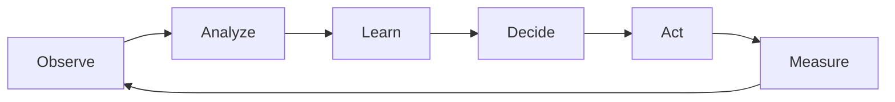

# Pillar V: Distribution of Intelligence

!!! info "Prerequisites"
    - [Pillar 4: Distribution of Control](../pillar-4-control/index.md)
    - Understanding of [Axiom 6: Observability](../../part1-axioms/axiom-6-observability/index.md)
    - Basic machine learning concepts

!!! tip "Quick Navigation"
    [← Pillar 4](../pillar-4-control/index.md) |
    [Examples →](examples.md) |
    [Exercises →](exercises.md) |
    [↑ Pillars Overview](../index.md)

## Overview

<div class="axiom-box">
<h3>🧠 The Intelligence Principle</h3>
<p><strong>"Systems that adapt survive; systems that learn thrive."</strong></p>
<p>Intelligence in distributed systems isn't just about ML/AI—it's about creating systems that observe, learn, adapt, and improve autonomously.</p>
</div>

## The Intelligence Stack

Understanding the levels of system intelligence helps you choose the right approach:

### Level 1: Static Systems
- Fixed configurations
- Manual intervention required
- No learning from experience
- Example: Hard-coded thresholds

### Level 2: Reactive Systems
- Respond to current conditions
- Simple rule-based decisions
- No memory of past events
- Example: Basic auto-scaling

### Level 3: Adaptive Systems
- Learn from patterns
- Self-tuning parameters
- Dynamic optimization
- Example: Adaptive routing

### Level 4: Predictive Systems
- Forecast future states
- Preemptive actions
- Anomaly prevention
- Example: Predictive scaling

## Core Concepts

### 1. Observability → Intelligence Pipeline



### 2. Distributed Learning Patterns

#### Federated Learning
- Models trained at edge
- Only gradients shared centrally
- Privacy-preserving
- Reduced bandwidth

```python
# Federated learning concept
class FederatedNode:
    def train_local(self, local_data):
        # Train on local data
        gradients = self.model.compute_gradients(local_data)
        return gradients
    
    def update_model(self, global_weights):
        # Update from aggregated gradients
        self.model.weights = global_weights
```

#### Edge Intelligence
- Inference at the edge
- Centralized training
- Low latency decisions
- Periodic model updates

### 3. AIOps Feedback Loop

The modern approach to operations combines human expertise with machine intelligence:

1. **Observe**: Collect metrics, logs, traces, events
2. **Analyze**: Detect anomalies, find correlations
3. **Decide**: Use ML models and policy engines
4. **Act**: Scale, reroute, restart, alert
5. **Learn**: Update models based on outcomes

## Decision Framework

### When to Add Intelligence

Use this framework to decide the appropriate level of intelligence:

<div class="decision-box">
<h4>Intelligence Level Selection</h4>

**Choose Static (Level 1) when:**
- Problem space is well-understood
- Conditions rarely change
- Simplicity is paramount
- Cost must be minimized

**Choose Reactive (Level 2) when:**
- Clear cause-effect relationships
- Fast response needed
- Limited historical data
- Moderate complexity acceptable

**Choose Adaptive (Level 3) when:**
- Patterns change over time
- Multiple variables interact
- Historical data available
- Optimization is valuable

**Choose Predictive (Level 4) when:**
- Future states affect current decisions
- Cost of being wrong is high
- Abundant historical data
- Resources available for ML
</div>

## Control Theory Application

Apply classic control theory to distributed systems:

### PID Controllers in Systems

```python
class SystemPIDController:
    """Apply PID control to system metrics"""
    
    def __init__(self, setpoint, kp=1.0, ki=0.1, kd=0.05):
        self.setpoint = setpoint
        self.kp = kp  # Proportional gain
        self.ki = ki  # Integral gain  
        self.kd = kd  # Derivative gain
        
        self.integral = 0
        self.last_error = 0
        
    def compute(self, measured_value):
        error = self.setpoint - measured_value
        
        # P: React to current error
        p_term = self.kp * error
        
        # I: Eliminate steady-state error
        self.integral += error
        i_term = self.ki * self.integral
        
        # D: Predict future error
        derivative = error - self.last_error
        d_term = self.kd * derivative
        
        self.last_error = error
        
        return p_term + i_term + d_term
```

## Common Patterns

### 1. Anomaly Detection

```python
# Statistical anomaly detection
def detect_anomaly(value, history, threshold=3):
    mean = np.mean(history)
    std = np.std(history)
    z_score = abs((value - mean) / std)
    return z_score > threshold
```

### 2. Predictive Scaling

```python
# Time-series prediction for scaling
class PredictiveScaler:
    def predict_load(self, historical_data):
        # Use ARIMA, Prophet, or LSTM
        model = fit_model(historical_data)
        future_load = model.forecast(horizon=30)
        return future_load
        
    def scale_preemptively(self, predicted_load):
        if predicted_load > current_capacity * 0.8:
            scale_up(predicted_load * 1.2)
```

### 3. Intelligent Routing

```python
# ML-based request routing
class IntelligentRouter:
    def route_request(self, request, system_state):
        features = extract_features(request, system_state)
        best_backend = self.model.predict(features)
        return best_backend
```

## Anti-Patterns to Avoid

### 1. Over-Engineering
- Using ML where simple rules suffice
- Complex models for linear relationships
- Premature optimization

### 2. Black Box Operations
- Models that can't explain decisions
- No visibility into reasoning
- Difficult debugging

### 3. Feedback Loops
- ML amplifying biases
- Reinforcing bad patterns
- Unstable control systems

### 4. Cold Start Problems
- No data to learn from initially
- Poor initial predictions
- Long convergence time

### 5. Adversarial Behavior
- Systems gamed by users
- Models learning wrong patterns
- Exploitation of predictions

## Quick Reference

### Intelligence Levels Comparison

| Level | Complexity | Adaptability | Resource Cost | Use Case |
|-------|------------|--------------|---------------|----------|
| Static | Low | None | Minimal | Stable environments |
| Reactive | Medium | Limited | Low | Dynamic thresholds |
| Adaptive | High | Good | Medium | Changing patterns |
| Predictive | Very High | Excellent | High | Complex optimization |

### ML Readiness Checklist

- [ ] Sufficient historical data
- [ ] Clear optimization metrics
- [ ] Ability to measure outcomes
- [ ] Fallback mechanisms
- [ ] Explainability requirements
- [ ] Resource budget
- [ ] Maintenance capability

## Summary

Distribution of Intelligence transforms reactive systems into proactive ones:

1. **Levels of Intelligence**: From static to predictive
2. **Learning Patterns**: Federated, edge, centralized
3. **Control Theory**: PID and feedback loops
4. **AIOps Integration**: Human + machine intelligence
5. **Anti-Patterns**: Avoid over-engineering and black boxes

Remember: The goal isn't to add AI everywhere, but to add intelligence where it provides value. Start simple, measure impact, and evolve based on data.

## Next Steps

- Explore [Intelligence Examples](examples.md) for real-world applications
- Try the [Intelligence Exercises](exercises.md) to build ML-driven systems
- Return to [Pillars Overview](../index.md) for the complete picture