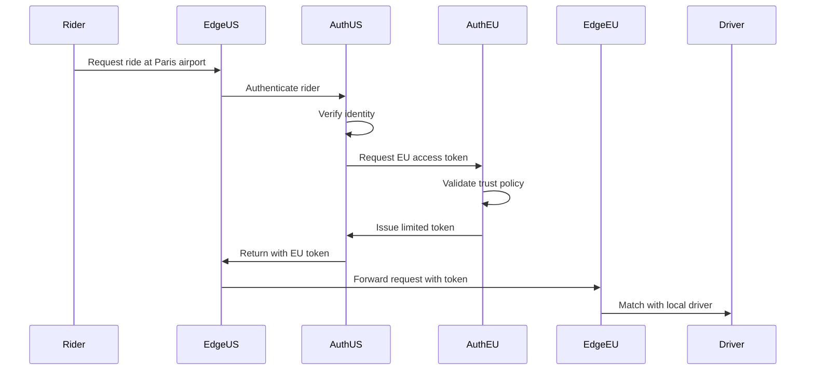

# Trust Distribution Examples

!!! info "Real-World Applications"
    These examples demonstrate how trust distribution principles are applied in production systems across different industries.

## Example 1: Netflix's Zero Trust Architecture

### Background
Netflix operates at massive scale with microservices deployed across multiple AWS regions, serving 200M+ subscribers globally.

### Trust Implementation

```yaml
# Netflix's Trust Layers
1. Edge Security:
   - TLS termination at edge
   - DDoS protection
   - Geographic filtering

2. Service Identity:
   - Every service has SPIFFE identity
   - Short-lived certificates (1 hour)
   - Automatic rotation

3. Service Mesh:
   - Envoy sidecars for all services
   - mTLS between all services
   - Fine-grained authorization policies

4. Data Protection:
   - Encryption at rest for all data
   - Field-level encryption for PII
   - Tokenization for payment data
```

### Key Insights

<div class="insight-box">

**What Makes It Work:**
- **Automation**: Security is invisible to developers
- **Performance**: mTLS adds <1ms latency
- **Resilience**: Security failures don't break streaming
- **Scale**: Same patterns from 1 to 10,000 services

</div>

### Code Example: Service Authentication

```java
// Netflix's service-to-service authentication
@Component
public class SecureServiceClient {
    private final SidecarProxy sidecar;
    
    public Response callService(String service, Request request) {
        // Identity automatically injected by sidecar
        ServiceIdentity identity = sidecar.getIdentity();
        
        // mTLS handled transparently
        return sidecar.secureCall(
            service,
            request,
            identity,
            RetryPolicy.withExponentialBackoff()
        );
    }
}
```

---

## Example 2: Uber's Multi-Region Trust Model

### Background
Uber operates in 900+ cities with strict data residency requirements and real-time operations.

### Trust Challenges
1. Drivers and riders in different trust domains
2. Cross-region operations (airport pickups)
3. Payment processing across boundaries
4. Regulatory compliance per region

### Implementation

```python
class RegionalTrustBroker:
    """Uber's cross-region trust federation"""
    
    def __init__(self):
        self.regional_authorities = {}
        self.trust_policies = {}
        
    async def validate_cross_region_operation(self, operation):
        source_region = operation.source_region
        target_region = operation.target_region
        
        # Check if regions have trust agreement
        if not self.has_trust_agreement(source_region, target_region):
            raise TrustException("No trust agreement between regions")
            
        # Validate operation type is allowed
        allowed_ops = self.trust_policies[source_region][target_region]
        if operation.type not in allowed_ops:
            raise TrustException(f"Operation {operation.type} not allowed")
            
        # Get federated token
        token = await self.get_federated_token(
            source_region,
            target_region,
            operation
        )
        
        # Audit cross-region access
        await self.audit_cross_region_access(operation, token)
        
        return token
```

### Trust Flow Diagram



---

## Example 3: Financial Services Regulatory Trust

### Background
A global bank must comply with different regulations in each jurisdiction while enabling cross-border transactions.

### Compliance-Driven Trust Model

```python
class RegulatoryTrustFramework:
    """Trust model that adapts to regulatory requirements"""
    
    def __init__(self):
        self.jurisdictions = {}
        self.compliance_rules = {}
        
    def create_trust_context(self, transaction):
        # Determine applicable jurisdictions
        jurisdictions = self.determine_jurisdictions(transaction)
        
        # Build composite compliance requirements
        requirements = set()
        for jurisdiction in jurisdictions:
            requirements.update(self.compliance_rules[jurisdiction])
            
        # Create trust context with all requirements
        return TrustContext(
            jurisdictions=jurisdictions,
            requirements=requirements,
            audit_level=max(j.audit_level for j in jurisdictions),
            data_residency=self.calculate_residency_requirements(jurisdictions)
        )
    
    def validate_transaction(self, transaction, context):
        validations = []
        
        # KYC/AML checks
        if 'KYC_REQUIRED' in context.requirements:
            validations.append(self.validate_kyc(transaction))
            
        # Data residency checks
        if context.data_residency:
            validations.append(self.validate_data_location(transaction))
            
        # Encryption requirements
        if 'ENCRYPTION_REQUIRED' in context.requirements:
            validations.append(self.validate_encryption(transaction))
            
        return all(validations)
```

### Multi-Jurisdiction Transaction Flow

<div class="transaction-flow">

```
Transaction: US Customer → EU Merchant → Singapore Bank

Trust Requirements:
├── US (OFAC Compliance)
│   ├── Sanctions screening
│   └── Transaction reporting
├── EU (GDPR)
│   ├── Data minimization
│   ├── Right to erasure
│   └── Data portability
└── Singapore (PDPA)
    ├── Consent requirements
    └── Data localization

Composite Trust Policy:
- Highest encryption standard (EU)
- Strictest data retention (US)
- Most restrictive access (Singapore)
```

</div>

---

## Example 4: Healthcare Data Trust Boundaries

### Background
Healthcare system managing patient data across providers, insurers, and research institutions.

### HIPAA-Compliant Trust Model

```java
@Service
public class HealthcareTrustManager {
    
    public class PatientDataAccess {
        private final AuditLogger auditLogger;
        private final ConsentManager consentManager;
        private final EncryptionService encryption;
        
        public PatientData accessPatientData(
            String patientId,
            String requesterId,
            Purpose purpose
        ) {
            // Verify requester identity and role
            Identity identity = verifyIdentity(requesterId);
            if (!hasValidHealthcareCredentials(identity)) {
                throw new UnauthorizedException("Invalid healthcare credentials");
            }
            
            // Check patient consent
            Consent consent = consentManager.getConsent(patientId, purpose);
            if (!consent.isGranted()) {
                throw new ConsentException("Patient consent not granted");
            }
            
            // Verify minimum necessary principle
            DataScope scope = determineMinimumNecessary(identity.role, purpose);
            
            // Fetch and decrypt data
            EncryptedData encrypted = dataStore.fetch(patientId, scope);
            PatientData data = encryption.decrypt(encrypted, identity);
            
            // Comprehensive audit trail
            auditLogger.logAccess(new AccessEvent(
                patientId: patientId,
                requesterId: requesterId,
                purpose: purpose,
                dataAccessed: scope,
                timestamp: Instant.now(),
                consent: consent.id
            ));
            
            return data;
        }
    }
}
```

### Break-Glass Emergency Access

```python
class EmergencyAccessProtocol:
    """Handle emergency access with retroactive approval"""
    
    async def emergency_access(self, request):
        # Verify emergency context
        if not self.is_valid_emergency(request.context):
            raise SecurityException("Invalid emergency context")
            
        # Log break-glass event immediately
        event_id = await self.log_break_glass_event(request)
        
        # Grant temporary elevated access
        temp_token = self.issue_emergency_token(
            identity=request.identity,
            scope=EmergencyScope.LIFE_SAVING,
            duration=timedelta(hours=1),
            audit_id=event_id
        )
        
        # Schedule retroactive review
        await self.schedule_review(
            event_id=event_id,
            reviewers=self.get_emergency_reviewers(),
            deadline=timedelta(hours=24)
        )
        
        # Alert security team
        await self.alert_security_team(event_id, request)
        
        return temp_token
```

---

## Example 5: E-Commerce Fraud Prevention Trust

### Background
Large e-commerce platform using dynamic trust scoring to prevent fraud while minimizing friction for legitimate customers.

### Adaptive Trust Scoring

```python
class AdaptiveTrustScorer:
    """Real-time trust scoring with ML"""
    
    def __init__(self):
        self.feature_extractors = []
        self.ml_model = load_model('fraud_detection_v3')
        self.threshold_optimizer = ThresholdOptimizer()
        
    async def score_transaction(self, transaction):
        # Extract features
        features = await self.extract_features(transaction)
        
        # Base ML score
        ml_score = self.ml_model.predict_proba(features)[0][1]
        
        # Adjust based on real-time signals
        adjusted_score = ml_score
        
        # Device trust
        device_trust = await self.get_device_trust(transaction.device_id)
        adjusted_score *= (0.5 + 0.5 * device_trust)
        
        # Location consistency
        location_risk = await self.assess_location_risk(transaction)
        adjusted_score *= (1 + location_risk)
        
        # Velocity checks
        velocity_risk = await self.check_velocity(transaction.user_id)
        adjusted_score *= (1 + velocity_risk)
        
        # Business rules override
        if self.is_trusted_customer(transaction.user_id):
            adjusted_score *= 0.5  # Reduce risk score
            
        return TrustScore(
            raw_score=ml_score,
            adjusted_score=adjusted_score,
            factors={
                'device_trust': device_trust,
                'location_risk': location_risk,
                'velocity_risk': velocity_risk
            },
            action=self.determine_action(adjusted_score)
        )
    
    def determine_action(self, score):
        if score < 0.3:
            return 'ALLOW'
        elif score < 0.7:
            return 'CHALLENGE'  # Additional verification
        else:
            return 'BLOCK'
```

### Trust Score Visualization

<div class="trust-score-viz">

```
Customer Journey Trust Score Evolution:

New Customer:
├── First Visit:      0.3 (Low trust)
├── Email Verified:   0.4 (+0.1)
├── First Purchase:   0.5 (+0.1)
├── No Chargebacks:   0.6 (+0.1)
└── 6 Month History:  0.8 (+0.2)

Suspicious Activity:
├── Normal:           0.8
├── New Device:       0.6 (-0.2)
├── New Location:     0.5 (-0.1)
├── High Value:       0.4 (-0.1)
└── Multiple Cards:   0.3 (-0.1) → CHALLENGE
```

</div>

---

## Common Patterns Across Examples

### 1. Graduated Trust
All examples implement multiple levels of trust rather than binary allow/deny.

### 2. Context-Aware Decisions
Trust decisions consider context: purpose, location, time, behavior patterns.

### 3. Audit Everything
Comprehensive audit trails for compliance and investigation.

### 4. Graceful Degradation
Security measures that fail safe without breaking functionality.

### 5. Automation First
Security that's automatic and invisible when possible.

## Key Takeaways

!!! success "Lessons from Production"
    
    1. **Start with identity**: Strong identity is the foundation
    2. **Automate security**: Manual processes don't scale
    3. **Make it invisible**: Good security doesn't impede development
    4. **Monitor and adapt**: Trust models must evolve with threats
    5. **Plan for failure**: Security systems must fail gracefully

## Next Steps

Ready to implement these patterns? Try the [Trust Distribution Exercises](exercises.md) →