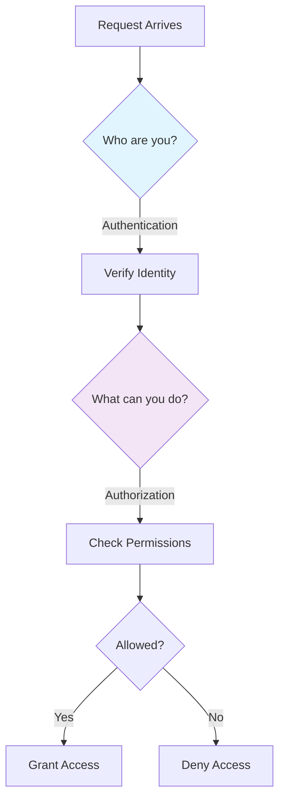
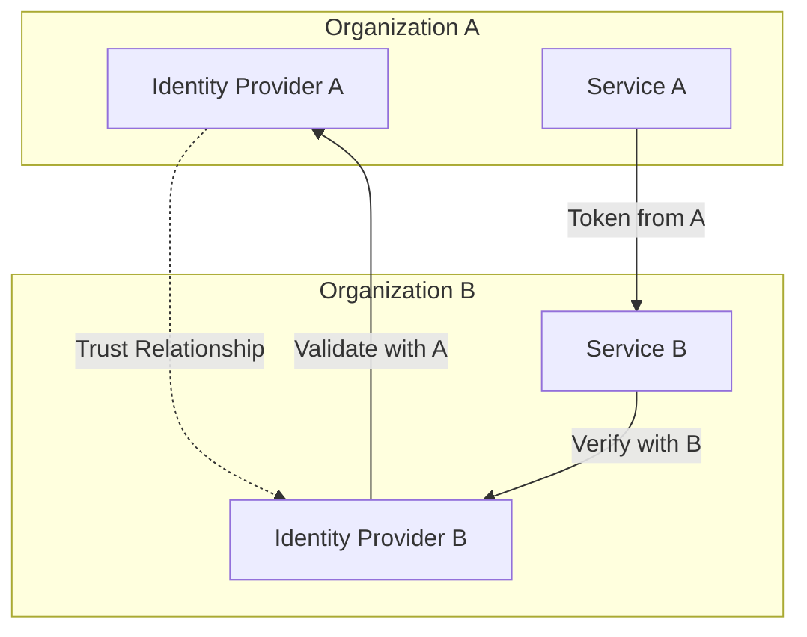

# Pillar VI: Distribution of Trust (Security)

!!! info "Prerequisites"
    - All 8 Axioms (security touches everything)
    - [Pillar 3: Distribution of Truth](../pillar-3-truth/index.md) (consistency and trust)
    - [Pillar 4: Distribution of Control](../pillar-4-control/index.md) (secure control planes)

!!! tip "Quick Navigation"
    [← Pillar 5](../pillar-5-intelligence/index.md) |
    [Examples →](examples.md) |
    [Exercises →](exercises.md) |
    [↑ Pillars Overview](../index.md)

!!! target "Learning Objective"
    Trust is not binary in distributed systems. Learn how to distribute trust appropriately, implement defense in depth, and design systems that remain secure even when partially compromised.

## Why Trust is a Pillar

<div class="axiom-box">

**The Trust Paradox**

In monolithic systems, trust is binary: you're either inside the perimeter or outside. In distributed systems, trust must be:
- **Graduated**: Different levels for different components
- **Verified**: "Trust but verify" at every interaction
- **Distributed**: No single point of trust failure
- **Dynamic**: Trust levels change based on behavior

</div>

## The Evolution of Trust Models

### Traditional Perimeter Security (Castle Model)
```
         Firewall
            │
    ┌───────┴───────┐
    │               │
    │  Trusted      │
    │  Internal     │
    │  Network      │
    │               │
    └───────────────┘
    
Problems:
- Binary trust model
- Lateral movement after breach
- Insider threats unaddressed
- Cloud/mobile breaks perimeter
```

### Zero Trust Architecture (City Model)
```
    Service A ←--mTLS--→ Service B
         ↓                    ↓
    Verify Each          Verify Each
    Connection           Connection
         ↓                    ↓
    Service C ←--mTLS--→ Service D
    
Principles:
- Never trust, always verify
- Least privilege access
- Assume breach
- Verify explicitly
```

## Core Concepts

### 1. Trust Boundaries

<div class="trust-boundary-diagram">

```
┌─────────────────────────────────────────────┐
│ Trust Boundary 1: User Device               │
│  • Least trusted                            │
│  • Assume compromised                       │
│  • Validate all input                       │
├─────────────────────────────────────────────┤
│ Trust Boundary 2: Edge/CDN                  │
│  • Limited trust                            │
│  • Static content only                      │
│  • No sensitive data                        │
├─────────────────────────────────────────────┤
│ Trust Boundary 3: API Gateway               │
│  • Authentication point                     │
│  • Rate limiting                            │
│  • Input validation                         │
├─────────────────────────────────────────────┤
│ Trust Boundary 4: Service Mesh             │
│  • Service-to-service auth                 │
│  • Encrypted communication                  │
│  • Policy enforcement                       │
├─────────────────────────────────────────────┤
│ Trust Boundary 5: Data Layer               │
│  • Highest trust required                   │
│  • Encryption at rest                       │
│  • Access audit logs                        │
└─────────────────────────────────────────────┘
```

</div>

### 2. Authentication vs Authorization



### 3. The Trust Equation

<div class="formula-box">

```
Trust Score = Identity Confidence × 
              Behavior History × 
              Context Appropriateness ×
              (1 - Risk Level)

Where:
- Identity Confidence: How sure we are of who they claim to be
- Behavior History: Past actions and patterns
- Context Appropriateness: Request makes sense given context
- Risk Level: Potential damage if trust is misplaced
```

</div>

## Implementing Zero Trust

### Step 1: Identity Foundation

```yaml
# Service Identity with SPIFFE
service_identity:
  spiffe_id: "spiffe://prod.company.com/ns/payments/sa/processor"
  
  attestation:
    - workload_attestor: kubernetes
    - node_attestor: aws_iid
    
  svid_ttl: 1h
  rotation_frequency: 30m
```

### Step 2: Mutual TLS (mTLS) Everywhere

```go
// Automatic mTLS in service mesh
type SecureClient struct {
    tlsConfig *tls.Config
}

func (c *SecureClient) Call(service string, request interface{}) error {
    // Certificate automatically injected by sidecar
    conn, err := tls.Dial("tcp", service+":443", c.tlsConfig)
    if err != nil {
        return fmt.Errorf("mTLS connection failed: %w", err)
    }
    
    // Verify service identity
    if err := c.verifyPeerIdentity(conn); err != nil {
        return fmt.Errorf("peer verification failed: %w", err)
    }
    
    // Proceed with encrypted, authenticated communication
    return c.sendRequest(conn, request)
}
```

### Step 3: Policy as Code

```rego
# Open Policy Agent (OPA) example
package authz

default allow = false

# Allow read access to own data
allow {
    input.method == "GET"
    input.path[0] == "users"
    input.path[1] == input.user_id
}

# Allow service-to-service calls with proper identity
allow {
    input.source_service != ""
    service_allowed[input.source_service][input.target_service]
    input.method in allowed_methods[input.source_service]
}

service_allowed := {
    "frontend": {"api-gateway", "cdn"},
    "api-gateway": {"user-service", "payment-service"},
    "payment-service": {"fraud-detection", "payment-processor"}
}
```

### Step 4: Secrets Management

```python
class SecureSecretManager:
    """Distributed secrets with automatic rotation"""
    
    def __init__(self, vault_client):
        self.vault = vault_client
        self.cache = TTLCache(maxsize=1000, ttl=300)  # 5 min cache
        
    async def get_secret(self, path: str, version: str = None):
        # Check cache first
        cache_key = f"{path}:{version or 'latest'}"
        if cache_key in self.cache:
            return self.cache[cache_key]
            
        # Fetch from vault with authentication
        secret = await self.vault.read_secret(
            path=path,
            version=version,
            auth_token=self.get_service_token()
        )
        
        # Decrypt if necessary
        if secret.encrypted:
            secret = self.decrypt_with_kms(secret)
            
        self.cache[cache_key] = secret
        return secret
        
    def decrypt_with_kms(self, encrypted_secret):
        # Use envelope encryption
        # DEK (Data Encryption Key) encrypted by KEK (Key Encryption Key)
        dek = self.kms.decrypt(encrypted_secret.encrypted_dek)
        return self.decrypt_data(encrypted_secret.ciphertext, dek)
```

## Defense in Depth Patterns

### Layer 1: Network Security

```yaml
network_policies:
  ingress:
    - from:
      - namespaceSelector:
          matchLabels:
            name: frontend
      ports:
      - protocol: TCP
        port: 8080
        
  egress:
    - to:
      - namespaceSelector:
          matchLabels:
            name: backend
      ports:
      - protocol: TCP
        port: 5432
```

### Layer 2: Application Security

```python
@rate_limit(calls=100, period=timedelta(minutes=1))
@validate_input(schema=RequestSchema)
@authenticate(methods=['jwt', 'mtls'])
@authorize(roles=['user', 'admin'])
@audit_log
async def secure_endpoint(request):
    # Input already validated
    # User already authenticated
    # Authorization already checked
    # Rate limits already applied
    # Audit trail already started
    
    # Business logic here
    result = await process_request(request)
    
    # Output encoding
    return sanitize_output(result)
```

### Layer 3: Data Security

```sql
-- Transparent data encryption
CREATE TABLE sensitive_data (
    id UUID PRIMARY KEY,
    -- Encrypted at rest
    ssn_encrypted BYTEA,
    -- Hashed for searching
    ssn_hash VARCHAR(64),
    -- Audit fields
    created_by VARCHAR(255) NOT NULL,
    accessed_by JSONB DEFAULT '[]'::jsonb,
    -- Row-level security
    owner_id UUID NOT NULL
);

-- Enable row-level security
ALTER TABLE sensitive_data ENABLE ROW LEVEL SECURITY;

-- Policy: users can only see their own data
CREATE POLICY user_isolation ON sensitive_data
    FOR ALL
    USING (owner_id = current_user_id());
```

## Trust Distribution Patterns

### 1. Federated Trust



### 2. Blockchain-Based Trust

```python
class DistributedTrustLedger:
    """Immutable trust records across organizations"""
    
    def record_trust_event(self, event):
        # Create immutable record
        record = {
            'timestamp': time.time(),
            'actor': event.actor_id,
            'action': event.action,
            'resource': event.resource_id,
            'outcome': event.outcome,
            'signature': self.sign(event)
        }
        
        # Add to distributed ledger
        block = self.blockchain.add_block(record)
        
        # Replicate to other nodes
        self.replicate_block(block)
        
        return block.hash
```

### 3. Trust Scoring

```python
class TrustScorer:
    """Dynamic trust scoring based on behavior"""
    
    def calculate_trust_score(self, entity_id: str) -> float:
        # Historical behavior
        history = self.get_behavior_history(entity_id)
        
        # Base score from identity verification
        base_score = self.identity_confidence[entity_id]
        
        # Adjust based on behavior
        behavior_multiplier = 1.0
        
        # Recent failures reduce trust
        recent_failures = self.count_recent_failures(history, days=7)
        behavior_multiplier *= (1 - 0.1 * recent_failures)
        
        # Unusual patterns reduce trust
        if self.detect_anomaly(history):
            behavior_multiplier *= 0.5
            
        # Long positive history increases trust
        if len(history) > 1000 and self.failure_rate(history) < 0.01:
            behavior_multiplier *= 1.2
            
        return max(0, min(1, base_score * behavior_multiplier))
```

## Security Incident Response

### Automated Response Pipeline

```python
class SecurityIncidentResponder:
    """Automated security incident response"""
    
    async def handle_incident(self, incident):
        severity = self.assess_severity(incident)
        
        # Immediate containment
        if severity >= Severity.HIGH:
            await self.contain_threat(incident)
            
        # Gather evidence
        evidence = await self.collect_evidence(incident)
        
        # Notify stakeholders
        await self.notify_stakeholders(incident, severity)
        
        # Automated remediation
        if incident.type in self.auto_remediate_types:
            await self.auto_remediate(incident)
        else:
            await self.create_incident_ticket(incident, evidence)
            
        # Update security policies
        await self.update_policies_from_incident(incident)
    
    async def contain_threat(self, incident):
        """Immediate threat containment"""
        
        # Isolate affected services
        for service in incident.affected_services:
            await self.network_isolate(service)
            
        # Revoke compromised credentials
        for credential in incident.compromised_credentials:
            await self.revoke_credential(credential)
            
        # Block malicious IPs
        for ip in incident.malicious_ips:
            await self.block_ip_globally(ip)
```

## Common Security Anti-Patterns

### ❌ Security Through Obscurity
```python
# BAD: Hidden endpoint
@app.route('/secret_admin_panel_2024')
def admin():
    return render_admin()

# GOOD: Proper authentication
@app.route('/admin')
@require_auth(roles=['admin'])
def admin():
    return render_admin()
```

### ❌ Trusting the Network
```python
# BAD: Assume internal network is safe
def internal_api_call(service, data):
    return requests.post(f"http://{service}/api", json=data)

# GOOD: Always authenticate and encrypt
def internal_api_call(service, data):
    return requests.post(
        f"https://{service}/api",
        json=data,
        cert=(CLIENT_CERT, CLIENT_KEY),
        verify=CA_BUNDLE
    )
```

### ❌ Over-Trusting After Authentication
```python
# BAD: Authenticate once, trust forever
if user.is_authenticated:
    return all_sensitive_data()

# GOOD: Continuous verification
if user.is_authenticated:
    if user.has_permission('read_sensitive'):
        if not user.requires_mfa() or user.has_recent_mfa():
            if not detect_anomaly(user.current_request):
                return filtered_sensitive_data(user.access_level)
```

## Security Checklist

### Design Phase
- [ ] Threat model completed (STRIDE/PASTA)
- [ ] Trust boundaries identified
- [ ] Authentication strategy chosen
- [ ] Authorization model defined
- [ ] Encryption requirements specified
- [ ] Compliance requirements mapped

### Implementation Phase
- [ ] All communication encrypted (TLS 1.3+)
- [ ] Mutual authentication implemented
- [ ] Secrets managed properly (no hardcoding)
- [ ] Input validation comprehensive
- [ ] Output encoding correct
- [ ] Security headers configured

### Operational Phase
- [ ] Security monitoring active
- [ ] Incident response plan tested
- [ ] Regular security updates
- [ ] Penetration testing scheduled
- [ ] Compliance audits passed
- [ ] Team security training current

<div class="truth-box">

**Counter-Intuitive Truth 💡**

The most secure distributed system isn't the one with the most security features—it's the one where security is so well integrated that users and developers barely notice it. Great security is invisible, automatic, and enables rather than restricts.

</div>

## Key Takeaways

!!! success "Remember"
    
    1. **Zero Trust is the new perimeter** - Never trust, always verify
    2. **Defense in depth** - Multiple layers of security
    3. **Trust is graduated, not binary** - Different levels for different contexts
    4. **Automate security responses** - Humans can't react fast enough
    5. **Security enables distribution** - Good security allows safe scaling

## Navigation

!!! tip "Continue Learning"
    
    **Deep Dive**: [Trust Distribution Examples](examples.md) →
    
    **Practice**: [Security Exercises](exercises.md) →
    
    **Return to**: [Pillars Overview](../index.md) ↑
    
    **Related**: [Security Considerations](../../reference/security-considerations.md) | [Zero Trust Guide](../../reference/zero-trust-guide.md)