<!-- Navigation -->
[Home](../../introduction/index.md) → [Part II: Pillars](../index.md) → [State](index.md) → **State Management Examples**

# State Management Examples

## Real-World Case Studies

### 1. Amazon DynamoDB: Eventually Consistent by Design

**Problem**: Build a database that scales to millions of requests per second with predictable performance

**Architecture Evolution**:

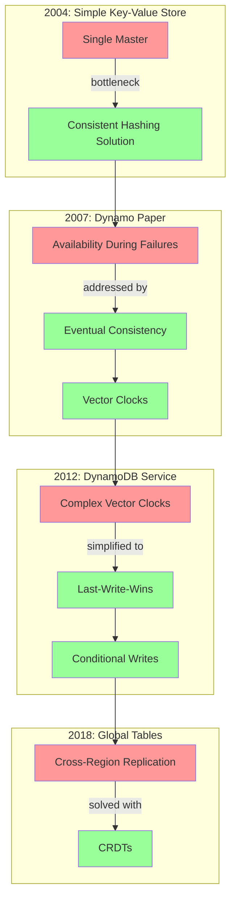

**Key Design Decisions**:

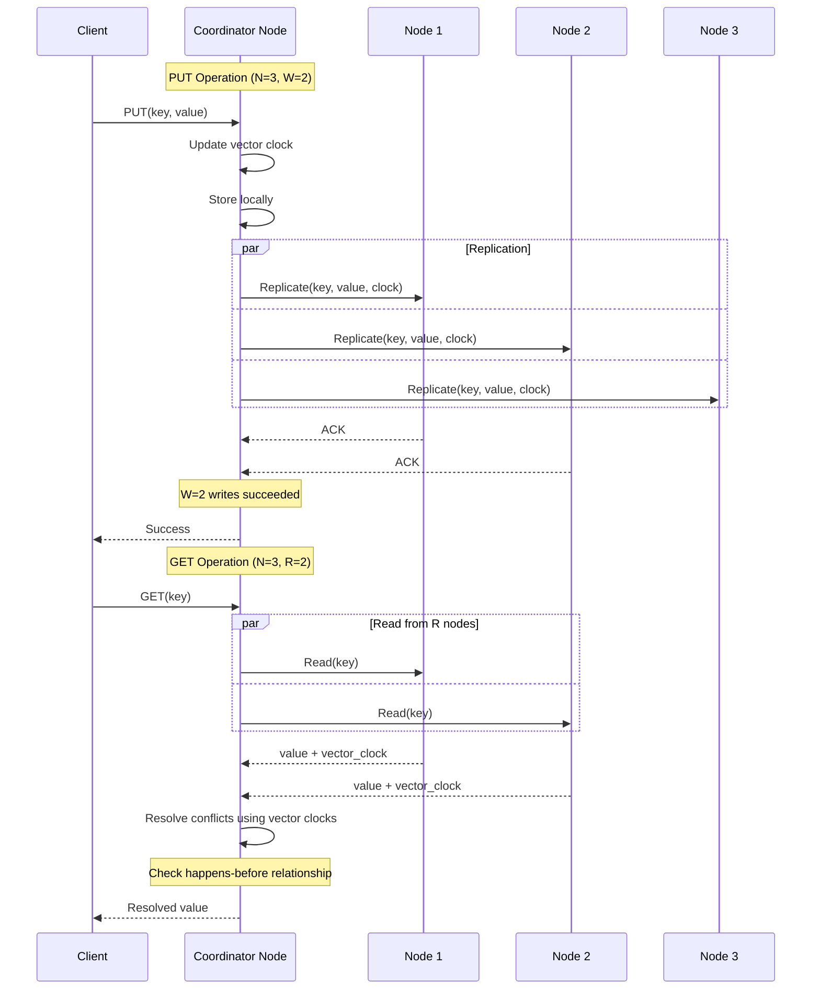

### DynamoDB Quorum Configuration

| Parameter | Description | Typical Value |
|-----------|-------------|---------------|
| N | Number of replicas | 3 |
| W | Write quorum | 2 |
| R | Read quorum | 2 |
| DW | Durable write quorum | 1 |
| RW | Read-write quorum | N |

### Consistency Guarantees

| Configuration | Consistency Level | Use Case |
|---------------|-------------------|----------|
| W + R > N | Strong consistency | Critical data |
| W + R ≤ N | Eventual consistency | High availability |
| W = N | Read availability during failures | Write-heavy workloads |
| R = N | Write availability during failures | Read-heavy workloads |

**Lessons Learned**:
- Vector clocks are powerful but complex for developers
- Last-write-wins is often good enough with proper conflict detection
- Conditional writes can replace many vector clock use cases
- CRDTs enable truly conflict-free multi-region replication

### 2. Redis Cluster: Sharding with Availability

**Problem**: Scale Redis beyond single-machine memory limits while maintaining sub-millisecond latency

**Architecture**:

```mermaid
graph TB
    subgraph "Hash Slot Distribution (16,384 slots)"
        MA[Master A<br/>Slots 0-5460]
        MB[Master B<br/>Slots 5461-10922]
        MC[Master C<br/>Slots 10923-16383]
        
        RA[Replica A]
        RB[Replica B]
        RC[Replica C]
        
        MA -.->|replication| RA
        MB -.->|replication| RB
        MC -.->|replication| RC
    end
    
    subgraph "Client Request Routing"
        Client[Client] -->|CRC16(key) % 16384| Slot[Hash Slot]
        Slot -->|Slot Mapping| Master[Appropriate Master]
    end
    
    style MA fill:#ff9999
    style MB fill:#99ff99
    style MC fill:#9999ff
    style RA fill:#ffcccc
    style RB fill:#ccffcc
    style RC fill:#ccccff
```

**Implementation Details**:

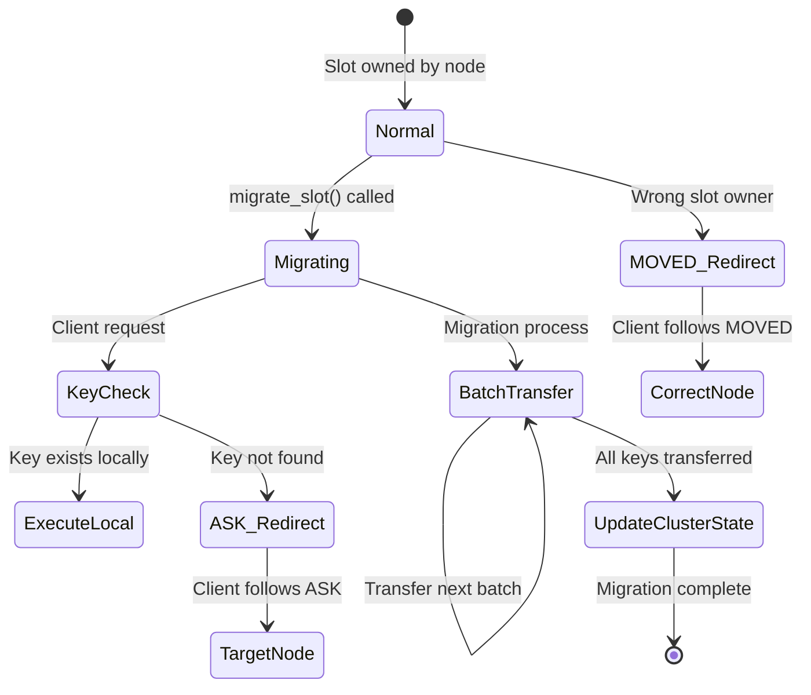

### Redis Cluster Slot Migration Process

| Phase | Source Node | Target Node | Client Behavior |
|-------|-------------|-------------|----------------|
| 1. Pre-migration | Owns slot | - | Routes to source |
| 2. Migration starts | MIGRATING state | IMPORTING state | May get ASK redirects |
| 3. Key transfer | Transfers keys in batches | Receives keys | Handles both nodes |
| 4. Post-migration | - | Owns slot | Routes to target |

### Redirect Types

| Type | Meaning | Client Action | Persistence |
|------|---------|---------------|-------------|
| MOVED | Slot permanently moved | Update slot mapping | Permanent |
| ASK | Key might be migrating | One-time redirect | Temporary |

**Resharding Process**:

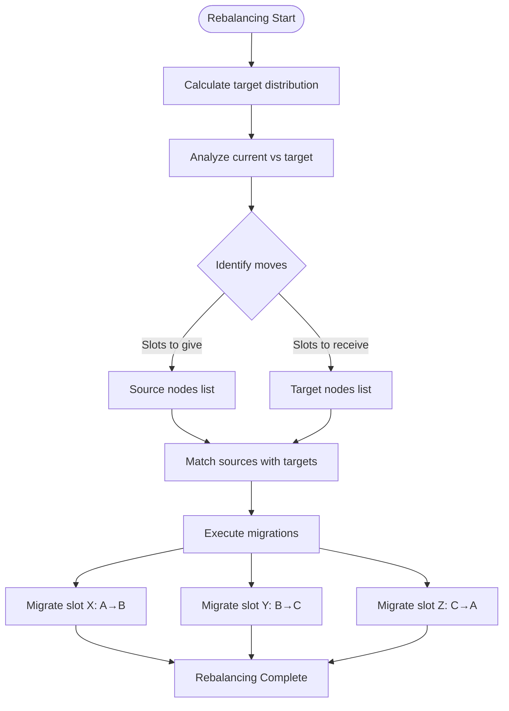

### Slot Distribution Example (3 nodes → 4 nodes)

| Node | Before (3 nodes) | After (4 nodes) | Slots to Move |
|------|------------------|-----------------|---------------|
| A | 0-5461 (5462 slots) | 0-4095 (4096 slots) | Give: 1366 |
| B | 5462-10922 (5461 slots) | 4096-8191 (4096 slots) | Give: 1365 |
| C | 10923-16383 (5461 slots) | 8192-12287 (4096 slots) | Give: 1365 |
| D | - | 12288-16383 (4096 slots) | Receive: 4096 |

### 3. Cassandra: Tunable Consistency

**Problem**: Provide tunable consistency levels per operation while maintaining high availability

**Consistency Levels**:

### Cassandra Consistency Levels

| Level | Write Requirement | Read Requirement | Use Case |
|-------|------------------|------------------|----------|
| ANY | Any node (including hints) | N/A | Maximum availability |
| ONE | 1 replica | 1 replica | High performance |
| TWO | 2 replicas | 2 replicas | Moderate consistency |
| THREE | 3 replicas | 3 replicas | Higher consistency |
| QUORUM | ⌊RF/2⌋ + 1 | ⌊RF/2⌋ + 1 | Strong consistency |
| ALL | All replicas | All replicas | Maximum consistency |
| LOCAL_QUORUM | Majority in local DC | Majority in local DC | Multi-DC strong consistency |
| EACH_QUORUM | Majority in each DC | N/A | Global strong writes |
| LOCAL_ONE | 1 in local DC | 1 in local DC | DC-aware performance |

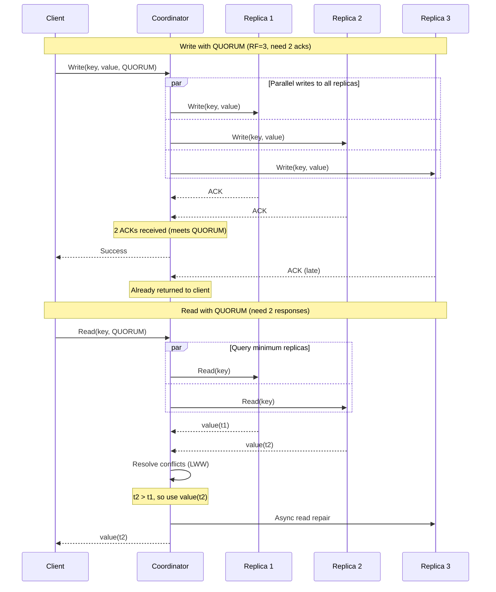

### Consistency Arithmetic

| Scenario | Formula | Result |
|----------|---------|--------|  
| Strong Consistency | W + R > RF | Always see latest write |
| Eventual Consistency | W + R ≤ RF | May see stale data |
| Read Heavy | W = 1, R = RF | Fast writes, consistent reads |
| Write Heavy | W = RF, R = 1 | Consistent writes, fast reads |

### 4. Elasticsearch: Distributed Search State

**Problem**: Maintain search indices across distributed nodes with real-time updates

**Architecture**:

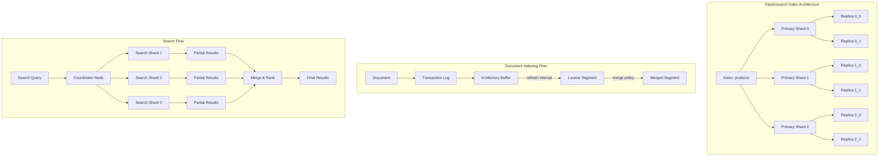

### Elasticsearch State Components

| Component | Purpose | Durability | Performance Impact |
|-----------|---------|------------|-------------------|
| Transaction Log | Durability, crash recovery | Fsync to disk | Write latency |
| In-Memory Buffer | Batching writes | Lost on crash | High write throughput |
| Lucene Segments | Immutable search structures | Persistent | Read performance |
| Segment Merging | Optimize search performance | Background process | I/O intensive |

### Refresh vs Flush

| Operation | What it does | Frequency | Impact |
|-----------|--------------|-----------|--------|  
| Refresh | Buffer → Searchable segment | Every 1s (default) | Makes docs searchable |
| Flush | Commit point + clear translog | Every 30min or 512MB | Ensures durability |

### 5. Apache Kafka: Distributed Log State

**Problem**: Maintain a distributed, replicated log with strong ordering guarantees

**Core Concepts**:

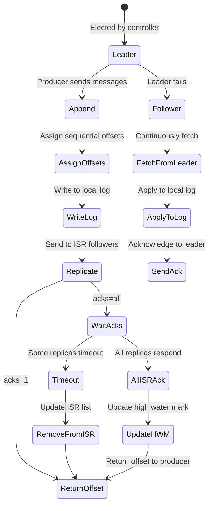

### Kafka Partition Key Concepts

| Concept | Description | Purpose |
|---------|-------------|---------|  
| Log Start Offset (LSO) | First available message offset | Log retention boundary |
| Log End Offset (LEO) | Next offset to be assigned | Write position |
| High Water Mark (HWM) | Min replicated offset across ISR | Consumer read boundary |
| In-Sync Replicas (ISR) | Replicas caught up with leader | Durability guarantee |
| Leader Epoch | Generation number of leader | Prevent split-brain |

### Kafka Replication Protocol

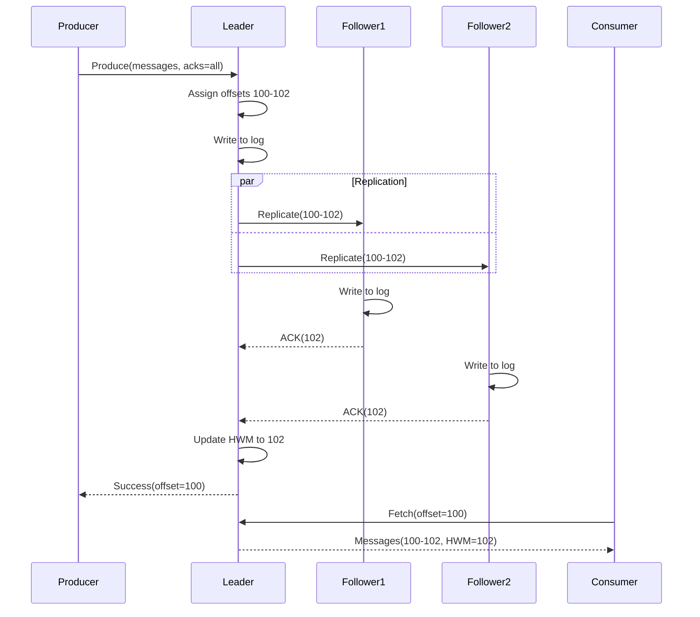

## State Patterns Implementation

### 1. Write-Ahead Log (WAL)

```mermaid
flowchart TD
    subgraph "Write-Ahead Log Structure"
        Entry[New Entry] --> Serialize[Serialize Entry]
        Serialize --> CheckSegment{Current segment full?}
        CheckSegment -->|Yes| Roll[Roll to new segment]
        CheckSegment -->|No| Append[Append to segment]
        Roll --> Append
        Append --> CheckSync{Should sync?}
        CheckSync -->|Yes| Fsync[Fsync to disk]
        CheckSync -->|No| Return[Return offset]
        Fsync --> Return
    end
    
    subgraph "Recovery Process"
        Crash[System Crash] --> ScanSegments[Scan all segments]
        ScanSegments --> ReadSegment[Read segment N]
        ReadSegment --> Deserialize[Deserialize entries]
        Deserialize --> ApplyState[Apply to state]
        ApplyState --> NextSegment{More segments?}
        NextSegment -->|Yes| ReadSegment
        NextSegment -->|No| Recovered[State recovered]
    end
    
    subgraph "Truncation (Rollback)"
        Uncommitted[Uncommitted entries] --> FindOffset[Find target offset]
        FindOffset --> TruncateSegment[Truncate segment]
        TruncateSegment --> RemoveLater[Remove later segments]
        RemoveLater --> Clean[Clean state]
    end
```

### WAL Design Decisions

| Aspect | Options | Trade-offs |
|--------|---------|------------|  
| Sync Policy | Every write | Durability vs Performance |
| | Periodic (time-based) | Bounded data loss |
| | Size-based | Batch efficiency |
| Segment Size | Small (e.g., 64MB) | Faster recovery, more files |
| | Large (e.g., 1GB) | Fewer files, slower recovery |
| Compression | None | Fast writes, more space |
| | Snappy/LZ4 | Space efficient, CPU cost |

### 2. Conflict-Free Replicated Data Types (CRDTs)

### Conflict-Free Replicated Data Types (CRDTs)

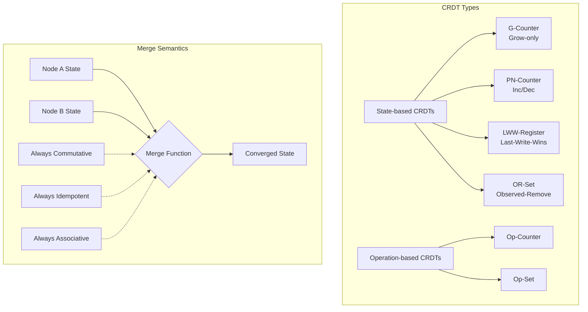

### CRDT Comparison

| CRDT Type | Operations | Merge Rule | Use Case |
|-----------|------------|------------|----------|
| G-Counter | increment() | max(a,b) per node | Page views, likes |
| PN-Counter | inc(), dec() | P.merge(), N.merge() | Account balance |
| LWW-Register | set(value) | Latest timestamp wins | User preferences |
| OR-Set | add(), remove() | Union tags - tombstones | Shopping cart |
| 2P-Set | add(), remove() | Union both sets | Membership |

### G-Counter Example

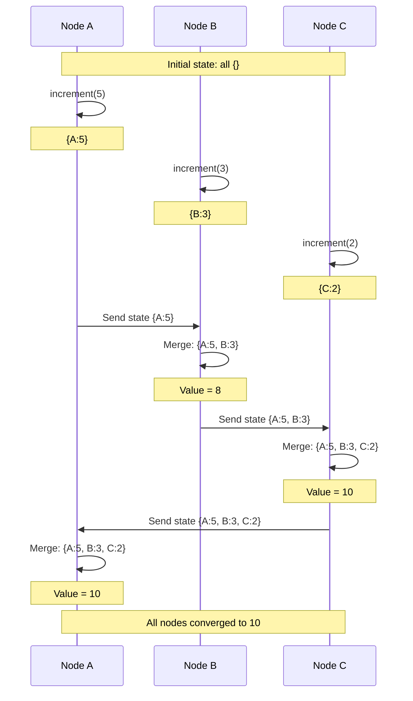

### OR-Set Mechanics

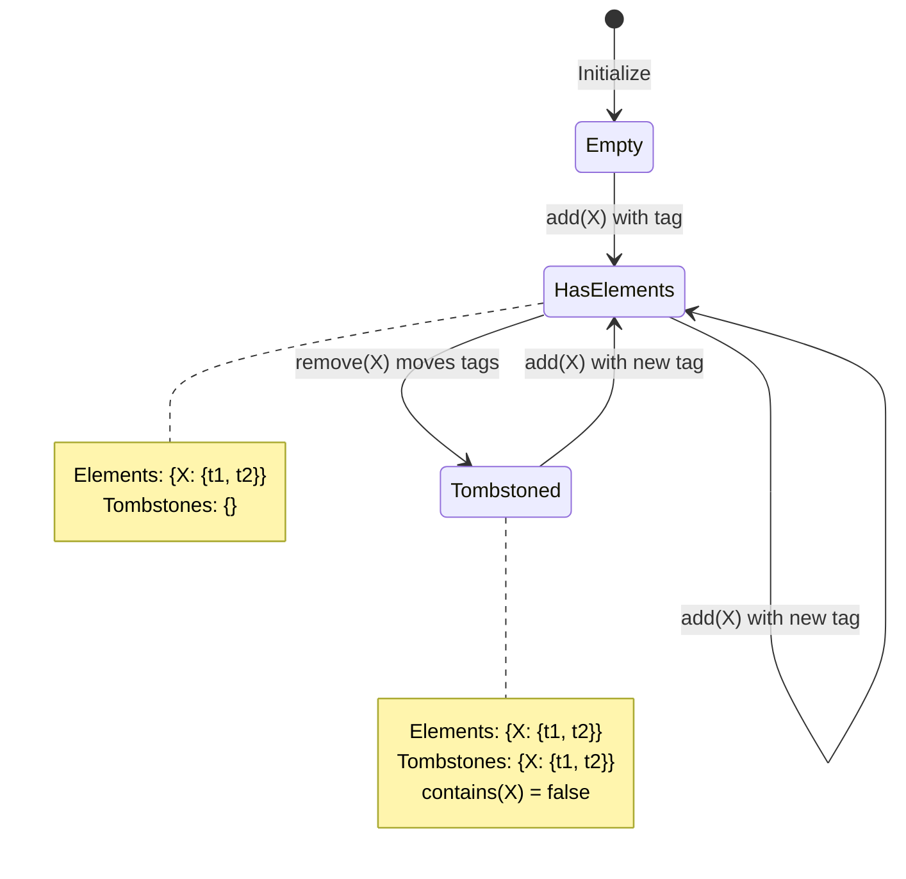

### 3. Multi-Version Concurrency Control (MVCC)

### Multi-Version Concurrency Control (MVCC)

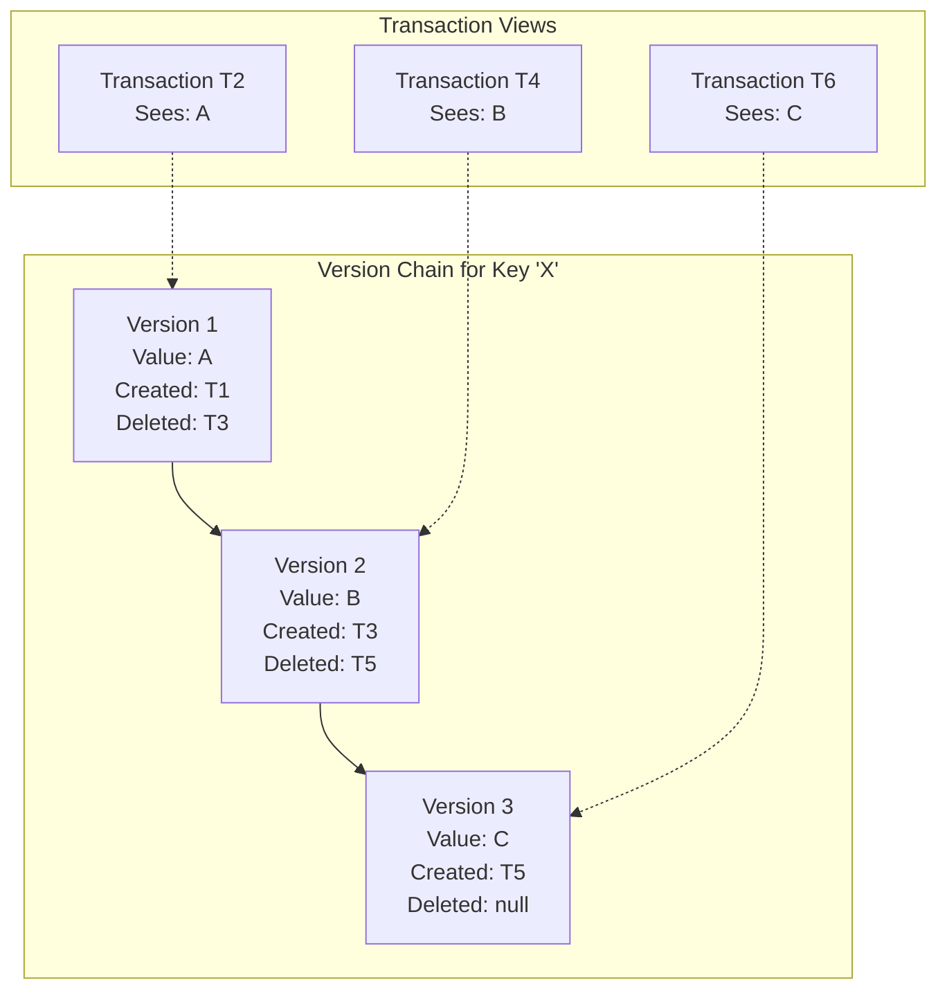

### MVCC Transaction Lifecycle

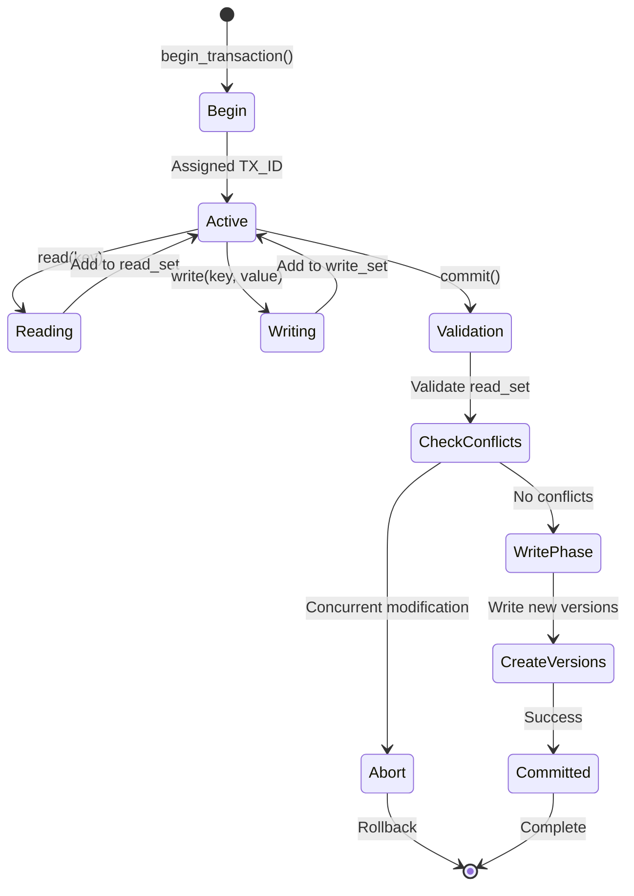

### MVCC Visibility Rules

| Scenario | Version Created | Version Deleted | Visible to TX? |
|----------|----------------|-----------------|----------------|
| Normal read | Before TX | After TX or NULL | ✓ Yes |
| Too new | After TX | Any | ✗ No |
| Already deleted | Before TX | Before TX | ✗ No |
| Own write | By TX | Any | ✓ Yes |

### Concurrent Transaction Example

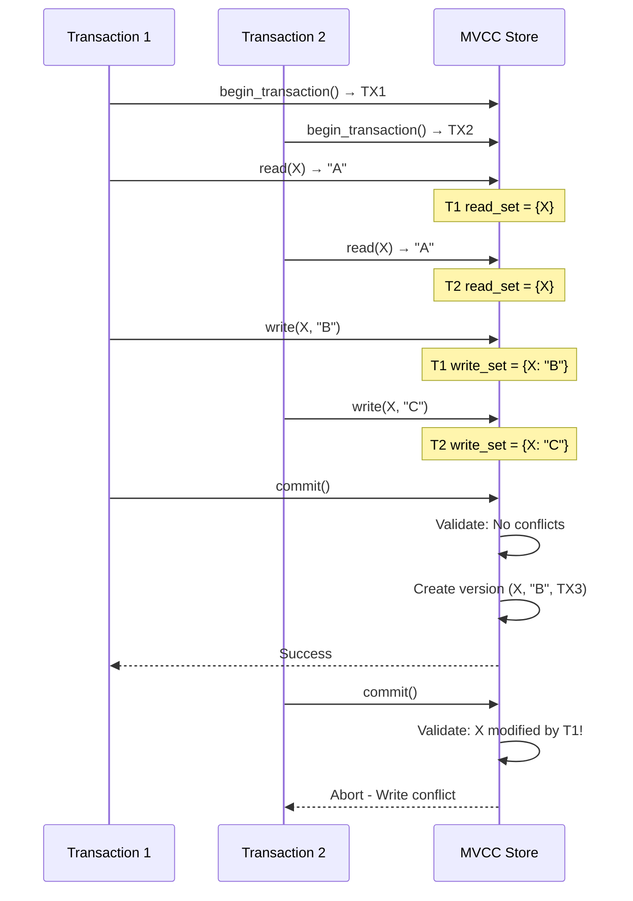

### MVCC Storage Overhead

| Aspect | Impact | Mitigation |
|--------|--------|------------|  
| Multiple versions | Space overhead | Vacuum old versions |
| Version chains | Lookup overhead | Index on latest |
| Long transactions | Prevent cleanup | Transaction timeout |
| Read tracking | Memory overhead | Bloom filters |

## Key Takeaways

1. **State distribution follows data access patterns** - Don't fight your workload

2. **Replication strategies depend on consistency needs** - Choose wisely

3. **Conflict resolution must be deterministic** - Last-write-wins, CRDTs, or vector clocks

4. **State recovery must be fast** - WAL, snapshots, and incremental recovery

5. **Sharding requires careful key selection** - Hot spots will find you

Remember: State is the hardest part of distributed systems. It's where all the trade-offs live.
