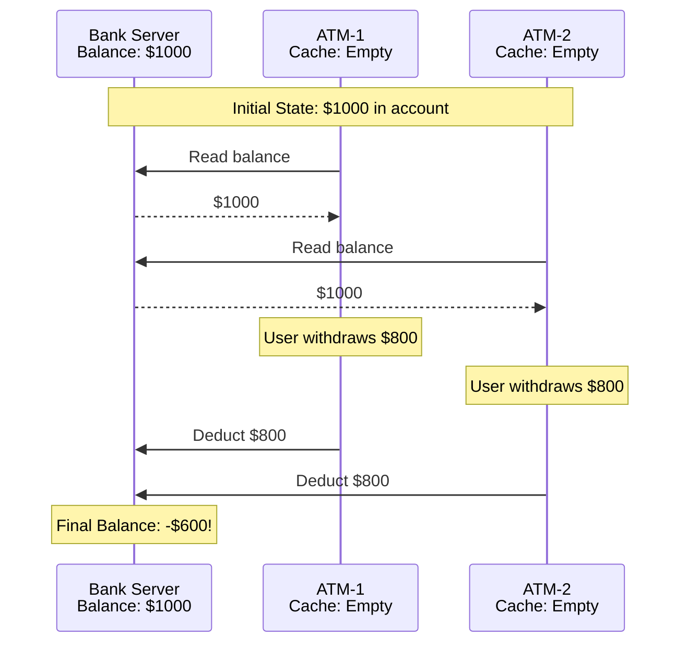
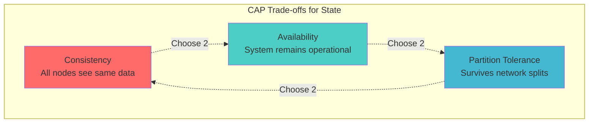

# Pillar 2: Distribution of State

<span class="path-icon">🗂️</span>
 <span class="path-name">Core Pillar</span>
 <span class="path-progress">2/5</span>
 <div class="mini-progress">
</div>

**Learning Objective**: Master the art of splitting data without splitting reliability.

!!! info
 <h4>📚 Before You Begin</h4>
 <p>Make sure you understand these concepts:</p>
 <ul>
 <li><a href="/part1-axioms/law1-failure/">Law 1: Correlated Failure</a> - Why we need replication</li>
 <li><a href="/part1-axioms/law4-tradeoffs/">Law 4: Multidimensional Optimization</a> - Resource constraints</li>
 <li><a href="/quantitative/cap-theorem/">CAP Theorem</a> - Fundamental trade-offs</li>
 </ul>

---

## Level 1: Intuition (Start Here) 🌱

### The Library Card Catalog Problem

Imagine a massive library with millions of books. How do you organize the catalog?

**Option 1: One Giant Catalog** 📚
- Pro: Easy to search everything
- Con: Takes forever as it grows
- Con: If it burns, everything is lost

**Option 2: Multiple Catalogs by Topic** 📚📚📚
- Pro: Faster to search within topics
- Con: What about books covering multiple topics?
- Con: How do you keep them synchronized?

That's distributed state in a nutshell! This challenge arises from [Law 4: Law of Multidimensional Optimization](/part1-axioms/law4-tradeoffs/) (finite resources require distribution) and [Law 1: Law of Correlated Failure](/part1-axioms/law1-failure/) (replicas for fault tolerance).

---

## Questions This Pillar Answers

<div class="grid cards" markdown>

- **How do I split data across nodes?**
  - Sharding strategies
  - Partitioning schemes
  - Consistent hashing
  - Range vs hash partitioning

- **How do I keep replicas consistent?**
  - Replication protocols
  - Consensus algorithms
  - Conflict resolution
  - Read/write quorums

- **What happens during failures?**
  - Failover mechanisms
  - Split-brain scenarios
  - Data recovery
  - Consistency guarantees

- **How do I handle transactions?**
  - Distributed transactions
  - Two-phase commit
  - Saga patterns
  - Event sourcing

</div>

---

### Your First Distributed State Problem: The ATM Race Condition



This simple example shows why distributed state is hard:
- **No global view**: Each ATM sees a snapshot
- **Race conditions**: Concurrent operations conflict
- **Consistency problems**: Invalid final state

## Level 2: Core Concepts 🌿

### State Distribution Patterns

<div class="grid cards" markdown>

- **Master-Slave Replication**
  ```mermaid
  graph LR
    M[Master] --> S1[Slave 1]
    M --> S2[Slave 2]
    M --> S3[Slave 3]
  ```
  - Write to master only
  - Read from any replica
  - Simple but single point of failure

- **Multi-Master Replication**
  ```mermaid
  graph LR
    M1[Master 1] <--> M2[Master 2]
    M2 <--> M3[Master 3]
    M3 <--> M1
  ```
  - Write to any master
  - Complex conflict resolution
  - Higher availability

- **Partitioned (Sharded)**
  ```mermaid
  graph TB
    R[Router] --> P1[Partition A-H]
    R --> P2[Partition I-P]
    R --> P3[Partition Q-Z]
  ```
  - Data split by key
  - Parallel processing
  - Rebalancing challenges

- **Peer-to-Peer**
  ```mermaid
  graph LR
    N1[Node 1] <--> N2[Node 2]
    N2 <--> N3[Node 3]
    N3 <--> N4[Node 4]
    N4 <--> N1
    N1 <--> N3
    N2 <--> N4
  ```
  - No central coordinator
  - Eventually consistent
  - High fault tolerance

</div>

### Consistency Models Spectrum

| Model | Guarantee | Example Use Case | Trade-off |
|-------|-----------|------------------|-----------|
| **Strong Consistency** | All nodes see same data instantly | Bank transactions | Low availability, high latency |
| **Sequential Consistency** | Operations appear in program order | Collaborative editing | Moderate complexity |
| **Causal Consistency** | Cause-effect relationships preserved | Social media comments | Complex to implement |
| **Eventual Consistency** | All nodes converge eventually | DNS, CDN | Temporary inconsistencies |

## Level 3: In-Depth Understanding 🌳

### The CAP Triangle Applied to State



Real systems make nuanced choices:
- **CP Systems**: Bank accounts, inventory (correctness over availability)
- **AP Systems**: Social media feeds, product catalogs (availability over consistency)
- **Tunable**: Cassandra, DynamoDB (consistency level per operation)

### Replication Strategies Deep Dive

#### 1. Synchronous Replication
```python
def write_synchronous(key, value, replicas):
    """Write to all replicas before acknowledging"""
    futures = []
    for replica in replicas:
        futures.append(replica.write_async(key, value))
    
    # Wait for ALL replicas
    wait_all(futures, timeout=5000)
    return "SUCCESS"
```

**Pros**: Strong consistency
**Cons**: High latency, low availability

#### 2. Asynchronous Replication
```python
def write_async(key, value, primary, replicas):
    """Write to primary, replicate in background"""
    primary.write(key, value)
    
    # Don't wait for replicas
    for replica in replicas:
        background_task(replica.write, key, value)
    
    return "SUCCESS"
```

**Pros**: Low latency, high availability
**Cons**: Potential data loss, inconsistency window

#### 3. Quorum-Based Replication
```python
def write_quorum(key, value, replicas, W):
    """Write to W replicas out of N total"""
    N = len(replicas)
    R = N - W + 1  # Read quorum
    
    futures = []
    for replica in replicas:
        futures.append(replica.write_async(key, value))
    
    # Wait for W replicas
    successes = wait_for_n(futures, W, timeout=5000)
    
    if successes >= W:
        return "SUCCESS"
    else:
        raise QuorumNotReached()
```

**Key Insight**: If W + R > N, you guarantee reading latest value!

## Level 4: Advanced Topics 🌲

### Distributed State Machines

Transform state management into deterministic state transitions:

```python
class DistributedStateMachine:
    def __init__(self):
        self.log = []  # Ordered list of commands
        self.state = {}  # Current state
        
    def propose_command(self, command):
        # Use consensus (Raft/Paxos) to agree on order
        index = self.consensus.propose(command)
        self.log.insert(index, command)
        
    def apply_commands(self):
        for command in self.log[self.last_applied:]:
            self.state = self.transition(self.state, command)
            self.last_applied += 1
```

### Conflict Resolution Strategies

When concurrent updates occur, how do we resolve conflicts?

| Strategy | Description | Use Case |
|----------|-------------|----------|
| **Last Write Wins** | Timestamp-based | Caching, session data |
| **Multi-Value** | Keep all versions | Shopping carts |
| **CRDTs** | Mathematically merge | Collaborative editing |
| **Application-Level** | Custom logic | Domain-specific |

### Scaling State to Billions

#### Hierarchical Sharding
```
Level 1: Geographic Region (US, EU, APAC)
Level 2: Customer Tier (Premium, Standard)  
Level 3: Hash(CustomerID) % 1000
```

#### Dynamic Resharding
- Monitor shard sizes
- Split hot shards automatically
- Merge cold shards to reduce overhead
- Use consistent hashing to minimize data movement

## Common Pitfalls and Solutions

!!! warning "Pitfall: Split-Brain Syndrome"
    **Problem**: Network partition causes each side to think it's primary
    
    **Solution**: 
    - Use odd number of nodes
    - Implement quorum-based decisions
    - Add external arbitrator (witness node)
    - Use fencing tokens

!!! danger "Pitfall: Unbounded State Growth"
    **Problem**: State grows indefinitely, degrading performance
    
    **Solution**:
    - Implement TTLs (Time To Live)
    - Archive old data to cold storage
    - Use log compaction
    - Partition by time windows

## Design Checklist

- [ ] **Identify state requirements**
  - [ ] Consistency needs (strong, eventual, causal)
  - [ ] Durability requirements
  - [ ] Access patterns (read/write ratio)
  - [ ] Data size and growth rate

- [ ] **Choose distribution strategy**
  - [ ] Replication factor
  - [ ] Sharding scheme
  - [ ] Placement strategy

- [ ] **Plan for failures**
  - [ ] Failover mechanism
  - [ ] Recovery procedures
  - [ ] Backup strategy

- [ ] **Implement monitoring**
  - [ ] Replication lag
  - [ ] Consistency violations
  - [ ] Storage usage
  - [ ] Performance metrics

## Real-World Case Studies

<a href="/case-studies/cassandra/" class="related-item">
 <span class="item-icon">💿</span>
 <span class="item-title">Cassandra Architecture</span>
 <span class="item-type">case-study</span>
 </a>
 <a href="/case-studies/elasticsearch/" class="related-item">
 <span class="item-icon">🔍</span>
 <span class="item-title">Elasticsearch Distributed State</span>
 <span class="item-type">case-study</span>
 </a>
 <a href="/case-studies/social-graph/" class="related-item">
 <span class="item-icon">🕸️</span>
 <span class="item-title">Facebook Social Graph</span>
 <span class="item-type">case-study</span>
 </a>
 <a href="/patterns/two-phase-commit/" class="related-item">
 <span class="item-icon">🤝</span>
 <span class="item-title">Two-Phase Commit</span>
 <span class="item-type">pattern</span>
 </a>

## Next Steps

<div class="step-card level-beginner">
 <span class="level-badge">Beginner</span>
 <h4><a href="/tutorials/state-replication-basics/">State Replication Basics</a></h4>
 <p>Build a simple replicated key-value store with eventual consistency.</p>
 
 <span class="level-badge">Intermediate</span>
 <h4><a href="/tutorials/consistent-hashing/">Implementing Consistent Hashing</a></h4>
 <p>Create a distributed hash table with dynamic node addition/removal.</p>
 
 <span class="level-badge">Advanced</span>
 <h4><a href="/tutorials/distributed-db/">Building a Distributed Database</a></h4>
 <p>Implement a mini distributed database with transactions and sharding.</p>
</div>

## Key Takeaways

!!! success "Remember"
    1. **State distribution is about trade-offs** - You can't have perfect consistency, availability, and partition tolerance
    2. **Choose the right consistency model** - Not everything needs strong consistency
    3. **Plan for failures from day one** - Networks partition, nodes crash, disks fail
    4. **Monitor everything** - You can't fix what you can't measure
    5. **Test under realistic conditions** - Including failures and network delays

---

<div class="progress-bar">
 <div class="progress-fill">
 </div>
 Progress: 2 of 5 pillars completed
</div>