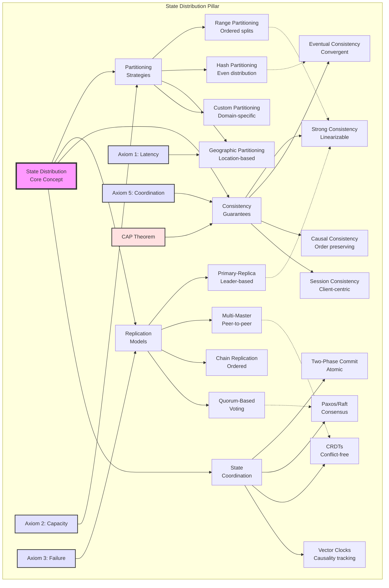

<!-- Navigation -->
[Home](/) → [Part II: Pillars](/part2-pillars/) → [State](/part2-pillars/state/) → **Pillar 2: Distribution of State**

# Pillar 2: Distribution of State

**Learning Objective**: Master the art of splitting data without splitting reliability.

---

## Level 1: Intuition (Start Here) 🌱

### The Library Card Catalog Problem

Imagine a massive library with millions of books. How do you organize the catalog?

**Option 1: One Giant Catalog** 📚
- Pro: Easy to search everything
- Con: Takes forever as it grows
- Con: If it burns, everything is lost

**Option 2: Multiple Catalogs by Topic** 📚📚📚
- Pro: Faster to search within topics
- Con: What about books covering multiple topics?
- Con: How do you keep them synchronized?

That's distributed state in a nutshell!

---

## 📋 Questions This Pillar Answers

---

### Your First Distributed State Problem

```python
# distributed_atm_demo.py - Why distributed state is hard

import threading
import time
import random

# Simulated bank with multiple ATMs
class BankAccount:
    def __init__(self, balance=1000):
        self.balance = balance
        self.version = 0  # Track updates

class ATM:
    def __init__(self, atm_id, bank_account):
        self.atm_id = atm_id
        self.account = bank_account
        self.local_cache = None
        self.cache_version = -1

    def check_balance(self):
        """Check balance with caching"""
        # Simulate network delay
        time.sleep(0.1)

        # Use cache if available and fresh
        if self.cache_version == self.account.version:
            print(f"ATM {self.atm_id}: Using cached balance ${self.local_cache}")
            return self.local_cache

        # Otherwise fetch from bank
        print(f"ATM {self.atm_id}: Fetching from bank...")
        self.local_cache = self.account.balance
        self.cache_version = self.account.version
        return self.local_cache

    def withdraw(self, amount):
        """Try to withdraw money"""
        current_balance = self.check_balance()

        if current_balance >= amount:
            print(f"ATM {self.atm_id}: Withdrawing ${amount}")
            time.sleep(0.2)  # Processing time

            # Update bank balance
            self.account.balance -= amount
            self.account.version += 1

            # Invalidate all ATM caches (in real life, this is hard!)
            print(f"ATM {self.atm_id}: Success! New balance: ${self.account.balance}")
            return True
        else:
            print(f"ATM {self.atm_id}: Insufficient funds!")
            return False

# Simulate concurrent ATM usage
account = BankAccount(1000)
atm1 = ATM("ATM-1", account)
atm2 = ATM("ATM-2", account)

print("Initial balance: $1000")
print("\nTwo people try to withdraw $800 each...\n")

# Both check balance (sees $1000)
thread1 = threading.Thread(target=lambda: atm1.withdraw(800))
thread2 = threading.Thread(target=lambda: atm2.withdraw(800))

thread1.start()
thread2.start()
thread1.join()
thread2.join()

print(f"\nFinal balance: ${account.balance}")
print("💥 PROBLEM: Both withdrawals might succeed due to stale cache!")
```

### The State Distribution Zoo 🦁

Types of distributed state challenges:

1. **Stale Reads** 👴: "That data is so 5 seconds ago"
2. **Lost Updates** 👻: "I swear I saved that!"
3. **Split Brain** 🧠: "We have two masters now??"
4. **Phantom Writes** 👤: "Where did that come from?"
5. **Cascading Failures** 🌊: "One node down, all nodes down"

### Concept Map: State Distribution



This concept map illustrates how state distribution branches into four major decision areas, each influenced by fundamental axioms and the CAP theorem. The dotted lines show common implementation patterns.

### Simple Mental Models

Think of distributed state like:
- **Multiple Google Docs editors** - Everyone editing simultaneously
- **Bank branches before computers** - Each branch has its own ledger
- **Gossip in a small town** - Information spreads, but not instantly
- **Playing telephone** - Messages can get distorted

---

## Level 2: Foundation (Understand Why) 🌿

### Core Principle: State Has Memory

### 🎬 Failure Vignette: The GitHub Database Outage

**Company**: GitHub
**Date**: October 21, 2018
**Impact**: 24 hours of degraded service

```yaml
The Split-Brain Disaster:

21:52:00 - Routine maintenance replaces failing 100G network switch
21:52:27 - Network partition: East Coast ⟷ West Coast disconnected
21:52:40 - Each coast can't see the other
21:52:45 - East: "West is down, I'll take over!"
21:52:45 - West: "East is down, I'll take over!"
21:53:00 - 🧠 SPLIT BRAIN: Two primary databases!

During 43 seconds of split-brain:
- East Coast: 944 writes (issues, commits, comments)
- West Coast: 673 writes (different issues, commits, comments)
- Conflicts: 187 objects modified on BOTH sides

The Recovery Nightmare:
- Can't merge: Different data with same IDs
- Can't discard: Both have valid user data
- Solution: 24-hour outage to manually reconcile
- Some data was permanently lost

Root Cause:
- Assumed network partitions were impossible (fiber cut)
- No mechanism to prevent dual-primary scenario
- Automated failover was TOO automatic

Lesson: In distributed systems, "split brain" is the ultimate failure - when your system disagrees with itself about reality.
```

### The CAP Theorem Visualized

```text
In a distributed system, you can only guarantee 2 of 3:

         Consistency (C)
        "Everyone sees the
         same data"
              /\
             /  \
            /    \
           /      \
          /________\
   Availability (A)    Partition Tolerance (P)
   "System stays up"    "Survives network failures"

Since networks WILL fail (P is mandatory),
you're really choosing between C and A:

Choose C+P: Bank systems (correctness > availability)
Choose A+P: Social media (availability > consistency)
```

### State Distribution Decision Framework

### State Replication Strategies

### Consistency Models Explained

---

## Level 3: Deep Dive (Master the Patterns) 🌳

### Advanced Replication: Chain Replication

```python
class ChainReplication:
    """
    All nodes arranged in a chain: HEAD -> MIDDLE -> ... -> TAIL
    Writes go to HEAD, propagate down chain
    Reads go to TAIL (guaranteed to have all writes)
    """

    def __init__(self, nodes):
        self.nodes = nodes  # Ordered list
        self.head = nodes[0]
        self.tail = nodes[-1]

    def write(self, key, value):
        # Send write to head
        request = WriteRequest(key, value, request_id=uuid4())
        self.head.process_write(request)

    def read(self, key):
        # Read from tail for strong consistency
        return self.tail.read(key)

    class Node:
        def __init__(self, node_id, next_node=None):
            self.node_id = node_id
            self.next_node = next_node
            self.data = {}
            self.pending_writes = {}

        def process_write(self, request):
            # Store locally
            self.data[request.key] = request.value
            self.pending_writes[request.id] = request

            if self.next_node:
                # Forward down the chain
                self.next_node.process_write(request)
            else:
                # We're the tail - send acknowledgment
                self.acknowledge_write(request.id)

        def acknowledge_write(self, request_id):
            # Propagate acknowledgment back up the chain
            if request_id in self.pending_writes:
                del self.pending_writes[request_id]

                # Tell predecessor
                if self.predecessor:
                    self.predecessor.acknowledge_write(request_id)
```

### Sharding Strategies

```python
class ShardingStrategies:
    """Different ways to distribute data across shards"""

    @staticmethod
    def range_sharding(key, num_shards):
        """Shard by key range (good for range queries)"""
        # Example: A-F -> shard 0, G-M -> shard 1, etc.
        if isinstance(key, str):
            first_char = ord(key[0].upper())
            chars_per_shard = 26 / num_shards
            return int((first_char - ord('A')) / chars_per_shard)
        return hash(key) % num_shards

    @staticmethod
    def hash_sharding(key, num_shards):
        """Shard by hash (good distribution, bad for ranges)"""
        return hash(key) % num_shards

    @staticmethod
    def consistent_hashing(key, nodes):
        """Add/remove nodes with minimal reshuffling"""
        ring_positions = {}

        # Each node gets multiple positions on the ring
        for node in nodes:
            for i in range(150):  # 150 virtual nodes
                pos = hash(f"{node.id}:{i}") % (2**32)
                ring_positions[pos] = node

        # Find node for key
        key_pos = hash(key) % (2**32)

        # Find next node clockwise on ring
        positions = sorted(ring_positions.keys())
        for pos in positions:
            if pos >= key_pos:
                return ring_positions[pos]

        # Wrapped around
        return ring_positions[positions[0]]

    @staticmethod
    def geo_sharding(key, user_location):
        """Shard by geography (data locality)"""
        regions = {
            'US-WEST': ['CA', 'OR', 'WA', 'NV', 'AZ'],
            'US-EAST': ['NY', 'FL', 'VA', 'MA', 'PA'],
            'EU': ['UK', 'DE', 'FR', 'IT', 'ES'],
            'ASIA': ['JP', 'SG', 'IN', 'CN', 'KR']
        }

        for region, states in regions.items():
            if user_location in states:
                return region

        return 'US-EAST'  # Default
```

### Vector Clocks: Tracking Causality

```python
class VectorClock:
    """Track causality between distributed events"""

    def __init__(self, node_id, num_nodes):
        self.node_id = node_id
        self.clock = [0] * num_nodes

    def increment(self):
        """Increment on local event"""
        self.clock[self.node_id] += 1
        return self.clock.copy()

    def update(self, other_clock):
        """Update on receiving message"""
        # Take max of each component
        for i in range(len(self.clock)):
            self.clock[i] = max(self.clock[i], other_clock[i])
        # Then increment local component
        self.increment()

    def happens_before(self, other):
        """Check if self → other (self happened before other)"""
        return (all(self.clock[i] <= other.clock[i] for i in range(len(self.clock)))
                and any(self.clock[i] < other.clock[i] for i in range(len(self.clock))))

    def concurrent_with(self, other):
        """Check if self || other (concurrent events)"""
        return (not self.happens_before(other) and
                not other.happens_before(self))

# Example: Distributed text editor
class DistributedDocument:
    def __init__(self, node_id, num_nodes):
        self.node_id = node_id
        self.vector_clock = VectorClock(node_id, num_nodes)
        self.operations = []  # List of (operation, vector_clock)

    def insert_text(self, position, text):
        """Insert text at position"""
        timestamp = self.vector_clock.increment()
        op = Operation('insert', position, text, timestamp)

        # Apply locally
        self.apply_operation(op)

        # Broadcast to other nodes
        self.broadcast_operation(op)

    def receive_operation(self, op):
        """Receive operation from another node"""
        # Update vector clock
        self.vector_clock.update(op.timestamp)

        # Find correct position to insert (causal ordering)
        insert_position = self.find_causal_position(op)
        self.operations.insert(insert_position, op)

        # Apply the operation
        self.apply_operation(op)
```

### CRDTs: Conflict-Free Replicated Data Types

```python
class GrowOnlyCounter:
    """G-Counter: Conflicts impossible by design"""

    def __init__(self, node_id, num_nodes):
        self.node_id = node_id
        self.counts = [0] * num_nodes

    def increment(self, delta=1):
        """Only this node increments its own counter"""
        self.counts[self.node_id] += delta

    def value(self):
        """Sum all node counters"""
        return sum(self.counts)

    def merge(self, other_counter):
        """Merge with another counter (idempotent)"""
        for i in range(len(self.counts)):
            self.counts[i] = max(self.counts[i], other_counter.counts[i])

class LWWRegister:
    """Last-Write-Wins Register"""

    def __init__(self, node_id):
        self.value = None
        self.timestamp = 0
        self.node_id = node_id

    def set(self, value):
        """Set value with timestamp"""
        self.timestamp = time.time()
        self.value = value

    def get(self):
        """Get current value"""
        return self.value

    def merge(self, other):
        """Merge with another register"""
        if other.timestamp > self.timestamp:
            self.value = other.value
            self.timestamp = other.timestamp
        elif other.timestamp == self.timestamp:
            # Tie-breaker: higher node ID wins
            if other.node_id > self.node_id:
                self.value = other.value

class ORSet:
    """Observed-Remove Set: Add/Remove with correct semantics"""

    def __init__(self):
        self.elements = {}  # element -> set of unique tags
        self.tombstones = set()  # removed tags

    def add(self, element):
        """Add element with unique tag"""
        tag = (element, uuid4(), time.time())

        if element not in self.elements:
            self.elements[element] = set()
        self.elements[element].add(tag)

    def remove(self, element):
        """Remove all current tags for element"""
        if element in self.elements:
            # Mark all current tags as removed
            self.tombstones.update(self.elements[element])

    def contains(self, element):
        """Check if element exists"""
        if element not in self.elements:
            return False

        # Element exists if any tag is not tombstoned
        return any(tag not in self.tombstones
                  for tag in self.elements[element])

    def merge(self, other):
        """Merge with another ORSet"""
        # Union all additions
        for element, tags in other.elements.items():
            if element not in self.elements:
                self.elements[element] = set()
            self.elements[element].update(tags)

        # Union all tombstones
        self.tombstones.update(other.tombstones)
```

---

## Level 4: Expert (Production Patterns) 🌲

### DynamoDB: Eventually Consistent at Scale

```python
class DynamoDBStyle:
    """
    Amazon DynamoDB's approach:
    - Consistent hashing for distribution
    - Vector clocks for conflict detection
    - Read repair for convergence
    - Gossip protocol for membership
    """

    class Node:
        def __init__(self, node_id):
            self.node_id = node_id
            self.data = {}  # key -> list of (value, vector_clock)
            self.membership = {}  # node_id -> last_seen

        def put(self, key, value, context=None):
            """Write with vector clock context"""
            if context:
                # Update existing value
                new_clock = context.increment()
            else:
                # New value
                new_clock = VectorClock(self.node_id)
                new_clock.increment()

            if key not in self.data:
                self.data[key] = []

            # Add new version
            self.data[key].append((value, new_clock))

            # Prune old versions subsumed by new clock
            self.data[key] = [
                (v, c) for v, c in self.data[key]
                if not new_clock.subsumes(c) or c == new_clock
            ]

            return new_clock

        def get(self, key):
            """Read with conflict detection"""
            if key not in self.data:
                return None, None

            versions = self.data[key]

            if len(versions) == 1:
                # No conflicts
                return versions[0]

            # Multiple versions - detect conflicts
            concurrent_versions = []

            for v1, c1 in versions:
                is_concurrent = True
                for v2, c2 in versions:
                    if c1 != c2 and c2.happens_before(c1):
                        is_concurrent = False
                        break

                if is_concurrent:
                    concurrent_versions.append((v1, c1))

            if len(concurrent_versions) > 1:
                # Return all concurrent versions for client resolution
                return concurrent_versions, "CONFLICT"

            # Return latest version
            return max(versions, key=lambda x: sum(x[1].clock))

    class Coordinator:
        def __init__(self, nodes, replication_factor=3):
            self.nodes = nodes
            self.ring = ConsistentHashRing(nodes)
            self.replication_factor = replication_factor

        def put(self, key, value, consistency_level="QUORUM"):
            """Replicated write"""
            # Find preference list
            preference_list = self.ring.get_nodes(key, self.replication_factor)

            # Send writes in parallel
            futures = []
            for node in preference_list:
                future = self.async_put(node, key, value)
                futures.append(future)

            # Wait for required acknowledgments
            if consistency_level == "ONE":
                return self.wait_for_any(futures)
            elif consistency_level == "QUORUM":
                quorum = (self.replication_factor // 2) + 1
                return self.wait_for_quorum(futures, quorum)
            elif consistency_level == "ALL":
                return self.wait_for_all(futures)

        def get(self, key, consistency_level="QUORUM"):
            """Replicated read with read repair"""
            preference_list = self.ring.get_nodes(key, self.replication_factor)

            # Send reads in parallel
            futures = []
            for node in preference_list:
                future = self.async_get(node, key)
                futures.append(future)

            # Collect responses based on consistency level
            if consistency_level == "ONE":
                responses = [self.wait_for_any(futures)]
            elif consistency_level == "QUORUM":
                quorum = (self.replication_factor // 2) + 1
                responses = self.wait_for_quorum(futures, quorum)
            else:
                responses = self.wait_for_all(futures)

            # Reconcile responses
            reconciled = self.reconcile_responses(responses)

            # Read repair in background
            self.async_read_repair(preference_list, key, reconciled)

            return reconciled

        def reconcile_responses(self, responses):
            """Reconcile multiple versions using vector clocks"""
            all_versions = []

            for response in responses:
                if response and response[0]:  # Not None
                    if isinstance(response[0], list):
                        # Multiple versions from one node
                        all_versions.extend(response[0])
                    else:
                        # Single version
                        all_versions.append(response)

            if not all_versions:
                return None

            # Find concurrent versions
            concurrent = []
            for v1, c1 in all_versions:
                is_concurrent = True

                for v2, c2 in all_versions:
                    if c1 != c2 and c2.happens_before(c1):
                        is_concurrent = False
                        break

                if is_concurrent:
                    concurrent.append((v1, c1))

            # Return latest or conflicts
            if len(concurrent) == 1:
                return concurrent[0]
            else:
                return concurrent  # Client must resolve
```

### Google Spanner: Globally Consistent Database

```python
class SpannerStyle:
    """
    Google Spanner's approach:
    - TrueTime API for global timestamps
    - 2PL + 2PC for transactions
    - Paxos for replication
    """

    class TrueTime:
        """Simulated TrueTime API"""

        @staticmethod
        def now():
            """Return time interval [earliest, latest]"""
            # Real TrueTime uses atomic clocks + GPS
            # We simulate with uncertainty bounds
            current = time.time()
            uncertainty = 0.007  # 7ms uncertainty

            return {
                'earliest': current - uncertainty,
                'latest': current + uncertainty
            }

        @staticmethod
        def after(timestamp):
            """True if timestamp is definitely in the past"""
            return TrueTime.now()['earliest'] > timestamp

        @staticmethod
        def before(timestamp):
            """True if timestamp is definitely in the future"""
            return TrueTime.now()['latest'] < timestamp

    class TransactionManager:
        def __init__(self):
            self.transactions = {}
            self.lock_manager = LockManager()

        def begin_transaction(self):
            """Start read-write transaction"""
            tx_id = uuid4()

            # Assign timestamp at start for reads
            read_timestamp = TrueTime.now()['latest']

            tx = Transaction(tx_id, read_timestamp)
            self.transactions[tx_id] = tx

            return tx

        def commit_transaction(self, tx):
            """2-Phase Commit with TrueTime"""

            # Phase 1: Prepare
            # Acquire all locks
            for operation in tx.operations:
                if operation.type == 'WRITE':
                    lock = self.lock_manager.acquire(
                        operation.key,
                        tx.id,
                        'EXCLUSIVE'
                    )
                    if not lock:
                        self.abort_transaction(tx)
                        return False

            # Assign commit timestamp
            commit_ts = TrueTime.now()['latest']

            # Wait for timestamp to be in the past (commit wait)
            # This ensures external consistency
            while not TrueTime.after(commit_ts):
                time.sleep(0.001)

            # Phase 2: Commit
            # Apply all writes with commit timestamp
            for operation in tx.operations:
                if operation.type == 'WRITE':
                    self.apply_write(
                        operation.key,
                        operation.value,
                        commit_ts
                    )

            # Release all locks
            self.lock_manager.release_all(tx.id)

            return True

    class SpannerNode:
        def __init__(self, zone_id):
            self.zone_id = zone_id
            self.data = {}  # key -> list of (value, timestamp)
            self.paxos_group = PaxosGroup(zone_id)

        def read(self, key, timestamp):
            """Read at timestamp (snapshot isolation)"""
            if key not in self.data:
                return None

            # Find version valid at timestamp
            versions = self.data[key]

            # Binary search for efficiency
            left, right = 0, len(versions) - 1
            result = None

            while left <= right:
                mid = (left + right) // 2

                if versions[mid][1] <= timestamp:
                    result = versions[mid][0]
                    left = mid + 1
                else:
                    right = mid - 1

            return result

        def write(self, key, value, timestamp):
            """Write at timestamp (must be agreed via Paxos)"""
            # Propose write through Paxos
            proposal = {
                'key': key,
                'value': value,
                'timestamp': timestamp
            }

            if self.paxos_group.propose(proposal):
                # Accepted - apply write
                if key not in self.data:
                    self.data[key] = []

                self.data[key].append((value, timestamp))

                # Keep sorted by timestamp
                self.data[key].sort(key=lambda x: x[1])

                # Garbage collect old versions
                self.gc_old_versions(key)

                return True

            return False
```

### Facebook TAO: Graph-Oriented Storage

```python
class TAOStyle:
    """
    Facebook TAO (The Associations and Objects):
    - Optimized for social graph queries
    - Eventually consistent with cache hierarchy
    - Write-through caching with async replication
    """

    class Association:
        def __init__(self, id1, atype, id2, time, data):
            self.id1 = id1          # Source object
            self.atype = atype      # Association type
            self.id2 = id2          # Destination object
            self.time = time        # Creation time
            self.data = data        # Payload
            self.version = 0        # For optimistic concurrency

    class TAOCache:
        def __init__(self, tier='leader'):
            self.tier = tier  # 'leader' or 'follower'
            self.cache = {}
            self.negative_cache = set()  # Cache non-existence

        def assoc_get(self, id1, atype, id2s=None):
            """Get associations"""
            if id2s is None:
                # Get all associations of type
                key = f"{id1}:{atype}:*"
                return self.cache.get(key, [])
            else:
                # Get specific associations
                results = []
                for id2 in id2s:
                    key = f"{id1}:{atype}:{id2}"

                    if key in self.negative_cache:
                        continue

                    if key in self.cache:
                        results.append(self.cache[key])

                return results

        def assoc_count(self, id1, atype):
            """Count associations efficiently"""
            count_key = f"{id1}:{atype}:count"
            return self.cache.get(count_key, 0)

        def assoc_range(self, id1, atype, offset, limit):
            """Range query with pagination"""
            key = f"{id1}:{atype}:*"
            all_assocs = self.cache.get(key, [])

            # Sort by time (most recent first)
            sorted_assocs = sorted(
                all_assocs,
                key=lambda a: a.time,
                reverse=True
            )

            return sorted_assocs[offset:offset + limit]

        def assoc_time_range(self, id1, atype, high_time, low_time):
            """Time-based range query"""
            key = f"{id1}:{atype}:*"
            all_assocs = self.cache.get(key, [])

            return [
                a for a in all_assocs
                if low_time <= a.time <= high_time
            ]

    class TAOClient:
        def __init__(self):
            self.local_cache = TAOCache('follower')
            self.regional_cache = TAOCache('leader')
            self.master_db = None  # MySQL in different region

        def assoc_add(self, id1, atype, id2, data):
            """Add association with write-through caching"""

            # Create association
            assoc = Association(
                id1, atype, id2,
                time.time(),
                data
            )

            # Write to master DB
            try:
                self.master_db.insert(assoc)
            except DuplicateKeyError:
                # Association already exists
                return False

            # Invalidate caches
            self.invalidate_caches(id1, atype, id2)

            # Update follower cache (write-through)
            self.update_cache_after_write(assoc)

            return True

        def assoc_del(self, id1, atype, id2):
            """Delete association"""

            # Delete from master
            if not self.master_db.delete(id1, atype, id2):
                return False

            # Invalidate caches
            self.invalidate_caches(id1, atype, id2)

            return True

        def invalidate_caches(self, id1, atype, id2):
            """Invalidate all cache tiers"""

            keys = [
                f"{id1}:{atype}:{id2}",
                f"{id1}:{atype}:*",
                f"{id1}:{atype}:count"
            ]

            # Invalidate local follower cache
            for key in keys:
                self.local_cache.cache.pop(key, None)

            # Send invalidation to regional leader cache
            self.send_invalidation_message(
                self.regional_cache,
                keys
            )

        def assoc_get(self, id1, atype, id2s=None):
            """Read with cache hierarchy"""

            # Try local follower cache
            result = self.local_cache.assoc_get(id1, atype, id2s)
            if result:
                return result

            # Try regional leader cache
            result = self.regional_cache.assoc_get(id1, atype, id2s)
            if result:
                # Populate local cache
                self.local_cache.cache[f"{id1}:{atype}:*"] = result
                return result

            # Fall back to master DB
            result = self.master_db.query(id1, atype, id2s)

            # Populate caches on the way back
            self.regional_cache.cache[f"{id1}:{atype}:*"] = result
            self.local_cache.cache[f"{id1}:{atype}:*"] = result

            return result
```

---

## Level 5: Mastery (Distributed State at Scale) 🌴

### Conflict-Free Replicated Data Types (CRDTs) in Production

```python
class ProductionCRDTs:
    """
    CRDTs as used in production systems like Redis, Riak, and SoundCloud
    """

    class DeltaCRDT:
        """
        Delta-state CRDTs: Only ship changes, not full state
        Used in large-scale systems to reduce bandwidth
        """

        def __init__(self):
            self.full_state = {}
            self.delta_buffer = []
            self.version = 0

        def generate_delta(self, operation):
            """Generate minimal delta for operation"""
            delta = {
                'version': self.version,
                'op': operation,
                'timestamp': time.time()
            }

            self.delta_buffer.append(delta)
            self.version += 1

            # Coalesce deltas if buffer gets large
            if len(self.delta_buffer) > 100:
                self.coalesce_deltas()

            return delta

        def coalesce_deltas(self):
            """Merge multiple deltas into one"""
            # Group by key
            key_deltas = defaultdict(list)

            for delta in self.delta_buffer:
                key = delta['op'].get('key')
                key_deltas[key].append(delta)

            # Merge deltas per key
            coalesced = []
            for key, deltas in key_deltas.items():
                merged = self.merge_key_deltas(key, deltas)
                coalesced.append(merged)

            self.delta_buffer = coalesced

    class CausalCRDT:
        """
        Causal CRDTs: Respect causality for operations
        Used in collaborative editing (Google Docs style)
        """

        def __init__(self, replica_id):
            self.replica_id = replica_id
            self.vector_clock = VectorClock(replica_id)
            self.operations = []  # Causal history
            self.state = {}

        def apply_operation(self, op):
            """Apply operation respecting causality"""

            # Generate causal context
            op.context = self.vector_clock.increment()
            op.replica_id = self.replica_id

            # Find insertion point maintaining causal order
            insert_pos = self.find_causal_position(op)
            self.operations.insert(insert_pos, op)

            # Rebuild state from operations
            self.rebuild_state()

            return op

        def find_causal_position(self, new_op):
            """Find where to insert op maintaining causality"""

            # Binary search for efficiency
            left, right = 0, len(self.operations)

            while left < right:
                mid = (left + right) // 2
                mid_op = self.operations[mid]

                if mid_op.context.happens_before(new_op.context):
                    left = mid + 1
                elif new_op.context.happens_before(mid_op.context):
                    right = mid
                else:
                    # Concurrent - use replica ID as tiebreaker
                    if mid_op.replica_id < new_op.replica_id:
                        left = mid + 1
                    else:
                        right = mid

            return left

        def rebuild_state(self):
            """Rebuild state from causal history"""
            self.state = {}

            for op in self.operations:
                self.apply_op_to_state(op)

    class RiakDT:
        """
        Riak-style convergent data types with DVV
        (Dotted Version Vectors for better causality tracking)
        """

        class DVV:
            """Dotted Version Vector"""

            def __init__(self):
                self.clock = {}  # replica -> counter
                self.dots = set()  # (replica, counter) pairs

            def event(self, replica):
                """Generate new dot for event"""
                if replica not in self.clock:
                    self.clock[replica] = 0

                self.clock[replica] += 1
                dot = (replica, self.clock[replica])
                self.dots.add(dot)

                return dot

            def merge(self, other):
                """Merge two DVVs"""
                # Take max of clocks
                merged_clock = {}

                for replica in set(self.clock) | set(other.clock):
                    merged_clock[replica] = max(
                        self.clock.get(replica, 0),
                        other.clock.get(replica, 0)
                    )

                # Union dots that aren't dominated
                merged_dots = set()

                for dot in self.dots | other.dots:
                    replica, counter = dot
                    if counter > merged_clock.get(replica, 0):
                        merged_dots.add(dot)

                result = DVV()
                result.clock = merged_clock
                result.dots = merged_dots

                return result

        class MVRegister:
            """Multi-Value Register with DVV"""

            def __init__(self):
                self.values = {}  # value -> DVV

            def write(self, value, context, replica):
                """Write with causal context"""

                # Generate new DVV
                new_dvv = DVV()

                if context:
                    # Inherit from context
                    new_dvv = context.copy()

                # Add new event
                new_dvv.event(replica)

                # Remove causally dominated values
                self.values = {
                    v: dvv for v, dvv in self.values.items()
                    if not new_dvv.dominates(dvv)
                }

                # Add new value
                self.values[value] = new_dvv

            def read(self):
                """Read all concurrent values"""
                return list(self.values.keys())

            def merge(self, other):
                """Merge two MVRegisters"""

                # Collect all unique values
                all_values = set(self.values) | set(other.values)

                merged = {}

                for value in all_values:
                    dvv1 = self.values.get(value, DVV())
                    dvv2 = other.values.get(value, DVV())

                    merged_dvv = dvv1.merge(dvv2)

                    # Only keep if not dominated
                    is_dominated = False

                    for other_val, other_dvv in merged.items():
                        if other_dvv.dominates(merged_dvv):
                            is_dominated = True
                            break

                    if not is_dominated:
                        merged[value] = merged_dvv

                result = MVRegister()
                result.values = merged

                return result

    class AntiEntropyProtocol:
        """
        Efficient CRDT synchronization protocol
        Used in Cassandra, Riak, and others
        """

        def __init__(self, node_id):
            self.node_id = node_id
            self.merkle_tree = None
            self.sync_partners = []

        def sync_with_peer(self, peer):
            """Efficient sync using Merkle trees"""

            # Exchange Merkle tree roots
            my_root = self.merkle_tree.root()
            peer_root = peer.merkle_tree.root()

            if my_root == peer_root:
                # Already in sync
                return

            # Find differing branches
            diff_keys = self.merkle_tree.diff(peer.merkle_tree)

            # Exchange only different keys
            for key in diff_keys:
                my_value = self.get_crdt(key)
                peer_value = peer.get_crdt(key)

                # Merge CRDTs
                merged = my_value.merge(peer_value)

                # Update both sides
                self.put_crdt(key, merged)
                peer.put_crdt(key, merged)
```

### The Art of Distributed Transactions

```python
class DistributedTransactionPatterns:
    """
    Modern approaches to distributed transactions
    beyond traditional 2PC
    """

    class SagaPattern:
        """
        Long-running transactions as a sequence of compensatable steps
        Used in: Microservices, workflow engines
        """

        def __init__(self):
            self.steps = []
            self.compensations = []
            self.state = "RUNNING"

        def add_step(self, forward_action, compensation_action):
            """Add a step with its compensation"""
            self.steps.append({
                'forward': forward_action,
                'compensate': compensation_action,
                'status': 'PENDING'
            })

        async def execute(self):
            """Execute saga with automatic compensation on failure"""

            completed_steps = []

            try:
                # Execute forward path
                for i, step in enumerate(self.steps):
                    result = await step['forward']()

                    step['status'] = 'COMPLETED'
                    step['result'] = result
                    completed_steps.append(i)

                    # Persist saga state after each step
                    await self.persist_state()

                self.state = "COMPLETED"
                return True

            except Exception as e:
                # Compensate in reverse order
                self.state = "COMPENSATING"

                for i in reversed(completed_steps):
                    try:
                        await self.steps[i]['compensate'](
                            self.steps[i]['result']
                        )
                        self.steps[i]['status'] = 'COMPENSATED'
                    except Exception as comp_error:
                        # Compensation failed - manual intervention needed
                        self.state = "COMPENSATION_FAILED"
                        raise SagaCompensationError(
                            f"Step {i} compensation failed",
                            comp_error
                        )

                self.state = "COMPENSATED"
                raise e

        # Example: E-commerce order saga
        async def create_order_saga(self, order_data):
            saga = SagaPattern()

            # Step 1: Reserve inventory
            saga.add_step(
                forward=lambda: inventory_service.reserve(
                    order_data['items']
                ),
                compensate=lambda reservation_id:
                    inventory_service.release(reservation_id)
            )

            # Step 2: Charge payment
            saga.add_step(
                forward=lambda: payment_service.charge(
                    order_data['payment_info'],
                    order_data['total']
                ),
                compensate=lambda charge_id:
                    payment_service.refund(charge_id)
            )

            # Step 3: Create shipment
            saga.add_step(
                forward=lambda: shipping_service.create_shipment(
                    order_data['shipping_info']
                ),
                compensate=lambda shipment_id:
                    shipping_service.cancel(shipment_id)
            )

            # Step 4: Send confirmation
            saga.add_step(
                forward=lambda: notification_service.send_confirmation(
                    order_data['customer_email']
                ),
                compensate=lambda: None  # No compensation needed
            )

            return await saga.execute()

    class EventuallyConsistentTransaction:
        """
        Achieve consistency through events and reconciliation
        Used in: Event sourcing systems, CQRS
        """

        def __init__(self):
            self.event_store = EventStore()
            self.projections = {}

        def execute_command(self, command):
            """Execute command that generates events"""

            # Validate command
            if not self.validate_command(command):
                raise InvalidCommandError()

            # Generate events
            events = self.command_to_events(command)

            # Store events (source of truth)
            stream_id = command.aggregate_id
            version = self.event_store.append_events(
                stream_id,
                events,
                expected_version=command.expected_version
            )

            # Update projections asynchronously
            for event in events:
                self.update_projections_async(event)

            return version

        def update_projections_async(self, event):
            """Update read models eventually"""

            # Queue projection updates
            for projection_name, projection in self.projections.items():
                update_task = ProjectionUpdate(
                    projection_name,
                    event
                )

                # Retry with exponential backoff
                self.queue_with_retry(update_task)

        class CompensatingTransaction:
            """Handle failures through compensation"""

            def __init__(self, original_events):
                self.original_events = original_events

            def generate_compensation_events(self):
                """Generate events that undo the original"""

                compensation_events = []

                for event in reversed(self.original_events):
                    if event.type == "AccountDebited":
                        compensation_events.append(
                            AccountCredited(
                                event.account_id,
                                event.amount,
                                reason="Compensation for failed transaction"
                            )
                        )
                    elif event.type == "InventoryReserved":
                        compensation_events.append(
                            InventoryReleased(
                                event.product_id,
                                event.quantity
                            )
                        )
                    # ... handle other event types

                return compensation_events

    class CalvinProtocol:
        """
        Deterministic transaction scheduling for distributed databases
        Used in: FaunaDB, Calvin-based systems
        """

        def __init__(self, node_id, num_partitions):
            self.node_id = node_id
            self.num_partitions = num_partitions
            self.epoch_duration = 10  # 10ms epochs
            self.sequencer = None
            self.scheduler = None

        def submit_transaction(self, txn):
            """Submit transaction to Calvin"""

            # Determine which partitions are involved
            read_set = self.analyze_read_set(txn)
            write_set = self.analyze_write_set(txn)

            # Send to sequencer for current epoch
            epoch = self.current_epoch()

            sequencer_input = {
                'txn': txn,
                'read_set': read_set,
                'write_set': write_set,
                'epoch': epoch
            }

            return self.sequencer.sequence(sequencer_input)

        class Sequencer:
            """Global transaction ordering"""

            def sequence(self, inputs):
                """Order transactions for epoch"""

                # Batch all transactions for this epoch
                epoch_batch = self.collect_epoch_transactions(
                    inputs['epoch']
                )

                # Create deterministic order
                ordered_batch = self.deterministic_order(epoch_batch)

                # Broadcast to all schedulers
                for scheduler in self.all_schedulers:
                    scheduler.receive_batch(
                        inputs['epoch'],
                        ordered_batch
                    )

                return inputs['epoch']

            def deterministic_order(self, transactions):
                """Create same order on all replicas"""

                # Sort by transaction ID (deterministic)
                return sorted(
                    transactions,
                    key=lambda t: t.id
                )

        class Scheduler:
            """Local transaction execution"""

            def __init__(self, partition_id):
                self.partition_id = partition_id
                self.lock_manager = DeterministicLockManager()

            def receive_batch(self, epoch, transactions):
                """Execute transactions in order"""

                # Pre-acquire all locks for epoch
                for txn in transactions:
                    if self.involves_partition(txn, self.partition_id):
                        self.lock_manager.acquire_locks(txn)

                # Execute in deterministic order
                for txn in transactions:
                    if self.involves_partition(txn, self.partition_id):
                        self.execute_transaction(txn)

                # Release all locks
                self.lock_manager.release_epoch_locks(epoch)
```

### State Migration at Scale

```python
class LiveStateMigration:
    """
    Migrate state between systems without downtime
    Used when: Changing databases, resharding, upgrading
    """

    class DualWritesMigration:
        """
        Classic approach: Write to both old and new
        """

        def __init__(self, old_db, new_db):
            self.old_db = old_db
            self.new_db = new_db
            self.migration_state = "NOT_STARTED"
            self.consistency_checker = ConsistencyChecker()

        def execute_migration(self):
            """Full migration workflow"""

            # Phase 1: Start dual writes
            self.migration_state = "DUAL_WRITES"
            self.enable_dual_writes()

            # Phase 2: Backfill historical data
            self.migration_state = "BACKFILLING"
            self.backfill_data()

            # Phase 3: Verify consistency
            self.migration_state = "VERIFYING"
            discrepancies = self.verify_consistency()

            if discrepancies:
                self.reconcile_discrepancies(discrepancies)

            # Phase 4: Switch reads to new system
            self.migration_state = "SWITCHING_READS"
            self.switch_reads_gradually()

            # Phase 5: Stop writes to old system
            self.migration_state = "FINALIZING"
            self.disable_old_writes()

            self.migration_state = "COMPLETED"

        def enable_dual_writes(self):
            """Write to both systems"""

            def dual_write_wrapper(key, value):
                # Write to old (still primary)
                old_result = self.old_db.write(key, value)

                # Write to new (async, best effort)
                try:
                    self.new_db.write(key, value)
                except Exception as e:
                    # Log but don't fail
                    self.log_write_failure(key, e)

                return old_result

            # Replace write method
            self.write = dual_write_wrapper

        def backfill_data(self):
            """Copy historical data in chunks"""

            chunk_size = 1000
            checkpoint = self.load_checkpoint()

            while True:
                # Read chunk from old
                chunk = self.old_db.scan(
                    start_key=checkpoint,
                    limit=chunk_size
                )

                if not chunk:
                    break

                # Write to new in parallel
                with ThreadPoolExecutor(max_workers=10) as executor:
                    futures = []

                    for key, value in chunk:
                        future = executor.submit(
                            self.new_db.write,
                            key,
                            value
                        )
                        futures.append(future)

                    # Wait for all writes
                    for future in futures:
                        future.result()

                # Update checkpoint
                checkpoint = chunk[-1][0]  # Last key
                self.save_checkpoint(checkpoint)

                # Rate limit to avoid overload
                time.sleep(0.1)

        def verify_consistency(self):
            """Compare data between systems"""

            sample_rate = 0.01  # Check 1% of data
            discrepancies = []

            for key in self.old_db.sample_keys(sample_rate):
                old_value = self.old_db.read(key)
                new_value = self.new_db.read(key)

                if not self.values_equal(old_value, new_value):
                    discrepancies.append({
                        'key': key,
                        'old': old_value,
                        'new': new_value
                    })

            return discrepancies

        def switch_reads_gradually(self):
            """Gradually move read traffic"""

            percentages = [1, 5, 10, 25, 50, 75, 95, 100]

            for percentage in percentages:
                self.read_percentage_from_new = percentage

                # Monitor error rates
                time.sleep(300)  # 5 minutes

                error_rate = self.monitor_error_rate()
                if error_rate > 0.001:  # 0.1% threshold
                    # Rollback
                    self.read_percentage_from_new = percentage - 5
                    raise MigrationError(
                        f"High error rate at {percentage}%"
                    )

    class LiveResharding:
        """
        Change sharding scheme without downtime
        Example: Growing from 10 to 100 shards
        """

        def __init__(self, old_shards, new_shards):
            self.old_shards = old_shards
            self.new_shards = new_shards
            self.resharding_state = {}

        def reshard(self):
            """Progressive resharding"""

            # Calculate mapping
            shard_mapping = self.calculate_shard_mapping()

            # For each old shard
            for old_shard_id, old_shard in enumerate(self.old_shards):
                # Find which new shards it maps to
                target_shards = shard_mapping[old_shard_id]

                # Split and migrate
                self.split_shard(
                    old_shard,
                    target_shards
                )

        def split_shard(self, source_shard, target_shards):
            """Split one shard into multiple"""

            # Phase 1: Start logging changes
            change_log = self.start_change_log(source_shard)

            # Phase 2: Copy data to new shards
            for key, value in source_shard.scan_all():
                target_shard_id = self.new_shard_function(key)
                target_shard = self.new_shards[target_shard_id]

                target_shard.write(key, value)

            # Phase 3: Replay changes from log
            while not change_log.caught_up():
                changes = change_log.get_batch()

                for change in changes:
                    target_shard_id = self.new_shard_function(
                        change.key
                    )
                    target_shard = self.new_shards[target_shard_id]

                    if change.type == 'WRITE':
                        target_shard.write(change.key, change.value)
                    elif change.type == 'DELETE':
                        target_shard.delete(change.key)

            # Phase 4: Atomic cutover
            with self.routing_lock:
                # Update routing to use new shards
                self.update_routing_table(
                    source_shard,
                    target_shards
                )

                # Stop writes to old shard
                source_shard.set_readonly()

            # Phase 5: Cleanup
            self.decommission_shard(source_shard)
```

## Summary: State Distribution Mastery Levels

### 🌱 Beginner
1. **State has memory** - Past affects future
2. **Caching helps reads** - But invalidation is hard
3. **Replicas can disagree** - Eventual consistency

### 🌿 Intermediate
1. **CAP theorem rules** - Choose 2 of 3
2. **Sharding scales writes** - But complicates queries
3. **Vector clocks track causality** - Order matters

### 🌳 Advanced
1. **CRDTs avoid conflicts** - By design
2. **Quorum systems balance** - Consistency vs availability
3. **Read repair heals** - Inconsistencies over time

### 🌲 Expert
1. **Multi-version concurrency** - Readers don't block writers
2. **Deterministic execution** - Same order everywhere
3. **Hybrid approaches win** - Mix techniques

### 🌴 Master
1. **State machines replicate** - Behavior not just data
2. **Sagas handle distribution** - Across service boundaries
3. **Live migration is possible** - With careful orchestration

## Quick Reference: State Patterns

---

**Next**: [Pillar 3: Consensus →](../truth/index.md)

*"State is the hardest problem in distributed systems. Everything else is just moving bytes around."*
