# Pillar 2: Distribution of State

**Learning Objective**: Master the art of splitting data without splitting reliability.

---

## Level 1: Intuition (Start Here) 🌱

### The Library Card Catalog Problem

Imagine a massive library with millions of books. How do you organize the catalog?

**Option 1: One Giant Catalog** 📚
- Pro: Easy to search everything
- Con: Takes forever as it grows
- Con: If it burns, everything is lost

**Option 2: Multiple Catalogs by Topic** 📚📚📚
- Pro: Faster to search within topics
- Con: What about books covering multiple topics?
- Con: How do you keep them synchronized?

That's distributed state in a nutshell! This challenge arises from [Law 4: Law of Multidimensional Optimization](/part1-axioms/law4-tradeoffs/) (finite resources require distribution) and [Law 1: Law of Correlated Failure](/part1-axioms/law1-failure/) (replicas for fault tolerance).

---

## Questions This Pillar Answers

---

### Your First Distributed State Problem

### Your First Distributed State Problem: The ATM Race Condition

```mermaid
sequenceDiagram
    participant Bank as Bank Server<br/>Balance: $1000
    participant ATM1 as ATM-1<br/>Cache: Empty
    participant ATM2 as ATM-2<br/>Cache: Empty
    
    Note over Bank,ATM2: Initial state: $1000 in account
    
    %% Both ATMs check balance
    ATM1->>Bank: Check balance
    ATM2->>Bank: Check balance
    Bank-->>ATM1: $1000 (v0)
    Bank-->>ATM2: $1000 (v0)
    
    Note over ATM1: Cache: $1000 (v0)
    Note over ATM2: Cache: $1000 (v0)
    
    %% Both decide to withdraw
    Note over ATM1: $1000 >= $800 ✓
    Note over ATM2: $1000 >= $800 ✓
    
    %% Race condition
    par Concurrent withdrawals
        ATM1->>Bank: Withdraw $800
        Bank->>Bank: $1000 - $800 = $200
        Bank-->>ATM1: Success! Balance: $200 (v1)
    and
        ATM2->>Bank: Withdraw $800
        Bank->>Bank: $200 - $800 = -$600 ❌
        Bank-->>ATM2: Success! Balance: -$600 (v2)
    end
    
    Note over Bank: PROBLEM: Overdraft due to<br/>stale cache + race condition!
```



### Key Concepts Illustrated:

<div class="responsive-table" markdown>

| Problem | Description | Real-World Impact |
|---------|-------------|-------------------|
| **Stale Cache** | ATMs see outdated balance | Double-spending attacks |
| **Race Condition** | Concurrent operations conflict | Data corruption (see [Law 2: Law of Asynchronous Reality](/part1-axioms/law2-asynchrony/)) |
| **Lost Update** | One update overwrites another | Missing transactions |
| **Version Mismatch** | Cache version != source version | Inconsistent state |

</div>


### The State Distribution Zoo 🦁

Types of distributed state challenges:

1. **Stale Reads** 👴: "That data is so 5 seconds ago"
2. **Lost Updates** 👻: "I swear I saved that!"
3. **Split Brain** 🧠: "We have two masters now??"
4. **Phantom Writes** 👤: "Where did that come from?"
5. **Cascading Failures** 🌊: "One node down, all nodes down"

### Concept Map: State Distribution


This concept map illustrates how state distribution branches into four major decision areas, each influenced by fundamental laws and the CAP theorem. The dotted lines show common implementation patterns.

### Simple Mental Models

Think of distributed state like:
- **Multiple Google Docs editors** - Everyone editing simultaneously
- **Bank branches before computers** - Each branch has its own ledger
- **Gossip in a small town** - Information spreads, but not instantly
- **Playing telephone** - Messages can get distorted

---

## Level 2: Foundation (Understand Why) 🌿

### Core Principle: State Has Memory

### Failure Vignette: The GitHub Database Outage

**Company**: GitHub
**Date**: October 21, 2018
**Impact**: 24 hours of degraded service

This incident perfectly illustrates [Law 1: Law of Correlated Failure](/part1-axioms/law1-failure/) and the challenges of maintaining [Pillar 3: Truth](/part2-pillars/truth/) across distributed state.


### Split-Brain Impact Analysis

<div class="responsive-table" markdown>

| Metric | Value | Impact |
|--------|-------|--------|
| **Network Partition** | 43 seconds | Brief connectivity loss triggered cascade |
| **Unreplicated Writes** | 954 | Database writes trapped in East Coast DC |
| **Queued Webhooks** | 5+ million | Webhook delivery paused during incident |
| **Dropped Webhooks** | ~200,000 | Permanent webhook payload loss |
| **Pages Builds Queued** | 80,000 | GitHub Pages builds backlogged |
| **Recovery Time** | 24h 11m | Extended outage to ensure data integrity |
| **Data Loss** | None | All database writes eventually reconciled |

</div>


### Root Cause Breakdown


### The CAP Theorem Visualized

### The CAP Theorem Visualized

The CAP theorem directly connects to [Law 5: Law of Distributed Knowledge](/part1-axioms/law5-epistemology/) - you can't have perfect coordination (consistency) and availability during network partitions.


### State Distribution Decision Framework

### State Replication Strategies

### Consistency Models for Distributed State

#### State Consistency Spectrum


#### Consistency and State Distribution Patterns

<div class="responsive-table" markdown>

| Pattern | State Distribution | Consistency | Use Case |
|---------|-------------------|-------------|----------|
| **Single Master** | All writes to one node | Strong | MySQL primary |
| **Multi-Master** | Any node can accept writes | Eventual/Conflict | Cassandra (requires [Pillar 3: Truth](/part2-pillars/truth/) resolution) |
| **Partitioned** | Each partition has master | Strong per partition | MongoDB sharding |
| **Replicated State Machine** | All nodes execute same ops | Strong | etcd/Raft |
| **CRDT** | Merge concurrent updates | Strong eventual | Redis CRDT (see CRDT section below) |
| **Event Sourced** | State from event log | Eventual | Kafka + CQRS |

</div>


#### Consistency Under State Mutations


#### State Consistency Violations


#### Practical State Consistency Patterns

### Practical State Consistency Patterns

<div class="responsive-table" markdown>

| Pattern | Trigger | Action | Example | Trade-off |
|---------|---------|--------|---------|------------|
| **Read Repair** | On read, detect inconsistency | Fix inconsistent replicas | Cassandra read repair | Increased read latency |
| **Write-Through Cache** | On write | Update cache and database | Redis + PostgreSQL | Cache always consistent |
| **Anti-Entropy** | Periodic background process | Compare and sync replicas | Dynamo anti-entropy | Background bandwidth |
| **Quorum R/W** | R + W > N | Read/write from majority | 3 replicas, R=2, W=2 | Lower availability |

</div>


---

## Level 3: Deep Dive (Master the Patterns) 🌳

### Advanced Replication: Chain Replication

### Advanced Replication: Chain Replication Architecture

Chain replication leverages [Law 2: Law of Asynchronous Reality](/part1-axioms/law2-asynchrony/) trade-offs - higher write latency for stronger consistency and simpler failure handling.


### Chain Replication Properties

<div class="responsive-table" markdown>

| Operation | Target Node | Consistency | Latency | Fault Tolerance |
|-----------|-------------|-------------|---------|------------------|
| **Write** | HEAD | Strong after ACK | High (full chain) | Handles f failures with f+1 nodes |
| **Read** | TAIL | Always strong | Low (single hop) | Available if TAIL alive |
| **Update Propagation** | HEAD → TAIL | Sequential | O(n) nodes | In-order delivery guaranteed |

</div>


### Chain States and Transitions


### Sharding Strategies

### Sharding Strategies Comparison

```mermaid
graph TB
    subgraph "Range Sharding"
        R1[Keys A-F<br/>Shard 0] 
        R2[Keys G-M<br/>Shard 1]
        R3[Keys N-S<br/>Shard 2]
        R4[Keys T-Z<br/>Shard 3]
        
        RQ[Range Query:<br/>"Get all users M-P"] --> R2
        RQ --> R3
    end
    
    subgraph "Hash Sharding"
        H1[hash(key) % 4 = 0<br/>Shard 0]
        H2[hash(key) % 4 = 1<br/>Shard 1]
        H3[hash(key) % 4 = 2<br/>Shard 2]
        H4[hash(key) % 4 = 3<br/>Shard 3]
        
        HQ[Point Query:<br/>"Get user John"] --> H2
    end
    
    subgraph "Consistent Hashing"
        CH[Ring with<br/>Virtual Nodes]
        N1[Node 1<br/>150 positions]
        N2[Node 2<br/>150 positions]
        N3[Node 3<br/>150 positions]
        
        CH --> N1
        CH --> N2
        CH --> N3
        
        Add[Add Node 4] -.->|Minimal<br/>data movement| CH
    end
    
    subgraph "Geographic Sharding"
        USW[US-WEST<br/>CA, OR, WA]
        USE[US-EAST<br/>NY, FL, VA]
        EU[EUROPE<br/>UK, DE, FR]
        ASIA[ASIA<br/>JP, SG, IN]
        
        GQ[User in CA] --> USW
    end
```

### Sharding Strategy Trade-offs

<div class="responsive-table" markdown>

| Strategy | Distribution | Range Queries | Node Changes | Use Case |
|----------|-------------|---------------|--------------|----------|
| **Range** | Can be skewed | Excellent | Expensive resharding | Time-series data |
| **Hash** | Even distribution | Poor (scatter-gather) | Expensive resharding | Key-value stores |
| **Consistent Hash** | Even distribution | Poor | Minimal data movement | Distributed caches |
| **Geographic** | Location-based | Good for geo queries | Regional scaling | CDNs, compliance |

</div>


### Vector Clocks: Tracking Causality

### Vector Clocks: Tracking Causality

Vector clocks implement the ordering requirements from [Law 2: Law of Asynchronous Reality](/part1-axioms/law2-asynchrony/), enabling distributed systems to reason about happened-before relationships.


### Vector Clock Operations

<div class="responsive-table" markdown>

| Operation | Vector Clock A | Vector Clock B | Result | Interpretation |
|-----------|---------------|----------------|---------|----------------|
| **A happens-before B** | [2,1,0] | [2,2,1] | A→B | A definitely happened first |
| **B happens-before A** | [2,2,1] | [2,1,0] | B→A | B definitely happened first |
| **Concurrent** | [2,0,1] | [1,1,0] | A\|\|B | No causal relationship |
| **Equal** | [2,1,1] | [2,1,1] | A=B | Same logical time |

</div>


### Distributed Document Editing with Vector Clocks

```mermaid
graph TB
    subgraph "Document State Evolution"
        D1["Doc: 'Hello'<br/>[1,0,0]"] 
        D2["Doc: 'Hello World'<br/>[1,1,0]"]
        D3["Doc: 'Hi World'<br/>[2,0,0]"]
        D4["Doc: 'Hi World!'<br/>[2,1,1]"]
        
        D1 -->|Node B: append ' World'| D2
        D1 -->|Node A: replace 'Hello'→'Hi'| D3
        D2 -->|Merge conflicts| D4
        D3 -->|Merge conflicts| D4
    end
    
    style D4 fill:#90EE90,stroke:#333,stroke-width:3px
```



### CRDTs: Conflict-Free Replicated Data Types

### CRDTs: Conflict-Free Replicated Data Types

CRDTs bypass [Law 5: Law of Distributed Knowledge](/part1-axioms/law5-epistemology/) overhead by ensuring all operations commute - achieving consistency without consensus (see [Pillar 3: Truth](/part2-pillars/truth/) for consensus alternatives).


### CRDT Properties and Guarantees

<div class="responsive-table" markdown>

| CRDT Type | Operations | Merge Rule | Use Case | Consistency |
|-----------|-----------|------------|----------|-------------|
| **G-Counter** | increment() | max(counts) | View counts | Strong eventual |
| **PN-Counter** | inc(), dec() | P-count - N-count | Like/unlike | Strong eventual |
| **LWW-Register** | set(value) | Latest timestamp | Config values | Eventual |
| **MV-Register** | set(value) | Keep all concurrent | Collaborative edit | Causal |
| **OR-Set** | add(), remove() | Union - tombstones | Shopping cart | Strong eventual |

</div>


### G-Counter Merge Example


### OR-Set Operations Visualization


---

## Level 4: Expert (Production Patterns) 🌲

### DynamoDB: Eventually Consistent at Scale

### DynamoDB: Eventually Consistent at Scale

DynamoDB exemplifies the [Law 7: Law of Economic Reality](/part1-axioms/law7-economics/) trade-offs - offering tunable consistency levels that balance cost, performance, and correctness.


### DynamoDB Consistency Options

<div class="responsive-table" markdown>

| Level | Write (W) | Read (R) | Latency | Availability | Consistency |
|-------|-----------|----------|---------|--------------|-------------|
| **ONE** | 1 | 1 | Lowest | Highest | Eventual |
| **QUORUM** | 2 | 2 | Medium | Medium | Strong (W+R>N) |
| **ALL** | 3 | 3 | Highest | Lowest | Strongest |

</div>


### DynamoDB Conflict Resolution Flow


### DynamoDB Performance Characteristics


### Google Spanner: Globally Consistent Database

### Google Spanner: Globally Consistent Database

Spanner represents the pinnacle of distributed state management, using atomic clocks to tame [Law 2: Law of Asynchronous Reality](/part1-axioms/law2-asynchrony/) and achieve global consistency (detailed in [Pillar 3: Truth](/part2-pillars/truth/)).

```mermaid
graph TB
    subgraph "Spanner Architecture"
        subgraph "TrueTime API"
            GPS[GPS Receivers]
            AC[Atomic Clocks]
            TT[TrueTime<br/>Interval: [earliest, latest]]
            GPS --> TT
            AC --> TT
        end
        
        subgraph "Transaction Flow"
            Begin[Begin TX<br/>Read timestamp]
            Reads[Perform Reads<br/>at timestamp]
            Writes[Buffer Writes]
            Prepare[2PC Prepare<br/>Acquire locks]
            Commit[Assign commit TS<br/>Wait for TS]
            Apply[Apply writes<br/>Release locks]
            
            Begin --> Reads
            Reads --> Writes
            Writes --> Prepare
            Prepare --> Commit
            Commit --> Apply
        end
        
        subgraph "Replication Groups"
            Leader[Paxos Leader]
            R1[Replica 1]
            R2[Replica 2]
            R3[Replica 3]
            R4[Replica 4]
            
            Leader -->|Paxos| R1
            Leader -->|Paxos| R2
            Leader -->|Paxos| R3
            Leader -->|Paxos| R4
        end
    end
    
    style TT fill:#FFD700,stroke:#333,stroke-width:3px
    style Commit fill:#87CEEB,stroke:#333,stroke-width:3px
```

### TrueTime Guarantees

<div class="responsive-table" markdown>

| Property | Guarantee | Implementation | Impact |
|----------|-----------|----------------|--------|
| **Time Uncertainty** | ±7ms max | GPS + atomic clocks | Bounded wait time |
| **External Consistency** | Real-time ordering | Commit wait | ~7-14ms latency |
| **Global Timestamps** | Monotonic across DCs | TrueTime intervals | True global ordering |
| **Snapshot Reads** | Consistent at any TS | MVCC storage | No read locks |

</div>


### Spanner Transaction Timeline

```mermaid
sequenceDiagram
    participant Client
    participant TM as Transaction Manager
    participant TT as TrueTime
    participant PG as Paxos Group
    
    Client->>TM: Begin transaction
    TM->>TT: now()
    TT-->>TM: [T1-ε, T1+ε]
    TM-->>Client: TX started at T1+ε
    
    Client->>TM: Read(K1)
    Note over TM: Read at T1+ε
    
    Client->>TM: Write(K2, V2)
    Note over TM: Buffer write
    
    Client->>TM: Commit
    
    %% 2PC Prepare
    TM->>TM: Acquire locks
    TM->>TT: now()
    TT-->>TM: [T2-ε, T2+ε]
    Note over TM: Commit TS = T2+ε
    
    %% Commit wait
    loop Commit Wait
        TM->>TT: after(T2+ε)?
        TT-->>TM: No
        Note over TM: Wait...
    end
    
    TT-->>TM: Yes (T2+ε in past)
    
    %% Paxos replication
    TM->>PG: Propose writes at T2+ε
    PG-->>TM: Accepted
    
    TM->>TM: Apply writes
    TM->>TM: Release locks
    TM-->>Client: Committed at T2+ε
```

### Spanner vs Traditional Databases

```mermaid
graph LR
    subgraph "Traditional DB"
        T1[Local timestamps]
        T2[2PC for distribution]
        T3[Eventual consistency]
        T4[Regional scope]
    end
    
    subgraph "Spanner"
        S1[Global timestamps]
        S2[Paxos + 2PC]
        S3[External consistency]
        S4[Global scope]
    end
    
    T1 -.->|Evolution| S1
    T2 -.->|Enhancement| S2
    T3 -.->|Improvement| S3
    T4 -.->|Scale| S4
    
    style S3 fill:#90EE90,stroke:#333,stroke-width:3px
```

### Facebook TAO: Graph-Oriented Storage

### Facebook TAO: Graph-Oriented Storage

```mermaid
graph TB
    subgraph "TAO Architecture"
        subgraph "Cache Hierarchy"
            FC1[Follower Cache<br/>Data Center 1]
            FC2[Follower Cache<br/>Data Center 2]
            LC[Leader Cache<br/>Regional]
            Master[(Master DB<br/>MySQL)]
            
            FC1 -->|Miss| LC
            FC2 -->|Miss| LC
            LC -->|Miss| Master
        end
        
        subgraph "Association Model"
            O1[Object: User<br/>ID: 123]
            O2[Object: Photo<br/>ID: 456]
            A[Association<br/>Type: 'likes'<br/>Time: T1]
            
            O1 -->|likes| A
            A --> O2
        end
        
        subgraph "Query Types"
            AG[assoc_get<br/>Point lookup]
            AC[assoc_count<br/>Aggregation]
            AR[assoc_range<br/>Pagination]
            AT[assoc_time_range<br/>Time window]
        end
    end
    
    style LC fill:#FFD700,stroke:#333,stroke-width:3px
    style Master fill:#87CEEB,stroke:#333,stroke-width:3px
```

### TAO Query Patterns

<div class="responsive-table" markdown>

| Query Type | Example | Cache Strategy | Performance |
|------------|---------|----------------|-------------|
| **assoc_get** | "Who likes this photo?" | Cache full list | O(1) cache hit |
| **assoc_count** | "How many friends?" | Cache count separately | O(1) always |
| **assoc_range** | "Next 20 posts" | Cache sorted list | O(n) sort + slice |
| **assoc_time_range** | "Posts from last hour" | Time-indexed cache | O(n) filter |

</div>


### TAO Write Path

```mermaid
sequenceDiagram
    participant Client
    participant FC as Follower Cache
    participant LC as Leader Cache
    participant DB as Master DB
    
    %% Write operation
    Client->>DB: assoc_add(user:123, 'likes', photo:456)
    DB->>DB: Insert association
    DB-->>Client: Success
    
    %% Cache invalidation
    Client->>FC: Invalidate keys
    Note over FC: Remove:
    Note over FC: - user:123:likes:456
    Note over FC: - user:123:likes:*
    Note over FC: - user:123:likes:count
    
    Client->>LC: Send invalidation message
    LC->>LC: Invalidate same keys
    
    %% Write-through update
    Client->>FC: Update with new data
    Note over FC: Cache warmed for reads
```

### TAO Read Path with Cache Hierarchy

```mermaid
sequenceDiagram
    participant Client
    participant FC as Follower Cache<br/>(Local DC)
    participant LC as Leader Cache<br/>(Regional)
    participant DB as Master DB<br/>(Remote)
    
    %% Cache hit in follower
    Client->>FC: assoc_get(user:123, 'likes')
    alt Cache Hit
        FC-->>Client: Return cached data
        Note over Client: Latency: ~1ms
    else Cache Miss
        FC->>LC: Forward request
        alt Leader Cache Hit
            LC-->>FC: Return data
            FC->>FC: Cache data
            FC-->>Client: Return data
            Note over Client: Latency: ~10ms
        else Leader Cache Miss
            LC->>DB: Query master
            DB-->>LC: Return data
            LC->>LC: Cache data
            LC-->>FC: Return data
            FC->>FC: Cache data
            FC-->>Client: Return data
            Note over Client: Latency: ~100ms
        end
    end
```

### TAO Consistency Model

```mermaid
graph LR
    subgraph "Consistency Guarantees"
        W[Write-through<br/>caching]
        E[Eventual<br/>consistency]
        R[Read-after-write<br/>in same DC]
        C[Cache<br/>invalidation]
    end
    
    W --> E
    C --> R
    
    style R fill:#90EE90,stroke:#333,stroke-width:2px
```

---

## Level 5: Mastery (Distributed State at Scale) 🌴

### Conflict-Free Replicated Data Types (CRDTs) in Production

### Conflict-Free Replicated Data Types (CRDTs) in Production

```mermaid
graph TB
    subgraph "CRDT Evolution in Production"
        subgraph "Basic CRDTs"
            State[State-based<br/>Full state sync]
            Op[Operation-based<br/>Op log sync]
        end
        
        subgraph "Optimized CRDTs"
            Delta[Delta-CRDTs<br/>Only sync changes]
            Causal[Causal-CRDTs<br/>Respect ordering]
            DVV[DVV-based<br/>Better causality]
        end
        
        subgraph "Production Systems"
            Redis[Redis CRDT<br/>Active-Active]
            Riak[Riak DT<br/>Convergent types]
            Sound[SoundCloud<br/>Roshi]
        end
        
        State --> Delta
        Op --> Causal
        Delta --> Redis
        Causal --> Sound
        DVV --> Riak
    end
    
    style Delta fill:#90EE90,stroke:#333,stroke-width:2px
    style DVV fill:#87CEEB,stroke:#333,stroke-width:2px
```

### Delta-CRDT Optimization

```mermaid
sequenceDiagram
    participant N1 as Node 1<br/>State: {a:5, b:3}
    participant N2 as Node 2<br/>State: {a:5, b:3}
    
    Note over N1,N2: Traditional CRDT: Send full state
    
    N1->>N1: Update a=7
    N1->>N2: Full state: {a:7, b:3}
    Note over N2: Bandwidth: O(n)
    
    Note over N1,N2: Delta-CRDT: Send only changes
    
    N1->>N1: Update a=9
    N1->>N2: Delta: {a:9}
    Note over N2: Bandwidth: O(1)
    
    N2->>N2: Apply delta
    Note over N2: State: {a:9, b:3}
```

### Dotted Version Vectors (DVV)

```mermaid
graph LR
    subgraph "Traditional Version Vector"
        VV["[A:2, B:1, C:3]<br/>Tracks per-node versions"]
    end
    
    subgraph "Dotted Version Vector"
        Clock["Clock: {A:2, B:1, C:3}"]
        Dots["Dots: {(A,2), (C,3)}"]
        
        Clock --> Summary[Seen up to]
        Dots --> Specific[Specific events]
    end
    
    VV -.->|Enhancement| Clock
    
    style Dots fill:#FFD700,stroke:#333,stroke-width:2px
```

### Production CRDT Patterns

<div class="responsive-table" markdown>

| System | CRDT Type | Use Case | Scale | Consistency |
|--------|-----------|----------|-------|-------------|
| **Redis CRDT** | G-Counter, OR-Set | Geo-distributed cache | Global | Strong eventual |
| **Riak DT** | Maps, Sets, Counters | Shopping carts | Large clusters | Convergent |
| **SoundCloud Roshi** | LWW-element-set | Timeline storage | Massive | Eventually consistent |
| **League of Legends** | Custom CRDTs | Game state | 27M daily | Low latency |

</div>


### Anti-Entropy Synchronization

```mermaid
sequenceDiagram
    participant N1 as Node 1
    participant N2 as Node 2
    
    Note over N1,N2: Merkle Tree Sync
    
    N1->>N2: Root hash
    N2->>N2: Compare roots
    
    alt Roots match
        N2-->>N1: Already synced
    else Roots differ
        N2-->>N1: My root hash
        
        loop Find differences
            N1->>N2: Left child hash
            N2-->>N1: Mismatch
            N1->>N2: Right child hash
            N2-->>N1: Match
        end
        
        Note over N1,N2: Exchange only different keys
        
        N1->>N2: Keys: [K1, K2]
        N2->>N1: Keys: [K3]
        
        N1->>N1: Merge K3
        N2->>N2: Merge K1, K2
    end
```

### CRDT Selection Guide

```mermaid
graph TD
    Start[Need distributed<br/>mutable state?]
    
    Start -->|Yes| Conflicts[Can conflicts<br/>be resolved?]
    Start -->|No| NoSync[No sync needed]
    
    Conflicts -->|Automatic| CRDT[Use CRDTs]
    Conflicts -->|Manual| Traditional[Traditional + versioning]
    
    CRDT --> Counter{Counter?}
    Counter -->|Yes| GCounter[G-Counter/PN-Counter]
    
    CRDT --> Set{Set?}
    Set -->|Add-only| GSet[G-Set]
    Set -->|Add/Remove| ORSet[OR-Set]
    
    CRDT --> Value{Single value?}
    Value -->|Last-write| LWW[LWW-Register]
    Value -->|Keep all| MV[MV-Register]
    
    style CRDT fill:#90EE90,stroke:#333,stroke-width:3px
```

### The Art of Distributed Transactions

### The Art of Distributed Transactions

```mermaid
graph TB
    subgraph "Transaction Patterns"
        Traditional[2PC/3PC<br/>Blocking, consistent]
        Saga[Saga Pattern<br/>Long-running, compensating]
        Event[Event Sourcing<br/>Eventually consistent]
        Calvin[Calvin/SLOG<br/>Deterministic scheduling]
        
        Traditional -->|Evolution| Saga
        Traditional -->|Alternative| Event
        Traditional -->|Innovation| Calvin
    end
    
    style Saga fill:#90EE90,stroke:#333,stroke-width:2px
    style Calvin fill:#87CEEB,stroke:#333,stroke-width:2px
```

### Saga Pattern: E-commerce Order Flow

```mermaid
stateDiagram-v2
    [*] --> Running
    
    Running --> ReserveInventory
    ReserveInventory --> ChargePayment: Success
    ReserveInventory --> Compensating: Failure
    
    ChargePayment --> CreateShipment: Success
    ChargePayment --> ReleaseInventory: Failure
    
    CreateShipment --> SendConfirmation: Success
    CreateShipment --> RefundPayment: Failure
    
    SendConfirmation --> Completed: Success
    SendConfirmation --> CancelShipment: Failure
    
    %% Compensation flow
    Compensating --> Compensated
    ReleaseInventory --> Compensated
    RefundPayment --> ReleaseInventory
    CancelShipment --> RefundPayment
    
    Completed --> [*]
    Compensated --> [*]
    
    note right of Compensating: Reverse order execution
```

### Saga vs Traditional Transactions

<div class="responsive-table" markdown>

| Aspect | Traditional 2PC | Saga Pattern |
|--------|----------------|---------------|
| **Duration** | Short-lived (ms) | Long-running (min-hours) |
| **Locking** | Pessimistic | No distributed locks |
| **Failure** | Rollback | Compensation |
| **Consistency** | ACID | Eventually consistent |
| **Use Case** | Database transactions | Microservice workflows |

</div>


### Event Sourcing Transaction Model

```mermaid
sequenceDiagram
    participant Client
    participant Command as Command Handler
    participant Store as Event Store
    participant Proj as Projections
    
    Client->>Command: CreateOrder command
    Command->>Command: Validate
    Command->>Command: Generate events
    
    Command->>Store: Append events
    Note over Store: 1. OrderCreated<br/>2. PaymentProcessed<br/>3. InventoryReserved
    
    Store-->>Command: Version 3
    
    %% Async projection updates
    Store--)Proj: Async update
    Proj->>Proj: Update read model
    
    Command-->>Client: Success (v3)
    
    Note over Proj: Eventually consistent<br/>read models
```

### Calvin: Deterministic Transaction Scheduling

```mermaid
graph LR
    subgraph "Epoch-based Processing"
        subgraph "Epoch 1 (10ms)"
            T1[Txn 1]
            T2[Txn 2]
            T3[Txn 3]
        end
        
        subgraph "Sequencer"
            Seq[Global Order:<br/>T2, T1, T3]
        end
        
        subgraph "Partition Schedulers"
            S1[Scheduler 1<br/>Execute: T2, T1]
            S2[Scheduler 2<br/>Execute: T2, T3]
            S3[Scheduler 3<br/>Execute: T1, T3]
        end
        
        T1 --> Seq
        T2 --> Seq
        T3 --> Seq
        
        Seq -->|Broadcast| S1
        Seq -->|Broadcast| S2
        Seq -->|Broadcast| S3
    end
    
    style Seq fill:#FFD700,stroke:#333,stroke-width:3px
```

### Distributed Transaction Decision Tree

```mermaid
graph TD
    Start[Need distributed<br/>transaction?]
    
    Start -->|Yes| Consistency[Consistency<br/>requirement?]
    
    Consistency -->|Strong| Duration[Transaction<br/>duration?]
    Consistency -->|Eventual| Event[Use Event Sourcing<br/>or CRDTs]
    
    Duration -->|Short| Participants[Participant<br/>count?]
    Duration -->|Long| Saga[Use Saga Pattern]
    
    Participants -->|Few| TwoPC[Use 2PC]
    Participants -->|Many| Calvin[Use Calvin/SLOG]
    
    style Event fill:#90EE90,stroke:#333,stroke-width:2px
    style Saga fill:#90EE90,stroke:#333,stroke-width:2px
    style Calvin fill:#87CEEB,stroke:#333,stroke-width:2px
```

### State Migration at Scale

### State Migration at Scale

```mermaid
graph TB
    subgraph "Live Migration Strategies"
        DW[Dual Writes<br/>Write both, read old]
        BF[Blue-Green<br/>Parallel systems]
        CDC[Change Data Capture<br/>Stream changes]
        RS[Live Resharding<br/>Progressive split]
    end
    
    subgraph "Migration Phases"
        P1[Phase 1<br/>Enable dual writes]
        P2[Phase 2<br/>Backfill data]
        P3[Phase 3<br/>Verify consistency]
        P4[Phase 4<br/>Switch reads]
        P5[Phase 5<br/>Disable old]
        
        P1 --> P2
        P2 --> P3
        P3 --> P4
        P4 --> P5
    end
    
    DW --> P1
    
    style P3 fill:#FFD700,stroke:#333,stroke-width:2px
    style P4 fill:#87CEEB,stroke:#333,stroke-width:2px
```

### Dual Writes Migration Timeline

```mermaid
gantt
    title Database Migration Timeline
    dateFormat HH:mm
    axisFormat %H:%M
    
    section Old DB
    Writes active    :active, old1, 00:00, 240m
    Reads active    :active, old2, 00:00, 180m
    Read-only mode  :old3, 180m, 60m
    Decommissioned  :done, old4, 240m, 10m
    
    section New DB
    Dual writes     :new1, 00:00, 240m
    Backfill data   :active, new2, 30m, 90m
    Verify data     :crit, new3, 120m, 30m
    1% reads        :new4, 150m, 10m
    50% reads       :new5, 160m, 10m
    100% reads      :active, new6, 170m, 70m
    Primary         :active, new7, 240m, 10m
```

### Live Resharding Process

```mermaid
sequenceDiagram
    participant Client
    participant Router
    participant Old as Old Shard (0-100)
    participant New1 as New Shard 1 (0-50)
    participant New2 as New Shard 2 (51-100)
    participant Log as Change Log
    
    %% Phase 1: Start logging
    Router->>Log: Enable change capture
    
    %% Phase 2: Copy data
    loop Backfill
        Old->>New1: Copy keys 0-50
        Old->>New2: Copy keys 51-100
    end
    
    %% Phase 3: Replay changes
    Log->>New1: Apply changes for 0-50
    Log->>New2: Apply changes for 51-100
    
    %% Phase 4: Atomic cutover
    critical Atomic Switch
        Router->>Router: Update routing<br/>Old → New1, New2
        Old->>Old: Set read-only
    end
    
    %% Phase 5: Client traffic
    Client->>Router: Write key=25
    Router->>New1: Route to shard 1
    
    Client->>Router: Write key=75
    Router->>New2: Route to shard 2
```

### Migration Risk Mitigation

<div class="responsive-table" markdown>

| Risk | Mitigation | Rollback Strategy |
|------|------------|-------------------|
| **Data Loss** | Change log + checksums | Replay from log |
| **Inconsistency** | Verification phase | Continue dual writes |
| **Performance** | Gradual traffic shift | Reduce new DB % |
| **Availability** | No downtime design | Route to old DB |
| **Corruption** | Sample validation | Stop migration |

</div>


### Progressive Read Migration

```mermaid
graph LR
    subgraph "Traffic Distribution Over Time"
        T0["0 min<br/>Old: 100%<br/>New: 0%"]
        T1["30 min<br/>Old: 99%<br/>New: 1%"]
        T2["60 min<br/>Old: 90%<br/>New: 10%"]
        T3["90 min<br/>Old: 50%<br/>New: 50%"]
        T4["120 min<br/>Old: 5%<br/>New: 95%"]
        T5["150 min<br/>Old: 0%<br/>New: 100%"]
        
        T0 --> T1
        T1 --> T2
        T2 --> T3
        T3 --> T4
        T4 --> T5
    end
    
    style T0 fill:#FFB6C1
    style T3 fill:#FFD700
    style T5 fill:#90EE90
```

### State Migration Decision Matrix

```mermaid
graph TD
    Start[Migration needed?]
    
    Start -->|Yes| Size[Data size?]
    
    Size -->|< 1GB| Simple[Simple dump/restore]
    Size -->|1GB-1TB| DualWrite[Dual writes]
    Size -->|> 1TB| CDC[CDC + Streaming]
    
    DualWrite --> Downtime{Downtime OK?}
    Downtime -->|No| Live[Live migration]
    Downtime -->|Yes| BlueGreen[Blue-green switch]
    
    CDC --> Consistency{Consistency?}
    Consistency -->|Eventual| Async[Async replication]
    Consistency -->|Strong| Sync[Sync + verification]
    
    style Live fill:#90EE90,stroke:#333,stroke-width:2px
    style CDC fill:#87CEEB,stroke:#333,stroke-width:2px
```

## Summary: State Distribution Mastery Levels

### 🌱 Beginner
1. **State has memory** - Past affects future
2. **Caching helps reads** - But invalidation is hard
3. **Replicas can disagree** - Eventual consistency

### 🌿 Intermediate
1. **CAP theorem rules** - Choose 2 of 3
2. **Sharding scales writes** - But complicates queries
3. **Vector clocks track causality** - Order matters

### 🌳 Advanced
1. **CRDTs avoid conflicts** - By design
2. **Quorum systems balance** - Consistency vs availability
3. **Read repair heals** - Inconsistencies over time

### 🌲 Expert
1. **Multi-version concurrency** - Readers don't block writers
2. **Deterministic execution** - Same order everywhere
3. **Hybrid approaches win** - Mix techniques

### 🌴 Master
1. **State machines replicate** - Behavior not just data
2. **Sagas handle distribution** - Across service boundaries
3. **Live migration is possible** - With careful orchestration

## Quick Reference: State Patterns

---

**Next**: [Pillar 3: Consensus →](/part2-pillars/truth/)

*"State is the hardest problem in distributed systems. Everything else is just moving bytes around."*

## Related Resources

### Foundational Laws
- [Law 1: Law of Correlated Failure](/part1-axioms/law1-failure/) - Replication for fault tolerance
- [Law 2: Law of Asynchronous Reality](/part1-axioms/law2-asynchrony/) - How network delays affect state consistency
- [Law 3: Law of Emergent Chaos](/part1-axioms/law3-emergence/) - Unpredictable state mutations
- [Law 4: Law of Multidimensional Optimization](/part1-axioms/law4-tradeoffs/) - Why we must distribute state
- [Law 5: Law of Distributed Knowledge](/part1-axioms/law5-epistemology/) - Synchronizing state updates
- [Law 7: Law of Economic Reality](/part1-axioms/law7-economics/) - Cost of consistency levels

### Related Pillars
- [Pillar 1: Work](/part2-pillars/work/) - Stateless vs stateful computation
- [Pillar 3: Truth](/part2-pillars/truth/) - Consensus on state values
- [Pillar 4: Control](/part2-pillars/control/) - Orchestrating state changes
- [Pillar 5: Intelligence](/part2-pillars/intelligence/) - Smart state placement

### Implementation Patterns
- [Event Sourcing](/patterns/event-sourcing) - State as event log
- [CQRS](/patterns/cqrs) - Separate read/write state models
- [Sharding](/patterns/sharding) - Horizontal state partitioning
- Replication (Coming Soon) - State redundancy patterns

### Real-World Case Studies
- [DynamoDB](/case-studies/amazon-dynamo) - Amazon's distributed database
- [Cassandra](/case-studies/cassandra) - Wide-column distributed store
- [Redis Cluster](/case-studies/redis) - In-memory distributed state
- [MongoDB](/case-studies/mongodb) - Document database sharding