# Pillar 2: Distribution of State

[Home](/) > [The 5 Pillars](part2-pillars) > Pillar 2: State > Overview

<audio controls style="width: 100%; margin: 20px 0;">
  <source src="https://traffic.libsyn.com/secure/d6eff8e4-ffe2-4c87-bd78-065a6f146557/State_Distribution_Mastery.mp3" type="audio/mpeg">
  Your browser does not support the audio element.
</audio>

## The One-Inch Punch 🥊

```
YOU DON'T HAVE A DISTRIBUTED DATABASE.
You have DISTRIBUTED FAILURES waiting to happen.

Every write creates 3 versions of truth.
Every network hiccup creates split brains.
Every "rare" edge case happens 1000x/second at scale.
```

## The 10-Second Understanding 🎯

```
┌─────────────────────────────────────────────────────┐
│ WHAT YOU THINK YOU HAVE:     WHAT YOU ACTUALLY HAVE:│
│                                                     │
│ [💾]──[💾]──[💾]             [💾]┐                   │
│  Replicated DB               [💾]├─[CHAOS]          │
│  "Always consistent"         [💾]┘                   │
│                               ↓                     │
│                          Split-brain                │
│                          Lost writes                │
│                          Stale reads                │
│                          $7M/hour losses            │
└─────────────────────────────────────────────────────┘
```

## The Emotional Journey 🎢

```
COMPLACENT ──► SHOCKED ──► FEARFUL ──► CURIOUS ──► ENLIGHTENED ──► EMPOWERED ──► TRANSFORMED
    │             │           │           │            │              │             │
"We have      "GitHub     "We have   "How do    "I see        "I can      "I see consistency
 3 replicas"   was DOWN    the same    they fix   consistency   prevent      boundaries
               6 HOURS?!"  pattern..."  this?"     boundaries"   this"        EVERYWHERE"
```

## The Brutal Truth About Distributed State 💀

<div class="axiom-box">
<h3>⚡ The Physics Reality Check</h3>

```
SPEED OF LIGHT = 299,792 km/s = YOUR HARD LIMIT

NY ←→ London = 5,585 km = 37.3ms MINIMUM
NY ←→ Tokyo = 10,850 km = 72.4ms MINIMUM
NY ←→ Sydney = 15,993 km = 106.7ms MINIMUM

🔴 3-way replication across continents = 200ms+ 
🔴 Your "synchronous" replication = A beautiful lie
🔴 Your "strong consistency" = Works until it doesn't

REMEMBER: 
Physics doesn't care about your SLA.
Light speed is not a suggestion.
```
</div>

## Your $7 Billion Wake-Up Call 🚨

<div class="failure-vignette">
<h3>🔥 The GitHub Meltdown (2018) - When "5 Nines" Became Zero</h3>

```
T-00:00:43  Network maintenance (routine, "safe")
T+00:00:00  43-second network partition
T+00:00:10  Orchestrator loses quorum
T+00:00:15  East Coast: "I'm the primary!"
T+00:00:15  West Coast: "No, I'M the primary!"
T+00:00:20  BOTH ACCEPT WRITES ☠️
T+00:00:43  Network restored
T+00:00:44  TWO DIVERGENT REALITIES EXIST
T+00:01:00  Ops: "Which truth is true?"
T+00:05:00  CEO: "Why is GitHub down?"
T+01:00:00  Decision: "Take it ALL offline"
T+24:11:00  Manual reconciliation complete

Damage Report:
• 24 hours 11 minutes COMPLETE outage
• $66.7 million in direct losses
• 100 million developer hours lost
• Stock price: -8%
• Trust: Immeasurable damage

Root Cause: "It can't happen here" syndrome
Their assumption: Network partitions are rare
Reality: They happen EVERY DAY somewhere
```
</div>

## The ATM That Broke Banking 💸

<div class="failure-vignette">
<h3>🏦 The Great ATM Race Condition (Every Day, Everywhere)</h3>

```
THE SETUP: One account, Two ATMs, Physics wins
════════════════════════════════════════════════

T=0ms   INITIAL STATE
        ┌─────────────┐
        │ BANK: $1000 │ ← The One True Balance (supposedly)
        └─────────────┘
              │
              ├────────────┬────────────┐
              ▼            ▼            ▼
        ┌──────────┐ ┌──────────┐ ┌──────────┐
        │ ATM NYC  │ │ ATM LA   │ │ ATM Tokyo│
        │ Balance? │ │ Balance? │ │ Balance? │
        └──────────┘ └──────────┘ └──────────┘

T=10ms  THE RACE BEGINS (All ATMs check balance)
        Each ATM: "Balance = $1000" ✓
        
T=50ms  THE PHYSICS STRIKES
        NYC Customer:  "Withdraw $800"
        LA Customer:   "Withdraw $800"  
        Tokyo Customer: "Withdraw $800"
        
        All ATMs think: "$1000 - $800 = $200 left, approved!"

T=100ms THE CARNAGE
        ┌─────────────┐
        │ BANK: -$1400│ ← Wait, WHAT?!
        └─────────────┘
        
        Bank: "We just created $1400 out of thin air"
        Physics: "No, you just discovered eventual consistency"
        
THE LESSON:
Every distributed ATM network implements
"eventual consistency" whether they admit it or not.

Your credit card? Same problem.
Your stock trades? Same problem.  
Your cloud database? SAME. EXACT. PROBLEM.
```
</div>


## The Five Horsemen of State Apocalypse 🏇

```
1. STALE READS - "Your truth is a beautiful lie"
   ═══════════════════════════════════════════════
   What you see:     [App]──→[Cache: "User balance: $1000"]✓
   What's real:      [DB: "User balance: $0"] 
   Time gap:         5 seconds = 50,000 transactions at scale
   Real incident:    Knight Capital - $440M loss in 45 minutes

2. LOST UPDATES - "Your writes go to /dev/null"
   ═══════════════════════════════════════════════
   T1: Write A=1 ──→ [Node1] ✓ "Success!"
   T2: Write A=2 ──→ [Node2] ✓ "Success!"
   T3: Read A    ──→ Result: A=1 (Where's my 2?!)
   Real incident:    Trading platform lost $12M in phantom trades

3. SPLIT BRAIN - "Schrödinger's Database"
   ═══════════════════════════════════════════════
   [DC East]          [DC West]
      👑                 👑
   "I'm primary"      "I'm primary"
   Writes: 10,000     Writes: 10,000
   
   Result: 20,000 conflicting truths
   Real incident:    MySQL cluster split → 6 hours to reconcile

4. PHANTOM WRITES - "Ghost in the Machine"
   ═══════════════════════════════════════════════
   You:     "I never wrote X=5"
   Node 1:  "Here's your write of X=5 from 2 hours ago"
   You:     "That's impossible!"
   Reality: "Network partition + retry + eventual consistency"
   Real incident:    E-commerce site double-charged 50K customers

5. CASCADE FAILURE - "Distributed Dominoes"
   ═══════════════════════════════════════════════
   [Node1:Leader] dies
      ↓
   [Node2] "I'll take over!" *overwhelmed* dies
      ↓  
   [Node3] "My turn!" *even more load* dies
      ↓
   [Entire cluster] ☠️☠️☠️
   
   Time to total failure: 47 seconds
   Real incident:    DynamoDB cascade → 4 hour AWS outage
```

## The State Distribution Decision Tree 🌳

<div class="decision-box">
<h3>🎯 Your Data Architecture Choices (Pick Your Poison)</h3>

```
STEP 1: HOW TO SPLIT YOUR DATA?
════════════════════════════════════════════════════════════
├─ BY RANGE     [A-M][N-Z]     
│  ✓ Range queries work        ✗ Hotspots ("Aaron" to "Alex" = 90% load)
│  Example: HBase              Real fail: All "iPhone" orders hit one shard
│
├─ BY HASH      hash(key) % N    
│  ✓ Even distribution         ✗ No range queries (hash destroys locality)
│  Example: Cassandra          Real fail: Can't query "users from NY"
│
├─ BY LOCATION  US | EU | ASIA     
│  ✓ Data sovereignty          ✗ Cross-region joins = impossible
│  Example: Multi-region RDS   Real fail: Global analytics = 6 hour jobs
│
└─ BY TIME      2024 | 2025 | 2026      
   ✓ Time-series perfect       ✗ Cross-time queries = full scan
   Example: TimescaleDB        Real fail: "Last 90 days" = 3 partitions

STEP 2: HOW TO REPLICATE?
════════════════════════════════════════════════════════════
├─ MASTER-SLAVE    [M]→[S]→[S]   
│  ✓ Simple, proven            ✗ Master dies = game over
│  MySQL default               GitHub: 24-hour outage
│
├─ MULTI-MASTER    [M]↔[M]↔[M]   
│  ✓ No single point failure   ✗ Conflicts everywhere
│  Galera Cluster              Real fail: Same row updated = data loss
│
├─ CHAIN           [Head]→[Mid]→[Tail]   
│  ✓ Ordered, consistent       ✗ Tail latency = sum of all
│  CORFU, Chain Replication    Real fail: Cross-continent = 300ms writes
│
└─ QUORUM          [W:2/3, R:2/3]   
   ✓ Tunable consistency       ✗ Split brain still possible
   DynamoDB, Cassandra         Real fail: Network partition = no quorum

STEP 3: CONSISTENCY GUARANTEES?
════════════════════════════════════════════════════════════
├─ STRONG     "Everyone sees same thing instantly"    
│  Cost: $50K/month for Spanner, 100ms+ latency
│  When: Financial transactions, inventory
│
├─ EVENTUAL   "Everyone sees same thing... eventually"   
│  Cost: $5K/month for DynamoDB, <10ms latency  
│  When: Social media, recommendations
│
├─ CAUSAL     "If A caused B, you see A before B"    
│  Cost: $15K/month custom solution
│  When: Chat apps, collaborative editing
│
└─ NONE       "YOLO - Read your own writes maybe?"
   Cost: $500/month Redis cluster
   When: Session storage, caching

STEP 4: COORDINATION PROTOCOL?
════════════════════════════════════════════════════════════
├─ 2PC          "Everyone commits or no one does"
│  Speed: 100ms minimum, blocks on failure
│  Google Spanner (with atomic clocks!)
│
├─ RAFT/PAXOS   "Majority wins, minority follows"
│  Speed: 10-50ms, survives f failures with 2f+1 nodes
│  etcd, Consul, Zookeeper
│
├─ CRDT         "Merge mathematically, no coordination"
│  Speed: 0ms coordination, works offline
│  Redis CRDT, Riak, Figma multiplayer
│
└─ PRAYER       "Please don't fail at the same time 🙏"
   Speed: Fast until catastrophic data loss
   Every startup's first architecture
```
</div>

## Mental Models That Stick 🧠

<div class="decision-box">
<h3>🎯 The Iron Triangle of Distributed State</h3>

```
                    CONSISTENCY
                        /\
                       /  \
                      /    \
                     /      \
                    /   ??   \
                   /    ??    \
                  /     ??     \
                 /              \
                /________________\
         AVAILABILITY        PARTITION
                            TOLERANCE

THE BRUTAL TRUTH: You can only have 2
THE BIGGER TRUTH: Partitions WILL happen
THE REAL CHOICE: CP or AP (CA is a lie)
```

| You Want | You Actually Get | You Pay | Real Example |
|----------|------------------|---------|---------------|
| **Speed** 🏃 | Eventual consistency | Confused users seeing old data | Twitter: "Why don't I see my tweet?" |
| **Correctness** ✓ | Strong consistency | 10x latency, 5x cost | Banks: 500ms to check balance |
| **Availability** 🆙 | Split-brain conflicts | Manual reconciliation hell | GitHub: 24 hours offline |
| **Simplicity** 😌 | Single point of failure | 3am pages when master dies | Every startup's first outage |
| **Everything** 🦄 | Disappointment | Your sanity + $1M/month | "It worked in dev!" |

**The Universal Law**: 
Distributed systems turn your "AND" requirements into "OR" realities.
</div>

## GitHub's $100M Lesson in Hubris 💸

<div class="failure-vignette">
<h3>🔥 The Split-Brain That Killed GitHub (A Play in 3 Acts)</h3>

```
ACT 1: THE SETUP (What Could Possibly Go Wrong?)
═══════════════════════════════════════════════════════════

GitHub's Architecture (Before Disaster):
┌─────────────────┐         ┌─────────────────┐
│   East Coast    │ <-----> │   West Coast    │
│   PRIMARY DC    │  MySQL  │   STANDBY DC    │
│                 │  Repli- │                 │
│ ✓ All writes    │  cation │ ✓ Ready to go   │
└─────────────────┘         └─────────────────┘
        │                            │
        └────────[Orchestrator]──────┘
              "I manage failover"
              
Their Assumptions:
1. "Network partitions last seconds, not minutes"
2. "Orchestrator will handle any issues"
3. "Split-brain is a theoretical problem"

ACT 2: THE DISASTER (43 Seconds That Changed Everything)
═══════════════════════════════════════════════════════════

T-00:00:01  Routine network maintenance begins
            Status: "All systems normal"

T+00:00:00  Network partition starts
            ┌─────────────────┐     ❌     ┌─────────────────┐
            │   East Coast    │ ←───/──→ │   West Coast    │
            └─────────────────┘           └─────────────────┘

T+00:00:10  Orchestrator loses connectivity
            East: "I can't see West. West must be dead!"
            West: "I can't see East. East must be dead!"
            Orchestrator: "I can't see anything!" *panics*

T+00:00:15  THE FATAL DECISION
            East: "I'm still Primary!" ✓ Accepts writes
            West: "I'm now Primary!" ✓ Accepts writes
            
            BOTH DATACENTERS ARE PRIMARY
            👑 East writes: user data, repos, issues
            👑 West writes: user data, repos, issues
            
T+00:00:43  Network restored
            Orchestrator: "Oh no... OH NO..."
            
            Discovery: Two incompatible realities exist
            - Same user IDs, different data
            - Same repo IDs, different commits  
            - Same issue IDs, different states

ACT 3: THE AFTERMATH (24 Hours of Hell)
═══════════════════════════════════════════════════════════

T+00:01:00  Full scale panic
            Decision: "SHUT DOWN EVERYTHING"
            
T+00:05:00  Assessment begins
            East DB: 954 writes during partition
            West DB: 1,247 writes during partition
            Conflicts: EVERYWHERE
            
T+01:00:00  The horrible realization
            "We have to manually reconcile every conflict"
            "We might lose data either way"
            "Some users have work in both DCs"
            
T+04:00:00  CEO message: "GitHub is experiencing major issues"
            Stock price: -8% and falling
            Twitter: #GitHubDown trending worldwide
            
T+12:00:00  Still reconciling data
            - Manual review of critical repos
            - Attempting to merge user data
            - Webhook events: given up, marked lost
            
T+24:11:00  Service restored
            Data loss: "Minimal" (they never said how much)
            Reputation: Severely damaged
            Engineer sanity: Gone

THE LESSONS LEARNED:
═══════════════════════════════════════════════════════════

1. "Rare" events happen daily at scale
   - Network partitions aren't rare
   - They happen ALL THE TIME
   - Plan for them or pay the price

2. Orchestrators can't fix split-brain
   - They can only detect it
   - Prevention requires design
   - Consensus protocols exist for a reason

3. The real cost isn't downtime
   - Lost trust: Priceless
   - Engineer hours: 1000+ 
   - Therapy bills: Mounting

4. Your assumptions are the bug
   - "It won't happen" = "I haven't seen it yet"
   - "Seconds at most" = "Until it's minutes"
   - "Orchestrator handles it" = "Nobody handles it"

THEIR NEW ARCHITECTURE:
┌────────────┐    ┌────────────┐    ┌────────────┐
│   East     │    │   Central   │    │   West     │
│   Raft     │←──→│    Raft     │←──→│   Raft     │
│   Node     │    │    Node     │    │   Node     │
└────────────┘    └────────────┘    └────────────┘
      ↓                 ↓                 ↓
      └─────────────────┴─────────────────┘
                CONSENSUS REQUIRED
              "Never again" - GitHub SRE
```
</div>

## The CAP Theorem: The Universe's Cruel Joke ☠️

<div class="axiom-box">
<h3>⚠️ The Impossibility Result That Breaks Dreams</h3>

```
THE CAP THEOREM (What You Can't Have)
═══════════════════════════════════════════════════════════

     CONSISTENCY              AVAILABILITY           PARTITION
         (C)                      (A)               TOLERANCE (P)
    "Same answer           "Always answers"        "Survives when
     everywhere"            (might be wrong)       network fails"
         │                        │                      │
         └────────────┬───────────┘                      │
                      │                                   │
              PICK ANY TWO                                │
            (But P is mandatory)                          │
                      ↓                                   │
        So really: PICK ONE: C or A ←───────────────────┘


REAL WORLD EXAMPLES:
═══════════════════════════════════════════════════════════

🏦 BANKS & MONEY (CP - Consistency over Availability)
────────────────────────────────────────────────────
✓ Your balance is always correct
✓ Handles network failures safely  
✗ ATM says "temporarily unavailable" at 2am
✗ Online banking goes down during maintenance

Real incident: Chase Bank, 2021
- 2-hour complete outage
- $0 lost (every penny accounted for)
- Customers furious but funds safe


🐦 SOCIAL MEDIA (AP - Availability over Consistency)  
────────────────────────────────────────────────────
✓ Always works, 24/7/365
✓ Survives datacenter failures
✗ Your tweet might not show up for friends immediately  
✗ Like counts jump around randomly

Real incident: Twitter, constantly
- Tweets appear/disappear
- Following counts vary by datacenter
- But it NEVER goes down


❌ THE IMPOSSIBLE DREAM (CA - Consistency AND Availability)
────────────────────────────────────────────────────────────
✓ Always correct data
✓ Always available
✗ VIOLATES LAWS OF PHYSICS

Why impossible:
1. Networks WILL partition (cables cut, routers fail)
2. During partition, you must choose:
   - Refuse requests (lose A, keep C)
   - Accept requests (lose C, keep A)
   - You CANNOT have both


THE PAINFUL TRUTH:
═══════════════════════════════════════════════════════════

P (Partition Tolerance) is NOT OPTIONAL:
- Backhoes dig up cables
- Routers catch fire  
- BGP has opinions
- Cosmic rays flip bits
- Sharks bite undersea cables (really!)

Your ONLY real choice: CP or AP

CA systems exist only:
- On a single machine (no network = no partition)
- In PowerPoint presentations
- In the dreams of naive architects
```
</div>

<div class="truth-box">
<h3>💡 The Wisdom</h3>

Don't fight CAP theorem. Embrace it:

1. **Identify your non-negotiable**: 
   - Money? Choose CP
   - User engagement? Choose AP
   - Can't decide? You haven't thought hard enough

2. **Design for graceful degradation**:
   - CP system: Queue writes during partition
   - AP system: Mark data as "potentially stale"

3. **Make it visible**:
   - Show users when in degraded mode
   - "Balance as of 2 minutes ago"
   - "Some tweets may be delayed"

4. **Test your choice**:
   - Chaos engineering with network partitions
   - Measure what actually breaks
   - Usually worse than you think
</div>

## The State Consistency Spectrum 🌈

<div class="decision-box">
<h3>📊 The Consistency Reality Check</h3>

```
WEAK ←────────────────────────────────────────→ STRONG
💨 FAST                                    SLOW 🐌
💰 CHEAP                              EXPENSIVE 💸
😎 EASY                                  HARD 😰
🎮 SCALE                              LIMITED 📉


CONSISTENCY LEVELS IN DETAIL:
═══════════════════════════════════════════════════════════

1. NONE - "YOLO Mode" 
   ────────────────────────────────────────
   Example: Memcached, CDN, Redis (cache mode)
   Latency: <1ms
   Cost: $100/month
   Scale: Millions QPS
   
   You see: Different answers from different servers
   Use for: Caching, session storage
   Real fail: Shopping cart shows different items

2. EVENTUAL - "It'll be right... eventually"
   ────────────────────────────────────────
   Example: S3, DynamoDB, CouchDB, Riak
   Latency: <10ms  
   Cost: $1K/month
   Scale: 100Ks QPS
   
   You see: Old data for seconds/minutes
   Use for: User profiles, product catalogs  
   Real fail: "Why don't I see my uploaded photo?"

3. CAUSAL - "Respects cause and effect"
   ────────────────────────────────────────
   Example: MongoDB (w:majority), Cassandra LWT
   Latency: 10-50ms
   Cost: $10K/month  
   Scale: 10Ks QPS
   
   You see: Your writes, in order
   Use for: Social feeds, chat messages
   Real fail: Messages appear out of order

4. STRONG/LINEARIZABLE - "One true timeline"
   ────────────────────────────────────────
   Example: Spanner, FaunaDB, CockroachDB
   Latency: 50-500ms
   Cost: $50K+/month
   Scale: 1Ks QPS
   
   You see: Perfect consistency, always
   Use for: Financial ledgers, inventory
   Real fail: Your AWS bill


THE CONSISTENCY STAIRCASE:
═══════════════════════════════════════════════════════════

Your App Needs:           You Should Use:
───────────────          ────────────────
"Just cache it"      →   NONE (Redis)
"User-generated"     →   EVENTUAL (S3, DynamoDB)  
"Shows causality"    →   CAUSAL (MongoDB)
"Money involved"     →   STRONG (Spanner)
"Life critical"      →   Call your lawyer first


THE UNCOMFORTABLE TRUTH:
═══════════════════════════════════════════════════════════

90% of apps claiming they need STRONG consistency
would work fine with EVENTUAL consistency if they:

1. Designed their UI to handle staleness
   "Prices as of 30 seconds ago"
   
2. Made operations idempotent
   "Process payment once, no matter how many retries"
   
3. Accepted business reality
   "Users can handle 5-second delays"
   
The other 10%? They're handling your money.
```
</div>

#### State Consistency Spectrum


#### Consistency and State Distribution Patterns

| Pattern | State Distribution | Consistency | Use Case |
|---------|-------------------|-------------|----------|
| **Single Master** | All writes to one node | Strong | MySQL primary |
| **Multi-Master** | Any node can accept writes | Eventual/Conflict | Cassandra (requires [Pillar 3: Truth](part2-pillars/truth) resolution/index) |
| **Partitioned** | Each partition has master | Strong per partition | MongoDB sharding |
| **Replicated State Machine** | All nodes execute same ops | Strong | etcd/Raft |
| **CRDT** | Merge concurrent updates | Strong eventual | Redis CRDT (see CRDT section below) |
| **Event Sourced** | State from event log | Eventual | Kafka + CQRS |


#### Consistency Under State Mutations


#### State Consistency Violations


#### Practical State Consistency Patterns

### Practical State Consistency Patterns

| Pattern | Trigger | Action | Example | Trade-off |
|---------|---------|--------|---------|------------|
| **Read Repair** | On read, detect inconsistency | Fix inconsistent replicas | Cassandra read repair | Increased read latency |
| **Write-Through Cache** | On write | Update cache and database | Redis + PostgreSQL | Cache always consistent |
| **Anti-Entropy** | Periodic background process | Compare and sync replicas | Dynamo anti-entropy | Background bandwidth |
| **Quorum R/W** | R + W > N | Read/write from majority | 3 replicas, R=2, W=2 | Lower availability |


---

## Level 3: Deep Dive (Master the Patterns) 🌳

### Advanced Replication: Chain Replication

### Advanced Replication: Chain Replication Architecture

Chain replication leverages [Law 2: Law of Asynchronous Reality](part1-axioms/law2-asynchrony/index) trade-offs - higher write latency for stronger consistency and simpler failure handling.


### Chain Replication Properties

| Operation | Target Node | Consistency | Latency | Fault Tolerance |
|-----------|-------------|-------------|---------|------------------|
| **Write** | HEAD | Strong after ACK | High (full chain) | Handles f failures with f+1 nodes |
| **Read** | TAIL | Always strong | Low (single hop) | Available if TAIL alive |
| **Update Propagation** | HEAD → TAIL | Sequential | O(n) nodes | In-order delivery guaranteed |


### Chain States and Transitions


### Sharding Strategies

### Sharding Strategies Comparison

```mermaid
graph TB
    subgraph "Range Sharding"
        R1[Keys A-F<br/>Shard 0] 
        R2[Keys G-M<br/>Shard 1]
        R3[Keys N-S<br/>Shard 2]
        R4[Keys T-Z<br/>Shard 3]
        
        RQ[Range Query:<br/>"Get all users M-P"] --> R2
        RQ --> R3
    end
    
    subgraph "Hash Sharding"
        H1[hash(key) % 4 = 0<br/>Shard 0]
        H2[hash(key) % 4 = 1<br/>Shard 1]
        H3[hash(key) % 4 = 2<br/>Shard 2]
        H4[hash(key) % 4 = 3<br/>Shard 3]
        
        HQ[Point Query:<br/>"Get user John"] --> H2
    end
    
    subgraph "Consistent Hashing"
        CH[Ring with<br/>Virtual Nodes]
        N1[Node 1<br/>150 positions]
        N2[Node 2<br/>150 positions]
        N3[Node 3<br/>150 positions]
        
        CH --> N1
        CH --> N2
        CH --> N3
        
        Add[Add Node 4] -.->|Minimal<br/>data movement| CH
    end
    
    subgraph "Geographic Sharding"
        USW[US-WEST<br/>CA, OR, WA]
        USE[US-EAST<br/>NY, FL, VA]
        EU[EUROPE<br/>UK, DE, FR]
        ASIA[ASIA<br/>JP, SG, IN]
        
        GQ[User in CA] --> USW
    end
```

### Sharding Strategy Trade-offs

| Strategy | Distribution | Range Queries | Node Changes | Use Case |
|----------|-------------|---------------|--------------|----------|
| **Range** | Can be skewed | Excellent | Expensive resharding | Time-series data |
| **Hash** | Even distribution | Poor (scatter-gather) | Expensive resharding | Key-value stores |
| **Consistent Hash** | Even distribution | Poor | Minimal data movement | Distributed caches |
| **Geographic** | Location-based | Good for geo queries | Regional scaling | CDNs, compliance |


### Vector Clocks: Tracking Causality

### Vector Clocks: Tracking Causality

Vector clocks implement the ordering requirements from [Law 2: Law of Asynchronous Reality](part1-axioms/law2-asynchrony/index), enabling distributed systems to reason about happened-before relationships.


### Vector Clock Operations

| Operation | Vector Clock A | Vector Clock B | Result | Interpretation |
|-----------|---------------|----------------|---------|----------------|
| **A happens-before B** | [2,1,0] | [2,2,1] | A→B | A definitely happened first |
| **B happens-before A** | [2,2,1] | [2,1,0] | B→A | B definitely happened first |
| **Concurrent** | [2,0,1] | [1,1,0] | A\|\|B | No causal relationship |
| **Equal** | [2,1,1] | [2,1,1] | A=B | Same logical time |


### Distributed Document Editing with Vector Clocks

```mermaid
graph TB
    subgraph "Document State Evolution"
        D1["Doc: 'Hello'<br/>[1,0,0]"] 
        D2["Doc: 'Hello World'<br/>[1,1,0]"]
        D3["Doc: 'Hi World'<br/>[2,0,0]"]
        D4["Doc: 'Hi World!'<br/>[2,1,1]"]
        
        D1 -->|Node B: append ' World'| D2
        D1 -->|Node A: replace 'Hello'→'Hi'| D3
        D2 -->|Merge conflicts| D4
        D3 -->|Merge conflicts| D4
    end
    
    style D4 fill:#90EE90,stroke:#333,stroke-width:3px
```



### CRDTs: Conflict-Free Replicated Data Types

### CRDTs: Conflict-Free Replicated Data Types

CRDTs bypass [Law 5: Law of Distributed Knowledge](part1-axioms/law5-epistemology/index) overhead by ensuring all operations commute - achieving consistency without consensus (see [Pillar 3: Truth](part2-pillars/truth) for consensus alternatives).


### CRDT Properties and Guarantees

| CRDT Type | Operations | Merge Rule | Use Case | Consistency |
|-----------|-----------|------------|----------|-------------|
| **G-Counter** | increment() | max(counts) | View counts | Strong eventual |
| **PN-Counter** | inc(), dec() | P-count - N-count | Like/unlike | Strong eventual |
| **LWW-Register** | set(value) | Latest timestamp | Config values | Eventual |
| **MV-Register** | set(value) | Keep all concurrent | Collaborative edit | Causal |
| **OR-Set** | add(), remove() | Union - tombstones | Shopping cart | Strong eventual |


### G-Counter Merge Example


### OR-Set Operations Visualization


---

## Level 4: Expert (Production Patterns) 🌲

### DynamoDB: Eventually Consistent at Scale

### DynamoDB: Eventually Consistent at Scale

DynamoDB exemplifies the [Law 7: Law of Economic Reality](part1-axioms/law7-economics/index) trade-offs - offering tunable consistency levels that balance cost, performance, and correctness.


### DynamoDB Consistency Options

| Level | Write (W) | Read (R) | Latency | Availability | Consistency |
|-------|-----------|----------|---------|--------------|-------------|
| **ONE** | 1 | 1 | Lowest | Highest | Eventual |
| **QUORUM** | 2 | 2 | Medium | Medium | Strong (W+R>N) |
| **ALL** | 3 | 3 | Highest | Lowest | Strongest |


### DynamoDB Conflict Resolution Flow


### DynamoDB Performance Characteristics


### Google Spanner: Globally Consistent Database

### Google Spanner: Globally Consistent Database

Spanner represents the pinnacle of distributed state management, using atomic clocks to tame [Law 2: Law of Asynchronous Reality](part1-axioms/law2-asynchrony/index) and achieve global consistency (detailed in [Pillar 3: Truth](part2-pillars/truth)/index).

```mermaid
graph TB
    subgraph "Spanner Architecture"
        subgraph "TrueTime API"
            GPS[GPS Receivers]
            AC[Atomic Clocks]
            TT[TrueTime<br/>Interval: [earliest, latest]]
            GPS --> TT
            AC --> TT
        end
        
        subgraph "Transaction Flow"
            Begin[Begin TX<br/>Read timestamp]
            Reads[Perform Reads<br/>at timestamp]
            Writes[Buffer Writes]
            Prepare[2PC Prepare<br/>Acquire locks]
            Commit[Assign commit TS<br/>Wait for TS]
            Apply[Apply writes<br/>Release locks]
            
            Begin --> Reads
            Reads --> Writes
            Writes --> Prepare
            Prepare --> Commit
            Commit --> Apply
        end
        
        subgraph "Replication Groups"
            Leader[Paxos Leader]
            R1[Replica 1]
            R2[Replica 2]
            R3[Replica 3]
            R4[Replica 4]
            
            Leader -->|Paxos| R1
            Leader -->|Paxos| R2
            Leader -->|Paxos| R3
            Leader -->|Paxos| R4
        end
    end
    
    style TT fill:#FFD700,stroke:#333,stroke-width:3px
    style Commit fill:#87CEEB,stroke:#333,stroke-width:3px
```

### TrueTime Guarantees

| Property | Guarantee | Implementation | Impact |
|----------|-----------|----------------|--------|
| **Time Uncertainty** | ±7ms max | GPS + atomic clocks | Bounded wait time |
| **External Consistency** | Real-time ordering | Commit wait | ~7-14ms latency |
| **Global Timestamps** | Monotonic across DCs | TrueTime intervals | True global ordering |
| **Snapshot Reads** | Consistent at any TS | MVCC storage | No read locks |


### Spanner Transaction Timeline

```mermaid
sequenceDiagram
    participant Client
    participant TM as Transaction Manager
    participant TT as TrueTime
    participant PG as Paxos Group
    
    Client->>TM: Begin transaction
    TM->>TT: now()
    TT-->>TM: [T1-ε, T1+ε]
    TM-->>Client: TX started at T1+ε
    
    Client->>TM: Read(K1)
    Note over TM: Read at T1+ε
    
    Client->>TM: Write(K2, V2)
    Note over TM: Buffer write
    
    Client->>TM: Commit
    
    %% 2PC Prepare
    TM->>TM: Acquire locks
    TM->>TT: now()
    TT-->>TM: [T2-ε, T2+ε]
    Note over TM: Commit TS = T2+ε
    
    %% Commit wait
    loop Commit Wait
        TM->>TT: after(T2+ε)?
        TT-->>TM: No
        Note over TM: Wait...
    end
    
    TT-->>TM: Yes (T2+ε in past)
    
    %% Paxos replication
    TM->>PG: Propose writes at T2+ε
    PG-->>TM: Accepted
    
    TM->>TM: Apply writes
    TM->>TM: Release locks
    TM-->>Client: Committed at T2+ε
```



### Spanner vs Traditional Databases


### Facebook TAO: Graph-Oriented Storage

### Facebook TAO: Graph-Oriented Storage


### TAO Query Patterns

| Query Type | Example | Cache Strategy | Performance |
|------------|---------|----------------|-------------|
| **assoc_get** | "Who likes this photo?" | Cache full list | O(1) cache hit |
| **assoc_count** | "How many friends?" | Cache count separately | O(1) always |
| **assoc_range** | "Next 20 posts" | Cache sorted list | O(n) sort + slice |
| **assoc_time_range** | "Posts from last hour" | Time-indexed cache | O(n) filter |


### TAO Write Path


### TAO Read Path with Cache Hierarchy

```mermaid
sequenceDiagram
    participant Client
    participant FC as Follower Cache<br/>(Local DC)
    participant LC as Leader Cache<br/>(Regional)
    participant DB as Master DB<br/>(Remote)
    
    %% Cache hit in follower
    Client->>FC: assoc_get(user:123, 'likes')
    alt Cache Hit
        FC-->>Client: Return cached data
        Note over Client: Latency: ~1ms
    else Cache Miss
        FC->>LC: Forward request
        alt Leader Cache Hit
            LC-->>FC: Return data
            FC->>FC: Cache data
            FC-->>Client: Return data
            Note over Client: Latency: ~10ms
        else Leader Cache Miss
            LC->>DB: Query master
            DB-->>LC: Return data
            LC->>LC: Cache data
            LC-->>FC: Return data
            FC->>FC: Cache data
            FC-->>Client: Return data
            Note over Client: Latency: ~100ms
        end
    end
```

### TAO Consistency Model

```mermaid
graph LR
    subgraph "Consistency Guarantees"
        W[Write-through<br/>caching]
        E[Eventual<br/>consistency]
        R[Read-after-write<br/>in same DC]
        C[Cache<br/>invalidation]
    end
    
    W --> E
    C --> R
    
    style R fill:#90EE90,stroke:#333,stroke-width:2px
```

---

## Level 5: Mastery (Distributed State at Scale) 🌴

### Conflict-Free Replicated Data Types (CRDTs) in Production

### Conflict-Free Replicated Data Types (CRDTs) in Production

```mermaid
graph TB
    subgraph "CRDT Evolution in Production"
        subgraph "Basic CRDTs"
            State[State-based<br/>Full state sync]
            Op[Operation-based<br/>Op log sync]
        end
        
        subgraph "Optimized CRDTs"
            Delta[Delta-CRDTs<br/>Only sync changes]
            Causal[Causal-CRDTs<br/>Respect ordering]
            DVV[DVV-based<br/>Better causality]
        end
        
        subgraph "Production Systems"
            Redis[Redis CRDT<br/>Active-Active]
            Riak[Riak DT<br/>Convergent types]
            Sound[SoundCloud<br/>Roshi]
        end
        
        State --> Delta
        Op --> Causal
        Delta --> Redis
        Causal --> Sound
        DVV --> Riak
    end
    
    style Delta fill:#90EE90,stroke:#333,stroke-width:2px
    style DVV fill:#87CEEB,stroke:#333,stroke-width:2px
```

### Delta-CRDT Optimization

```mermaid
sequenceDiagram
    participant N1 as Node 1<br/>State: {a:5, b:3}
    participant N2 as Node 2<br/>State: {a:5, b:3}
    
    Note over N1,N2: Traditional CRDT: Send full state
    
    N1->>N1: Update a=7
    N1->>N2: Full state: {a:7, b:3}
    Note over N2: Bandwidth: O(n)
    
    Note over N1,N2: Delta-CRDT: Send only changes
    
    N1->>N1: Update a=9
    N1->>N2: Delta: {a:9}
    Note over N2: Bandwidth: O(1)
    
    N2->>N2: Apply delta
    Note over N2: State: {a:9, b:3}
```

### Dotted Version Vectors (DVV)

```mermaid
graph LR
    subgraph "Traditional Version Vector"
        VV["[A:2, B:1, C:3]<br/>Tracks per-node versions"]
    end
    
    subgraph "Dotted Version Vector"
        Clock["Clock: {A:2, B:1, C:3}"]
        Dots["Dots: {(A,2), (C,3)}"]
        
        Clock --> Summary[Seen up to]
        Dots --> Specific[Specific events]
    end
    
    VV -.->|Enhancement| Clock
    
    style Dots fill:#FFD700,stroke:#333,stroke-width:2px
```

### Production CRDT Patterns

| System | CRDT Type | Use Case | Scale | Consistency |
|--------|-----------|----------|-------|-------------|
| **Redis CRDT** | G-Counter, OR-Set | Geo-distributed cache | Global | Strong eventual |
| **Riak DT** | Maps, Sets, Counters | Shopping carts | Large clusters | Convergent |
| **SoundCloud Roshi** | LWW-element-set | Timeline storage | Massive | Eventually consistent |
| **League of Legends** | Custom CRDTs | Game state | 27M daily | Low latency |


### Anti-Entropy Synchronization

```mermaid
sequenceDiagram
    participant N1 as Node 1
    participant N2 as Node 2
    
    Note over N1,N2: Merkle Tree Sync
    
    N1->>N2: Root hash
    N2->>N2: Compare roots
    
    alt Roots match
        N2-->>N1: Already synced
    else Roots differ
        N2-->>N1: My root hash
        
        loop Find differences
            N1->>N2: Left child hash
            N2-->>N1: Mismatch
            N1->>N2: Right child hash
            N2-->>N1: Match
        end
        
        Note over N1,N2: Exchange only different keys
        
        N1->>N2: Keys: [K1, K2]
        N2->>N1: Keys: [K3]
        
        N1->>N1: Merge K3
        N2->>N2: Merge K1, K2
    end
```

### CRDT Selection Guide

```mermaid
graph TD
    Start[Need distributed<br/>mutable state?]
    
    Start -->|Yes| Conflicts[Can conflicts<br/>be resolved?]
    Start -->|No| NoSync[No sync needed]
    
    Conflicts -->|Automatic| CRDT[Use CRDTs]
    Conflicts -->|Manual| Traditional[Traditional + versioning]
    
    CRDT --> Counter{Counter?}
    Counter -->|Yes| GCounter[G-Counter/PN-Counter]
    
    CRDT --> Set{Set?}
    Set -->|Add-only| GSet[G-Set]
    Set -->|Add/Remove| ORSet[OR-Set]
    
    CRDT --> Value{Single value?}
    Value -->|Last-write| LWW[LWW-Register]
    Value -->|Keep all| MV[MV-Register]
    
    style CRDT fill:#90EE90,stroke:#333,stroke-width:3px
```

### The Art of Distributed Transactions

### The Art of Distributed Transactions

```mermaid
graph TB
    subgraph "Transaction Patterns"
        Traditional[2PC/3PC<br/>Blocking, consistent]
        Saga[Saga Pattern<br/>Long-running, compensating]
        Event[Event Sourcing<br/>Eventually consistent]
        Calvin[Calvin/SLOG<br/>Deterministic scheduling]
        
        Traditional -->|Evolution| Saga
        Traditional -->|Alternative| Event
        Traditional -->|Innovation| Calvin
    end
    
    style Saga fill:#90EE90,stroke:#333,stroke-width:2px
    style Calvin fill:#87CEEB,stroke:#333,stroke-width:2px
```

### Saga Pattern: E-commerce Order Flow

```mermaid
stateDiagram-v2
    [*] --> Running
    
    Running --> ReserveInventory
    ReserveInventory --> ChargePayment: Success
    ReserveInventory --> Compensating: Failure
    
    ChargePayment --> CreateShipment: Success
    ChargePayment --> ReleaseInventory: Failure
    
    CreateShipment --> SendConfirmation: Success
    CreateShipment --> RefundPayment: Failure
    
    SendConfirmation --> Completed: Success
    SendConfirmation --> CancelShipment: Failure
    
    %% Compensation flow
    Compensating --> Compensated
    ReleaseInventory --> Compensated
    RefundPayment --> ReleaseInventory
    CancelShipment --> RefundPayment
    
    Completed --> [*]
    Compensated --> [*]
    
    note right of Compensating: Reverse order execution
```

### Saga vs Traditional Transactions

| Aspect | Traditional 2PC | Saga Pattern |
|--------|----------------|---------------|
| **Duration** | Short-lived (ms) | Long-running (min-hours) |
| **Locking** | Pessimistic | No distributed locks |
| **Failure** | Rollback | Compensation |
| **Consistency** | ACID | Eventually consistent |
| **Use Case** | Database transactions | Microservice workflows |


### Event Sourcing Transaction Model

```mermaid
sequenceDiagram
    participant Client
    participant Command as Command Handler
    participant Store as Event Store
    participant Proj as Projections
    
    Client->>Command: CreateOrder command
    Command->>Command: Validate
    Command->>Command: Generate events
    
    Command->>Store: Append events
    Note over Store: 1. OrderCreated<br/>2. PaymentProcessed<br/>3. InventoryReserved
    
    Store-->>Command: Version 3
    
    %% Async projection updates
    Store--)Proj: Async update
    Proj->>Proj: Update read model
    
    Command-->>Client: Success (v3)
    
    Note over Proj: Eventually consistent<br/>read models
```

### Calvin: Deterministic Transaction Scheduling

```mermaid
graph LR
    subgraph "Epoch-based Processing"
        subgraph "Epoch 1 (10ms)"
            T1[Txn 1]
            T2[Txn 2]
            T3[Txn 3]
        end
        
        subgraph "Sequencer"
            Seq[Global Order:<br/>T2, T1, T3]
        end
        
        subgraph "Partition Schedulers"
            S1[Scheduler 1<br/>Execute: T2, T1]
            S2[Scheduler 2<br/>Execute: T2, T3]
            S3[Scheduler 3<br/>Execute: T1, T3]
        end
        
        T1 --> Seq
        T2 --> Seq
        T3 --> Seq
        
        Seq -->|Broadcast| S1
        Seq -->|Broadcast| S2
        Seq -->|Broadcast| S3
    end
    
    style Seq fill:#FFD700,stroke:#333,stroke-width:3px
```

### Distributed Transaction Decision Tree

```mermaid
graph TD
    Start[Need distributed<br/>transaction?]
    
    Start -->|Yes| Consistency[Consistency<br/>requirement?]
    
    Consistency -->|Strong| Duration[Transaction<br/>duration?]
    Consistency -->|Eventual| Event[Use Event Sourcing<br/>or CRDTs]
    
    Duration -->|Short| Participants[Participant<br/>count?]
    Duration -->|Long| Saga[Use Saga Pattern]
    
    Participants -->|Few| TwoPC[Use 2PC]
    Participants -->|Many| Calvin[Use Calvin/SLOG]
    
    style Event fill:#90EE90,stroke:#333,stroke-width:2px
    style Saga fill:#90EE90,stroke:#333,stroke-width:2px
    style Calvin fill:#87CEEB,stroke:#333,stroke-width:2px
```

### State Migration at Scale

### State Migration at Scale

```mermaid
graph TB
    subgraph "Live Migration Strategies"
        DW[Dual Writes<br/>Write both, read old]
        BF[Blue-Green<br/>Parallel systems]
        CDC[Change Data Capture<br/>Stream changes]
        RS[Live Resharding<br/>Progressive split]
    end
    
    subgraph "Migration Phases"
        P1[Phase 1<br/>Enable dual writes]
        P2[Phase 2<br/>Backfill data]
        P3[Phase 3<br/>Verify consistency]
        P4[Phase 4<br/>Switch reads]
        P5[Phase 5<br/>Disable old]
        
        P1 --> P2
        P2 --> P3
        P3 --> P4
        P4 --> P5
    end
    
    DW --> P1
    
    style P3 fill:#FFD700,stroke:#333,stroke-width:2px
    style P4 fill:#87CEEB,stroke:#333,stroke-width:2px
```

### Dual Writes Migration Timeline

```mermaid
gantt
    title Database Migration Timeline
    dateFormat HH:mm
    axisFormat %H:%M
    
    section Old DB
    Writes active    :active, old1, 00:00, 240m
    Reads active    :active, old2, 00:00, 180m
    Read-only mode  :old3, 180m, 60m
    Decommissioned  :done, old4, 240m, 10m
    
    section New DB
    Dual writes     :new1, 00:00, 240m
    Backfill data   :active, new2, 30m, 90m
    Verify data     :crit, new3, 120m, 30m
    1% reads        :new4, 150m, 10m
    50% reads       :new5, 160m, 10m
    100% reads      :active, new6, 170m, 70m
    Primary         :active, new7, 240m, 10m
```

### Live Resharding Process

```mermaid
sequenceDiagram
    participant Client
    participant Router
    participant Old as Old Shard (0-100)
    participant New1 as New Shard 1 (0-50)
    participant New2 as New Shard 2 (51-100)
    participant Log as Change Log
    
    %% Phase 1: Start logging
    Router->>Log: Enable change capture
    
    %% Phase 2: Copy data
    loop Backfill
        Old->>New1: Copy keys 0-50
        Old->>New2: Copy keys 51-100
    end
    
    %% Phase 3: Replay changes
    Log->>New1: Apply changes for 0-50
    Log->>New2: Apply changes for 51-100
    
    %% Phase 4: Atomic cutover
    critical Atomic Switch
        Router->>Router: Update routing<br/>Old → New1, New2
        Old->>Old: Set read-only
    end
    
    %% Phase 5: Client traffic
    Client->>Router: Write key=25
    Router->>New1: Route to shard 1
    
    Client->>Router: Write key=75
    Router->>New2: Route to shard 2
```

### Migration Risk Mitigation

| Risk | Mitigation | Rollback Strategy |
|------|------------|-------------------|
| **Data Loss** | Change log + checksums | Replay from log |
| **Inconsistency** | Verification phase | Continue dual writes |
| **Performance** | Gradual traffic shift | Reduce new DB % |
| **Availability** | No downtime design | Route to old DB |
| **Corruption** | Sample validation | Stop migration |


### Progressive Read Migration

```mermaid
graph LR
    subgraph "Traffic Distribution Over Time"
        T0["0 min<br/>Old: 100%<br/>New: 0%"]
        T1["30 min<br/>Old: 99%<br/>New: 1%"]
        T2["60 min<br/>Old: 90%<br/>New: 10%"]
        T3["90 min<br/>Old: 50%<br/>New: 50%"]
        T4["120 min<br/>Old: 5%<br/>New: 95%"]
        T5["150 min<br/>Old: 0%<br/>New: 100%"]
        
        T0 --> T1
        T1 --> T2
        T2 --> T3
        T3 --> T4
        T4 --> T5
    end
    
    style T0 fill:#FFB6C1
    style T3 fill:#FFD700
    style T5 fill:#90EE90
```

### State Migration Decision Matrix

```mermaid
graph TD
    Start[Migration needed?]
    
    Start -->|Yes| Size[Data size?]
    
    Size -->|< 1GB| Simple[Simple dump/restore]
    Size -->|1GB-1TB| DualWrite[Dual writes]
    Size -->|> 1TB| CDC[CDC + Streaming]
    
    DualWrite --> Downtime{Downtime OK?}
    Downtime -->|No| Live[Live migration]
    Downtime -->|Yes| BlueGreen[Blue-green switch]
    
    CDC --> Consistency{Consistency?}
    Consistency -->|Eventual| Async[Async replication]
    Consistency -->|Strong| Sync[Sync + verification]
    
    style Live fill:#90EE90,stroke:#333,stroke-width:2px
    style CDC fill:#87CEEB,stroke:#333,stroke-width:2px
```

## Summary: State Distribution Mastery Levels

### 🌱 Beginner
1. **State has memory** - Past affects future
2. **Caching helps reads** - But invalidation is hard
3. **Replicas can disagree** - Eventual consistency

### 🌿 Intermediate
1. **CAP theorem rules** - Choose 2 of 3
2. **Sharding scales writes** - But complicates queries
3. **Vector clocks track causality** - Order matters

### 🌳 Advanced
1. **CRDTs avoid conflicts** - By design
2. **Quorum systems balance** - Consistency vs availability
3. **Read repair heals** - Inconsistencies over time

### 🌲 Expert
1. **Multi-version concurrency** - Readers don't block writers
2. **Deterministic execution** - Same order everywhere
3. **Hybrid approaches win** - Mix techniques

### 🌴 Master
1. **State machines replicate** - Behavior not just data
2. **Sagas handle distribution** - Across service boundaries
3. **Live migration is possible** - With careful orchestration

## Quick Reference: State Patterns

| Pattern | When to Use | Trade-off |
|---------|-------------|-----------|
| **Master-Slave** | Read-heavy workloads | Write bottleneck |
| **Multi-Master** | Geographic distribution | Complex conflicts |
| **Sharding** | Large datasets | Cross-shard queries |
| **Event Sourcing** | Audit requirements | Storage overhead |
| **CRDTs** | Offline-first apps | Limited data types |

---

## Real-World Case Studies

<div class="grid cards" markdown>

- **Cassandra Architecture**
    
    How Cassandra achieves linear scalability with tunable consistency
    
    [Read Case Study →](case-studies/cassandra)

- **Elasticsearch Distributed State**
    
    Managing distributed search indices with automatic sharding
    
    [Read Case Study →](case-studies/elasticsearch)

- **Facebook Social Graph**
    
    TAO's approach to globally distributed graph data
    
    [Read Case Study →](case-studies/social-graph)

</div>

## Next Steps

<div class="step-card level-beginner">
<span class="level-badge">Beginner</span>
<h4><a href="/tutorials/state-replication-basics/">State Replication Basics</a></h4>
<p>Build a simple replicated key-value store with eventual consistency.</p>

<span class="level-badge">Intermediate</span>
<h4><a href="/tutorials/consistent-hashing/">Implementing Consistent Hashing</a></h4>
<p>Create a distributed hash table with dynamic node addition/removal.</p>

<span class="level-badge">Advanced</span>
<h4><a href="/tutorials/distributed-db/">Building a Distributed Database</a></h4>
<p>Implement a mini distributed database with transactions and sharding.</p>
</div>

## Key Takeaways

!!! success "Remember"
    1. **State distribution is about trade-offs** - You can't have perfect consistency, availability, and partition tolerance
    2. **Choose the right consistency model** - Not everything needs strong consistency
    3. **Plan for failures from day one** - Networks partition, nodes crash, disks fail
    4. **Monitor everything** - You can't fix what you can't measure
    5. **Test under realistic conditions** - Including failures and network delays

---

<div class="progress-bar">
<div class="progress-fill" style="width: 40%;">
</div>
Progress: 2 of 5 pillars completed
</div>

**Next**: [Pillar 3: Truth →](part2-pillars/truth/index)

*"State is the hardest problem in distributed systems. Everything else is just moving bytes around."*

## Related Resources

### The Laws That Bind Us
- [Law 1: Correlated Failure](part1-axioms/law1-failure/index) - Why replicas die together
- [Law 2: Asynchronous Reality](part1-axioms/law2-asynchrony/index) - Why consistency is a lie
- [Law 4: Multidimensional Optimization](part1-axioms/law4-tradeoffs/index) - Why we distribute
- [Law 5: Distributed Knowledge](part1-axioms/law5-epistemology/index) - Why consensus is hard

### Your Fellow Pillars
- [Pillar 1: Work](part2-pillars/work/index) - The stateless paradise
- [Pillar 3: Truth](part2-pillars/truth/index) - Where we agree to disagree
- [Pillar 4: Control](part2-pillars/control/index) - Herding distributed cats
- [Pillar 5: Intelligence](part2-pillars/intelligence/index) - Making systems think

### Battle-Tested Patterns
- [Event Sourcing](patterns/event-sourcing) - Time travel for databases
- [CQRS](patterns/cqrs) - Split personality disorder (but useful)
- [Sharding](patterns/sharding) - Slice and dice your data
- [Saga Pattern](patterns/saga) - Distributed transactions that work

---

<div class="page-nav" markdown>
[:material-arrow-left: Pillar 1: Work](part2-pillars/work/index) | 
[:material-arrow-up: The 5 Pillars](part2-pillars) | 
[:material-arrow-right: Pillar 3: Truth](part2-pillars/truth/index)
</div>