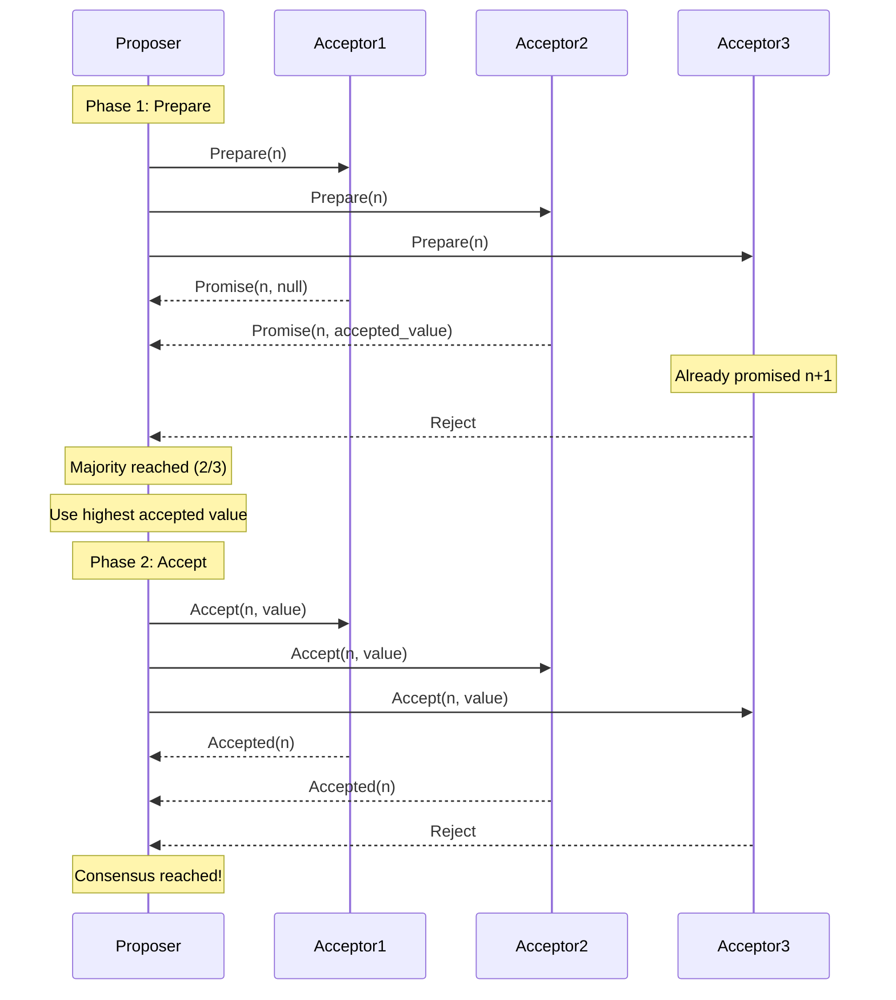
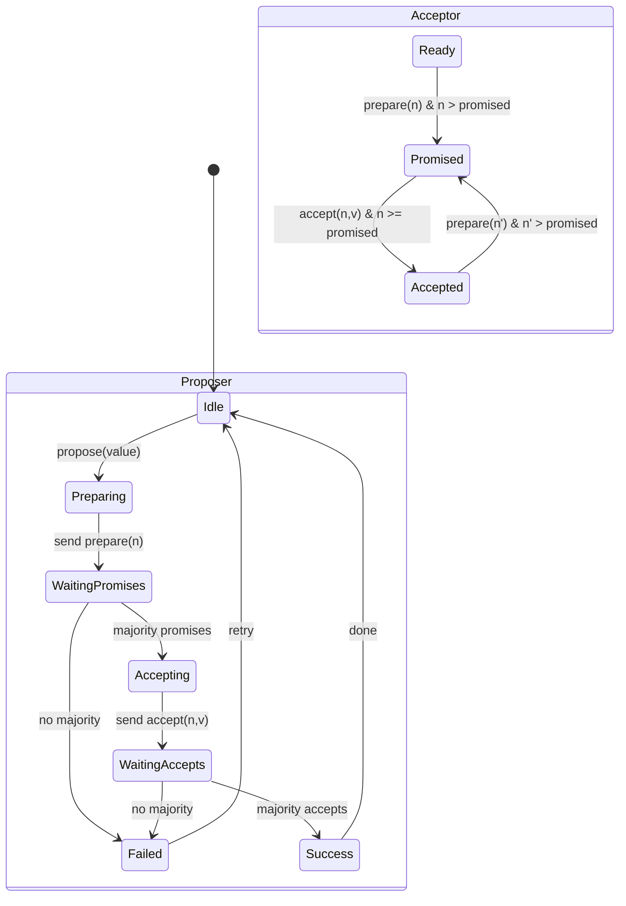
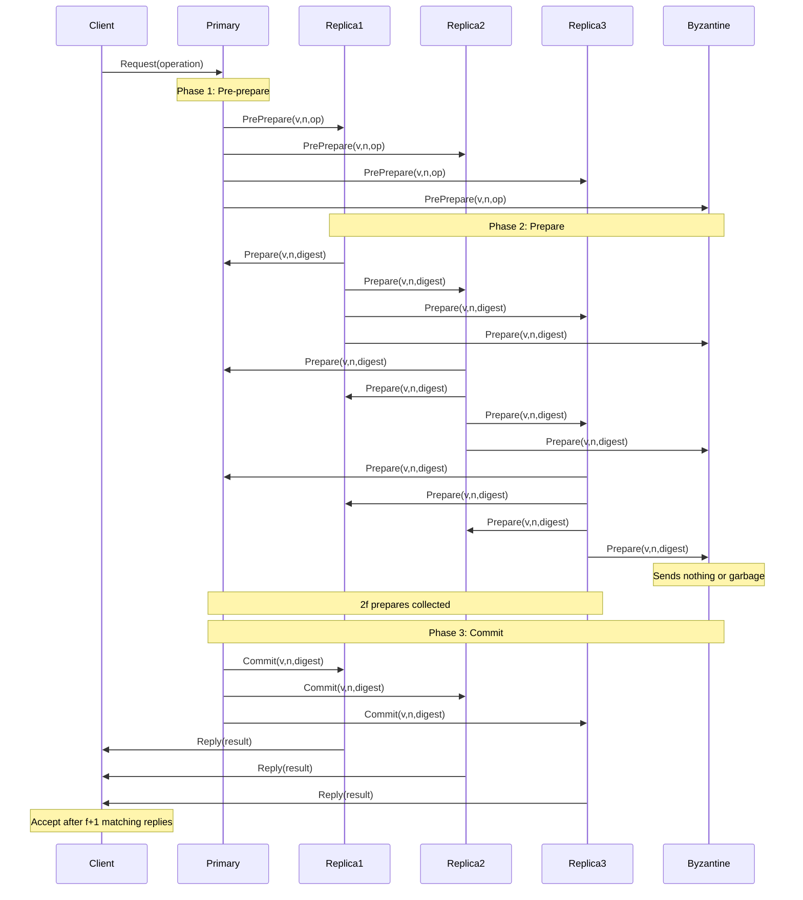
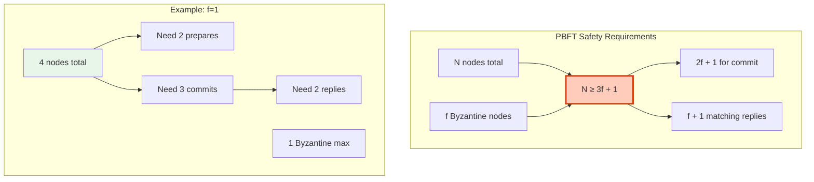
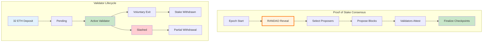
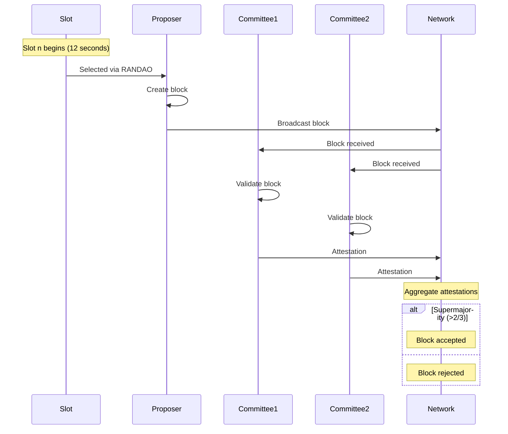
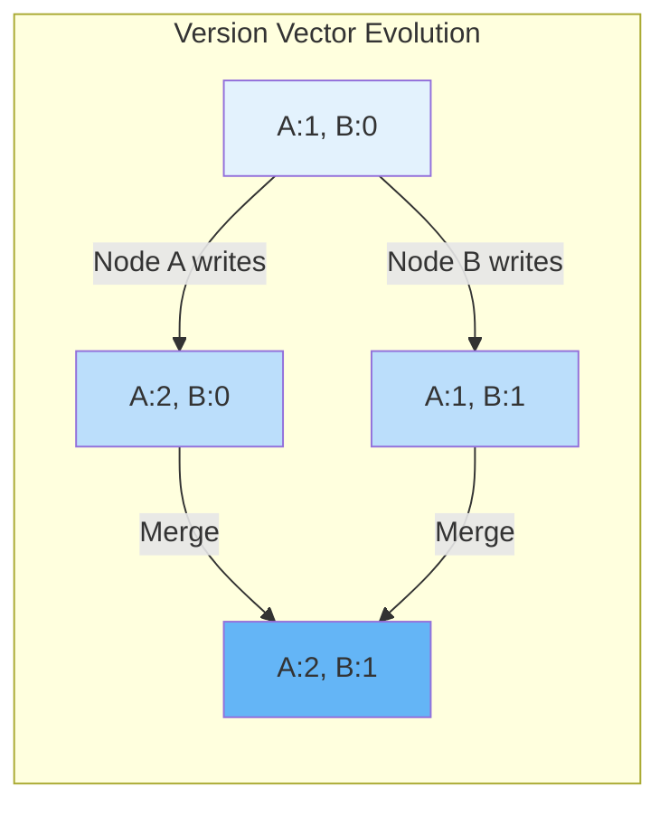
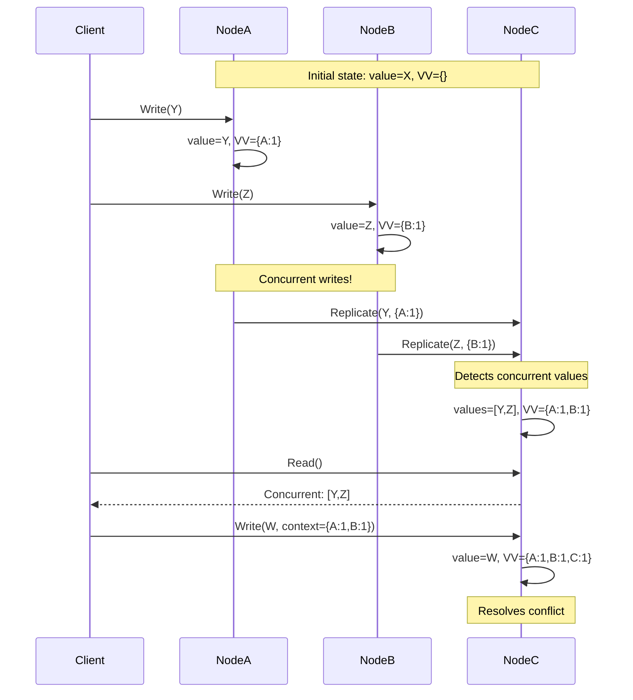
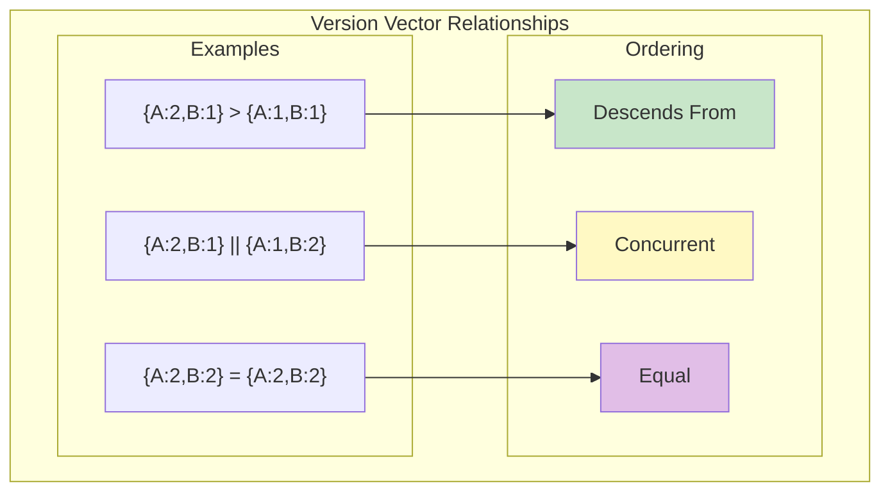

# Truth & Consensus Examples

<div class="truth-box">
<h2>⚡ The Reality Check</h2>
<p><strong>These aren't theoretical examples—they're production war stories.</strong></p>
<p>Each case study represents millions of dollars saved (or lost) based on truth design choices.</p>
</div>

## 🌍 Google Spanner: Engineering Global Truth

```
┌─────────────────────────────────────────────────────────────┐
│         THE PROBLEM: GLOBAL BANK TRANSFERS                  │
├─────────────────────────────────────────────────────────────┤
│                                                             │
│ TOKYO          NEW YORK        LONDON                       │
│ 09:00:00.123   20:00:00.456   01:00:00.789                │
│ Transfer $1M   Transfer $2M    Transfer $3M                 │
│                                                             │
│ QUESTION: What order did these happen? 🤷                   │
│                                                             │
│ OLD WAY: Pick arbitrary order = WRONG BALANCES 💀           │
│ SPANNER: True global ordering = CORRECT ALWAYS ✅           │
└─────────────────────────────────────────────────────────────┘
```

### The TrueTime Magic

```
┌─────────────────────────────────────────────────────────────┐
│                  TRUETIME ARCHITECTURE                      │
├─────────────────────────────────────────────────────────────┤
│                                                             │
│ DATACENTER A         DATACENTER B         DATACENTER C      │
│ ┌─────────────┐     ┌─────────────┐     ┌─────────────┐   │
│ │ GPS RECEIVER│     │ GPS RECEIVER│     │ GPS RECEIVER│   │
│ │ ATOMIC CLOCK│     │ ATOMIC CLOCK│     │ ATOMIC CLOCK│   │
│ └──────┬──────┘     └──────┬──────┘     └──────┬──────┘   │
│        │                    │                    │          │
│        ▼                    ▼                    ▼          │
│   TIME MASTER          TIME MASTER          TIME MASTER    │
│        │                    │                    │          │
│   ┌────┴─────────────────────┴────────────────────┴────┐   │
│   │              TRUETIME API GUARANTEE                 │   │
│   │     now() → [earliest, latest] where ε ≤ 7ms      │   │
│   └─────────────────────────────────────────────────────┘   │
│                                                             │
│ THE COMMIT PROTOCOL:                                        │
│ 1. ts = TrueTime.now().latest                             │
│ 2. Wait until TrueTime.now().earliest > ts                │
│ 3. Commit with timestamp ts                                │
│                                                             │
│ RESULT: True external consistency at global scale!         │
└─────────────────────────────────────────────────────────────┘
```

### Production Impact

```
BEFORE SPANNER (Multi-Master MySQL):
• Reconciliation jobs: 24/7 
• Data inconsistencies: Daily
• Engineer hours: 200/month
• Customer complaints: Regular

AFTER SPANNER:
• Reconciliation: NONE NEEDED
• Inconsistencies: ZERO
• Engineer hours: 5/month
• Customer complaints: None

COST: 7ms average commit latency
BENEFIT: Perfect global consistency
```

## ⚡ Bitcoin: The $1 Trillion Consensus

```
┌─────────────────────────────────────────────────────────────┐
│              BITCOIN'S CONSENSUS INNOVATION                 │
├─────────────────────────────────────────────────────────────┤
│                                                             │
│ THE IMPOSSIBLE PROBLEM:                                     │
│ • No trusted parties                                        │
│ • Anyone can participate                                    │
│ • Byzantine actors expected                                 │
│ • Must agree on money! 💰                                   │
│                                                             │
│ THE SOLUTION: PROOF OF WORK                                 │
│                                                             │
│ Block N       Block N+1      Block N+2                      │
│ ┌─────────┐   ┌─────────┐   ┌─────────┐                   │
│ │Nonce:   │──►│Nonce:   │──►│Nonce:   │                   │
│ │74619284 │   │92847561 │   │???????? │                   │
│ │Hash:    │   │Hash:    │   │Mining... │                   │
│ │00000af3 │   │00000b91 │   │          │                   │
│ └─────────┘   └─────────┘   └─────────┘                   │
│                                                             │
│ CONSENSUS RULE: Longest chain wins                         │
│                                                             │
│ ATTACK COST:                                                │
│ 51% attack = $30 BILLION in hardware + electricity         │
└─────────────────────────────────────────────────────────────┘
```

### Probabilistic Finality in Action

```
┌─────────────────────────────────────────────────────────────┐
│              CONFIRMATION CONFIDENCE LEVELS                 │
├─────────────────────────────────────────────────────────────┤
│                                                             │
│ 0 conf  ████░░░░░░░░░░░░░░  25%  "Seen in mempool"        │
│ 1 conf  ███████████░░░░░░░  60%  "In a block"             │
│ 2 conf  ████████████████░░  90%  "Probably safe"          │
│ 3 conf  █████████████████░  97%  "Very likely safe"       │
│ 6 conf  ███████████████████  99.9% "Bitcoin standard"     │
│                                                             │
│ REAL WORLD MAPPING:                                         │
│ • Coffee shop: 0 confirmations (instant)                   │
│ • Online store: 1-2 confirmations (10-20 min)             │
│ • Car dealership: 3 confirmations (30 min)                │
│ • Real estate: 6 confirmations (1 hour)                   │
│ • Exchange deposit: 10+ confirmations                      │
└─────────────────────────────────────────────────────────────┘
```

## 📊 Kafka: 7 Trillion Messages of Truth

```
┌─────────────────────────────────────────────────────────────┐
│            KAFKA'S LOG-BASED TRUTH MODEL                    │
├─────────────────────────────────────────────────────────────┤
│                                                             │
│ TRADITIONAL DATABASE HELL:                                  │
│                                                             │
│ Service A ←─READ──┐                                         │
│ Service B ←─READ──┼── DATABASE ──WRITE─→ Service D         │
│ Service C ←─READ──┘                    └─WRITE─→ Service E │
│                                                             │
│ PROBLEMS: Coupling, contention, SPOF, no history           │
│                                                             │
│ KAFKA'S SOLUTION: THE IMMUTABLE LOG                        │
│                                                             │
│ Producers          THE LOG              Consumers          │
│ ┌────────┐        ┌─┬─┬─┬─┬─┐         ┌─────────┐        │
│ │Order Svc├──────►│1│2│3│4│5│────────►│Analytics│        │
│ └────────┘        └─┴─┴─┴─┴─┘         └─────────┘        │
│ ┌────────┐              ▲              ┌─────────┐        │
│ │User Svc ├─────────────┘   └─────────►│Billing  │        │
│ └────────┘                             └─────────┘        │
│                                        ┌─────────┐        │
│                              └─────────►│Search   │        │
│                                        └─────────┘        │
│                                                             │
│ BENEFITS:                                                   │
│ • Decoupled: Services don't know about each other         │
│ • Replayable: Can rebuild any service from log            │
│ • Ordered: Events have definitive sequence                │
│ • Scalable: Partitioned for 1M+ events/second             │
└─────────────────────────────────────────────────────────────┘
```

### LinkedIn's Production Numbers

```
Daily Volume:     7,000,000,000,000 messages
Peak Throughput:  100,000,000 messages/second
Clusters:         100+ production clusters  
Retention:        7-30 days of history
Use Cases:        
  • Activity tracking
  • Metrics pipeline
  • Log aggregation
  • Stream processing
  • Event sourcing

KEY INSIGHT: Log = Single source of truth
```

## 🔐 ZooKeeper: The Coordination Backbone

```
┌─────────────────────────────────────────────────────────────┐
│            ZOOKEEPER POWERS HALF THE INTERNET               │
├─────────────────────────────────────────────────────────────┤
│                                                             │
│ WHAT IT DOES:                                               │
│                                                             │
│ /kafka                    /hbase                            │
│   /brokers                 /master                          │
│     /1 → host:port          → host:port                     │
│     /2 → host:port        /region-servers                   │
│     /3 → host:port          /1 → metadata                   │
│   /topics                   /2 → metadata                   │
│     /orders                                                 │
│       /0 → leader:1       /solr                            │
│       /1 → leader:2         /collections                    │
│                              /search → config               │
│                                                             │
│ ONE ZOOKEEPER COORDINATES:                                  │
│ • Kafka broker discovery & topic metadata                  │
│ • HBase master election & region assignment                │
│ • Solr/Elasticsearch cluster state                         │
│ • Distributed locks for 1000s of services                  │
│                                                             │
│ THE MAGIC: Strong consistency with watches                 │
└─────────────────────────────────────────────────────────────┘
```

### ZooKeeper in Action: Distributed Lock

```
┌─────────────────────────────────────────────────────────────┐
│                  DISTRIBUTED LOCK RECIPE                    │
├─────────────────────────────────────────────────────────────┤
│                                                             │
│ 1. CREATE SEQUENTIAL EPHEMERAL NODE:                       │
│    /locks/mylock/lock-0000000001 (by Client A)            │
│    /locks/mylock/lock-0000000002 (by Client B)            │
│    /locks/mylock/lock-0000000003 (by Client C)            │
│                                                             │
│ 2. LIST CHILDREN, FIND YOUR POSITION:                      │
│    Client A: I'm #1 → I HAVE THE LOCK! ✅                 │
│    Client B: I'm #2 → Watch #1                            │
│    Client C: I'm #3 → Watch #2                            │
│                                                             │
│ 3. WHEN CLIENT A FINISHES:                                 │
│    - Deletes lock-0000000001                              │
│    - Client B gets notification                            │
│    - Client B now has lowest number → LOCK ACQUIRED!      │
│                                                             │
│ GUARANTEES:                                                 │
│ • Fair ordering (FIFO)                                     │
│ • No thundering herd                                       │
│ • Automatic cleanup on failure (ephemeral)                │
└─────────────────────────────────────────────────────────────┘
```

## ⚛️ Ethereum: Computing Consensus at Scale

```
┌─────────────────────────────────────────────────────────────┐
│         ETHEREUM'S WORLD COMPUTER CONSENSUS                 │
├─────────────────────────────────────────────────────────────┤
│                                                             │
│ THE CHALLENGE: Agree on computation, not just data         │
│                                                             │
│ TRANSACTION:                    EVM EXECUTION:              │
│ ┌─────────────────┐            ┌──────────────────┐       │
│ │To: Contract      │            │PUSH 20           │       │
│ │Data: transfer()  │───────────►│PUSH addr         │       │
│ │Value: 0          │            │BALANCE           │       │
│ │Gas: 21000        │            │DUP1              │       │
│ └─────────────────┘            │PUSH amount       │       │
│                                 │GT                │       │
│                                 │JUMPI fail        │       │
│                                 └──────────────────┘       │
│                                          │                  │
│                                          ▼                  │
│                                 ┌──────────────────┐       │
│                                 │STATE CHANGES:    │       │
│                                 │Sender: -100 ETH  │       │
│                                 │Receiver: +100 ETH│       │
│                                 │Gas used: 21000   │       │
│                                 └──────────────────┘       │
│                                                             │
│ CONSENSUS: All nodes must get EXACT same result            │
│                                                             │
│ PRODUCTION SCALE:                                           │
│ • 1.5M transactions/day                                    │
│ • 10,000+ nodes validating                                 │
│ • $400B secured                                            │
└─────────────────────────────────────────────────────────────┘
```

## 🪲 CockroachDB: SQL Meets Distributed Truth

```
┌─────────────────────────────────────────────────────────────┐
│            COCKROACHDB'S HYBRID APPROACH                    │
├─────────────────────────────────────────────────────────────┤
│                                                             │
│ THE IMPOSSIBLE ASK:                                         │
│ "Give me PostgreSQL but distributed globally"              │
│                                                             │
│ THE SOLUTION: RAFT + HYBRID LOGICAL CLOCKS                 │
│                                                             │
│         SQL Query                                           │
│            │                                                │
│            ▼                                                │
│    ┌───────────────┐                                       │
│    │ SQL PARSER    │                                       │
│    └───────┬───────┘                                       │
│            │                                                │
│            ▼                                                │
│    ┌───────────────┐     Range 1    Range 2    Range 3    │
│    │ DISTRIBUTION  │     ┌──────┐   ┌──────┐   ┌──────┐  │
│    │    LAYER      ├────►│RAFT  │   │RAFT  │   │RAFT  │  │
│    └───────────────┘     │Leader│   │Leader│   │Leader│  │
│                          └──┬───┘   └──┬───┘   └──┬───┘  │
│                             │          │          │        │
│                          ┌──┴───┐   ┌──┴───┐   ┌──┴───┐  │
│                          │Follow│   │Follow│   │Follow│  │
│                          └──┬───┘   └──┬───┘   └──┬───┘  │
│                             │          │          │        │
│                          ┌──┴───┐   ┌──┴───┐   ┌──┴───┐  │
│                          │Follow│   │Follow│   │Follow│  │
│                          └──────┘   └──────┘   └──────┘  │
│                                                             │
│ PRODUCTION ACHIEVEMENT:                                     │
│ • ACID transactions across continents                      │
│ • 99.999% availability                                     │
│ • Linear scalability to 100s of nodes                      │
└─────────────────────────────────────────────────────────────┘
```

### Real Customer Impact

```
COMPANY: Global Betting Platform
BEFORE: PostgreSQL with read replicas
  • Replication lag: 2-10 seconds
  • Split-brain during failures
  • Manual failover: 30 minutes
  • Data loss: Several incidents/year

AFTER: CockroachDB
  • Replication lag: <5ms (synchronous)
  • Automatic consensus prevents split-brain
  • Automatic failover: <10 seconds
  • Data loss: ZERO in 3 years

"CockroachDB saved us $2M in prevented outages"
```

## 🔑 Key Lessons from Production

```
┌─────────────────────────────────────────────────────────────┐
│                  TRUTH DESIGN DECISIONS                     │
├─────────────────────────────────────────────────────────────┤
│                                                             │
│ GOOGLE SPANNER:                                             │
│ Lesson: Hardware investment (GPS) enables new possibilities │
│ Trade-off: 7ms latency for perfect global consistency      │
│                                                             │
│ BITCOIN:                                                    │
│ Lesson: Economic incentives can replace trust              │
│ Trade-off: 10 min finality for permissionless consensus    │
│                                                             │
│ KAFKA:                                                      │
│ Lesson: Log-based truth enables massive scale              │
│ Trade-off: Storage cost for replayability                  │
│                                                             │
│ ZOOKEEPER:                                                  │
│ Lesson: Small, consistent core can coordinate large system │
│ Trade-off: Becomes bottleneck if overused                  │
│                                                             │
│ ETHEREUM:                                                   │
│ Lesson: Deterministic execution enables compute consensus   │
│ Trade-off: Every node runs every computation               │
│                                                             │
│ COCKROACHDB:                                                │
│ Lesson: SQL semantics possible in distributed systems      │
│ Trade-off: Complex routing and coordination                │
└─────────────────────────────────────────────────────────────┘
```


## Consensus Algorithm Implementations

### 1. Paxos Implementation





| Phase | Message | Acceptor Action | Required for Progress |
|-------|---------|-----------------|----------------------|
| 1a | Prepare(n) | Promise if n > highest promised | - |
| 1b | Promise(n, v) | Return any accepted value | Majority promises |
| 2a | Accept(n, v) | Accept if n >= promised | - |
| 2b | Accepted(n) | Confirm acceptance | Majority accepts |


### 2. Byzantine Fault Tolerant Consensus





| Phase | Messages Required | Purpose | Byzantine Tolerance |
|-------|------------------|---------|--------------------|
| Pre-prepare | 1 (from primary) | Order assignment | Primary can be Byzantine |
| Prepare | 2f | Agreement on order | Tolerates f Byzantine |
| Commit | 2f + 1 | Agreement on execution | Ensures total order |
| Reply | f + 1 | Client confidence | At least 1 correct reply |


### 3. Blockchain Consensus Variants





| Slashing Condition | Penalty | Description | Protection |
|-------------------|---------|-------------|------------|
| Double Voting | 1-5% of stake | Voting for two blocks at same height | Store last vote |
| Surround Voting | 1-3% of stake | Conflicting attestations | Track vote history |
| Inactivity Leak | Gradual | Offline during finality crisis | Stay online |
| Proposer Equivocation | 2-5% of stake | Proposing multiple blocks | One block per slot |


## Truth Maintenance Systems

### 1. Distributed Version Vectors







| Scenario | Vector State | Relationship | Action Required |
|----------|--------------|--------------|----------------|
| Sequential Updates | {A:2} → {A:3} | Descends from | Replace old value |
| Concurrent Updates | {A:2,B:1} vs {A:1,B:2} | Concurrent | Keep both values |
| Synchronized | {A:2,B:2} = {A:2,B:2} | Equal | Same value |
| Partial Knowledge | {A:2} vs {A:2,B:1} | Ancestor | Update to newer |


## Key Takeaways

1. **Truth is expensive** - Consensus requires multiple round trips

2. **Different truths for different needs** - Strong, eventual, causal consistency

3. **Time is fundamental** - Can't order events without time

4. **Byzantine failures change everything** - 3f+1 nodes needed for f failures

5. **Probabilistic consensus can be enough** - Bitcoin proves it

Remember: Perfect truth is impossible in distributed systems. Choose the level of truth your application actually needs.