<!-- Navigation -->
[Home](../../index.md) → [Part II: Pillars](../index.md) → [Truth](index.md) → **Truth & Consensus Examples**

# Truth & Consensus Examples

## Real-World Case Studies

### 1. Google Spanner: Global Consistency with TrueTime

**Problem**: Achieve external consistency across globally distributed data centers

**Innovation**: TrueTime API - exposing clock uncertainty explicitly

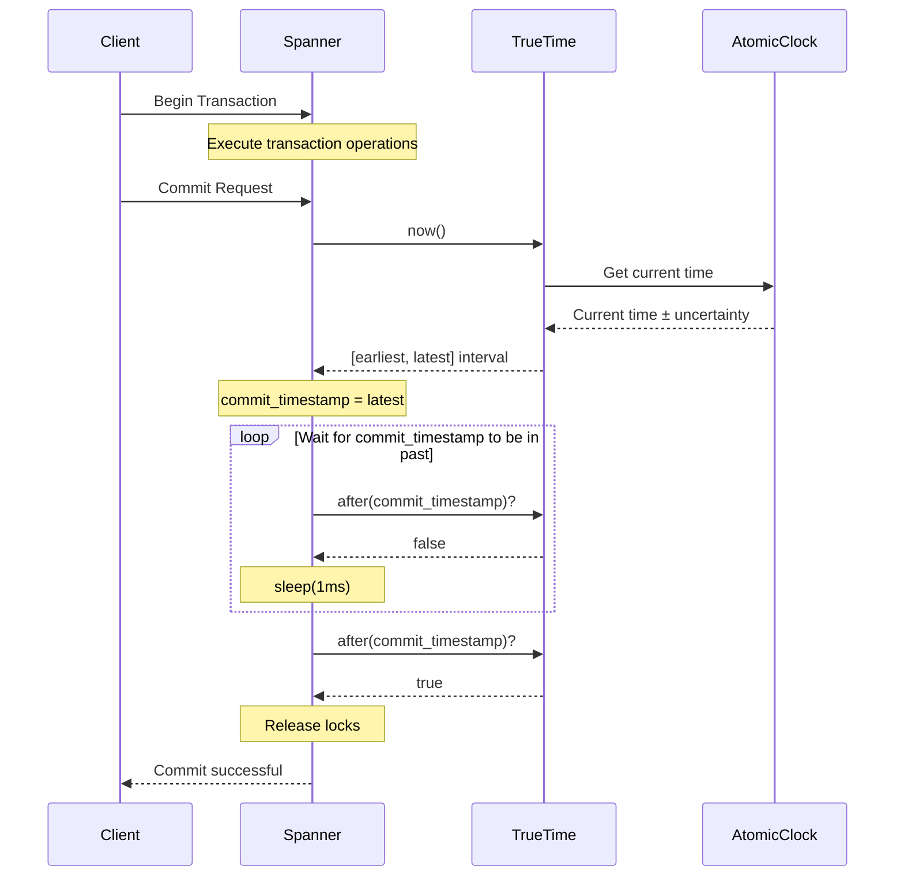
```mermaid
sequenceDiagram
    participant Client
    participant Spanner
    participant TrueTime
    participant AtomicClock
    
    Client->>Spanner: Begin Transaction
    
    Note over Spanner: Execute transaction operations
    
    Client->>Spanner: Commit Request
    
    Spanner->>TrueTime: now()
    TrueTime->>AtomicClock: Get current time
    AtomicClock-->>TrueTime: Current time ± uncertainty
    TrueTime-->>Spanner: [earliest, latest] interval
    
    Note over Spanner: commit_timestamp = latest
    
    loop Wait for commit_timestamp to be in past
        Spanner->>TrueTime: after(commit_timestamp)?
        TrueTime-->>Spanner: false
        Note over Spanner: sleep(1ms)
    end
    
    Spanner->>TrueTime: after(commit_timestamp)?
    TrueTime-->>Spanner: true
    
    Note over Spanner: Release locks
    Spanner-->>Client: Commit successful
```

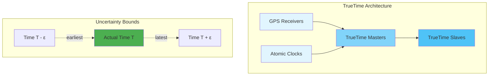
```mermaid
graph TB
    subgraph "TrueTime Architecture"
        GPS[GPS Receivers]
        AC[Atomic Clocks]
        TT[TrueTime Masters]
        TS[TrueTime Slaves]
        
        GPS --> TT
        AC --> TT
        TT --> TS
        
        style GPS fill:#e1f5fe
        style AC fill:#e1f5fe
        style TT fill:#81d4fa
        style TS fill:#4fc3f7
    end
    
    subgraph "Uncertainty Bounds"
        T1[Time T - ε]
        T2[Actual Time T]
        T3[Time T + ε]
        
        T1 -.->|earliest| T2
        T2 -.->|latest| T3
        
        style T2 fill:#4caf50
    end
```

**Key Insights**:
- By waiting out clock uncertainty, Spanner guarantees external consistency
- Commit wait averages 7ms - acceptable for many workloads
- Enables globally consistent snapshots without coordination

### 2. Bitcoin: Probabilistic Consensus Through Proof-of-Work

**Problem**: Achieve consensus without trusted parties in adversarial environment

**Solution**: Longest chain rule with economic incentives

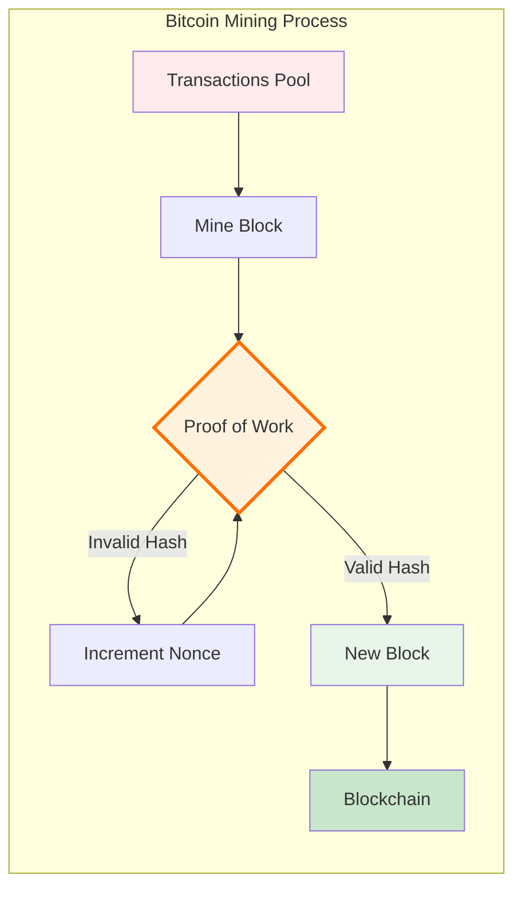
```mermaid
graph LR
    subgraph "Bitcoin Mining Process"
        TX[Transactions Pool] --> MB[Mine Block]
        MB --> POW{Proof of Work}
        POW -->|Invalid Hash| INC[Increment Nonce]
        INC --> POW
        POW -->|Valid Hash| NB[New Block]
        NB --> BC[Blockchain]
        
        style TX fill:#ffebee
        style POW fill:#fff3e0,stroke:#ff6f00,stroke-width:3px
        style NB fill:#e8f5e9
        style BC fill:#c8e6c9
    end
```

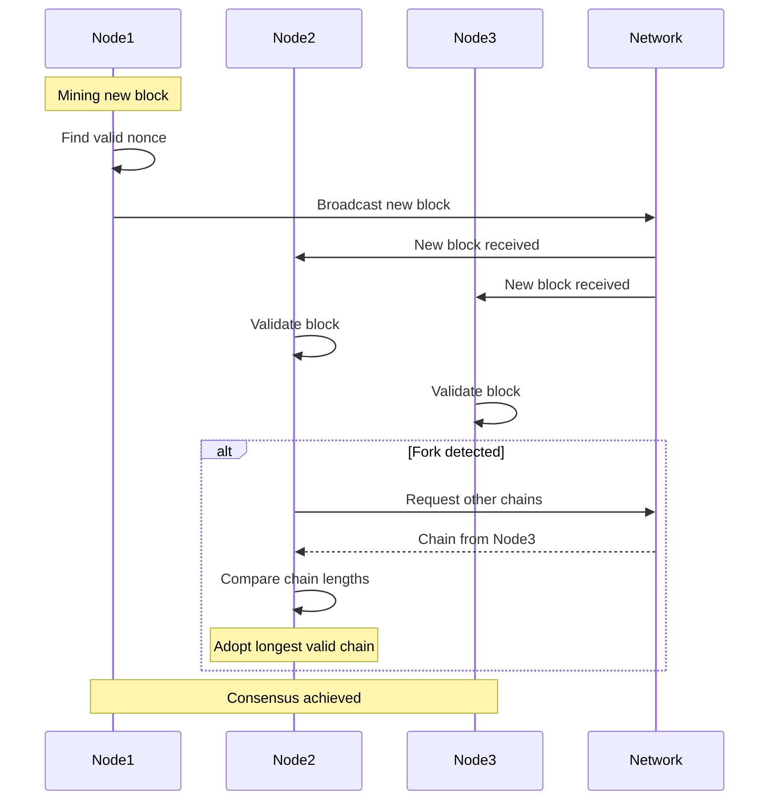
```mermaid
sequenceDiagram
    participant Node1
    participant Node2
    participant Node3
    participant Network
    
    Note over Node1: Mining new block
    Node1->>Node1: Find valid nonce
    Node1->>Network: Broadcast new block
    
    Network->>Node2: New block received
    Network->>Node3: New block received
    
    Node2->>Node2: Validate block
    Node3->>Node3: Validate block
    
    alt Fork detected
        Node2->>Network: Request other chains
        Network-->>Node2: Chain from Node3
        Node2->>Node2: Compare chain lengths
        Note over Node2: Adopt longest valid chain
    end
    
    Note over Node1,Node3: Consensus achieved
```

| Confirmation Depth | Probability of Permanence | Use Case |
|-------------------|---------------------------|----------|
| 0 blocks | ~0% | Unconfirmed |
| 1 block | ~70% | Low-value transactions |
| 3 blocks | ~95% | Standard transactions |
| 6 blocks | >99.9% | High-value transactions |
| 100 blocks | ~100% | Exchange deposits |

**Probabilistic Finality**:
- After 1 block: ~70% chance of permanence
- After 6 blocks: >99.9% chance
- After 100 blocks: Practically irreversible

### 3. Apache ZooKeeper: Hierarchical Consensus

**Problem**: Provide coordination primitives for distributed systems

**Architecture**: ZAB (ZooKeeper Atomic Broadcast)

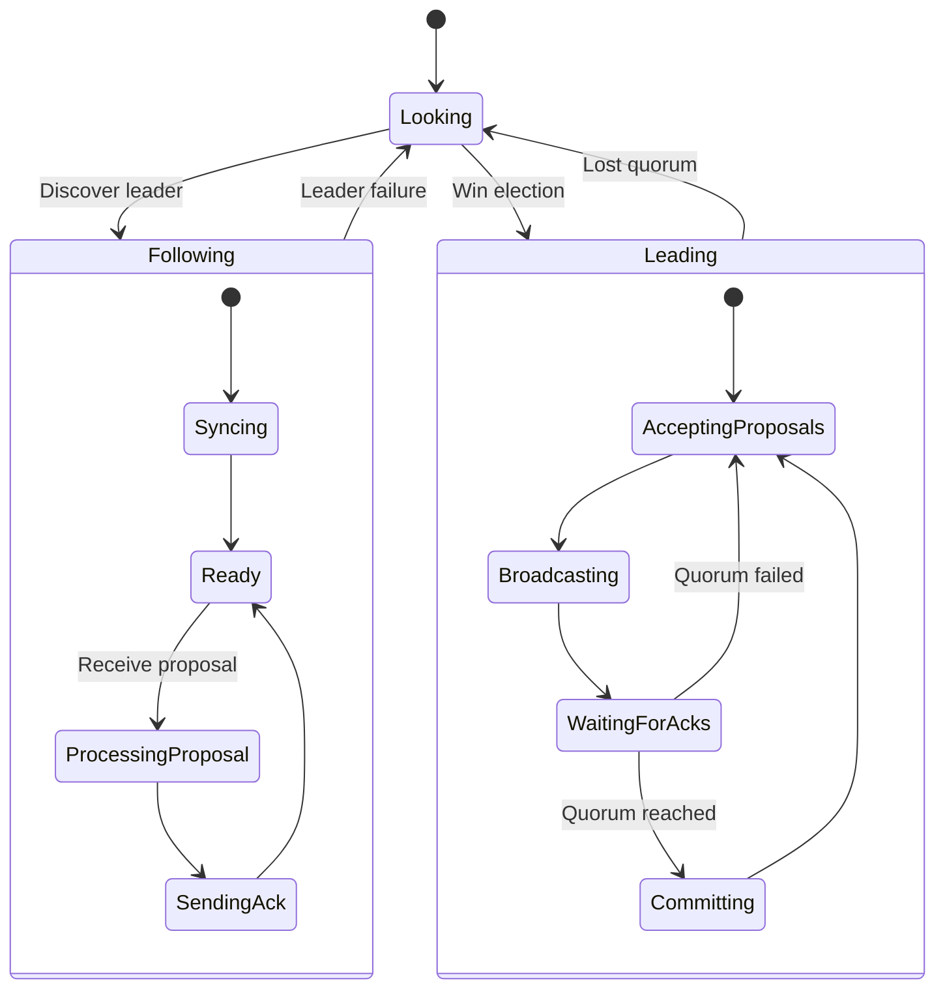
```mermaid
stateDiagram-v2
    [*] --> Looking
    Looking --> Following: Discover leader
    Looking --> Leading: Win election
    Following --> Looking: Leader failure
    Leading --> Looking: Lost quorum
    
    state Leading {
        [*] --> AcceptingProposals
        AcceptingProposals --> Broadcasting
        Broadcasting --> WaitingForAcks
        WaitingForAcks --> Committing: Quorum reached
        WaitingForAcks --> AcceptingProposals: Quorum failed
        Committing --> AcceptingProposals
    }
    
    state Following {
        [*] --> Syncing
        Syncing --> Ready
        Ready --> ProcessingProposal: Receive proposal
        ProcessingProposal --> SendingAck
        SendingAck --> Ready
    }
```

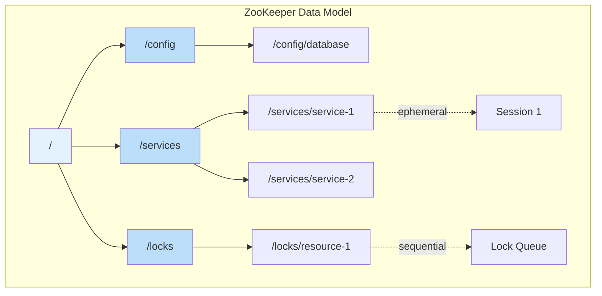
```mermaid
graph TB
    subgraph "ZooKeeper Data Model"
        root["/"]
        config["/config"]
        services["/services"]
        locks["/locks"]
        
        root --> config
        root --> services
        root --> locks
        
        config --> db["/config/database"]
        services --> s1["/services/service-1"]
        services --> s2["/services/service-2"]
        locks --> l1["/locks/resource-1"]
        
        style root fill:#e3f2fd
        style config fill:#bbdefb
        style services fill:#bbdefb
        style locks fill:#bbdefb
        
        s1 -.->|ephemeral| session1[Session 1]
        l1 -.->|sequential| queue[Lock Queue]
    end
```

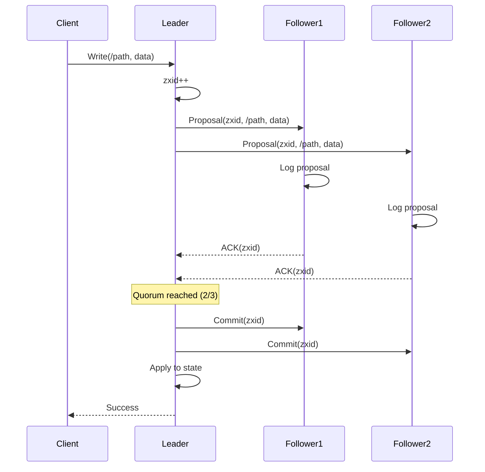
```mermaid
sequenceDiagram
    participant Client
    participant Leader
    participant Follower1
    participant Follower2
    
    Client->>Leader: Write(/path, data)
    
    Leader->>Leader: zxid++
    Leader->>Follower1: Proposal(zxid, /path, data)
    Leader->>Follower2: Proposal(zxid, /path, data)
    
    Follower1->>Follower1: Log proposal
    Follower2->>Follower2: Log proposal
    
    Follower1-->>Leader: ACK(zxid)
    Follower2-->>Leader: ACK(zxid)
    
    Note over Leader: Quorum reached (2/3)
    
    Leader->>Follower1: Commit(zxid)
    Leader->>Follower2: Commit(zxid)
    Leader->>Leader: Apply to state
    
    Leader-->>Client: Success
```

**Use Cases**:
- Configuration management
- Service discovery
- Distributed locks
- Leader election
- Barrier synchronization

### 4. Ethereum: Smart Contract Consensus

**Problem**: Agree not just on data, but on computation results

**Solution**: Ethereum Virtual Machine with deterministic execution

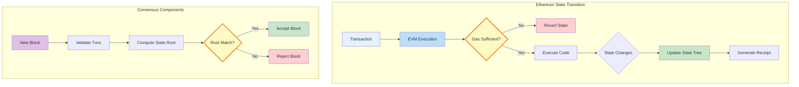
```mermaid
graph TB
    subgraph "Ethereum State Transition"
        TX[Transaction] --> EVM[EVM Execution]
        EVM --> GAS{Gas Sufficient?}
        GAS -->|No| FAIL[Revert State]
        GAS -->|Yes| EXEC[Execute Code]
        EXEC --> SC{State Changes}
        SC --> UPD[Update State Tree]
        UPD --> RECEIPT[Generate Receipt]
        
        style TX fill:#e3f2fd
        style EVM fill:#bbdefb
        style GAS fill:#fff9c4,stroke:#f57f17,stroke-width:3px
        style UPD fill:#c8e6c9
        style FAIL fill:#ffcdd2
    end
    
    subgraph "Consensus Components"
        BLOCK[New Block] --> VAL[Validate Txns]
        VAL --> ROOT[Compute State Root]
        ROOT --> CMP{Root Match?}
        CMP -->|Yes| ACCEPT[Accept Block]
        CMP -->|No| REJECT[Reject Block]
        
        style BLOCK fill:#e1bee7
        style CMP fill:#fff9c4,stroke:#f57f17,stroke-width:3px
        style ACCEPT fill:#c8e6c9
        style REJECT fill:#ffcdd2
    end
```

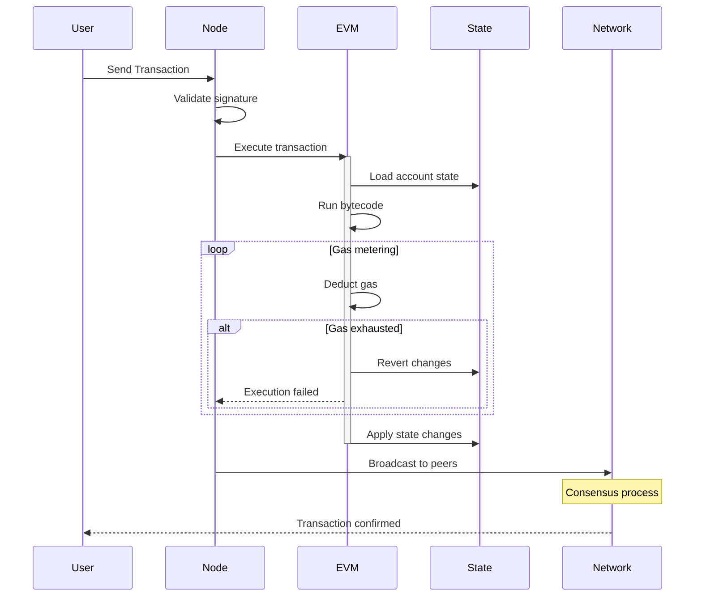
```mermaid
sequenceDiagram
    participant User
    participant Node
    participant EVM
    participant State
    participant Network
    
    User->>Node: Send Transaction
    Node->>Node: Validate signature
    Node->>EVM: Execute transaction
    
    activate EVM
    EVM->>State: Load account state
    EVM->>EVM: Run bytecode
    loop Gas metering
        EVM->>EVM: Deduct gas
        alt Gas exhausted
            EVM->>State: Revert changes
            EVM-->>Node: Execution failed
        end
    end
    EVM->>State: Apply state changes
    deactivate EVM
    
    Node->>Network: Broadcast to peers
    Note over Network: Consensus process
    Network-->>User: Transaction confirmed
```

### 5. CockroachDB: Consensus for SQL

**Problem**: Distributed SQL with ACID guarantees

**Solution**: Raft consensus with MVCC

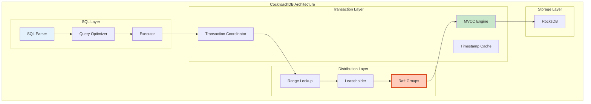
```mermaid
graph TB
    subgraph "CockroachDB Architecture"
        subgraph "SQL Layer"
            PARSER[SQL Parser]
            OPTIMIZER[Query Optimizer]
            EXECUTOR[Executor]
        end
        
        subgraph "Transaction Layer"
            TXN[Transaction Coordinator]
            TS[Timestamp Cache]
            MVCC[MVCC Engine]
        end
        
        subgraph "Distribution Layer"
            RANGE[Range Lookup]
            LEASE[Leaseholder]
            RAFT[Raft Groups]
        end
        
        subgraph "Storage Layer"
            ROCKS[RocksDB]
        end
        
        PARSER --> OPTIMIZER
        OPTIMIZER --> EXECUTOR
        EXECUTOR --> TXN
        TXN --> RANGE
        RANGE --> LEASE
        LEASE --> RAFT
        RAFT --> MVCC
        MVCC --> ROCKS
        
        style PARSER fill:#e3f2fd
        style RAFT fill:#ffccbc,stroke:#d84315,stroke-width:3px
        style MVCC fill:#c8e6c9
    end
```

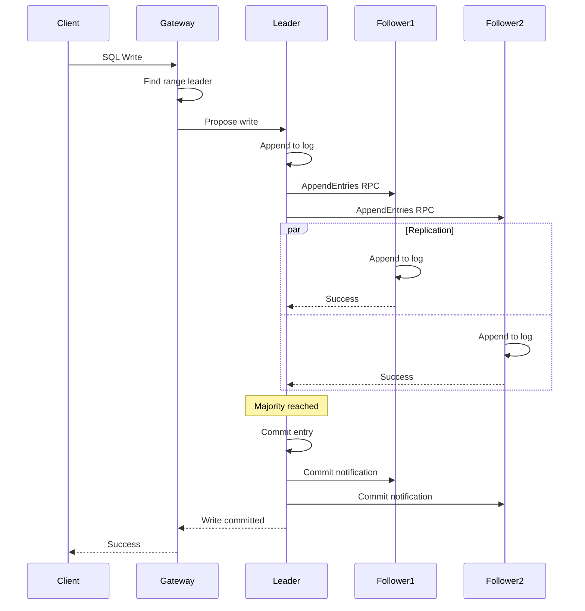
```mermaid
sequenceDiagram
    participant Client
    participant Gateway
    participant Leader
    participant Follower1
    participant Follower2
    
    Client->>Gateway: SQL Write
    Gateway->>Gateway: Find range leader
    Gateway->>Leader: Propose write
    
    Leader->>Leader: Append to log
    Leader->>Follower1: AppendEntries RPC
    Leader->>Follower2: AppendEntries RPC
    
    par Replication
        Follower1->>Follower1: Append to log
        Follower1-->>Leader: Success
    and
        Follower2->>Follower2: Append to log
        Follower2-->>Leader: Success
    end
    
    Note over Leader: Majority reached
    Leader->>Leader: Commit entry
    Leader->>Follower1: Commit notification
    Leader->>Follower2: Commit notification
    
    Leader-->>Gateway: Write committed
    Gateway-->>Client: Success
```

| Scenario | Behavior | Recovery |
|----------|----------|----------|
| Leader Failure | New election triggered | Follower with most recent log becomes leader |
| Network Partition | Minority partition unavailable | Automatic recovery when partition heals |
| Slow Follower | Leader maintains log buffer | Follower catches up from log |
| Split Brain Prevention | Only majority can elect leader | Ensures single leader per term |

## Consensus Algorithm Implementations

### 1. Paxos Implementation

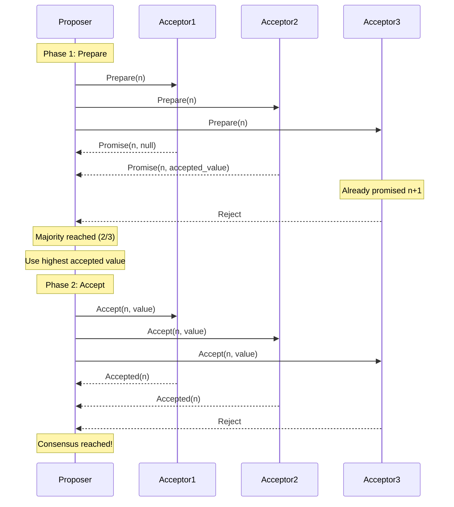
```mermaid
sequenceDiagram
    participant Proposer
    participant Acceptor1
    participant Acceptor2
    participant Acceptor3
    
    Note over Proposer: Phase 1: Prepare
    Proposer->>Acceptor1: Prepare(n)
    Proposer->>Acceptor2: Prepare(n)
    Proposer->>Acceptor3: Prepare(n)
    
    Acceptor1-->>Proposer: Promise(n, null)
    Acceptor2-->>Proposer: Promise(n, accepted_value)
    Note over Acceptor3: Already promised n+1
    Acceptor3-->>Proposer: Reject
    
    Note over Proposer: Majority reached (2/3)
    Note over Proposer: Use highest accepted value
    
    Note over Proposer: Phase 2: Accept
    Proposer->>Acceptor1: Accept(n, value)
    Proposer->>Acceptor2: Accept(n, value)
    Proposer->>Acceptor3: Accept(n, value)
    
    Acceptor1-->>Proposer: Accepted(n)
    Acceptor2-->>Proposer: Accepted(n)
    Acceptor3-->>Proposer: Reject
    
    Note over Proposer: Consensus reached!
```

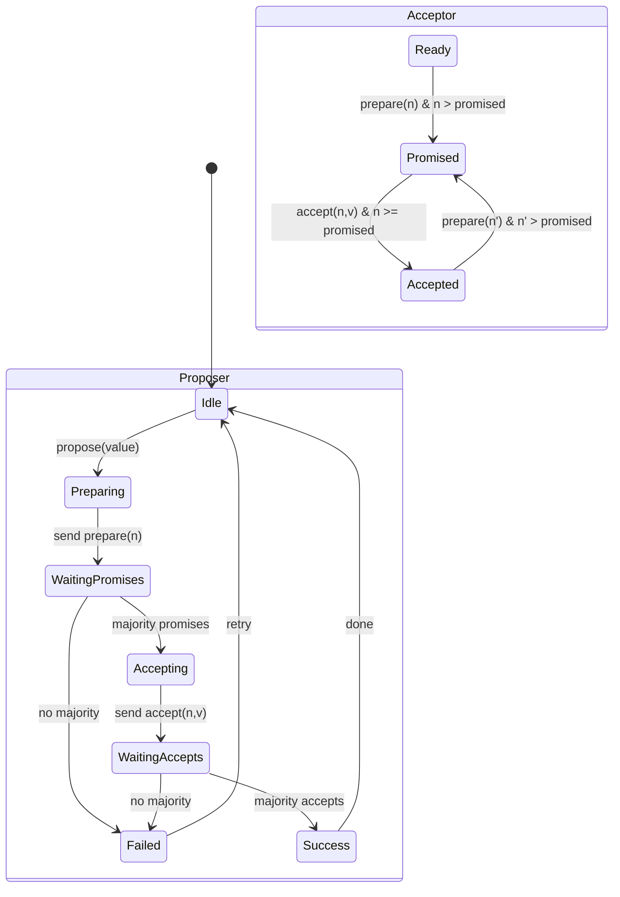
```mermaid
stateDiagram-v2
    [*] --> Idle
    
    state Proposer {
        Idle --> Preparing: propose(value)
        Preparing --> WaitingPromises: send prepare(n)
        WaitingPromises --> Accepting: majority promises
        WaitingPromises --> Failed: no majority
        Accepting --> WaitingAccepts: send accept(n,v)
        WaitingAccepts --> Success: majority accepts
        WaitingAccepts --> Failed: no majority
        Failed --> Idle: retry
        Success --> Idle: done
    }
    
    state Acceptor {
        Ready --> Promised: prepare(n) & n > promised
        Promised --> Accepted: accept(n,v) & n >= promised
        Accepted --> Promised: prepare(n') & n' > promised
    }
```

| Phase | Message | Acceptor Action | Required for Progress |
|-------|---------|-----------------|----------------------|
| 1a | Prepare(n) | Promise if n > highest promised | - |
| 1b | Promise(n, v) | Return any accepted value | Majority promises |
| 2a | Accept(n, v) | Accept if n >= promised | - |
| 2b | Accepted(n) | Confirm acceptance | Majority accepts |

### 2. Byzantine Fault Tolerant Consensus

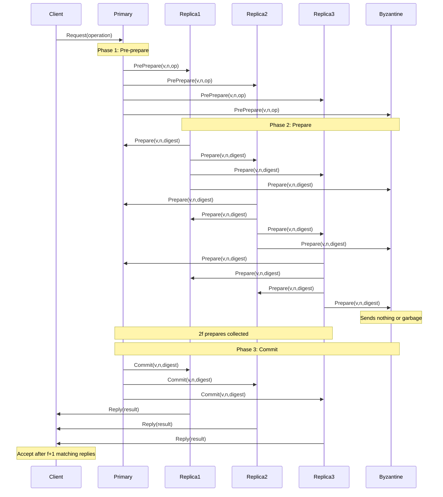
```mermaid
sequenceDiagram
    participant Client
    participant Primary
    participant Replica1
    participant Replica2
    participant Replica3
    participant Byzantine
    
    Client->>Primary: Request(operation)
    
    Note over Primary: Phase 1: Pre-prepare
    Primary->>Replica1: PrePrepare(v,n,op)
    Primary->>Replica2: PrePrepare(v,n,op)
    Primary->>Replica3: PrePrepare(v,n,op)
    Primary->>Byzantine: PrePrepare(v,n,op)
    
    Note over Replica1,Byzantine: Phase 2: Prepare
    Replica1->>Primary: Prepare(v,n,digest)
    Replica1->>Replica2: Prepare(v,n,digest)
    Replica1->>Replica3: Prepare(v,n,digest)
    Replica1->>Byzantine: Prepare(v,n,digest)
    
    Replica2->>Primary: Prepare(v,n,digest)
    Replica2->>Replica1: Prepare(v,n,digest)
    Replica2->>Replica3: Prepare(v,n,digest)
    Replica2->>Byzantine: Prepare(v,n,digest)
    
    Replica3->>Primary: Prepare(v,n,digest)
    Replica3->>Replica1: Prepare(v,n,digest)
    Replica3->>Replica2: Prepare(v,n,digest)
    Replica3->>Byzantine: Prepare(v,n,digest)
    
    Note over Byzantine: Sends nothing or garbage
    
    Note over Primary,Replica3: 2f prepares collected
    
    Note over Primary,Byzantine: Phase 3: Commit
    Primary->>Replica1: Commit(v,n,digest)
    Primary->>Replica2: Commit(v,n,digest)
    Primary->>Replica3: Commit(v,n,digest)
    
    Replica1->>Client: Reply(result)
    Replica2->>Client: Reply(result)
    Replica3->>Client: Reply(result)
    
    Note over Client: Accept after f+1 matching replies
```

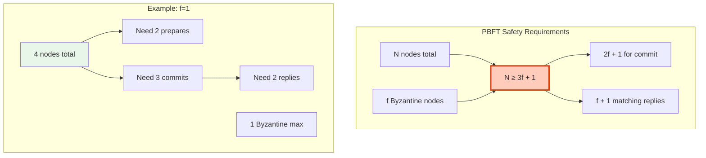
```mermaid
graph TB
    subgraph "PBFT Safety Requirements"
        N[N nodes total]
        F[f Byzantine nodes]
        REQ1[N ≥ 3f + 1]
        REQ2[2f + 1 for commit]
        REQ3[f + 1 matching replies]
        
        N --> REQ1
        F --> REQ1
        REQ1 --> REQ2
        REQ1 --> REQ3
        
        style REQ1 fill:#ffccbc,stroke:#d84315,stroke-width:3px
    end
    
    subgraph "Example: f=1"
        NODES[4 nodes total]
        BYZ[1 Byzantine max]
        PREP[Need 2 prepares]
        COMM[Need 3 commits]
        REPL[Need 2 replies]
        
        NODES --> PREP
        NODES --> COMM
        COMM --> REPL
        
        style NODES fill:#e8f5e9
    end
```

| Phase | Messages Required | Purpose | Byzantine Tolerance |
|-------|------------------|---------|--------------------|
| Pre-prepare | 1 (from primary) | Order assignment | Primary can be Byzantine |
| Prepare | 2f | Agreement on order | Tolerates f Byzantine |
| Commit | 2f + 1 | Agreement on execution | Ensures total order |
| Reply | f + 1 | Client confidence | At least 1 correct reply |

### 3. Blockchain Consensus Variants

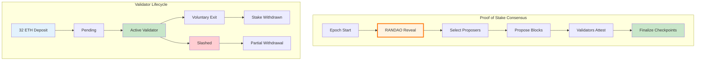
```mermaid
graph TB
    subgraph "Proof of Stake Consensus"
        EPOCH[Epoch Start] --> RAND[RANDAO Reveal]
        RAND --> SELECT[Select Proposers]
        SELECT --> PROPOSE[Propose Blocks]
        PROPOSE --> ATTEST[Validators Attest]
        ATTEST --> FINALIZE[Finalize Checkpoints]
        
        style RAND fill:#fff3e0,stroke:#ff6f00,stroke-width:3px
        style FINALIZE fill:#c8e6c9
    end
    
    subgraph "Validator Lifecycle"
        DEPOSIT[32 ETH Deposit] --> PENDING[Pending]
        PENDING --> ACTIVE[Active Validator]
        ACTIVE --> EXIT[Voluntary Exit]
        ACTIVE --> SLASHED[Slashed]
        EXIT --> WITHDRAWN[Stake Withdrawn]
        SLASHED --> WITHDRAWN2[Partial Withdrawal]
        
        style DEPOSIT fill:#e3f2fd
        style ACTIVE fill:#c8e6c9
        style SLASHED fill:#ffcdd2
    end
```

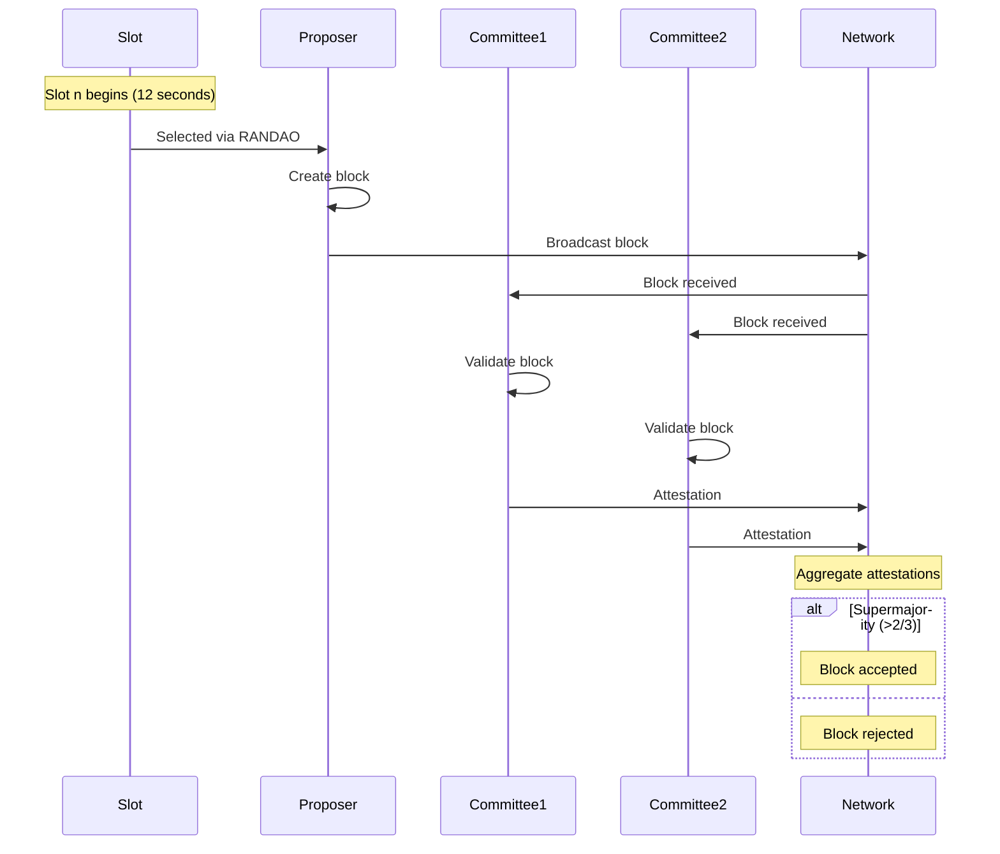
```mermaid
sequenceDiagram
    participant Slot
    participant Proposer
    participant Committee1
    participant Committee2
    participant Network
    
    Note over Slot: Slot n begins (12 seconds)
    
    Slot->>Proposer: Selected via RANDAO
    Proposer->>Proposer: Create block
    Proposer->>Network: Broadcast block
    
    Network->>Committee1: Block received
    Network->>Committee2: Block received
    
    Committee1->>Committee1: Validate block
    Committee2->>Committee2: Validate block
    
    Committee1->>Network: Attestation
    Committee2->>Network: Attestation
    
    Note over Network: Aggregate attestations
    
    alt Supermajority (>2/3)
        Note over Network: Block accepted
    else
        Note over Network: Block rejected
    end
```

| Slashing Condition | Penalty | Description | Protection |
|-------------------|---------|-------------|------------|
| Double Voting | 1-5% of stake | Voting for two blocks at same height | Store last vote |
| Surround Voting | 1-3% of stake | Conflicting attestations | Track vote history |
| Inactivity Leak | Gradual | Offline during finality crisis | Stay online |
| Proposer Equivocation | 2-5% of stake | Proposing multiple blocks | One block per slot |

## Truth Maintenance Systems

### 1. Distributed Version Vectors

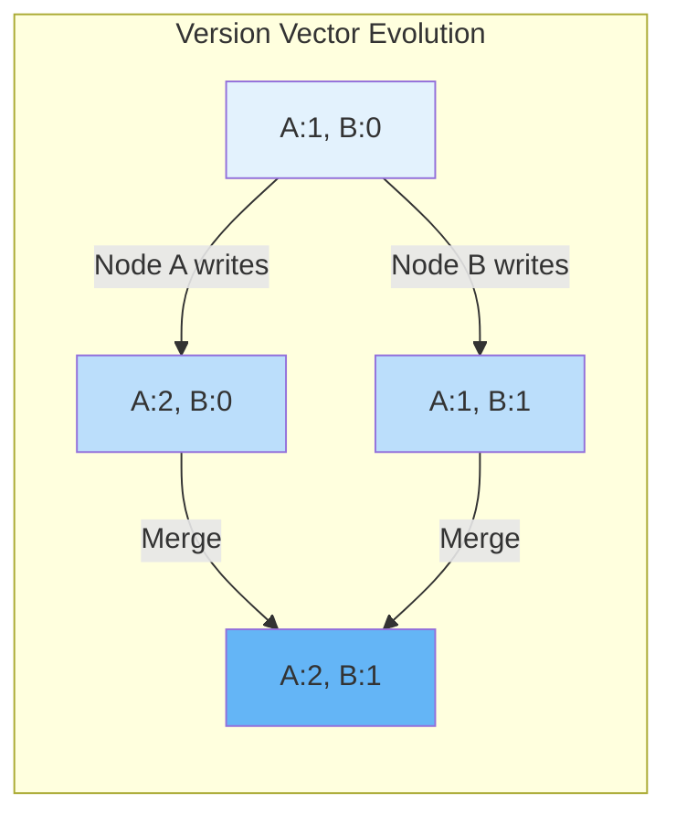
```mermaid
graph LR
    subgraph "Version Vector Evolution"
        VV1["A:1, B:0"] -->|Node A writes| VV2["A:2, B:0"]
        VV1 -->|Node B writes| VV3["A:1, B:1"]
        VV2 -->|Merge| VV4["A:2, B:1"]
        VV3 -->|Merge| VV4
        
        style VV1 fill:#e3f2fd
        style VV2 fill:#bbdefb
        style VV3 fill:#bbdefb
        style VV4 fill:#64b5f6
    end
```

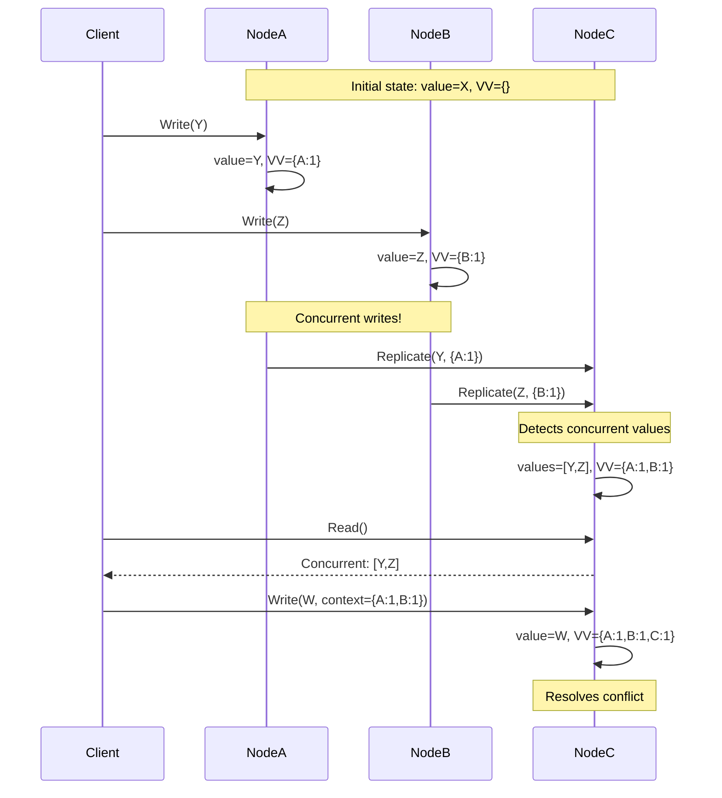
```mermaid
sequenceDiagram
    participant Client
    participant NodeA
    participant NodeB
    participant NodeC
    
    Note over NodeA,NodeC: Initial state: value=X, VV={}
    
    Client->>NodeA: Write(Y)
    NodeA->>NodeA: value=Y, VV={A:1}
    
    Client->>NodeB: Write(Z)
    NodeB->>NodeB: value=Z, VV={B:1}
    
    Note over NodeA,NodeB: Concurrent writes!
    
    NodeA->>NodeC: Replicate(Y, {A:1})
    NodeB->>NodeC: Replicate(Z, {B:1})
    
    Note over NodeC: Detects concurrent values
    NodeC->>NodeC: values=[Y,Z], VV={A:1,B:1}
    
    Client->>NodeC: Read()
    NodeC-->>Client: Concurrent: [Y,Z]
    
    Client->>NodeC: Write(W, context={A:1,B:1})
    NodeC->>NodeC: value=W, VV={A:1,B:1,C:1}
    Note over NodeC: Resolves conflict
```

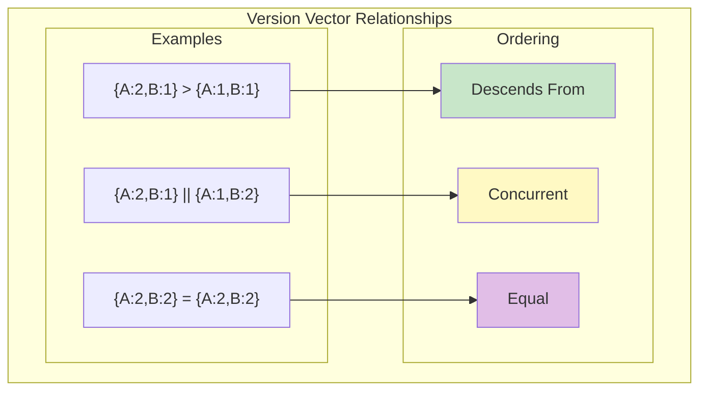
```mermaid
graph TB
    subgraph "Version Vector Relationships"
        subgraph "Ordering"
            DF[Descends From]
            CONC[Concurrent]
            EQ[Equal]
        end
        
        subgraph "Examples"
            EX1["{A:2,B:1} > {A:1,B:1}"]
            EX2["{A:2,B:1} || {A:1,B:2}"]
            EX3["{A:2,B:2} = {A:2,B:2}"]
            
            EX1 --> DF
            EX2 --> CONC
            EX3 --> EQ
        end
        
        style DF fill:#c8e6c9
        style CONC fill:#fff9c4
        style EQ fill:#e1bee7
    end
```

| Scenario | Vector State | Relationship | Action Required |
|----------|--------------|--------------|----------------|
| Sequential Updates | {A:2} → {A:3} | Descends from | Replace old value |
| Concurrent Updates | {A:2,B:1} vs {A:1,B:2} | Concurrent | Keep both values |
| Synchronized | {A:2,B:2} = {A:2,B:2} | Equal | Same value |
| Partial Knowledge | {A:2} vs {A:2,B:1} | Ancestor | Update to newer |

## Key Takeaways

1. **Truth is expensive** - Consensus requires multiple round trips

2. **Different truths for different needs** - Strong, eventual, causal consistency

3. **Time is fundamental** - Can't order events without time

4. **Byzantine failures change everything** - 3f+1 nodes needed for f failures

5. **Probabilistic consensus can be enough** - Bitcoin proves it

Remember: Perfect truth is impossible in distributed systems. Choose the level of truth your application actually needs.
