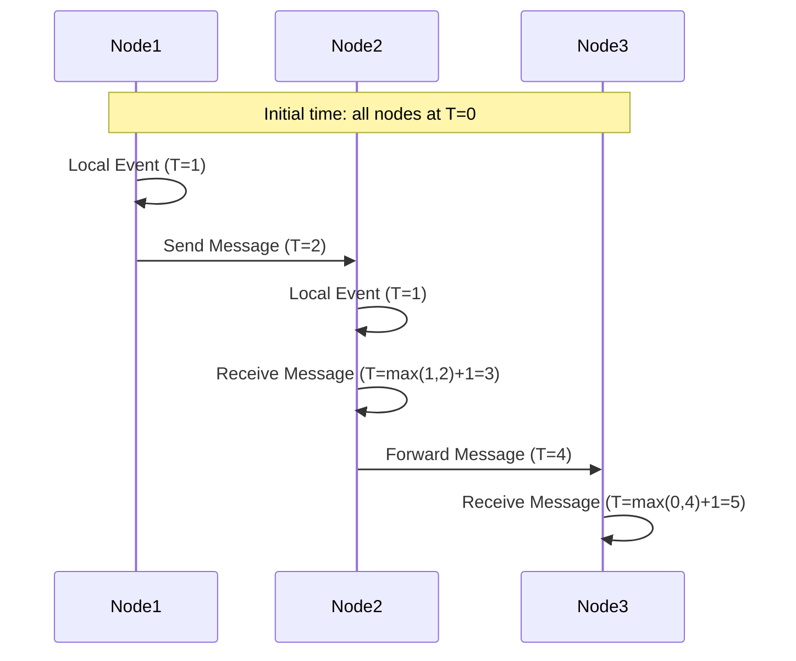
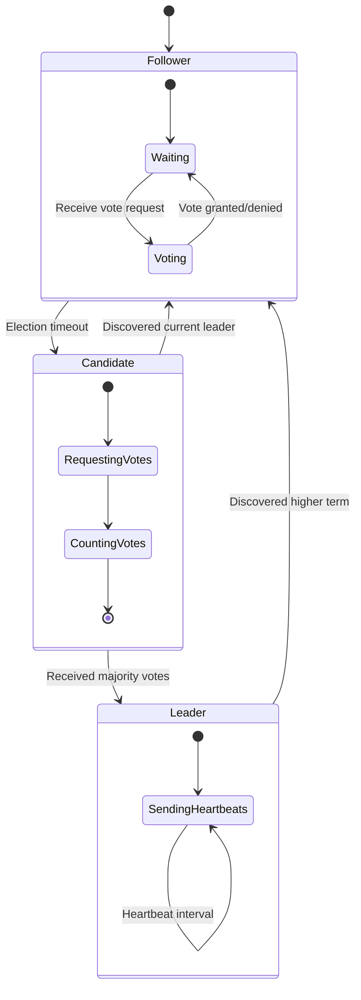
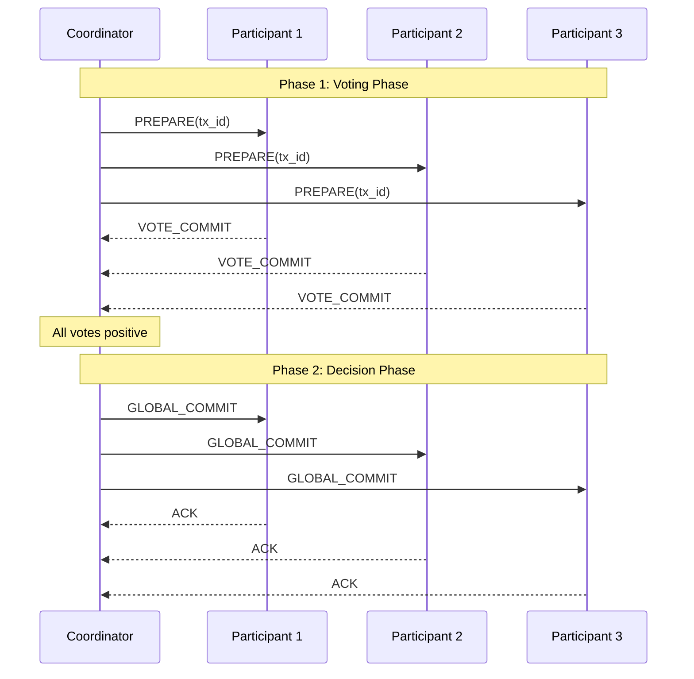
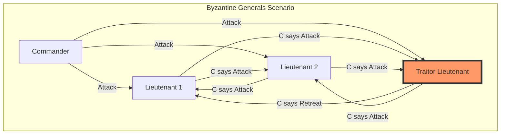
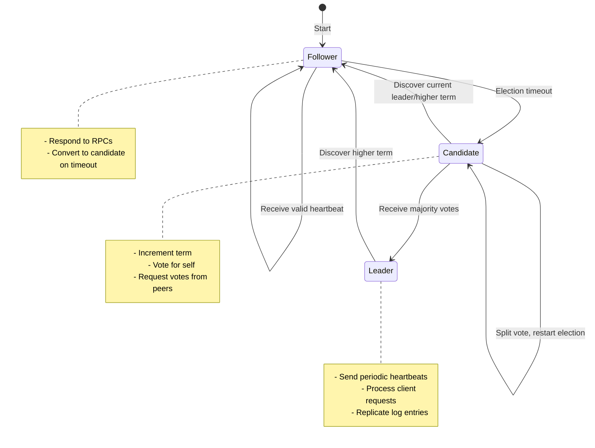
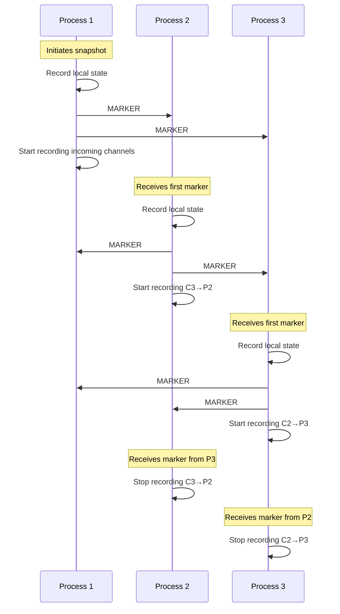
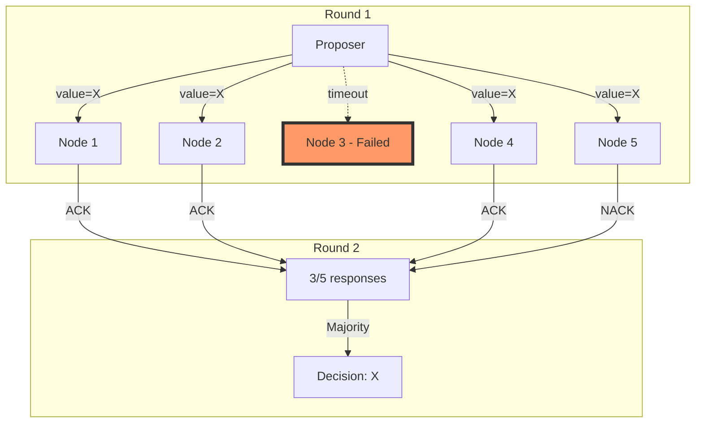

# Truth & Consensus Exercises

## Exercise 1: Design a Lamport Clock System

**Challenge**: Design a visual representation of logical time ordering across distributed nodes.

### Design Task

Create a sequence diagram showing how Lamport clocks maintain causality:



### Visual Design Requirements

1. **State Diagram**: Show clock advancement rules
2. **Timeline Visualization**: Display event ordering
3. **Causality Graph**: Map happens-before relationships

### Exercise Components

!!! info "Lamport Clock Rules"
    Design a flowchart showing:
    - Local event: clock++
    - Send event: clock++, attach timestamp
    - Receive event: clock = max(local, received) + 1
    **Key Insight**: Physical time doesn't matter, only causal ordering

### Design Deliverables

1. **Event Timeline Chart**
   - X-axis: Logical time (0, 1, 2, ...)
   - Y-axis: Nodes (Node1, Node2, Node3)
   - Arrows: Message passing with timestamps

2. **State Machine Diagram**
   ```
   [Idle] --Local Event--> [Processing] --Complete--> [Idle]
     |                                                   ^
     +--Receive Message--> [Updating Clock] ------------+
   ```

3. **Causality Verification Table**
   | Event | Node | Logical Time | Caused By |
   |-------|------|--------------|-----------|
   | Local | N1   | 1           | None      |
   | Send  | N1   | 2           | Event@1   |
   | Recv  | N2   | 3           | Event@2   |

### Validation Criteria

Your design must ensure:
- ✓ If A happens-before B, then Time(A) < Time(B)
- ✓ Concurrent events may have any time ordering
- ✓ No causality violations in the system

## Exercise 2: Design a Leader Election Protocol

**Challenge**: Design a visual representation of leader election algorithms for distributed systems.

### Design Task

Create visual models for leader election protocols:



### Protocol Design Options

!!! note "Election Algorithm Comparison"
    Design comparison charts for:
    1. **Bully Algorithm**
    - Nodes ordered by ID
    - Higher IDs have priority
    - Message complexity: O(n²)
    2. **Ring Algorithm**
    - Nodes in logical ring
    - Token passing election
    - Message complexity: O(n)
    3. **Raft Election**
    - Randomized timeouts
    - Term-based voting
    - Split-vote handling

### Visual Design Requirements

1. **Message Flow Diagram**
   ```
   Node1 --ELECTION--> Node2,Node3,Node4
   Node4 --OK--> Node1
   Node4 --COORDINATOR--> All Nodes
   ```

2. **Timeline Visualization**
   - Show election phases
   - Timeout triggers
   - Message exchanges
   - Leader announcement

3. **Failure Detection Flowchart**
   ```mermaid
   flowchart TD
       A[Monitor Heartbeats] --> B{Heartbeat Received?}
       B -->|Yes| C[Reset Timer]
       B -->|No| D{Timeout Exceeded?}
       D -->|Yes| E[Start Election]
       D -->|No| A
       C --> A
   ```

### Design Deliverables

1. **State Transition Table**
   | Current State | Event | Next State | Action |
   |--------------|-------|------------|---------|
   | Follower | Timeout | Candidate | Start election |
   | Candidate | Majority votes | Leader | Send coordinator |
   | Leader | Higher node found | Follower | Step down |

2. **Message Sequence Chart**
   - Election initiation
   - Vote collection
   - Leader announcement
   - Heartbeat maintenance

3. **Fault Tolerance Matrix**
   | Nodes | Max Failures | Consensus Required |
   |-------|--------------|-------------------|
   | 3 | 1 | 2 nodes |
   | 5 | 2 | 3 nodes |
   | 7 | 3 | 4 nodes |

### Validation Criteria

Your design must ensure:
- ✓ At most one leader per term
- ✓ Leader failure detected within timeout
- ✓ No split-brain scenarios

## Exercise 3: Design a Two-Phase Commit Protocol

**Challenge**: Design visual representations of the 2PC distributed transaction protocol.

### Design Task

Create comprehensive diagrams for the Two-Phase Commit protocol:



### Protocol State Machines

!!! info "2PC State Transitions"
    Design state machines for both coordinator and participants:
    **Coordinator States:**
    - INIT → WAITING (send prepare)
    - WAITING → COMMIT (all vote yes)
    - WAITING → ABORT (any vote no/timeout)
    - COMMIT → END (all acknowledged)
    - ABORT → END (all acknowledged)
    **Participant States:**
    - INIT → READY (receive prepare, vote yes)
    - INIT → ABORT (receive prepare, vote no)
    - READY → COMMIT (receive global commit)
    - READY → ABORT (receive global abort)

### Visual Design Requirements

1. **Decision Flow Diagram**
   ```mermaid
   flowchart TD
       A[Begin Transaction] --> B[Send PREPARE to all]
       B --> C{All votes YES?}
       C -->|Yes| D[Write COMMIT to log]
       C -->|No| E[Write ABORT to log]
       D --> F[Send GLOBAL_COMMIT]
       E --> G[Send GLOBAL_ABORT]
       F --> H[Transaction Complete]
       G --> H
   ```

2. **Failure Scenarios Matrix**
   | Failure Point | Coordinator Action | Participant Action |
   |--------------|-------------------|-------------------|
   | Before PREPARE | Abort transaction | No action needed |
   | During voting | Timeout → Abort | Vote NO on timeout |
   | After PREPARED | Must complete | Wait for decision |
   | During COMMIT | Retry until success | Apply when received |

3. **Message Log Visualization**
   ```
   Time | Coordinator Log | Participant Logs
   -----|----------------|------------------
   T1   | BEGIN tx_123   | 
   T2   | PREPARE sent   | P1: PREPARE received
   T3   |                | P2: PREPARE received
   T4   | VOTE: P1=YES   | P1: Voted YES
   T5   | VOTE: P2=YES   | P2: Voted YES
   T6   | DECISION: COMMIT| 
   T7   | COMMIT sent    | P1: COMMIT received
   T8   |                | P2: COMMIT received
   ```

### Design Deliverables

1. **Recovery Protocol Flowchart**
   - Coordinator recovery from log
   - Participant recovery strategies
   - Handling in-doubt transactions

2. **Blocking Scenarios Analysis**
   ```mermaid
   graph TD
       A[Participant in READY state] --> B{Coordinator failed?}
       B -->|Yes| C[BLOCKED: Wait for recovery]
       B -->|No| D[Wait for decision]
       C --> E[Termination Protocol]
       E --> F[Query other participants]
       F --> G{Any received COMMIT?}
       G -->|Yes| H[Commit]
       G -->|No| I[Continue waiting]
   ```

3. **Performance Characteristics**
   - Message rounds: 2 (prepare + commit)
   - Message complexity: 3n messages
   - Blocking duration analysis
   - Log write requirements

### Validation Criteria

Your design must ensure:
- ✓ Atomicity: All commit or all abort
- ✓ Durability: Decisions survive crashes
- ✓ Consistency: No conflicting decisions
- ✓ Clear blocking conditions identified

## Exercise 4: Design Byzantine Fault Tolerance

**Challenge**: Design visual solutions for the Byzantine Generals Problem with faulty nodes.

### Design Task

Create visual representations of Byzantine consensus:



### Byzantine Agreement Protocol

!!! note "Byzantine Fault Tolerance Rules"
    Design visual representations for:
    1. **3f+1 Rule**
    - Need 3f+1 nodes to tolerate f Byzantine faults
    - Visual proof of why 3f nodes are insufficient
    2. **Message Rounds**
    - f+1 rounds of message exchange
    - Exponential message growth visualization
    3. **Decision Making**
    - Majority voting after all rounds
    - Handling conflicting messages

### Visual Design Requirements

1. **Trust Relationship Diagram**
   ```mermaid
   graph LR
       subgraph "4 Nodes, 1 Byzantine"
           N1((N1)) -.->|?| B((B))
           N2((N2)) -.->|?| B
           N3((N3)) -.->|?| B
           N1 <-->|Trust| N2
           N2 <-->|Trust| N3
           N1 <-->|Trust| N3
       end
       
       style B fill:#f96,stroke:#333,stroke-width:4px
   ```

2. **Message Exchange Rounds**
   - Round 0: Commander sends orders
   - Round 1: Lieutenants exchange what commander said
   - Round 2: Exchange what others said in Round 1
   - Decision: Take majority value

3. **Fault Tolerance Table**
   | Total Nodes | Max Byzantine | Honest Majority |
   |------------|---------------|-----------------|
   | 4 | 1 | 3 nodes |
   | 7 | 2 | 5 nodes |
   | 10 | 3 | 7 nodes |
   | 3f+1 | f | 2f+1 nodes |

### Design Deliverables

1. **Attack Scenario Flowchart**
   ```mermaid
   flowchart TD
       A[Commander: ATTACK] --> B[Lieutenant 1]
       A --> C[Lieutenant 2]
       A --> D[Traitor Lieutenant]
       
       B --> E[L1: Records ATTACK]
       C --> F[L2: Records ATTACK]
       D --> G[Traitor: May lie]
       
       E --> H[L1 tells others: Commander said ATTACK]
       F --> I[L2 tells others: Commander said ATTACK]
       G --> J[Traitor tells L1: Commander said RETREAT]
       G --> K[Traitor tells L2: Commander said ATTACK]
       
       H --> L[Decision Phase]
       I --> L
       J --> L
       K --> L
       
       L --> M{Majority Decision}
       M --> N[Both loyal lieutenants: ATTACK]
   ```

2. **Byzantine Quorum Visualization**
   - Show overlapping quorums
   - Prove at least one honest node in intersection
   - Visual proof of safety despite Byzantine nodes

3. **Practical Byzantine Fault Tolerant (PBFT) State Machine**
   ```mermaid
   stateDiagram-v2
       [*] --> PrePrepare: Client request
       PrePrepare --> Prepare: Broadcast pre-prepare
       Prepare --> Commit: 2f+1 prepare messages
       Commit --> Reply: 2f+1 commit messages
       Reply --> [*]: Client response
       
       state Prepare {
           [*] --> Collecting
           Collecting --> Verified: 2f+1 matching
       }
       
       state Commit {
           [*] --> Waiting
           Waiting --> Committed: 2f+1 agrees
       }
   ```

### Validation Criteria

Your design must ensure:
- ✓ Agreement: All honest nodes decide same value
- ✓ Validity: If all honest nodes start with v, decide v
- ✓ Termination: All honest nodes eventually decide
- ✓ Clear visualization of Byzantine behavior

## Exercise 5: Design Raft Consensus Protocol

**Challenge**: Design the visual representation of Raft's leader election and log replication.

### Design Task

Create comprehensive diagrams for the Raft consensus algorithm:



### Raft Protocol Components

!!! info "Raft Design Principles"
    Create visual representations for:
    1. **Leader Election**
    - Term-based voting
    - Randomized timeouts
    - Vote persistence
    2. **Log Replication**
    - Leader append-only
    - Consistency check
    - Commitment rules
    3. **Safety Properties**
    - Election Safety: One leader per term
    - Log Matching: Identical logs have same entries
    - Leader Completeness: Committed entries persist

### Visual Design Requirements

1. **Term Timeline Visualization**
   ```
   Term 1    |-----Leader A-----|
   Term 2              |--Election--|-----Leader B-----|
   Term 3                                    |--Election--Leader C--|
   
   Time  ────────────────────────────────────────────────────────►
   ```

2. **Vote Request Flow**
   ```mermaid
   sequenceDiagram
       participant C as Candidate
       participant F1 as Follower 1
       participant F2 as Follower 2
       participant F3 as Follower 3
       
       Note over C: Timeout, increment term
       C->>C: Vote for self
       
       par Request votes
           C->>F1: RequestVote(term=2, candidateId=C)
           and
           C->>F2: RequestVote(term=2, candidateId=C)
           and
           C->>F3: RequestVote(term=2, candidateId=C)
       end
       
       F1-->>C: Vote granted
       F2-->>C: Vote granted
       Note over C: Majority achieved (3/4)
       C->>C: Become Leader
       
       loop Heartbeats
           C->>F1: AppendEntries(heartbeat)
           C->>F2: AppendEntries(heartbeat)
           C->>F3: AppendEntries(heartbeat)
       end
   ```

3. **Log Replication Visualization**
   ```
   Leader:    [1:x] [2:y] [3:z] [4:w] [5:v] <- Latest
   Follower1: [1:x] [2:y] [3:z] [4:w] [5:v] <- Synchronized
   Follower2: [1:x] [2:y] [3:z] [4:?]       <- Behind
   Follower3: [1:x] [2:y]                   <- Further behind
   
   Commit Index: 4 (majority have entry 4)
   ```

### Design Deliverables

1. **Election Safety Proof**
   - Visual proof: At most one leader per term
   - Show how votes prevent multiple leaders
   - Demonstrate term number precedence

2. **Split Vote Resolution**
   ```mermaid
   graph TD
       A[3 Nodes: A, B, C] --> B[Simultaneous timeout]
       B --> C[A votes A, B votes B, C splits]
       C --> D[No majority - timeout]
       D --> E[Random timeout variation]
       E --> F[Node B times out first]
       F --> G[B becomes candidate]
       G --> H[B gets majority]
   ```

3. **Consistency Guarantees Table**
   | Property | Mechanism | Visual Indicator |
   |----------|-----------|------------------|
   | Election Safety | One vote per term | Vote tracking |
   | Log Matching | prevLogIndex/Term check | Entry comparison |
   | Leader Completeness | Only elect nodes with all committed entries | Log length check |
   | State Machine Safety | Apply entries in order | Commit index |

### Validation Criteria

Your design must ensure:
- ✓ Clear term progression visualization
- ✓ Majority requirement demonstration
- ✓ Log consistency mechanisms shown
- ✓ Failure recovery paths illustrated

## Exercise 6: Design Distributed Snapshot Algorithm

**Challenge**: Design visual representations of the Chandy-Lamport algorithm for consistent global snapshots.

### Design Task

Create visual models for capturing distributed system state:



### Snapshot Algorithm Components

!!! info "Chandy-Lamport Rules"
    Design visual representations for:
    1. **Marker Propagation**
    - Process records state before sending markers
    - Markers sent on all outgoing channels
    - Channel recording rules
    2. **State Recording**
    - Local state: Process variables at marker receipt
    - Channel state: Messages in transit
    - Consistency guarantee
    3. **Global State Assembly**
    - Combine all local states
    - Include recorded channel states
    - Result: Consistent cut

### Visual Design Requirements

1. **Consistent Cut Visualization**
   ```
   Time →
   P1: ──●───────MARKER──────────→
        ↑ Snapshot
   P2: ────────●──MARKER─────────→
              ↑ Snapshot
   P3: ──────────────●──MARKER───→
                    ↑ Snapshot
   
   ● = Local state recorded
   ─ = Normal messages
   MARKER = Snapshot markers
   ```

2. **Channel Recording State Machine**
   ```mermaid
   stateDiagram-v2
       [*] --> NotRecording
       NotRecording --> Recording: Receive first MARKER
       Recording --> Recording: Record incoming messages
       Recording --> NotRecording: Receive MARKER on channel
       
       state Recording {
           [*] --> Buffering
           Buffering --> Buffering: Store messages
       }
   ```

3. **In-Transit Message Capture**
   ```mermaid
   graph LR
       subgraph "Before Marker"
           A1[P1 State: $100] -->|Transfer $20| B1[P2 State: $50]
       end
       
       subgraph "During Snapshot"
           A2[P1 State: $80<br/>Recorded] -.->|$20 in transit| B2[P2 State: $50<br/>Recording channel]
       end
       
       subgraph "After Snapshot"
           A3[P1: $80] --> B3[P2: $70]
           C[Channel State: $20 captured]
       end
   ```

### Design Deliverables

1. **Snapshot Consistency Properties**
   | Property | Description | Visual Check |
   |----------|-------------|--------------|
   | Causality | No event after cut caused event before | Arrow directions |
   | Completeness | All process states included | Node coverage |
   | Channel closure | All in-transit messages captured | Edge states |

2. **Algorithm Flowchart**
   ```mermaid
   flowchart TD
       A[Process decides to snapshot] --> B[Record local state]
       B --> C[Send markers on all outgoing channels]
       C --> D[Start recording all incoming channels]
       
       E[Receive marker on channel C] --> F{First marker?}
       F -->|Yes| G[Record local state]
       F -->|No| H[Stop recording channel C]
       
       G --> I[Send markers on all outgoing channels]
       I --> J[Start recording other incoming channels]
       
       H --> K{All channels have markers?}
       K -->|Yes| L[Snapshot complete]
       K -->|No| D
   ```

3. **Use Case Examples**
   - Distributed debugging
   - Checkpoint/restart
   - Deadlock detection
   - Global property verification

### Validation Criteria

Your design must ensure:
- ✓ No causality violations in snapshot
- ✓ All in-transit messages captured
- ✓ Snapshot represents valid global state
- ✓ Algorithm terminates for all processes

## Exercise 7: Design Fault-Tolerant Consensus

**Challenge**: Design visual representations of consensus algorithms that handle node failures.

### Design Task

Create visual models for consensus under failures:



### Failure Handling Patterns

!!! note "Consensus Under Failures"
    Design visual models for:
    1. **Failure Detection**
    - Timeout mechanisms
    - Heartbeat monitoring
    - Suspected vs confirmed failures
    2. **Recovery Strategies**
    - View change protocols
    - Coordinator election
    - State reconstruction
    3. **Progress Guarantees**
    - Quorum requirements
    - Liveness conditions
    - Termination protocols

### Visual Design Requirements

1. **Failure Timeline Visualization**
   ```
   Node1: ████████████████████████████████████ (Active)
   Node2: ████████████░░░░░░░░░░░░░░░░░░░░░░░ (Failed at T1)
   Node3: ████████████████████████████████████ (Active)
   Node4: ████████████████████░░░░░░░░░░░░░░░ (Failed at T2)
   Node5: ████████████████████████████████████ (Active)
          
   Consensus possible: T0-T1 (5 nodes), T1-T2 (4 nodes), T2+ (3 nodes)
   Minimum required: 3 nodes (majority of 5)
   ```

2. **Paxos-Style Consensus Flow**
   ```mermaid
   sequenceDiagram
       participant P as Proposer
       participant A1 as Acceptor 1
       participant A2 as Acceptor 2
       participant A3 as Acceptor 3 (Fails)
       participant A4 as Acceptor 4
       participant A5 as Acceptor 5
       
       Note over P,A5: Phase 1: Prepare
       P->>A1: Prepare(n=1)
       P->>A2: Prepare(n=1)
       P->>A3: Prepare(n=1)
       P->>A4: Prepare(n=1)
       P->>A5: Prepare(n=1)
       
       A1-->>P: Promise(n=1)
       A2-->>P: Promise(n=1)
       Note over A3: Node fails
       A4-->>P: Promise(n=1)
       A5-->>P: Promise(n=1)
       
       Note over P: 4/5 promises (majority)
       
       Note over P,A5: Phase 2: Accept
       P->>A1: Accept(n=1, v=X)
       P->>A2: Accept(n=1, v=X)
       P->>A4: Accept(n=1, v=X)
       P->>A5: Accept(n=1, v=X)
       
       A1-->>P: Accepted(n=1, v=X)
       A2-->>P: Accepted(n=1, v=X)
       A4-->>P: Accepted(n=1, v=X)
       
       Note over P: 3/5 accepted (majority)
       P->>P: Consensus on X
   ```

3. **Quorum Intersection Proof**
   ```mermaid
   graph LR
       subgraph "Quorum 1 (Write)"
           W1((1))
           W2((2))
           W3((3))
       end
       
       subgraph "Quorum 2 (Read)"
           R3((3))
           R4((4))
           R5((5))
       end
       
       W3 -.-> R3
       
       style W3 fill:#9f9,stroke:#333,stroke-width:2px
       style R3 fill:#9f9,stroke:#333,stroke-width:2px
   ```

### Design Deliverables

1. **Failure Mode Analysis**
   | Failure Type | Detection Method | Recovery Action |
   |-------------|------------------|-----------------|
   | Crash | Timeout | Exclude from quorum |
   | Network partition | Split detection | Majority side continues |
   | Byzantine | Behavior analysis | Byzantine protocols |
   | Slow node | Performance monitoring | Adaptive timeouts |

2. **Consensus Properties Under Failures**
   ```mermaid
   flowchart TD
       A[Start Consensus] --> B{Enough nodes?}
       B -->|Yes >= n/2+1| C[Proceed with protocol]
       B -->|No < n/2+1| D[Cannot proceed]
       
       C --> E{Collect responses}
       E --> F{Majority achieved?}
       F -->|Yes| G[Consensus reached]
       F -->|No| H{Timeout?}
       
       H -->|No| E
       H -->|Yes| I[Increment round]
       I --> J{Too many rounds?}
       J -->|No| C
       J -->|Yes| K[Abort: Cannot reach consensus]
   ```

3. **FLP Impossibility Workarounds**
   - Randomization (random delays)
   - Failure detectors (eventually perfect)
   - Partial synchrony assumptions
   - Practical timeout mechanisms

### Validation Criteria

Your design must ensure:
- ✓ Safety maintained despite f failures
- ✓ Liveness with < n/2 failures
- ✓ Clear failure detection visualization
- ✓ Recovery procedures documented

## Thought Experiments

### 1. The CAP Trade-off
You're designing a global social media "like" counter.
- If you choose consistency, what happens during network partitions?
- If you choose availability, how wrong can the count get?
- Design a solution that gives "good enough" consistency.

### 2. The Time Problem
Without synchronized clocks, how do you order these events?
- User A posts at "2:00 PM" in New York
- User B comments at "2:01 PM" in Tokyo
- User C likes the post at "2:00:30 PM" in London
Design a system that preserves causality without global time.

### 3. The Trust Boundary
In a blockchain with 1000 nodes:
- How many Byzantine nodes can it tolerate?
- What if nodes collude?
- How does the consensus mechanism change with different trust assumptions?

## Research Questions

1. **Why is consensus impossible with asynchronous communication and one failure?** (FLP impossibility)

2. **How do real systems circumvent the FLP impossibility result?**

3. **What's the relationship between consensus and atomic broadcast?**

4. **When is eventual consistency sufficient for consensus?**

## Practical Scenarios

### Scenario 1: Payment Processing
Design a consensus mechanism for a payment system where:
- Multiple banks must agree on transaction order
- Some banks may be temporarily offline
- No transaction can be lost or duplicated

### Scenario 2: Distributed Lock Service
Build a lock service that:
- Survives node failures
- Prevents split-brain scenarios
- Provides fair ordering

### Scenario 3: Configuration Management
Create a configuration system where:
- All nodes eventually see the same config
- Config changes are atomic
- Rollback is possible

## Key Concepts to Master

1. **Safety vs Liveness**
   - Safety: Nothing bad happens
   - Liveness: Something good eventually happens

2. **Failure Detectors**
   - Perfect vs Eventually perfect
   - Strong vs Weak completeness

3. **Consensus Numbers**
   - What primitives can implement consensus?
   - Why are some problems harder than others?

## Reflection

After completing these exercises:

1. Why is distributed consensus considered one of the hardest problems in computer science?

2. What are the fundamental trade-offs between different consensus algorithms?

3. How do you choose the right consensus mechanism for your system?

4. What role does time play in achieving consensus?

Remember: Truth in distributed systems is not absolute—it's what the majority agrees on. Design your truth mechanisms to match your actual needs, not theoretical perfection.
