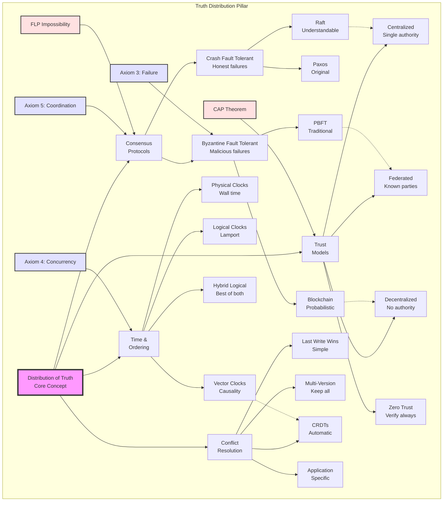

# Pillar 3: Distribution of Truth

<div class="pillar-header">
  <div class="learning-objective">
    <strong>Learning Objective</strong>: Master the art of achieving consensus without a single source of truth.
  </div>
</div>

---

## Level 1: Intuition (Start Here) 🌱

### The Library Card Catalog Metaphor

Imagine a library before computers:
- **Single Catalog**: One card drawer = one source of truth
- **Multiple Libraries**: How do they stay in sync?
- **Book Borrowed**: Update your catalog... but what about others?
- **Phone Lines Down**: Can't call other libraries
- **Librarian Sick**: Who updates the cards?

**This is distributed truth**: Multiple copies, no master, must agree somehow.

### Real-World Analogy: Group Chat Planning

```
Friend Group Planning Dinner:

Alice: "Let's meet at 7pm at Pizza Place"
Bob: "I thought we said 8pm?"
Carol: "Wait, I have 7:30pm at Burger Joint"
Dave: [Phone died, missed everything]

What's the truth?
- No single authority
- Messages arrive out of order  
- Some people offline
- Must reach agreement somehow

Solution: Consensus!
"Everyone reply with thumbs up to: 7:30pm Pizza Place"
✅ ✅ ✅ [Dave still offline]
3/4 majority = That's our truth
```

### Your First Truth Experiment

<div class="experiment-box">
<h4>🧪 The Telephone Game Distributed</h4>

Play this with friends:

**Round 1: Linear Truth** (Traditional telephone game)
- A whispers to B, B to C, C to D
- Message degrades linearly
- Final message usually wrong

**Round 2: Distributed Truth**
- Everyone starts with same message
- Randomly exchange with 2 others
- Compare what you heard
- Vote on correct version

**Result**: Distributed version more accurate!

Why? Multiple paths prevent single points of failure
</div>

### The Beginner's Truth Hierarchy

```
         💯 Absolute Truth
              (Impossible in distributed systems)
                    |
                    |
         🤝 Consensus Truth
              (Majority agrees)
                    |
                    |
         📝 Eventual Truth  
              (Will agree... someday)
                    |
                    |
         🏠 Local Truth
              (What I believe now)
```

---

## 📋 Questions This Pillar Answers

<div class="questions-box">

### Fundamental Questions
- **How can multiple nodes agree without a central authority?**
- **What happens when nodes have conflicting versions of truth?**
- **Why can't I have both consistency and availability?**
- **How do I know which timestamp to trust?**

### Design Questions
- **When should I use consensus vs eventual consistency?**
- **How many nodes need to agree for "truth"?**
- **Should I use vector clocks or hybrid logical clocks?**
- **How do I handle network partitions gracefully?**

### Operational Questions
- **How do I detect when nodes disagree?**
- **What do I do during a split-brain scenario?**
- **How do I reconcile conflicting updates?**
- **When can I safely ignore minority partitions?**

### Performance Questions
- **Why does consensus slow down with more nodes?**
- **How do I minimize consensus latency?**
- **What's the cost of stronger consistency?**
- **Can I have regional consistency with global eventual consistency?**

</div>

---

## Level 2: Foundation (Understand Why) 🌿

### Core Principle: Truth is Agreement

<div class="principle-box">
<h3>The Fundamental Truth Theorem</h3>

```
In distributed systems:
- There is no "true" time
- There is no "true" order  
- There is only what we agree on

Truth = Consensus + Time
```

**Example**: Stock Market
- NYSE says Apple traded at $150.00 at 10:00:00.000
- NASDAQ says Apple traded at $150.01 at 10:00:00.001
- Which is "true"? Both! Different systems, different truths
- Solution: Each exchange is source of truth for its trades
</div>

### The CAP Theorem Refresher

<div class="cap-truth">
<h3>🔺 Truth's Impossible Triangle</h3>

```
        Consistency
       (Same truth)
          /    \
         /      \
        /  Pick  \
       /   Two!   \
      /            \
Availability ── Partition Tolerance
(Always on)      (Network failures)

Examples:
- Bank: C+P (No availability during partition)
- Twitter: A+P (Different like counts OK)
- Traditional DB: C+A (No network failures!)
```
</div>

### The Hierarchy of Distributed Truth

```
Level 5: Global Total Order 💰💰💰💰💰
   └─ Most expensive (blockchain, atomic broadcast)
   └─ Every event has exact position
   └─ Use case: Financial ledgers
   
Level 4: Causal Order 💰💰💰💰
   └─ Preserves cause-and-effect (vector clocks)
   └─ If A caused B, A comes before B everywhere
   └─ Use case: Social media comments
   
Level 3: Consensus Truth 💰💰💰
   └─ Majority agreement (Raft, Paxos)
   └─ Majority decides the truth
   └─ Use case: Configuration management
   
Level 2: Eventual Truth 💰💰
   └─ Converges over time (CRDTs, gossip)
   └─ Truth emerges eventually
   └─ Use case: Shopping carts
   
Level 1: Local Truth 💰
   └─ What I believe right now
   └─ No coordination needed
   └─ Use case: Caching

Cost increases exponentially with each level
```

### 🎬 Failure Vignette: The Bitcoin Double-Spend Attack

<div class="failure-story">
<h3>When Truth Rewrites Itself</h3>

**Date**: March 2013
**Attack**: Mining pool achieves 51% hash power
**Loss**: 1000 BTC (~$50,000 at the time)

**The Attack Timeline**:
```
T+0:   Alice sends 1000 BTC to Exchange
T+10:  Transaction confirmed in block 500,001
T+20:  Exchange credits Alice's account
T+30:  Alice withdraws USD
T+40:  Mining pool releases secret chain
T+50:  Secret chain (length 6) overtakes public chain (length 5)
T+60:  Alice's transaction disappears from history

Result:
- Exchange loses 1000 BTC
- Alice keeps both BTC and USD
- "Truth" rewrote itself
- History changed after the fact
```

**What Happened**:
1. Attacker mined blocks in secret
2. Let exchange see "truth" (public chain)
3. After withdrawal, released longer chain
4. Longest chain = truth in Bitcoin
5. Transaction vanished from reality

**Lesson**: In distributed systems, truth is what the majority agrees on
**Fix**: Exchanges now wait for 6+ confirmations
</div>

### The FLP Impossibility Result

<div class="impossibility-box">
<h3>🚫 The Fundamental Limit</h3>

Fischer-Lynch-Paterson (1985) proved:

**"In an asynchronous distributed system, no algorithm can guarantee consensus if even one node might fail."**

Translation:
- Can't distinguish slow from dead
- Can't wait forever (availability)
- Can't decide without waiting (safety)
- Pick your poison!

All real algorithms "cheat":
- **Timeout assumptions** (Paxos/Raft): "If no response in 5s, assume dead"
- **Randomization** (Blockchain): "Eventually someone gets lucky"
- **Oracles** (Hyperledger): "Special nodes decide"
</div>

---

## Level 3: Deep Dive (Master the Patterns) 🌳

### Consensus Algorithms: The Truth Makers

<div class="consensus-comparison">
<h3>⚖️ The Consensus Algorithm Menu</h3>

| Algorithm | Speed | Fault Tolerance | Complexity | Use Case |
|-----------|-------|-----------------|------------|----------|
| **2PC** | Fast | No tolerance | Simple | Databases |
| **Paxos** | Medium | f < n/2 | Complex | Chubby/Spanner |
| **Raft** | Medium | f < n/2 | Moderate | etcd/Consul |
| **PBFT** | Slow | f < n/3 Byzantine | Very Complex | Blockchains |
| **Tendermint** | Slow | f < n/3 Byzantine | Complex | Cosmos |
| **Avalanche** | Fast | Probabilistic | Moderate | AVAX |
</div>

### Concept Map: Distribution of Truth



This concept map shows how distributed truth branches into consensus mechanisms, time ordering, conflict resolution, and trust models. Each is constrained by fundamental theorems and axioms.

### Understanding Raft: The Understandable Consensus

<div class="raft-explanation">
<h3>🗳️ Raft: Democracy for Computers</h3>

**The Analogy**: Electing a class president
1. **Election**: Someone volunteers to lead
2. **Campaign**: Asks others to vote for them
3. **Victory**: Gets majority of votes
4. **Leadership**: Makes decisions for the group
5. **Term Limits**: New election if leader fails

**The Algorithm**:
```
Three States:
- Follower: "I follow the leader"
- Candidate: "I want to be leader"  
- Leader: "I am the leader"

Election Process:
1. Follower times out → Becomes candidate
2. Candidate requests votes
3. Majority votes → Becomes leader
4. Leader sends heartbeats
5. No heartbeat → New election
```

**Key Insight**: Only one leader per term = No conflicts!
</div>

### The Vector Clock Pattern

<div class="vector-clock-visual">
<h3>🕐 Tracking Causality Without Wall Clocks</h3>

```
Scenario: Three friends texting

Alice [1,0,0]: "Let's get pizza"
      ↓
Bob [1,1,0]: "Sounds good" (saw Alice's message)
      ↓
Carol [1,1,1]: "I'm vegetarian" (saw both messages)

Meanwhile...
Alice [2,0,0]: "Or maybe burgers?"

Vector clocks tell us:
- Carol's message causally follows Bob's
- Alice's second message is concurrent with others
- We can order causally related events
- We can detect concurrent events
```

**Implementation Pattern**:
```
VectorClock Structure:
1. Each node maintains array of counters
2. Increment own counter on local event
3. On receive: take max of each position
4. Then increment own counter
5. Compare clocks to determine ordering
```
</div>

### CRDTs: Conflict-Free Truth

<div class="crdt-explanation">
<h3>🔄 Data Structures That Can't Conflict</h3>

**The Magic**: Merge any way, any order, same result!

```
Example: Collaborative Shopping Cart

Alice's Phone:          Bob's Tablet:
Add Milk ────┐          Add Eggs
Add Bread    │          Add Butter
             ↓
          Network Partition
             ↓
Remove Milk  │          Add Cheese
             │          Add Milk (didn't see removal)
             ↓
          Networks Reconnect
             ↓
          Merge States
             ↓
Final Cart: [Bread, Eggs, Butter, Cheese, Milk]

Why? Add-Remove CRDT rules:
- Add wins over Remove for concurrent ops
- Each item has unique ID + timestamp
- Deterministic merge function
```

**Common CRDT Types**:
| Type | Use Case | Merge Rule |
|------|----------|------------|
| **G-Counter** | View counts | Take maximum |
| **PN-Counter** | Like/unlike | Sum all operations |
| **G-Set** | Growing sets | Union all items |
| **OR-Set** | Add/remove items | Track add/remove pairs |
| **LWW-Register** | Last write wins | Latest timestamp |
</div>

### The Gossip Pattern

<div class="gossip-pattern">
<h3>💬 Eventual Truth Through Rumor Mill</h3>

**How Gossip Spreads Truth**:
```
Round 1: Alice knows secret
  Alice → Bob
  [A*] [B*] [C] [D] [E] [F] [G] [H]

Round 2: Alice & Bob tell 2 random peers each
  Alice → Carol, Dave
  Bob → Eve, Frank
  [A*] [B*] [C*] [D*] [E*] [F*] [G] [H]

Round 3: Six people gossip
  Everyone tells 2 random peers
  [A*] [B*] [C*] [D*] [E*] [F*] [G*] [H*]

Everyone knows in O(log N) rounds!
```

**Real-World Uses**:
- Cassandra: Node status
- Bitcoin: Transaction propagation  
- Consul: Service discovery
- S3: Metadata synchronization

**Implementation Pattern**:
```
GossipNode:
1. Pick k random peers (typically 2-3)
2. Exchange state with each peer
3. Merge received states
4. Use timestamps for conflict resolution
5. Repeat every gossip interval
```
</div>

---

## Level 4: Expert (Production Patterns) 🌲

### Case Study: Kubernetes Etcd Consensus

<div class="case-study">
<h3>🌐 How Kubernetes Maintains Truth</h3>

**Challenge**: Manage cluster state for 5000 nodes

**Architecture**:
```
┌─────────────────────────────────────────┐
│           Kubernetes Cluster            │
├─────────────────────────────────────────┤
│                                         │
│  API Server   API Server   API Server   │
│      ↓             ↓           ↓        │
│  ┌─────────────────────────────────┐   │
│  │         etcd cluster            │   │
│  │   ┌────┐   ┌────┐   ┌────┐    │   │
│  │   │etcd│←→│etcd│←→│etcd│     │   │
│  │   │ L  │   │ F  │   │ F  │    │   │
│  │   └────┘   └────┘   └────┘    │   │
│  │     Raft Consensus (Leader)     │   │
│  └─────────────────────────────────┘   │
│                                         │
│  Nodes read from any etcd instance     │
│  Writes go through leader only         │
└─────────────────────────────────────────┘
```

**Key Decisions**:
1. **Raft over Paxos**: Understandability crucial
2. **Odd number of nodes**: 3, 5, or 7 (never 4!)
3. **Leader lease**: 15 seconds (balances stability/recovery)
4. **Snapshot frequency**: Every 10K writes
5. **Client consistency**: Linear reads via ReadIndex

**Production Lessons**:
- 3 nodes: Survives 1 failure (most common)
- 5 nodes: Survives 2 failures (large clusters)
- 7 nodes: Overkill (cross-continent only)
- Network latency matters more than node count
- Backup strategy critical (etcd snapshots)
</div>

### 🎯 Decision Framework: Choosing Your Truth

<div class="decision-framework">
<h3>🎯 Production Truth Decision Tree</h3>

```
1. What's your threat model?
├─ Just crashes? → Use Raft (simple, fast)
│   Examples: etcd, Consul, Kafka (KRaft)
├─ Byzantine nodes? → Use PBFT (complex, slow)
│   Examples: Hyperledger, Tendermint
├─ Network partitions? → Use eventual consistency
│   Examples: Cassandra, DynamoDB
└─ Global scale? → Use blockchain consensus
    Examples: Bitcoin, Ethereum

2. What's your consistency need?
├─ Strong consistency? → Raft/Paxos
│   Use when: Financial transactions
├─ Causal consistency? → Vector clocks
│   Use when: Social media feeds
├─ Eventual consistency? → CRDTs
│   Use when: Shopping carts
└─ Probabilistic? → Gossip protocols
    Use when: Membership/monitoring

3. What's your performance requirement?
├─ <10ms latency? → Single leader + followers
├─ High throughput? → Sharded consensus
├─ Geo-distributed? → Regional consensus
└─ 99.999% uptime? → Multi-Paxos

4. What's your scale?
├─ <10 nodes? → Simple primary-backup
├─ 10-100 nodes? → Raft/etcd
├─ 100-1000 nodes? → Cassandra/DynamoDB
└─ >1000 nodes? → Blockchain/DHT
```
</div>

### Advanced Patterns: Multi-Region Consensus

<div class="multi-region-pattern">
<h3>🌍 Truth Across Continents</h3>

**Challenge**: Consensus with 100ms+ latencies

**Pattern 1: Regional Leaders**
```
┌─────────────────────────────────────────┐
│          Global Consensus Layer         │
│     (Slow, critical decisions only)     │
└────────────┬───────────┬────────────────┘
             │           │
    ┌────────▼──┐   ┌────▼────────┐
    │ US Region │   │ EU Region   │
    │  Leader   │   │  Leader     │
    │           │   │             │
    │ Fast local│   │ Fast local  │
    │ consensus │   │ consensus   │
    └───────────┘   └─────────────┘
```

**Pattern 2: Flexible Paxos**
```
Traditional: Need majority of ALL nodes
Flexible: Need majority of EACH region

Example with 3 regions (US, EU, Asia):
- Traditional: 5/9 nodes (slow)
- Flexible: 2/3 US + 2/3 EU + 2/3 Asia
- Benefit: Survives entire region failure
```

**Pattern 3: Speculative Execution**
```
# Execute assuming consensus will succeed
result = execute_transaction()

# Check consensus in parallel
if await consensus.agree(transaction):
    commit(result)
else:
    rollback(result)
    
# Wins when consensus usually succeeds
```
</div>

### Production Anti-Patterns

<div class="antipattern-box">
<h3>⚠️ Truth Mistakes That Hurt</h3>

**1. The Perfect Clock Fallacy**
```
WRONG: Trusting NTP
- Assumes synchronized clocks
- NTP can drift or jump
- Network delays vary

RIGHT: Use logical ordering
- Vector clocks for causality
- Lamport timestamps for order
- Hybrid logical clocks for both
```

**2. The Unanimous Consensus**
```
WRONG: Requiring all nodes
- One dead node = system halt
- Gets worse with scale
- Violates availability

RIGHT: Majority consensus  
- Survives f failures with 2f+1 nodes
- Maintains liveness
- Standard practice
```

**3. The Split-Brain Nightmare**
```
WRONG: Multiple leaders during partition
┌────────┐         ┌────────┐
│Leader A│ PARTITION │Leader B│
│Writes: │    X    │Writes: │
│ X=1    │         │ X=2    │
└────────┘         └────────┘

RIGHT: Majority prevents split-brain
Minority partition can't elect leader
```
</div>

---

## Level 5: Mastery (Push the Boundaries) 🌴

### The Future: Quantum Consensus

<div class="future-consensus">
<h3>🚀 Beyond Classical Truth</h3>

**Current Limitations**:
- Speed of light limits consensus speed
- FLP theorem limits guarantees
- Network partitions inevitable

**Quantum Future**:
```
Quantum Entanglement Consensus:
- Instant state correlation
- No network delays
- Perfect synchronization
- BUT: Decoherence issues

Quantum Byzantine Agreement:
- Detect lying via quantum states
- Unconditional security
- No computational assumptions
- BUT: Requires quantum channels
```

**Hybrid Classical-Quantum**:
```
QuantumConsensus Design:
1. Create entangled quantum states
2. Distribute to consensus nodes
3. Use quantum voting protocol
4. Fall back to classical on decoherence
5. Achieve speed when quantum works
6. Maintain safety with classical backup
```
</div>

### Blockchain Evolution: Consensus at Scale

<div class="blockchain-evolution">
<h3>⛓️ From Proof-of-Work to Tomorrow</h3>

**Generation 1: Proof of Work (Bitcoin)**
```
CPU Power = Voting Power
- Extremely secure
- Extremely wasteful
- ~7 transactions/second
- 10 minute finality
```

**Generation 2: Proof of Stake (Ethereum 2.0)**
```
Money = Voting Power  
- 100,000x more efficient
- ~100,000 transactions/second
- 12 second finality
- Rich get richer problem
```

**Generation 3: Novel Mechanisms**
```
Proof of History (Solana):
- Cryptographic timestamp
- Order before consensus
- 65,000 TPS

Avalanche Consensus:
- Repeated random sampling
- Metastable equilibrium  
- Sub-second finality

Proof of Space-Time (Chia):
- Hard drive space + time
- Eco-friendly mining
```

**Generation 4: The Future**
```
AI-Guided Consensus:
- Predict optimal validators
- Adaptive protocols
- Self-healing networks

Zero-Knowledge Consensus:
- Prove consensus without revealing votes
- Perfect privacy
- Minimal communication
```
</div>

### The Philosophy of Distributed Truth

<div class="philosophy-box">
<h3>🤔 Deep Thoughts on Truth</h3>

**"Truth" in Different Systems**:

| System | Truth Definition | Example |
|--------|------------------|---------|  
| **Physics** | Observer-dependent | Relativity |
| **Democracy** | Majority rule | Elections |
| **Science** | Reproducible consensus | Peer review |
| **Markets** | Price discovery | Stock prices |
| **Distributed Systems** | Algorithm-dependent | Raft/Paxos |

**Key Insights**:
1. Truth is a social construct, even for computers
2. Perfect truth requires perfect information
3. Practical truth requires trade-offs
4. Different truths can coexist
5. Truth emerges from agreement

**The Ultimate Question**:
*"If a transaction happens in a distributed system and no node records it, did it really happen?"*
</div>

## Summary: Key Insights by Level

### 🌱 Beginner
1. **Truth = Agreement, not observation**
2. **No master copy in distributed systems**
3. **Majority vote is simplest consensus**

### 🌿 Intermediate  
1. **CAP theorem forces truth trade-offs**
2. **Higher consistency = Higher cost**
3. **FLP theorem: Perfect consensus impossible**

### 🌳 Advanced
1. **Raft > Paxos for understandability**
2. **CRDTs enable conflict-free truth**
3. **Vector clocks track causality**

### 🌲 Expert
1. **Multi-region needs hierarchical consensus**
2. **Speculative execution hides latency**
3. **Truth patterns depend on use case**

### 🌴 Master
1. **Quantum consensus breaks classical limits**
2. **Blockchain evolves beyond proof-of-work**
3. **Truth is algorithm-dependent construct**

## Quick Reference Card

<div class="reference-card">
<h3>📋 Truth Patterns Cheat Sheet</h3>

**Consensus Algorithm Selection**:
```
┌─────────────────────────────────┐
│ Need strong consistency?        │
│ ↓ YES              ↓ NO         │
│ Raft/Paxos         CRDTs        │
│                                 │
│ Byzantine faults?               │  
│ ↓ YES              ↓ NO         │
│ PBFT               Raft         │
│                                 │
│ Global scale?                   │
│ ↓ YES              ↓ NO         │
│ Blockchain         Etcd         │
└─────────────────────────────────┘
```

**Time Ordering Tools**:
```
- Physical clocks: Wall time (unreliable)
- Lamport clocks: Partial order
- Vector clocks: Causal order
- Hybrid clocks: Best of both
```

**Consistency Levels**:
```
Strong    > Sequential > Causal > Eventual
└─expensive                    cheap─┘
```

**Production Formulas**:
```
Nodes needed = 2f + 1 (crash faults)
Nodes needed = 3f + 1 (Byzantine faults)
Quorum size = ⌊n/2⌋ + 1
Write latency ≥ RTT to majority
```
</div>

---

**Next**: [Pillar 4: Control →](../control/)

*"In distributed systems, truth isn't discovered—it's negotiated."*