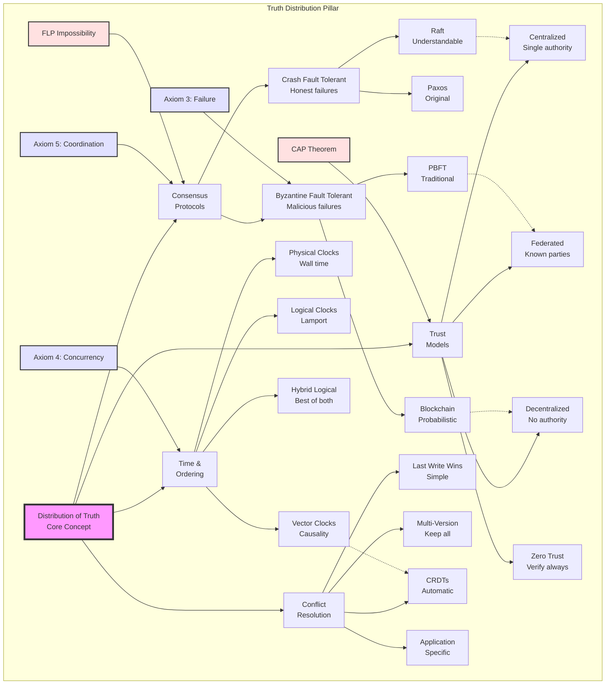
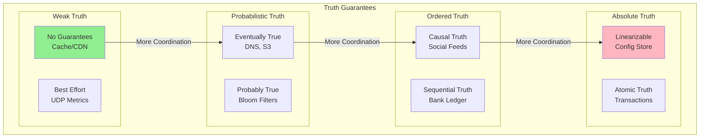
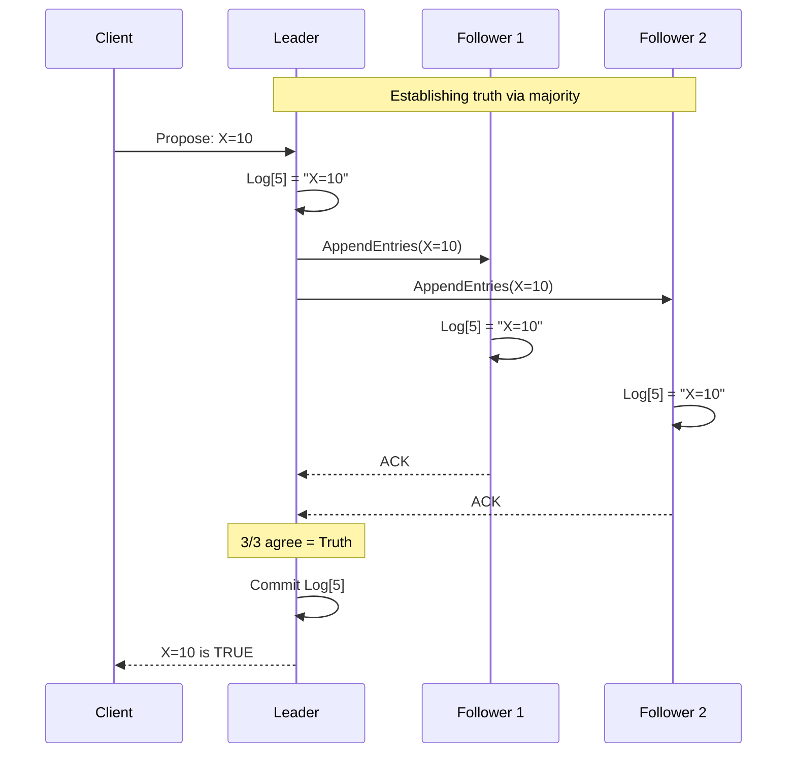
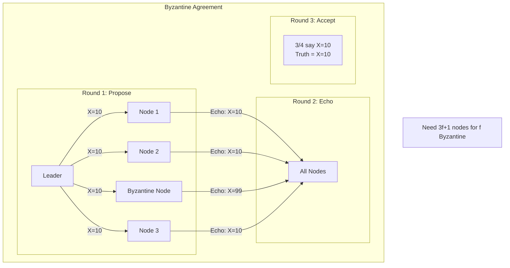
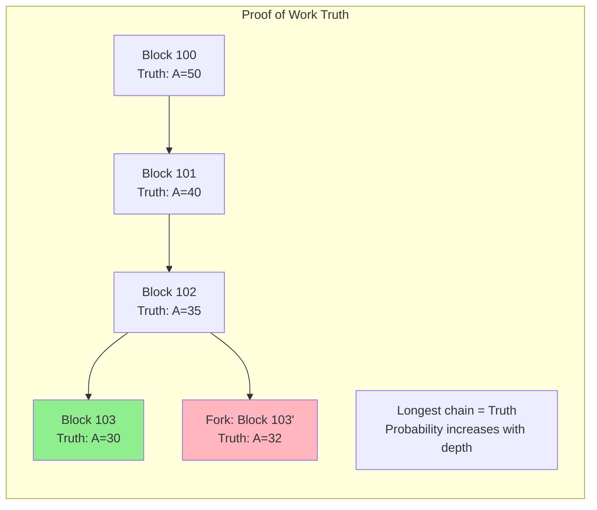
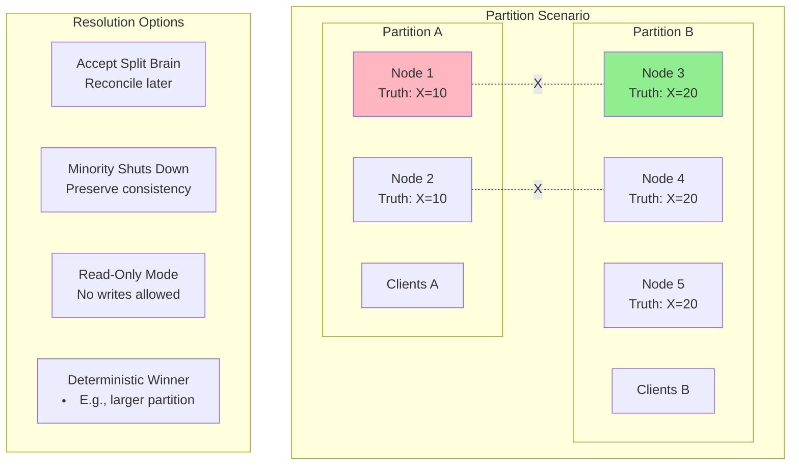
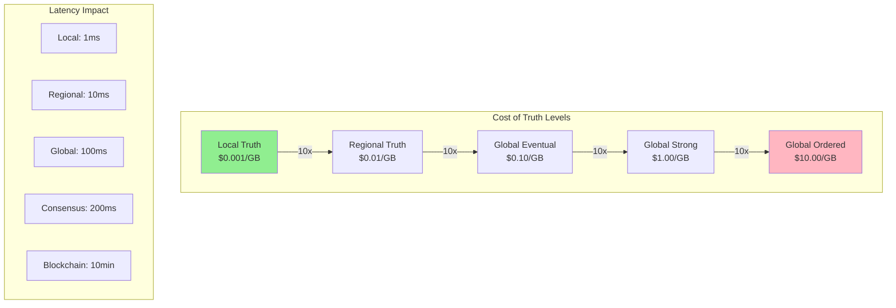
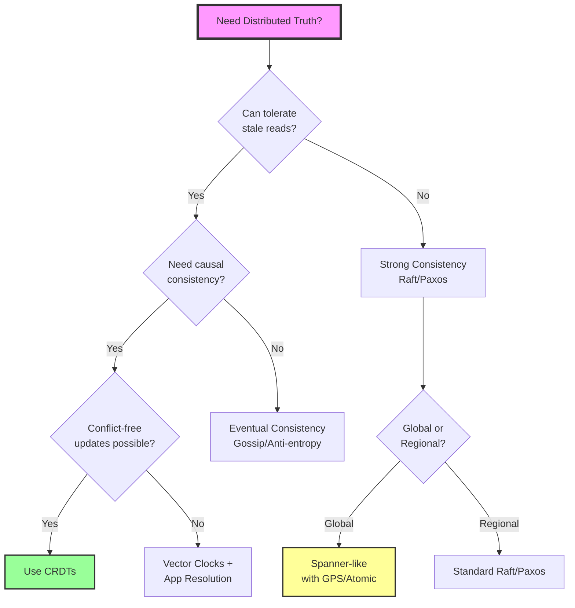

## Level 1: Intuition (Start Here) 🌱

### The Library Card Catalog Metaphor

Imagine a library before computers:
- **Single Catalog**: One card drawer = one source of truth
- **Multiple Libraries**: How do they stay in sync?
- **Book Borrowed**: Update your catalog... but what about others?
- **Phone Lines Down**: Can't call other libraries
- **Librarian Sick**: Who updates the cards?

**This is distributed truth**: Multiple copies, no master, must agree somehow.

### Real-World Analogy: Group Chat Planning

```yaml
Friend Group Planning Dinner:

Alice: "Let's meet at 7pm at Pizza Place"
Bob: "I thought we said 8pm?"
Carol: "Wait, I have 7:30pm at Burger Joint"
Dave: [Phone died, missed everything]

What's the truth?
- No single authority
- Messages arrive out of order
- Some people offline
- Must reach agreement somehow

Solution: Consensus!
"Everyone reply with thumbs up to: 7:30pm Pizza Place"
✅ ✅ ✅ [Dave still offline]
3/4 majority = That's our truth
```

### Your First Truth Experiment

### The Beginner's Truth Hierarchy

```text
         💯 Absolute Truth
              (Impossible in distributed systems)
                    |
                    |
         🤝 Consensus Truth
              (Majority agrees)
                    |
                    |
         📝 Eventual Truth
              (Will agree... someday)
                    |
                    |
         🏠 Local Truth
              (What I believe now)
```

---

## 📋 Questions This Pillar Answers

---

## Level 2: Foundation (Understand Why) 🌿

### Core Principle: Truth is Agreement

### The CAP Theorem Refresher

### The Hierarchy of Distributed Truth

```yaml
Level 5: Global Total Order 💰💰💰💰💰
   └─ Most expensive (blockchain, atomic broadcast)
   └─ Every event has exact position
   └─ Use case: Financial ledgers

Level 4: Causal Order 💰💰💰💰
   └─ Preserves cause-and-effect (vector clocks)
   └─ If A caused B, A comes before B everywhere
   └─ Use case: Social media comments

Level 3: Consensus Truth 💰💰💰
   └─ Majority agreement (Raft, Paxos)
   └─ Majority decides the truth
   └─ Use case: Configuration management

Level 2: Eventual Truth 💰💰
   └─ Converges over time (CRDTs, gossip)
   └─ Truth emerges eventually
   └─ Use case: Shopping carts

Level 1: Local Truth 💰
   └─ What I believe right now
   └─ No coordination needed
   └─ Use case: Caching

Cost increases exponentially with each level
```

### 🎬 Failure Vignette: The Bitcoin Double-Spend Attack

**Date**: March 2013 - The Fork Incident
**Impact**: 6-hour network split, $1.5M at risk

```yaml
The Timeline:
T+0:00 - Bitcoin v0.8 released with database change
T+1 week - Mix of v0.7 and v0.8 nodes on network
T+0:00 - Large block mined (>900KB)
T+0:01 - v0.8 nodes accept block
T+0:01 - v0.7 nodes reject block (BerkeleyDB lock limit)
T+0:02 - Network splits into two chains
T+0:10 - Some exchanges on v0.7, some on v0.8
T+0:30 - Double-spend becomes possible
T+6:00 - Developers coordinate miners to abandon v0.8 chain
T+6:30 - Network reconverges on v0.7 chain

The Problem:
- Two incompatible versions of "truth"
- Each valid according to its rules
- Economic incentives conflicted with technical solution

The Fix:
- Social consensus overrode technical consensus
- Miners voluntarily took losses
- Proved that Bitcoin consensus is sociotechnical
```

**Lesson**: Even "trustless" systems require human coordination when consensus breaks.

### The FLP Impossibility Result

**Fischer, Lynch, and Paterson (1985)** proved that in an asynchronous system with even one faulty process, consensus is impossible.

```python
class FLPImpossibility:
    """
    Demonstration of why perfect consensus is impossible
    in asynchronous distributed systems
    """
    
    def __init__(self):
        self.nodes = []
        self.messages_in_flight = []
    
    def simulate_consensus_attempt(self):
        """
        No matter what algorithm you use, there exists
        a message scheduling that prevents consensus
        """
        # Start with nodes in bivalent state
        # (could decide either 0 or 1)
        initial_state = "bivalent"
        
        # Adversarial scheduler can always find a path
        # that keeps at least one node undecided
        while True:
            # Find critical messages
            critical = self.find_critical_messages()
            
            # Delay critical messages indefinitely
            for msg in critical:
                self.delay_message(msg)
            
            # System never reaches consensus
            if self.all_nodes_decided():
                # This line is unreachable!
                break
    
    def find_critical_messages(self):
        """
        Find messages that would force decision
        """
        critical = []
        for msg in self.messages_in_flight:
            if self.would_force_decision(msg):
                critical.append(msg)
        return critical
```

**Practical Implications**:
1. **Timeouts are necessary** - Can't distinguish slow from dead
2. **Probabilistic consensus** - Bitcoin, eventual consistency
3. **Synchrony assumptions** - Paxos/Raft assume partial synchrony
4. **Human intervention** - Ultimate fallback for liveness

---

## Level 3: Deep Dive (Master the Patterns) 🌳

### Consensus Algorithms: The Truth Makers

### Concept Map: Distribution of Truth



This concept map shows how distributed truth branches into consensus mechanisms, time ordering, conflict resolution, and trust models. Each is constrained by fundamental theorems and axioms.

### Understanding Raft: The Understandable Consensus

Raft achieves consensus by electing a leader that manages replication.

```python
class RaftNode:
    """Simplified Raft consensus implementation"""
    
    def __init__(self, node_id, peers):
        self.node_id = node_id
        self.peers = peers
        
        # Persistent state
        self.current_term = 0
        self.voted_for = None
        self.log = []
        
        # Volatile state
        self.state = 'follower'  # follower, candidate, leader
        self.commit_index = 0
        
        # Leader state
        self.next_index = {}  # For each peer
        self.match_index = {}  # For each peer
        
        # Timing
        self.election_timeout = random.uniform(150, 300)  # ms
        self.last_heartbeat = time.time()
    
    def start_election(self):
        """Become candidate and request votes"""
        self.state = 'candidate'
        self.current_term += 1
        self.voted_for = self.node_id
        
        votes = 1  # Vote for self
        
        # Request votes from all peers
        for peer in self.peers:
            vote_request = {
                'term': self.current_term,
                'candidate_id': self.node_id,
                'last_log_index': len(self.log) - 1,
                'last_log_term': self.log[-1].term if self.log else 0
            }
            
            if peer.request_vote(vote_request):
                votes += 1
        
        # Become leader if majority
        if votes > len(self.peers) // 2:
            self.become_leader()
    
    def become_leader(self):
        """Transition to leader state"""
        self.state = 'leader'
        
        # Initialize leader state
        for peer in self.peers:
            self.next_index[peer] = len(self.log)
            self.match_index[peer] = 0
        
        # Send initial heartbeat
        self.send_heartbeat()
    
    def append_entries(self, entries):
        """Leader replicates entries to followers"""
        if self.state != 'leader':
            return False
        
        # Append to own log
        for entry in entries:
            entry.term = self.current_term
            self.log.append(entry)
        
        # Replicate to followers
        success_count = 1  # Count self
        
        for peer in self.peers:
            prev_log_index = self.next_index[peer] - 1
            prev_log_term = self.log[prev_log_index].term if prev_log_index >= 0 else 0
            
            success = peer.append_entries_rpc({
                'term': self.current_term,
                'leader_id': self.node_id,
                'prev_log_index': prev_log_index,
                'prev_log_term': prev_log_term,
                'entries': entries,
                'leader_commit': self.commit_index
            })
            
            if success:
                success_count += 1
                self.match_index[peer] = len(self.log) - 1
                self.next_index[peer] = len(self.log)
        
        # Commit if replicated to majority
        if success_count > len(self.peers) // 2:
            self.commit_index = len(self.log) - 1
            return True
        
        return False
```

**Key Properties**:
1. **Leader election** - One leader per term
2. **Log replication** - Leader → Followers
3. **Safety** - Committed entries never lost
4. **Liveness** - Progress with majority

### The Vector Clock Pattern

Vector clocks track causality in distributed systems without synchronized time.

```python
class VectorClock:
    """Track causal relationships between events"""
    
    def __init__(self, node_id, num_nodes):
        self.node_id = node_id
        self.clock = [0] * num_nodes
    
    def tick(self):
        """Increment own component for local event"""
        self.clock[self.node_id] += 1
        return self.clock.copy()
    
    def send(self):
        """Get timestamp for sending message"""
        self.tick()
        return self.clock.copy()
    
    def receive(self, other_clock):
        """Update clock on message receive"""
        # Take maximum of each component
        for i in range(len(self.clock)):
            self.clock[i] = max(self.clock[i], other_clock[i])
        
        # Increment own component
        self.tick()
        return self.clock.copy()
    
    def happens_before(self, other):
        """Check if this clock happens-before other"""
        # True if all components <= and at least one <
        all_leq = all(self.clock[i] <= other.clock[i] 
                      for i in range(len(self.clock)))
        any_less = any(self.clock[i] < other.clock[i] 
                       for i in range(len(self.clock)))
        return all_leq and any_less
    
    def concurrent_with(self, other):
        """Check if events are concurrent (no causal relation)"""
        return (not self.happens_before(other) and 
                not other.happens_before(self))

# Example usage
def demonstrate_vector_clocks():
    # Three nodes
    alice = VectorClock(0, 3)
    bob = VectorClock(1, 3)
    carol = VectorClock(2, 3)
    
    # Alice sends to Bob
    alice_time = alice.send()  # [1, 0, 0]
    bob.receive(alice_time)     # [1, 1, 0]
    
    # Bob sends to Carol
    bob_time = bob.send()       # [1, 2, 0]
    carol.receive(bob_time)     # [1, 2, 1]
    
    # Carol sends to Alice
    carol_time = carol.send()   # [1, 2, 2]
    alice.receive(carol_time)   # [2, 2, 2]
```

### CRDTs: Conflict-Free Truth

CRDTs (Conflict-Free Replicated Data Types) guarantee eventual consistency without coordination.

```python
class GCounter:
    """Grow-only counter CRDT"""
    
    def __init__(self, node_id, num_nodes):
        self.node_id = node_id
        self.counts = [0] * num_nodes
    
    def increment(self, amount=1):
        """Increment counter"""
        self.counts[self.node_id] += amount
    
    def value(self):
        """Get current value"""
        return sum(self.counts)
    
    def merge(self, other):
        """Merge with another GCounter"""
        for i in range(len(self.counts)):
            self.counts[i] = max(self.counts[i], other.counts[i])
    
    def __str__(self):
        return f"GCounter({self.value()}, {self.counts})"

class PNCounter:
    """Increment/decrement counter using two GCounters"""
    
    def __init__(self, node_id, num_nodes):
        self.p = GCounter(node_id, num_nodes)  # Positive
        self.n = GCounter(node_id, num_nodes)  # Negative
    
    def increment(self, amount=1):
        self.p.increment(amount)
    
    def decrement(self, amount=1):
        self.n.increment(amount)
    
    def value(self):
        return self.p.value() - self.n.value()
    
    def merge(self, other):
        self.p.merge(other.p)
        self.n.merge(other.n)

class ORSet:
    """Observed-Remove Set CRDT"""
    
    def __init__(self, node_id):
        self.node_id = node_id
        self.elements = {}  # element -> {(unique_id, timestamp)}
        self.counter = 0
    
    def add(self, element):
        """Add element to set"""
        unique_id = f"{self.node_id}:{self.counter}"
        self.counter += 1
        
        if element not in self.elements:
            self.elements[element] = set()
        
        self.elements[element].add((unique_id, time.time()))
    
    def remove(self, element):
        """Remove all instances of element"""
        if element in self.elements:
            self.elements[element].clear()
    
    def contains(self, element):
        """Check if element exists"""
        return element in self.elements and len(self.elements[element]) > 0
    
    def merge(self, other):
        """Merge with another ORSet"""
        for element, tags in other.elements.items():
            if element not in self.elements:
                self.elements[element] = set()
            self.elements[element].update(tags)
```

### The Gossip Pattern

Gossip protocols spread information epidemically through random peer selection.

```python
class GossipNode:
    """Epidemic broadcast for eventual consistency"""
    
    def __init__(self, node_id, peers):
        self.node_id = node_id
        self.peers = peers
        self.state = {}
        self.version_vector = {}
        
        # Gossip parameters
        self.fanout = 3  # Number of peers to gossip to
        self.interval = 1.0  # Seconds between gossip rounds
    
    def update(self, key, value):
        """Update local state"""
        version = self.version_vector.get(key, 0) + 1
        self.state[key] = {
            'value': value,
            'version': version,
            'timestamp': time.time(),
            'node': self.node_id
        }
        self.version_vector[key] = version
    
    def gossip_round(self):
        """Select random peers and exchange state"""
        # Select random subset of peers
        selected = random.sample(self.peers, 
                                min(self.fanout, len(self.peers)))
        
        for peer in selected:
            # Send our state
            peer.receive_gossip(self.node_id, self.state)
            
            # Pull their state
            their_state = peer.get_state()
            self.merge_state(their_state)
    
    def merge_state(self, other_state):
        """Merge received state with local state"""
        for key, other_entry in other_state.items():
            if key not in self.state:
                # New key
                self.state[key] = other_entry
                self.version_vector[key] = other_entry['version']
            else:
                # Existing key - keep newer version
                our_entry = self.state[key]
                
                if other_entry['version'] > our_entry['version']:
                    self.state[key] = other_entry
                    self.version_vector[key] = other_entry['version']
                elif (other_entry['version'] == our_entry['version'] and
                      other_entry['timestamp'] > our_entry['timestamp']):
                    # Same version, use timestamp as tiebreaker
                    self.state[key] = other_entry
    
    def get_convergence_time(self, num_nodes):
        """Estimate time to reach all nodes"""
        # O(log N) rounds with high probability
        rounds = math.ceil(math.log(num_nodes) / math.log(self.fanout))
        return rounds * self.interval
```

**Properties**:
1. **Eventual consistency** - All nodes converge
2. **Fault tolerance** - Handles node failures
3. **Scalability** - O(log N) convergence
4. **Simplicity** - No coordinator needed

---

## 🔄 Consistency as Distributed Truth

### The Consistency Spectrum as Truth Levels



### Truth Establishment Protocols

#### 1. Consensus-Based Truth (Raft/Paxos)


#### 2. Byzantine Truth (BFT Consensus)


#### 3. Probabilistic Truth (Blockchain)


### Truth Conflicts and Resolution

```mermaid
graph TB
    subgraph "Conflict Detection"
        V1[Version 1: X=10<br/>Time: 1000<br/>Node: A]
        V2[Version 2: X=20<br/>Time: 1000<br/>Node: B]
        CD[Conflict Detected!]
        V1 & V2 --> CD
    end
    
    subgraph "Resolution Strategies"
        LWW[Last Write Wins<br/>Use timestamp]
        MVR[Multi-Value Register<br/>Keep both]
        APC[Application Callback<br/>Custom logic]
        CRD[CRDT Merge<br/>Automatic]
    end
    
    CD --> LWW & MVR & APC & CRD
    
    subgraph "Results"
        R1[X=20<br/>(higher timestamp)]
        R2[X=[10,20]<br/>(conflict preserved)]
        R3[X=15<br/>(app merged)]
        R4[X=30<br/>(CRDT sum)]
    end
    
    LWW --> R1
    MVR --> R2
    APC --> R3
    CRD --> R4
```

### Truth Propagation Patterns

| Pattern | Truth Guarantee | Latency | Use Case |
|---------|----------------|---------|-----------||
| **Synchronous Replication** | Immediate truth | High (RTT x replicas) | Financial data |
| **Asynchronous Replication** | Eventual truth | Low (immediate return) | Analytics |
| **Quorum Replication** | Probabilistic truth | Medium (majority RTT) | User data |
| **Chain Replication** | Ordered truth | Variable (chain length) | Logs |
| **Gossip Protocol** | Convergent truth | Logarithmic | Membership |

### Truth Under Partition



### Practical Truth Verification

```yaml
Truth Verification Techniques:

  Merkle Trees:
    Purpose: Verify large dataset consistency
    Method: Hash tree comparison
    Example: Bitcoin, Cassandra anti-entropy
    
  Vector Clocks:
    Purpose: Track causal relationships
    Method: Per-node logical timestamps
    Example: Dynamo, Riak
    
  Checksums:
    Purpose: Detect corruption
    Method: Hash comparison
    Example: HDFS block verification
    
  Consensus Epochs:
    Purpose: Detect leadership changes
    Method: Monotonic epoch numbers
    Example: Raft term numbers
    
  Fencing Tokens:
    Purpose: Prevent split-brain writes
    Method: Monotonic tokens with storage check
    Example: HDFS lease tokens
```

### Truth Economics



---

## Level 4: Expert (Production Patterns) 🌲

### Case Study: Kubernetes Etcd Consensus

Kubernetes uses etcd (built on Raft) as its distributed truth source for all cluster state.

```yaml
Kubernetes + Etcd Architecture:
┌─────────────────┐     ┌─────────────────┐
│   API Server    │────▶│      etcd       │
│  (Stateless)    │     │   (Raft-based)  │
└─────────────────┘     └─────────────────┘
         │                       │
         ▼                       ▼
┌─────────────────┐     ┌─────────────────┐
│   Controller    │     │   etcd Node 1   │
│    Manager      │     │   etcd Node 2   │
│   Scheduler     │     │   etcd Node 3   │
└─────────────────┘     └─────────────────┘

Key Design Decisions:
- All state in etcd (single source of truth)
- API server is stateless gateway
- Controllers watch for changes
- Optimistic concurrency with resource versions
```

```python
class KubernetesResourceVersion:
    """How Kubernetes handles distributed updates"""
    
    def update_deployment(self, name, spec):
        # 1. Read current state with version
        current = etcd.get(f"/deployments/{name}")
        version = current.metadata.resourceVersion
        
        # 2. Modify locally
        current.spec = spec
        
        # 3. Write back with version check
        try:
            etcd.compare_and_swap(
                key=f"/deployments/{name}",
                value=current,
                expected_version=version
            )
        except VersionConflictError:
            # Someone else updated, retry
            return self.update_deployment(name, spec)
```

### 🎯 Decision Framework: Choosing Your Truth



### Advanced Patterns: Multi-Region Consensus

```python
class MultiRegionConsensus:
    """Hierarchical consensus for global systems"""
    
    def __init__(self):
        self.regions = {
            'us-east': RegionalCluster(['dc1', 'dc2', 'dc3']),
            'eu-west': RegionalCluster(['dc4', 'dc5', 'dc6']),
            'asia-pac': RegionalCluster(['dc7', 'dc8', 'dc9'])
        }
        self.global_coordinator = None
    
    def write(self, key, value, consistency_level):
        if consistency_level == 'local':
            # Write to local region only
            local_region = self.get_local_region()
            return local_region.write(key, value)
            
        elif consistency_level == 'regional':
            # Sync within region, async to others
            local_region = self.get_local_region()
            result = local_region.write_sync(key, value)
            
            # Async replication to other regions
            for region in self.regions.values():
                if region != local_region:
                    region.write_async(key, value)
            
            return result
            
        elif consistency_level == 'global':
            # Two-phase commit across regions
            transaction_id = uuid.uuid4()
            
            # Phase 1: Prepare
            prepared = []
            for region in self.regions.values():
                if region.prepare(transaction_id, key, value):
                    prepared.append(region)
                else:
                    # Abort
                    for r in prepared:
                        r.abort(transaction_id)
                    return False
            
            # Phase 2: Commit
            for region in self.regions.values():
                region.commit(transaction_id)
            
            return True
    
    def handle_region_failure(self, failed_region):
        """Degrade gracefully when region fails"""
        # Remove from active regions
        del self.regions[failed_region]
        
        # Elect new global coordinator if needed
        if self.global_coordinator.region == failed_region:
            self.elect_new_coordinator()
        
        # Continue with degraded quorum
        self.adjust_quorum_size()
```

### Production Anti-Patterns

```python
class ConsensusAntiPatterns:
    """What NOT to do in production"""
    
    def anti_pattern_1_consensus_everything(self):
        """❌ Don't use consensus for everything"""
        # Bad: Every read goes through Raft
        def get_user_preference(user_id):
            return raft_cluster.read(f"prefs:{user_id}")
        
        # Good: Use consensus for critical state only
        def get_user_preference_better(user_id):
            # Read from local cache
            cached = local_cache.get(f"prefs:{user_id}")
            if cached and cached.age < 60:  # 1 minute TTL
                return cached.value
            
            # Fallback to eventually consistent store
            return eventually_consistent_db.get(f"prefs:{user_id}")
    
    def anti_pattern_2_ignore_byzantines(self):
        """❌ Don't ignore Byzantine failures in adversarial environments"""
        # Bad: Trust all nodes
        def naive_consensus(votes):
            return max(votes.items(), key=lambda x: x[1])
        
        # Good: Use Byzantine fault tolerant consensus
        def byzantine_consensus(votes):
            # Need 3f+1 nodes to tolerate f Byzantine nodes
            total_nodes = len(votes)
            required = (2 * total_nodes // 3) + 1
            
            # Count votes
            vote_counts = {}
            for vote in votes.values():
                vote_counts[vote] = vote_counts.get(vote, 0) + 1
            
            # Check if any value has enough votes
            for value, count in vote_counts.items():
                if count >= required:
                    return value
            
            return None  # No consensus
    
    def anti_pattern_3_split_brain_amnesia(self):
        """❌ Don't forget state during split-brain recovery"""
        # Bad: Last writer wins
        def merge_after_split(partition_a, partition_b):
            return partition_b  # Lost all changes from A!
        
        # Good: Merge with conflict resolution
        def merge_after_split_better(partition_a, partition_b):
            merged = {}
            
            # Track all changes from both partitions
            all_keys = set(partition_a.keys()) | set(partition_b.keys())
            
            for key in all_keys:
                val_a = partition_a.get(key)
                val_b = partition_b.get(key)
                
                if val_a and val_b:
                    # Conflict - use vector clocks or app logic
                    merged[key] = resolve_conflict(val_a, val_b)
                else:
                    # No conflict
                    merged[key] = val_a or val_b
            
            return merged
```

**Common Production Mistakes**:
1. **Over-consensus** - Not everything needs strong consistency
2. **Under-replication** - Less than 5 nodes = risky
3. **Ignoring clock skew** - Timestamps aren't reliable
4. **No chaos testing** - First failure will be in production
5. **Complex resolution** - Simple conflicts need simple solutions

---

## Level 5: Mastery (Push the Boundaries) 🌴

### The Future: Quantum Consensus

Quantum computing introduces new possibilities and challenges for distributed consensus.

```python
class QuantumConsensus:
    """Theoretical quantum consensus mechanisms"""
    
    def quantum_byzantine_agreement(self):
        """
        Quantum Byzantine Agreement can achieve consensus
        with only 2f+1 nodes (vs 3f+1 classical)
        """
        # Quantum entanglement provides unforgeable tokens
        entangled_qubits = self.create_entangled_set()
        
        # Quantum key distribution prevents tampering
        quantum_keys = self.distribute_quantum_keys()
        
        # Superposition allows exploring multiple states
        consensus_state = self.quantum_superposition_vote()
        
        # Measurement collapses to agreed state
        return self.measure_consensus(consensus_state)
    
    def quantum_coin_flipping(self):
        """
        Distributed random number generation
        impossible to bias classically
        """
        # Each party contributes quantum state
        quantum_contributions = []
        for party in self.parties:
            qbit = party.prepare_random_qubit()
            quantum_contributions.append(qbit)
        
        # Entangle all contributions
        entangled = self.entangle_qubits(quantum_contributions)
        
        # Simultaneous measurement
        results = self.measure_all(entangled)
        
        # XOR results for unbiased randomness
        return reduce(lambda x, y: x ^ y, results)
```

### Blockchain Evolution: Consensus at Scale

```python
class NextGenBlockchain:
    """Evolution beyond proof-of-work"""
    
    def proof_of_stake_consensus(self):
        """Ethereum 2.0 style consensus"""
        validators = self.get_active_validators()
        
        # Weight by stake
        total_stake = sum(v.stake for v in validators)
        
        # Randomly select block proposer
        proposer = self.select_weighted_random(validators)
        
        # Propose block
        block = proposer.create_block()
        
        # Attestation (voting)
        attestations = []
        for validator in validators:
            if validator.validate_block(block):
                attestations.append(validator.sign(block))
        
        # Finality after 2/3 attestations
        attested_stake = sum(v.stake for v in attestations)
        if attested_stake > (2 * total_stake / 3):
            self.finalize_block(block)
    
    def sharded_consensus(self):
        """Shard chains for horizontal scaling"""
        # Divide validators into committees
        committees = self.create_committees(self.validators)
        
        # Each committee validates one shard
        shard_blocks = []
        for shard_id, committee in enumerate(committees):
            shard_block = self.run_shard_consensus(
                shard_id, committee
            )
            shard_blocks.append(shard_block)
        
        # Beacon chain aggregates shard blocks
        beacon_block = self.aggregate_shards(shard_blocks)
        
        # Cross-shard transactions via merkle proofs
        self.process_cross_shard_txs(beacon_block)
```

### The Philosophy of Distributed Truth

In distributed systems, truth is not discovered—it's negotiated. This fundamental shift from centralized thinking has profound implications.

```python
class DistributedTruthPhilosophy:
    """The nature of truth in distributed systems"""
    
    def truth_is_consensus(self):
        """
        Truth = What the majority agrees on
        Not what actually happened
        """
        # Bitcoin example: longest chain is truth
        # Even if shorter chain was "first"
        return "Consensus defines reality"
    
    def truth_is_eventual(self):
        """
        Truth emerges over time
        Not instantaneous
        """
        # CRDTs converge to truth
        # No coordination needed
        return "Time reveals truth"
    
    def truth_is_probabilistic(self):
        """
        Truth has confidence levels
        Not binary true/false
        """
        # Bitcoin: 6 confirmations = 99.9% final
        # But never 100%
        return "Truth has probabilities"
    
    def truth_is_economic(self):
        """
        Truth has a cost
        Higher consistency = Higher cost
        """
        # Spanner: Pay for global consistency
        # DynamoDB: Cheap eventual consistency
        return "Truth isn't free"
```

**The Paradoxes of Distributed Truth**:

1. **The Observer Paradox**: Observing the system changes it
   - Health checks affect performance
   - Monitoring creates load
   - Heisenbugs appear/disappear with debugging

2. **The Coordination Paradox**: To avoid coordination, we must coordinate
   - Agreeing to use CRDTs requires coordination
   - Choosing eventual consistency is a consensus decision
   - Standards emerge from agreement

3. **The Trust Paradox**: Trustless systems require trust
   - Bitcoin miners trust the protocol
   - Developers trust the implementation
   - Users trust the mathematics

4. **The Finality Paradox**: Nothing is truly final
   - Blockchains can fork
   - Committed transactions can rollback
   - "Final" is just "very probably won't change"

### Google Spanner: Engineering Around Physics

The ultimate example of distributed truth at scale.

```python
class SpannerTrueTime:
    """Google's solution to global consistency"""
    
    def __init__(self):
        # GPS and atomic clocks in each datacenter
        self.time_masters = []
        self.time_uncertainty = 7  # milliseconds average
    
    def now(self):
        """Return time interval, not point"""
        current_time = self.get_current_time()
        uncertainty = self.get_time_uncertainty()
        
        return TimeInterval(
            earliest=current_time - uncertainty,
            latest=current_time + uncertainty
        )
    
    def commit_wait(self, timestamp):
        """Wait out uncertainty before commit"""
        # Ensure timestamp is definitely in past
        while not self.now().earliest > timestamp:
            time.sleep(0.001)
        
        # Now safe to release locks
        # Guarantees external consistency
    
    def assign_timestamp(self):
        """Assign commit timestamp"""
        # Use latest possible time
        ts = self.now().latest
        
        # Ensure monotonic increase
        if ts <= self.last_timestamp:
            ts = self.last_timestamp + 1
        
        self.last_timestamp = ts
        return ts
```

**Spanner's Key Insights**:
1. **Expose uncertainty** - Don't pretend time is precise
2. **Wait out uncertainty** - 7ms average wait for consistency
3. **Hardware investment** - GPS + atomic clocks per DC
4. **Global scale** - Serves Google's entire infrastructure

**The Cost of Global Truth**:
- Hardware: $1M+ per datacenter for time infrastructure
- Latency: 7-14ms commit wait
- Complexity: Specialized hardware and operations
- Benefit: True global consistency at Google scale

## Summary: Key Insights by Level

### 🌱 Beginner
1. **Truth = Agreement, not observation**
2. **No master copy in distributed systems**
3. **Majority vote is simplest consensus**

### 🌿 Intermediate
1. **CAP theorem forces truth trade-offs**
2. **Higher consistency = Higher cost**
3. **FLP theorem: Perfect consensus impossible**

### 🌳 Advanced
1. **Raft > Paxos for understandability**
2. **CRDTs enable conflict-free truth**
3. **Vector clocks track causality**

### 🌲 Expert
1. **Multi-region needs hierarchical consensus**
2. **Speculative execution hides latency**
3. **Truth patterns depend on use case**

### 🌴 Master
1. **Quantum consensus breaks classical limits**
2. **Blockchain evolves beyond proof-of-work**
3. **Truth is algorithm-dependent construct**

## Practical Exercises

### Exercise 1: Implement Lamport Clocks 🌱

Build a basic logical clock system to understand event ordering without physical time.

```python
class LamportClock:
    def __init__(self):
        self.time = 0
    
    def tick(self):
        """Increment clock for local event"""
        self.time += 1
        return self.time
    
    def send_event(self):
        """Get timestamp for sending message"""
        self.tick()
        return self.time
    
    def receive_event(self, sender_time):
        """Update clock on message receive"""
        self.time = max(self.time, sender_time) + 1
        return self.time
```

**Try it**: Create three processes exchanging messages and trace the clock values.

### Exercise 2: Build a Vector Clock System 🌿

Extend to vector clocks for true causality tracking:

```python
class VectorClock:
    def __init__(self, node_id, num_nodes):
        self.node_id = node_id
        self.clock = [0] * num_nodes
    
    def tick(self):
        """Increment own component"""
        self.clock[self.node_id] += 1
        return self.clock.copy()
    
    def send(self):
        """Get timestamp for sending"""
        self.tick()
        return self.clock.copy()
    
    def receive(self, other_clock):
        """Merge clocks on receive"""
        for i in range(len(self.clock)):
            self.clock[i] = max(self.clock[i], other_clock[i])
        self.tick()
        return self.clock.copy()
    
    def happens_before(self, other):
        """Check causal ordering"""
        all_leq = all(self.clock[i] <= other.clock[i] 
                      for i in range(len(self.clock)))
        any_less = any(self.clock[i] < other.clock[i] 
                       for i in range(len(self.clock)))
        return all_leq and any_less
```

### Exercise 3: Two-Phase Commit Protocol 🌳

Implement a distributed transaction coordinator:

```python
class TransactionCoordinator:
    def __init__(self, participants):
        self.participants = participants
        self.tx_log = []
    
    def execute_transaction(self, tx_id, operations):
        """Execute 2PC protocol"""
        # Phase 1: Prepare
        prepare_votes = []
        for participant, ops in operations.items():
            vote = participant.prepare(tx_id, ops)
            prepare_votes.append(vote)
            
        if not all(prepare_votes):
            # Abort if any vote no
            for participant in self.participants:
                participant.abort(tx_id)
            return False
        
        # Phase 2: Commit
        for participant in self.participants:
            participant.commit(tx_id)
        
        return True
```

**Challenge**: Add timeout handling and crash recovery.

### Exercise 4: Simple Raft Leader Election 🌲

Build the core of Raft consensus:

```python
class RaftNode:
    def __init__(self, node_id, peers):
        self.node_id = node_id
        self.peers = peers
        self.state = 'follower'
        self.current_term = 0
        self.voted_for = None
        self.election_timeout = random.uniform(150, 300)
    
    def start_election(self):
        """Become candidate and request votes"""
        self.state = 'candidate'
        self.current_term += 1
        self.voted_for = self.node_id
        
        votes = 1  # Vote for self
        
        for peer in self.peers:
            if peer.request_vote(self.current_term, self.node_id):
                votes += 1
        
        if votes > len(self.peers) // 2:
            self.become_leader()
    
    def request_vote(self, term, candidate_id):
        """Handle vote request"""
        if term > self.current_term:
            self.current_term = term
            self.voted_for = None
        
        if self.voted_for is None:
            self.voted_for = candidate_id
            return True
        
        return False
```

### Exercise 5: CRDT Implementation 🌴

Build a conflict-free replicated data type:

```python
class GCounter:
    """Grow-only counter CRDT"""
    def __init__(self, node_id, num_nodes):
        self.node_id = node_id
        self.counts = [0] * num_nodes
    
    def increment(self, amount=1):
        self.counts[self.node_id] += amount
    
    def value(self):
        return sum(self.counts)
    
    def merge(self, other):
        for i in range(len(self.counts)):
            self.counts[i] = max(self.counts[i], other.counts[i])
```

**Extension**: Implement PNCounter (increment/decrement) and ORSet.

### Thought Experiments 💭

1. **The Split-Brain Scenario**: Your cluster partitions into two equal halves. Both elect leaders. How do you handle the reconciliation when the partition heals?

2. **The Time Travel Problem**: A bug causes some nodes' clocks to jump backward. How does this affect each consensus mechanism?

3. **The Byzantine Birthday**: In a system with 7 nodes where 2 are Byzantine, they claim today is everyone's birthday (affecting business logic). How many nodes need to agree on the real date?

## Quick Reference Card

```yaml
Choose Your Truth Level:

Need Financial Accuracy?
  → Strong Consensus (Raft/Paxos)
  → ~10-50ms latency
  → 5+ nodes recommended

Need User Sessions?
  → Sticky Sessions + Eventual
  → ~1-5ms latency
  → 3 nodes sufficient

Need Shopping Cart?
  → CRDTs
  → ~0ms latency (local-first)
  → Merge on sync

Need Social Feed?
  → Eventual + Vector Clocks
  → ~5-20ms latency
  → Causal consistency

Need Configuration?
  → Consensus (etcd/ZooKeeper)
  → ~20-100ms latency
  → 3-5 nodes typical

Need Global State?
  → Spanner-style + GPS time
  → ~50-200ms latency
  → $$$ infrastructure
```

---

**Next**: [Pillar 4: Control →](../control/index.md)

*"In distributed systems, truth isn't discovered—it's negotiated."*
