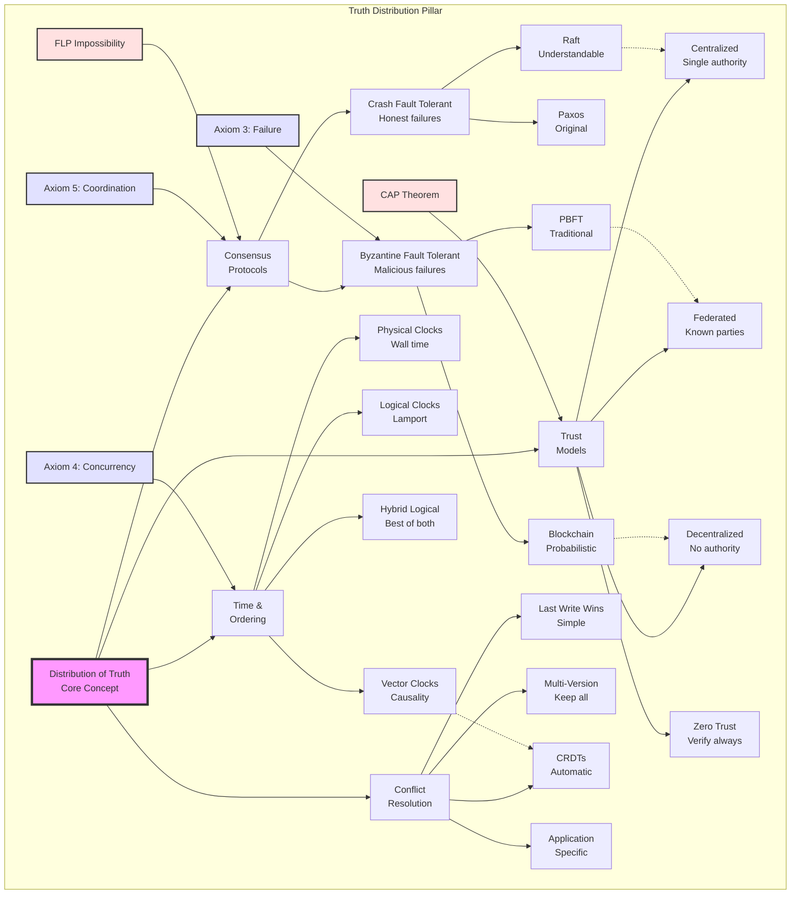

## Level 1: Intuition (Start Here) 🌱

### The Library Card Catalog Metaphor

Imagine a library before computers:
- **Single Catalog**: One card drawer = one source of truth
- **Multiple Libraries**: How do they stay in sync?
- **Book Borrowed**: Update your catalog... but what about others?
- **Phone Lines Down**: Can't call other libraries
- **Librarian Sick**: Who updates the cards?

**This is distributed truth**: Multiple copies, no master, must agree somehow.

### Real-World Analogy: Group Chat Planning

```yaml
Friend Group Planning Dinner:

Alice: "Let's meet at 7pm at Pizza Place"
Bob: "I thought we said 8pm?"
Carol: "Wait, I have 7:30pm at Burger Joint"
Dave: [Phone died, missed everything]

What's the truth?
- No single authority
- Messages arrive out of order
- Some people offline
- Must reach agreement somehow

Solution: Consensus!
"Everyone reply with thumbs up to: 7:30pm Pizza Place"
✅ ✅ ✅ [Dave still offline]
3/4 majority = That's our truth
```

### Your First Truth Experiment

### The Beginner's Truth Hierarchy

```text
         💯 Absolute Truth
              (Impossible in distributed systems)
                    |
                    |
         🤝 Consensus Truth
              (Majority agrees)
                    |
                    |
         📝 Eventual Truth
              (Will agree... someday)
                    |
                    |
         🏠 Local Truth
              (What I believe now)
```

---

## 📋 Questions This Pillar Answers

---

## Level 2: Foundation (Understand Why) 🌿

### Core Principle: Truth is Agreement

### The CAP Theorem Refresher

### The Hierarchy of Distributed Truth

```yaml
Level 5: Global Total Order 💰💰💰💰💰
   └─ Most expensive (blockchain, atomic broadcast)
   └─ Every event has exact position
   └─ Use case: Financial ledgers

Level 4: Causal Order 💰💰💰💰
   └─ Preserves cause-and-effect (vector clocks)
   └─ If A caused B, A comes before B everywhere
   └─ Use case: Social media comments

Level 3: Consensus Truth 💰💰💰
   └─ Majority agreement (Raft, Paxos)
   └─ Majority decides the truth
   └─ Use case: Configuration management

Level 2: Eventual Truth 💰💰
   └─ Converges over time (CRDTs, gossip)
   └─ Truth emerges eventually
   └─ Use case: Shopping carts

Level 1: Local Truth 💰
   └─ What I believe right now
   └─ No coordination needed
   └─ Use case: Caching

Cost increases exponentially with each level
```

### 🎬 Failure Vignette: The Bitcoin Double-Spend Attack

### The FLP Impossibility Result

---

## Level 3: Deep Dive (Master the Patterns) 🌳

### Consensus Algorithms: The Truth Makers

### Concept Map: Distribution of Truth



This concept map shows how distributed truth branches into consensus mechanisms, time ordering, conflict resolution, and trust models. Each is constrained by fundamental theorems and axioms.

### Understanding Raft: The Understandable Consensus

### The Vector Clock Pattern

### CRDTs: Conflict-Free Truth

### The Gossip Pattern

---

## Level 4: Expert (Production Patterns) 🌲

### Case Study: Kubernetes Etcd Consensus

### 🎯 Decision Framework: Choosing Your Truth

### Advanced Patterns: Multi-Region Consensus

### Production Anti-Patterns

---

## Level 5: Mastery (Push the Boundaries) 🌴

### The Future: Quantum Consensus

### Blockchain Evolution: Consensus at Scale

### The Philosophy of Distributed Truth

## Summary: Key Insights by Level

### 🌱 Beginner
1. **Truth = Agreement, not observation**
2. **No master copy in distributed systems**
3. **Majority vote is simplest consensus**

### 🌿 Intermediate
1. **CAP theorem forces truth trade-offs**
2. **Higher consistency = Higher cost**
3. **FLP theorem: Perfect consensus impossible**

### 🌳 Advanced
1. **Raft > Paxos for understandability**
2. **CRDTs enable conflict-free truth**
3. **Vector clocks track causality**

### 🌲 Expert
1. **Multi-region needs hierarchical consensus**
2. **Speculative execution hides latency**
3. **Truth patterns depend on use case**

### 🌴 Master
1. **Quantum consensus breaks classical limits**
2. **Blockchain evolves beyond proof-of-work**
3. **Truth is algorithm-dependent construct**

## Quick Reference Card

---

**Next**: [Pillar 4: Control →](../control/index.md)

*"In distributed systems, truth isn't discovered—it's negotiated."*
