# Pillar 3: Distribution of Truth

[Home](/) > [The 5 Pillars](part2-pillars) > Pillar 3: Truth > Overview

<div class="truth-box">
<h2>⚡ The One-Inch Punch</h2>
<p><strong>Your redundancy is a lie. Truth = majority vote, not reality.</strong></p>
<p>In distributed systems, truth isn't discovered—it's negotiated through consensus algorithms.</p>
</div>

{{ page.meta.audio_widget }}

## 🔥 The Shock: Your Database Lies to You

```
COMPLACENT: "My replicated database ensures data consistency"
         ↓
SHOCKED: "Bitcoin had TWO valid blockchains for 6 hours"
         ↓
FEARFUL: "If Bitcoin can fork, what about MY system?"
         ↓
CURIOUS: "How do systems agree on truth without a master?"
         ↓
ENLIGHTENED: "Truth is what the majority agrees on"
         ↓
EMPOWERED: "I can choose my truth guarantees"
         ↓
TRANSFORMED: "I design truth protocols, not discover facts"
```

## 💥 The Reality Check Dashboard

```
┌─────────────────────────────────────────────────────────────┐
│                    TRUTH VIOLATION ALERTS                    │
├─────────────────────────────────────────────────────────────┤
│ 🔴 SPLIT BRAIN: Kubernetes cluster has 2 leaders            │
│ 🔴 FORK DETECTED: Payment system shows different balances   │
│ 🔴 CLOCK SKEW: 47ms drift causing transaction reordering    │
│ 🟡 CONSENSUS LAG: Raft replication 2.3s behind leader      │
│ 🟡 PARTITION: EU-WEST isolated from US-EAST (312ms)        │
└─────────────────────────────────────────────────────────────┘

Real Production Incidents:
• Bitcoin 2013: 24 blocks on wrong chain = $1.5M at risk
• GitHub 2018: Split-brain caused 43-second write unavailability  
• Cloudflare 2020: Consensus lag caused 27 minutes global outage
• Ethereum 2016: DAO fork split community permanently
```

## 🎯 The Truth Spectrum: Pick Your Poison

```
TRUTH LEVEL          COST    LATENCY   USE WHEN
═══════════════════════════════════════════════════════════════
Local Truth          $      <1ms      "Caching, read models"
  └─ "What I think"

Eventual Truth       $$     ~10ms     "Shopping carts, likes"
  └─ "We'll agree someday"  

Causal Truth         $$$    ~50ms     "Social feeds, comments"
  └─ "Respects cause→effect"

Consensus Truth      $$$$   ~200ms    "Config, leader election"
  └─ "Majority rules"

Total Order Truth    $$$$$ ~1000ms   "Financial transactions"
  └─ "Global sequence"
```

## 🧠 The Mental Model Shift

```
OLD THINKING                    NEW THINKING
════════════════════════════════════════════════════════
"Find the correct value"    →   "Negotiate agreement"
"Query the master"          →   "Ask the quorum"
"Truth is absolute"         →   "Truth has confidence levels"
"Sync means identical"      →   "Sync means eventual convergence"
"Time orders events"        →   "Consensus orders events"
```

## ⚔️ The Five Truth Specters (What Kills Systems)

```
┌─────────────────────────────────────────────────────────────┐
│ SPECTER 1: SPLIT BRAIN                                      │
├─────────────────────────────────────────────────────────────┤
│     DC-WEST              DC-EAST                            │
│   ┌─────────┐          ┌─────────┐                         │
│   │Leader A │    ❌    │Leader B │   Both think they lead! │
│   │Writes=OK│          │Writes=OK│                         │
│   └─────────┘          └─────────┘                         │
│                                                             │
│ RESULT: Divergent state, data loss on reconciliation       │
└─────────────────────────────────────────────────────────────┘

┌─────────────────────────────────────────────────────────────┐
│ SPECTER 2: BYZANTINE GENERALS                               │
├─────────────────────────────────────────────────────────────┤
│   Honest₁ ─── "ATTACK" ───► Honest₂                        │
│      ↓                          ↓                           │
│  "ATTACK"                   "ATTACK"                        │
│      ↓                          ↓                           │
│   Traitor ─── "RETREAT" ──► Honest₃                        │
│                                                             │
│ RESULT: No consensus possible without 3f+1 nodes            │
└─────────────────────────────────────────────────────────────┘

┌─────────────────────────────────────────────────────────────┐
│ SPECTER 3: CLOCK DIVERGENCE                                 │
├─────────────────────────────────────────────────────────────┤
│   Node A: Transaction @ 10:00:00.000                       │
│   Node B: Transaction @ 09:59:59.950  (50ms behind)        │
│                                                             │
│   ORDER A→B or B→A? 🤷                                     │
│                                                             │
│ RESULT: Inconsistent transaction ordering                   │
└─────────────────────────────────────────────────────────────┘

┌─────────────────────────────────────────────────────────────┐
│ SPECTER 4: THE UNCOMMITTED                                  │
├─────────────────────────────────────────────────────────────┤
│   Client ──WRITE──► Leader ──REPLICATE──► Followers        │
│                        │                                     │
│                     💥 CRASH                                │
│                                                             │
│   "Did my write succeed?" Nobody knows!                    │
│                                                             │
│ RESULT: Schrodinger's transaction                           │
└─────────────────────────────────────────────────────────────┘

┌─────────────────────────────────────────────────────────────┐
│ SPECTER 5: VERSION VECTORS EXPLOSION                        │
├─────────────────────────────────────────────────────────────┤
│   Node A: {A:10, B:5,  C:3}  ─┐                            │
│   Node B: {A:8,  B:7,  C:3}  ─┼─ CONCURRENT!              │
│   Node C: {A:9,  B:5,  C:4}  ─┘                            │
│                                                             │
│   Siblings: [ValueA, ValueB, ValueC] 😱                    │
│                                                             │
│ RESULT: Conflict resolution nightmare                       │
└─────────────────────────────────────────────────────────────┘
```

## 🏗️ The Truth Architecture Patterns

### Pattern 1: Raft - The Understandable Consensus

```
┌─────────────────────────────────────────────────────────────┐
│                    RAFT STATE MACHINE                       │
├─────────────────────────────────────────────────────────────┤
│                                                             │
│   FOLLOWER ──timeout──► CANDIDATE ──majority──► LEADER     │
│      ▲                      │                      │        │
│      └──higher term─────────┴──────higher term────┘        │
│                                                             │
│   Election Safety:  ≤1 leader per term                     │
│   Log Matching:     Same index = same command              │
│   Leader Complete:  All committed entries in leader's log  │
│                                                             │
└─────────────────────────────────────────────────────────────┘

THE RAFT DECISION FLOW:
Client─┐
       ▼
    LEADER ──┬─► Follower₁ ─ack─┐
             ├─► Follower₂ ─ack─┼─► Majority? ──► COMMITTED
             └─► Follower₃ ─ack─┘
```

### Pattern 2: CRDTs - Conflict-Free by Design

```
┌─────────────────────────────────────────────────────────────┐
│              CRDT MAGIC: ALWAYS CONVERGES                   │
├─────────────────────────────────────────────────────────────┤
│                                                             │
│  GCounter (Grow-only):                                      │
│  Node A: [5,0,0] ─┐                                         │
│  Node B: [0,3,0] ─┼─MERGE─► [5,3,2] = 10                  │
│  Node C: [0,0,2] ─┘         (take max)                     │
│                                                             │
│  ORSet (Add/Remove):                                        │
│  A: add(x,id1) ────┐                                        │
│  B: add(x,id2) ────┼─MERGE─► {x:[id1,id2]} - {x:[id1]}    │
│  C: remove(x,id1) ─┘         = {x:[id2]}                   │
│                                                             │
│  NO COORDINATION NEEDED! 🎉                                 │
└─────────────────────────────────────────────────────────────┘
```

### Pattern 3: Vector Clocks - Tracking Causality

```
┌─────────────────────────────────────────────────────────────┐
│                  VECTOR CLOCK EVOLUTION                     │
├─────────────────────────────────────────────────────────────┤
│                                                             │
│  A:[1,0,0] ──msg──► B:[1,1,0] ──msg──► C:[1,1,1]          │
│      │                                      ▲               │
│      └──────────concurrent write───────────┘               │
│                    A:[2,0,0]                                │
│                                                             │
│  COMPARE: [2,0,0] vs [1,1,1]                              │
│  Neither > other = CONCURRENT! 🔀                          │
│                                                             │
│  if all(a[i] <= b[i]) && any(a[i] < b[i]): a → b         │
│  else if all(b[i] <= a[i]) && any(b[i] < a[i]): b → a    │
│  else: CONCURRENT                                          │
└─────────────────────────────────────────────────────────────┘
```

## 📊 Production Truth Costs (Real Numbers)

```
┌─────────────────────────────────────────────────────────────┐
│                    TRUTH ECONOMICS                          │
├─────────────────────────────────────────────────────────────┤
│                                                             │
│  LOCAL CACHE        $0.001/GB    <1ms      No consistency  │
│  ─────────────────────────────────────────────────────────  │
│                                                             │
│  EVENTUAL (S3)      $0.023/GB    ~10ms     Converges       │
│  ─────────────────────────────────────────────────────────  │
│                                                             │
│  CONSENSUS (etcd)   $0.250/GB    ~50ms     Strong          │
│  ─────────────────────────────────────────────────────────  │
│                                                             │
│  TOTAL ORDER        $2.500/GB    ~200ms    Linearizable    │
│  (Spanner)                                                  │
│  ─────────────────────────────────────────────────────────  │
│                                                             │
│  BLOCKCHAIN         $50.00/GB    ~10min    Immutable       │
│  ─────────────────────────────────────────────────────────  │
│                                                             │
│  💡 10,000x cost difference between local and blockchain!  │
└─────────────────────────────────────────────────────────────┘
```

## 🚨 The FLP Impossibility (Why Perfect Consensus is Impossible)

```
┌─────────────────────────────────────────────────────────────┐
│     FISCHER-LYNCH-PATERSON IMPOSSIBILITY RESULT (1985)     │
├─────────────────────────────────────────────────────────────┤
│                                                             │
│  In an ASYNCHRONOUS system with:                           │
│  • No time bounds on message delivery                      │
│  • No time bounds on process speed                         │
│  • Even ONE crash failure possible                         │
│                                                             │
│  CONSENSUS IS IMPOSSIBLE TO GUARANTEE! 💀                   │
│                                                             │
│  Real systems work around this via:                        │
│  ┌─────────────────────────────────┐                       │
│  │ • Timeouts (partial synchrony)   │                       │
│  │ • Randomization (probabilistic)  │                       │
│  │ • Failure detectors (unreliable) │                       │
│  │ • Human intervention (ultimate)  │                       │
│  └─────────────────────────────────┘                       │
└─────────────────────────────────────────────────────────────┘
```

## 🎯 Decision Matrix: Choose Your Truth Level

```
IF your_requirement == "user_preferences":
    USE eventual_consistency  # DynamoDB, Cassandra
    
ELIF your_requirement == "financial_transactions":
    USE consensus_protocols   # Raft, Paxos
    
ELIF your_requirement == "global_ordering":
    USE total_order          # Spanner, Calvin
    
ELIF your_requirement == "conflict_free":
    USE crdts               # Riak, Redis CRDTs
    
ELIF your_requirement == "audit_trail":
    USE blockchain          # Hyperledger, Ethereum
    
ELSE:
    START with_eventual     # Upgrade only if needed
```

## 🔧 Implementation Checklist

```
┌─────────────────────────────────────────────────────────────┐
│                  TRUTH SYSTEM CHECKLIST                     │
├─────────────────────────────────────────────────────────────┤
│                                                             │
│ □ Define truth requirements:                                │
│   ├─ □ Consistency level (eventual/strong/linearizable)    │
│   ├─ □ Partition tolerance needs                           │
│   └─ □ Latency budget                                      │
│                                                             │
│ □ Choose consensus mechanism:                               │
│   ├─ □ Leader-based (Raft/Paxos) vs Leaderless (Dynamo)   │
│   ├─ □ Byzantine tolerance needed?                         │
│   └─ □ Quorum size (majority/all/configurable)            │
│                                                             │
│ □ Handle edge cases:                                        │
│   ├─ □ Split-brain prevention (fencing tokens)             │
│   ├─ □ Clock skew mitigation (logical clocks)             │
│   └─ □ Conflict resolution (LWW/CRDT/custom)              │
│                                                             │
│ □ Monitor truth health:                                     │
│   ├─ □ Consensus lag metrics                               │
│   ├─ □ Split-brain detection                               │
│   └─ □ Clock drift monitoring                              │
└─────────────────────────────────────────────────────────────┘
```

## 💡 The Wisdom: Truth Hierarchy

### The Hierarchy of Distributed Truth

```
┌─────────────────────────────────────────────────────────────┐
│               TRUTH HIERARCHY (Cost vs Control)             │
├─────────────────────────────────────────────────────────────┤
│                                                             │
│  Level 5: GLOBAL TOTAL ORDER    💰💰💰💰💰 ($10/GB)        │
│  └─ Blockchain, Spanner         Every event sequenced      │
│                                                             │
│  Level 4: CAUSAL ORDER          💰💰💰💰 ($1/GB)           │
│  └─ Vector clocks, Dynamo       Preserves cause→effect     │
│                                                             │
│  Level 3: CONSENSUS TRUTH       💰💰💰 ($0.25/GB)          │
│  └─ Raft, Paxos, etcd          Majority decides            │
│                                                             │
│  Level 2: EVENTUAL TRUTH        💰💰 ($0.02/GB)            │
│  └─ S3, CRDTs, Gossip          Converges... eventually     │
│                                                             │
│  Level 1: LOCAL TRUTH           💰 ($0.001/GB)             │
│  └─ Cache, CDN                 What I think right now      │
│                                                             │
│  ⚠️ Each level = 10x cost, 10x latency, 10x complexity    │
└─────────────────────────────────────────────────────────────┘
```

## 🎓 The Concept Map: Truth Distribution

```
┌─────────────────────────────────────────────────────────────┐
│                  TRUTH DISTRIBUTION MAP                     │
├─────────────────────────────────────────────────────────────┤
│                                                             │
│                    DISTRIBUTION OF TRUTH                     │
│                           │                                  │
│         ┌────────────────┼────────────────┐                │
│         │                │                 │                 │
│    CONSENSUS         TIME/ORDER      CONFLICT RES           │
│         │                │                 │                 │
│    ┌────┴────┐     ┌────┴────┐      ┌────┴────┐          │
│    │ CFT BFT │     │Log Vect │      │LWW CRDT │          │
│    └─┬────┬──┘     └─┬────┬──┘      └─┬────┬──┘          │
│      │    │          │    │           │    │               │
│   Raft  PBFT    Lamport Vector     MVCC  ORSet            │
│                                                             │
│  THEOREMS THAT BIND US:                                     │
│  • FLP: No guaranteed consensus with 1 failure             │
│  • CAP: Pick 2 of 3 (usually CP or AP)                    │
│  • CALM: Monotonic = coordination-free                     │
└─────────────────────────────────────────────────────────────┘
```

## 💥 Case Study: The Bitcoin Fork Crisis

```
┌─────────────────────────────────────────────────────────────┐
│            BITCOIN MARCH 2013 FORK TIMELINE                 │
├─────────────────────────────────────────────────────────────┤
│                                                             │
│ 00:00 ─ Block 225,430 mined (>900KB)                      │
│         ├─ v0.8 nodes: "Valid! Continue mining"            │
│         └─ v0.7 nodes: "Invalid! Reject block"             │
│                                                             │
│ 00:30 ─ Two chains diverge                                 │
│         ├─ Chain A: v0.8 nodes (60% hashpower)            │
│         └─ Chain B: v0.7 nodes (40% hashpower)            │
│                                                             │
│ 02:00 ─ Exchanges on different chains!                     │
│         ├─ MtGox: Following v0.7 chain                     │
│         └─ BitStamp: Following v0.8 chain                  │
│                                                             │
│ 04:00 ─ DOUBLE SPEND POSSIBLE 💀                           │
│         "Send BTC on v0.7, spend same on v0.8"            │
│                                                             │
│ 06:00 ─ Human consensus reached                            │
│         "Downgrade to v0.7, abandon v0.8 chain"           │
│                                                             │
│ 06:30 ─ Miners voluntarily orphan 24 blocks                │
│         Lost rewards: 600 BTC (~$30,000 then)             │
│                                                             │
│ LESSON: Even "trustless" systems need social consensus     │
└─────────────────────────────────────────────────────────────┘
```

## 🏛️ Google Spanner: Engineering Around Physics

```
┌─────────────────────────────────────────────────────────────┐
│              SPANNER'S TRUETIME ARCHITECTURE                │
├─────────────────────────────────────────────────────────────┤
│                                                             │
│   GPS RECEIVERS + ATOMIC CLOCKS → TIME MASTERS             │
│                        │                                     │
│                        ▼                                     │
│              ┌─────────────────┐                           │
│              │ TrueTime API    │                           │
│              │ now() → [T-ε,T+ε]│  ε = 1-4ms uncertainty  │
│              └─────────────────┘                           │
│                        │                                     │
│   ┌────────────────────┼────────────────────┐              │
│   │                    │                     │              │
│   ▼                    ▼                     ▼              │
│ NODE A              NODE B               NODE C            │
│                                                             │
│ COMMIT PROTOCOL:                                            │
│ 1. Prepare transaction                                      │
│ 2. ts = TrueTime.now().latest                             │
│ 3. Wait until TrueTime.now().earliest > ts                │
│ 4. Release locks & commit                                  │
│                                                             │
│ COST: 1-4ms commit wait for GLOBAL CONSISTENCY!            │
└─────────────────────────────────────────────────────────────┘
```

## 🔍 Understanding Raft: Visual State Machine

```
┌─────────────────────────────────────────────────────────────┐
│                   RAFT CONSENSUS FLOW                       │
├─────────────────────────────────────────────────────────────┤
│                                                             │
│ ELECTION:                                                   │
│ Follower ─timeout→ Candidate ─majority→ Leader             │
│    ↑                   │                   │                │
│    └────discovered─────┴────higher term────┘                │
│                                                             │
│ LOG REPLICATION:                                            │
│                                                             │
│ Client──┐                                                   │
│         ▼                                                   │
│ [LEADER]──AppendEntries──►[FOLLOWER₁]──ACK──┐             │
│    │                                         │              │
│    ├─────AppendEntries──►[FOLLOWER₂]──ACK──┼─►Majority?   │
│    │                                         │      │       │
│    └─────AppendEntries──►[FOLLOWER₃]──ACK──┘      ▼       │
│                                                 COMMITTED   │
│                                                             │
│ SAFETY PROPERTIES:                                          │
│ • Election Safety: ≤1 leader per term                      │
│ • Log Matching: Same log index → same command              │
│ • Leader Completeness: Committed = never lost              │
└─────────────────────────────────────────────────────────────┘
```

## 💫 CRDTs: The Magical Convergence

```
┌─────────────────────────────────────────────────────────────┐
│                    CRDT OPERATIONS                          │
├─────────────────────────────────────────────────────────────┤
│                                                             │
│ GCOUNTER (Grow-only Counter):                              │
│ ─────────────────────────────                              │
│ Node A: [5,0,0] ─┐                                         │
│ Node B: [0,3,0] ─┼─MERGE([5,3,2])─► Value = 10           │
│ Node C: [0,0,2] ─┘  max(a,b,c)                            │
│                                                             │
│ ORSET (Observed-Remove Set):                               │
│ ────────────────────────────                               │
│ A: add(milk,uuid1) ────┐                                   │
│ B: add(eggs,uuid2) ────┼─MERGE─► {milk:uuid1,eggs:uuid2} │
│ C: rem(milk,uuid1) ────┘                                   │
│                                                             │
│ PROPERTIES:                                                 │
│ • Commutative: merge(a,b) = merge(b,a)                    │
│ • Associative: merge(a,merge(b,c)) = merge(merge(a,b),c)  │
│ • Idempotent: merge(a,a) = a                              │
│                                                             │
│ = ALWAYS CONVERGES WITHOUT COORDINATION! 🎉                │
└─────────────────────────────────────────────────────────────┘
```

## 🎯 Production Anti-Patterns (What NOT to Do)

```
┌─────────────────────────────────────────────────────────────┐
│                   TRUTH ANTI-PATTERNS                       │
├─────────────────────────────────────────────────────────────┤
│                                                             │
│ ❌ ANTI-PATTERN 1: Over-Consensus                          │
│ Every read goes through Raft = 50ms per read!             │
│ ✅ FIX: Read from leader's stable state                   │
│                                                             │
│ ❌ ANTI-PATTERN 2: Ignoring Byzantine Failures             │
│ "Our nodes won't lie" → Corrupted node poisons cluster    │
│ ✅ FIX: Use PBFT for critical systems (3f+1 nodes)        │
│                                                             │
│ ❌ ANTI-PATTERN 3: Wall Clock Ordering                     │
│ Using system.currentTimeMillis() for ordering             │
│ ✅ FIX: Logical clocks (Lamport/Vector/Hybrid)            │
│                                                             │
│ ❌ ANTI-PATTERN 4: Split-Brain Amnesia                     │
│ Partition heals → "Last writer wins" → Data loss          │
│ ✅ FIX: Version vectors + application-level merge         │
│                                                             │
│ ❌ ANTI-PATTERN 5: Infinite Conflict Resolution            │
│ Showing users: "Pick version A, B, C, D, or E?"           │
│ ✅ FIX: Automatic resolution with CRDT semantics          │
└─────────────────────────────────────────────────────────────┘
```

## 🚀 Advanced: Multi-Region Consensus

```
┌─────────────────────────────────────────────────────────────┐
│              HIERARCHICAL CONSENSUS AT SCALE                │
├─────────────────────────────────────────────────────────────┤
│                                                             │
│                    GLOBAL COORDINATOR                       │
│                           │                                  │
│         ┌─────────────────┼─────────────────┐              │
│         │                 │                  │              │
│    [US-EAST]         [EU-WEST]          [ASIA-PAC]         │
│    Raft Group        Raft Group         Raft Group         │
│    3-5 nodes         3-5 nodes          3-5 nodes          │
│         │                 │                  │              │
│   Local: 1ms        Local: 1ms         Local: 1ms          │
│   Regional: 10ms    Regional: 10ms     Regional: 10ms      │
│   Global: 200ms     Global: 200ms      Global: 200ms       │
│                                                             │
│ CONSISTENCY LEVELS:                                         │
│ • LOCAL: Return after local DC commits                     │
│ • REGIONAL: Return after region quorum                     │
│ • GLOBAL: Return after global quorum                       │
│                                                             │
│ REAL LATENCIES (AWS):                                       │
│ • US-EAST ↔ US-WEST: 70ms                                 │
│ • US-EAST ↔ EU-WEST: 80ms                                 │
│ • US-EAST ↔ ASIA-PAC: 170ms                               │
└─────────────────────────────────────────────────────────────┘
```

## 🧘 The Philosophy: Truth is Negotiated

```
┌─────────────────────────────────────────────────────────────┐
│                THE FOUR PARADOXES OF TRUTH                  │
├─────────────────────────────────────────────────────────────┤
│                                                             │
│ 1. THE OBSERVER PARADOX                                    │
│    "Monitoring consensus changes consensus timing"         │
│                                                             │
│ 2. THE COORDINATION PARADOX                                │
│    "To avoid coordination, we must coordinate first"       │
│                                                             │
│ 3. THE TRUST PARADOX                                       │
│    "Trustless systems require trusting the protocol"       │
│                                                             │
│ 4. THE FINALITY PARADOX                                    │
│    "Nothing is final, just very probably won't change"     │
│                                                             │
│ WISDOM: Truth in distributed systems is not discovered—    │
│         it's negotiated through algorithms and trade-offs. │
└─────────────────────────────────────────────────────────────┘
```


This concept map shows how distributed truth branches into consensus mechanisms, time ordering, conflict resolution, and trust models. Each is constrained by fundamental theorems and laws.

### Understanding Raft: The Understandable Consensus

Raft achieves consensus by electing a leader that manages replication (addressing [Law 1: Law of Correlated Failure](part1-axioms/law1-failure)/index).


### Raft Consensus Flow


**Key Properties**:
1. **Leader election** - One leader per term
2. **Log replication** - Leader → Followers
3. **Safety** - Committed entries never lost
4. **Liveness** - Progress with majority

### The Vector Clock Pattern

Vector clocks track causality in distributed systems without synchronized time (implementing [Law 2: Law of Asynchronous Reality](part1-axioms/law2-asynchrony) ordering guarantees/index).

### The Vector Clock Pattern

Vector clocks track causality in distributed systems without synchronized time.


#### Vector Clock Operations

| Operation | Algorithm | Result |
|-----------|-----------|--------|
| **Initialize** | `clock = [0, 0, ..., 0]` | All components zero |
| **Local Event** | `clock[my_id] += 1` | Increment own component |
| **Send Message** | `clock[my_id] += 1`<br/>`return clock.copy()` | Increment & attach clock |
| **Receive Message** | `clock[i] = max(clock[i], other[i])`<br/>`clock[my_id] += 1` | Merge clocks & increment |
| **Happens-Before** | `all(a[i] <= b[i]) AND any(a[i] < b[i])` | Check causal ordering |
| **Concurrent** | `NOT (a → b) AND NOT (b → a)` | No causal relationship |


#### Causality Detection Example

```mermaid
graph LR
    subgraph "Event Timeline"
        A1["A: Send x=1<br/>[1,0,0]"] --> B1["B: Receive<br/>[1,1,0]"]
        B1 --> B2["B: Send y=2<br/>[1,2,0]"]
        A1 --> A2["A: Send z=3<br/>[2,0,0]"]
        B2 --> C1["C: Receive<br/>[1,2,1]"]
        A2 --> C2["C: Receive<br/>[2,2,2]"]
    end
    
    subgraph "Causal Analysis"  
        R1["A1 → B1<br/>✓ Causal"]
        R2["A2 || B2<br/>✓ Concurrent"]
        R3["B2 → C1<br/>✓ Causal"]
    end
    
    style A1 fill:#e1f5fe
    style A2 fill:#e1f5fe
    style B1 fill:#c8e6c9
    style B2 fill:#c8e6c9
    style C1 fill:#fff9c4
    style C2 fill:#fff9c4
```



### CRDTs: Conflict-Free Truth

CRDTs (Conflict-Free Replicated Data Types) guarantee eventual consistency without coordination. They elegantly sidestep [Law 5: Law of Distributed Knowledge](part1-axioms/law5-epistemology) costs by making all operations commutative.

### CRDTs: Conflict-Free Truth

CRDTs (Conflict-Free Replicated Data Types/index) guarantee eventual consistency without coordination.

#### CRDT Types and Operations

```mermaid
graph TB
    subgraph "State-based CRDTs"
        GC[GCounter<br/>Grow-only Counter]
        PNC[PNCounter<br/>PN-Counter]
        ORS[ORSet<br/>Observed-Remove Set]
        LWW[LWWRegister<br/>Last-Write-Wins]
    end
    
    subgraph "Operations"
        GC --> |increment only| GCOp[Node A: [5,0,0]<br/>Node B: [5,3,0]<br/>Node C: [5,3,2]<br/>Merge: max each position]
        PNC --> |inc/dec| PNCOp[P: [5,3,2]<br/>N: [1,1,0]<br/>Value = P - N = 9 - 2 = 7]
        ORS --> |add/remove| ORSOp[Add tags unique IDs<br/>Remove clears tags<br/>Merge unions tags]
    end
    
    style GC fill:#e8f5e9
    style PNC fill:#e3f2fd
    style ORS fill:#fff3e0
```

#### GCounter Example: Distributed Page Views


#### CRDT Properties

| CRDT Type | Operations | Merge Rule | Use Case |
|-----------|------------|------------|----------|
| **GCounter** | increment() | max(a[i], b[i]) | View counts, likes |
| **PNCounter** | inc(), dec() | P.merge(), N.merge() | Account balances |
| **GSet** | add() | union(a, b) | Growing collections |
| **ORSet** | add(), remove() | union with tombstones | Shopping carts |
| **LWWRegister** | set(value, timestamp) | keep highest timestamp | User preferences |
| **MVRegister** | set(value) | keep all concurrent | Collaborative editing |


### The Gossip Pattern

Gossip protocols spread information epidemically through random peer selection.

### The Gossip Pattern

Gossip protocols spread information epidemically through random peer selection.


#### Gossip Protocol Characteristics

| Property | Value | Description |
|----------|-------|-------------|
| **Convergence Time** | O(log N) rounds | Exponential spread pattern |
| **Message Complexity** | O(N log N) | Each node gossips log N times |
| **Fault Tolerance** | High | Handles node failures gracefully |
| **Consistency** | Eventual | All nodes converge to same state |
| **Network Usage** | Constant per node | Fanout limits bandwidth |


#### Anti-Entropy Process


**Properties**:
1. **Eventual consistency** - All nodes converge
2. **Fault tolerance** - Handles node failures
3. **Scalability** - O(log N) convergence
4. **Simplicity** - No coordinator needed

---

## Consistency as Distributed Truth

### The Consistency Spectrum as Truth Levels


### Truth Establishment Protocols

#### 1. Consensus-Based Truth (Raft/Paxos)


#### 2. Byzantine Truth (BFT Consensus)


#### 3. Probabilistic Truth (Blockchain)


### Truth Conflicts and Resolution

```mermaid
graph TB
    subgraph "Conflict Detection"
        V1[Version 1: X=10<br/>Time: 1000<br/>Node: A]
        V2[Version 2: X=20<br/>Time: 1000<br/>Node: B]
        CD[Conflict Detected!]
        V1 & V2 --> CD
    end
    
    subgraph "Resolution Strategies"
        LWW[Last Write Wins<br/>Use timestamp]
        MVR[Multi-Value Register<br/>Keep both]
        APC[Application Callback<br/>Custom logic]
        CRD[CRDT Merge<br/>Automatic]
    end
    
    CD --> LWW & MVR & APC & CRD
    
    subgraph "Results"
        R1[X=20<br/>(higher timestamp)]
        R2[X=[10,20]<br/>(conflict preserved)]
        R3[X=15<br/>(app merged)]
        R4[X=30<br/>(CRDT sum)]
    end
    
    LWW --> R1
    MVR --> R2
    APC --> R3
    CRD --> R4
```

### Truth Propagation Patterns

| Pattern | Truth Guarantee | Latency | Use Case |
|---------|----------------|---------|-----------||
| **Synchronous Replication** | Immediate truth | High (RTT x replicas) | Financial data |
| **Asynchronous Replication** | Eventual truth | Low (immediate return) | Analytics |
| **Quorum Replication** | Probabilistic truth | Medium (majority RTT) | User data |
| **Chain Replication** | Ordered truth | Variable (chain length) | Logs |
| **Gossip Protocol** | Convergent truth | Logarithmic | Membership |


### Truth Under Partition


### Practical Truth Verification

### Practical Truth Verification


#### Verification Technique Details

| Technique | How It Works | Use Case | Overhead |
|-----------|--------------|----------|----------|
| **Merkle Trees** | Hash tree of data blocks | Large dataset sync | O(log n) proofs |
| **Vector Clocks** | [n1, n2, ...] timestamps | Causal ordering | O(n) space |
| **Checksums** | CRC32/SHA256 of data | Corruption detection | O(1) space |
| **Epochs** | Monotonic version numbers | Leader changes | O(1) space |
| **Fencing** | Incremental tokens + check | Prevent split-brain | O(1) + storage |


### Truth Economics


---

## Level 4: Expert (Production Patterns) 🌲

### Case Study: Kubernetes Etcd Consensus

Kubernetes uses etcd (built on Raft) as its distributed truth source for all cluster state. This demonstrates how modern systems handle [Pillar 2: State](part2-pillars/state/index) distribution with strong consistency guarantees.


!!! info "Key Design Decisions"
    - **All state in etcd**: Single source of truth for cluster state
    - **API server is stateless**: Just a gateway to etcd
    - **Controllers watch for changes**: React to state updates
    - **Optimistic concurrency**: Use resource versions for conflict detection


### Decision Framework: Choosing Your Truth


### Advanced Patterns: Multi-Region Consensus

### Advanced Patterns: Multi-Region Consensus

```mermaid
graph TB
    subgraph "Global Consensus Hierarchy"
        subgraph "US-EAST"
            USE[Regional Leader]
            US1[DC1]
            US2[DC2]
            US3[DC3]
            USE --> US1 & US2 & US3
        end
        
        subgraph "EU-WEST"
            EUW[Regional Leader]
            EU1[DC4]
            EU2[DC5]
            EU3[DC6]
            EUW --> EU1 & EU2 & EU3
        end
        
        subgraph "ASIA-PAC"
            ASP[Regional Leader]
            AS1[DC7]
            AS2[DC8]
            AS3[DC9]
            ASP --> AS1 & AS2 & AS3
        end
        
        GC[Global Coordinator]
        GC -.->|Cross-region<br/>consensus| USE & EUW & ASP
    end
    
    style GC fill:#ff6b6b,stroke:#333,stroke-width:3px,color:#fff
    style USE fill:#4ecdc4,stroke:#333,stroke-width:2px,color:#fff
    style EUW fill:#4ecdc4,stroke:#333,stroke-width:2px,color:#fff
    style ASP fill:#4ecdc4,stroke:#333,stroke-width:2px,color:#fff
```

#### Consistency Levels and Latency

| Consistency Level | Write Path | Latency | Failure Handling |
|-------------------|------------|---------|------------------|
| **Local** | Local DC only | ~1ms | No cross-DC coordination |
| **Regional** | Sync within region<br/>Async to others | ~10ms | Regional quorum |
| **Global Strong** | 2PC across regions | ~200ms | Requires all regions |
| **Global Eventual** | Async to all regions | ~1ms | Converges eventually |


#### Multi-Region Write Flow

```mermaid
sequenceDiagram
    participant C as Client
    participant US as US-EAST
    participant EU as EU-WEST  
    participant AS as ASIA-PAC
    
    rect rgba(200, 230, 201, 0.1)
        Note over C,AS: Local Consistency
        C->>US: Write(key, value)
        US->>US: Local commit
        US-->>C: Success (1ms)
    end
    
    rect rgba(187, 222, 251, 0.1)
        Note over C,AS: Regional Consistency
        C->>US: Write(key, value)
        US->>US: Sync replicate in region
        US-->>C: Success (10ms)
        US--)EU: Async replicate
        US--)AS: Async replicate
    end
    
    rect rgba(255, 205, 210, 0.1)
        Note over C,AS: Global Consistency
        C->>US: Write(key, value)
        US->>EU: Prepare (2PC)
        US->>AS: Prepare (2PC)
        EU-->>US: Prepared
        AS-->>US: Prepared
        US->>EU: Commit
        US->>AS: Commit
        US-->>C: Success (200ms)
    end
```

### Production Anti-Patterns

### Production Anti-Patterns

```mermaid
graph TB
    subgraph "Anti-Pattern 1: Over-Consensus"
        AP1["❌ Bad: Every read through Raft<br/>High latency, poor scalability"]
        GP1["✅ Good: Consensus for critical state only<br/>Cache for reads, eventual consistency for non-critical"]
        AP1 --> GP1
    end
    
    subgraph "Anti-Pattern 2: Ignoring Byzantine Failures"
        AP2["❌ Bad: Trust all nodes<br/>max(votes) - vulnerable to lies"]
        GP2["✅ Good: Byzantine fault tolerance<br/>Need 3f+1 nodes for f Byzantine"]
        AP2 --> GP2
    end
    
    subgraph "Anti-Pattern 3: Split-Brain Amnesia"
        AP3["❌ Bad: Last writer wins<br/>Loses partition A's changes"]
        GP3["✅ Good: Merge with conflict resolution<br/>Preserve changes from both partitions"]
        AP3 --> GP3
    end
    
    style AP1 fill:#ffcdd2,stroke:#d32f2f
    style AP2 fill:#ffcdd2,stroke:#d32f2f
    style AP3 fill:#ffcdd2,stroke:#d32f2f
    style GP1 fill:#c8e6c9,stroke:#388e3c
    style GP2 fill:#c8e6c9,stroke:#388e3c
    style GP3 fill:#c8e6c9,stroke:#388e3c
```

#### Consensus Usage Guidelines

| Use Consensus For | Don't Use Consensus For | Alternative |
|-------------------|------------------------|-------------|
| Configuration changes | Read-heavy workloads | Local caches + TTL |
| Leader election | User preferences | Eventually consistent DB |
| Distributed locks | Analytics data | Async replication |
| Transaction ordering | Metrics/logging | Best-effort delivery |
| Critical metadata | Session data | Sticky sessions |


**Common Production Mistakes**:
1. **Over-consensus** - Not everything needs strong consistency
2. **Under-replication** - Less than 5 nodes = risky
3. **Ignoring clock skew** - Timestamps aren't reliable
4. **No chaos testing** - First failure will be in production
5. **Complex resolution** - Simple conflicts need simple solutions

---

## Level 5: Mastery (Push the Boundaries) 🌴

### The Future: Quantum Consensus

Quantum computing introduces new possibilities and challenges for distributed consensus.

### The Future: Quantum Consensus

Quantum computing introduces new possibilities and challenges for distributed consensus.

```mermaid
graph TB
    subgraph "Classical vs Quantum Consensus"
        subgraph "Classical Byzantine"
            C1[3f+1 nodes needed]
            C2[Cryptographic signatures]
            C3[Message complexity O(n²)]
        end
        
        subgraph "Quantum Byzantine"
            Q1[2f+1 nodes only!]
            Q2[Quantum entanglement]
            Q3[Unforgeable quantum tokens]
        end
        
        subgraph "Advantages"
            A1[Better fault tolerance]
            A2[Provably secure randomness]
            A3[Faster agreement]
        end
        
        C1 --> Q1
        C2 --> Q2
        C3 --> Q3
        
        Q1 & Q2 & Q3 --> A1 & A2 & A3
    end
    
    style Q1 fill:#e1bee7,stroke:#6a1b9a,stroke-width:2px
    style Q2 fill:#e1bee7,stroke:#6a1b9a,stroke-width:2px
    style Q3 fill:#e1bee7,stroke:#6a1b9a,stroke-width:2px
```

#### Quantum Consensus Properties

| Property | Classical | Quantum | Benefit |
|----------|-----------|---------|--------|
| **Byzantine Tolerance** | 3f+1 nodes | 2f+1 nodes | 33% fewer nodes needed |
| **Random Number Generation** | Biasable | Provably random | True randomness |
| **Authentication** | Computational | Information-theoretic | Unconditionally secure |
| **State Exploration** | Sequential | Superposition | Parallel exploration |


### Blockchain Evolution: Consensus at Scale

### Blockchain Evolution: Consensus at Scale

```mermaid
graph TB
    subgraph "Consensus Evolution"
        POW[Proof of Work<br/>Bitcoin/Early Ethereum]
        POS[Proof of Stake<br/>Ethereum 2.0]
        SHARD[Sharded Consensus<br/>Next Generation]
        
        POW -->|Energy efficiency| POS
        POS -->|Scalability| SHARD
    end
    
    subgraph "Proof of Stake Flow"
        V[Validators<br/>32 ETH stake]
        P[Proposer Selection<br/>Weighted random]
        B[Block Proposal]
        A[Attestations<br/>Validator votes]
        F[Finality<br/>2/3 stake agrees]
        
        V --> P --> B --> A --> F
    end
    
    subgraph "Sharding Architecture"
        BC[Beacon Chain]
        S1[Shard 1<br/>Committee A]
        S2[Shard 2<br/>Committee B]
        S3[Shard 3<br/>Committee C]
        
        BC --> S1 & S2 & S3
        S1 & S2 & S3 -.->|Cross-shard TX| BC
    end
    
    style POW fill:#ffab91,stroke:#d84315
    style POS fill:#a5d6a7,stroke:#2e7d32
    style SHARD fill:#90caf9,stroke:#1565c0
```

#### Consensus Mechanism Comparison

| Mechanism | Energy Usage | Throughput | Finality | Security Model |
|-----------|--------------|------------|----------|----------------|
| **Proof of Work** | Very High | ~7 TPS | Probabilistic | Hash power |
| **Proof of Stake** | Low | ~100 TPS | Deterministic | Economic stake |
| **Sharded PoS** | Low | ~100k TPS | Deterministic | Stake + committees |
| **PBFT-based** | Low | ~1k TPS | Immediate | Known validators |


### The Philosophy of Distributed Truth

In distributed systems, truth is not discovered—it's negotiated. This fundamental shift from centralized thinking has profound implications.

### The Philosophy of Distributed Truth

In distributed systems, truth is not discovered—it's negotiated. This fundamental shift from centralized thinking has profound implications.

```mermaid
mindmap
  root((Distributed Truth))
    Consensus
      Majority defines reality
      Not what "actually" happened
      Bitcoin: longest chain wins
    Eventual
      Truth emerges over time
      Not instantaneous
      CRDTs converge naturally
    Probabilistic
      Confidence levels
      Never 100% certain
      6 confirmations = 99.9%
    Economic
      Truth has a cost
      Consistency ∝ Price
      Spanner vs DynamoDB
```

#### The Four Natures of Distributed Truth

| Nature | Principle | Example | Implication |
|--------|-----------|---------|-------------|
| **Consensus-Based** | Truth = Majority agreement | Bitcoin's longest chain | Reality is voted on |
| **Time-Dependent** | Truth emerges gradually | CRDT convergence | Patience required |
| **Probabilistic** | Truth has confidence levels | Block confirmations | Certainty is gradient |
| **Economic** | Truth costs resources | Spanner's GPS clocks | Pay for guarantees |


**The Paradoxes of Distributed Truth**:

1. **The Observer Paradox**: Observing the system changes it
   - Health checks affect performance
   - Monitoring creates load
   - Heisenbugs appear/disappear with debugging

2. **The Coordination Paradox**: To avoid coordination, we must coordinate
   - Agreeing to use CRDTs requires coordination
   - Choosing eventual consistency is a consensus decision
   - Standards emerge from agreement

3. **The Trust Paradox**: Trustless systems require trust
   - Bitcoin miners trust the protocol
   - Developers trust the implementation
   - Users trust the mathematics

4. **The Finality Paradox**: Nothing is truly final
   - Blockchains can fork
   - Committed transactions can rollback
   - "Final" is just "very probably won't change"

### Google Spanner: Engineering Around Physics

The ultimate example of distributed truth at scale.

### Google Spanner: Engineering Around Physics

The ultimate example of distributed truth at scale.

```mermaid
graph TB
    subgraph "TrueTime Architecture"
        subgraph "Time Masters"
            GPS[GPS Receivers]
            ATOM[Atomic Clocks]
            TM[Time Master Servers]
            GPS & ATOM --> TM
        end
        
        subgraph "Spanner Nodes"
            SN1[Node 1<br/>Uncertainty: ±1-4ms]
            SN2[Node 2<br/>Uncertainty: ±1-4ms]
            SN3[Node 3<br/>Uncertainty: ±1-4ms]
        end
        
        TM -->|Time sync| SN1 & SN2 & SN3
        
        subgraph "Commit Protocol"
            TS[Assign Timestamp<br/>now().latest]
            CW[Commit Wait<br/>1-4ms average]
            REL[Release Locks<br/>Guaranteed consistency]
            TS --> CW --> REL
        end
    end
    
    style GPS fill:#4285f4,stroke:#333,color:#fff
    style ATOM fill:#ea4335,stroke:#333,color:#fff
    style CW fill:#fbbc04,stroke:#333
```

#### TrueTime API

| Method | Returns | Purpose | Guarantee |
|--------|---------|---------|-----------||
| `now()` | `[earliest, latest]` | Get current time interval | True time within bounds |
| `after(t)` | `bool` | Check if `t` has passed | True if `t < now().earliest` |
| `before(t)` | `bool` | Check if `t` is future | True if `t > now().latest` |


#### Spanner's Commit Protocol

```mermaid
sequenceDiagram
    participant C as Client
    participant S as Spanner Node
    participant TT as TrueTime
    participant R as Replicas
    
    C->>S: Begin transaction
    S->>S: Execute reads/writes
    
    rect rgba(255, 235, 238, 0.1)
        Note over S,TT: Commit Phase
        S->>TT: now()
        TT-->>S: [earliest: T-ε, latest: T+ε] where ε = 1-4ms
        S->>S: timestamp = T+ε
        S->>R: Prepare(timestamp)
        R-->>S: Prepared
        
        Note over S: Commit Wait
        S->>S: Wait until now().earliest > timestamp
        Note over S: ~1-4ms wait ensures timestamp is in past
    end
    
    S->>R: Commit(timestamp)
    S-->>C: Transaction committed
```

**Spanner's Key Insights**:
1. **Expose uncertainty** - Don't pretend time is precise (acknowledging [Law 2: Law of Asynchronous Reality](part1-axioms/law2-asynchrony))
2. **Wait out uncertainty** - 1-4ms average wait for consistency (improved from 7ms in 2012)
3. **Hardware investment** - GPS + atomic clocks per DC
4. **Global scale** - Serves Google's entire infrastructure

**The Cost of Global Truth**:
- Hardware: Significant investment in GPS receivers and atomic clocks per datacenter
- Latency: 1-4ms commit wait (down from 7-14ms in early versions/index)
- Complexity: Specialized hardware and operations
- Benefit: True global consistency at Google scale

## Summary: Key Insights by Level

### 🌱 Beginner
1. **Truth = Agreement, not observation**
2. **No master copy in distributed systems**
3. **Majority vote is simplest consensus**

### 🌿 Intermediate
1. **CAP theorem forces truth trade-offs** (explored in depth in [Law 5: Law of Distributed Knowledge](part1-axioms/law5-epistemology))
2. **Higher consistency = Higher cost**
3. **FLP theorem: Perfect consensus impossible**

### 🌳 Advanced
1. **Raft > Paxos for understandability**
2. **CRDTs enable conflict-free truth**
3. **Vector clocks track causality**

### 🌲 Expert
1. **Multi-region needs hierarchical consensus**
2. **Speculative execution hides latency**
3. **Truth patterns depend on use case**

### 🌴 Master
1. **Quantum consensus breaks classical limits**
2. **Blockchain evolves beyond proof-of-work**
3. **Truth is algorithm-dependent construct**

## Practical Exercises

### Exercise 1: Implement Lamport Clocks 🌱

Build a basic logical clock system to understand event ordering without physical time.

```mermaid
classDiagram
    class LamportClock {
        -int time
        +__init__()
        +tick() int
        +send_event() int
        +receive_event(sender_time) int
    }
    
    note for LamportClock "Logical clock for ordering events\nwithout physical time synchronization"
```

**Lamport Clock Algorithm:**
1. Initialize: `time = 0`
2. Local event: `time += 1`
3. Send message: `time += 1, attach time`
4. Receive message: `time = max(local_time, received_time) + 1`

**Try it**: Create three processes exchanging messages and trace the clock values.

### Exercise 2: Build a Vector Clock System 🌿

Extend to vector clocks for true causality tracking:

```mermaid
classDiagram
    class VectorClock {
        -int node_id
        -list~int~ clock
        +__init__(node_id, num_nodes)
        +tick() list
        +send() list
        +receive(other_clock) list
        +happens_before(other) bool
    }
    
    note for VectorClock "Tracks causality between events\nacross distributed nodes"
```

**Vector Clock Operations:**

| Operation | Algorithm |
|-----------|----------|
| Initialize | `clock = [0, 0, ..., 0]` |
| Local event | `clock[node_id] += 1` |
| Send | `tick(); return clock.copy()` |
| Receive | `clock[i] = max(clock[i], other[i]); tick()` |
| Happens-before | `all(a[i] <= b[i]) AND any(a[i] < b[i]/index)` |


### Exercise 3: Two-Phase Commit Protocol 🌳

Implement a distributed transaction coordinator:

### Exercise 3: Two-Phase Commit Protocol 🌳

```mermaid
sequenceDiagram
    participant TC as Transaction<br/>Coordinator
    participant P1 as Participant 1
    participant P2 as Participant 2
    participant P3 as Participant 3
    
    Note over TC,P3: Phase 1: Voting Phase
    
    TC->>P1: Prepare(tx_id)
    TC->>P2: Prepare(tx_id)
    TC->>P3: Prepare(tx_id)
    
    P1-->>TC: Vote: YES
    P2-->>TC: Vote: YES
    P3-->>TC: Vote: YES
    
    Note over TC: All votes YES
    
    Note over TC,P3: Phase 2: Commit Phase
    
    TC->>P1: Commit(tx_id)
    TC->>P2: Commit(tx_id)
    TC->>P3: Commit(tx_id)
    
    P1-->>TC: ACK
    P2-->>TC: ACK
    P3-->>TC: ACK
    
    Note over TC: Transaction Complete
```

**Implementation Structure:**

| Phase | Actions | Failure Handling |
|-------|---------|------------------|
| **Phase 1: Prepare** | Request votes from all participants | If any vote NO → Abort all |
| **Phase 2: Commit** | Send commit to all participants | All must commit (no backing out) |


**Key Points:**
- Blocking protocol (waits for all responses)
- Coordinator writes to log before each phase
- Participants must persist vote decision
- Challenge: Add timeout handling for crashed nodes

**Challenge**: Add timeout handling and crash recovery.

### Exercise 4: Simple Raft Leader Election 🌲

Build the core of Raft consensus:

### Exercise 4: Simple Raft Leader Election 🌲

```mermaid
stateDiagram-v2
    [*] --> Follower
    Follower --> Candidate: Election timeout
    Candidate --> Leader: Majority votes
    Candidate --> Follower: Higher term seen
    Leader --> Follower: Higher term seen
    Candidate --> Candidate: Split vote, retry
```

**Leader Election Algorithm:**

| Step | Action | Condition |
|------|--------|----------|
| 1 | Start as Follower | Initial state |
| 2 | Election timeout | No heartbeat received |
| 3 | Become Candidate | Increment term, vote for self |
| 4 | Request votes | Send to all peers |
| 5 | Count votes | Need majority (n/2 + 1) |
| 6 | Become Leader | If majority achieved |
| 7 | Send heartbeats | Maintain leadership |


**Key Properties:**
- Election timeout: 150-300ms (randomized)
- Only one leader per term
- Higher terms override lower terms

### Exercise 5: CRDT Implementation 🌴

Build a conflict-free replicated data type:

### Exercise 5: CRDT Implementation 🌴

```mermaid
graph LR
    subgraph "Node A"
        A1[counts: [5,0,0]]
        A2[increment(3)]
        A3[counts: [8,0,0]]
        A1 --> A2 --> A3
    end
    
    subgraph "Node B"
        B1[counts: [0,3,0]]
        B2[increment(2)]
        B3[counts: [0,5,0]]
        B1 --> B2 --> B3
    end
    
    subgraph "After Merge"
        M[counts: [8,5,0]<br/>value: 13]
    end
    
    A3 --> M
    B3 --> M
    
    style M fill:#c8e6c9,stroke:#388e3c
```

**GCounter Operations:**

| Operation | Code | Description |
|-----------|------|-------------|
| **Initialize** | `counts = [0, 0, 0]` | Each node tracks all nodes |
| **Increment** | `counts[my_id] += amount` | Only update own position |
| **Value** | `value = sum(counts)` | Sum all positions |
| **Merge** | `merged[i] = max(a[i], b[i])` | Take maximum at each position |


**Why it works:**
- Each node only increments its own counter
- Merge preserves all increments (max never loses data)
- Eventually consistent without coordination
- Monotonic: values only increase

**Extension Challenge:** Implement PNCounter (increment AND decrement) using two GCounters.

**Extension**: Implement PNCounter (increment/decrement) and ORSet.

### Thought Experiments 💭

1. **The Split-Brain Scenario**: Your cluster partitions into two equal halves. Both elect leaders. How do you handle the reconciliation when the partition heals?

2. **The Time Travel Problem**: A bug causes some nodes' clocks to jump backward. How does this affect each consensus mechanism?

3. **The Byzantine Birthday**: In a system with 7 nodes where 2 are Byzantine, they claim today is everyone's birthday (affecting business logic). How many nodes need to agree on the real date?

## Quick Reference Card

## Quick Reference Card

```mermaid
flowchart TD
    Start[What truth level do you need?]
    
    Start --> Finance{Financial<br/>Accuracy?}
    Start --> Session{User<br/>Sessions?}
    Start --> Cart{Shopping<br/>Cart?}
    Start --> Feed{Social<br/>Feed?}
    Start --> Config{Configuration<br/>Management?}
    Start --> Global{Global<br/>State?}
    
    Finance --> |Yes| F[Strong Consensus<br/>Raft/Paxos<br/>⏱ 10-50ms<br/>💻 5+ nodes]
    Session --> |Yes| S[Sticky Sessions<br/>+ Eventual<br/>⏱ 1-5ms<br/>💻 3 nodes]
    Cart --> |Yes| C[CRDTs<br/>Local-first<br/>⏱ 0ms<br/>🔄 Merge on sync]
    Feed --> |Yes| E[Eventual +<br/>Vector Clocks<br/>⏱ 5-20ms<br/>🔗 Causal order]
    Config --> |Yes| CF[Consensus<br/>etcd/ZooKeeper<br/>⏱ 20-100ms<br/>💻 3-5 nodes]
    Global --> |Yes| G[Spanner-style<br/>GPS time<br/>⏱ 50-200ms<br/>💰💰💰 Infrastructure]
    
    style F fill:#ffcdd2,stroke:#c62828
    style S fill:#e1bee7,stroke:#6a1b9a
    style C fill:#c5e1a5,stroke:#33691e
    style E fill:#bbdefb,stroke:#0d47a1
    style CF fill:#ffe0b2,stroke:#e65100
    style G fill:#ef9a9a,stroke:#b71c1c
```

---

**Next**: [Pillar 4: Control →](part2-pillars/control/index)

*"In distributed systems, truth isn't discovered—it's negotiated."*

## Related Resources

### Foundational Laws
- [Law 1: Law of Correlated Failure](part1-axioms/law1-failure/index) - Why consensus protocols need fault tolerance
- [Law 2: Law of Asynchronous Reality](part1-axioms/law2-asynchrony/index) - Time uncertainty and event ordering
- [Law 3: Law of Emergent Chaos](part1-axioms/law3-emergence/index) - Unpredictable consensus behaviors
- [Law 5: Law of Distributed Knowledge](part1-axioms/law5-epistemology/index) - The cost of achieving consensus
- [Law 6: Law of Cognitive Load](part1-axioms/law6-human-api/index) - Human intervention in consensus failures

### Related Pillars
- [Pillar 1: Work](part2-pillars/work/index) - Coordinating distributed computation
- [Pillar 2: State](part2-pillars/state/index) - Managing distributed data consistency
- [Pillar 4: Control](part2-pillars/control/index) - Implementing consensus protocols
- [Pillar 5: Intelligence](part2-pillars/intelligence/index) - Smart consensus optimization

### Implementation Patterns
- [Consensus Protocols](patterns/consensus) - Raft, Paxos, PBFT
- [Event Sourcing](patterns/event-sourcing) - Truth from event logs
- [CQRS](patterns/cqrs) - Separating read/write models
- [Saga Pattern](patterns/saga) - Distributed transaction consensus

### Real-World Case Studies
- [etcd: Production Raft](case-studies/etcd) - Kubernetes' consensus backbone
- [Blockchain Consensus](case-studies/blockchain) - Bitcoin and Ethereum
- [Google Spanner](case-studies/google-spanner) - Global consistency at scale
- [Apache Kafka](case-studies/kafka) - Distributed log consensus

---

<div class="page-nav" markdown>
[:material-arrow-left: Pillar 2: State](part2-pillars/state/index) | 
[:material-arrow-up: The 5 Pillars](part2-pillars) | 
[:material-arrow-right: Pillar 4: Control](part2-pillars/control/index)
</div>