# Pillar 3: Distribution of Truth

[Home](/) > [The 5 Pillars](/part2-pillars/) > Pillar 3: Truth > Overview

## Level 1: Intuition (Start Here) 🌱

### The Library Card Catalog Metaphor

Imagine a library before computers:
- **Single Catalog**: One card drawer = one source of truth
- **Multiple Libraries**: How do they stay in sync?
- **Book Borrowed**: Update your catalog... but what about others?
- **Phone Lines Down**: Can't call other libraries
- **Librarian Sick**: Who updates the cards?

**This is distributed truth**: Multiple copies, no master, must agree somehow. This fundamental challenge emerges from [Law 1: Law of Correlated Failure](/part1-axioms/law1-failure/) (nodes can fail) and [Law 5: Law of Distributed Knowledge](/part1-axioms/law5-epistemology/) (agreement requires communication).

### Real-World Analogy: Group Chat Planning

```mermaid
sequenceDiagram
    participant Alice
    participant Bob
    participant Carol
    participant Dave
    
    Note over Alice,Dave: Friend Group Planning Dinner
    
    Alice->>Bob: Let's meet at 7pm at Pizza Place
    Alice->>Carol: Let's meet at 7pm at Pizza Place
    Alice-xDave: [Message lost - phone died]
    
    Bob->>Alice: I thought we said 8pm?
    Carol->>Alice: Wait, I have 7:30pm at Burger Joint
    
    Note over Alice,Carol: What's the truth?<br/>❌ No single authority<br/>❌ Messages out of order<br/>❌ Some people offline<br/>✅ Must reach consensus!
    
    Alice->>Bob: Everyone reply 👍 to: 7:30pm Pizza Place
    Alice->>Carol: Everyone reply 👍 to: 7:30pm Pizza Place
    Alice-xDave: [Still offline]
    
    Bob->>Alice: 👍
    Carol->>Alice: 👍
    
    Note over Alice: 3/4 majority = That's our truth!
```



### Your First Truth Experiment

### The Beginner's Truth Hierarchy

```mermaid
graph TD
    AT[💯 Absolute Truth<br/>Impossible in distributed systems] --> CT[🤝 Consensus Truth<br/>Majority agrees]
    CT --> ET[📝 Eventual Truth<br/>Will agree... someday]
    ET --> LT[🏠 Local Truth<br/>What I believe now]
    
    style AT fill:#ff6b6b,stroke:#333,stroke-width:2px,color:#fff
    style CT fill:#4ecdc4,stroke:#333,stroke-width:2px,color:#fff
    style ET fill:#45b7d1,stroke:#333,stroke-width:2px,color:#fff
    style LT fill:#96ceb4,stroke:#333,stroke-width:2px,color:#fff
```



---

## Questions This Pillar Answers

---

## Level 2: Foundation (Understand Why) 🌿

### Core Principle: Truth is Agreement

### The CAP Theorem Refresher

### The Hierarchy of Distributed Truth

```mermaid
graph TB
    subgraph "The Hierarchy of Distributed Truth"
        L5["Level 5: Global Total Order 💰💰💰💰💰<br/>Most expensive<br/>Blockchain, atomic broadcast<br/>Every event has exact position<br/>📊 Use case: Financial ledgers"]
        
        L4["Level 4: Causal Order 💰💰💰💰<br/>Preserves cause-and-effect<br/>Vector clocks<br/>If A→B, then A before B everywhere<br/>💬 Use case: Social media comments"]
        
        L3["Level 3: Consensus Truth 💰💰💰<br/>Majority agreement<br/>Raft, Paxos<br/>Majority decides the truth<br/>⚙️ Use case: Configuration management"]
        
        L2["Level 2: Eventual Truth 💰💰<br/>Converges over time<br/>CRDTs, gossip protocols<br/>Truth emerges eventually<br/>🛒 Use case: Shopping carts"]
        
        L1["Level 1: Local Truth 💰<br/>What I believe right now<br/>No coordination needed<br/>Local-only decisions<br/>💾 Use case: Caching"]
    end
    
    L5 -->|Cost ÷10| L4
    L4 -->|Cost ÷10| L3
    L3 -->|Cost ÷10| L2
    L2 -->|Cost ÷10| L1
    
    Note["⚠️ Cost increases exponentially with each level"]
    
    style L5 fill:#ff6b6b,stroke:#333,stroke-width:3px,color:#fff
    style L4 fill:#ee5a24,stroke:#333,stroke-width:2px,color:#fff
    style L3 fill:#fdcb6e,stroke:#333,stroke-width:2px
    style L2 fill:#6c5ce7,stroke:#333,stroke-width:2px,color:#fff
    style L1 fill:#00b894,stroke:#333,stroke-width:2px,color:#fff
    style Note fill:#fffacd,stroke:#333,stroke-width:1px
```



### Failure Vignette: The Bitcoin Double-Spend Attack

**Date**: March 2013 - The Fork Incident
**Impact**: 6-hour network split, $1.5M at risk

```mermaid
gantt
    title Bitcoin Fork Incident Timeline (March 2013)
    dateFormat HH:mm
    axisFormat %H:%M
    
    section Network State
    v0.8 Release                          :milestone, 00:00, 0m
    Mixed v0.7/v0.8 nodes                 :active, mixed, 00:00, 06:30
    Large block mined (>900KB)            :crit, block, 00:00, 00:01
    
    section v0.8 Chain
    v0.8 accepts block                    :done, v8accept, 00:01, 06:29
    v0.8 continues mining                 :active, v8mine, 00:02, 05:58
    
    section v0.7 Chain  
    v0.7 rejects block                    :crit, v7reject, 00:01, 00:01
    v0.7 continues on old chain           :active, v7mine, 00:02, 06:28
    
    section Critical Events
    Network split detected                :crit, split, 00:02, 00:01
    Exchanges on different chains         :crit, exch, 00:10, 00:20
    Double-spend possible                 :crit, dblspend, 00:30, 05:30
    Dev coordination begins               :done, coord, 06:00, 00:30
    Network reconverges                   :milestone, reconv, 06:30, 0m
```



!!! failure "Key Problems & Resolution"
    **The Problem:**
    - Two incompatible versions of "truth"
    - Each valid according to its rules  
    - Economic incentives conflicted with technical solution
    
    **The Fix:**
    - Social consensus overrode technical consensus
    - Miners voluntarily took losses
    - Proved that Bitcoin consensus is sociotechnical

**Lesson**: Even "trustless" systems require human coordination when consensus breaks. This illustrates [Law 6: Law of Cognitive Load](/part1-axioms/law6-human-api/) - humans remain the ultimate arbiters.

### The FLP Impossibility Result

**Fischer, Lynch, and Paterson (1985)** proved that in an asynchronous system with even one faulty process, consensus is impossible.

```mermaid
flowchart TD
    Start[System in Bivalent State<br/>Could decide 0 or 1] --> Scheduler[Adversarial Scheduler]
    
    Scheduler --> FindCritical[Find Critical Messages<br/>Messages that force decision]
    
    FindCritical --> DelayMsgs[Delay Critical Messages<br/>Indefinitely]
    
    DelayMsgs --> CheckConsensus{All Nodes<br/>Decided?}
    
    CheckConsensus -->|No| Scheduler
    CheckConsensus -.->|Yes<br/>Unreachable!| Consensus[Consensus Achieved<br/>⚠️ FLP proves this is impossible]
    
    subgraph "FLP Impossibility Result"
        Note["In asynchronous systems with one faulty process,<br/>consensus is impossible to guarantee.<br/>Adversarial scheduling can always prevent agreement."]
    end
    
    style Start fill:#f9f,stroke:#333,stroke-width:2px
    style Consensus fill:#ff6b6b,stroke:#333,stroke-width:2px,stroke-dasharray: 5 5,color:#fff
    style Note fill:#ffe4b5,stroke:#333,stroke-width:1px
```



**Practical Implications**:
1. **Timeouts are necessary** - Can't distinguish slow from dead
2. **Probabilistic consensus** - Bitcoin, eventual consistency
3. **Synchrony assumptions** - Paxos/Raft assume partial synchrony
4. **Human intervention** - Ultimate fallback for liveness

---

## Level 3: Deep Dive (Master the Patterns) 🌳

### Consensus Algorithms: The Truth Makers

### Concept Map: Distribution of Truth

```mermaid
graph TB
    subgraph "Truth Distribution Pillar"
        Core[Distribution of Truth<br/>Core Concept]

        Core --> Consensus[Consensus<br/>Protocols]
        Core --> Time[Time &<br/>Ordering]
        Core --> Conflict[Conflict<br/>Resolution]
        Core --> Trust[Trust<br/>Models]

        %% Consensus branch
        Consensus --> CFT[Crash Fault Tolerant<br/>Honest failures]
        Consensus --> BFT[Byzantine Fault Tolerant<br/>Malicious failures]
        CFT --> Paxos[Paxos<br/>Original]
        CFT --> Raft[Raft<br/>Understandable]
        BFT --> PBFT[PBFT<br/>Traditional]
        BFT --> Blockchain[Blockchain<br/>Probabilistic]

        %% Time branch
        Time --> Physical[Physical Clocks<br/>Wall time]
        Time --> Logical[Logical Clocks<br/>Lamport]
        Time --> Vector[Vector Clocks<br/>Causality]
        Time --> Hybrid[Hybrid Logical<br/>Best of both]

        %% Conflict branch
        Conflict --> LWW[Last Write Wins<br/>Simple]
        Conflict --> MVCC[Multi-Version<br/>Keep all]
        Conflict --> CRDTs[CRDTs<br/>Automatic]
        Conflict --> Custom[Application<br/>Specific]

        %% Trust branch
        Trust --> Central[Centralized<br/>Single authority]
        Trust --> Federation[Federated<br/>Known parties]
        Trust --> Decentralized[Decentralized<br/>No authority]
        Trust --> Zero[Zero Trust<br/>Verify always]

        %% Key relationships
        Raft -.-> Central
        Blockchain -.-> Decentralized
        Vector -.-> CRDTs
        PBFT -.-> Federation

        %% Law connections
        Law1[Law 1: Law of Correlated Failure ⛓️] --> BFT
        Law2[Law 2: Law of Asynchronous Reality ⏳] --> Time
        Law5[Law 5: Law of Distributed Knowledge 🧠] --> Consensus
        FLP[FLP Impossibility] --> Consensus
        CAP[CAP Theorem] --> Trust
    end

    style Core fill:#f9f,stroke:#333,stroke-width:4px
    style Law1 fill:#e1e1ff,stroke:#333,stroke-width:2px
    style Law2 fill:#e1e1ff,stroke:#333,stroke-width:2px
    style Law5 fill:#e1e1ff,stroke:#333,stroke-width:2px
    style FLP fill:#ffe1e1,stroke:#333,stroke-width:2px
    style CAP fill:#ffe1e1,stroke:#333,stroke-width:2px
```



This concept map shows how distributed truth branches into consensus mechanisms, time ordering, conflict resolution, and trust models. Each is constrained by fundamental theorems and laws.

### Understanding Raft: The Understandable Consensus

Raft achieves consensus by electing a leader that manages replication (addressing [Law 1: Law of Correlated Failure](/part1-axioms/law1-failure/)).


### Raft Consensus Flow


**Key Properties**:
1. **Leader election** - One leader per term
2. **Log replication** - Leader → Followers
3. **Safety** - Committed entries never lost
4. **Liveness** - Progress with majority

### The Vector Clock Pattern

Vector clocks track causality in distributed systems without synchronized time (implementing [Law 2: Law of Asynchronous Reality](/part1-axioms/law2-asynchrony/) ordering guarantees).

### The Vector Clock Pattern

Vector clocks track causality in distributed systems without synchronized time.


#### Vector Clock Operations

| Operation | Algorithm | Result |
|-----------|-----------|--------|
| **Initialize** | `clock = [0, 0, ..., 0]` | All components zero |
| **Local Event** | `clock[my_id] += 1` | Increment own component |
| **Send Message** | `clock[my_id] += 1`<br/>`return clock.copy()` | Increment & attach clock |
| **Receive Message** | `clock[i] = max(clock[i], other[i])`<br/>`clock[my_id] += 1` | Merge clocks & increment |
| **Happens-Before** | `all(a[i] <= b[i]) AND any(a[i] < b[i])` | Check causal ordering |
| **Concurrent** | `NOT (a → b) AND NOT (b → a)` | No causal relationship |


#### Causality Detection Example

```mermaid
graph LR
    subgraph "Event Timeline"
        A1["A: Send x=1<br/>[1,0,0]"] --> B1["B: Receive<br/>[1,1,0]"]
        B1 --> B2["B: Send y=2<br/>[1,2,0]"]
        A1 --> A2["A: Send z=3<br/>[2,0,0]"]
        B2 --> C1["C: Receive<br/>[1,2,1]"]
        A2 --> C2["C: Receive<br/>[2,2,2]"]
    end
    
    subgraph "Causal Analysis"  
        R1["A1 → B1<br/>✓ Causal"]
        R2["A2 || B2<br/>✓ Concurrent"]
        R3["B2 → C1<br/>✓ Causal"]
    end
    
    style A1 fill:#e1f5fe
    style A2 fill:#e1f5fe
    style B1 fill:#c8e6c9
    style B2 fill:#c8e6c9
    style C1 fill:#fff9c4
    style C2 fill:#fff9c4
```



### CRDTs: Conflict-Free Truth

CRDTs (Conflict-Free Replicated Data Types) guarantee eventual consistency without coordination. They elegantly sidestep [Law 5: Law of Distributed Knowledge](/part1-axioms/law5-epistemology/) costs by making all operations commutative.

### CRDTs: Conflict-Free Truth

CRDTs (Conflict-Free Replicated Data Types) guarantee eventual consistency without coordination.

#### CRDT Types and Operations

```mermaid
graph TB
    subgraph "State-based CRDTs"
        GC[GCounter<br/>Grow-only Counter]
        PNC[PNCounter<br/>PN-Counter]
        ORS[ORSet<br/>Observed-Remove Set]
        LWW[LWWRegister<br/>Last-Write-Wins]
    end
    
    subgraph "Operations"
        GC --> |increment only| GCOp[Node A: [5,0,0]<br/>Node B: [5,3,0]<br/>Node C: [5,3,2]<br/>Merge: max each position]
        PNC --> |inc/dec| PNCOp[P: [5,3,2]<br/>N: [1,1,0]<br/>Value = P - N = 9 - 2 = 7]
        ORS --> |add/remove| ORSOp[Add tags unique IDs<br/>Remove clears tags<br/>Merge unions tags]
    end
    
    style GC fill:#e8f5e9
    style PNC fill:#e3f2fd
    style ORS fill:#fff3e0
```

#### GCounter Example: Distributed Page Views


#### CRDT Properties

| CRDT Type | Operations | Merge Rule | Use Case |
|-----------|------------|------------|----------|
| **GCounter** | increment() | max(a[i], b[i]) | View counts, likes |
| **PNCounter** | inc(), dec() | P.merge(), N.merge() | Account balances |
| **GSet** | add() | union(a, b) | Growing collections |
| **ORSet** | add(), remove() | union with tombstones | Shopping carts |
| **LWWRegister** | set(value, timestamp) | keep highest timestamp | User preferences |
| **MVRegister** | set(value) | keep all concurrent | Collaborative editing |


### The Gossip Pattern

Gossip protocols spread information epidemically through random peer selection.

### The Gossip Pattern

Gossip protocols spread information epidemically through random peer selection.


#### Gossip Protocol Characteristics

| Property | Value | Description |
|----------|-------|-------------|
| **Convergence Time** | O(log N) rounds | Exponential spread pattern |
| **Message Complexity** | O(N log N) | Each node gossips log N times |
| **Fault Tolerance** | High | Handles node failures gracefully |
| **Consistency** | Eventual | All nodes converge to same state |
| **Network Usage** | Constant per node | Fanout limits bandwidth |


#### Anti-Entropy Process


**Properties**:
1. **Eventual consistency** - All nodes converge
2. **Fault tolerance** - Handles node failures
3. **Scalability** - O(log N) convergence
4. **Simplicity** - No coordinator needed

---

## Consistency as Distributed Truth

### The Consistency Spectrum as Truth Levels


### Truth Establishment Protocols

#### 1. Consensus-Based Truth (Raft/Paxos)


#### 2. Byzantine Truth (BFT Consensus)


#### 3. Probabilistic Truth (Blockchain)


### Truth Conflicts and Resolution

```mermaid
graph TB
    subgraph "Conflict Detection"
        V1[Version 1: X=10<br/>Time: 1000<br/>Node: A]
        V2[Version 2: X=20<br/>Time: 1000<br/>Node: B]
        CD[Conflict Detected!]
        V1 & V2 --> CD
    end
    
    subgraph "Resolution Strategies"
        LWW[Last Write Wins<br/>Use timestamp]
        MVR[Multi-Value Register<br/>Keep both]
        APC[Application Callback<br/>Custom logic]
        CRD[CRDT Merge<br/>Automatic]
    end
    
    CD --> LWW & MVR & APC & CRD
    
    subgraph "Results"
        R1[X=20<br/>(higher timestamp)]
        R2[X=[10,20]<br/>(conflict preserved)]
        R3[X=15<br/>(app merged)]
        R4[X=30<br/>(CRDT sum)]
    end
    
    LWW --> R1
    MVR --> R2
    APC --> R3
    CRD --> R4
```

### Truth Propagation Patterns

| Pattern | Truth Guarantee | Latency | Use Case |
|---------|----------------|---------|-----------||
| **Synchronous Replication** | Immediate truth | High (RTT x replicas) | Financial data |
| **Asynchronous Replication** | Eventual truth | Low (immediate return) | Analytics |
| **Quorum Replication** | Probabilistic truth | Medium (majority RTT) | User data |
| **Chain Replication** | Ordered truth | Variable (chain length) | Logs |
| **Gossip Protocol** | Convergent truth | Logarithmic | Membership |


### Truth Under Partition


### Practical Truth Verification

### Practical Truth Verification

```mermaid
graph TB
    subgraph "Truth Verification Techniques"
        MT[Merkle Trees<br/>Dataset consistency]
        VC[Vector Clocks<br/>Causal tracking]
        CS[Checksums<br/>Corruption detection]
        CE[Consensus Epochs<br/>Leadership changes]
        FT[Fencing Tokens<br/>Split-brain prevention]
    end
    
    subgraph "Implementation Examples"
        MT --> MTE[Bitcoin blocks<br/>Cassandra anti-entropy]
        VC --> VCE[DynamoDB<br/>Riak]
        CS --> CSE[HDFS blocks<br/>S3 objects]
        CE --> CEE[Raft terms<br/>Viewstamped replication]
        FT --> FTE[HDFS leases<br/>Distributed locks]
    end
    
    style MT fill:#e3f2fd,stroke:#1976d2
    style VC fill:#f3e5f5,stroke:#7b1fa2
    style CS fill:#e8f5e9,stroke:#388e3c
    style CE fill:#fff3e0,stroke:#f57c00
    style FT fill:#fce4ec,stroke:#c2185b
```

#### Verification Technique Details

| Technique | How It Works | Use Case | Overhead |
|-----------|--------------|----------|----------|
| **Merkle Trees** | Hash tree of data blocks | Large dataset sync | O(log n) proofs |
| **Vector Clocks** | [n1, n2, ...] timestamps | Causal ordering | O(n) space |
| **Checksums** | CRC32/SHA256 of data | Corruption detection | O(1) space |
| **Epochs** | Monotonic version numbers | Leader changes | O(1) space |
| **Fencing** | Incremental tokens + check | Prevent split-brain | O(1) + storage |


### Truth Economics

```mermaid
graph TB
    subgraph "Cost of Truth Levels"
        C1[Local Truth<br/>$0.001/GB]
        C2[Regional Truth<br/>$0.01/GB]
        C3[Global Eventual<br/>$0.10/GB]
        C4[Global Strong<br/>$1.00/GB]
        C5[Global Ordered<br/>$10.00/GB]
        
        C1 -->|10x| C2
        C2 -->|10x| C3
        C3 -->|10x| C4
        C4 -->|10x| C5
    end
    
    subgraph "Latency Impact"
        L1[Local: 1ms]
        L2[Regional: 10ms]
        L3[Global: 100ms]
        L4[Consensus: 200ms]
        L5[Blockchain: 10min]
    end
    
    style C1 fill:#90EE90
    style C5 fill:#FFB6C1
```

---

## Level 4: Expert (Production Patterns) 🌲

### Case Study: Kubernetes Etcd Consensus

Kubernetes uses etcd (built on Raft) as its distributed truth source for all cluster state. This demonstrates how modern systems handle [Pillar 2: State](/part2-pillars/state/) distribution with strong consistency guarantees.

```mermaid
graph TB
    subgraph "Kubernetes Control Plane"
        API[API Server<br/>Stateless Gateway]
        CM[Controller Manager]
        SCH[Scheduler]
        KUB[Kubelet]
    end
    
    subgraph "Distributed Truth Store"
        ETCD[etcd Cluster<br/>Raft-based Consensus]
        E1[etcd Node 1<br/>Leader]
        E2[etcd Node 2<br/>Follower] 
        E3[etcd Node 3<br/>Follower]
    end
    
    API -->|All State| ETCD
    CM -->|Watch| API
    SCH -->|Watch| API
    KUB -->|Watch| API
    
    ETCD --> E1
    ETCD --> E2
    ETCD --> E3
    
    E1 -.->|Raft Replication| E2
    E1 -.->|Raft Replication| E3
    E2 -.->|Leader Election| E3
    
    style API fill:#e3f2fd,stroke:#1976d2
    style ETCD fill:#c8e6c9,stroke:#388e3c
    style E1 fill:#4caf50,stroke:#388e3c,color:#fff
```

!!! info "Key Design Decisions"
    - **All state in etcd**: Single source of truth for cluster state
    - **API server is stateless**: Just a gateway to etcd
    - **Controllers watch for changes**: React to state updates
    - **Optimistic concurrency**: Use resource versions for conflict detection

```mermaid
sequenceDiagram
    participant C as Client
    participant API as API Server
    participant ETCD as etcd
    
    Note over C,ETCD: Optimistic Concurrency Control
    
    C->>API: Update deployment "web"
    API->>ETCD: GET /deployments/web
    ETCD-->>API: {spec: {...}, resourceVersion: 42}
    
    Note over API: Modify spec locally
    
    API->>ETCD: CompareAndSwap<br/>key: /deployments/web<br/>expectedVersion: 42
    
    alt Version matches
        ETCD-->>API: Success, new version: 43
        API-->>C: Update successful
    else Version conflict
        ETCD-->>API: VersionConflictError
        Note over API: Retry with new version
        API->>ETCD: GET /deployments/web
        ETCD-->>API: {spec: {...}, resourceVersion: 43}
        API->>ETCD: CompareAndSwap<br/>expectedVersion: 43
    end
```

### Decision Framework: Choosing Your Truth

```mermaid
graph TD
    Start[Need Distributed Truth?]
    
    Start --> Q1{Can tolerate<br/>stale reads?}
    Q1 -->|Yes| Q2{Need causal<br/>consistency?}
    Q1 -->|No| Strong[Strong Consistency<br/>Raft/Paxos]
    
    Q2 -->|Yes| Q3{Conflict-free<br/>updates possible?}
    Q2 -->|No| Eventual[Eventual Consistency<br/>Gossip/Anti-entropy]
    
    Q3 -->|Yes| CRDT[Use CRDTs]
    Q3 -->|No| Vector[Vector Clocks +<br/>App Resolution]
    
    Strong --> Q4{Global or<br/>Regional?}
    Q4 -->|Global| Spanner[Spanner-like<br/>with GPS/Atomic]
    Q4 -->|Regional| Raft[Standard Raft/Paxos]
    
    style Start fill:#f9f,stroke:#333,stroke-width:4px
    style CRDT fill:#9f9,stroke:#333,stroke-width:2px
    style Spanner fill:#ff9,stroke:#333,stroke-width:2px
```

### Advanced Patterns: Multi-Region Consensus

### Advanced Patterns: Multi-Region Consensus

```mermaid
graph TB
    subgraph "Global Consensus Hierarchy"
        subgraph "US-EAST"
            USE[Regional Leader]
            US1[DC1]
            US2[DC2]
            US3[DC3]
            USE --> US1 & US2 & US3
        end
        
        subgraph "EU-WEST"
            EUW[Regional Leader]
            EU1[DC4]
            EU2[DC5]
            EU3[DC6]
            EUW --> EU1 & EU2 & EU3
        end
        
        subgraph "ASIA-PAC"
            ASP[Regional Leader]
            AS1[DC7]
            AS2[DC8]
            AS3[DC9]
            ASP --> AS1 & AS2 & AS3
        end
        
        GC[Global Coordinator]
        GC -.->|Cross-region<br/>consensus| USE & EUW & ASP
    end
    
    style GC fill:#ff6b6b,stroke:#333,stroke-width:3px,color:#fff
    style USE fill:#4ecdc4,stroke:#333,stroke-width:2px,color:#fff
    style EUW fill:#4ecdc4,stroke:#333,stroke-width:2px,color:#fff
    style ASP fill:#4ecdc4,stroke:#333,stroke-width:2px,color:#fff
```

#### Consistency Levels and Latency

| Consistency Level | Write Path | Latency | Failure Handling |
|-------------------|------------|---------|------------------|
| **Local** | Local DC only | ~1ms | No cross-DC coordination |
| **Regional** | Sync within region<br/>Async to others | ~10ms | Regional quorum |
| **Global Strong** | 2PC across regions | ~200ms | Requires all regions |
| **Global Eventual** | Async to all regions | ~1ms | Converges eventually |


#### Multi-Region Write Flow

```mermaid
sequenceDiagram
    participant C as Client
    participant US as US-EAST
    participant EU as EU-WEST  
    participant AS as ASIA-PAC
    
    rect rgba(200, 230, 201, 0.1)
        Note over C,AS: Local Consistency
        C->>US: Write(key, value)
        US->>US: Local commit
        US-->>C: Success (1ms)
    end
    
    rect rgba(187, 222, 251, 0.1)
        Note over C,AS: Regional Consistency
        C->>US: Write(key, value)
        US->>US: Sync replicate in region
        US-->>C: Success (10ms)
        US--)EU: Async replicate
        US--)AS: Async replicate
    end
    
    rect rgba(255, 205, 210, 0.1)
        Note over C,AS: Global Consistency
        C->>US: Write(key, value)
        US->>EU: Prepare (2PC)
        US->>AS: Prepare (2PC)
        EU-->>US: Prepared
        AS-->>US: Prepared
        US->>EU: Commit
        US->>AS: Commit
        US-->>C: Success (200ms)
    end
```

### Production Anti-Patterns

### Production Anti-Patterns

```mermaid
graph TB
    subgraph "Anti-Pattern 1: Over-Consensus"
        AP1["❌ Bad: Every read through Raft<br/>High latency, poor scalability"]
        GP1["✅ Good: Consensus for critical state only<br/>Cache for reads, eventual consistency for non-critical"]
        AP1 --> GP1
    end
    
    subgraph "Anti-Pattern 2: Ignoring Byzantine Failures"
        AP2["❌ Bad: Trust all nodes<br/>max(votes) - vulnerable to lies"]
        GP2["✅ Good: Byzantine fault tolerance<br/>Need 3f+1 nodes for f Byzantine"]
        AP2 --> GP2
    end
    
    subgraph "Anti-Pattern 3: Split-Brain Amnesia"
        AP3["❌ Bad: Last writer wins<br/>Loses partition A's changes"]
        GP3["✅ Good: Merge with conflict resolution<br/>Preserve changes from both partitions"]
        AP3 --> GP3
    end
    
    style AP1 fill:#ffcdd2,stroke:#d32f2f
    style AP2 fill:#ffcdd2,stroke:#d32f2f
    style AP3 fill:#ffcdd2,stroke:#d32f2f
    style GP1 fill:#c8e6c9,stroke:#388e3c
    style GP2 fill:#c8e6c9,stroke:#388e3c
    style GP3 fill:#c8e6c9,stroke:#388e3c
```

#### Consensus Usage Guidelines

| Use Consensus For | Don't Use Consensus For | Alternative |
|-------------------|------------------------|-------------|
| Configuration changes | Read-heavy workloads | Local caches + TTL |
| Leader election | User preferences | Eventually consistent DB |
| Distributed locks | Analytics data | Async replication |
| Transaction ordering | Metrics/logging | Best-effort delivery |
| Critical metadata | Session data | Sticky sessions |


**Common Production Mistakes**:
1. **Over-consensus** - Not everything needs strong consistency
2. **Under-replication** - Less than 5 nodes = risky
3. **Ignoring clock skew** - Timestamps aren't reliable
4. **No chaos testing** - First failure will be in production
5. **Complex resolution** - Simple conflicts need simple solutions

---

## Level 5: Mastery (Push the Boundaries) 🌴

### The Future: Quantum Consensus

Quantum computing introduces new possibilities and challenges for distributed consensus.

### The Future: Quantum Consensus

Quantum computing introduces new possibilities and challenges for distributed consensus.

```mermaid
graph TB
    subgraph "Classical vs Quantum Consensus"
        subgraph "Classical Byzantine"
            C1[3f+1 nodes needed]
            C2[Cryptographic signatures]
            C3[Message complexity O(n²)]
        end
        
        subgraph "Quantum Byzantine"
            Q1[2f+1 nodes only!]
            Q2[Quantum entanglement]
            Q3[Unforgeable quantum tokens]
        end
        
        subgraph "Advantages"
            A1[Better fault tolerance]
            A2[Provably secure randomness]
            A3[Faster agreement]
        end
        
        C1 --> Q1
        C2 --> Q2
        C3 --> Q3
        
        Q1 & Q2 & Q3 --> A1 & A2 & A3
    end
    
    style Q1 fill:#e1bee7,stroke:#6a1b9a,stroke-width:2px
    style Q2 fill:#e1bee7,stroke:#6a1b9a,stroke-width:2px
    style Q3 fill:#e1bee7,stroke:#6a1b9a,stroke-width:2px
```

#### Quantum Consensus Properties

| Property | Classical | Quantum | Benefit |
|----------|-----------|---------|--------|
| **Byzantine Tolerance** | 3f+1 nodes | 2f+1 nodes | 33% fewer nodes needed |
| **Random Number Generation** | Biasable | Provably random | True randomness |
| **Authentication** | Computational | Information-theoretic | Unconditionally secure |
| **State Exploration** | Sequential | Superposition | Parallel exploration |


### Blockchain Evolution: Consensus at Scale

### Blockchain Evolution: Consensus at Scale

```mermaid
graph TB
    subgraph "Consensus Evolution"
        POW[Proof of Work<br/>Bitcoin/Early Ethereum]
        POS[Proof of Stake<br/>Ethereum 2.0]
        SHARD[Sharded Consensus<br/>Next Generation]
        
        POW -->|Energy efficiency| POS
        POS -->|Scalability| SHARD
    end
    
    subgraph "Proof of Stake Flow"
        V[Validators<br/>32 ETH stake]
        P[Proposer Selection<br/>Weighted random]
        B[Block Proposal]
        A[Attestations<br/>Validator votes]
        F[Finality<br/>2/3 stake agrees]
        
        V --> P --> B --> A --> F
    end
    
    subgraph "Sharding Architecture"
        BC[Beacon Chain]
        S1[Shard 1<br/>Committee A]
        S2[Shard 2<br/>Committee B]
        S3[Shard 3<br/>Committee C]
        
        BC --> S1 & S2 & S3
        S1 & S2 & S3 -.->|Cross-shard TX| BC
    end
    
    style POW fill:#ffab91,stroke:#d84315
    style POS fill:#a5d6a7,stroke:#2e7d32
    style SHARD fill:#90caf9,stroke:#1565c0
```

#### Consensus Mechanism Comparison

| Mechanism | Energy Usage | Throughput | Finality | Security Model |
|-----------|--------------|------------|----------|----------------|
| **Proof of Work** | Very High | ~7 TPS | Probabilistic | Hash power |
| **Proof of Stake** | Low | ~100 TPS | Deterministic | Economic stake |
| **Sharded PoS** | Low | ~100k TPS | Deterministic | Stake + committees |
| **PBFT-based** | Low | ~1k TPS | Immediate | Known validators |


### The Philosophy of Distributed Truth

In distributed systems, truth is not discovered—it's negotiated. This fundamental shift from centralized thinking has profound implications.

### The Philosophy of Distributed Truth

In distributed systems, truth is not discovered—it's negotiated. This fundamental shift from centralized thinking has profound implications.

```mermaid
mindmap
  root((Distributed Truth))
    Consensus
      Majority defines reality
      Not what "actually" happened
      Bitcoin: longest chain wins
    Eventual
      Truth emerges over time
      Not instantaneous
      CRDTs converge naturally
    Probabilistic
      Confidence levels
      Never 100% certain
      6 confirmations = 99.9%
    Economic
      Truth has a cost
      Consistency ∝ Price
      Spanner vs DynamoDB
```

#### The Four Natures of Distributed Truth

| Nature | Principle | Example | Implication |
|--------|-----------|---------|-------------|
| **Consensus-Based** | Truth = Majority agreement | Bitcoin's longest chain | Reality is voted on |
| **Time-Dependent** | Truth emerges gradually | CRDT convergence | Patience required |
| **Probabilistic** | Truth has confidence levels | Block confirmations | Certainty is gradient |
| **Economic** | Truth costs resources | Spanner's GPS clocks | Pay for guarantees |


**The Paradoxes of Distributed Truth**:

1. **The Observer Paradox**: Observing the system changes it
   - Health checks affect performance
   - Monitoring creates load
   - Heisenbugs appear/disappear with debugging

2. **The Coordination Paradox**: To avoid coordination, we must coordinate
   - Agreeing to use CRDTs requires coordination
   - Choosing eventual consistency is a consensus decision
   - Standards emerge from agreement

3. **The Trust Paradox**: Trustless systems require trust
   - Bitcoin miners trust the protocol
   - Developers trust the implementation
   - Users trust the mathematics

4. **The Finality Paradox**: Nothing is truly final
   - Blockchains can fork
   - Committed transactions can rollback
   - "Final" is just "very probably won't change"

### Google Spanner: Engineering Around Physics

The ultimate example of distributed truth at scale.

### Google Spanner: Engineering Around Physics

The ultimate example of distributed truth at scale.

```mermaid
graph TB
    subgraph "TrueTime Architecture"
        subgraph "Time Masters"
            GPS[GPS Receivers]
            ATOM[Atomic Clocks]
            TM[Time Master Servers]
            GPS & ATOM --> TM
        end
        
        subgraph "Spanner Nodes"
            SN1[Node 1<br/>Uncertainty: ±1-4ms]
            SN2[Node 2<br/>Uncertainty: ±1-4ms]
            SN3[Node 3<br/>Uncertainty: ±1-4ms]
        end
        
        TM -->|Time sync| SN1 & SN2 & SN3
        
        subgraph "Commit Protocol"
            TS[Assign Timestamp<br/>now().latest]
            CW[Commit Wait<br/>1-4ms average]
            REL[Release Locks<br/>Guaranteed consistency]
            TS --> CW --> REL
        end
    end
    
    style GPS fill:#4285f4,stroke:#333,color:#fff
    style ATOM fill:#ea4335,stroke:#333,color:#fff
    style CW fill:#fbbc04,stroke:#333
```

#### TrueTime API

| Method | Returns | Purpose | Guarantee |
|--------|---------|---------|-----------||
| `now()` | `[earliest, latest]` | Get current time interval | True time within bounds |
| `after(t)` | `bool` | Check if `t` has passed | True if `t < now().earliest` |
| `before(t)` | `bool` | Check if `t` is future | True if `t > now().latest` |


#### Spanner's Commit Protocol

```mermaid
sequenceDiagram
    participant C as Client
    participant S as Spanner Node
    participant TT as TrueTime
    participant R as Replicas
    
    C->>S: Begin transaction
    S->>S: Execute reads/writes
    
    rect rgba(255, 235, 238, 0.1)
        Note over S,TT: Commit Phase
        S->>TT: now()
        TT-->>S: [earliest: T-ε, latest: T+ε] where ε = 1-4ms
        S->>S: timestamp = T+ε
        S->>R: Prepare(timestamp)
        R-->>S: Prepared
        
        Note over S: Commit Wait
        S->>S: Wait until now().earliest > timestamp
        Note over S: ~1-4ms wait ensures timestamp is in past
    end
    
    S->>R: Commit(timestamp)
    S-->>C: Transaction committed
```

**Spanner's Key Insights**:
1. **Expose uncertainty** - Don't pretend time is precise (acknowledging [Law 2: Law of Asynchronous Reality](/part1-axioms/law2-asynchrony/))
2. **Wait out uncertainty** - 1-4ms average wait for consistency (improved from 7ms in 2012)
3. **Hardware investment** - GPS + atomic clocks per DC
4. **Global scale** - Serves Google's entire infrastructure

**The Cost of Global Truth**:
- Hardware: Significant investment in GPS receivers and atomic clocks per datacenter
- Latency: 1-4ms commit wait (down from 7-14ms in early versions)
- Complexity: Specialized hardware and operations
- Benefit: True global consistency at Google scale

## Summary: Key Insights by Level

### 🌱 Beginner
1. **Truth = Agreement, not observation**
2. **No master copy in distributed systems**
3. **Majority vote is simplest consensus**

### 🌿 Intermediate
1. **CAP theorem forces truth trade-offs** (explored in depth in [Law 5: Law of Distributed Knowledge](/part1-axioms/law5-epistemology/))
2. **Higher consistency = Higher cost**
3. **FLP theorem: Perfect consensus impossible**

### 🌳 Advanced
1. **Raft > Paxos for understandability**
2. **CRDTs enable conflict-free truth**
3. **Vector clocks track causality**

### 🌲 Expert
1. **Multi-region needs hierarchical consensus**
2. **Speculative execution hides latency**
3. **Truth patterns depend on use case**

### 🌴 Master
1. **Quantum consensus breaks classical limits**
2. **Blockchain evolves beyond proof-of-work**
3. **Truth is algorithm-dependent construct**

## Practical Exercises

### Exercise 1: Implement Lamport Clocks 🌱

Build a basic logical clock system to understand event ordering without physical time.

```mermaid
classDiagram
    class LamportClock {
        -int time
        +__init__()
        +tick() int
        +send_event() int
        +receive_event(sender_time) int
    }
    
    note for LamportClock "Logical clock for ordering events\nwithout physical time synchronization"
```

**Lamport Clock Algorithm:**
1. Initialize: `time = 0`
2. Local event: `time += 1`
3. Send message: `time += 1, attach time`
4. Receive message: `time = max(local_time, received_time) + 1`

**Try it**: Create three processes exchanging messages and trace the clock values.

### Exercise 2: Build a Vector Clock System 🌿

Extend to vector clocks for true causality tracking:

```mermaid
classDiagram
    class VectorClock {
        -int node_id
        -list~int~ clock
        +__init__(node_id, num_nodes)
        +tick() list
        +send() list
        +receive(other_clock) list
        +happens_before(other) bool
    }
    
    note for VectorClock "Tracks causality between events\nacross distributed nodes"
```

**Vector Clock Operations:**

| Operation | Algorithm |
|-----------|----------|
| Initialize | `clock = [0, 0, ..., 0]` |
| Local event | `clock[node_id] += 1` |
| Send | `tick(); return clock.copy()` |
| Receive | `clock[i] = max(clock[i], other[i]); tick()` |
| Happens-before | `all(a[i] <= b[i]) AND any(a[i] < b[i])` |


### Exercise 3: Two-Phase Commit Protocol 🌳

Implement a distributed transaction coordinator:

### Exercise 3: Two-Phase Commit Protocol 🌳

```mermaid
sequenceDiagram
    participant TC as Transaction<br/>Coordinator
    participant P1 as Participant 1
    participant P2 as Participant 2
    participant P3 as Participant 3
    
    Note over TC,P3: Phase 1: Voting Phase
    
    TC->>P1: Prepare(tx_id)
    TC->>P2: Prepare(tx_id)
    TC->>P3: Prepare(tx_id)
    
    P1-->>TC: Vote: YES
    P2-->>TC: Vote: YES
    P3-->>TC: Vote: YES
    
    Note over TC: All votes YES
    
    Note over TC,P3: Phase 2: Commit Phase
    
    TC->>P1: Commit(tx_id)
    TC->>P2: Commit(tx_id)
    TC->>P3: Commit(tx_id)
    
    P1-->>TC: ACK
    P2-->>TC: ACK
    P3-->>TC: ACK
    
    Note over TC: Transaction Complete
```

**Implementation Structure:**

| Phase | Actions | Failure Handling |
|-------|---------|------------------|
| **Phase 1: Prepare** | Request votes from all participants | If any vote NO → Abort all |
| **Phase 2: Commit** | Send commit to all participants | All must commit (no backing out) |


**Key Points:**
- Blocking protocol (waits for all responses)
- Coordinator writes to log before each phase
- Participants must persist vote decision
- Challenge: Add timeout handling for crashed nodes

**Challenge**: Add timeout handling and crash recovery.

### Exercise 4: Simple Raft Leader Election 🌲

Build the core of Raft consensus:

### Exercise 4: Simple Raft Leader Election 🌲

```mermaid
stateDiagram-v2
    [*] --> Follower
    Follower --> Candidate: Election timeout
    Candidate --> Leader: Majority votes
    Candidate --> Follower: Higher term seen
    Leader --> Follower: Higher term seen
    Candidate --> Candidate: Split vote, retry
```

**Leader Election Algorithm:**

| Step | Action | Condition |
|------|--------|----------|
| 1 | Start as Follower | Initial state |
| 2 | Election timeout | No heartbeat received |
| 3 | Become Candidate | Increment term, vote for self |
| 4 | Request votes | Send to all peers |
| 5 | Count votes | Need majority (n/2 + 1) |
| 6 | Become Leader | If majority achieved |
| 7 | Send heartbeats | Maintain leadership |


**Key Properties:**
- Election timeout: 150-300ms (randomized)
- Only one leader per term
- Higher terms override lower terms

### Exercise 5: CRDT Implementation 🌴

Build a conflict-free replicated data type:

### Exercise 5: CRDT Implementation 🌴

```mermaid
graph LR
    subgraph "Node A"
        A1[counts: [5,0,0]]
        A2[increment(3)]
        A3[counts: [8,0,0]]
        A1 --> A2 --> A3
    end
    
    subgraph "Node B"
        B1[counts: [0,3,0]]
        B2[increment(2)]
        B3[counts: [0,5,0]]
        B1 --> B2 --> B3
    end
    
    subgraph "After Merge"
        M[counts: [8,5,0]<br/>value: 13]
    end
    
    A3 --> M
    B3 --> M
    
    style M fill:#c8e6c9,stroke:#388e3c
```

**GCounter Operations:**

| Operation | Code | Description |
|-----------|------|-------------|
| **Initialize** | `counts = [0, 0, 0]` | Each node tracks all nodes |
| **Increment** | `counts[my_id] += amount` | Only update own position |
| **Value** | `value = sum(counts)` | Sum all positions |
| **Merge** | `merged[i] = max(a[i], b[i])` | Take maximum at each position |


**Why it works:**
- Each node only increments its own counter
- Merge preserves all increments (max never loses data)
- Eventually consistent without coordination
- Monotonic: values only increase

**Extension Challenge:** Implement PNCounter (increment AND decrement) using two GCounters.

**Extension**: Implement PNCounter (increment/decrement) and ORSet.

### Thought Experiments 💭

1. **The Split-Brain Scenario**: Your cluster partitions into two equal halves. Both elect leaders. How do you handle the reconciliation when the partition heals?

2. **The Time Travel Problem**: A bug causes some nodes' clocks to jump backward. How does this affect each consensus mechanism?

3. **The Byzantine Birthday**: In a system with 7 nodes where 2 are Byzantine, they claim today is everyone's birthday (affecting business logic). How many nodes need to agree on the real date?

## Quick Reference Card

## Quick Reference Card

```mermaid
flowchart TD
    Start[What truth level do you need?]
    
    Start --> Finance{Financial<br/>Accuracy?}
    Start --> Session{User<br/>Sessions?}
    Start --> Cart{Shopping<br/>Cart?}
    Start --> Feed{Social<br/>Feed?}
    Start --> Config{Configuration<br/>Management?}
    Start --> Global{Global<br/>State?}
    
    Finance --> |Yes| F[Strong Consensus<br/>Raft/Paxos<br/>⏱ 10-50ms<br/>💻 5+ nodes]
    Session --> |Yes| S[Sticky Sessions<br/>+ Eventual<br/>⏱ 1-5ms<br/>💻 3 nodes]
    Cart --> |Yes| C[CRDTs<br/>Local-first<br/>⏱ 0ms<br/>🔄 Merge on sync]
    Feed --> |Yes| E[Eventual +<br/>Vector Clocks<br/>⏱ 5-20ms<br/>🔗 Causal order]
    Config --> |Yes| CF[Consensus<br/>etcd/ZooKeeper<br/>⏱ 20-100ms<br/>💻 3-5 nodes]
    Global --> |Yes| G[Spanner-style<br/>GPS time<br/>⏱ 50-200ms<br/>💰💰💰 Infrastructure]
    
    style F fill:#ffcdd2,stroke:#c62828
    style S fill:#e1bee7,stroke:#6a1b9a
    style C fill:#c5e1a5,stroke:#33691e
    style E fill:#bbdefb,stroke:#0d47a1
    style CF fill:#ffe0b2,stroke:#e65100
    style G fill:#ef9a9a,stroke:#b71c1c
```

---

**Next**: [Pillar 4: Control →](/part2-pillars/control/)

*"In distributed systems, truth isn't discovered—it's negotiated."*

## Related Resources

### Foundational Laws
- [Law 1: Law of Correlated Failure](/part1-axioms/law1-failure/) - Why consensus protocols need fault tolerance
- [Law 2: Law of Asynchronous Reality](/part1-axioms/law2-asynchrony/) - Time uncertainty and event ordering
- [Law 3: Law of Emergent Chaos](/part1-axioms/law3-emergence/) - Unpredictable consensus behaviors
- [Law 5: Law of Distributed Knowledge](/part1-axioms/law5-epistemology/) - The cost of achieving consensus
- [Law 6: Law of Cognitive Load](/part1-axioms/law6-human-api/) - Human intervention in consensus failures

### Related Pillars
- [Pillar 1: Work](/part2-pillars/work/) - Coordinating distributed computation
- [Pillar 2: State](/part2-pillars/state/) - Managing distributed data consistency
- [Pillar 4: Control](/part2-pillars/control/) - Implementing consensus protocols
- [Pillar 5: Intelligence](/part2-pillars/intelligence/) - Smart consensus optimization

### Implementation Patterns
- [Consensus Protocols](/patterns/consensus) - Raft, Paxos, PBFT
- [Event Sourcing](/patterns/event-sourcing) - Truth from event logs
- [CQRS](/patterns/cqrs) - Separating read/write models
- [Saga Pattern](/patterns/saga) - Distributed transaction consensus

### Real-World Case Studies
- [etcd: Production Raft](/case-studies/etcd) - Kubernetes' consensus backbone
- [Blockchain Consensus](/case-studies/blockchain) - Bitcoin and Ethereum
- [Google Spanner](/case-studies/google-spanner) - Global consistency at scale
- [Apache Kafka](/case-studies/kafka) - Distributed log consensus

---

<div class="page-nav" markdown>
[:material-arrow-left: Pillar 2: State](/part2-pillars/state/) | 
[:material-arrow-up: The 5 Pillars](/part2-pillars/) | 
[:material-arrow-right: Pillar 4: Control](/part2-pillars/control/)
</div>