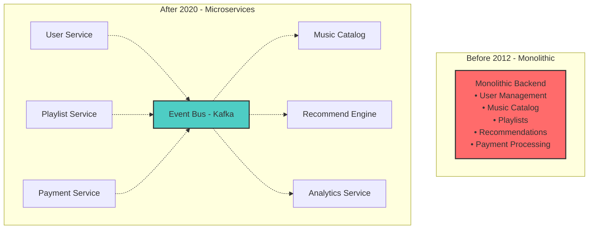
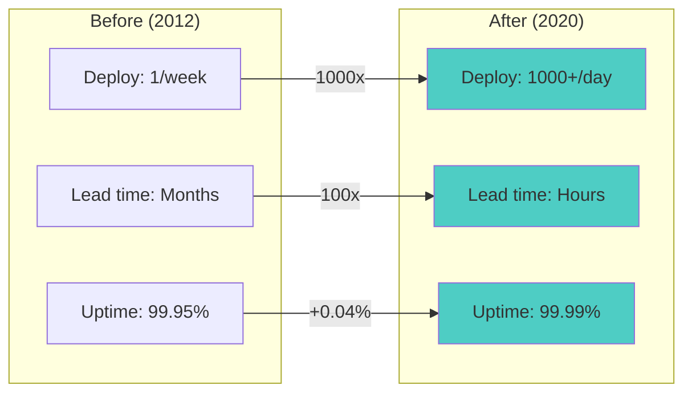
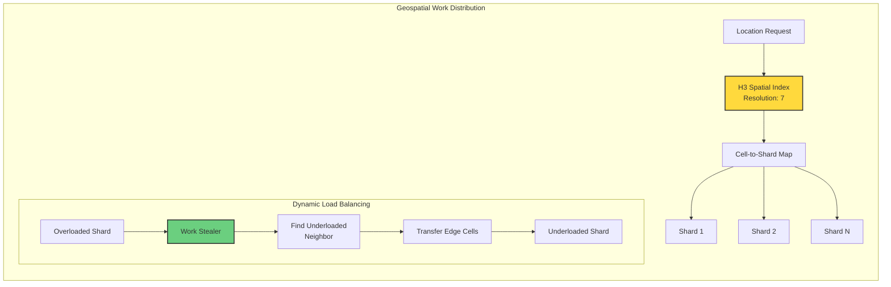
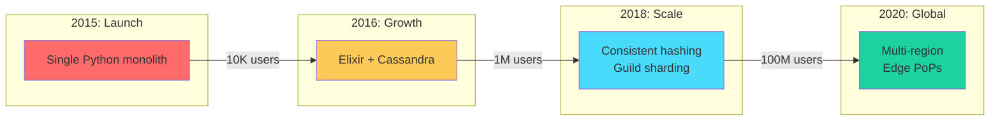
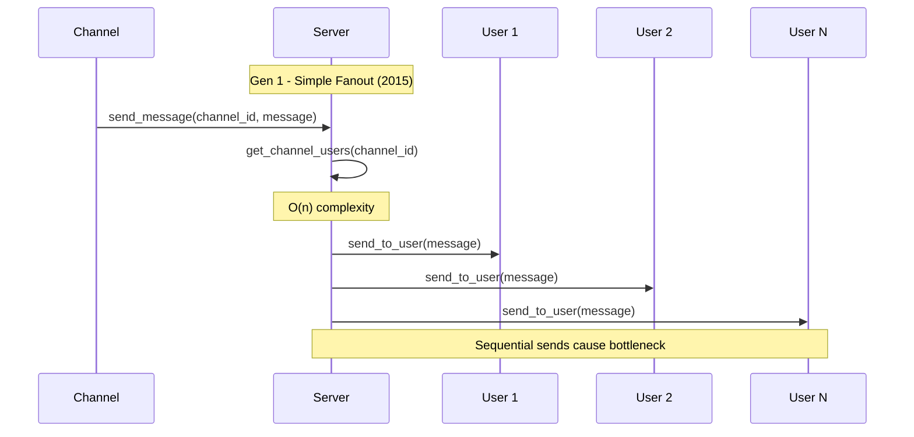
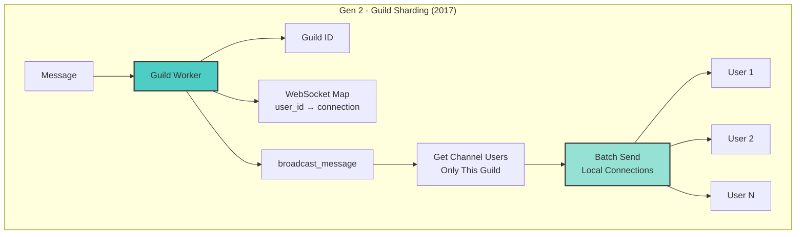
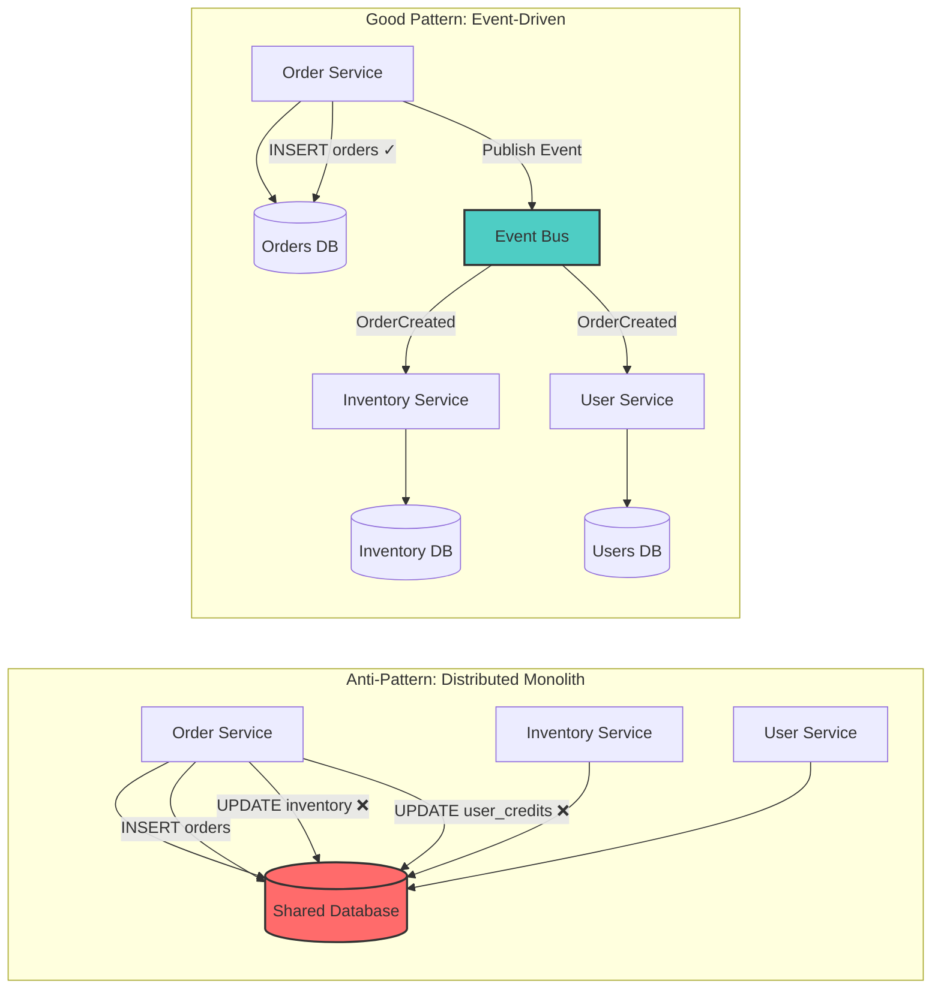
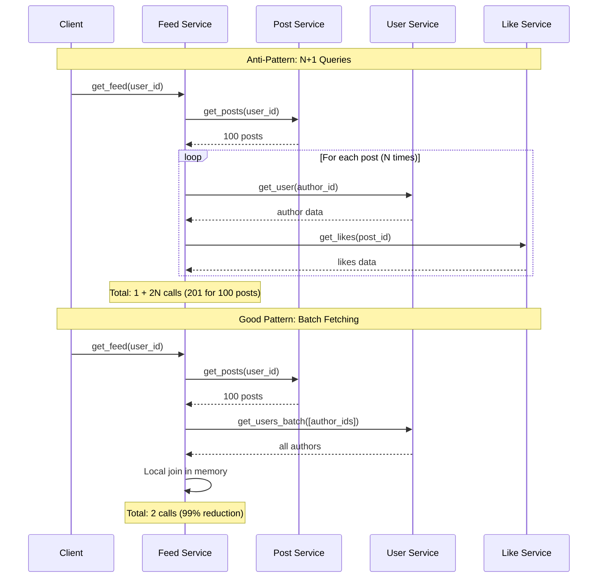
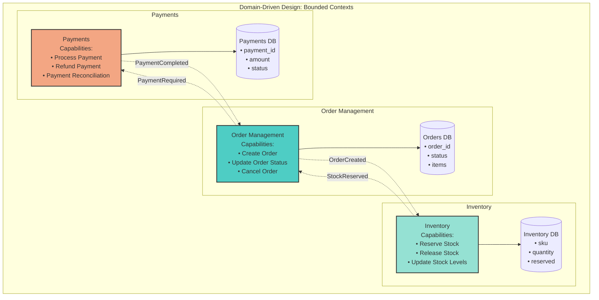

# Work Distribution Examples

## Real-World Case Studies

### 1. Spotify's Microservices Journey

!!! success "Key Takeaway"
    **Problem**: 100 → 1,800 engineers = 18x growth, 1x monolith
    **Solution**: Autonomous squads + microservices  
    **Result**: 1 deploy/week → 1000+ deploys/day

#### Timeline


#### Decision Matrix

| Decision | Alternative | Why This Won |
|----------|-------------|---------------|
| Autonomous squads | Central ops team | Faster iteration |
| Event streaming | Sync REST | Decoupling at scale |
| Service mesh | Hard-coded URLs | Dynamic discovery |
| Independent deploys | Coordinated releases | Team autonomy |


#### Results Dashboard



### 2. Uber's Geospatial Work Distribution

!!! success "Key Takeaway"
    **Problem**: 15M daily rides across 10,000 cities
    **Solution**: H3 hexagonal grid + dynamic work stealing
    **Result**: <15 second dispatch at 99.99% success rate

#### The Magic: H3 Spatial Indexing


#### Why H3 Beats Traditional Approaches

| Approach | Problem | H3 Solution |
|----------|---------|-------------|
| Lat/Long boxes | Uneven density | Uniform hexagons |
| ZIP codes | Political boundaries | Natural geography |
| Fixed grids | Can't adapt | 16 resolution levels |
| Geohash | Rectangle distortion | Equal-area hexagons |


#### Performance Metrics

| Metric | Value | Why It Matters |
|--------|-------|----------------|
| Dispatch time | <15 seconds | User satisfaction |
| Match rate | 99.99% | Revenue reliability |
| Cities covered | 10,000+ | Global scale |
| Daily rides | 15M+ | Peak load handling |


### 3. Discord's Message Distribution

!!! success "Key Takeaway" 
    **Problem**: 100M+ messages/day to 15M concurrent users
    **Solution**: Consistent hash rings + Elixir/Erlang BEAM
    **Result**: <100ms global message delivery

#### Architecture Evolution Timeline



**Gen 1: Simple Fanout (2015)**


**Gen 2: Guild Sharding (2017)**


**Gen 3: Consistent Hashing + Read Replicas (2020)**
```mermaid
flowchart LR
    subgraph "Gen 3 - Consistent Hashing + Replicas (2020)"
        M[Message] --> MR[Message Router]
        MR --> HR[Hash Ring]
        
        HR --> P[Primary Node<br/>Handles Writes]
        P --> WM[write_message()]
        
        HR --> R1[Replica 1]
        HR --> R2[Replica 2]
        HR --> R3[Replica 3]
        
        P -.->|Async Replication| R1
        P -.->|Async Replication| R2
        P -.->|Async Replication| R3
        
        R1 --> RD1[Handle Reads]
        R2 --> RD2[Handle Reads]
        R3 --> RD3[Handle Reads]
    end
    
    style P fill:#ff6b6b,stroke:#333,stroke-width:2px
    style R1 fill:#4ecdc4,stroke:#333,stroke-width:2px
    style R2 fill:#4ecdc4,stroke:#333,stroke-width:2px
    style R3 fill:#4ecdc4,stroke:#333,stroke-width:2px
```

### 4. MapReduce at Google

**Original Paper Implementation (2004)**

```mermaid
flowchart TB
    subgraph "MapReduce Execution Flow"
        IF[Input Files] --> MP[Map Phase]
        
        subgraph "Map Phase"
            M1[Mapper 1<br/>doc → (word,1)]
            M2[Mapper 2<br/>doc → (word,1)]
            MN[Mapper N<br/>doc → (word,1)]
        end
        
        MP --> B1[Barrier: Wait All Maps]
        B1 --> SP[Shuffle Phase<br/>Group by Key]
        
        SP --> RP[Reduce Phase]
        
        subgraph "Reduce Phase"
            R1[Reducer 1<br/>word → sum(counts)]
            R2[Reducer 2<br/>word → sum(counts)]
            RN[Reducer N<br/>word → sum(counts)]
        end
        
        RP --> O[Output Results]
    end
    
    style B1 fill:#ff6b6b,stroke:#333,stroke-width:2px
    style SP fill:#ffd93d,stroke:#333,stroke-width:2px
```

## Code Examples

### 1. Work Stealing Queue Implementation

```mermaid
flowchart TD
    subgraph "Work Stealing Queue Architecture"
        subgraph "Worker 1"
            W1[Worker 1] --> LQ1[Local Queue<br/>LIFO for owner]
            LQ1 --> |Push Bottom| T1[New Task]
            LQ1 --> |Pop Bottom| T2[Own Work]
        end
        
        subgraph "Worker 2"
            W2[Worker 2] --> LQ2[Local Queue<br/>FIFO for thieves]
            LQ2 --> |Steal Top| ST[Stolen Task]
        end
        
        subgraph "Work Distribution Flow"
            GW[get_work()] --> TL{Try Local Pop}
            TL -->|Success| RT[Return Task]
            TL -->|Empty| TS[Try Stealing]
            TS --> RV[Random Victim<br/>Selection]
            RV --> VS[Victim.steal()]
            VS -->|Success| RT
            VS -->|Failed| RV
        end
    end
    
    W1 -.->|Steal From| LQ2
    W2 -.->|Steal From| LQ1
    
    style W1 fill:#4ecdc4,stroke:#333,stroke-width:2px
    style W2 fill:#95e1d3,stroke:#333,stroke-width:2px
    style RV fill:#ffd93d,stroke:#333,stroke-width:2px
```

### 2. Consistent Hashing for Work Distribution

```mermaid
graph LR
    subgraph "Consistent Hashing Ring"
        subgraph "Hash Ring"
            VN1[Virtual Node 1:0<br/>Node A]
            VN2[Virtual Node 1:1<br/>Node A]
            VN3[Virtual Node 2:0<br/>Node B]
            VN4[Virtual Node 2:1<br/>Node B]
            VN5[Virtual Node 3:0<br/>Node C]
            VN6[Virtual Node 3:1<br/>Node C]
            
            VN1 --> VN2
            VN2 --> VN3
            VN3 --> VN4
            VN4 --> VN5
            VN5 --> VN6
            VN6 --> VN1
        end
        
        K[Key] --> H[MD5 Hash]
        H --> F[Find First<br/>Clockwise Node]
        F --> N[Assigned Node]
        
        subgraph "Operations"
            AN[add_node()<br/>• Create 150 virtual nodes<br/>• Insert into sorted ring]
            RN[remove_node()<br/>• Remove all virtual nodes<br/>• Update sorted keys]
            GN[get_node()<br/>• Hash key<br/>• Binary search<br/>• Return clockwise node]
            GNS[get_nodes()<br/>• Find N replicas<br/>• Walk ring clockwise<br/>• Skip duplicates]
        end
    end
    
    style H fill:#ffd93d,stroke:#333,stroke-width:2px
    style F fill:#4ecdc4,stroke:#333,stroke-width:2px
```

### 3. Batch Processing with Backpressure

```mermaid
flowchart TD
    subgraph "Batch Processing with Backpressure"
        S[submit(item)] --> BP{Backpressure<br/>Check}
        BP -->|Acquire Semaphore| A[Add to Pending]
        BP -->|Full| W[Wait]
        
        A --> BS{Batch Size<br/>Check}
        BS -->|< batch_size| ST[Start/Reset Timer]
        BS -->|>= batch_size| F[Flush Immediately]
        
        ST --> T[Timeout Task<br/>batch_timeout]
        T --> FT[Flush After Timeout]
        
        subgraph "Flush Process"
            F --> CT[Cancel Timer]
            FT --> CT
            CT --> PB[Process Batch]
            PB --> RS[Release Semaphores]
            RS --> E[Empty Pending]
        end
        
        subgraph "Configuration"
            C1[batch_size: 100]
            C2[batch_timeout: 1.0s]
            C3[max_pending: 10000]
        end
    end
    
    style BP fill:#ff6b6b,stroke:#333,stroke-width:2px
    style F fill:#4ecdc4,stroke:#333,stroke-width:2px
    style T fill:#ffd93d,stroke:#333,stroke-width:2px
```

### 4. Hierarchical Work Distribution

```mermaid
flowchart TB
    subgraph "Hierarchical Scheduling (Borg-like)"
        J[Job Submission] --> GS[Global Scheduler]
        
        GS --> FC{Find Suitable<br/>Clusters}
        FC -->|None Found| GQ[Global Queue]
        FC -->|Found| SC[Score Clusters]
        
        subgraph "Scoring Factors"
            L[Locality Score]
            U[Utilization<br/>(Lower Better)]
            Q[Queue Length<br/>(Penalty)]
        end
        
        SC --> BC[Best Cluster]
        
        subgraph "Cluster Level"
            BC --> LS[Local Scheduler]
            LS --> BP[Bin Packing<br/>Algorithm]
            BP --> MW{Find Machine<br/>Min Waste}
            MW -->|Found| AM[Assign to Machine]
            MW -->|Not Found| LQ[Local Queue]
        end
        
        subgraph "Machine Level"
            M1[Machine 1<br/>Cap: 100<br/>Used: 60]
            M2[Machine 2<br/>Cap: 100<br/>Used: 30]
            MN[Machine N<br/>Cap: 100<br/>Used: 80]
        end
    end
    
    L --> SC
    U --> SC
    Q --> SC
    
    style GS fill:#ff6b6b,stroke:#333,stroke-width:2px
    style BP fill:#4ecdc4,stroke:#333,stroke-width:2px
    style SC fill:#ffd93d,stroke:#333,stroke-width:2px
```

## Anti-Patterns and Solutions

### 1. The "Distributed Monolith"

**Anti-Pattern**: Services that can't be deployed independently



### 2. The "Chatty Services"

**Anti-Pattern**: Too many synchronous calls



### 3. The "Big Ball of Mud" in Microservices

**Anti-Pattern**: No clear boundaries

**Solution**: Domain-Driven Design


## Performance Comparisons

### Synchronous vs Asynchronous Work Distribution

```mermaid
gantt
    title Performance Comparison: Fetching 100 URLs
    dateFormat X
    axisFormat %s
    
    section Synchronous
    URL 1     :0, 0.5s
    URL 2     :0.5s, 0.5s
    URL 3     :1s, 0.5s
    ...       :1.5s, 47s
    URL 100   :48.5s, 0.5s
    Total ~50s :crit, 0, 50s
    
    section Threaded (10 workers)
    Batch 1 (10 URLs)  :0, 0.5s
    Batch 2 (10 URLs)  :0.5s, 0.5s
    Batch 3 (10 URLs)  :1s, 0.5s
    ...                :1.5s, 2s
    Batch 10 (10 URLs) :3.5s, 0.5s
    Total ~5s :crit, 0, 5s
    
    section Async
    All 100 URLs (concurrent) :0, 0.5s
    Total ~0.5s :crit, 0, 0.5s
```

| Approach | Time | Concurrency | Resource Usage |
|----------|------|-------------|----------------|
| **Synchronous** | ~50s | 1 (sequential) | Low CPU, Low Memory |
| **Threaded** | ~5s | 10 (thread pool) | Medium CPU, Medium Memory |
| **Async** | ~0.5s | 100 (event loop) | Low CPU, Low Memory |


## Key Takeaways

1. **Work distribution is about physics** - Network latency and data locality matter more than algorithms

2. **Conway's Law is real** - Your work distribution will mirror your organization structure

3. **Async > Sync for I/O** - But sync is simpler for CPU-bound work

4. **Batching amortizes costs** - But adds latency

5. **Stealing > Pushing** - Work stealing provides better load balancing

6. **Events > RPC for decoupling** - But add complexity

Remember: The best work distribution strategy depends on your specific constraints. Measure, don't guess.