# Work Distribution Exercises

## Exercise 1: Design a Video Processing Pipeline

**Scenario**: You're building a video processing service that needs to:
- Accept video uploads (100MB - 10GB files)
- Transcode to multiple formats (1080p, 720p, 480p)
- Generate thumbnails every 10 seconds
- Extract subtitles using speech recognition
- Scan for inappropriate content

**Constraints**:
- 10,000 videos uploaded daily
- 95% of videos are under 1GB
- Users expect processing within 30 minutes
- Budget: $50,000/month for infrastructure

**Tasks**:
1. Design the work distribution architecture
2. Calculate required compute resources
3. Handle failure scenarios
4. Optimize for the 95% case while handling outliers

**Considerations**:
- Should you split videos into chunks?
- How do you handle priority users?
- What happens if a worker dies mid-processing?
- How do you prevent reprocessing?

<details>
<summary>Solution Approach</summary>

### Architecture Design

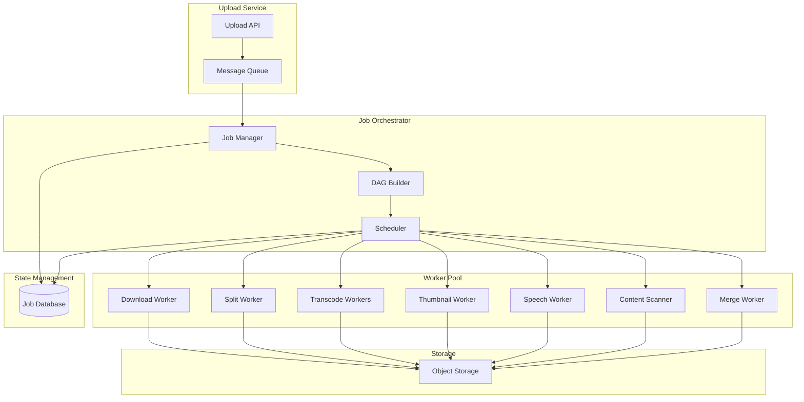

### Job Dependency DAG

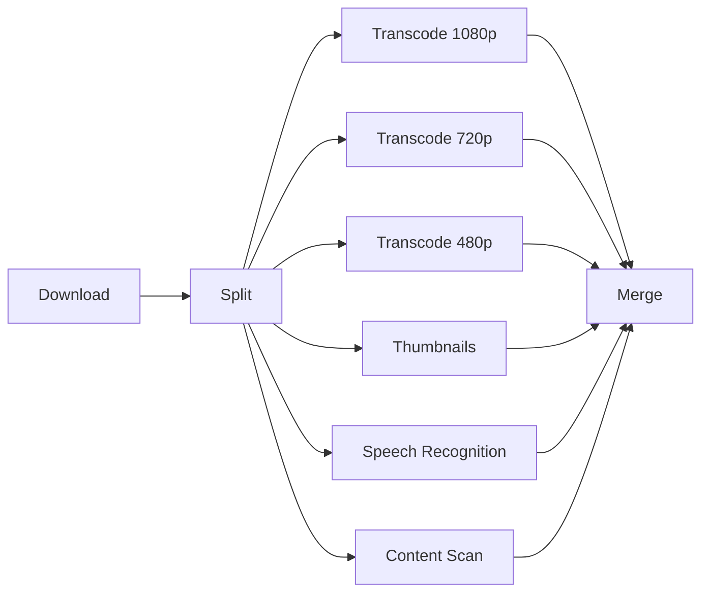

### Resource Calculation Table

| Component | Calculation | Result |
|-----------|-------------|---------|
| Daily Videos | 10,000 videos | - |
| Hourly Rate | 10,000 ÷ 24 | 417 videos/hour |
| Concurrent Processing | 30-min SLA × 417/60 | 208 videos |
| CPU per Video | 4 cores × 20 minutes | 80 core-minutes |
| Total Cores | 208 × 4 | 832 cores |
| With Headroom | 832 × 1.2 | 1,000 cores |
| Instance Type | c5.4xlarge (16 vCPUs) | - |
| Instance Count | 1,000 ÷ 16 | 63 instances |
| Monthly Cost | 63 × $0.68/hr × 730hr | ~$31,000 |


### Failure Handling Strategy

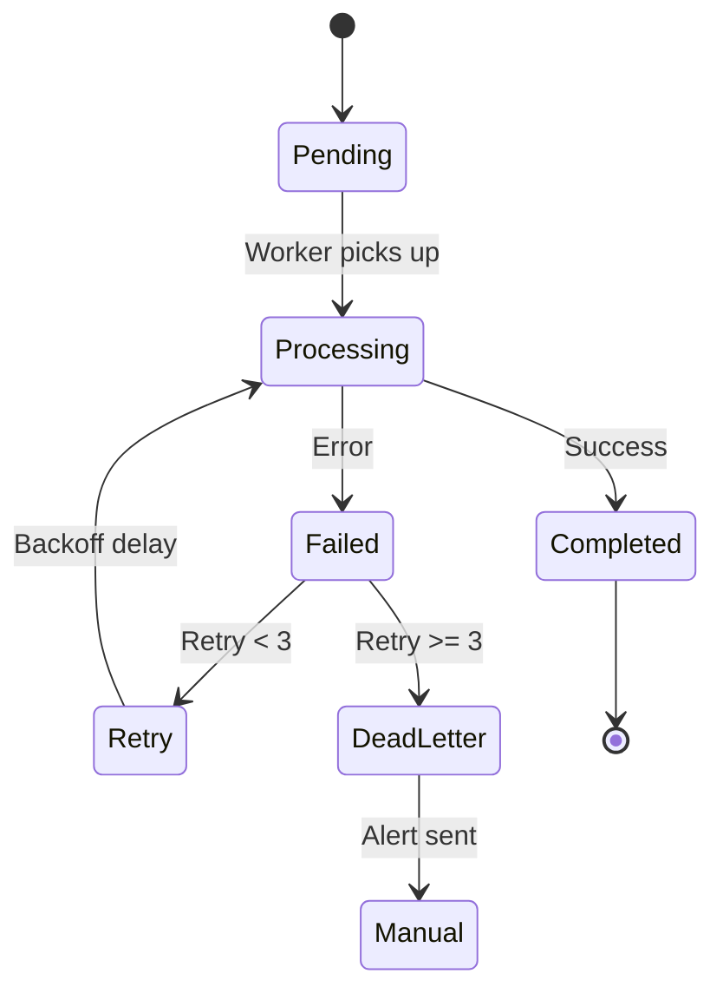

### Work Distribution Strategy

| Strategy | Approach | Benefits |
|----------|----------|----------|
| Chunking | Split videos into 60-second segments | Parallel processing, faster completion |
| Priority Queues | Separate queues for standard/premium | SLA guarantees for premium users |
| Consistent Hashing | Hash(video_id + task) → Worker | Even distribution, sticky assignment |
| Idempotency | Task ID = hash(video_id + task_type) | Safe retries, no duplicate work |


</details>

## Exercise 2: Distributed Web Crawler

**Scenario**: Build a web crawler that:
- Crawls 1 million pages per day
- Respects robots.txt and rate limits
- Extracts structured data (title, meta, links)
- Handles JavaScript-rendered pages
- Maintains crawl frontier efficiently

**Design Questions**:
1. How do you distribute URLs among workers?
2. How do you prevent duplicate crawling?
3. How do you handle politeness (rate limiting per domain)?
4. How do you manage the frontier (URLs to crawl)?

**Architecture Design Task**:
Design a distributed crawler system addressing all the above requirements.

<details>
<summary>Solution</summary>

### System Architecture

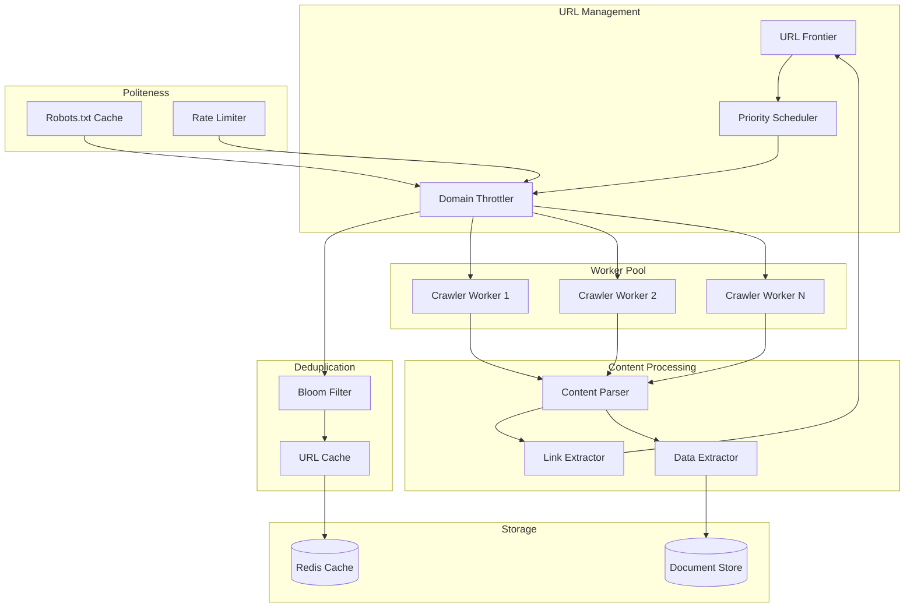

### URL Distribution Strategy

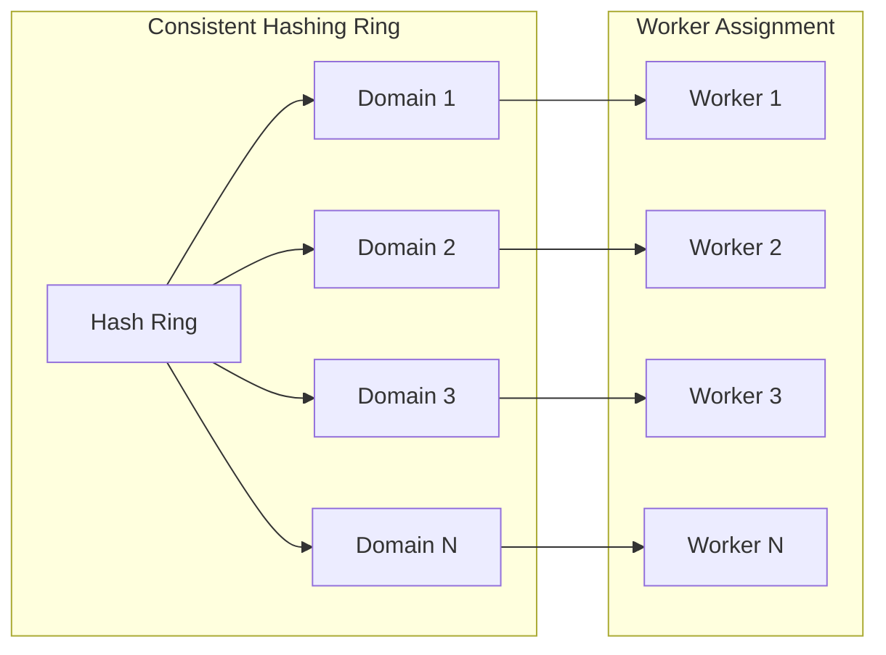

### Deduplication Architecture

| Component | Purpose | Implementation |
|-----------|---------|----------------|
| Bloom Filter | Fast membership test | 100M capacity, 0.1% false positive |
| URL Normalization | Canonical form | Remove fragments, lowercase domain |
| Content Hash | Near-duplicate detection | SimHash algorithm |
| Seen URLs Cache | Recent history | Redis with 7-day TTL |


### Politeness Strategy

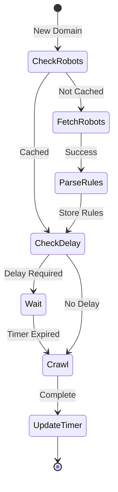

### Frontier Management

| Queue Type | Priority | Use Case |
|------------|----------|----------|
| High Priority | 1 | New domains, important pages |
| Medium Priority | 2 | Regular crawl, refresh |
| Low Priority | 3 | Deep pages, low value |
| Retry Queue | 4 | Failed attempts with backoff |


### Resource Calculation

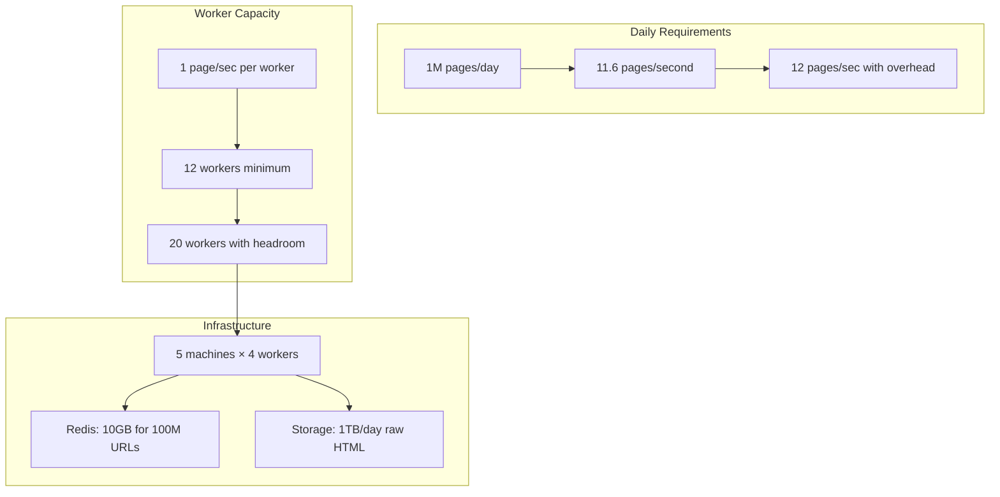

### JavaScript Rendering Pipeline

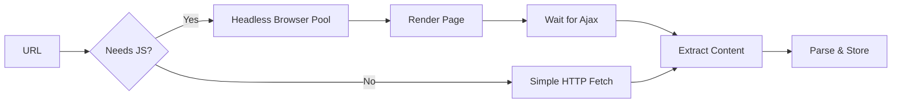

### Failure Handling Matrix

| Failure Type | Detection | Response | Retry Strategy |
|--------------|-----------|----------|----------------|
| Network Timeout | 30s limit | Mark failed | Exponential backoff: 1m, 5m, 30m |
| 4xx Errors | HTTP status | Log & skip | No retry for 404, retry others |
| 5xx Errors | HTTP status | Temporary failure | Linear backoff: 5m intervals |
| Rate Limited | 429 status | Back off domain | Double delay, max 60s |
| Parse Error | Exception | Log & continue | Retry with different parser |


</details>

## Exercise 3: Load Balancer Design

**Task**: Design a load balancer that supports multiple strategies:

**Requirements**:
1. Round-robin with equal distribution
2. Least connections with accurate tracking
3. Weighted round-robin based on server capacity
4. Consistent hashing with minimal redistribution
5. Response time tracking with exponential weighted average

**Design Challenge**: Create visual representations of each load balancing strategy and their trade-offs.

<details>
<summary>Solution</summary>

### Load Balancer Architecture

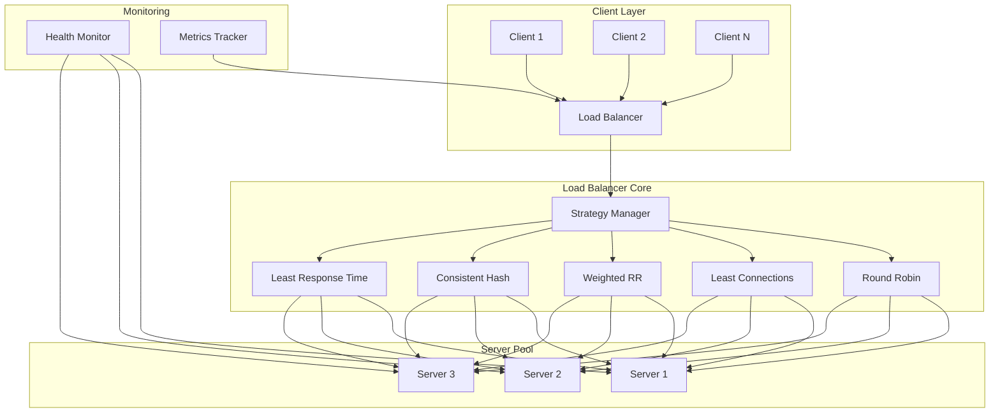

### Strategy Comparison Matrix

| Strategy | Distribution | State Required | Pros | Cons | Use Case |
|----------|--------------|----------------|------|------|----------|
| Round Robin | Equal | Counter | Simple, fair | Ignores server load | Homogeneous servers |
| Least Connections | Load-based | Connection count | Adapts to load | Requires tracking | Variable request duration |
| Weighted RR | Proportional | Counter + weights | Handles different capacities | Static weights | Known server capacities |
| Consistent Hash | Key-based | Hash ring | Minimal redistribution | Can be uneven | Stateful services |
| Least Response Time | Performance-based | Response metrics | Optimizes latency | Complex tracking | Latency-sensitive |


### Round Robin Visualization

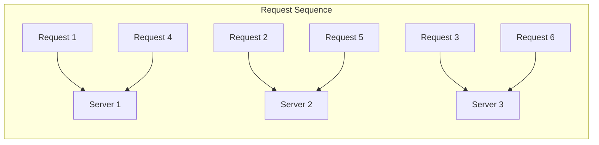

### Least Connections State

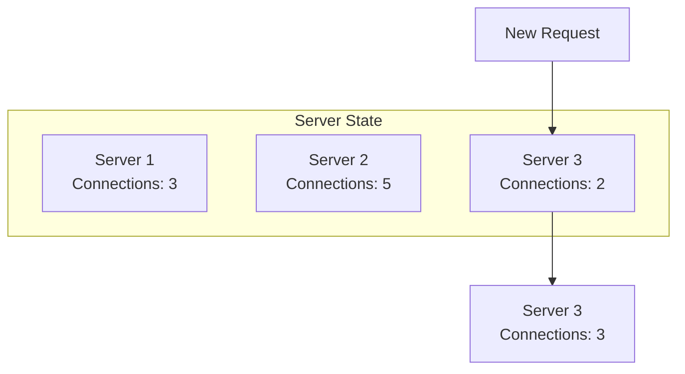

### Weighted Round Robin Distribution

| Server | Weight | Slots in Rotation | Percentage |
|--------|--------|-------------------|------------|
| Server 1 | 5 | [1,2,3,4,5] | 50% |
| Server 2 | 3 | [6,7,8] | 30% |
| Server 3 | 2 | [9,10] | 20% |


### Consistent Hashing Ring

```mermaid
graph LR
    subgraph "Hash Ring (0-359°)"
        H1[0°] --> S1[Server 1<br/>45°]
        S1 --> S2[Server 2<br/>150°]
        S2 --> S3[Server 3<br/>270°]
        S3 --> H1
    end
    
    K1[Key "user123"<br/>Hash: 72°] -.-> S2
    K2[Key "order456"<br/>Hash: 200°] -.-> S3
    K3[Key "item789"<br/>Hash: 310°] -.-> S1
```

### Response Time Tracking (EWMA)

```mermaid
graph TB
    subgraph "Response Time Evolution"
        T1[Time 1<br/>RT: 100ms] --> EWMA1[EWMA: 100ms]
        T2[Time 2<br/>RT: 200ms] --> EWMA2[EWMA: 130ms]
        T3[Time 3<br/>RT: 150ms] --> EWMA3[EWMA: 136ms]
        T4[Time 4<br/>RT: 80ms] --> EWMA4[EWMA: 119ms]
    end
    
    Note[EWMA = α × Current + (1-α) × Previous<br/>α = 0.3]
```

### Server Health States

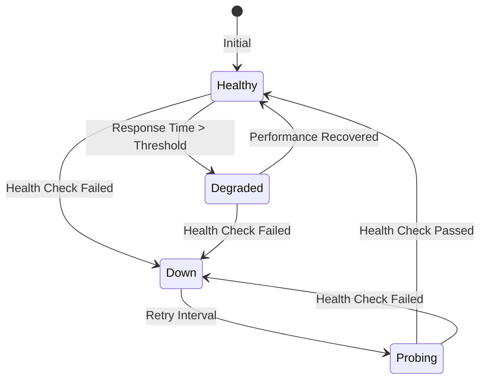

### Failure Handling Strategy

| Event | Detection | Action | Recovery |
|-------|-----------|--------|----------|
| Server Down | Health check timeout | Remove from pool | Periodic retry |
| High Latency | Response > 2× average | Reduce weight | Gradual increase |
| Connection Refused | TCP error | Mark as down | Exponential backoff |
| Partial Failure | Error rate > 10% | Circuit breaker | Probe with test traffic |


### Virtual Nodes Distribution

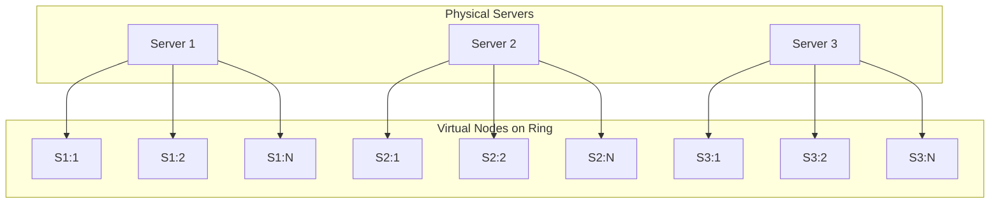

</details>

## Exercise 4: MapReduce System Design

**Task**: Design a MapReduce framework for distributed word counting.

**Requirements**:
1. Split data among mapper nodes
2. Run map phase in parallel
3. Shuffle and sort intermediate results
4. Run reduce phase
5. Handle failures and stragglers

**Design Challenge**: Visualize the data flow and optimization strategies.

<details>
<summary>Solution</summary>

### MapReduce Architecture

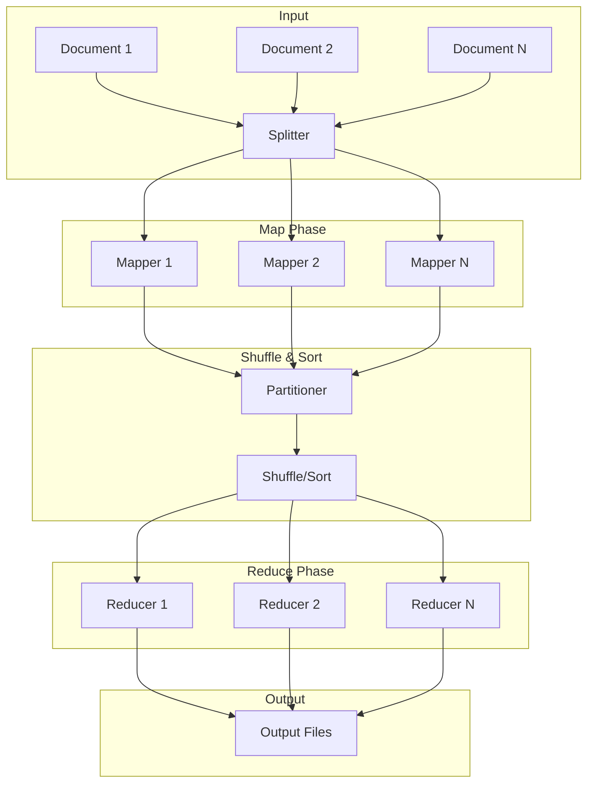

### Data Flow Example

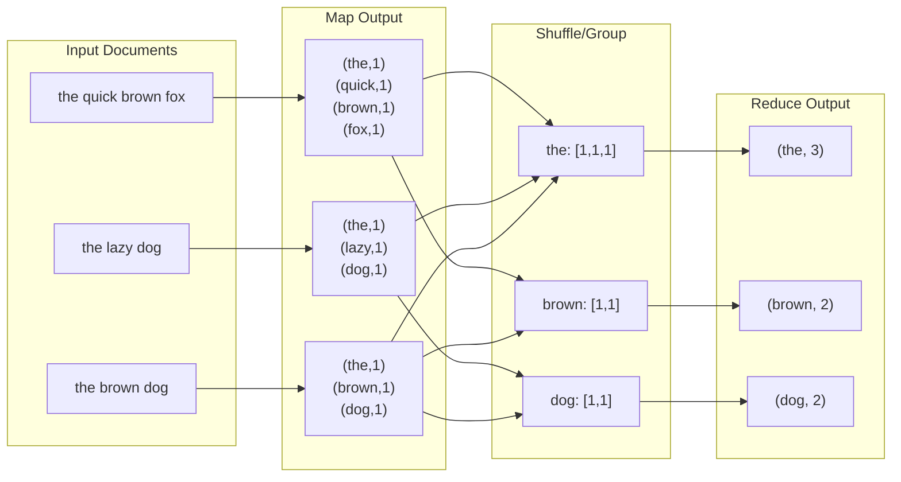

### Optimization Strategies

| Optimization | Description | Benefit |
|--------------|-------------|---------|
| Combiners | Local aggregation at mappers | Reduces shuffle data |
| Compression | Compress intermediate data | Reduces network I/O |
| Speculative Execution | Duplicate slow tasks | Handles stragglers |
| Data Locality | Process data where stored | Reduces data movement |
| In-Memory Shuffle | Keep intermediate data in RAM | Faster than disk |


### Combiner Optimization

```mermaid
graph TB
    subgraph "Without Combiner"
        WM[Mapper] --> WS["Shuffle:<br/>(the,1)<br/>(the,1)<br/>(the,1)"]
        WS --> WR[Reducer:<br/>sum([1,1,1]) = 3]
    end
    
    subgraph "With Combiner"
        CM[Mapper] --> CC[Combiner:<br/>local sum]
        CC --> CS["Shuffle:<br/>(the,3)"]
        CS --> CR[Reducer:<br/>sum([3]) = 3]
    end
```

### Failure Handling

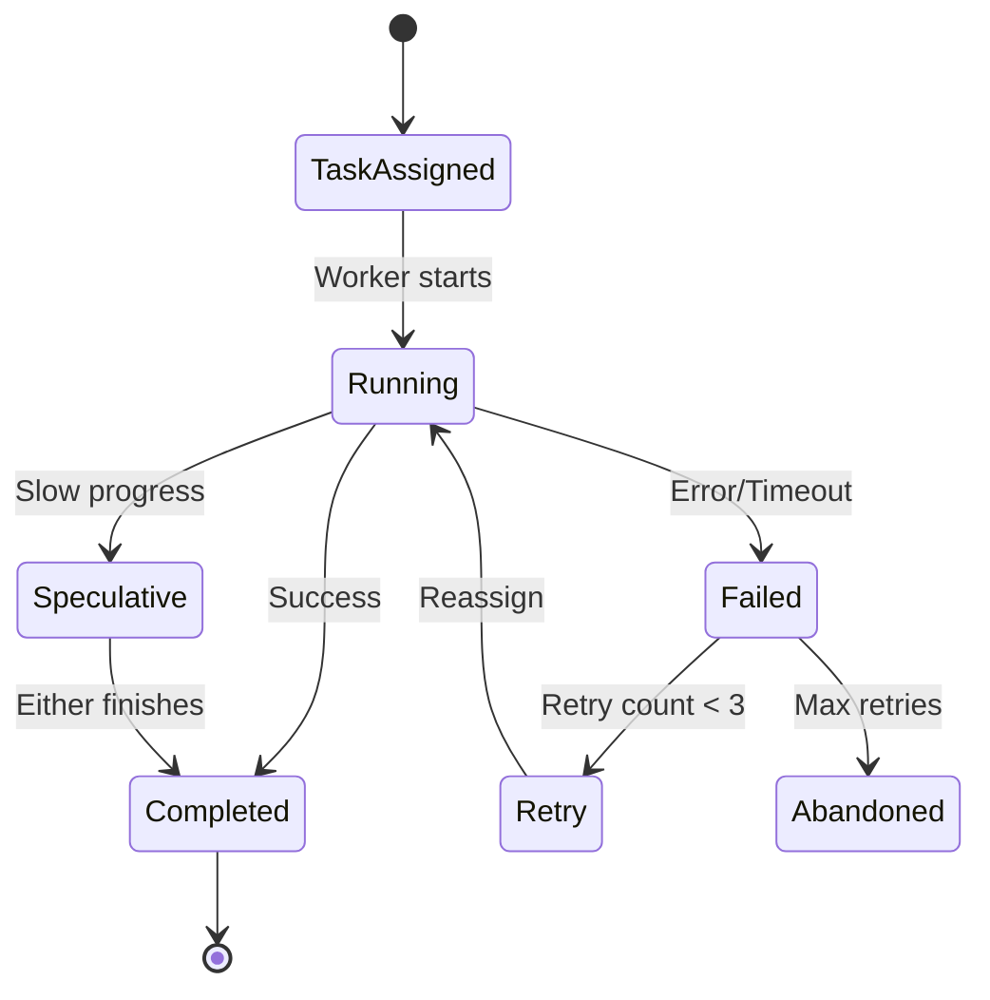

### Resource Allocation

| Phase | CPU Usage | Memory Usage | Network I/O | Disk I/O |
|-------|-----------|--------------|-------------|----------|
| Map | High | Medium | Low | Medium |
| Shuffle | Low | High | Very High | High |
| Sort | Medium | High | Low | High |
| Reduce | High | Medium | Low | Medium |


### Partitioning Strategy

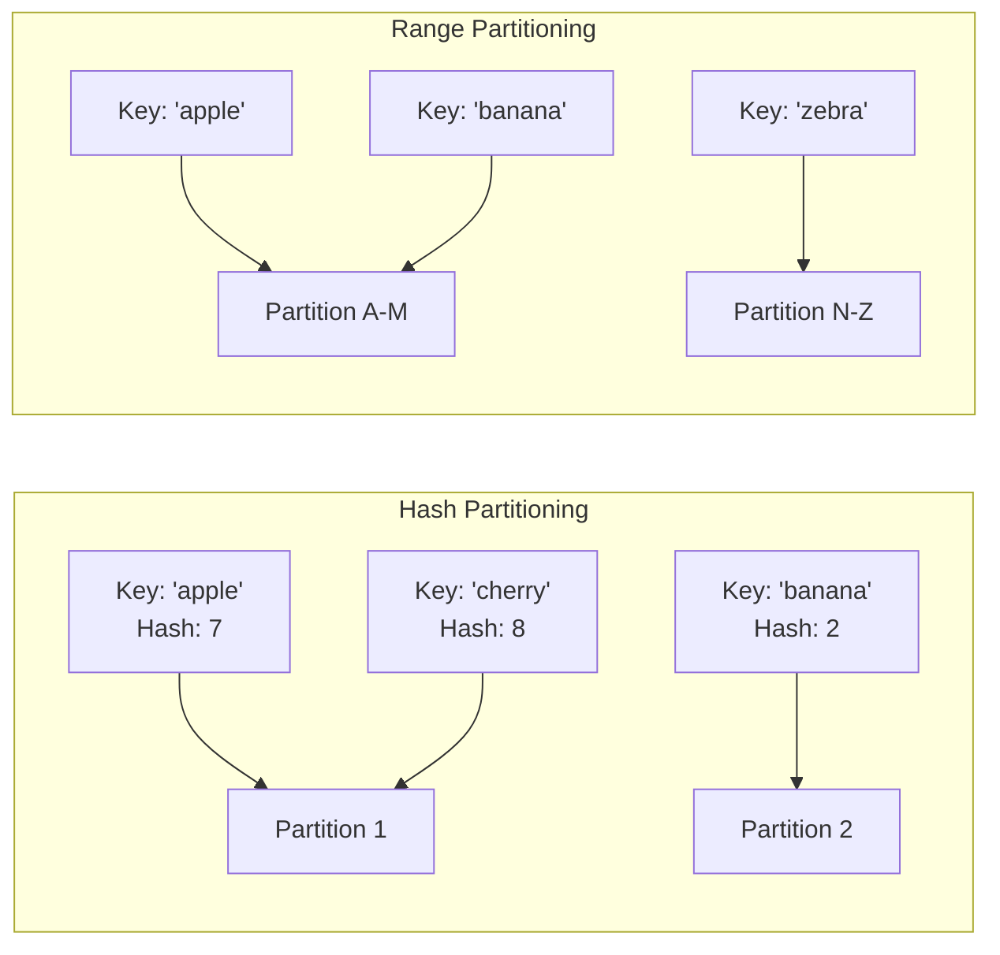

### Performance Metrics

```mermaid
graph TB
    subgraph "Job Timeline"
        T0[Start] --> MP[Map Phase: 5 min]
        MP --> SP[Shuffle Phase: 3 min]
        SP --> RP[Reduce Phase: 2 min]
        RP --> T1[Complete: 10 min]
    end
    
    subgraph "Bottleneck Analysis"
        B1[Slowest Mapper: 5 min]
        B2[Network Congestion: +2 min]
        B3[Skewed Reducer: +1 min]
    end
```

### Data Skew Handling

| Problem | Detection | Solution |
|---------|-----------|----------|
| Hot Keys | One reducer takes longer | Dynamic repartitioning |
| Large Values | Memory overflow | Stream processing |
| Uneven Input | Some mappers idle | Dynamic splitting |
| Slow Nodes | Progress monitoring | Speculative execution |


### MapReduce vs Stream Processing

```mermaid
graph LR
    subgraph "Batch MapReduce"
        BI[Input Data] --> BM[Map All]
        BM --> BS[Shuffle All]
        BS --> BR[Reduce All]
        BR --> BO[Output]
    end
    
    subgraph "Stream Processing"
        SI[Stream] --> SM[Map One]
        SM --> SR[Reduce Incremental]
        SR --> SO[Continuous Output]
        SI --> SM
    end
```

</details>

## Exercise 5: Distributed Task Queue

**Challenge**: Design a distributed task queue with the following features:
- Priority queues
- Task dependencies
- Retry logic
- Dead letter queue
- Rate limiting

**Design Task**: Create the architecture and data flow for a production-ready task queue system.

<details>
<summary>Solution</summary>

### Task Queue Architecture

```mermaid
graph TB
    subgraph "Task Submission"
        C1[Client 1] --> API[API Gateway]
        C2[Client 2] --> API
        API --> TV[Task Validator]
        TV --> TS[Task Store]
    end
    
    subgraph "Queue Management"
        TS --> PQ[Priority Queues]
        PQ --> HP[High Priority]
        PQ --> MP[Medium Priority]
        PQ --> LP[Low Priority]
        
        TS --> DG[Dependency Graph]
        DG --> DS[Dependency Scheduler]
    end
    
    subgraph "Worker Pool"
        DS --> WM[Worker Manager]
        WM --> W1[Worker 1]
        WM --> W2[Worker 2]
        WM --> WN[Worker N]
    end
    
    subgraph "Failure Handling"
        W1 --> FH[Failure Handler]
        W2 --> FH
        WN --> FH
        FH --> RQ[Retry Queue]
        FH --> DLQ[Dead Letter Queue]
    end
    
    subgraph "Rate Limiting"
        RL[Rate Limiter] --> WM
        TB[Token Bucket] --> RL
    end
```

### Task State Machine

```mermaid
stateDiagram-v2
    [*] --> Submitted: Task created
    Submitted --> Queued: Dependencies met
    Submitted --> Blocked: Has dependencies
    Blocked --> Queued: Dependencies complete
    Queued --> Assigned: Worker available
    Assigned --> Running: Worker starts
    Running --> Completed: Success
    Running --> Failed: Error
    Failed --> Retrying: Retry count < max
    Retrying --> Queued: Backoff complete
    Failed --> DeadLetter: Max retries
    Completed --> [*]
    DeadLetter --> [*]
```

### Priority Queue Structure

| Priority | Use Case | SLA | Example Tasks |
|----------|----------|-----|---------------|
| Critical (0) | User-facing, blocking | < 1s | Payment processing |
| High (1-3) | User-facing, async | < 10s | Email sending |
| Medium (4-6) | Background, important | < 1m | Report generation |
| Low (7-9) | Background, batch | < 1h | Analytics, cleanup |


### Dependency Management

```mermaid
graph LR
    subgraph "Task DAG"
        T1[Task A] --> T3[Task C]
        T2[Task B] --> T3
        T3 --> T4[Task D]
        T3 --> T5[Task E]
        T4 --> T6[Task F]
        T5 --> T6
    end
    
    subgraph "Execution Order"
        E1[1: A,B parallel] --> E2[2: C]
        E2 --> E3[3: D,E parallel]
        E3 --> E4[4: F]
    end
```

### Retry Strategy

```mermaid
graph TB
    subgraph "Exponential Backoff"
        F1[Failure 1] --> W1[Wait 1s]
        W1 --> F2[Failure 2]
        F2 --> W2[Wait 2s]
        W2 --> F3[Failure 3]
        F3 --> W3[Wait 4s]
        W3 --> F4[Failure 4]
        F4 --> DL[Dead Letter]
    end
    
    subgraph "Retry Configuration"
        RC[Max Retries: 3<br/>Base Delay: 1s<br/>Max Delay: 300s<br/>Jitter: ±20%]
    end
```

### Rate Limiting Design

```mermaid
graph LR
    subgraph "Token Bucket Algorithm"
        TB[Token Bucket<br/>Capacity: 100<br/>Refill: 10/sec] --> Check{Tokens > 0?}
        Check -->|Yes| Allow[Allow Task<br/>Tokens--]
        Check -->|No| Queue[Queue Task]
        
        Timer[Refill Timer] --> TB
    end
    
    subgraph "Per-Type Limits"
        T1[Email Tasks: 50/min]
        T2[API Calls: 100/sec]
        T3[DB Writes: 20/sec]
    end
```

### Worker Assignment Strategy

| Strategy | Description | Use Case |
|----------|-------------|----------|
| Capability-based | Match task requirements to worker skills | Specialized tasks |
| Load-based | Assign to least loaded worker | General tasks |
| Affinity-based | Prefer workers with cached data | Stateful tasks |
| Geographic | Assign to nearest worker | Latency-sensitive |


### Queue Monitoring Dashboard

```mermaid
graph TB
    subgraph "Queue Metrics"
        M1[Queue Depth]
        M2[Task Latency]
        M3[Success Rate]
        M4[Retry Rate]
    end
    
    subgraph "Worker Metrics"
        W1[Active Workers]
        W2[Utilization %]
        W3[Error Rate]
        W4[Avg Duration]
    end
    
    subgraph "Alerts"
        A1[Queue Depth > 1000]
        A2[Error Rate > 5%]
        A3[P99 Latency > SLA]
        A4[Workers < Min]
    end
```

### Dead Letter Queue Analysis

| Pattern | Cause | Action |
|---------|-------|--------|
| Poison Message | Malformed data | Fix validation |
| Dependency Loop | Circular deps | Detect cycles |
| Resource Exhaustion | OOM/Timeout | Increase limits |
| External Failure | API down | Circuit breaker |


### Scaling Strategy

```mermaid
graph LR
    subgraph "Auto-scaling Rules"
        QD[Queue Depth] --> ST{> Threshold?}
        ST -->|Yes| SU[Scale Up]
        ST -->|No| Check2{< Low Mark?}
        Check2 -->|Yes| SD[Scale Down]
        
        CPU[CPU Usage] --> ST2{> 80%?}
        ST2 -->|Yes| SU
        
        LAT[P99 Latency] --> ST3{> SLA?}
        ST3 -->|Yes| SU
    end
```

### Task Deduplication

```mermaid
graph TB
    subgraph "Dedup Strategy"
        NT[New Task] --> H[Hash(Type + Params)]
        H --> C{Exists in<br/>Recent Tasks?}
        C -->|Yes| R[Return Existing ID]
        C -->|No| S[Submit New Task]
        S --> RT[Recent Tasks Cache<br/>TTL: 1 hour]
    end
```

</details>

## Exercise 6: Distributed Aggregation

**Problem**: Design a distributed aggregation system that can:
- Count distinct values across nodes
- Compute percentiles
- Perform group-by operations
- Handle data skew

**Bonus**: Design approximate algorithms for better performance.

<details>
<summary>Solution</summary>

### Distributed Aggregation Architecture

```mermaid
graph TB
    subgraph "Data Sources"
        N1[Node 1] --> LA1[Local Aggregator]
        N2[Node 2] --> LA2[Local Aggregator]
        N3[Node N] --> LA3[Local Aggregator]
    end
    
    subgraph "Aggregation Tree"
        LA1 --> CA1[Combiner 1]
        LA2 --> CA1
        LA3 --> CA2[Combiner 2]
        CA1 --> GA[Global Aggregator]
        CA2 --> GA
    end
    
    subgraph "Results"
        GA --> RS[Result Store]
        RS --> API[Query API]
    end
```

### Count Distinct Strategies

| Algorithm | Accuracy | Memory | Use Case |
|-----------|----------|---------|----------|
| Exact HashSet | 100% | O(n) | Small cardinality |
| HyperLogLog | ~2% error | O(log log n) | Large cardinality |
| Bloom Filter | No false negatives | O(m) bits | Membership test |
| Count-Min Sketch | Overestimates | O(ε⁻¹ log δ⁻¹) | Frequency estimation |


### HyperLogLog Visualization

```mermaid
graph LR
    subgraph "Hash & Bucket"
        V1[Value: "user123"] --> H1[Hash: 10110...]
        H1 --> B1[Bucket: 101]
        H1 --> Z1[Leading Zeros: 3]
    end
    
    subgraph "Register Array"
        B1 --> R[Register[5] = max(3, old)]
    end
    
    subgraph "Cardinality Estimate"
        R --> F[Formula: α × m² / Σ(2^-M[j])]
    end
```

### Percentile Computation

```mermaid
graph TB
    subgraph "T-Digest Algorithm"
        D1[Data Stream] --> C1[Centroid 1<br/>Mean: 10<br/>Weight: 50]
        D1 --> C2[Centroid 2<br/>Mean: 25<br/>Weight: 100]
        D1 --> C3[Centroid 3<br/>Mean: 90<br/>Weight: 30]
    end
    
    subgraph "Merge Strategy"
        C1 --> M[Merge Similar<br/>Centroids]
        C2 --> M
        C3 --> M
        M --> NC[New Centroids<br/>Compressed]
    end
```

### Group-By Distribution

```mermaid
graph LR
    subgraph "Hash Partitioning"
        D1[Data: {A:1, B:2}] --> HP[Hash(GroupKey)]
        D2[Data: {A:3, C:4}] --> HP
        D3[Data: {B:5, C:6}] --> HP
    end
    
    subgraph "Shuffle to Reducers"
        HP --> R1[Reducer 1<br/>Group A: [1,3]]
        HP --> R2[Reducer 2<br/>Group B: [2,5]]
        HP --> R3[Reducer 3<br/>Group C: [4,6]]
    end
```

### Data Skew Handling

| Problem | Detection | Solution |
|---------|-----------|----------|
| Hot Keys | Monitor key distribution | Two-stage aggregation |
| Large Groups | Track group sizes | Sample and split |
| Uneven Partitions | Measure partition sizes | Dynamic rebalancing |
| Memory Pressure | Monitor heap usage | Spill to disk |


### Two-Stage Aggregation for Skew

```mermaid
graph TB
    subgraph "Stage 1: Local Pre-aggregation"
        HK[Hot Key: X] --> S1[Salt: X_1]
        HK --> S2[Salt: X_2]
        HK --> S3[Salt: X_3]
        
        S1 --> L1[Local Sum: 1000]
        S2 --> L2[Local Sum: 1500]
        S3 --> L3[Local Sum: 2000]
    end
    
    subgraph "Stage 2: Final Aggregation"
        L1 --> FA[Final Aggregator]
        L2 --> FA
        L3 --> FA
        FA --> R[Result: X = 4500]
    end
```

### Approximate Algorithms Comparison

```mermaid
graph TB
    subgraph "Count-Min Sketch"
        CM[Update] --> H1[Hash1(x)]
        CM --> H2[Hash2(x)]
        CM --> H3[Hash3(x)]
        H1 --> T1[Table[1][h1]++]
        H2 --> T2[Table[2][h2]++]
        H3 --> T3[Table[3][h3]++]
        Q[Query] --> Min[min(Table[i][hi(x)])]
    end
```

### Memory vs Accuracy Trade-offs

| Data Structure | Memory | Error Rate | Query Time |
|----------------|---------|------------|------------|
| Exact | O(n) | 0% | O(1) |
| HyperLogLog | 1.5KB | 2% | O(1) |
| T-Digest | O(compression) | 1% | O(log n) |
| Count-Min | O(1/ε × log 1/δ) | ε (one-sided) | O(d) |


### Streaming Aggregation Pipeline

```mermaid
graph LR
    subgraph "Ingestion"
        S[Stream] --> W[Window<br/>5 min]
    end
    
    subgraph "Processing"
        W --> LA[Local Agg]
        LA --> SK[Sketch Update]
        SK --> PS[Partial State]
    end
    
    subgraph "Merging"
        PS --> M[Merge Window]
        M --> GS[Global State]
        GS --> Q[Query Interface]
    end
```

### Group-By with Sampling

```mermaid
graph TB
    subgraph "Sampling Strategy"
        DS[Data Stream] --> RS[Reservoir Sample<br/>Size: 10K]
        RS --> EST[Estimate Groups]
        EST --> DEC{Large Skew?}
        DEC -->|Yes| TS[Two-Stage]
        DEC -->|No| Direct[Direct Group-By]
    end
```

### Performance Optimization Matrix

| Technique | CPU Impact | Memory Impact | Network Impact | Accuracy |
|-----------|------------|---------------|----------------|----------|
| Pre-aggregation | Low | Medium | Very Low | 100% |
| Sampling | Very Low | Low | Low | 95-99% |
| Sketching | Low | Very Low | Low | 95-98% |
| Compression | Medium | Low | Medium | 100% |
| Partitioning | Low | Medium | High | 100% |


</details>

## Thought Experiments

### 1. The Thundering Herd

Your service has 10,000 workers polling a queue. The queue becomes empty, then suddenly receives 1 task.
- What happens?
- How do you prevent 10,000 workers from waking up for 1 task?
- Design a solution that scales.

### 2. The Hot Partition

In your distributed system, 90% of requests go to 1% of your data (e.g., celebrity tweets).
- How do you detect hot partitions?
- How do you handle them without manual intervention?
- What are the trade-offs of different approaches?

### 3. The Graceful Degradation

Your system has 5 services: A → B → C → D → E
Service D is slow but not dead.
- How does this manifest to users?
- How do you prevent cascading failure?
- Design a degradation strategy.

## Reflection Questions

1. **When is work distribution not worth it?**
   - Consider the overhead of distribution
   - Think about Amdahl's Law

2. **How does CAP theorem affect work distribution?**
   - Can you have consistent work distribution?
   - What happens during network partitions?

3. **What's the relationship between work distribution and data distribution?**
   - Should computation follow data or vice versa?
   - When does this decision matter most?

## Further Challenges

1. **Design a distributed sort system**
   - Handle data larger than any single machine
   - Optimize for different data distributions
   - Visualize the merge strategy

2. **Design a distributed graph processor**
   - Handle graphs that don't fit in memory
   - Design PageRank or connected components algorithms
   - Show partitioning strategies

3. **Design a stream processing system**
   - Handle out-of-order events
   - Design windowing and watermark strategies
   - Illustrate exactly-once processing

Remember: These exercises are designed to make you think about trade-offs. There's rarely a "perfect" solution—only solutions that fit specific constraints better than others.