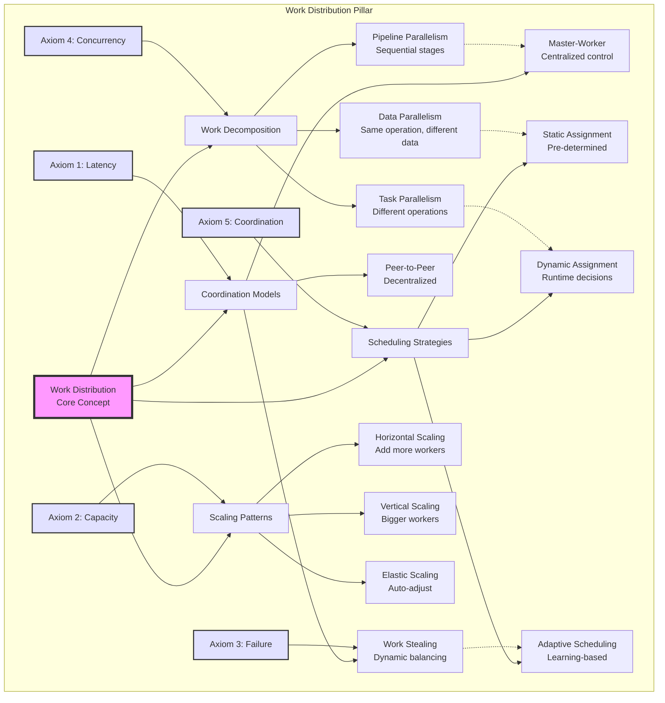

# Pillar 1: Distribution of Work

<div class="pillar-header">
  <div class="learning-objective">
    <strong>Learning Objective</strong>: Master the art of spreading computation without spreading complexity.
  </div>
</div>

---

## 🟢 Intuition: The Restaurant Kitchen Problem (5 min read)

Imagine a busy restaurant kitchen during dinner rush. Orders flood in: steaks, salads, desserts. One chef trying to cook everything would create a massive bottleneck. Instead, they organize:

- **Grill station**: Handles all meat
- **Salad station**: Prepares cold dishes
- **Pastry station**: Makes desserts
- **Expeditor**: Coordinates and quality checks

This is distributed work: **breaking down complex tasks into parallel, specialized units that can execute independently while maintaining overall coordination**.

💡 **Key Insight**: The best kitchens aren't the ones with the most chefs, but the ones with the smartest work distribution.

### Why This Matters

Every time you:
- Process millions of database records
- Encode video for streaming
- Handle thousands of API requests
- Train a machine learning model

You're solving the same fundamental problem: how to split work efficiently across available resources.

---

## 📋 Questions This Pillar Answers

<div class="questions-box">

### Fundamental Questions
- **How do I know if my workload can be parallelized?**
- **What's the optimal number of workers for my system?**
- **When does adding more workers make things worse?**
- **How do I prevent one slow task from blocking everything?**

### Design Questions
- **Should I use a push or pull model for work distribution?**
- **How do I handle heterogeneous worker capabilities?**
- **What's the right batch size for my operations?**
- **How do I implement fair scheduling with priorities?**

### Operational Questions
- **How do I detect and handle worker failures?**
- **What metrics should I monitor for work distribution?**
- **How do I prevent queue explosion under load?**
- **When should I implement work stealing?**

### Performance Questions
- **Why isn't my system scaling linearly with workers?**
- **How do I minimize coordination overhead?**
- **What's causing my P99 latency spikes?**
- **How do I balance latency vs throughput?**

</div>

---

## 🟡 Foundation: Understanding Work Distribution (15 min read)

### The Central Question

How do you break computation into pieces that can run on different machines while minimizing coordination overhead and maximizing throughput?

### Core Concepts

<div class="definition-box">
<strong>Work Distribution</strong> := The art of dividing computation across multiple processors, machines, or locations to achieve better performance than a single processor could provide.

**Key Dimensions**:
- **Parallelism**: How many things can happen at once
- **Coordination**: How much communication is needed
- **Locality**: Where data lives relative to computation
- **Granularity**: Size of individual work units
- **Dependencies**: How tasks relate to each other
</div>

### The Fundamental Trade-offs

!!! warning "No Free Lunch in Work Distribution"
    Every choice in work distribution involves trade-offs:
    
    **Parallelism vs Coordination Overhead**
    - More workers = More communication needed
    - Amdahl's Law: Serial portions limit speedup
    - Eventually coordination costs exceed computation savings
    
    **Latency vs Throughput**
    - Batching improves throughput but increases latency
    - Small batches = Low latency but more overhead
    - Must choose based on use case requirements
    
    **Simplicity vs Performance**
    - Simple round-robin vs complex work stealing
    - Static partitioning vs dynamic rebalancing
    - Easier to debug vs harder to optimize

### The Work Decomposition Matrix

```
Dimension        Options              Trade-offs                Real Example
---------        -------              ----------                ------------
Space           Single/Multi-node     Latency vs Isolation      Redis vs Cassandra
Time            Sync/Async           Consistency vs Throughput  REST vs Kafka
Data            Shared/Partitioned   Simplicity vs Scale        PostgreSQL vs MongoDB sharding
Control         Centralized/P2P      Coordination vs Resilience Kubernetes vs BitTorrent
```

### When Work Distribution Goes Wrong

!!! danger "Common Anti-Patterns"
    **The Overeager Parallelizer**: Breaking work into pieces smaller than coordination overhead
    - Example: 1000 workers processing 1000 items = mostly waiting
    - Solution: Batch work to amortize coordination costs
    
    **The Hotspot Creator**: Uneven work distribution causing bottlenecks
    - Example: All video encoding jobs hitting the same worker
    - Solution: Content-aware load balancing or work stealing
    
    **The Thundering Herd**: All workers starting simultaneously
    - Example: Cron job at midnight across all servers
    - Solution: Jittered starts and gradual ramp-up

### Concept Map: Work Distribution



This concept map shows how work distribution connects fundamental axioms to practical implementation patterns. Each branch represents a key decision area, with dotted lines showing common associations between concepts.

### Work Distribution Decision Framework

<div class="decision-framework">
<h4>🎯 When to Distribute Work</h4>

| Scenario | Distribute | Keep Centralized | Key Factors |
|----------|------------|------------------|-------------|
| **CPU-bound tasks** | ✅ If parallelizable | ❌ If sequential dependencies | Amdahl's Law applies |
| **I/O-bound tasks** | ✅ Always beneficial | ❌ If coordination > I/O time | Async/await patterns |
| **Large datasets** | ✅ If partitionable | ❌ If requires global view | Data locality matters |
| **Real-time processing** | ✅ If latency critical | ❌ If consistency critical | SLA requirements |
| **Batch processing** | ✅ If large batches | ❌ If small/quick batches | Overhead vs benefit |

<h4>🔧 Distribution Pattern Selection</h4>

| Pattern | Use When | Avoid When | Example Use Case |
|---------|----------|------------|------------------|
| **Master-Worker** | • Simple work units<br>• Central coordination OK<br>• Workers are stateless | • Master becomes bottleneck<br>• Need peer coordination<br>• Fault tolerance critical | Image processing pipeline |
| **Work Stealing** | • Uneven work distribution<br>• Dynamic load<br>• Workers have queues | • Work units tiny<br>• Strict ordering required<br>• Network overhead high | Game engine tasks |
| **MapReduce** | • Data parallelism<br>• Aggregation needed<br>• Batch processing | • Real-time requirements<br>• Small datasets<br>• Complex dependencies | Log analysis |
| **Pipeline** | • Sequential stages<br>• Different processing rates<br>• Stream processing | • Stages tightly coupled<br>• Need random access<br>• Variable stage times | Video encoding |
| **Scatter-Gather** | • Parallel queries<br>• Result aggregation<br>• Read-heavy | • Write operations<br>• Partial results bad<br>• Tight deadlines | Search engines |

</div>

### Simple Example: Processing User Uploads

When a user uploads a photo to Instagram:

```python
# Sequential (slow)
def process_upload(photo):
    resized = resize_image(photo)        # 500ms
    thumbnails = generate_thumbnails(resized)  # 300ms
    filters = apply_filters(resized)     # 400ms
    metadata = extract_metadata(photo)    # 100ms
    store_all(resized, thumbnails, filters, metadata)  # 200ms
    # Total: 1500ms sequential

# Parallel (fast)
async def process_upload_parallel(photo):
    # These can all happen at the same time!
    tasks = [
        resize_image(photo),
        extract_metadata(photo)
    ]
    resized, metadata = await asyncio.gather(*tasks)
    
    # These depend on resized, but can run in parallel
    tasks = [
        generate_thumbnails(resized),
        apply_filters(resized)
    ]
    thumbnails, filters = await asyncio.gather(*tasks)
    
    await store_all(resized, thumbnails, filters, metadata)
    # Total: ~700ms (resize + thumbnails/filters + store)
```

### Amdahl's Law: The Fundamental Limit

No matter how many workers you add, speedup is limited by sequential parts:

```
Speedup = 1 / (S + P/N)

Where:
S = Sequential fraction (can't be parallelized)
P = Parallel fraction (can be parallelized)
N = Number of processors

Example:
If 10% must be sequential (S=0.1):
- With 10 processors: Speedup = 5.3x (not 10x!)
- With 100 processors: Speedup = 9.2x (not 100x!)
- With ∞ processors: Speedup = 10x (hard limit)
```

---

## 🔴 Deep Dive: Engineering Work Distribution (30 min read)

### Real Failure: The Netflix Encoding Disaster

**Company**: Netflix  
**Date**: 2008  
**Impact**: 3-day outage for new content

**The Problem**: 
- Monolithic encoding server
- Single queue for all videos
- One crash = entire pipeline stops
- 12-hour encode time for 2-hour movie

**The Root Cause**:
```python
# Original monolithic approach
class VideoEncoder:
    def encode_movie(self, movie_file):
        # Problem 1: Can't parallelize within movie
        for minute in range(movie.duration_minutes):
            encode_minute(minute)  # 6 minutes per minute of video!
            
        # Problem 2: One failure loses all progress
        if random() < 0.01:  # 1% chance of failure
            raise Exception("Encoding failed at minute " + minute)
            # Must restart from beginning!
            
        # Problem 3: Can't scale horizontally
        # Adding more servers doesn't help single movie encode faster
```

**The Fix: Distributed Encoding Pipeline**:
```python
class DistributedVideoEncoder:
    def encode_movie(self, movie_file):
        # Split into 10-second chunks
        chunks = split_into_chunks(movie_file, duration_seconds=10)
        
        # Map: Encode each chunk independently
        encoding_tasks = []
        for i, chunk in enumerate(chunks):
            task = EncodingTask(
                chunk_id=i,
                chunk_data=chunk,
                output_formats=['1080p', '720p', '480p'],
                retry_on_failure=True
            )
            encoding_tasks.append(submit_to_queue(task))
        
        # Reduce: Combine when all complete
        encoded_chunks = wait_for_all(encoding_tasks)
        final_video = stitch_chunks(encoded_chunks)
        
        return final_video

# Benefits:
# - 720 chunks can encode in parallel (2hr movie)
# - Failure only affects 10-second chunk
# - Scales linearly with workers
# - 12 hours → 20 minutes for 2-hour movie
```

### Work Distribution Patterns

#### 1. Master-Worker Pattern

```python
class MasterWorkerSystem:
    def __init__(self, num_workers):
        self.task_queue = Queue()
        self.result_queue = Queue()
        self.workers = []
        
        for i in range(num_workers):
            worker = Worker(self.task_queue, self.result_queue)
            worker.start()
            self.workers.append(worker)
    
    def distribute_work(self, tasks):
        # Master distributes
        for task in tasks:
            self.task_queue.put(task)
        
        # Collect results
        results = []
        for _ in tasks:
            result = self.result_queue.get()
            results.append(result)
            
        return results

class Worker(Thread):
    def __init__(self, task_queue, result_queue):
        self.task_queue = task_queue
        self.result_queue = result_queue
        
    def run(self):
        while True:
            task = self.task_queue.get()
            if task is None:
                break
                
            try:
                result = self.process_task(task)
                self.result_queue.put(result)
            except Exception as e:
                self.result_queue.put(Error(task, e))
```

**Pros**: Simple, centralized control  
**Cons**: Master is bottleneck and SPOF

#### 2. Work-Stealing Pattern

```python
class WorkStealingScheduler:
    def __init__(self, num_workers):
        self.workers = []
        
        for i in range(num_workers):
            worker = WorkStealingWorker(worker_id=i)
            self.workers.append(worker)
            
        # Each worker knows about others for stealing
        for worker in self.workers:
            worker.set_peers(self.workers)
    
class WorkStealingWorker:
    def __init__(self, worker_id):
        self.id = worker_id
        self.local_queue = deque()  # Double-ended queue
        self.peers = []
        
    def add_task(self, task):
        # Push to bottom of local queue
        self.local_queue.append(task)
    
    def get_task(self):
        # Try local queue first (LIFO for cache locality)
        if self.local_queue:
            return self.local_queue.pop()
            
        # Local queue empty, try stealing
        return self.steal_task()
    
    def steal_task(self):
        # Randomly try to steal from peers
        victims = random.sample(self.peers, len(self.peers))
        
        for victim in victims:
            if victim.id == self.id:
                continue
                
            # Steal from top (FIFO) to minimize contention
            if victim.local_queue:
                try:
                    return victim.local_queue.popleft()
                except IndexError:
                    continue  # Someone else stole it
                    
        return None  # No work available

# Why this works brilliantly:
# 1. No central coordinator (resilient)
# 2. Automatic load balancing
# 3. Good cache locality (process own work first)
# 4. Minimal contention (steal from opposite end)
```

#### 3. MapReduce Pattern

```python
class MapReduceJob:
    def __init__(self, map_func, reduce_func):
        self.map_func = map_func
        self.reduce_func = reduce_func
        
    def run(self, input_data, num_workers):
        # Phase 1: Map
        chunks = self.split_input(input_data, num_workers)
        map_results = []
        
        with ThreadPoolExecutor(max_workers=num_workers) as executor:
            futures = []
            for chunk in chunks:
                future = executor.submit(self.map_phase, chunk)
                futures.append(future)
            
            for future in as_completed(futures):
                map_results.extend(future.result())
        
        # Phase 2: Shuffle (group by key)
        shuffled = defaultdict(list)
        for key, value in map_results:
            shuffled[key].append(value)
        
        # Phase 3: Reduce
        final_results = {}
        with ThreadPoolExecutor(max_workers=num_workers) as executor:
            futures = {}
            for key, values in shuffled.items():
                future = executor.submit(self.reduce_func, key, values)
                futures[future] = key
            
            for future in as_completed(futures):
                key = futures[future]
                final_results[key] = future.result()
                
        return final_results
    
    def map_phase(self, chunk):
        results = []
        for item in chunk:
            # map_func emits (key, value) pairs
            results.extend(self.map_func(item))
        return results

# Classic word count example
def word_count_map(document):
    for word in document.split():
        yield (word.lower(), 1)

def word_count_reduce(word, counts):
    return sum(counts)

# Usage
job = MapReduceJob(word_count_map, word_count_reduce)
word_counts = job.run(documents, num_workers=10)
```

### The Coordination Tax

Every distributed system pays a coordination tax:

<div class="coordination-tax">
<h4>💰 Coordination Cost Breakdown</h4>

```
Total Time = Useful Work + Coordination Overhead

Coordination Overhead:
├─ Network RTT: 1ms (send task + receive result)
├─ Serialization: 0.1ms (encode/decode data)  
├─ Scheduling: 0.5ms (decide which worker)
└─ Per-worker cost: 2.2ms × number of workers
```

**Efficiency Analysis**:

| Task Size | 10 Workers | 100 Workers | 1000 Workers |
|-----------|------------|-------------|---------------|
| **1ms** | 4% efficient | 0.4% efficient | 0.04% efficient |
| **10ms** | 31% efficient | 4% efficient | 0.4% efficient |
| **100ms** | 82% efficient | 31% efficient | 4% efficient |
| **1000ms** | 98% efficient | 82% efficient | 31% efficient |

**Key Insight**: 
```
Break-even Task Size = Coordination Overhead
- Small tasks: coordination costs dominate
- Large tasks: parallel benefits win
- Sweet spot: 100x coordination overhead
```

**Visual Break-Even Analysis**:
```
Not Worth Distributing     |     Worth Distributing
                          |
Task: 1ms                 |     Task: 100ms
Overhead: 22ms            |     Overhead: 22ms
Efficiency: 4%            |     Efficiency: 82%
```
</div>

### Load Balancing Strategies

<div class="load-balancing-strategies">
<h4>⚖️ Load Balancing Decision Matrix</h4>

| Strategy | When to Use | Pros | Cons |
|----------|-------------|------|------|
| **Round Robin** | Identical servers | Simple, fair | Ignores load |
| **Least Connections** | Mixed workloads | Adapts to load | Tracking overhead |
| **Weighted Round Robin** | Different capacities | Handles heterogeneity | Static weights |
| **Response Time** | Latency-sensitive | Best performance | Complex tracking |

**Least Connections Algorithm**:
```
Server Selection Process:
1. Count active connections per server
2. Choose server with minimum count
3. Track connection lifecycle
4. Update counts on completion

Example State:
Server A: 3 active connections  ← Choose this
Server B: 7 active connections
Server C: 5 active connections
```

**Load Balancer Metrics Dashboard**:
```
┌─────────────┬──────────┬─────────────┬─────────────┐
│   Server    │  Active  │  Avg Time   │ Error Rate  │
├─────────────┼──────────┼─────────────┼─────────────┤
│  Server A   │    3     │    45ms     │    0.1%     │
│  Server B   │    7     │    67ms     │    0.3%     │
│  Server C   │    5     │    52ms     │    0.2%     │
└─────────────┴──────────┴─────────────┴─────────────┘
```
</div>

---

## 🟣 Expert: Theory and Advanced Techniques (45 min read)

### Theoretical Foundations

#### Universal Scalability Law

Neil Gunther's USL extends Amdahl's Law to include coherency costs:

```
C(N) = N / (1 + α(N-1) + βN(N-1))

Where:
C(N) = Capacity/throughput with N processors
α = Contention coefficient (serialization)
β = Coherency coefficient (coordination)
```

**Visual Scalability Analysis**:

<div class="scalability-analysis">
<h4>📊 USL Scalability Predictions</h4>

| Workers (N) | Linear Ideal | Contention Only (α=0.1) | With Coordination (β=0.01) |
|-------------|--------------|-------------------------|----------------------------|
| 1 | 1.0x | 1.0x | 1.0x |
| 10 | 10.0x | 5.3x | 4.1x |
| 50 | 50.0x | 9.1x | 3.8x |
| 100 | 100.0x | 9.9x | 2.5x |
| 500 | 500.0x | 10.0x | 0.8x ⚠️ |

**Key Insight**: System performance peaks then degrades!</div>

def find_optimal_workers(alpha, beta):
    """Find N that maximizes capacity"""
    max_capacity = 0
    optimal_n = 1
    
    for n in range(1, 1000):
        capacity = universal_scalability_law(n, alpha, beta)
        if capacity > max_capacity:
            max_capacity = capacity
            optimal_n = n
        elif capacity < max_capacity * 0.95:
            break  # Declining significantly
    
    return optimal_n, max_capacity

# Example: Different workload characteristics
workloads = [
    ("Embarrassingly Parallel", 0.01, 0.0001),
    ("Moderate Coordination", 0.05, 0.001),
    ("High Contention", 0.1, 0.01),
    ("Extreme Coordination", 0.2, 0.02)
]

for name, alpha, beta in workloads:
    optimal_n, max_cap = find_optimal_workers(alpha, beta)
    print(f"{name}:")
    print(f"  Optimal workers: {optimal_n}")
    print(f"  Max speedup: {max_cap:.1f}x")
    print(f"  At 2x workers: {universal_scalability_law(optimal_n*2, alpha, beta):.1f}x")
```

#### Queue Theory for Work Distribution

Little's Law provides fundamental insights:

```
L = λW

Where:
L = Average number of items in system
λ = Average arrival rate
W = Average time in system
```

Applied to work queues:

```python
class QueueAnalyzer:
    def __init__(self):
        self.arrivals = []
        self.departures = []
        
    def analyze_queue_behavior(self):
        # Calculate key metrics
        arrival_rate = len(self.arrivals) / (self.arrivals[-1] - self.arrivals[0])
        
        # Average time in system
        total_time = sum(d - a for a, d in zip(self.arrivals, self.departures))
        avg_time = total_time / len(self.departures)
        
        # Little's Law validation
        avg_queue_length = arrival_rate * avg_time
        
        # M/M/1 queue formulas (if Poisson arrivals, exponential service)
        utilization = arrival_rate / service_rate
        avg_wait_time = utilization / (service_rate * (1 - utilization))
        
        return {
            'arrival_rate': arrival_rate,
            'avg_time_in_system': avg_time,
            'avg_queue_length': avg_queue_length,
            'utilization': utilization,
            'avg_wait_time': avg_wait_time
        }
```

### Advanced Work Distribution Algorithms

#### Consistent Hashing with Virtual Nodes

```python
class ConsistentHashRing:
    def __init__(self, nodes, virtual_nodes=150):
        self.ring = {}
        self.sorted_keys = []
        self.virtual_nodes = virtual_nodes
        self.nodes = nodes
        
        self._build_ring()
    
    def _hash(self, key):
        return int(hashlib.md5(key.encode()).hexdigest(), 16)
    
    def _build_ring(self):
        for node in self.nodes:
            for i in range(self.virtual_nodes):
                virtual_key = f"{node}:{i}"
                hash_value = self._hash(virtual_key)
                self.ring[hash_value] = node
                
        self.sorted_keys = sorted(self.ring.keys())
    
    def get_node(self, key):
        """Find node responsible for key"""
        if not self.ring:
            return None
            
        hash_value = self._hash(key)
        
        # Binary search for first node >= hash
        idx = bisect_right(self.sorted_keys, hash_value)
        
        # Wrap around to first node
        if idx == len(self.sorted_keys):
            idx = 0
            
        return self.ring[self.sorted_keys[idx]]
    
    def add_node(self, node):
        """Add node with minimal disruption"""
        self.nodes.append(node)
        
        for i in range(self.virtual_nodes):
            virtual_key = f"{node}:{i}"
            hash_value = self._hash(virtual_key)
            self.ring[hash_value] = node
            bisect.insort(self.sorted_keys, hash_value)
    
    def remove_node(self, node):
        """Remove node and rebalance"""
        self.nodes.remove(node)
        
        for i in range(self.virtual_nodes):
            virtual_key = f"{node}:{i}"
            hash_value = self._hash(virtual_key)
            del self.ring[hash_value]
            self.sorted_keys.remove(hash_value)
    
    def get_replication_nodes(self, key, n=3):
        """Get N nodes for replication"""
        if not self.ring:
            return []
            
        hash_value = self._hash(key)
        idx = bisect_right(self.sorted_keys, hash_value)
        
        nodes = []
        seen = set()
        
        for i in range(len(self.sorted_keys)):
            actual_idx = (idx + i) % len(self.sorted_keys)
            node = self.ring[self.sorted_keys[actual_idx]]
            
            if node not in seen:
                nodes.append(node)
                seen.add(node)
                
            if len(nodes) >= n:
                break
                
        return nodes
```

#### Two-Phase Commit for Distributed Work

```python
class TwoPhaseCommitCoordinator:
    def __init__(self, participants):
        self.participants = participants
        self.tx_log = []
        
    def execute_transaction(self, transaction_id, work_items):
        """Execute distributed transaction with 2PC"""
        
        # Phase 1: Prepare
        prepare_results = {}
        
        for participant, work in zip(self.participants, work_items):
            try:
                can_commit = participant.prepare(transaction_id, work)
                prepare_results[participant] = can_commit
                self.tx_log.append(('PREPARE', transaction_id, participant.id, can_commit))
            except Exception as e:
                prepare_results[participant] = False
                self.tx_log.append(('PREPARE_FAILED', transaction_id, participant.id, str(e)))
        
        # Decision point
        all_prepared = all(prepare_results.values())
        
        if all_prepared:
            self.tx_log.append(('COMMIT_DECISION', transaction_id))
            # Phase 2: Commit
            for participant in self.participants:
                try:
                    participant.commit(transaction_id)
                    self.tx_log.append(('COMMITTED', transaction_id, participant.id))
                except Exception as e:
                    # Participant must eventually commit based on decision
                    self.tx_log.append(('COMMIT_FAILED', transaction_id, participant.id, str(e)))
            
            return True
        else:
            self.tx_log.append(('ABORT_DECISION', transaction_id))
            # Phase 2: Rollback
            for participant in self.participants:
                if prepare_results.get(participant, False):
                    try:
                        participant.rollback(transaction_id)
                        self.tx_log.append(('ROLLED_BACK', transaction_id, participant.id))
                    except Exception as e:
                        self.tx_log.append(('ROLLBACK_FAILED', transaction_id, participant.id, str(e)))
            
            return False
```

### Research Frontiers

#### Speculative Execution

```python
class SpeculativeExecutor:
    """Execute work optimistically before knowing if it's needed"""
    
    def __init__(self, predictor):
        self.predictor = predictor
        self.speculative_cache = {}
        
    def execute_with_speculation(self, primary_work, possible_branches):
        # Start primary work
        primary_future = self.submit_work(primary_work)
        
        # Predict which branch is likely
        predictions = self.predictor.predict_branches(primary_work, possible_branches)
        
        # Speculatively execute likely branches
        speculative_futures = {}
        for branch, probability in predictions.items():
            if probability > 0.3:  # Threshold for speculation
                future = self.submit_work(branch)
                speculative_futures[branch] = future
        
        # Wait for primary work
        primary_result = primary_future.get()
        
        # Determine actual branch
        actual_branch = self.determine_branch(primary_result)
        
        if actual_branch in speculative_futures:
            # Hit! Use speculative result
            return speculative_futures[actual_branch].get()
        else:
            # Miss - cancel speculative work and execute actual
            for future in speculative_futures.values():
                future.cancel()
            
            return self.submit_work(actual_branch).get()
```

---

## ⚫ Mastery: Building Production Work Systems (60+ min read)

### Complete Implementation: Distributed Task Scheduler

Let's build a production-grade distributed task scheduler:

```python
import asyncio
import time
import uuid
from dataclasses import dataclass
from typing import Dict, List, Optional, Callable, Any
from enum import Enum
import heapq
import json
import aioredis
from concurrent.futures import ThreadPoolExecutor
import logging

class TaskState(Enum):
    PENDING = "pending"
    RUNNING = "running"
    COMPLETED = "completed"
    FAILED = "failed"
    RETRYING = "retrying"

@dataclass
class Task:
    id: str
    name: str
    payload: Dict[str, Any]
    priority: int = 0
    max_retries: int = 3
    timeout_seconds: int = 300
    created_at: float = None
    started_at: Optional[float] = None
    completed_at: Optional[float] = None
    retry_count: int = 0
    state: TaskState = TaskState.PENDING
    worker_id: Optional[str] = None
    result: Optional[Any] = None
    error: Optional[str] = None
    
    def __post_init__(self):
        if self.created_at is None:
            self.created_at = time.time()
    
    def __lt__(self, other):
        # For priority queue (higher priority = lower number)
        return self.priority < other.priority

class DistributedTaskScheduler:
    """
    Production-grade distributed task scheduler with:
    - Priority scheduling
    - Work stealing
    - Automatic retries
    - Deadlock detection
    - Performance monitoring
    """
    
    def __init__(self, redis_url: str, worker_pool_size: int = 10):
        self.redis_url = redis_url
        self.worker_pool_size = worker_pool_size
        self.workers: Dict[str, 'Worker'] = {}
        self.task_handlers: Dict[str, Callable] = {}
        self.monitoring = MonitoringSystem()
        self.is_running = False
        
    async def start(self):
        """Start the scheduler and workers"""
        self.redis = await aioredis.create_redis_pool(self.redis_url)
        self.is_running = True
        
        # Start workers
        for i in range(self.worker_pool_size):
            worker = Worker(
                worker_id=f"worker-{i}",
                scheduler=self,
                steal_threshold=5
            )
            self.workers[worker.worker_id] = worker
            asyncio.create_task(worker.run())
        
        # Start monitoring
        asyncio.create_task(self.monitoring.run())
        
        # Start deadlock detector
        asyncio.create_task(self._deadlock_detector())
        
        logging.info(f"Scheduler started with {self.worker_pool_size} workers")
    
    def register_handler(self, task_name: str, handler: Callable):
        """Register a task handler function"""
        self.task_handlers[task_name] = handler
    
    async def submit_task(self, task: Task) -> str:
        """Submit a task for execution"""
        # Store task in Redis
        task_data = self._serialize_task(task)
        await self.redis.hset(f"task:{task.id}", mapping=task_data)
        
        # Add to appropriate queue based on priority
        queue_name = self._get_queue_name(task.priority)
        await self.redis.zadd(queue_name, task.created_at, task.id)
        
        # Notify monitoring
        self.monitoring.record_task_submitted(task)
        
        logging.info(f"Task {task.id} submitted with priority {task.priority}")
        return task.id
    
    async def get_task_status(self, task_id: str) -> Optional[Task]:
        """Get current status of a task"""
        task_data = await self.redis.hgetall(f"task:{task_id}")
        if not task_data:
            return None
        return self._deserialize_task(task_data)
    
    def _get_queue_name(self, priority: int) -> str:
        """Get queue name based on priority"""
        if priority < 0:
            return "queue:high"
        elif priority == 0:
            return "queue:normal"
        else:
            return "queue:low"
    
    def _serialize_task(self, task: Task) -> Dict[str, str]:
        """Serialize task for Redis storage"""
        return {
            'id': task.id,
            'name': task.name,
            'payload': json.dumps(task.payload),
            'priority': str(task.priority),
            'max_retries': str(task.max_retries),
            'timeout_seconds': str(task.timeout_seconds),
            'created_at': str(task.created_at),
            'started_at': str(task.started_at or ''),
            'completed_at': str(task.completed_at or ''),
            'retry_count': str(task.retry_count),
            'state': task.state.value,
            'worker_id': task.worker_id or '',
            'result': json.dumps(task.result) if task.result else '',
            'error': task.error or ''
        }
    
    def _deserialize_task(self, data: Dict[bytes, bytes]) -> Task:
        """Deserialize task from Redis"""
        return Task(
            id=data[b'id'].decode(),
            name=data[b'name'].decode(),
            payload=json.loads(data[b'payload'].decode()),
            priority=int(data[b'priority'].decode()),
            max_retries=int(data[b'max_retries'].decode()),
            timeout_seconds=int(data[b'timeout_seconds'].decode()),
            created_at=float(data[b'created_at'].decode()),
            started_at=float(data[b'started_at'].decode()) if data[b'started_at'] else None,
            completed_at=float(data[b'completed_at'].decode()) if data[b'completed_at'] else None,
            retry_count=int(data[b'retry_count'].decode()),
            state=TaskState(data[b'state'].decode()),
            worker_id=data[b'worker_id'].decode() or None,
            result=json.loads(data[b'result'].decode()) if data[b'result'] else None,
            error=data[b'error'].decode() or None
        )
    
    async def _deadlock_detector(self):
        """Detect and recover from deadlocks"""
        while self.is_running:
            await asyncio.sleep(30)  # Check every 30 seconds
            
            # Find tasks that have been running too long
            current_time = time.time()
            
            # Get all running tasks
            pattern = "task:*"
            cursor = b'0'
            
            while cursor:
                cursor, keys = await self.redis.scan(cursor, match=pattern)
                
                for key in keys:
                    task_data = await self.redis.hgetall(key)
                    if not task_data:
                        continue
                    
                    task = self._deserialize_task(task_data)
                    
                    if task.state == TaskState.RUNNING and task.started_at:
                        runtime = current_time - task.started_at
                        
                        if runtime > task.timeout_seconds:
                            logging.warning(f"Task {task.id} timeout after {runtime}s")
                            
                            # Mark as failed and requeue if retries remain
                            task.state = TaskState.FAILED
                            task.error = f"Timeout after {runtime}s"
                            
                            if task.retry_count < task.max_retries:
                                task.state = TaskState.RETRYING
                                task.retry_count += 1
                                await self.submit_task(task)
                            
                            # Update task state
                            await self.redis.hset(
                                f"task:{task.id}",
                                mapping=self._serialize_task(task)
                            )

class Worker:
    """Individual worker that processes tasks"""
    
    def __init__(self, worker_id: str, scheduler: DistributedTaskScheduler, 
                 steal_threshold: int = 5):
        self.worker_id = worker_id
        self.scheduler = scheduler
        self.steal_threshold = steal_threshold
        self.local_queue: List[Task] = []
        self.executor = ThreadPoolExecutor(max_workers=1)
        self.current_task: Optional[Task] = None
        self.processed_count = 0
        
    async def run(self):
        """Main worker loop"""
        while self.scheduler.is_running:
            try:
                # Get next task
                task = await self._get_next_task()
                
                if task:
                    await self._execute_task(task)
                else:
                    # No task available, sleep briefly
                    await asyncio.sleep(0.1)
                    
            except Exception as e:
                logging.error(f"Worker {self.worker_id} error: {e}")
                await asyncio.sleep(1)
    
    async def _get_next_task(self) -> Optional[Task]:
        """Get next task to process"""
        # Try local queue first
        if self.local_queue:
            return self.local_queue.pop(0)
        
        # Try to get from Redis queues
        for queue_name in ["queue:high", "queue:normal", "queue:low"]:
            # Get multiple tasks at once for efficiency
            task_ids = await self.scheduler.redis.zrange(
                queue_name, 0, self.steal_threshold - 1
            )
            
            if task_ids:
                # Remove from queue
                await self.scheduler.redis.zrem(queue_name, *task_ids)
                
                # Load tasks
                tasks = []
                for task_id in task_ids:
                    task_data = await self.scheduler.redis.hgetall(
                        f"task:{task_id.decode()}"
                    )
                    if task_data:
                        task = self.scheduler._deserialize_task(task_data)
                        tasks.append(task)
                
                if tasks:
                    # Keep first task, add rest to local queue
                    self.local_queue.extend(tasks[1:])
                    return tasks[0]
        
        # No tasks in queues, try work stealing
        return await self._steal_work()
    
    async def _steal_work(self) -> Optional[Task]:
        """Try to steal work from other workers"""
        for worker_id, worker in self.scheduler.workers.items():
            if worker_id == self.worker_id:
                continue
            
            if len(worker.local_queue) > self.steal_threshold:
                # Steal half of their excess tasks
                steal_count = (len(worker.local_queue) - self.steal_threshold) // 2
                if steal_count > 0:
                    stolen = worker.local_queue[:steal_count]
                    worker.local_queue = worker.local_queue[steal_count:]
                    
                    # Add to our queue and return first
                    self.local_queue.extend(stolen[1:])
                    
                    logging.info(
                        f"Worker {self.worker_id} stole {steal_count} tasks "
                        f"from {worker_id}"
                    )
                    
                    return stolen[0]
        
        return None
    
    async def _execute_task(self, task: Task):
        """Execute a single task"""
        self.current_task = task
        task.state = TaskState.RUNNING
        task.started_at = time.time()
        task.worker_id = self.worker_id
        
        # Update task state in Redis
        await self.scheduler.redis.hset(
            f"task:{task.id}",
            mapping=self.scheduler._serialize_task(task)
        )
        
        # Record start
        self.scheduler.monitoring.record_task_started(task)
        
        try:
            # Get handler
            handler = self.scheduler.task_handlers.get(task.name)
            if not handler:
                raise ValueError(f"No handler registered for task {task.name}")
            
            # Execute with timeout
            future = self.executor.submit(handler, task.payload)
            result = await asyncio.wait_for(
                asyncio.get_event_loop().run_in_executor(None, future.result),
                timeout=task.timeout_seconds
            )
            
            # Success
            task.result = result
            task.state = TaskState.COMPLETED
            task.completed_at = time.time()
            
            logging.info(f"Task {task.id} completed successfully")
            
        except asyncio.TimeoutError:
            task.state = TaskState.FAILED
            task.error = f"Timeout after {task.timeout_seconds}s"
            logging.error(f"Task {task.id} timed out")
            
        except Exception as e:
            task.state = TaskState.FAILED
            task.error = str(e)
            logging.error(f"Task {task.id} failed: {e}")
        
        finally:
            # Update final state
            await self.scheduler.redis.hset(
                f"task:{task.id}",
                mapping=self.scheduler._serialize_task(task)
            )
            
            # Record completion
            self.scheduler.monitoring.record_task_completed(task)
            
            self.current_task = None
            self.processed_count += 1

class MonitoringSystem:
    """Monitor scheduler performance"""
    
    def __init__(self):
        self.metrics = {
            'tasks_submitted': 0,
            'tasks_started': 0,
            'tasks_completed': 0,
            'tasks_failed': 0,
            'total_processing_time': 0,
            'queue_depths': defaultdict(int)
        }
        self.task_durations = []
        
    def record_task_submitted(self, task: Task):
        self.metrics['tasks_submitted'] += 1
    
    def record_task_started(self, task: Task):
        self.metrics['tasks_started'] += 1
    
    def record_task_completed(self, task: Task):
        if task.state == TaskState.COMPLETED:
            self.metrics['tasks_completed'] += 1
        else:
            self.metrics['tasks_failed'] += 1
        
        if task.started_at and task.completed_at:
            duration = task.completed_at - task.started_at
            self.task_durations.append(duration)
            self.metrics['total_processing_time'] += duration
    
    async def run(self):
        """Periodically report metrics"""
        while True:
            await asyncio.sleep(60)  # Report every minute
            self._report_metrics()
    
    def _report_metrics(self):
        """Generate performance report"""
        if not self.task_durations:
            return
        
        avg_duration = sum(self.task_durations) / len(self.task_durations)
        p50_duration = sorted(self.task_durations)[len(self.task_durations) // 2]
        p99_duration = sorted(self.task_durations)[int(len(self.task_durations) * 0.99)]
        
        throughput = self.metrics['tasks_completed'] / 60  # per second
        
        print("\n=== Scheduler Performance Report ===")
        print(f"Tasks submitted: {self.metrics['tasks_submitted']}")
        print(f"Tasks completed: {self.metrics['tasks_completed']}")
        print(f"Tasks failed: {self.metrics['tasks_failed']}")
        print(f"Throughput: {throughput:.2f} tasks/sec")
        print(f"Avg duration: {avg_duration:.2f}s")
        print(f"P50 duration: {p50_duration:.2f}s")
        print(f"P99 duration: {p99_duration:.2f}s")

# Example usage
async def example_usage():
    # Create scheduler
    scheduler = DistributedTaskScheduler(
        redis_url="redis://localhost",
        worker_pool_size=10
    )
    
    # Register task handlers
    def process_image(payload):
        """Simulate image processing"""
        time.sleep(payload.get('duration', 1))
        return f"Processed image {payload['image_id']}"
    
    def analyze_data(payload):
        """Simulate data analysis"""
        time.sleep(payload.get('duration', 2))
        return f"Analyzed dataset {payload['dataset_id']}"
    
    scheduler.register_handler('process_image', process_image)
    scheduler.register_handler('analyze_data', analyze_data)
    
    # Start scheduler
    await scheduler.start()
    
    # Submit tasks
    tasks = []
    
    # High priority image processing
    for i in range(100):
        task = Task(
            id=str(uuid.uuid4()),
            name='process_image',
            payload={'image_id': i, 'duration': 0.5},
            priority=-1  # High priority
        )
        task_id = await scheduler.submit_task(task)
        tasks.append(task_id)
    
    # Normal priority data analysis
    for i in range(50):
        task = Task(
            id=str(uuid.uuid4()),
            name='analyze_data',
            payload={'dataset_id': i, 'duration': 2},
            priority=0  # Normal priority
        )
        task_id = await scheduler.submit_task(task)
        tasks.append(task_id)
    
    # Wait for completion
    await asyncio.sleep(30)
    
    # Check results
    completed = 0
    failed = 0
    
    for task_id in tasks:
        task = await scheduler.get_task_status(task_id)
        if task.state == TaskState.COMPLETED:
            completed += 1
        elif task.state == TaskState.FAILED:
            failed += 1
    
    print(f"\nFinal results: {completed} completed, {failed} failed")

if __name__ == "__main__":
    asyncio.run(example_usage())
```

### Production War Stories

#### Story 1: The 100x Speed-Up That Almost Broke Everything

**Company**: Social Media Analytics Platform  
**Challenge**: Process 1B social posts daily for sentiment analysis

**Original System**:
```python
# Single-threaded nightmare
for post in posts:
    sentiment = analyze_sentiment(post)  # 100ms per post
    save_to_database(sentiment)         # 50ms per save
# Total: 150ms × 1B = 1,736 days!
```

**First Attempt**: Naive parallelization
```python
# Seemed clever...
with ThreadPoolExecutor(max_workers=1000) as executor:
    futures = [executor.submit(process_post, post) for post in posts]
    results = [f.result() for f in futures]

# Result: Database melted, OOM errors, AWS bill $10K
```

**What Went Wrong**:
1. Database connection pool exhausted (max 100 connections)
2. Memory usage: 1000 threads × 10MB stack = 10GB overhead
3. Context switching overhead dominated processing
4. No backpressure - queue grew unbounded

**The Fix**:
```python
class SmartProcessor:
    def __init__(self):
        self.db_pool = ConnectionPool(max_size=50)
        self.workers = 100  # Not 1000!
        self.batch_size = 1000
        self.queue_limit = 10000
        
    async def process_all(self, posts):
        # Bounded queue prevents memory explosion
        queue = asyncio.Queue(maxsize=self.queue_limit)
        
        # Producer with backpressure
        async def producer():
            for batch in chunks(posts, self.batch_size):
                await queue.put(batch)  # Blocks if queue full
        
        # Consumers with batching
        async def consumer():
            while True:
                batch = await queue.get()
                
                # Process batch in parallel
                sentiments = await asyncio.gather(*[
                    analyze_sentiment_async(post) for post in batch
                ])
                
                # Single batched DB write
                async with self.db_pool.acquire() as conn:
                    await conn.insert_many(sentiments)
        
        # Run with controlled concurrency
        await asyncio.gather(
            producer(),
            *[consumer() for _ in range(self.workers)]
        )

# Result: 
# - 100x speedup (17 days → 4 hours)
# - Memory usage stable at 2GB
# - Database happy
# - AWS bill reasonable
```

**Lessons Learned**:
1. More workers ≠ more speed
2. Batch operations are crucial
3. Backpressure prevents cascading failures
4. Monitor everything before scaling

#### Story 2: When Work Stealing Saved Black Friday

**Company**: E-commerce Platform  
**Situation**: Black Friday traffic 50x normal

**The Problem**: Uneven load distribution
```
Worker 1: Processing celebrity endorsement orders (10K items)
Worker 2: Processing regular orders (10 items)
Worker 3-10: Idle

Result: Celebrity orders timeout, customer rage
```

**The Solution**: Implemented work stealing
```python
class AdaptiveWorkStealer:
    def __init__(self, steal_threshold=0.7):
        self.workers = []
        self.global_metrics = MetricsCollector()
        
    def rebalance(self):
        """Continuously rebalance work"""
        while True:
            worker_loads = self.get_worker_loads()
            avg_load = sum(worker_loads.values()) / len(worker_loads)
            
            # Find overloaded and underloaded workers
            overloaded = []
            underloaded = []
            
            for worker, load in worker_loads.items():
                if load > avg_load * 1.5:
                    overloaded.append((load, worker))
                elif load < avg_load * 0.5:
                    underloaded.append((load, worker))
            
            # Steal from most loaded to least loaded
            overloaded.sort(reverse=True)
            underloaded.sort()
            
            for _, victim in overloaded:
                if not underloaded:
                    break
                    
                _, thief = underloaded.pop(0)
                
                # Steal work
                stolen_work = victim.steal_percentage(0.3)  # 30%
                thief.add_work(stolen_work)
                
                self.global_metrics.record_steal(victim, thief, len(stolen_work))
            
            time.sleep(1)  # Rebalance every second

# Results:
# - P99 latency: 30s → 2s
# - Success rate: 72% → 99.5%
# - Revenue saved: $2.3M
```

### Performance Optimization Cookbook

#### Recipe 1: The Batch Accumulator Pattern

```python
class BatchAccumulator:
    """Accumulate items and process in optimal batches"""
    
    def __init__(self, batch_size=100, max_wait_ms=100, processor=None):
        self.batch_size = batch_size
        self.max_wait_ms = max_wait_ms
        self.processor = processor
        self.pending = []
        self.lock = asyncio.Lock()
        self.timer_task = None
        
    async def add(self, item):
        async with self.lock:
            self.pending.append(item)
            
            if len(self.pending) >= self.batch_size:
                # Batch full, process immediately
                await self._process_batch()
            elif not self.timer_task:
                # Start timer for partial batch
                self.timer_task = asyncio.create_task(self._timer())
    
    async def _timer(self):
        await asyncio.sleep(self.max_wait_ms / 1000)
        async with self.lock:
            if self.pending:
                await self._process_batch()
            self.timer_task = None
    
    async def _process_batch(self):
        batch = self.pending
        self.pending = []
        
        if self.timer_task:
            self.timer_task.cancel()
            self.timer_task = None
        
        # Process batch
        await self.processor(batch)

# Usage: Reduces network calls by 100x
accumulator = BatchAccumulator(
    batch_size=1000,
    max_wait_ms=50,
    processor=bulk_insert_to_database
)
```

#### Recipe 2: The Priority Work Queue

```python
class PriorityWorkQueue:
    """Work queue with multiple priority levels and starvation prevention"""
    
    def __init__(self, num_priorities=3):
        self.queues = [asyncio.Queue() for _ in range(num_priorities)]
        self.total_processed = [0] * num_priorities
        self.starvation_threshold = 10  # Ratio
        
    async def put(self, item, priority=1):
        await self.queues[priority].put(item)
    
    async def get(self):
        """Get next item, preventing starvation"""
        # Calculate ratios
        total = sum(self.total_processed)
        if total > 0:
            ratios = [p / total for p in self.total_processed]
        else:
            ratios = [0] * len(self.queues)
        
        # Check for starvation
        for i in range(1, len(self.queues)):
            if self.queues[i].qsize() > 0:
                expected_ratio = 1 / (2 ** i)  # Exponential priority
                if ratios[i] < expected_ratio / self.starvation_threshold:
                    # This queue is starving, service it
                    item = await self.queues[i].get()
                    self.total_processed[i] += 1
                    return item
        
        # Normal priority order
        for i, queue in enumerate(self.queues):
            if queue.qsize() > 0:
                item = await queue.get()
                self.total_processed[i] += 1
                return item
        
        # All queues empty, wait on highest priority
        item = await self.queues[0].get()
        self.total_processed[0] += 1
        return item
```

#### Recipe 3: The Adaptive Batch Sizing

```python
class AdaptiveBatcher:
    """Dynamically adjust batch size based on system load"""
    
    def __init__(self, min_batch=10, max_batch=1000):
        self.min_batch = min_batch
        self.max_batch = max_batch
        self.current_batch = min_batch
        
        # Performance tracking
        self.latency_history = deque(maxlen=100)
        self.throughput_history = deque(maxlen=100)
        
    def process_batch(self, items):
        start_time = time.time()
        
        # Process items
        results = [process_item(item) for item in items]
        
        # Measure performance
        duration = time.time() - start_time
        latency_per_item = duration / len(items)
        throughput = len(items) / duration
        
        self.latency_history.append(latency_per_item)
        self.throughput_history.append(throughput)
        
        # Adjust batch size
        self._adjust_batch_size()
        
        return results
    
    def _adjust_batch_size(self):
        if len(self.latency_history) < 10:
            return  # Not enough data
        
        # Calculate trends
        recent_latency = sum(list(self.latency_history)[-10:]) / 10
        older_latency = sum(list(self.latency_history)[-20:-10]) / 10
        
        recent_throughput = sum(list(self.throughput_history)[-10:]) / 10
        older_throughput = sum(list(self.throughput_history)[-20:-10]) / 10
        
        # Decision logic
        if recent_latency > older_latency * 1.2:
            # Latency increasing, reduce batch
            self.current_batch = max(
                self.min_batch,
                int(self.current_batch * 0.8)
            )
        elif recent_throughput > older_throughput * 1.1:
            # Throughput improving, increase batch
            self.current_batch = min(
                self.max_batch,
                int(self.current_batch * 1.2)
            )
        
        # Log adjustment
        logging.info(f"Adjusted batch size to {self.current_batch}")
```

### The Future of Work Distribution

#### Emerging Patterns

1. **Serverless Work Distribution**
   ```python
   # Work becomes ephemeral functions
   async def handle_work(event, context):
       # Platform handles:
       # - Scaling to zero
       # - Automatic distribution  
       # - Failure retry
       # - Monitoring
       
       result = process(event['data'])
       return {'statusCode': 200, 'body': result}
   ```

2. **Edge-Native Work**
   ```python
   class EdgeWorkDistributor:
       def route_work(self, work_item, user_location):
           # Find nearest edge node
           edge_node = self.find_nearest_edge(user_location)
           
           # Check if work can be done at edge
           if self.can_process_at_edge(work_item):
               return edge_node.process(work_item)
           else:
               # Route to regional or central
               return self.route_to_region(work_item)
   ```

3. **ML-Driven Scheduling**
   ```python
   class MLScheduler:
       def predict_optimal_placement(self, work_item):
           features = self.extract_features(work_item)
           
           # Predict:
           # - Execution time
           # - Resource needs  
           # - Failure probability
           # - Best worker type
           
           placement = self.model.predict(features)
           return placement
   ```

---

## Common Anti-Patterns to Avoid

<div class="antipatterns">
<h3>⚠️ Work Distribution Violations</h3>

1. **The Synchronous Fanout**
   ```python
   # Bad: Serial coordination
   results = []
   for worker in workers:
       result = worker.do_work_sync()  # Each waits for previous
       results.append(result)
   
   # Good: Parallel fanout
   tasks = [worker.do_work_async() for worker in workers]
   results = await asyncio.gather(*tasks)
   ```

2. **The Unlimited Queue**
   ```python
   # Bad: Memory explosion waiting to happen
   work_queue = Queue()  # No size limit!
   
   # Good: Bounded queue with backpressure
   work_queue = Queue(maxsize=10000)
   # Producer must handle queue full
   ```

3. **The Hot Partition**
   ```python
   # Bad: Poor key distribution
   partition = hash(user_id) % num_partitions
   # Celebrity user breaks one partition
   
   # Good: Consider load in partitioning
   partition = consistent_hash_with_load_balancing(user_id)
   ```

4. **The Retry Storm**
   ```python
   # Bad: Exponential retry explosion
   while not success:
       try:
           do_work()
       except:
           retry_immediately()  # DDOSing yourself
   
   # Good: Exponential backoff with jitter
   for attempt in range(max_retries):
       try:
           do_work()
           break
       except:
           wait_time = (2 ** attempt) + random.uniform(0, 1)
           await asyncio.sleep(wait_time)
   ```

5. **The Coordination Bottleneck**
   ```python
   # Bad: Central coordinator for everything
   coordinator.approve_every_task()
   
   # Good: Distributed decision making
   worker.make_local_decision()
   ```
</div>

---

## Summary: Key Takeaways

1. **🟢 Intuition**: Work distribution is like organizing a kitchen - specialization and coordination
2. **🟡 Foundation**: Amdahl's Law sets hard limits on parallelization benefits
3. **🔴 Deep Dive**: Real systems need work stealing, batching, and careful queue management
4. **🟣 Expert**: Theory guides optimal worker counts and queue depths
5. **⚫ Mastery**: Production systems require holistic thinking about failure, monitoring, and cost

### The Work Distribution Commandments

1. **Thou shalt respect Amdahl's Law** - Sequential parts limit parallel gains
2. **Thou shalt implement backpressure** - Unbounded queues are time bombs
3. **Thou shalt steal work** - Dynamic load balancing beats static
4. **Thou shalt batch operations** - Amortize coordination costs
5. **Thou shalt monitor everything** - You can't optimize what you don't measure

### Quick Reference Card

<div class="reference-card">
<h3>📋 Work Distribution Quick Reference</h3>

**Coordination Costs**:
- Embarrassingly parallel: O(1)
- MapReduce: O(log N)  
- Graph algorithms: O(N)
- Consensus: O(N²)

**Optimal Batch Size**:
```
Batch Size = √(2 × Setup Cost × Arrival Rate / Holding Cost)
```

**Universal Scalability Law**:
```
Capacity = N / (1 + α(N-1) + βN(N-1))
```

**Queue Theory**:
- Little's Law: L = λW
- Utilization: ρ = λ/μ
- Wait time (M/M/1): W = 1/(μ-λ)

**Work Patterns**:
- CPU-bound → Parallelize
- I/O-bound → Async/batch
- Memory-bound → Shard
- Network-bound → Cache/CDN
</div>

---

*"Work distribution is not just about spreading computation—it's about spreading it intelligently while respecting the laws of physics and coordination."*