## 🟢 Intuition: The Restaurant Kitchen Problem (5 min read)

Imagine a busy restaurant kitchen during dinner rush. Orders flood in: steaks, salads, desserts. One chef trying to cook everything would create a massive bottleneck. Instead, they organize:

- **Grill station**: Handles all meat
- **Salad station**: Prepares cold dishes
- **Pastry station**: Makes desserts
- **Expeditor**: Coordinates and quality checks

This is distributed work: **breaking down complex tasks into parallel, specialized units that can execute independently while maintaining overall coordination**. This directly connects to [Law 2: Law of Asynchronous Reality](/part1-axioms/law2-asynchrony/) - the reality that operations happen independently in time.

💡 **Key Insight**: The best kitchens aren't the ones with the most chefs, but the ones with the smartest work distribution.

## Why This Matters

Every time you:
- Process millions of database records
- Encode video for streaming
- Handle thousands of API requests
- Train a machine learning model

You're solving the same fundamental problem: how to split work efficiently across available resources.

---

## 📋 Questions This Pillar Answers

---

## 🟡 Foundation: Understanding Work Distribution (15 min read)

## The Central Question

How do you break computation into pieces that can run on different machines while minimizing coordination overhead and maximizing throughput?

## Core Concepts

## The Fundamental Trade-offs

!!! warning "No Free Lunch in Work Distribution" (Related to [Law 7: Law of Economic Reality](/part1-axioms/law7-economics/))
    Every choice in work distribution involves trade-offs:

    **Parallelism vs Coordination Overhead**
    - More workers = More communication needed
    - Amdahl's Law: Serial portions limit speedup
    - Eventually coordination costs exceed computation savings (see [Law 5: Law of Distributed Knowledge](/part1-axioms/law5-epistemology/))

    **Latency vs Throughput**
    - Batching improves throughput but increases latency
    - Small batches = Low latency but more overhead
    - Must choose based on use case requirements

    **Simplicity vs Performance**
    - Simple round-robin vs complex work stealing
    - Static partitioning vs dynamic rebalancing
    - Easier to debug vs harder to optimize

## The Work Decomposition Matrix

```text
Dimension        Options              Trade-offs                Real Example
---------        -------              ----------                ------------
Space           Single/Multi-node     Latency vs Isolation      Redis vs Cassandra
Time            Sync/Async           Consistency vs Throughput  REST vs Kafka
Data            Shared/Partitioned   Simplicity vs Scale        PostgreSQL vs MongoDB sharding
Control         Centralized/P2P      Coordination vs Resilience Kubernetes vs BitTorrent
```

## When Work Distribution Goes Wrong

!!! danger "Common Anti-Patterns"
    **The Overeager Parallelizer**: Breaking work into pieces smaller than coordination overhead
    - Example: 1000 workers processing 1000 items = mostly waiting
    - Solution: Batch work to amortize coordination costs

    **The Hotspot Creator**: Uneven work distribution causing bottlenecks
    - Example: All video encoding jobs hitting the same worker
    - Solution: Content-aware load balancing or work stealing

    **The Thundering Herd**: All workers starting simultaneously
    - Example: Cron job at midnight across all servers
    - Solution: Jittered starts and gradual ramp-up

## Concept Map: Work Distribution

```mermaid
graph TB
    subgraph "Work Distribution Pillar"
        Core[Work Distribution<br/>Core Concept]

        Core --> Decomp[Work Decomposition]
        Core --> Coord[Coordination Models]
        Core --> Sched[Scheduling Strategies]
        Core --> Scale[Scaling Patterns]

        %% Decomposition branch
        Decomp --> DataPar[Data Parallelism<br/>Same operation, different data]
        Decomp --> TaskPar[Task Parallelism<br/>Different operations]
        Decomp --> Pipeline[Pipeline Parallelism<br/>Sequential stages]

        %% Coordination branch
        Coord --> MasterWorker[Master-Worker<br/>Centralized control]
        Coord --> P2P[Peer-to-Peer<br/>Decentralized]
        Coord --> WorkSteal[Work Stealing<br/>Dynamic balancing]

        %% Scheduling branch
        Sched --> Static[Static Assignment<br/>Pre-determined]
        Sched --> Dynamic[Dynamic Assignment<br/>Runtime decisions]
        Sched --> Adaptive[Adaptive Scheduling<br/>Learning-based]

        %% Scaling branch
        Scale --> Horizontal[Horizontal Scaling<br/>Add more workers]
        Scale --> Vertical[Vertical Scaling<br/>Bigger workers]
        Scale --> Elastic[Elastic Scaling<br/>Auto-adjust]

        %% Key relationships
        DataPar -.-> Static
        TaskPar -.-> Dynamic
        Pipeline -.-> MasterWorker
        WorkSteal -.-> Adaptive

        %% Law connections
        Law2[Law 2: Law of Asynchronous Reality ⏳] --> Coord
        Law4[Law 4: Law of Multidimensional Optimization ⚖️] --> Scale
        Law1[Law 1: Law of Correlated Failure ⛓️] --> WorkSteal
        Law3[Law 3: Law of Emergent Chaos 🌪️] --> Decomp
        Law5[Law 5: Law of Distributed Knowledge 🧠] --> Sched
    end

    style Core fill:#f9f,stroke:#333,stroke-width:4px
    style Law2 fill:#e1e1ff,stroke:#333,stroke-width:2px
    style Law4 fill:#e1e1ff,stroke:#333,stroke-width:2px
    style Law1 fill:#e1e1ff,stroke:#333,stroke-width:2px
    style Law3 fill:#e1e1ff,stroke:#333,stroke-width:2px
    style Law5 fill:#e1e1ff,stroke:#333,stroke-width:2px
```

This concept map shows how work distribution connects fundamental laws to practical implementation patterns. Each branch represents a key decision area, with dotted lines showing common associations between concepts.

## Work Distribution Decision Framework

### Pattern Selection: Visual Decision Tree

```mermaid
graph TD
    Start["🤔 What's your workload?"] --> Type{Data or Task<br/>parallel?}
    
    Type -->|"Data parallel<br/>(same operation,<br/>different data)"| Data{Dependency<br/>between items?}
    Type -->|"Task parallel<br/>(different operations)"| Task{Task<br/>coordination?}
    
    Data -->|No dependencies| MapReduce["✅ MapReduce<br/>• Batch processing<br/>• Log analysis<br/>• ETL pipelines"]
    Data -->|Has dependencies| Pipeline["✅ Pipeline<br/>• Stream processing<br/>• Video encoding<br/>• Data transforms"]
    
    Task -->|Independent| WorkPool["✅ Work Pool<br/>• Web servers<br/>• API handlers<br/>• Job queues"]
    Task -->|Coordinated| Workflow["✅ Workflow<br/>• Order processing<br/>• CI/CD pipelines<br/>• Sagas"]
    
    MapReduce --> Scale1{Scale needs?}
    Pipeline --> Scale2{Scale needs?}
    WorkPool --> Scale3{Scale needs?}
    Workflow --> Scale4{Scale needs?}
    
    Scale1 -->|"< 100 nodes"| Spark["Apache Spark"]
    Scale1 -->|"> 100 nodes"| Hadoop["Hadoop/YARN"]
    
    Scale2 -->|Real-time| Flink["Apache Flink"]
    Scale2 -->|Batch| Beam["Apache Beam"]
    
    Scale3 -->|Serverless| Lambda["AWS Lambda"]
    Scale3 -->|Container| K8s["Kubernetes Jobs"]
    
    Scale4 -->|Simple| Airflow["Apache Airflow"]
    Scale4 -->|Complex| Temporal["Temporal.io"]
    
    style Start fill:#f9f,stroke:#333,stroke-width:4px
    style MapReduce fill:#4ecdc4
    style Pipeline fill:#4ecdc4
    style WorkPool fill:#4ecdc4
    style Workflow fill:#4ecdc4
```

### Quick Pattern Comparison

| Pattern | Use When | Don't Use When | Complexity | Example |
|---------|----------|----------------|------------|---------|
| **MapReduce** | • Processing TB+ data<br/>• Embarrassingly parallel<br/>• Batch processing | • Real-time needed<br/>• Complex dependencies<br/>• Small data (< 1GB) | Medium | Log analysis |
| **Pipeline** | • Sequential stages<br/>• Stream processing<br/>• Data transformation | • No clear stages<br/>• Need random access<br/>• Cyclic dependencies | Medium | Video encoding |
| **Work Pool** | • Homogeneous tasks<br/>• Variable load<br/>• Stateless processing | • Task dependencies<br/>• Ordered processing<br/>• State sharing | Low | Web servers |
| **Work Stealing** | • Uneven task sizes<br/>• Dynamic workload<br/>• Multi-core systems | • Network overhead high<br/>• Tasks too small<br/>• Strict ordering | High | Game engines |
| **Actor Model** | • Message passing<br/>• Fault isolation<br/>• Location transparency | • Shared state needed<br/>• Low latency required<br/>• Simple workflows | High | Chat systems |

## Simple Example: Processing User Uploads

When a user uploads a photo to Instagram:

```mermaid
gantt
    title Sequential vs Parallel Photo Processing
    dateFormat X
    axisFormat %L
    
    section Sequential (1500ms)
    Resize Image          :done, seq1, 0, 500
    Generate Thumbnails   :done, seq2, after seq1, 300
    Apply Filters         :done, seq3, after seq2, 400
    Extract Metadata      :done, seq4, after seq3, 100
    Store All            :done, seq5, after seq4, 200
    
    section Parallel (700ms)
    Resize Image         :active, par1, 0, 500
    Extract Metadata     :active, par2, 0, 100
    Generate Thumbnails  :active, par3, after par1, 300
    Apply Filters        :active, par4, 500, 400
    Store All           :active, par5, after par3 par4, 200
```

**Performance Comparison:** (demonstrates [Law 2: Law of Asynchronous Reality](/part1-axioms/law2-asynchrony/) in action)

| Approach | Total Time | Speedup | Resource Usage |
|----------|------------|---------|----------------|
| Sequential | 1500ms | 1x | 1 worker |
| Parallel | 700ms | 2.14x | 2-4 workers |

**Dependency Graph:**

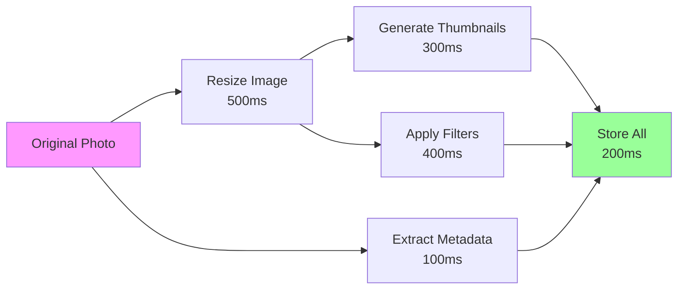

## Amdahl's Law: The Fundamental Limit

No matter how many workers you add, speedup is limited by sequential parts:

```math
Speedup = 1 / (S + P/N)

Where:
S = Sequential fraction (can't be parallelized)
P = Parallel fraction (can be parallelized)
N = Number of processors

Example:
If 10% must be sequential (S=0.1) - a fundamental constraint from [Law 3: Law of Emergent Chaos](/part1-axioms/law3-emergence/):
- With 10 processors: Speedup = 5.3x (not 10x!)
- With 100 processors: Speedup = 9.2x (not 100x!)
- With ∞ processors: Speedup = 10x (hard limit)
```

---

## 🔴 Deep Dive: Engineering Work Distribution (30 min read)

## Real Failure: The Netflix Encoding Disaster

**Company**: Netflix
**Date**: 2008
**Impact**: 3-day outage for new content

**The Problem**:
- Monolithic encoding server
- Single queue for all videos
- One crash = entire pipeline stops
- 12-hour encode time for 2-hour movie

**The Root Cause**:

```mermaid
graph TD
    subgraph "Monolithic Encoding Problems"
        Movie[2-Hour Movie] --> Single[Single Process]
        Single --> P1["❌ Problem 1:<br/>Sequential Processing<br/>120 min × 6 min/min = 12 hours"]
        Single --> P2["❌ Problem 2:<br/>No Fault Tolerance<br/>1% failure = restart all"]
        Single --> P3["❌ Problem 3:<br/>Can't Scale Horizontally<br/>More servers don't help"]
    end
    
    style P1 fill:#fee,stroke:#c00
    style P2 fill:#fee,stroke:#c00
    style P3 fill:#fee,stroke:#c00
```

| Problem | Impact | Root Cause |
|---------|--------|------------|
| **Sequential Processing** | 12-hour encode time | Must process each minute in order |
| **No Fault Tolerance** | Complete restart on failure | No checkpointing or partial progress |
| **Scaling Bottleneck** | Can't use multiple servers | Monolithic design prevents distribution |

**The Fix: Distributed Encoding Pipeline**:

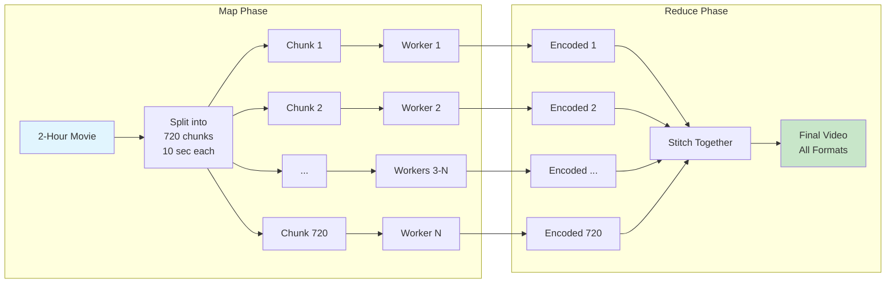

| Improvement | Before | After | Benefit |
|------------|--------|-------|----------|
| **Parallelization** | 1 sequential process | 720 parallel chunks | 36x potential speedup |
| **Fault Tolerance** | Full restart | Retry single chunk | 99.86% progress saved |
| **Scalability** | 1 server max | N servers | Linear scaling |
| **Total Time** | 12 hours | 20 minutes | 36x faster |

## Work Distribution Patterns

#### 1. Master-Worker Pattern

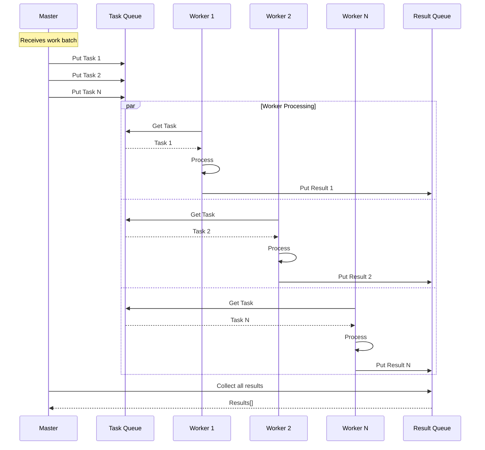

**Master-Worker Characteristics:** (implements coordination patterns from [Law 5: Law of Distributed Knowledge](/part1-axioms/law5-epistemology/))

| Aspect | Description | Use When |
|--------|-------------|----------|
| **Communication** | Through queues | Tasks are independent |
| **Scaling** | Add more workers | CPU-bound workloads |
| **Fault Tolerance** | Worker failure = retry task | Tasks can be retried |
| **Load Balancing** | Automatic via queue | Varying task sizes |

**Pros**: Simple, centralized control  
**Cons**: Master is bottleneck and SPOF

#### 2. Work-Stealing Pattern

```mermaid
graph TB
    subgraph "Worker 1"
        LQ1[Local Queue<br/>LIFO]
        LQ1 --> T1[Task A<br/>bottom]
        LQ1 --> T2[Task B]
        LQ1 --> T3[Task C<br/>top]
    end
    
    subgraph "Worker 2"
        LQ2[Local Queue<br/>Empty]
        LQ2 --> Steal["🔍 Steal Mode"]
    end
    
    subgraph "Worker 3"
        LQ3[Local Queue<br/>LIFO]
        LQ3 --> T4[Task D]
        LQ3 --> T5[Task E]
    end
    
    Steal -.->|"Steal from top<br/>(FIFO)"| T3
    Steal -.->|"Try next victim"| T5
    
    T1 -->|"Worker 1<br/>pops from bottom"| Process1[Process locally]
    T3 -->|"Stolen by<br/>Worker 2"| Process2[Process stolen]
    
    style Steal fill:#ffeb3b
    style T3 fill:#ff9800
    style Process2 fill:#4caf50
```

**Work-Stealing Workflow:**

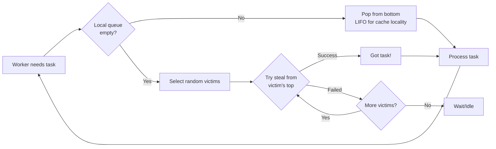

| Feature | Benefit | Implementation Detail |
|---------|---------|----------------------|
| **No Central Coordinator** | Resilient, no SPOF | Workers manage themselves |
| **Automatic Load Balancing** | Efficient work distribution | Idle workers steal from busy ones |
| **Cache Locality** | Better performance | Process own tasks first (LIFO) |
| **Minimal Contention** | Reduced conflicts | Steal from opposite end (FIFO) |

#### 3. MapReduce Pattern

```mermaid
graph TB
    subgraph "Input Phase"
        Input[Large Dataset] --> Split[Split into Chunks]
        Split --> C1[Chunk 1]
        Split --> C2[Chunk 2]
        Split --> C3[Chunk 3]
        Split --> CN[Chunk N]
    end
    
    subgraph "Map Phase"
        C1 --> M1[Mapper 1]
        C2 --> M2[Mapper 2]
        C3 --> M3[Mapper 3]
        CN --> MN[Mapper N]
        
        M1 --> KV1["(key1, val1)<br/>(key2, val2)"]
        M2 --> KV2["(key1, val3)<br/>(key3, val4)"]
        M3 --> KV3["(key2, val5)<br/>(key3, val6)"]
        MN --> KVN["(key1, valN)<br/>(key2, valM)"]
    end
    
    subgraph "Shuffle & Sort"
        KV1 --> Shuffle[Group by Key]
        KV2 --> Shuffle
        KV3 --> Shuffle
        KVN --> Shuffle
        
        Shuffle --> G1["key1: [val1, val3, valN]"]
        Shuffle --> G2["key2: [val2, val5, valM]"]
        Shuffle --> G3["key3: [val4, val6]"]
    end
    
    subgraph "Reduce Phase"
        G1 --> R1[Reducer 1]
        G2 --> R2[Reducer 2]
        G3 --> R3[Reducer 3]
        
        R1 --> O1[Output 1]
        R2 --> O2[Output 2]
        R3 --> O3[Output 3]
    end
    
    style Input fill:#e3f2fd
    style Shuffle fill:#fff3e0
    style O1 fill:#c8e6c9
    style O2 fill:#c8e6c9
    style O3 fill:#c8e6c9
**MapReduce Implementation Flow:**

```mermaid
flowchart TB
    subgraph "Phase 1: Parallel Map Execution"
        Start[Input Data] --> Split[Split into Chunks]
        Split --> TP1[ThreadPool Executor<br/>max_workers=N]
        
        TP1 --> W1[Worker 1<br/>map_phase]
        TP1 --> W2[Worker 2<br/>map_phase]
        TP1 --> W3[Worker 3<br/>map_phase]
        TP1 --> WN[Worker N<br/>map_phase]
        
        W1 --> F1[Future 1]
        W2 --> F2[Future 2]
        W3 --> F3[Future 3]
        WN --> FN[Future N]
        
        F1 --> Collect[as_completed()<br/>Collect Results]
        F2 --> Collect
        F3 --> Collect
        FN --> Collect
    end
    
    subgraph "Phase 2: Shuffle & Group"
        Collect --> MR[Map Results<br/>[(k1,v1), (k2,v2), ...]]
        MR --> Group[Group by Key<br/>defaultdict(list)]
        Group --> K1[key1: [v1, v3, v5]]
        Group --> K2[key2: [v2, v4]]
        Group --> K3[key3: [v6, v7, v8]]
    end
    
    subgraph "Phase 3: Parallel Reduce"
        K1 --> TP2[ThreadPool Executor<br/>max_workers=N]
        K2 --> TP2
        K3 --> TP2
        
        TP2 --> R1[Reducer 1<br/>reduce_func]
        TP2 --> R2[Reducer 2<br/>reduce_func]
        TP2 --> R3[Reducer 3<br/>reduce_func]
        
        R1 --> RF1[Future<->Key Map]
        R2 --> RF2[Future<->Key Map]
        R3 --> RF3[Future<->Key Map]
        
        RF1 --> Final[Final Results<br/>{k1: result1, k2: result2, ...}]
        RF2 --> Final
        RF3 --> Final
    end
    
    style Start fill:#e3f2fd
    style Group fill:#fff3e0
    style Final fill:#c8e6c9
```

**MapReduce Phases Overview:**

| Phase | Operation | Parallelism | Data Structure | Purpose |
|-------|-----------|-------------|----------------|---------|
| **Map** | `map_func(chunk)` | ThreadPoolExecutor | List of chunks → List of (K,V) pairs | Transform data into key-value pairs |
| **Shuffle** | Group by key | Sequential | defaultdict(list) | Organize data by key for reduction |
| **Reduce** | `reduce_func(key, values)` | ThreadPoolExecutor | Dict of lists → Final results | Aggregate values for each key |

**Word Count Example Visualization:**

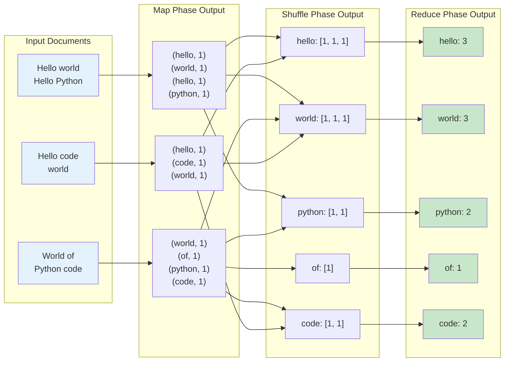

**MapReduce Usage Pattern:**

| Step | Function | Description | Example |
|------|----------|-------------|---------|
| 1. **Define Map** | `word_count_map(doc)` | Emit (key, value) pairs | `yield (word.lower(), 1)` |
| 2. **Define Reduce** | `word_count_reduce(word, counts)` | Aggregate values per key | `return sum(counts)` |
| 3. **Create Job** | `MapReduceJob(map_func, reduce_func)` | Initialize with functions | Configures the pipeline |
| 4. **Execute** | `job.run(documents, num_workers=10)` | Process data in parallel | Returns final results dict |

## The Coordination Tax

Every distributed system pays a coordination tax (detailed in [Law 5: Law of Distributed Knowledge](/part1-axioms/law5-epistemology/)):

## Load Balancing Strategies

---

## 🟣 Expert: Theory and Advanced Techniques (45 min read)

## Theoretical Foundations

#### Universal Scalability Law

Neil Gunther's USL extends Amdahl's Law to include coherency costs, addressing the scalability challenges from [Law 4: Law of Multidimensional Optimization](/part1-axioms/law4-tradeoffs/)):

<div class="formula-box">
<h4>Universal Scalability Law (USL)</h4>
<div style="text-align: center; font-size: 1.2em; margin: 20px 0;">
<strong>C(N) = N / (1 + α(N-1) + βN(N-1))</strong>
</div>
<table style="margin: 20px auto;">
<tr>
<td><strong>C(N)</strong></td>
<td>=</td>
<td>Capacity/throughput with N processors</td>
</tr>
<tr>
<td><strong>α</strong></td>
<td>=</td>
<td>Contention coefficient (serialization)</td>
</tr>
<tr>
<td><strong>β</strong></td>
<td>=</td>
<td>Coherency coefficient (coordination)</td>
</tr>
</table>
</div>

**Visual Scalability Analysis**:

<div class="scalability-chart">
<table class="workload-comparison">
<thead>
<tr>
<th>Workload Type</th>
<th>α (Contention)</th>
<th>β (Coherency)</th>
<th>Optimal Workers</th>
<th>Max Speedup</th>
<th>Scalability Curve</th>
</tr>
</thead>
<tbody>
<tr>
<td><strong>Embarrassingly Parallel</strong></td>
<td>0.01</td>
<td>0.0001</td>
<td>~100</td>
<td>~50x</td>
<td>
<div class="mini-chart">
<span style="color: #4CAF50;">━━━━━━━━━━╱</span> Near-linear scaling
</div>
</td>
</tr>
<tr>
<td><strong>Moderate Coordination</strong></td>
<td>0.05</td>
<td>0.001</td>
<td>~32</td>
<td>~16x</td>
<td>
<div class="mini-chart">
<span style="color: #FFC107;">━━━━━╱━━━━━</span> Good scaling, then plateau
</div>
</td>
</tr>
<tr>
<td><strong>High Contention</strong></td>
<td>0.1</td>
<td>0.01</td>
<td>~10</td>
<td>~5x</td>
<td>
<div class="mini-chart">
<span style="color: #FF5722;">━━╱━━━━━━━━</span> Limited scaling
</div>
</td>
</tr>
<tr>
<td><strong>Extreme Coordination</strong></td>
<td>0.2</td>
<td>0.02</td>
<td>~5</td>
<td>~2.5x</td>
<td>
<div class="mini-chart">
<span style="color: #F44336;">━╱━━━━━━━━━</span> Poor scaling
</div>
</td>
</tr>
</tbody>
</table>
</div>

<div class="insight-box">
<strong>Key Insights:</strong>
<ul>
<li>Adding workers beyond the optimal point <em>decreases</em> total throughput</li>
<li>Contention (α) limits maximum useful parallelism</li>
<li>Coherency (β) causes retrograde scaling at high worker counts</li>
<li>Most real systems exhibit both effects to varying degrees</li>
</ul>
</div>
#### Queue Theory for Work Distribution

Little's Law provides fundamental insights (see also [Quantitative Analysis: Queueing Theory](/quantitative/queueing-models)):

<div class="formula-box">
<h4>Little's Law</h4>
<div style="text-align: center; font-size: 1.2em; margin: 20px 0;">
<strong>L = λW</strong>
</div>
<table style="margin: 20px auto;">
<tr>
<td><strong>L</strong></td>
<td>=</td>
<td>Average number of items in system</td>
</tr>
<tr>
<td><strong>λ</strong></td>
<td>=</td>
<td>Average arrival rate</td>
</tr>
<tr>
<td><strong>W</strong></td>
<td>=</td>
<td>Average time in system</td>
</tr>
</table>
</div>

**Applied to Work Queues:**

<div class="queue-metrics">
<table class="metrics-table">
<thead>
<tr>
<th>Metric</th>
<th>Formula</th>
<th>Meaning</th>
<th>Use Case</th>
</tr>
</thead>
<tbody>
<tr>
<td><strong>Arrival Rate (λ)</strong></td>
<td>requests / time</td>
<td>How fast work arrives</td>
<td>Capacity planning</td>
</tr>
<tr>
<td><strong>Service Rate (μ)</strong></td>
<td>completions / time</td>
<td>How fast work completes</td>
<td>Performance tuning</td>
</tr>
<tr>
<td><strong>Utilization (ρ)</strong></td>
<td>λ / μ</td>
<td>Fraction of time busy</td>
<td>Efficiency monitoring</td>
</tr>
<tr>
<td><strong>Queue Length (L)</strong></td>
<td>λ × W</td>
<td>Average items waiting</td>
<td>Buffer sizing</td>
</tr>
<tr>
<td><strong>Wait Time</strong></td>
<td>ρ / (μ × (1 - ρ))</td>
<td>Time in queue (M/M/1)</td>
<td>SLA compliance</td>
</tr>
</tbody>
</table>
</div>

<div class="warning-box">
<strong>Queue Saturation Effects:</strong>
<div style="margin: 10px 0;">
<table class="saturation-effects">
<tr>
<td><strong>Utilization</strong></td>
<td><strong>Wait Time</strong></td>
<td><strong>Behavior</strong></td>
</tr>
<tr>
<td>50%</td>
<td>1x service time</td>
<td>Responsive system</td>
</tr>
<tr>
<td>75%</td>
<td>3x service time</td>
<td>Noticeable delays</td>
</tr>
<tr>
<td>90%</td>
<td>9x service time</td>
<td>Severe queueing</td>
</tr>
<tr>
<td>95%</td>
<td>19x service time</td>
<td>Near collapse</td>
</tr>
<tr>
<td>99%</td>
<td>99x service time</td>
<td>System breakdown</td>
</tr>
</table>
</div>
</div>
## Advanced Work Distribution Algorithms

#### Consistent Hashing with Virtual Nodes

```mermaid
graph TB
    subgraph "Consistent Hash Ring"
        A[Hash Ring 0-2^32] 
        
        N1[Node 1] --> V1[Virtual 1:0]
        N1 --> V2[Virtual 1:1]
        N1 --> V3[Virtual 1:149]
        
        N2[Node 2] --> V4[Virtual 2:0]
        N2 --> V5[Virtual 2:1]
        N2 --> V6[Virtual 2:149]
        
        N3[Node 3] --> V7[Virtual 3:0]
        N3 --> V8[Virtual 3:1]
        N3 --> V9[Virtual 3:149]
        
        V1 -.->|Hash: 0x1234| A
        V2 -.->|Hash: 0x5678| A
        V4 -.->|Hash: 0x9ABC| A
        V7 -.->|Hash: 0xDEF0| A
        
        K[Key "user123"] -->|Hash: 0x7890| A
        A -->|Binary Search| V4
        V4 -->|Maps to| N2
    end
    
    style N1 fill:#e3f2fd
    style N2 fill:#e8f5e9
    style N3 fill:#fff3e0
    style K fill:#ffebee
```

<div class="truth-box">
<h4>Consistent Hashing Algorithm Flow</h4>

<b>Ring Construction:</b>
<ol>
<li>For each physical node, create 150 virtual nodes</li>
<li>Hash each virtual node: hash("node:index")</li>
<li>Place virtual nodes on ring at hash positions</li>
<li>Sort all hash values for binary search</li>
</ol>

<b>Key Lookup Process:</b>
<ol>
<li>Hash the key to get position on ring</li>
<li>Binary search for first node ≥ hash</li>
<li>If past end, wrap to beginning</li>
<li>Return physical node mapped to virtual node</li>
</ol>

<b>Node Operations:</b>
<table>
<tr><th>Operation</th><th>Impact</th><th>Keys Moved</th></tr>
<tr><td>Add Node</td><td>Only keys between new node and next node</td><td>~1/N of total</td></tr>
<tr><td>Remove Node</td><td>Only keys on removed node move to next</td><td>~1/N of total</td></tr>
<tr><td>Replication</td><td>Walk ring clockwise for N unique nodes</td><td>No movement</td></tr>
</table>
</div>
#### Two-Phase Commit for Distributed Work

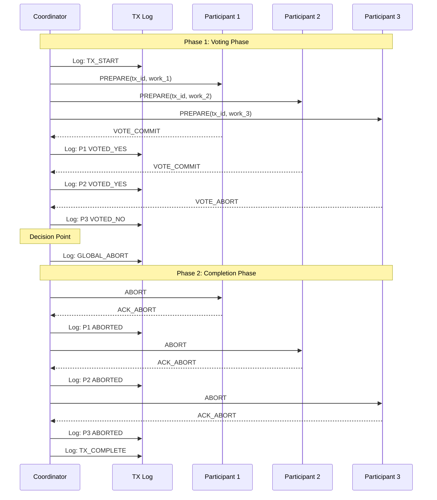

<div class="law-box">
<h4>Two-Phase Commit Protocol</h4>

<b>Protocol Guarantees:</b>
<ul>
<li><b>Atomicity:</b> All participants commit or all abort</li>
<li><b>Consistency:</b> No partial state changes</li>
<li><b>Durability:</b> Decisions survive crashes via TX log</li>
</ul>

<b>Failure Scenarios:</b>
<table>
<tr><th>When</th><th>Who Fails</th><th>Recovery Action</th></tr>
<tr><td>Before Vote</td><td>Participant</td><td>Coordinator timeouts, aborts transaction</td></tr>
<tr><td>After Vote</td><td>Participant</td><td>Participant must honor vote when recovers</td></tr>
<tr><td>Before Decision</td><td>Coordinator</td><td>Participants timeout, run termination protocol</td></tr>
<tr><td>After Decision</td><td>Coordinator</td><td>Participants read decision from TX log</td></tr>
</table>

<b>Blocking Problem:</b> If coordinator fails after prepare but before decision, participants must wait (blocked) until coordinator recovers.
</div>
## Research Frontiers

#### Speculative Execution

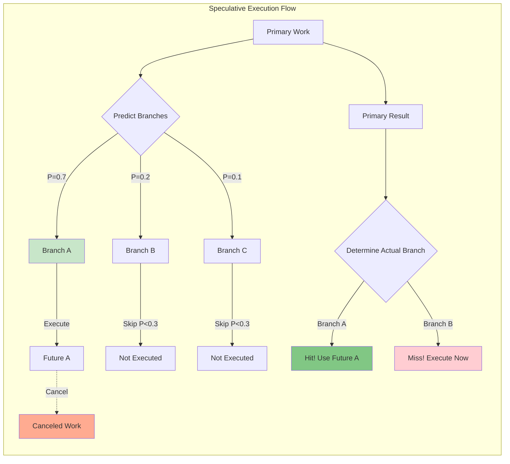

<div class="decision-box">
<h4>Speculative Execution Strategy</h4>

<b>When to Use Speculation:</b>
<ul>
<li>Branch prediction accuracy > 60%</li>
<li>Speculative work cost < 30% of sequential execution</li>
<li>Idle resources available</li>
<li>Work is safely cancellable</li>
</ul>

<b>Cost-Benefit Analysis:</b>
<table>
<tr><th>Metric</th><th>Formula</th><th>Good Threshold</th></tr>
<tr><td>Hit Rate</td><td>correct_predictions / total</td><td>> 0.6</td></tr>
<tr><td>Speedup</td><td>sequential_time / speculative_time</td><td>> 1.5x</td></tr>
<tr><td>Waste Ratio</td><td>canceled_work / total_work</td><td>< 0.3</td></tr>
<tr><td>ROI</td><td>(time_saved - time_wasted) / time_wasted</td><td>> 1.0</td></tr>
</table>
</div>
---

## ⚫ Mastery: Building Production Work Systems (60+ min read)

## Complete Implementation: Distributed Task Scheduler

Let's build a production-grade distributed task scheduler:

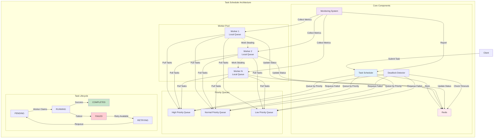

<div class="truth-box">
<h4>Distributed Task Scheduler Implementation</h4>

<b>Task State Machine:</b>
<pre>
PENDING → RUNNING → COMPLETED
    ↓        ↓
    └──→ FAILED → RETRYING
           ↓          ↓
      (exhausted)  PENDING
</pre>

<b>Key Features:</b>
<table>
<tr><th>Feature</th><th>Implementation</th><th>Benefit</th></tr>
<tr><td><b>Priority Scheduling</b></td><td>3 queues (high/normal/low)</td><td>Important work processed first</td></tr>
<tr><td><b>Work Stealing</b></td><td>Steal when queue > threshold</td><td>Better load distribution</td></tr>
<tr><td><b>Automatic Retries</b></td><td>Configurable max retries</td><td>Resilience to transient failures</td></tr>
<tr><td><b>Deadlock Detection</b></td><td>30s periodic timeout check</td><td>Prevents stuck tasks</td></tr>
<tr><td><b>Local Queues</b></td><td>Per-worker task buffer</td><td>Reduces Redis contention</td></tr>
</table>

<b>Performance Optimizations:</b>
<ul>
<li><b>Batch Fetching:</b> Workers grab multiple tasks at once</li>
<li><b>Local Caching:</b> Reduce Redis roundtrips</li>
<li><b>Binary Search:</b> Efficient task insertion in sorted queues</li>
<li><b>Async I/O:</b> Non-blocking Redis operations</li>
</ul>
</div>

### Implementation Blueprint: Task Scheduler Components

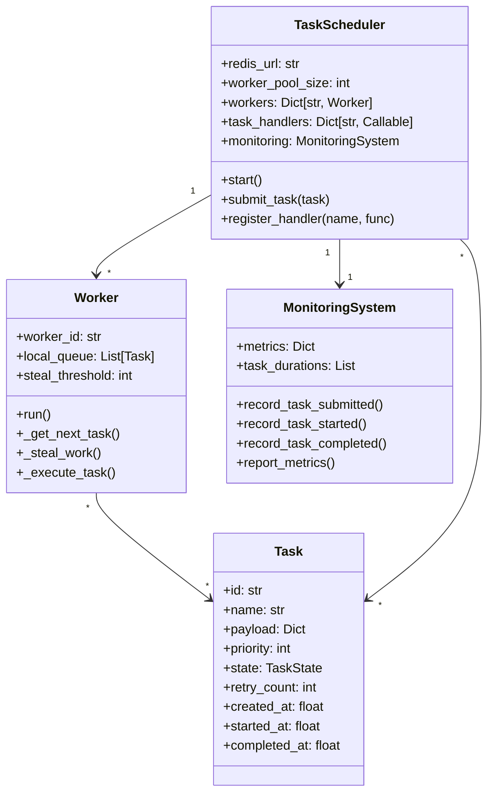

### Task Processing Flow

```mermaid
flowchart TB
    subgraph "Task Submission"
        Submit[Client submits task] --> Serialize[Serialize to Redis]
        Serialize --> Priority{Determine priority}
        Priority -->|High < 0| HQ[High Priority Queue]
        Priority -->|Normal = 0| NQ[Normal Queue]
        Priority -->|Low > 0| LQ[Low Priority Queue]
    end
    
    subgraph "Worker Processing"
        Worker[Worker Loop] --> CheckLocal{Local queue\nempty?}
        CheckLocal -->|No| ProcessLocal[Process local task]
        CheckLocal -->|Yes| FetchRedis[Fetch from Redis]
        
        FetchRedis --> BatchFetch[Batch fetch\n(steal_threshold tasks)]
        BatchFetch --> Found{Tasks found?}
        Found -->|Yes| LocalCache[Cache in local queue]
        Found -->|No| TrySteal[Try work stealing]
        
        TrySteal --> CheckPeers{Check other\nworkers}
        CheckPeers --> StealHalf[Steal half of\nexcess tasks]
    end
    
    subgraph "Execution & Recovery"
        Execute[Execute task] --> Timeout{Timeout?}
        Timeout -->|Yes| MarkFailed[Mark FAILED]
        Timeout -->|No| MarkComplete[Mark COMPLETED]
        
        MarkFailed --> CheckRetries{Retries left?}
        CheckRetries -->|Yes| Requeue[Requeue task]
        CheckRetries -->|No| Final[Final failure]
    end
    
    style Submit fill:#e3f2fd
    style Execute fill:#fff3e0
    style MarkComplete fill:#c8e6c9
    style MarkFailed fill:#ffcdd2
```

### Key Implementation Details

<div class="implementation-table">
<table>
<thead>
<tr>
<th>Component</th>
<th>Key Methods</th>
<th>Data Structure</th>
<th>Purpose</th>
</tr>
</thead>
<tbody>
<tr>
<td><b>Task State Machine</b></td>
<td>State transitions</td>
<td>Enum: PENDING → RUNNING → COMPLETED/FAILED</td>
<td>Track task lifecycle</td>
</tr>
<tr>
<td><b>Priority Queues</b></td>
<td>zadd(), zrange(), zrem()</td>
<td>Redis Sorted Sets (score = timestamp)</td>
<td>Priority-based scheduling</td>
</tr>
<tr>
<td><b>Work Stealing</b></td>
<td>steal_work()</td>
<td>Local queue comparison</td>
<td>Dynamic load balancing</td>
</tr>
<tr>
<td><b>Batch Fetching</b></td>
<td>zrange(0, threshold-1)</td>
<td>Fetch multiple tasks</td>
<td>Reduce Redis calls</td>
</tr>
<tr>
<td><b>Deadlock Detection</b></td>
<td>Periodic timeout check</td>
<td>Scan running tasks</td>
<td>Prevent stuck tasks</td>
</tr>
<tr>
<td><b>Monitoring</b></td>
<td>record_*, report_metrics()</td>
<td>In-memory metrics dict</td>
<td>Performance tracking</td>
</tr>
</tbody>
</table>
</div>

### Work Stealing Algorithm Detail

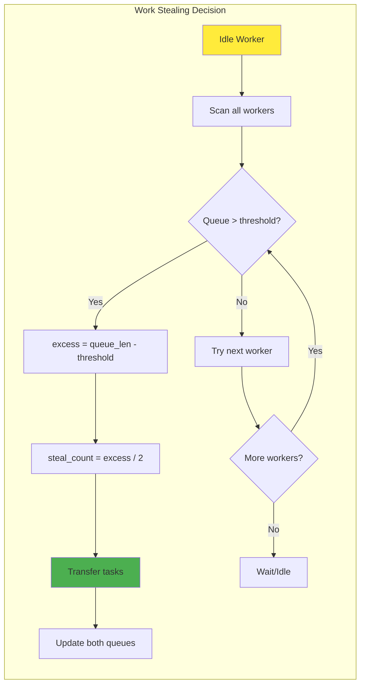

### Performance Metrics Collection

<div class="metrics-table">
<table>
<thead>
<tr>
<th>Metric</th>
<th>Collection Point</th>
<th>Formula/Method</th>
<th>Use Case</th>
</tr>
</thead>
<tbody>
<tr>
<td><b>Throughput</b></td>
<td>Task completion</td>
<td>completed_tasks / time_window</td>
<td>System capacity</td>
</tr>
<tr>
<td><b>Latency P50/P99</b></td>
<td>Task duration</td>
<td>sorted(durations)[index]</td>
<td>Performance SLAs</td>
</tr>
<tr>
<td><b>Queue Depth</b></td>
<td>Queue operations</td>
<td>zcard(queue_name)</td>
<td>Backlog monitoring</td>
</tr>
<tr>
<td><b>Worker Utilization</b></td>
<td>Worker state</td>
<td>busy_time / total_time</td>
<td>Resource efficiency</td>
</tr>
<tr>
<td><b>Failure Rate</b></td>
<td>Task completion</td>
<td>failed_tasks / total_tasks</td>
<td>System health</td>
</tr>
<tr>
<td><b>Steal Success Rate</b></td>
<td>Work stealing</td>
<td>successful_steals / attempts</td>
<td>Load balance effectiveness</td>
</tr>
</tbody>
</table>
</div>

### Example Usage Pattern

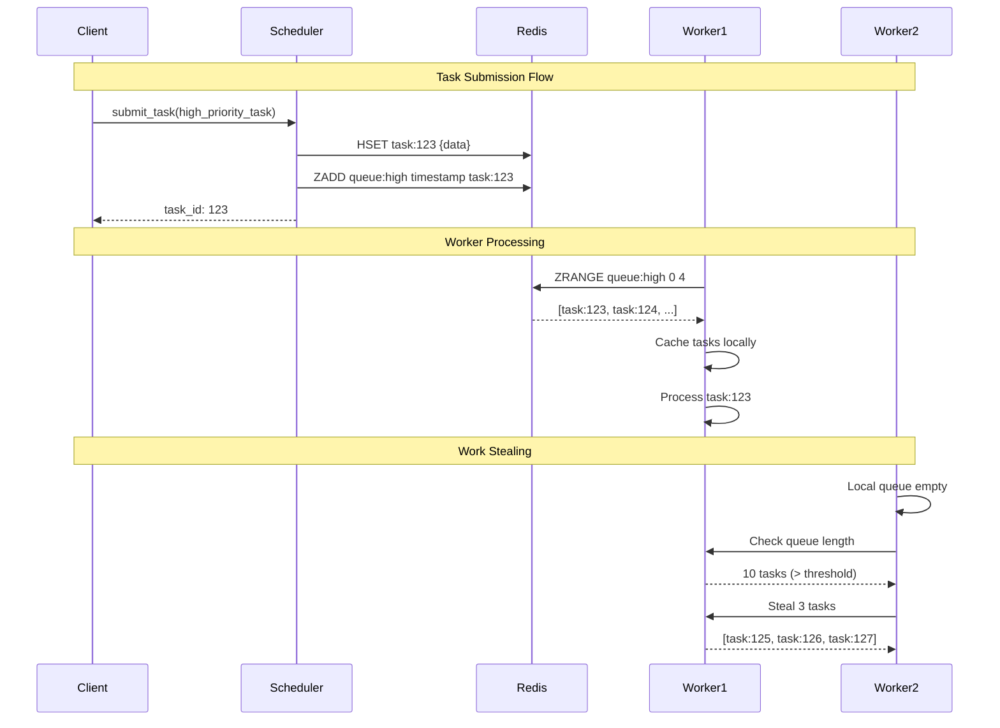
## Production War Stories

#### Story 1: The 100x Speed-Up That Almost Broke Everything

**Company**: Social Media Analytics Platform
**Challenge**: Process 1B social posts daily for sentiment analysis

**Original System**:

<div class="failure-vignette">
<b>Single-Threaded Processing:</b>
<table>
<tr><th>Step</th><th>Time</th><th>Total for 1B posts</th></tr>
<tr><td>Analyze sentiment</td><td>100ms</td><td rowspan="2">150ms × 1B = 1,736 days!</td></tr>
<tr><td>Save to database</td><td>50ms</td></tr>
</table>
</div>

**First Attempt**: Naive parallelization

```mermaid
flowchart LR
    subgraph "Naive Approach"
        P[1B Posts] --> TPE[ThreadPoolExecutor<br/>1000 workers]
        TPE --> T1[Thread 1]
        TPE --> T2[Thread 2]
        TPE --> T3[...]
        TPE --> T1000[Thread 1000]
        
        T1 & T2 & T3 & T1000 --> DB[(Database<br/>Max 100 connections)]
        
        DB --> X[💥 MELTDOWN]
    end
    
    subgraph "What Happened"
        X --> OOM[Out of Memory<br/>10GB thread overhead]
        X --> CPU[CPU Thrashing<br/>Context switching]
        X --> BILL[AWS Bill: $10K]
    end
    
    style X fill:#ff5252
    style OOM fill:#ffcdd2
    style CPU fill:#ffcdd2
    style BILL fill:#ff1744
```
**What Went Wrong**:
1. Database connection pool exhausted (max 100 connections)
2. Memory usage: 1000 threads × 10MB stack = 10GB overhead
3. Context switching overhead dominated processing
4. No backpressure - queue grew unbounded

**The Fix**:

```mermaid
flowchart TB
    subgraph "Smart Processing Architecture"
        P[1B Posts] --> B[Batch Creator<br/>Size: 1000]
        B --> Q[Bounded Queue<br/>Max: 10K items]
        
        Q --> C1[Consumer 1]
        Q --> C2[Consumer 2]
        Q --> C3[...]
        Q --> C100[Consumer 100]
        
        C1 & C2 & C3 & C100 --> BP[Batch Processor]
        BP --> DBP[DB Pool<br/>50 connections]
        
        Q -.->|Backpressure| B
    end
    
    subgraph "Results"
        R1[100x Speedup<br/>17 days → 4 hours]
        R2[Memory: 2GB stable]
        R3[DB: Happy]
        R4[AWS: Reasonable]
    end
    
    style R1 fill:#c8e6c9
    style R2 fill:#c8e6c9
    style R3 fill:#c8e6c9
    style R4 fill:#c8e6c9
```

<div class="decision-box">
<h4>Smart Processing Strategy</h4>
<table>
<tr><th>Component</th><th>Setting</th><th>Why It Works</th></tr>
<tr><td>Workers</td><td>100 (not 1000)</td><td>Matches DB connection pool</td></tr>
<tr><td>Batch Size</td><td>1000 posts</td><td>Amortizes DB overhead</td></tr>
<tr><td>Queue Limit</td><td>10,000 items</td><td>Prevents memory explosion</td></tr>
<tr><td>DB Pool</td><td>50 connections</td><td>Below DB max, allows headroom</td></tr>
<tr><td>Backpressure</td><td>Queue blocks when full</td><td>Self-regulating system</td></tr>
</table>
</div>
**Lessons Learned**:
1. More workers ≠ more speed
2. Batch operations are crucial
3. Backpressure prevents cascading failures
4. Monitor everything before scaling

#### Story 2: When Work Stealing Saved Black Friday

**Company**: E-commerce Platform
**Situation**: Black Friday traffic 50x normal

**The Problem**: Uneven load distribution
```
Worker 1: Processing celebrity endorsement orders (10K items)
Worker 2: Processing regular orders (10 items)
Worker 3-10: Idle

Result: Celebrity orders timeout, customer rage
```
**The Solution**: Implemented work stealing

```mermaid
flowchart TB
    subgraph "Before Work Stealing"
        W1B[Worker 1<br/>10K celebrity orders] -->|Overloaded| T1[Timeouts]
        W2B[Worker 2<br/>10 orders] -->|Light load| C1[Completed]
        W3B[Workers 3-10<br/>0 orders] -->|Idle| I1[Wasted]
    end
    
    subgraph "After Work Stealing"
        M[Monitor] -->|Check loads| D{Load Distribution}
        D -->|Worker 1: 10K| O[Overloaded List]
        D -->|Worker 2: 10| U[Underloaded List]
        D -->|Workers 3-10: 0| U
        
        O -->|Steal 30%| S[Steal 3K orders]
        S -->|Transfer| W2A[Worker 2<br/>3010 orders]
        S -->|Transfer| W3A[Worker 3<br/>3000 orders]
        S -->|Transfer| W4A[Worker 4<br/>3000 orders]
        
        W1A[Worker 1<br/>1000 orders] -->|Balanced| OK1[All Complete]
        W2A & W3A & W4A -->|Balanced| OK2[All Complete]
    end
    
    style T1 fill:#ff5252
    style OK1 fill:#4caf50
    style OK2 fill:#4caf50
```

<div class="truth-box">
<h4>Work Stealing Algorithm</h4>

<b>Rebalancing Logic:</b>
<ol>
<li>Calculate average load across all workers</li>
<li>Identify overloaded workers (load > 1.5x average)</li>
<li>Identify underloaded workers (load < 0.5x average)</li>
<li>Steal 30% from most loaded to least loaded</li>
<li>Repeat every second</li>
</ol>

<b>Results:</b>
<table>
<tr><th>Metric</th><th>Before</th><th>After</th><th>Impact</th></tr>
<tr><td>P99 Latency</td><td>30s</td><td>2s</td><td>15x improvement</td></tr>
<tr><td>Success Rate</td><td>72%</td><td>99.5%</td><td>$2.3M revenue saved</td></tr>
<tr><td>Worker Utilization</td><td>10%</td><td>85%</td><td>8.5x efficiency</td></tr>
</table>
</div>
## Performance Optimization Cookbook

#### Recipe 1: The Batch Accumulator Pattern

```mermaid
flowchart LR
    subgraph "Batch Accumulator Logic"
        I[Item Arrives] --> A{Check Pending}
        A -->|Size < Batch Size| B[Add to Pending]
        B --> C{Timer Active?}
        C -->|No| D[Start Timer<br/>50ms]
        C -->|Yes| E[Wait]
        
        A -->|Size = Batch Size| F[Process Batch<br/>Immediately]
        
        D --> T[Timer Expires]
        T --> G{Pending Items?}
        G -->|Yes| F
        G -->|No| H[Reset]
        
        F --> P[Bulk Process<br/>1000 items]
        P --> DB[(Database)]
    end
    
    style F fill:#4caf50
    style P fill:#81c784
```

<div class="decision-box">
<h4>Batch Accumulator Pattern</h4>

<b>Configuration:</b>
<table>
<tr><th>Parameter</th><th>Value</th><th>Purpose</th></tr>
<tr><td>Batch Size</td><td>1000</td><td>Optimal for DB bulk inserts</td></tr>
<tr><td>Max Wait</td><td>50ms</td><td>Balance latency vs efficiency</td></tr>
<tr><td>Lock</td><td>AsyncIO Lock</td><td>Thread-safe operations</td></tr>
</table>

<b>Benefits:</b>
<ul>
<li>Reduces network calls by 100x</li>
<li>Amortizes connection overhead</li>
<li>Improves database throughput</li>
<li>Automatic partial batch processing</li>
</ul>
</div>
#### Recipe 2: The Priority Work Queue

```mermaid
stateDiagram-v2
    [*] --> CheckStarvation
    
    CheckStarvation --> CalculateRatios
    CalculateRatios --> CheckLowPriority: For each low priority queue
    
    CheckLowPriority --> IsStarving: Queue has items?
    IsStarving --> ServiceStarved: Ratio < threshold
    IsStarving --> CheckNext: Ratio OK
    
    ServiceStarved --> UpdateStats
    CheckNext --> CheckLowPriority: More queues
    CheckNext --> NormalOrder: No more queues
    
    NormalOrder --> CheckHigh: Check priority 0
    CheckHigh --> ServiceHigh: Has items
    CheckHigh --> CheckMedium: Empty
    
    CheckMedium --> ServiceMedium: Has items
    CheckMedium --> CheckLow: Empty
    
    CheckLow --> ServiceLow: Has items
    CheckLow --> WaitHigh: All empty
    
    ServiceHigh --> UpdateStats
    ServiceMedium --> UpdateStats
    ServiceLow --> UpdateStats
    WaitHigh --> UpdateStats
    
    UpdateStats --> [*]
```

<div class="law-box">
<h4>Priority Queue with Anti-Starvation</h4>

<b>Priority Levels:</b>
<table>
<tr><th>Priority</th><th>Expected Ratio</th><th>Use Case</th></tr>
<tr><td>0 (High)</td><td>50%</td><td>Critical tasks</td></tr>
<tr><td>1 (Medium)</td><td>25%</td><td>Normal tasks</td></tr>
<tr><td>2 (Low)</td><td>12.5%</td><td>Background tasks</td></tr>
</table>

<b>Anti-Starvation Logic:</b>
<ul>
<li>Track processing count per priority</li>
<li>Calculate actual vs expected ratios</li>
<li>If ratio < expected/10, force service</li>
<li>Prevents indefinite waiting for low priority</li>
</ul>
</div>
#### Recipe 3: The Adaptive Batch Sizing

```mermaid
flowchart TB
    subgraph "Adaptive Batch Algorithm"
        P[Process Batch] --> M[Measure Performance]
        M --> L[Latency/Item]
        M --> T[Throughput]
        
        L & T --> H[Add to History]
        H --> C{Enough Data?}
        C -->|< 10 samples| W[Wait]
        C -->|>= 10 samples| A[Analyze Trends]
        
        A --> RT[Recent vs Older]
        RT --> D{Decision}
        
        D -->|Latency +20%| R[Reduce Batch -20%]
        D -->|Throughput +10%| I[Increase Batch +20%]
        D -->|Stable| K[Keep Current]
        
        R --> B[New Batch Size]
        I --> B
        K --> B
        
        B --> V[Validate Min/Max]
        V --> U[Update Size]
    end
    
    style R fill:#ffcdd2
    style I fill:#c8e6c9
    style K fill:#e1f5fe
```

<div class="decision-box">
<h4>Adaptive Batch Sizing Strategy</h4>

<b>Configuration:</b>
<table>
<tr><th>Parameter</th><th>Default</th><th>Purpose</th></tr>
<tr><td>Min Batch</td><td>10</td><td>Prevent overhead dominating</td></tr>
<tr><td>Max Batch</td><td>1000</td><td>Prevent memory issues</td></tr>
<tr><td>History Size</td><td>100</td><td>Trend detection window</td></tr>
<tr><td>Sample Size</td><td>10</td><td>Smoothing for decisions</td></tr>
</table>

<b>Adjustment Rules:</b>
<ul>
<li><b>Latency increases 20%:</b> Reduce batch by 20%</li>
<li><b>Throughput increases 10%:</b> Increase batch by 20%</li>
<li><b>Otherwise:</b> Keep current size</li>
<li>Always respect min/max boundaries</li>
</ul>

<b>Effect:</b> Self-tuning system that finds optimal batch size for current load
</div>
## The Future of Work Distribution

#### Emerging Patterns

1. **Serverless Work Distribution**
   
   ```mermaid
   graph LR
       E[Event] --> F[Function]
       F --> P[Platform]
       P --> S1[Scale to 0]
       P --> S2[Auto-scale to N]
       P --> D[Distribute]
       P --> R[Retry Failed]
       P --> M[Monitor]
       
       style P fill:#e3f2fd
   ```

2. **Edge-Native Work**
   
   ```mermaid
   flowchart TB
       W[Work Item] --> L{Location-Aware}
       L --> E[Find Nearest Edge]
       E --> C{Can Process<br/>at Edge?}
       C -->|Yes| EP[Edge Processing<br/>5ms latency]
       C -->|No| RC{Complex Work?}
       RC -->|Medium| RP[Regional DC<br/>20ms latency]
       RC -->|Heavy| CP[Central DC<br/>100ms latency]
       
       style EP fill:#c8e6c9
       style RP fill:#fff9c4
       style CP fill:#ffccbc
   ```

3. **ML-Driven Scheduling**
   
   ```mermaid
   graph TB
       W[Work Item] --> FE[Feature Extraction]
       FE --> F1[Size]
       FE --> F2[Type]
       FE --> F3[History]
       FE --> F4[Dependencies]
       
       F1 & F2 & F3 & F4 --> ML[ML Model]
       
       ML --> P1[Execution Time]
       ML --> P2[Resource Needs]
       ML --> P3[Failure Risk]
       ML --> P4[Optimal Worker]
       
       P1 & P2 & P3 & P4 --> D[Placement Decision]
       
       style ML fill:#e1bee7
       style D fill:#c5e1a5
   ```

---

## Common Anti-Patterns to Avoid

---

## Summary: Key Takeaways

1. **🟢 Intuition**: Work distribution is like organizing a kitchen - specialization and coordination
2. **🟡 Foundation**: Amdahl's Law sets hard limits on parallelization benefits
3. **🔴 Deep Dive**: Real systems need work stealing, batching, and careful queue management
4. **🟣 Expert**: Theory guides optimal worker counts and queue depths
5. **⚫ Mastery**: Production systems require holistic thinking about failure, monitoring, and cost

## The Work Distribution Commandments

1. **Thou shalt respect Amdahl's Law** - Sequential parts limit parallel gains
2. **Thou shalt implement backpressure** - Unbounded queues are time bombs
3. **Thou shalt steal work** - Dynamic load balancing beats static
4. **Thou shalt batch operations** - Amortize coordination costs
5. **Thou shalt monitor everything** - You can't optimize what you don't measure

## Quick Reference Card

---

*"Work distribution is not just about spreading computation—it's about spreading it intelligently while respecting the laws of physics and coordination."*

## Related Resources

### Foundational Laws
- [Law 1: Law of Correlated Failure](/part1-axioms/law1-failure/) - Handling worker failures
- [Law 2: Law of Asynchronous Reality](/part1-axioms/law2-asynchrony/) - Time and causality in distributed work
- [Law 3: Law of Emergent Chaos](/part1-axioms/law3-emergence/) - Complex behavior from simple rules
- [Law 4: Law of Multidimensional Optimization](/part1-axioms/law4-tradeoffs/) - Resource limits and scaling
- [Law 5: Law of Distributed Knowledge](/part1-axioms/law5-epistemology/) - Managing distributed workers
- [Law 7: Law of Economic Reality](/part1-axioms/law7-economics/) - Cost of distribution

### Related Pillars
- [Pillar 2: State](/part2-pillars/state/) - Managing distributed computation state
- [Pillar 3: Truth](/part2-pillars/truth/) - Consensus on work completion
- [Pillar 4: Control](/part2-pillars/control/) - Orchestrating distributed work

### Implementation Patterns
- [MapReduce Pattern](/case-studies/mapreduce) - Classic work distribution
- Service Mesh (Coming Soon) - Modern microservice coordination
- [Event Streaming](/patterns/queues-streaming) - Async work distribution
- [Circuit Breaker](/patterns/circuit-breaker) - Handling worker failures

### Real-World Case Studies
- [Netflix: Chaos Engineering](/case-studies/netflix-chaos) - Resilient work distribution
- [Google: MapReduce](/case-studies/mapreduce) - Planet-scale processing
- [Apache Spark](/case-studies/apache-spark) - In-memory distributed computing
