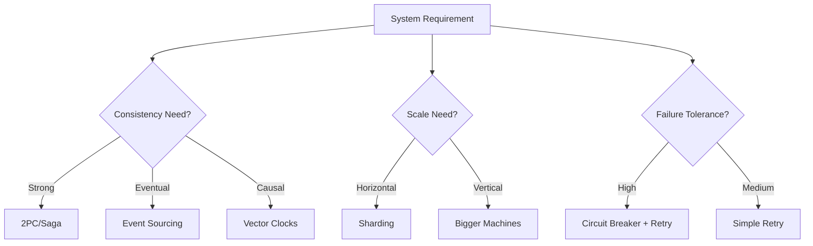

# Part III: Common Patterns & Anti-Patterns

!!! info "Prerequisites"
    - Completed [Part I: The 8 Axioms](../part1-axioms/index.md)
    - Completed [Part II: Foundational Pillars](../part2-pillars/index.md)

!!! tip "Quick Navigation"
    [← Part II: Pillars](../part2-pillars/index.md) | 
    [Home](../index.md) |
    [Part IV: Case Study →](../part4-case-study/index.md)

!!! target "Learning Objective"
    Recognize common distributed system patterns and their trade-offs. Learn to identify and avoid anti-patterns that lead to system failures.

## Overview

After understanding the axioms and pillars, we now explore the **patterns** that emerge when building distributed systems. These patterns are battle-tested solutions to recurring problems.

## Core Patterns

### 1. Load Distribution Patterns
- **Round Robin**: Simple, stateless distribution
- **Least Connections**: Route to least busy server
- **Consistent Hashing**: Minimize redistribution on scaling
- **Geographic**: Route based on client location

### 2. Data Consistency Patterns
- **Event Sourcing**: Store all changes as events
- **CQRS**: Separate read and write models
- **Saga Pattern**: Distributed transactions
- **Two-Phase Commit**: Strong consistency

### 3. Resilience Patterns
- **Circuit Breaker**: Prevent cascade failures
- **Bulkhead**: Isolate failures
- **Retry with Backoff**: Handle transient failures
- **Timeout**: Prevent indefinite waiting

### 4. Communication Patterns
- **Request-Response**: Synchronous communication
- **Publish-Subscribe**: Decoupled messaging
- **Message Queue**: Asynchronous processing
- **Streaming**: Continuous data flow

## Common Anti-Patterns

### 1. The Distributed Monolith
Creating services that are so tightly coupled they must be deployed together.

### 2. Chatty Services
Excessive inter-service communication leading to network overhead.

### 3. Shared Database
Multiple services sharing the same database, creating hidden dependencies.

### 4. Synchronous Everything
Making all communication synchronous, leading to cascading failures.

## Pattern Selection Framework

## What's Next?

Now that you understand the patterns, see them applied in a real-world scenario:

- :material-application: **[Part IV: Case Study →](../part4-case-study/index.md)**
    
    Build a ride-sharing platform from scratch

- :material-hammer: **[Part V: Capstone Project →](../part5-capstone/index.md)**
    
    Implement your own distributed system

!!! success "Key Takeaway"
    Patterns are tools, not rules. The art is knowing when to apply each pattern based on your specific constraints and requirements.