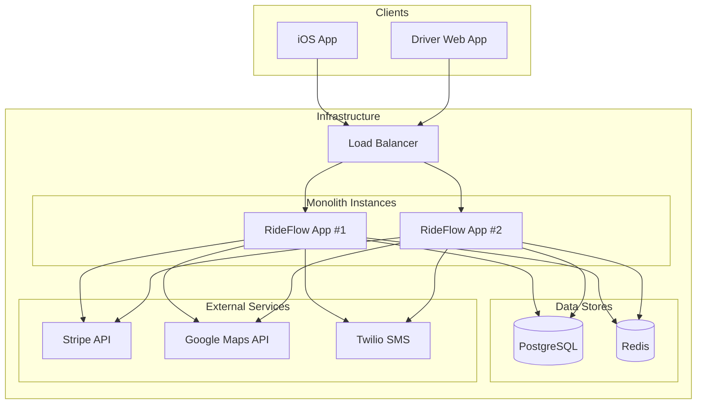

# Chapter 1: The MVP - Starting Simple

!!! info "Chapter Overview"
    Build RideFlow v0.1 for a single city (San Francisco), making pragmatic decisions that balance speed-to-market with future scalability.

!!! tip "Quick Navigation"
    [← Case Study Overview](index.md) | 
    [Chapter 2: Multi-City →](chapter2-multi-city.md)

## The Starting Scenario

<div class="scenario-box">

**Date**: January 2024  
**Budget**: $500K seed funding  
**Team**: 5 engineers, 1 designer, 1 PM  
**Timeline**: 3 months to launch  
**Target**: 1,000 daily rides in SF  

**Key Constraints**:
- 🚀 Must launch before competitor
- 💰 Minimal infrastructure budget
- 👥 Small team, full-stack focused
- 📱 iOS first, Android later

</div>

## Initial Requirements

### Functional Requirements

```yaml
Riders can:
  - Request a ride with pickup/destination
  - See driver location in real-time
  - Pay with stored credit card
  - Rate drivers

Drivers can:
  - Go online/offline
  - Accept/reject ride requests
  - Navigate to rider and destination
  - Rate riders

System must:
  - Match riders with nearest available driver
  - Calculate fare based on distance/time
  - Process payments securely
  - Track ride history
```

### Non-Functional Requirements

| Requirement | Target | Why This Number |
|-------------|--------|-----------------|
| Match Time | <5 seconds | User patience threshold |
| Location Update | Every 5 seconds | Balance accuracy vs battery |
| Availability | 99% | Acceptable for MVP |
| Peak Load | 100 concurrent rides | SF pilot program |

## Architecture Decision: Monolith First

<div class="decision-box">

### 🤔 The Debate

**Option 1: Microservices from Day 1**
- ✅ "Future-proof"
- ✅ Team autonomy
- ❌ Operational complexity
- ❌ Network latency overhead
- ❌ 5 engineers managing 10+ services

**Option 2: Monolithic Application** ⭐ CHOSEN
- ✅ Simple deployment
- ✅ Easy debugging
- ✅ Fast development
- ✅ Single database transactions
- ⚠️ Will need refactoring later

**Decision**: Start with a modular monolith. Microservices are a solution to scaling teams, not applications.

</div>

## The MVP Architecture



## Database Design

### Why PostgreSQL?

<div class="tech-choice">

For our MVP, we chose PostgreSQL because:
- **ACID guarantees**: Money and state consistency critical
- **Rich querying**: Complex geo-queries with PostGIS
- **Proven scale**: Can handle 10K+ TPS with proper tuning
- **Team familiarity**: Everyone knows SQL

</div>

### Core Schema

```sql
-- Simplified schema focusing on core entities
CREATE EXTENSION postgis;  -- For geographic queries

CREATE TABLE users (
    id UUID PRIMARY KEY DEFAULT gen_random_uuid(),
    email VARCHAR(255) UNIQUE NOT NULL,
    phone VARCHAR(20) UNIQUE NOT NULL,
    type VARCHAR(10) CHECK (type IN ('rider', 'driver')),
    created_at TIMESTAMP DEFAULT NOW()
);

CREATE TABLE driver_status (
    driver_id UUID PRIMARY KEY REFERENCES users(id),
    is_online BOOLEAN DEFAULT false,
    current_location GEOGRAPHY(POINT, 4326),
    last_updated TIMESTAMP DEFAULT NOW()
);

CREATE INDEX idx_driver_location ON driver_status 
    USING GIST (current_location) 
    WHERE is_online = true;

CREATE TABLE rides (
    id UUID PRIMARY KEY DEFAULT gen_random_uuid(),
    rider_id UUID REFERENCES users(id),
    driver_id UUID REFERENCES users(id),
    status VARCHAR(20) DEFAULT 'requested',
    pickup_location GEOGRAPHY(POINT, 4326),
    dropoff_location GEOGRAPHY(POINT, 4326),
    requested_at TIMESTAMP DEFAULT NOW(),
    accepted_at TIMESTAMP,
    started_at TIMESTAMP,
    completed_at TIMESTAMP,
    fare_cents INTEGER,
    distance_meters INTEGER,
    duration_seconds INTEGER
);

CREATE INDEX idx_rides_status ON rides(status) 
    WHERE status IN ('requested', 'accepted', 'in_progress');

CREATE TABLE ride_locations (
    ride_id UUID REFERENCES rides(id),
    location GEOGRAPHY(POINT, 4326),
    recorded_at TIMESTAMP DEFAULT NOW(),
    PRIMARY KEY (ride_id, recorded_at)
);
```

## Applying the Axioms

Let's see how each axiom influences our MVP:

### Axiom 1: Latency ⚡

<div class="axiom-application">

**Challenge**: Driver location updates + real-time matching

**Solutions**:
- Redis for hot data (online drivers)
- PostGIS spatial indexes
- Denormalized driver status
- 5-second update interval (not 1-second)

```python
async def find_nearest_drivers(pickup_location, radius_meters=5000):
    # Use Redis first for online drivers
    online_drivers = await redis.smembers("drivers:online")
    
    # Then hit PostGIS for spatial query
    query = """
        SELECT driver_id, 
               ST_Distance(current_location, %s::geography) as distance
        FROM driver_status
        WHERE is_online = true
          AND ST_DWithin(current_location, %s::geography, %s)
        ORDER BY distance
        LIMIT 10
    """
    return await db.fetch(query, pickup_location, pickup_location, radius_meters)
```

</div>

### Axiom 2: Capacity 💾

<div class="axiom-application">

**Challenge**: 100 concurrent rides = 2,000+ DB connections?

**Solutions**:
- Connection pooling (max 20 per instance)
- Redis for session state
- Aggressive caching
- Read replicas even in MVP

```python
# Connection pool configuration
DATABASE_URL = "postgresql://...?max_connections=20"
REDIS_POOL = ConnectionPool(max_connections=50)

# Cache configuration
CACHE_TTL = {
    "driver_location": 5,      # 5 seconds
    "user_profile": 300,       # 5 minutes  
    "ride_history": 60,        # 1 minute
    "fare_estimate": 30        # 30 seconds
}
```

</div>

### Axiom 3: Partial Failure 🔥

<div class="axiom-application">

**Challenge**: External services (Stripe, Maps, Twilio) will fail

**Solutions**:
- Circuit breakers for all external calls
- Fallback mechanisms
- Async payment processing
- Manual driver dispatch fallback

```python
class ExternalServiceClient:
    def __init__(self, name, fallback_fn=None):
        self.name = name
        self.circuit_breaker = CircuitBreaker(
            failure_threshold=5,
            recovery_timeout=60,
            expected_exception=RequestException
        )
        self.fallback_fn = fallback_fn
    
    async def call(self, fn, *args, **kwargs):
        try:
            return await self.circuit_breaker.call(fn, *args, **kwargs)
        except CircuitBreakerError:
            if self.fallback_fn:
                return await self.fallback_fn(*args, **kwargs)
            raise ServiceUnavailableError(f"{self.name} is down")

# Usage
maps_client = ExternalServiceClient(
    "Google Maps",
    fallback_fn=lambda origin, dest: calculate_straight_line_distance(origin, dest) * 1.4
)
```

</div>

## The Matching Algorithm

The heart of our system: connecting riders with drivers.

### Version 1: Simple Nearest Driver

```python
async def match_ride_request(ride_request):
    # Step 1: Find available drivers within 5km
    nearby_drivers = await find_nearest_drivers(
        ride_request.pickup_location,
        radius_meters=5000
    )
    
    if not nearby_drivers:
        raise NoDriversAvailableError()
    
    # Step 2: Send to nearest driver first
    for driver in nearby_drivers:
        # Create 30-second reservation
        if await reserve_driver(driver.id, ride_request.id, ttl=30):
            # Notify driver
            await send_ride_request(driver.id, ride_request)
            
            # Wait for response
            response = await wait_for_response(driver.id, timeout=25)
            
            if response == "ACCEPTED":
                await confirm_match(ride_request.id, driver.id)
                return driver
            else:
                await release_driver(driver.id)
    
    raise NoDriversAcceptedError()

async def reserve_driver(driver_id, ride_id, ttl):
    # Use Redis for atomic reservation
    key = f"driver:{driver_id}:reserved"
    return await redis.set(key, ride_id, nx=True, ex=ttl)
```

### Why This Works for MVP

1. **Simple to understand**: Nearest driver first
2. **No complex optimization**: Yet
3. **Handles race conditions**: Redis NX flag
4. **Timeout handling**: 30-second reservations
5. **Room to grow**: Can add ML later

## Real-Time Updates

### The WebSocket Challenge

<div class="challenge-box">

**Problem**: Drivers need real-time updates, HTTP polling kills battery

**Solution**: WebSocket connection with intelligent reconnection

```python
class LocationUpdateHandler:
    def __init__(self):
        self.connections = {}  # driver_id -> websocket
        
    async def handle_connection(self, websocket, driver_id):
        self.connections[driver_id] = websocket
        try:
            async for message in websocket:
                update = json.loads(message)
                await self.process_location_update(driver_id, update)
        finally:
            del self.connections[driver_id]
            await self.mark_driver_offline(driver_id)
    
    async def process_location_update(self, driver_id, update):
        # Validate update
        if not self.is_valid_location(update):
            return
            
        # Update Redis (hot path)
        await redis.setex(
            f"driver:{driver_id}:location",
            5,  # 5 second TTL
            json.dumps(update)
        )
        
        # Update PostgreSQL (async, best effort)
        asyncio.create_task(
            self.update_database_location(driver_id, update)
        )
        
        # Notify relevant riders
        if ride_id := await self.get_active_ride(driver_id):
            await self.notify_rider(ride_id, update)
```

</div>

## Payment Processing

### The Money Problem

<div class="money-box">

**Critical Requirement**: Never lose money, never double-charge

**Solution**: Stripe + idempotency + state machine

```python
class PaymentStateMachine:
    STATES = {
        "pending": ["processing", "failed"],
        "processing": ["captured", "failed"],
        "captured": ["settled", "refunded"],
        "failed": ["retry", "cancelled"],
        "settled": [],  # Terminal state
        "refunded": []   # Terminal state
    }
    
    async def process_ride_payment(self, ride_id):
        payment = await self.get_or_create_payment(ride_id)
        
        if payment.status != "pending":
            return payment  # Idempotent
            
        try:
            # Create Stripe charge with idempotency key
            charge = await stripe.Charge.create(
                amount=payment.amount_cents,
                currency="usd",
                customer=payment.customer_id,
                idempotency_key=f"ride_{ride_id}",
                metadata={"ride_id": ride_id}
            )
            
            await self.transition_to(payment, "captured", charge.id)
            
        except stripe.error.CardError as e:
            await self.transition_to(payment, "failed", error=str(e))
            raise PaymentFailedError(str(e))
```

</div>

## Operational Readiness

Even for MVP, we need basic observability:

### Logging Structure

```python
import structlog

logger = structlog.get_logger()

# Standardized logging for every request
@app.middleware("http")
async def log_requests(request, call_next):
    request_id = str(uuid.uuid4())
    
    with logger.contextvars.bind(
        request_id=request_id,
        method=request.method,
        path=request.url.path,
        user_id=getattr(request.user, "id", None)
    ):
        start_time = time.time()
        response = await call_next(request)
        
        logger.info(
            "http_request",
            status_code=response.status_code,
            duration_ms=(time.time() - start_time) * 1000
        )
        
        return response
```

### Key Metrics

```python
# Prometheus metrics for the four golden signals
request_duration = Histogram(
    'http_request_duration_seconds',
    'HTTP request latency',
    ['method', 'endpoint', 'status']
)

active_rides = Gauge(
    'active_rides_total',
    'Number of rides in progress'
)

failed_matches = Counter(
    'failed_matches_total',
    'Number of failed ride matches',
    ['reason']
)
```

## Launch Day Disasters (and Fixes)

### 🔥 Disaster 1: The Thundering Herd

<div class="failure-vignette">

**What happened**: Marketing sent push notification to all 10K app downloads at once

**Result**: 2,000 simultaneous ride requests, system melted

**Root cause**: No rate limiting, database connection exhaustion

**Quick fix**:
```python
# Added emergency rate limiting
rate_limiter = RateLimiter(
    max_requests=10,
    window_seconds=60,
    by_key=lambda r: r.user_id
)

# Increased connection pool
DATABASE_URL = "postgresql://...?max_connections=100"

# Added queueing for non-urgent operations
celery_app = Celery(broker='redis://...')
```

**Lesson**: Always have rate limiting, even for "internal" APIs

</div>

### 🔥 Disaster 2: The Zombie Drivers

<div class="failure-vignette">

**What happened**: Drivers who killed the app stayed "online" forever

**Result**: Riders matched with offline drivers, 5-minute waits

**Root cause**: No heartbeat mechanism

**Quick fix**:
```python
# Added heartbeat requirement
async def heartbeat_monitor():
    while True:
        await asyncio.sleep(30)
        
        # Find stale drivers
        cutoff = datetime.now() - timedelta(seconds=60)
        stale_drivers = await db.fetch("""
            UPDATE driver_status
            SET is_online = false
            WHERE is_online = true
              AND last_updated < $1
            RETURNING driver_id
        """, cutoff)
        
        # Clean up Redis
        for driver in stale_drivers:
            await redis.srem("drivers:online", driver['driver_id'])
```

**Lesson**: Distributed systems need explicit failure detection

</div>

## Three Months Later: Launch Metrics

<div class="success-box">

### The Numbers

- 🚗 **Rides**: 1,200 daily (exceeded goal!)
- 👥 **Drivers**: 300 active
- ⏱️ **Match time**: 3.2 seconds average
- 💰 **Revenue**: $28K/month
- 🆙 **Uptime**: 99.7%

### The Stack

- **Cost**: $400/month (2x t3.large, RDS, ElastiCache)
- **Team**: Still 5 engineers
- **Code**: 15K lines of Python
- **Database**: 8GB, 50K rides

</div>

## Preparing for Scale

As we wrap up the MVP, we're already seeing pressure points:

### 🚨 Warning Signs

1. **Database CPU at 70%** during peak hours
2. **Match time degrading** with more drivers
3. **WebSocket server** struggling with 300 connections
4. **Deployment downtime** becoming problematic
5. **Single point of failure** everywhere

### 📋 Technical Debt Inventory

```python
# TODO: Before we scale to more cities
TECH_DEBT = [
    "Extract matching service (latency critical)",
    "Implement read replicas for rides table",
    "Add connection pooling for WebSockets",  
    "Create location service with QuadTree",
    "Implement blue-green deployments",
    "Add distributed tracing",
    "Extract payment service (compliance)",
    "Implement event sourcing for rides"
]
```

## Key Decisions and Trade-offs

| Decision | Trade-off | Why It Was Right |
|----------|-----------|------------------|
| Monolith first | Harder to scale later | Shipped in 3 months |
| PostgreSQL for everything | Not optimal for time-series | Single mental model |
| Nearest driver matching | Not optimal utilization | Simple and predictable |
| Synchronous payment | Slower ride completion | Never lose money |
| 5-second location updates | Less accurate tracking | Battery life |

## Lessons from MVP

!!! success "What We Learned"
    
    1. **Start simple, evolve fast** - Complexity can always be added
    2. **Instrument everything** - Can't debug what you can't see
    3. **Plan for failure** - Even "reliable" services fail
    4. **Monoliths aren't evil** - They're a valid starting point
    5. **Technical debt is real debt** - Track it, plan to pay it

## What's Next?

<div class="next-chapter">

The MVP is live and successful, but success brings new challenges. Our investors want us in 10 cities by year-end. The monolith is creaking. Driver utilization is low. Match times are increasing.

In [Chapter 2: Multi-City Expansion](chapter2-multi-city.md), we'll tackle:
- Geographic sharding strategies
- Service extraction without downtime
- Cross-city ride challenges
- The first real distributed systems problems

**The question we'll answer**: How do you evolve a monolith into services while keeping the plane flying?

</div>

## Navigation

!!! tip "Continue Your Journey"
    
    **Next**: [Chapter 2: Multi-City Expansion](chapter2-multi-city.md) →
    
    **Reference**: [MVP Architecture Decisions](architecture-decisions.md#mvp)
    
    **Related**: [Axiom 2: Capacity](../part1-axioms/axiom-2-capacity/index.md) | [Pillar 1: Work Distribution](../part2-pillars/pillar-1-work/index.md)