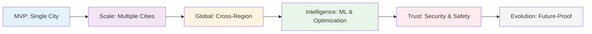
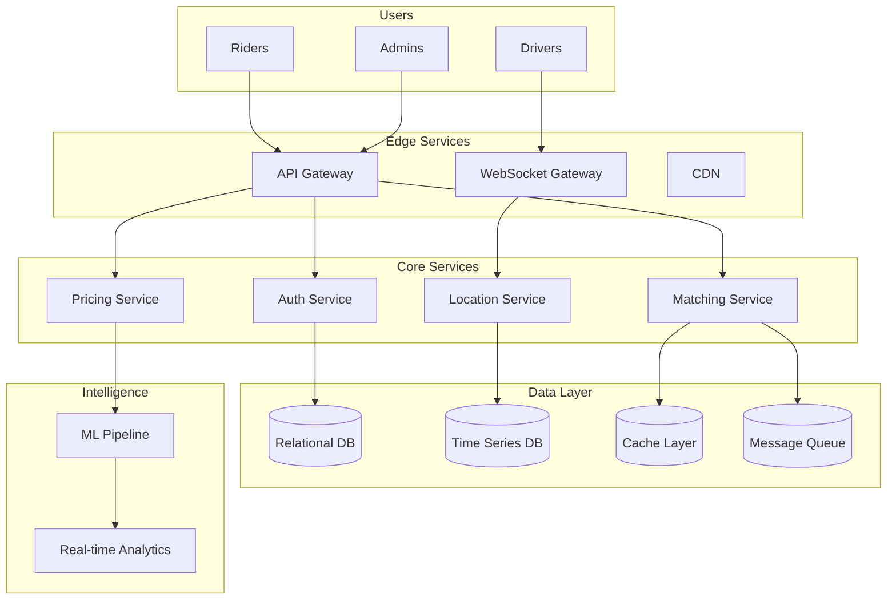

# Part IV: End-to-End Case Study - Building a Ride-Sharing Platform

!!! info "Prerequisites"
    - Completed [Part I: The 8 Axioms](../part1-axioms/index.md)
    - Completed [Part II: Foundational Pillars](../part2-pillars/index.md)
    - Basic understanding of distributed systems patterns

!!! tip "Quick Navigation"
    [← Home](../index.md) | 
    [Part I: Axioms](../part1-axioms/index.md) |
    [Part II: Pillars](../part2-pillars/index.md)

!!! target "Learning Objective"
    Apply all axioms and pillars to design a real-world distributed system from scratch, making trade-offs and evolving the architecture as requirements change.

## Overview

In this comprehensive case study, we'll build **RideFlow**, a global ride-sharing platform. This isn't just another system design exercise—it's a journey through the real decisions, trade-offs, and evolution of a distributed system.

**Why a ride-sharing platform?**
- **All axioms apply**: From physics (drivers moving) to economics (pricing)
- **All pillars required**: Work, state, truth, control, intelligence, and trust
- **Real-time constraints**: Matching must happen in seconds
- **Global scale**: Millions of concurrent users across continents
- **Life-critical**: Safety and reliability aren't optional

## The Journey

## Case Study Structure

### 🚀 Phase 1: MVP (Minimum Viable Platform)
*Start small, think big*

- Single city deployment
- Basic matching algorithm
- Simple state management
- Monolithic architecture (yes, really!)

**Key Decisions**: Why monolith first? Database choice. API design.

### 🌍 Phase 2: Multi-City Expansion
*The first taste of distribution*

- Geographic partitioning
- Introducing caching layers
- Service extraction begins
- First coordination challenges

**Key Decisions**: Sharding strategy. Service boundaries. Consistency trade-offs.

### 🌐 Phase 3: Global Platform
*True distributed systems challenges*

- Cross-region replication
- Global state management
- Consensus for critical operations
- Operational complexity explodes

**Key Decisions**: CAP theorem in practice. Conflict resolution. Failover strategies.

### 🧠 Phase 4: Intelligent Operations
*From reactive to predictive*

- Demand prediction
- Dynamic pricing
- Route optimization
- Fraud detection at scale

**Key Decisions**: ML pipeline architecture. Real-time vs batch. Feature stores.

### 🔒 Phase 5: Trust at Scale
*Security as a first-class citizen*

- Zero trust architecture
- Privacy by design
- Regulatory compliance (GDPR, CCPA)
- Safety features (SOS, route sharing)

**Key Decisions**: Identity management. Encryption strategies. Audit systems.

### 🔮 Phase 6: Future Evolution
*Preparing for what's next*

- Autonomous vehicle integration
- Multi-modal transportation
- Carbon-aware routing
- Blockchain experiments

**Key Decisions**: Extensibility. Migration strategies. Technical debt management.

## Real-World Constraints

Throughout this case study, we'll face real constraints:

**Business Constraints**
- 💰 Limited budget initially
- 👥 Small engineering team
- 🚀 Aggressive growth targets
- 🏛️ Regulatory requirements

**Technical Constraints**
- ⚡ <3 second match time
- 📱 Unreliable mobile networks
- 🌍 Global latency variations
- 💾 Petabytes of location data

**Human Constraints**
- 🧠 Cognitive load on engineers
- 📞 24/7 on-call requirements
- 🎓 Varying skill levels
- 🌏 Distributed teams

## What Makes This Different

Unlike typical system design interviews, this case study:

1. **Shows Evolution**: We don't jump to the final architecture
2. **Admits Mistakes**: We'll make wrong decisions and fix them
3. **Includes Operations**: It's not just design, but running the system
4. **Considers Economics**: Every decision has a cost
5. **Embraces Trade-offs**: No perfect solutions, only good-enough ones

## Learning Outcomes

By the end of this case study, you'll understand:

!!! success "Practical Skills"
    ✅ How to apply axioms to real problems  
    ✅ When to use each pillar pattern  
    ✅ How architectures evolve over time  
    ✅ Why "it depends" is often the right answer  
    ✅ How to make and document trade-offs  

## The RideFlow Universe

## A Note on Realism

**This is based on real systems** 🌟

While we can't disclose proprietary details from actual ride-sharing companies, this case study synthesizes:
- Public engineering blogs from Uber, Lyft, Grab, Didi
- Common patterns from distributed systems literature  
- Real production incidents and their solutions
- Actual trade-offs made in similar systems

**We'll cite sources** where public information is available.

## How to Use This Case Study

### 🎯 For Job Seekers
- Practice system design with realistic constraints
- Understand the "why" behind architectural decisions
- Learn to communicate trade-offs effectively

### 🏗️ For Architects
- See patterns applied in context
- Understand evolutionary architecture
- Learn from documented mistakes

### 👩‍💻 For Engineers
- Connect theory to practice
- Understand the full system lifecycle
- See how your component fits the whole

### 📚 For Students
- Bridge academic knowledge to industry
- See first-principles thinking applied
- Understand real-world complexity

## Ready to Begin?

Let's start our journey with a simple question that every distributed system begins with:

**"How do we connect a rider who needs a ride with a driver who can provide one?"**

### [→ Chapter 1: The MVP - Starting Simple](chapter1-mvp.md)

In Chapter 1, we'll build RideFlow v0.1 for a single city, making our first architectural decisions and understanding why starting with a monolith might be the right choice.

## Chapter Overview

!!! abstract "What's in Each Chapter"
    
    **[Chapter 1: MVP](chapter1-mvp.md)** - Single city, monolithic architecture  
    **[Chapter 2: Multi-City](chapter2-multi-city.md)** - Geographic distribution begins  
    **[Chapter 3: Going Global](chapter3-global.md)** - Cross-region challenges  
    **[Chapter 4: Intelligence](chapter4-intelligence.md)** - ML and predictive systems  
    **[Chapter 5: Trust & Security](chapter5-trust.md)** - Zero trust implementation  
    **[Chapter 6: Evolution](chapter6-evolution.md)** - Future-proofing the platform  
    **[Chapter 7: Lessons Learned](chapter7-lessons.md)** - Retrospective and insights  

## Navigation

!!! tip "Quick Links"
    
    **Start Here**: [Chapter 1: The MVP](chapter1-mvp.md)
    
    **Reference**: [Architecture Decisions](architecture-decisions.md) | [Trade-off Analysis](tradeoffs.md)
    
    **Tools**: [Load Calculator](../tools/capacity-planner.md) | [Latency Simulator](../tools/latency-calculator.md)