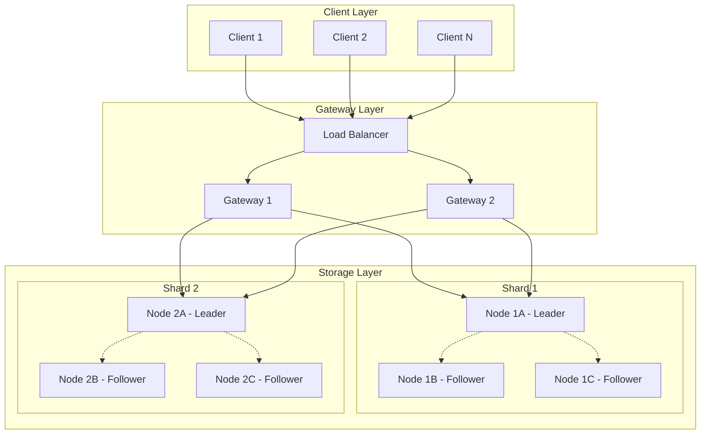
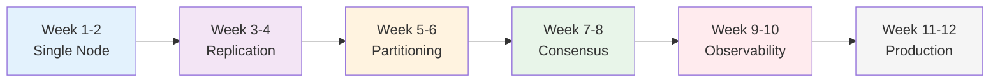

# Part V: Capstone Project - Build Your Own Distributed System

!!! info "Prerequisites"
    - Completed [Part I: The 8 Axioms](../part1-axioms/index.md)
    - Completed [Part II: Foundational Pillars](../part2-pillars/index.md)
    - Basic programming experience (Python/Go/Java)
    - Understanding of networking fundamentals

!!! tip "Quick Navigation"
    [← Part IV: Case Study](../part4-case-study/index.md) | 
    [Project Setup →](setup.md) |
    [Part VI: Advanced Topics →](../part6-advanced/index.md)

!!! target "Learning Objective"
    Apply everything you've learned by building a real distributed system from scratch. By the end, you'll have a working distributed key-value store that handles failures, maintains consistency, and scales horizontally.

## Overview

<div class="capstone-intro">

Welcome to the culmination of your distributed systems journey! In this capstone project, you'll build **DistKV** - a distributed key-value store that embodies all the principles and patterns you've learned.

**Why a key-value store?**
- **Simple interface**: Just GET, PUT, DELETE operations
- **Rich in challenges**: All distributed systems problems appear
- **Industry relevant**: Redis, DynamoDB, Cassandra all started here
- **Extensible**: Can evolve into a database, cache, or message queue

</div>

## What You'll Build

<div class="project-overview">



</div>

## Project Milestones

### 🏁 Milestone 1: Single-Node Store
*Build the foundation*

- Basic key-value operations
- Persistent storage with WAL
- Simple TCP server
- Client library

**You'll Learn**: Storage engines, networking, protocol design

### 🔄 Milestone 2: Replication
*Add fault tolerance*

- Leader-follower replication
- Synchronous & asynchronous modes
- Failure detection
- Automatic failover

**You'll Learn**: Consensus basics, heartbeats, split-brain prevention

### 🎯 Milestone 3: Partitioning
*Scale horizontally*

- Consistent hashing
- Virtual nodes
- Rebalancing
- Cross-shard queries

**You'll Learn**: Sharding strategies, data distribution, hotspot prevention

### 🤝 Milestone 4: Consensus
*Achieve strong consistency*

- Implement Raft consensus
- Leader election
- Log replication
- Snapshot support

**You'll Learn**: Distributed consensus, state machines, linearizability

### 🔍 Milestone 5: Observability
*See what's happening*

- Metrics collection
- Distributed tracing
- Health checks
- Performance monitoring

**You'll Learn**: Instrumentation, debugging distributed systems

### 🚀 Milestone 6: Production Features
*Make it real*

- Authentication & authorization
- Rate limiting
- Backup & restore
- Multi-datacenter support

**You'll Learn**: Operational excellence, security, geo-distribution

## Technical Stack

<div class="tech-stack">

### Core Implementation
Choose your language (we provide starter code for all):

- **Go**: Best performance, great concurrency primitives
- **Python**: Easiest to start, good libraries
- **Rust**: Memory safety, zero-cost abstractions
- **Java**: Enterprise-ready, mature ecosystem

### Required Tools
- Docker & Docker Compose
- Git for version control
- Your favorite IDE
- Basic Linux/Unix commands

### Provided Infrastructure
- Testing framework
- Benchmarking tools
- Failure injection library
- Monitoring stack (Prometheus + Grafana)

</div>

## Learning Path

<div class="learning-progression">



### Weekly Schedule

| Week | Focus | Deliverable |
|------|-------|------------|
| 1-2 | Single-node implementation | Working KV store with persistence |
| 3-4 | Add replication | 3-node cluster with failover |
| 5-6 | Implement sharding | Multi-shard cluster |
| 7-8 | Add Raft consensus | Strongly consistent system |
| 9-10 | Build observability | Full monitoring dashboard |
| 11-12 | Production hardening | Deployment-ready system |

</div>

## Success Criteria

<div class="success-metrics">

Your DistKV implementation should achieve:

### ⚡ Performance
- 10,000+ ops/sec on single node
- <10ms p99 latency for reads
- <50ms p99 latency for writes
- Linear scaling with nodes

### 🛡️ Reliability
- Survive any single node failure
- No data loss with majority alive
- Automatic recovery
- Split-brain prevention

### 📊 Observability
- Real-time metrics dashboard
- Distributed trace for every request
- Alert on anomalies
- Performance profiling

### 🏭 Operations
- Zero-downtime upgrades
- Backup without stopping
- Multi-region deployment
- Chaos engineering ready

</div>

## Getting Started

<div class="getting-started">

### 1. Choose Your Language

```bash
# Clone the starter repository
git clone https://github.com/deepaucksharma/distkv-capstone
cd distkv-capstone

# Choose your language branch
git checkout starter-go      # For Go
git checkout starter-python  # For Python
git checkout starter-rust    # For Rust
git checkout starter-java    # For Java
```

### 2. Set Up Development Environment

```bash
# Install dependencies
make setup

# Run tests to verify setup
make test

# Start single node
make run-single
```

### 3. Understand the Starter Code

```
distkv/
├── cmd/           # Entry points
├── internal/      # Core implementation
│   ├── storage/   # Storage engine
│   ├── network/   # RPC layer
│   ├── consensus/ # Raft implementation
│   └── shard/     # Sharding logic
├── test/          # Test suites
├── bench/         # Benchmarks
└── deploy/        # Deployment configs
```

</div>

## Assessment Framework

<div class="assessment-box">

### Self-Assessment Checkpoints

Each milestone includes:
- **Unit tests** to verify correctness
- **Integration tests** for end-to-end validation
- **Chaos tests** to verify failure handling
- **Benchmarks** to measure performance

### Peer Review

Share your implementation for review:
- Architecture decisions document
- Code walkthrough video
- Performance analysis
- Failure scenario testing

### Certification Path

Complete all milestones to earn:
- **DistKV Builder** certificate
- Portfolio-ready project
- Real distributed systems experience
- Industry-relevant skills

</div>

## Common Pitfalls

!!! warning "Watch Out For These"
    
    1. **Networking assumptions**: TCP doesn't guarantee message boundaries
    2. **Time synchronization**: Clocks drift, use logical timestamps
    3. **Failure detection**: Network partitions vs node failures
    4. **Data consistency**: Read-your-writes vs eventual consistency
    5. **Performance**: Premature optimization vs profiling

## Support Resources

<div class="support-grid">

### 📚 Documentation
- API reference
- Architecture guide
- Troubleshooting FAQ
- Best practices

### 💬 Community
- Discord server
- Weekly office hours
- Peer study groups
- Code reviews

### 🎓 Supplementary Learning
- Recommended papers
- Video walkthroughs
- Live coding sessions
- Guest lectures

### 🏆 Showcase
- Hall of fame
- Implementation variants
- Performance leaders
- Creative extensions

</div>

## Beyond the Basics

Once you complete the core project, explore these extensions:

<div class="extensions-grid">

### 🔐 Security Hardening
- Implement TLS/mTLS
- Add encryption at rest
- Build RBAC system
- Audit logging

### 🌍 Geo-Distribution
- Multi-region replication
- Conflict resolution (CRDTs)
- Read locality optimization
- Disaster recovery

### 🧠 Advanced Features
- SQL query layer
- Time-series support
- Full-text search
- Graph operations

### ⚡ Performance Optimization
- Custom storage engine
- Zero-copy networking
- SIMD operations
- GPU acceleration

</div>

## Ready to Build?

<div class="cta-box">

This is where theory meets practice. You've learned the principles, studied the patterns, and analyzed real systems. Now it's time to build your own.

### [→ Start with Project Setup](setup.md)

Set up your development environment and write your first key-value operation.

### [→ Review the Starter Code](starter-code.md)

Understand the provided framework and architecture.

### [→ Join the Community](https://discord.gg/distkv)

Connect with other builders, get help, and share progress.

</div>

## Frequently Asked Questions

??? question "How much time should I dedicate?"
    Plan for 10-15 hours per week over 12 weeks. Each milestone takes roughly 20-30 hours of focused work.

??? question "Can I use external libraries?"
    Yes! We encourage using battle-tested libraries for networking, serialization, etc. The learning is in composing them correctly.

??? question "What if I get stuck?"
    1. Check the troubleshooting guide
    2. Search the community forum
    3. Attend office hours
    4. Post a specific question with code examples

??? question "Can I implement in a different language?"
    Absolutely! The concepts are language-agnostic. We'll help you adapt the tests and benchmarks.

??? question "Is this suitable for interviews?"
    Yes! This project demonstrates deep understanding of distributed systems, making it excellent for senior engineering interviews.

## Navigation

!!! tip "Quick Links"
    
    **Next Step**: [Project Setup](setup.md) - Get your environment ready
    
    **Resources**: [API Specification](api-spec.md) | [Testing Guide](testing.md)
    
    **Support**: [Discord](https://discord.gg/distkv) | [Office Hours](office-hours.md)