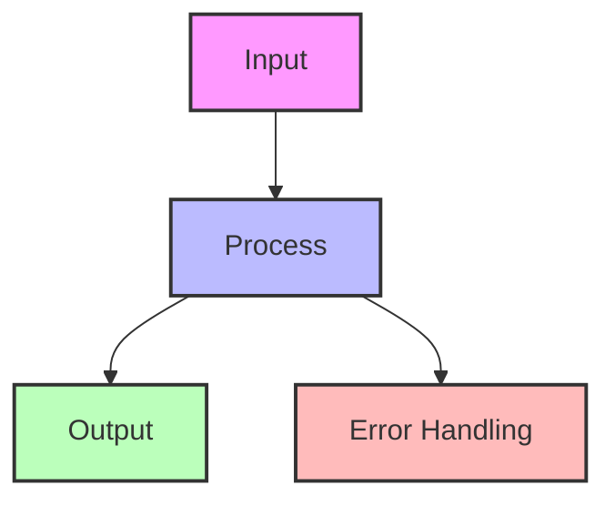

## Essential Question

**How do we structure our system architecture to leverage ambassador pattern?**

# Ambassador Pattern

!!! warning "🥈 Silver Tier Pattern"
    **Service Communication Proxy** • Best for legacy integration and protocol translation
    
    A useful pattern for handling complex service communication. While valuable for specific integration scenarios, modern service meshes often provide these capabilities out-of-the-box.

**Your diplomatic representative: Bridging the gap between modern and legacy systems**

> *"The Ambassador pattern is like having a multilingual diplomat who speaks both your language and the foreign service's language, handling all the complex negotiations and translations so you don't have to."*

---

## Level 1: Intuition

### The Embassy Analogy

### Visual Architecture Comparison

### Real-World Examples

| Company | Ambassador Implementation | Purpose | Impact |
|---------|--------------------------|---------|---------|
| **Netflix** | Zuul API Gateway | Protocol translation, routing | 100B+ requests/day |
| **Uber** | Edge Gateway | Mobile API optimization | 50% latency reduction |
| **PayPal** | Legacy adapter services | SOAP to REST translation | 90% faster integration |
| **Stripe** | API compatibility layer | Version bridging | Zero downtime upgrades |
| **Salesforce** | Integration services | Multi-protocol support | 1000+ integrations |

### Common Ambassador Scenarios

---

## Level 2: Foundation

### Core Concepts

### Ambassador Pattern Types

| Type | Purpose | Use Case | Complexity |
|------|---------|----------|------------|
| **Protocol Ambassador** | Translate between protocols | REST ↔ SOAP | Medium |
| **Authentication Ambassador** | Handle complex auth flows | OAuth ↔ SAML | High |
| **Resilience Ambassador** | Add reliability patterns | Retry, circuit breaking | Medium |
| **Optimization Ambassador** | Optimize communication | Batching, caching | High |
| **Security Ambassador** | Add security layers | Encryption, validation | High |

### Decision Framework

### Protocol Translation Matrix

| From/To | REST | SOAP | GraphQL | gRPC | Binary |
|---------|------|------|---------|------|--------|
| **REST** | ✓ | Ambassador | Ambassador | Ambassador | Ambassador |
| **SOAP** | Ambassador | ✓ | Ambassador | Ambassador | Ambassador |
| **GraphQL** | Ambassador | Ambassador | ✓ | Ambassador | Ambassador |
| **gRPC** | Ambassador | Ambassador | Ambassador | ✓ | Ambassador |
| **Binary** | Ambassador | Ambassador | Ambassador | Ambassador | ✓ |

#
## Decision Matrix

### Quick Decision Table

| Factor | Low Complexity | Medium Complexity | High Complexity |
|--------|----------------|-------------------|-----------------|
| Team Size | < 5 developers | 5-20 developers | > 20 developers |
| Traffic | < 1K req/s | 1K-100K req/s | > 100K req/s |
| Data Volume | < 1GB | 1GB-1TB | > 1TB |
| **Recommendation** | ❌ Avoid | ⚠️ Consider | ✅ Implement |

## Implementation Strategies

### 1. Standalone Service Ambassador

#### 2. Sidecar Ambassador

#### 3. Library Ambassador

### Common Integration Patterns

#### SOAP to REST Translation

#### Legacy Authentication Bridge

### Performance Considerations

| Aspect | Without Ambassador | With Ambassador | Optimization Strategy |
|--------|-------------------|-----------------|----------------------|
| **Latency** | Direct call | +5-10ms | Connection pooling, caching |
| **Throughput** | Native | 80-95% | Async processing, batching |
| **Memory** | App only | +50-200MB | Efficient buffering |
| **CPU** | Protocol in app | Dedicated | Horizontal scaling |
| **Complexity** | High in app | Isolated | Single responsibility |

---

## Level 3: Deep Dive

### Advanced Ambassador Patterns

#### 1. Multi-Protocol Ambassador

#### 2. Intelligent Retry Ambassador

### Protocol Translation Deep Dive

#### SOAP ↔ REST Translation Table

| SOAP Element | REST Equivalent | Translation Strategy |
|--------------|-----------------|---------------------|
| **Envelope** | HTTP Headers | Extract/Generate |
| **Header** | Custom Headers | Map security tokens |
| **Body** | Request Body | XML ↔ JSON |
| **Fault** | Error Response | Status codes + body |
| **Namespace** | URL Path | Namespace → Resource |
| **Operation** | HTTP Method | Action → CRUD |

#### Translation Example Flow

### Performance Optimization Strategies

#### 1. Connection Pooling

#### 2. Request Batching

### Resilience Patterns

#### Circuit Breaker States

### Monitoring and Observability

#### Key Metrics to Track

| Metric | Purpose | Alert Threshold |
|--------|---------|-----------------|
| **Translation Latency** | Protocol conversion time | > 10ms |
| **Connection Pool Usage** | Resource utilization | > 80% |
| **Error Rate** | Failed translations | > 1% |
| **Cache Hit Rate** | Performance optimization | < 60% |
| **Circuit Breaker Trips** | System health | > 5/hour |
| **Request Queue Size** | Backpressure indicator | > 1000 |

#### Distributed Tracing

---

## Level 4: Expert

### Production Case Studies

#### Netflix's Edge Gateway Ambassador

Netflix uses Zuul as an ambassador pattern implementation at the edge:

**Key Achievements:**
- 100+ billion requests per day
- 50+ different device types supported
- 99.99% availability
- Sub-50ms added latency

#### PayPal's Legacy Integration Ambassador

PayPal uses ambassador pattern for modernization:

| Metric | Before Ambassador | After Ambassador |
|--------|-------------------|------------------|
| **Integration Time** | 6-12 months | 2-4 weeks |
| **Error Rate** | 5-10% | < 0.1% |
| **Development Speed** | Slow (SOAP complexity) | Fast (REST simplicity) |
| **Maintenance Cost** | High | 70% reduction |

### Advanced Implementation Patterns

#### 1. Adaptive Ambassador

**Adaptive Strategies:**

| Condition | Adaptation | Benefit |
|-----------|------------|---------|
| **High Latency** | Increase cache TTL | Reduce backend calls |
| **Error Spike** | Aggressive circuit breaking | Protect backend |
| **Low Traffic** | Reduce connection pool | Save resources |
| **Peak Hours** | Enable request batching | Improve throughput |

#### 2. Multi-Region Ambassador

### Performance Optimization Deep Dive

#### Request Coalescing

#### Intelligent Caching Strategy

| Cache Level | What to Cache | TTL | Invalidation |
|-------------|---------------|-----|--------------|
| **L1: Memory** | Hot data | 1-5 min | Time-based |
| **L2: Redis** | Warm data | 5-60 min | Event-based |
| **L3: CDN** | Static translations | 1-24 hours | Version-based |

### Error Handling Strategies

#### Error Translation Matrix

| Legacy Error | HTTP Status | Client Message | Retry Strategy |
|--------------|-------------|----------------|----------------|
| **SOAP Fault** | 500 | "Service error" | Exponential backoff |
| **Timeout** | 504 | "Request timeout" | Immediate retry once |
| **Auth Failed** | 401 | "Invalid credentials" | No retry |
| **Rate Limited** | 429 | "Too many requests" | Retry after header |
| **Not Found** | 404 | "Resource not found" | No retry |

### Security Best Practices

#### Zero-Trust Ambassador

### Deployment Strategies

#### Blue-Green Ambassador Deployment

---

## Level 5: Mastery

### Theoretical Foundations

#### Ambassador Pattern Principles

1. **Separation of Concerns**
   - Business logic stays clean
   - Infrastructure complexity isolated
   - Protocol details abstracted

2. **Single Responsibility**
   - Ambassador handles ONLY translation/adaptation
   - No business logic in ambassador
   - Clear boundaries

3. **Dependency Inversion**
   - Clients depend on abstractions
   - Legacy details hidden
   - Flexible implementation

### Mathematical Models

#### Performance Impact Model

#### Capacity Planning

| Metric | Formula | Example |
|--------|---------|---------|
| **Requests/sec** | Client_RPS * Translation_Factor | 1000 * 1.2 = 1200 |
| **CPU Cores** | RPS / (1000 / Latency_ms) | 1200 / (1000/5) = 6 |
| **Memory** | Connections * Buffer_Size + Cache_Size | 1000 * 10KB + 1GB |
| **Network** | RPS * (Request_Size + Response_Size) | 1200 * 5KB = 6MB/s |

### Future Directions

#### AI-Powered Ambassador

**AI Capabilities:**
- Predict request patterns
- Auto-generate protocol mappings
- Optimize caching strategies
- Detect anomalies
- Self-heal configurations

---

## Quick Reference

### When to Use Ambassador Pattern

✅ **Use When:**
- Integrating with legacy systems
- Protocol translation needed
- Complex authentication flows
- Adding resilience to external calls
- Gradual migration strategy

❌ **Don't Use When:**
- Simple, compatible services
- Performance is critical
- Direct integration is possible
- Overhead not justified

#
## Decision Matrix

### Quick Decision Table

| Factor | Low Complexity | Medium Complexity | High Complexity |
|--------|----------------|-------------------|-----------------|
| Team Size | < 5 developers | 5-20 developers | > 20 developers |
| Traffic | < 1K req/s | 1K-100K req/s | > 100K req/s |
| Data Volume | < 1GB | 1GB-1TB | > 1TB |
| **Recommendation** | ❌ Avoid | ⚠️ Consider | ✅ Implement |

## Implementation Checklist

- [ ] Define translation requirements
- [ ] Choose deployment model
- [ ] Design error handling
- [ ] Implement monitoring
- [ ] Add security layers
- [ ] Plan caching strategy
- [ ] Set up circuit breakers
- [ ] Configure connection pools
- [ ] Document mappings
- [ ] Test failure scenarios

### Common Anti-Patterns

1. **Business Logic in Ambassador** - Keep it pure translation
2. **Synchronous Everything** - Use async where possible
3. **No Circuit Breakers** - Always protect backend
4. **Over-caching** - Balance freshness vs performance
5. **Tight Coupling** - Ambassador should be replaceable

### Related Patterns

- **Adapter Pattern** - Similar but typically in-process
- **Facade Pattern** - Simplifies interface but same process
- **Proxy Pattern** - Focuses on access control
- **Gateway Pattern** - Broader routing responsibilities
- **Anti-Corruption Layer** - Domain-driven design context

---

## 🎓 Key Takeaways

1. **Protocol Agnostic** - Clients use simple protocols
2. **Complexity Isolation** - Legacy details hidden
3. **Evolution Enabler** - Gradual migration path
4. **Resilience Layer** - Protect against failures
5. **Operational Benefits** - Monitoring, security, caching

---

*"The Ambassador pattern is your diplomatic solution to the Tower of Babel problem in distributed systems - letting everyone speak their preferred language while ensuring the message gets through."*

---

**Previous**: [← Backends for Frontends](../architecture/backends-for-frontends.md) | **Next**: Anti-Corruption Layer → (Coming Soon)

