# Anti-Corruption Layer (ACL)

!!! warning "🥈 Silver Tier Pattern"
    **Domain Boundary Protection** • Best for DDD and legacy integration
    
    A valuable pattern for maintaining clean domain boundaries. Essential in domain-driven design contexts but adds complexity that may not be needed in simpler architectures.

**Your domain's immune system: Protecting clean architecture from foreign concepts**

> *"The Anti-Corruption Layer is like a translator at the United Nations - ensuring each domain speaks its own language while still enabling meaningful communication between vastly different systems."*

---

## Essential Questions for Architects

### 🤔 Key Decision Points

1. **Do you have legacy systems with incompatible models?**
   - If yes → ACL provides essential isolation
   - If no → May be over-engineering

2. **Are you practicing Domain-Driven Design?**
   - If yes → ACL maintains bounded context integrity
   - If no → Consider simpler integration patterns

3. **How different are the external models from yours?**
   - Completely different → Full ACL needed
   - Minor differences → Simple adapters may suffice
   - Same models → Direct integration possible

4. **What's your tolerance for external changes?**
   - Zero tolerance → ACL is mandatory
   - Some flexibility → Partial ACL approach
   - High tolerance → Direct integration with monitoring

5. **What's the cost of domain pollution?**
   - Business-critical domain → Invest in ACL
   - Support system → Balance cost vs benefit
   - Prototype → Skip ACL initially

---

## Decision Criteria Matrix

| Criterion | Use ACL | Use Adapter | Direct Integration |
|-----------|---------|-------------|--------------------|
| **Model Compatibility** | Incompatible | Similar with differences | Identical |
| **Change Frequency** | High external changes | Moderate changes | Stable interfaces |
| **Domain Criticality** | Core domain | Supporting domain | Generic subdomain |
| **Team Boundaries** | Different organizations | Different teams | Same team |
| **Technical Debt** | High in external | Moderate | Low |
| **Performance Needs** | Can tolerate overhead | Some overhead OK | Minimal latency |

---

## Architectural Decision Framework


---

## Level 1: Intuition

### Core Architecture Pattern


### Architecture Trade-offs

| Aspect | Without ACL | With ACL |
|--------|-------------|----------|
| **Domain Purity** | ❌ Contaminated with external concepts | ✅ Clean domain model |
| **Change Impact** | ❌ Ripples through entire system | ✅ Isolated to ACL layer |
| **Complexity** | ✅ Simpler initial implementation | ❌ Additional translation layer |
| **Performance** | ✅ Direct calls, lower latency | ❌ Translation overhead |
| **Maintenance** | ❌ Hard to evolve independently | ✅ Easy to modify mappings |
| **Testing** | ❌ Coupled tests | ✅ Isolated testing |

### Real-World Examples

| Company | ACL Implementation | Purpose | Impact |
|---------|-------------------|---------|---------|
| **Amazon** | Order Service ACL | Isolate from legacy fulfillment | Clean microservices |
| **Netflix** | Billing System ACL | Protect from partner APIs | Domain integrity |
| **Spotify** | Music Rights ACL | Shield from label systems | Flexible licensing |
| **Uber** | Payment Provider ACL | Abstract payment complexity | Provider independence |
| **Airbnb** | Property System ACL | Isolate from partner feeds | Consistent data model |


### Implementation Strategies Comparison

| Strategy | When to Use | Complexity | Performance Impact |
|----------|-------------|------------|--------------------|
| **Full ACL** | Legacy systems, incompatible models | High | 10-20ms overhead |
| **Lightweight Adapter** | Minor differences, same team | Low | 1-2ms overhead |
| **Facade Pattern** | Multiple similar services | Medium | 5-10ms overhead |
| **Direct Integration** | Compatible models, stable API | None | No overhead |

### Common Integration Scenarios


---

## Level 2: Foundation

### Core Concepts


### ACL Pattern Components

| Component | Purpose | Responsibility | Example |
|-----------|---------|----------------|---------|
| **Translator** | Model conversion | Map between domain and external models | Customer ↔ LegacyUser |
| **Validator** | Rule enforcement | Ensure data integrity | Email format validation |
| **Adapter** | Protocol handling | Handle communication details | REST ↔ SOAP |
| **Facade** | Simple interface | Hide complexity from domain | Single method for multi-step process |
| **Repository** | Data access | Abstract storage details | Domain-specific queries |


### Translation Strategies

#### 1. Model Translation Matrix

```mermaid
graph LR
    subgraph "Domain Model"
        DM[Customer<br/>━━━━━━━<br/>• id: UUID<br/>• email: Email<br/>• name: Name<br/>• tier: CustomerTier]
    end
    
    subgraph "Translation Layer"
        TL[Translator<br/>━━━━━━━<br/>• mapToDomain()<br/>• mapToExternal()<br/>• validate()]
    end
    
    subgraph "External Model"
        EM[USER_RECORD<br/>━━━━━━━<br/>• USER_ID: NUMBER<br/>• EMAIL_ADDR: VARCHAR<br/>• FIRST_NM: VARCHAR<br/>• LAST_NM: VARCHAR<br/>• CUST_TYPE: CHAR]
    end
    
    DM <--> TL <--> EM
```

#### 2. Data Flow Patterns


### Implementation Patterns

#### 1. Repository Pattern with ACL

```
Domain Layer:
┌─────────────────────────────────┐
│   CustomerRepository            │
│   (Interface)                   │
│   ━━━━━━━━━━━━━━━━━━━         │
│   + find(CustomerId): Customer  │
│   + save(Customer): void        │
└─────────────────────────────────┘
                ↓
ACL Implementation:
┌─────────────────────────────────┐
│   LegacyCustomerRepository      │
│   (ACL Implementation)          │
│   ━━━━━━━━━━━━━━━━━━━         │
│   - translator: Translator      │
│   - legacyClient: LegacyAPI     │
│   ─────────────────────         │
│   + find(CustomerId): Customer  │
│   + save(Customer): void        │
└─────────────────────────────────┘
                ↓
External System:
┌─────────────────────────────────┐
│   LegacyDatabaseAPI             │
│   ━━━━━━━━━━━━━━━━━           │
│   + SELECT_USER(ID): USER_REC   │
│   + UPDATE_USER(USER_REC): BOOL │
└─────────────────────────────────┘
```

#### 2. Event Translation

```mermaid
graph TB
    subgraph "Domain Events"
        DE1[OrderPlaced]
        DE2[PaymentReceived]
        DE3[OrderShipped]
    end
    
    subgraph "ACL Event Translator"
        ET[Event Translator<br/>━━━━━━━━━━━<br/>• Domain → External<br/>• External → Domain<br/>• Event Enrichment]
    end
    
    subgraph "External Events"
        EE1[ORDER_CREATED_V1]
        EE2[PAYMENT_NOTIFICATION]
        EE3[SHIPMENT_UPDATE]
    end
    
    DE1 --> ET --> EE1
    DE2 --> ET --> EE2
    DE3 --> ET --> EE3
    
    EE1 --> ET --> DE1
    EE2 --> ET --> DE2
    EE3 --> ET --> DE3
```



### Common Translation Challenges

| Challenge | Problem | ACL Solution |
|-----------|---------|--------------|
| **Impedance Mismatch** | Different data models | Multi-step translation |
| **Missing Data** | External lacks required fields | Default values, enrichment |
| **Format Differences** | Date, currency formats | Format converters |
| **Validation Rules** | Different business rules | Rule adaptation layer |
| **Versioning** | External API changes | Version-specific translators |


---

## Level 3: Deep Dive

### Advanced ACL Patterns

#### 1. Context Mapping with ACL


#### 2. Multi-Layer Translation


### Translation Patterns Deep Dive

#### 1. Bidirectional Mapping Strategy

```
Domain → External Mapping:
┌────────────────────┐         ┌────────────────────┐
│   Order            │         │   PURCHASE_ORDER    │
│   ────────────     │         │   ─────────────    │
│   orderId: UUID    │   →→→   │   PO_NUM: CHAR(10) │
│   customer: Customer│   →→→   │   CUST_ID: NUMBER  │
│   items: LineItem[] │   →→→   │   (Separate table) │
│   total: Money     │   →→→   │   TOTAL_AMT: DECIMAL│
│   status: Status   │   →→→   │   STATUS_CD: CHAR(1)│
└────────────────────┘         └────────────────────┘

Mapping Rules:
• UUID → Legacy ID (lookup table)
• Customer → Customer ID only
• LineItems → Separate PO_LINES table
• Money → Decimal (currency conversion)
• Status Enum → Status Code
```

#### 2. Validation and Enrichment Pipeline


### Complex Integration Scenarios

#### 1. Aggregating Multiple External Systems


#### 2. Event Stream Translation


### Performance Optimization Strategies

| Strategy | Description | Use Case | Trade-off |
|----------|-------------|----------|-----------|
| **Caching** | Cache translations | Stable mappings | Memory usage |
| **Batch Processing** | Translate in batches | High volume | Latency |
| **Lazy Loading** | Translate on demand | Large objects | First-call penalty |
| **Pre-computation** | Pre-translate common cases | Predictable patterns | Storage |
| **Streaming** | Stream-based translation | Large datasets | Complexity |


### Error Handling in ACL

#### Error Translation Matrix

| External Error | Domain Exception | Recovery Strategy |
|----------------|------------------|-------------------|
| **Connection Timeout** | ServiceUnavailableException | Retry with backoff |
| **Invalid Data Format** | DataIntegrityException | Log and reject |
| **Business Rule Violation** | DomainRuleException | Return validation error |
| **Authentication Failed** | UnauthorizedException | Refresh credentials |
| **Rate Limited** | ThrottledException | Queue and retry |


#### Failure Isolation


### Testing Strategies for ACL

#### 1. Contract Testing

```
External Contract Tests:
┌─────────────────────────┐
│   Contract Test Suite   │
│   ─────────────────    │
│   • Request Format      │
│   • Response Format     │
│   • Error Scenarios     │
│   • Edge Cases          │
└───────────┬─────────────┘
            │
            ▼
┌─────────────────────────┐
│   ACL Implementation    │
│   ─────────────────    │
│   ✓ Validates contracts │
│   ✓ Handles all cases   │
└─────────────────────────┘
```

#### 2. Translation Testing Matrix

| Test Type | What to Test | Example |
|-----------|--------------|---------|
| **Unit Tests** | Individual translators | Field mapping logic |
| **Integration Tests** | Full translation pipeline | End-to-end flow |
| **Property Tests** | Translation properties | Roundtrip consistency |
| **Contract Tests** | External system contracts | API compatibility |
| **Performance Tests** | Translation overhead | Latency impact |


---

## Level 4: Production Insights

### Real-World Impact Metrics

| Company | Use Case | Key Benefit | Metric |
|---------|----------|-------------|--------|
| **Spotify** | Music rights integration | 70+ label systems | 50% faster integration |
| **Amazon** | Warehouse systems | Legacy isolation | 99.9% error reduction |
| **Netflix** | Partner APIs | Clean architecture | 80% less coupling |
| **Uber** | Payment providers | Provider independence | 90% faster changes |


### Security Considerations

| Security Aspect | Implementation | Priority |
|-----------------|----------------|----------|
| **Input Validation** | Validate all external data | Critical |
| **Data Sanitization** | Clean before translation | Critical |
| **Authentication** | Verify external system identity | High |
| **Encryption** | Secure data in transit | High |
| **Audit Logging** | Track all translations | Medium |


---


---

## Quick Reference

### ACL vs Related Patterns

| Pattern | Focus | Scope | Complexity |
|---------|-------|-------|------------|
| **ACL** | Domain protection | Strategic | High |
| **Adapter** | Interface matching | Tactical | Medium |
| **Facade** | Simplification | Tactical | Low |
| **Translator** | Data conversion | Tactical | Medium |
| **Gateway** | Routing | Infrastructure | High |

### When to Use ACL

✅ **Use When:**
- Integrating with legacy systems
- Protecting domain model purity
- External system has poor design
- Multiple external integrations
- Planning future migrations

❌ **Don't Use When:**
- Simple, well-designed APIs
- Internal service communication
- Performance is critical
- Overhead exceeds benefits

### Implementation Checklist

- [ ] Define bounded context boundaries
- [ ] Map external models to domain
- [ ] Design translation strategy
- [ ] Implement validation rules
- [ ] Add error handling
- [ ] Create comprehensive tests
- [ ] Document mappings
- [ ] Plan versioning strategy
- [ ] Monitor performance
- [ ] Implement security measures


---

## 🎓 Key Takeaways

1. **Domain Purity** - Keep your domain model clean
2. **Isolation Layer** - Protect from external changes
3. **Translation Logic** - Centralized and testable
4. **Evolution Enabler** - Easier system migration
5. **Maintainability** - Changes isolated to ACL

---

*"The Anti-Corruption Layer is your domain's diplomatic immunity - allowing interaction with the outside world while maintaining sovereignty over your internal affairs."*

---

**Previous**: [← Sidecar](sidecar.md) | **Next**: GraphQL Federation → (Coming Soon)