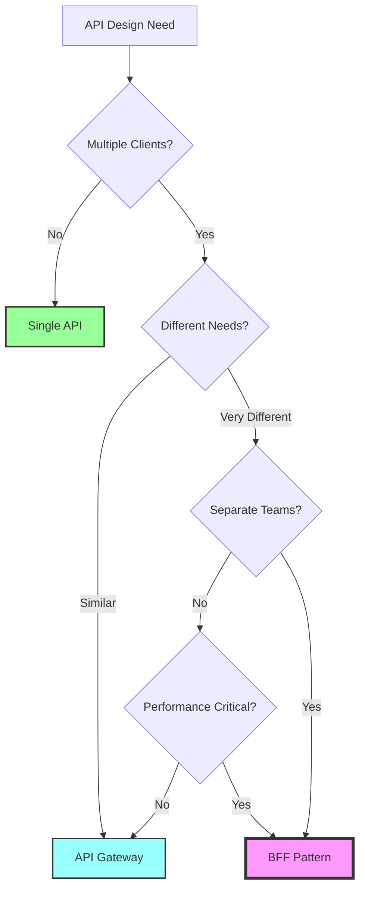
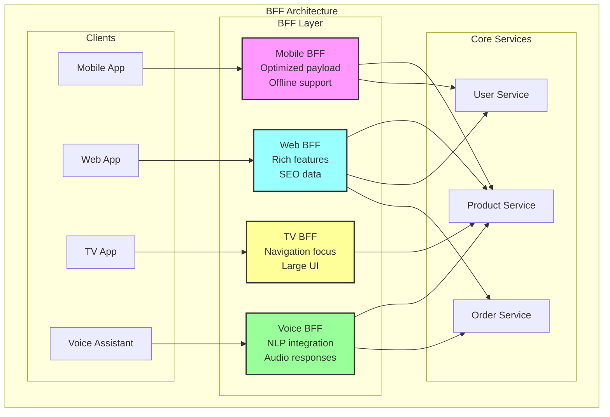
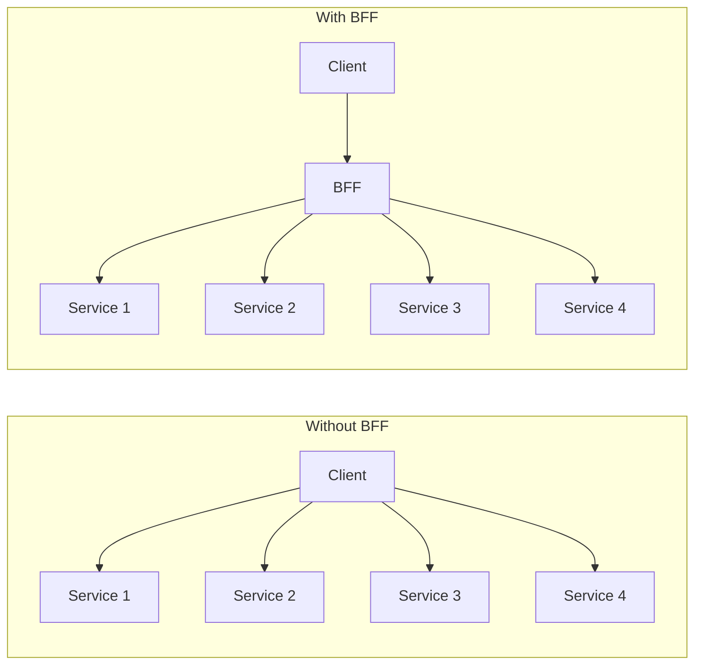
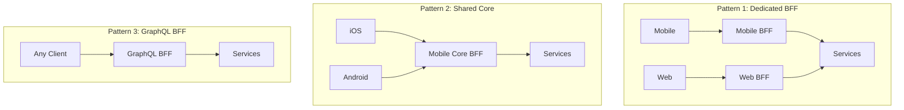

# Backends For Frontends (BFF)

!!! warning "🥈 Silver Tier Pattern"
    **Client-Specific API Optimization** • Best for multi-platform applications
    
    A specialized pattern for creating tailored backend services for different frontend clients. While valuable for complex multi-platform scenarios, it adds operational overhead that may not be justified for simpler applications.

**One API doesn't fit all: Tailored backends for optimal frontend experiences**

> *"The best API is the one designed specifically for its consumer. In a world of diverse clients—mobile, web, TV, voice—one size fits none."*

---

## Essential Questions for Architects

### 🤔 Key Decision Points

1. **How many different client types do you have?**
   - 1-2 clients → Shared API with client-specific endpoints
   - 3-4 clients → Consider BFF for major platforms
   - 5+ clients → BFF pattern highly recommended

2. **How different are your client requirements?**
   - Similar needs → Single API with query parameters
   - Moderate differences → API Gateway with transformations
   - Vastly different → Dedicated BFFs

3. **Do you have separate frontend teams?**
   - Single team → Shared API may suffice
   - Platform teams → BFF enables independence
   - External teams → BFF provides clear ownership

4. **What's your performance sensitivity?**
   - Low latency critical → BFF for optimal payloads
   - Standard performance → Consider trade-offs
   - Best effort → Shared API acceptable

5. **What's your operational capacity?**
   - Limited ops → Minimize service count
   - Mature ops → BFF complexity manageable
   - Full DevOps → Teams own their BFFs

---

## Decision Criteria Matrix

| Factor | Use BFF | Use Shared API | Use API Gateway |
|--------|---------|----------------|------------------|
| **Client Count** | 3+ diverse clients | 1-2 similar clients | 2-3 with minor differences |
| **Team Structure** | Separate platform teams | Single team | Shared backend team |
| **Performance Needs** | Client-specific optimization | Acceptable for all | Some optimization needed |
| **Development Speed** | Fast platform iteration | Coordinated releases | Moderate flexibility |
| **Operational Overhead** | Can manage multiple services | Need simplicity | Gateway complexity OK |

---

## Architectural Decision Framework

---

## Level 1: Intuition

### Core Architecture Pattern

### Architecture Trade-offs

| Aspect | Single API | API Gateway | BFF Pattern |
|--------|------------|-------------|-------------|
| **Complexity** | ✅ Simple | 🔶 Moderate | ❌ Complex |
| **Performance** | ❌ Generic | 🔶 Some optimization | ✅ Fully optimized |
| **Team Autonomy** | ❌ Coupled | 🔶 Some independence | ✅ Full independence |
| **Maintenance** | ✅ Single codebase | 🔶 Gateway config | ❌ Multiple services |
| **Deployment** | ✅ Simple | 🔶 Gateway + services | ❌ Complex orchestration |
| **Cost** | ✅ Minimal | 🔶 Gateway costs | ❌ Multiple services |

### BFF Implementation Strategies

| Strategy | When to Use | Example | Complexity |
|----------|-------------|---------|------------|
| **Dedicated BFF** | Completely different clients | Mobile vs Web | High |
| **Shared Core BFF** | Similar clients, minor differences | iOS vs Android | Medium |
| **GraphQL BFF** | Flexible client needs | Various web apps | Medium |
| **Edge BFF** | Global distribution | CDN-based BFF | High |
| **Micro-BFF** | Specific features | Checkout BFF | Low |

---

## Level 2: Foundation

### Client-Specific Optimization Patterns

| Client Type | Optimization Focus | Key Features | Constraints |
|-------------|-------------------|--------------|-------------|
| **Mobile** | Payload size, battery | Offline support, push notifications | Limited bandwidth |
| **Web** | SEO, rich features | Real-time updates, analytics | Browser limitations |
| **TV** | Navigation, large UI | Remote control, voice commands | Input methods |
| **Voice** | Conversational flow | NLP, context awareness | Audio-only |
| **IoT** | Minimal data | Event-driven, telemetry | Power constraints |

### Data Aggregation Strategies

### BFF Responsibilities Matrix

| Responsibility | Mobile BFF | Web BFF | TV BFF | Voice BFF |
|----------------|------------|---------|---------|-----------|
| **Authentication** | Token-based | Cookie/JWT | Device auth | Voice ID |
| **Data Format** | Minimal JSON | Full JSON | Simplified | Speech-friendly |
| **Caching** | Aggressive | Moderate | Heavy | Context-based |
| **Error Handling** | Offline queue | User messages | Simple alerts | Voice prompts |
| **Performance** | Battery-aware | Fast render | Instant response | Low latency |

---

## Level 3: Implementation Guide

### BFF Design Checklist

- [ ] **Client Analysis**
  - [ ] Identify all client types
  - [ ] Document unique requirements
  - [ ] Map data needs per client
  
- [ ] **Team Structure**
  - [ ] Define ownership model
  - [ ] Establish API contracts
  - [ ] Plan coordination points
  
- [ ] **Architecture Design**
  - [ ] Choose BFF strategy
  - [ ] Design aggregation logic
  - [ ] Plan caching approach
  
- [ ] **Operational Planning**
  - [ ] Deployment strategy
  - [ ] Monitoring approach
  - [ ] Version management

### Common Anti-Patterns

| Anti-Pattern | Description | Impact | Solution |
|--------------|-------------|---------|----------|
| **Fat BFF** | Business logic in BFF | Duplication | Keep BFF thin |
| **Chatty BFF** | Many backend calls | Latency | Batch/cache requests |
| **Generic BFF** | One BFF for all | No optimization | Dedicated BFFs |
| **Coupled BFF** | Direct DB access | Tight coupling | Use services only |
| **Stateful BFF** | Session state in BFF | Scaling issues | Stateless design |

### Testing Strategies

| Test Type | Focus | Example |
|-----------|-------|---------|
| **Contract Tests** | API compatibility | Client-BFF contract |
| **Integration Tests** | Service calls | BFF-to-services |
| **Performance Tests** | Response time | Load testing |
| **Chaos Tests** | Resilience | Service failures |
| **Client Tests** | End-to-end | Mobile app flow |

---

## Level 4: Production Insights

### Real-World Metrics

| Company | Implementation | Results |
|---------|---------------|---------|
| **Netflix** | 1000+ device-specific BFFs | 50% less client complexity |
| **Spotify** | Platform BFFs | 40% faster feature delivery |
| **LinkedIn** | Pemberton framework | 60% API latency reduction |
| **SoundCloud** | Mobile/Web split | 70% better mobile performance |

### Performance Optimization

| Optimization | Technique | Impact |
|--------------|-----------|---------|
| **Caching** | Edge caching | -80% latency |
| **Batching** | Request coalescing | -60% calls |
| **Compression** | Client-specific | -70% payload |
| **Prefetching** | Predictive loading | -50% wait time |
| **Streaming** | Progressive rendering | -40% perceived latency |

### Security Considerations

| Aspect | Implementation | Priority |
|--------|----------------|----------|
| **Authentication** | Per-client auth strategies | Critical |
| **Authorization** | Client-specific permissions | Critical |
| **Rate Limiting** | Per-BFF limits | High |
| **Data Filtering** | Client-appropriate data | High |
| **Audit Logging** | Track per-client access | Medium |

---

## Quick Reference

### When to Use BFF

✅ **Use When:**
- Multiple diverse client types
- Different teams own different clients
- Client-specific performance needs
- Complex aggregation requirements
- Need for team autonomy

❌ **Don't Use When:**
- Single client type
- Small team/application
- Similar client requirements
- Limited operational capacity

### BFF vs Alternatives

| Pattern | Use Case | Complexity | Flexibility |
|---------|----------|------------|-------------|
| **BFF** | Diverse clients | High | Maximum |
| **API Gateway** | Minor variations | Medium | Moderate |
| **GraphQL** | Flexible queries | Medium | High |
| **Single API** | Simple needs | Low | Limited |

### Implementation Patterns

---

## 🎓 Key Takeaways

1. **Client-First Design** - Each client gets exactly what it needs
2. **Team Autonomy** - Platform teams can move independently
3. **Optimized Experience** - Performance tailored to each platform
4. **Complexity Trade-off** - More services but better separation
5. **Evolutionary Architecture** - Start simple, add BFFs as needed

---

*"The best backend is invisible to its frontend—it just delivers exactly what's needed, when it's needed, how it's needed."*

---

**Previous**: Anti-Corruption Layer ← | **Next**: → Choreography