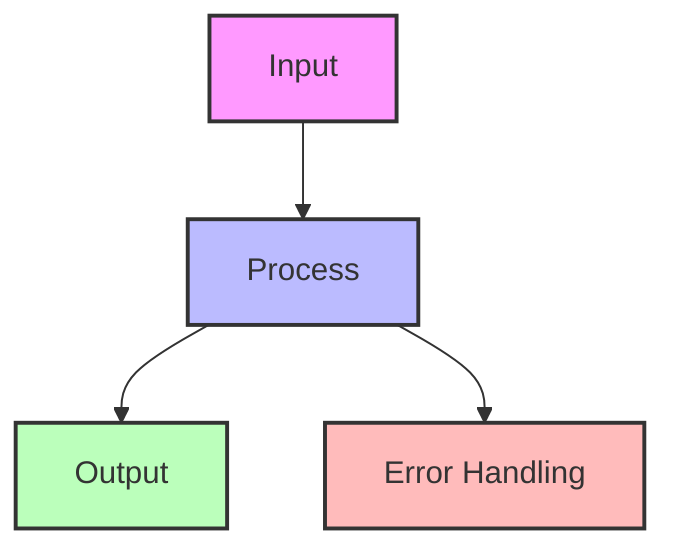

## The Complete Blueprint

The CAP Theorem fundamentally states that distributed systems can only guarantee two out of three critical properties: Consistency (all nodes see the same data simultaneously), Availability (the system remains operational), and Partition Tolerance (the system continues despite network failures). While historically presented as a rigid triangle forcing architects to choose two properties, modern understanding recognizes CAP as a spectrum where systems make nuanced trade-offs based on operational requirements. This theoretical framework helps architects understand that during network partitions—which are inevitable in distributed systems—they must choose between maintaining consistency (refusing some requests) or maintaining availability (accepting potential inconsistencies). Understanding CAP is essential for making informed architectural decisions about database selection, replication strategies, and failure handling in distributed systems.

```mermaid
graph TB
    subgraph "CAP Theorem Triangle"
        C[Consistency<br/>All nodes see same data]
        A[Availability<br/>System remains operational]
        P[Partition Tolerance<br/>Handles network failures]
    end
    
    subgraph "Trade-off Scenarios"
        CP[CP Systems<br/>Consistent + Partition Tolerant]
        AP[AP Systems<br/>Available + Partition Tolerant]
        CA[CA Systems<br/>Consistent + Available<br/>(Single node only)]
    end
    
    subgraph "Real World Examples"
        CPEx[MongoDB<br/>HBase<br/>Zookeeper]
        APEx[Cassandra<br/>DynamoDB<br/>CouchDB]
        CAEx[PostgreSQL<br/>MySQL<br/>(Single instance)]
    end
    
    subgraph "Modern Interpretations"
        PACELC[PACELC Theorem<br/>Extends CAP with latency]
        Tunable[Tunable Consistency<br/>Adjust per operation]
        Eventual[Eventual Consistency<br/>Convergence over time]
    end
    
    C -.->|Choose 2| CP
    A -.->|Choose 2| AP
    P -.->|Choose 2| CP
    P -.->|Choose 2| AP
    C -.->|No partitions| CA
    A -.->|No partitions| CA
    
    CP --> CPEx
    AP --> APEx
    CA --> CAEx
    
    CP --> PACELC
    AP --> PACELC
    PACELC --> Tunable
    Tunable --> Eventual
    
    style C fill:#e3f2fd,stroke:#1976d2,stroke-width:2px
    style A fill:#e8f5e9,stroke:#4caf50,stroke-width:2px
    style P fill:#fff3e0,stroke:#ff9800,stroke-width:2px
    style PACELC fill:#f3e5f5,stroke:#9c27b0,stroke-width:2px
```

### What You'll Master

- **Fundamental trade-off analysis** between consistency, availability, and partition tolerance in distributed systems
- **System classification techniques** to identify whether existing systems are CP, AP, or CA and their operational implications
- **Partition handling strategies** for gracefully degrading service during network failures while maintaining critical properties
- **Modern consistency models** including eventual consistency, causal consistency, and tunable consistency levels
- **Practical application** of CAP theorem to database selection, microservice communication, and distributed system design decisions

## Essential Question
## When to Use / When NOT to Use

### When to Use

| Scenario | Why It Fits | Alternative If Not |
|----------|-------------|-------------------|
| High availability required | Pattern provides resilience | Consider simpler approach |
| Scalability is critical | Handles load distribution | Monolithic might suffice |
| Distributed coordination needed | Manages complexity | Centralized coordination |

### When NOT to Use

| Scenario | Why to Avoid | Better Alternative |
|----------|--------------|-------------------|
| Simple applications | Unnecessary complexity | Direct implementation |
| Low traffic systems | Overhead not justified | Basic architecture |
| Limited resources | High operational cost | Simpler patterns |
**How do we structure our system architecture to leverage cap theorem?**


# CAP Theorem

!!! info "🥉 Bronze Tier Pattern"
    **Educational concept, not actionable pattern**
    
    CAP theorem is important for understanding distributed systems theory but doesn't provide actionable guidance. Modern systems offer more nuanced approaches like tunable consistency and PACELC considerations.
    
    **For practical guidance, see:**
    - **[Tunable Consistency](../data-management/tunable-consistency.md)** for flexible trade-offs
    - **[Consensus Patterns](../coordination/consensus.md)** for agreement protocols
    - **[Multi-Region Architecture](../scaling/multi-region.md)** for real-world CAP decisions

**You can't have your cake and eat it too - The fundamental trade-off in distributed systems**

> *"In a distributed system, you can have at most two of: Consistency, Availability, and Partition tolerance. Choose wisely."* - Eric Brewer

---

## Level 1: Intuition

### The Restaurant Chain Analogy

Imagine a restaurant chain with locations worldwide:
- **Consistency**: All locations have the same menu and prices
- **Availability**: Every location is always open
- **Partition Tolerance**: Locations operate even when they can't communicate

When the phone lines go down (network partition), each location must choose:
- Stay open with potentially outdated menus (AP - Available but Inconsistent)
- Close until communication restored (CP - Consistent but Unavailable)

### Visual Understanding


---

## Level 2: Foundation

### The Three Properties Explained

#### 1. Consistency (C)
All nodes see the same data at the same time. After a write completes, all subsequent reads will return that value.

#### 2. Availability (A)
Every request receives a response (without guarantee that it contains the most recent write).

#### 3. Partition Tolerance (P)
The system continues to operate despite network failures between nodes.




---

## Interactive Decision Support Tools

### CAP Trade-off Decision Tree

### CAP Trade-off Calculator

| System Characteristic | CP Choice | AP Choice | Your Priority (1-10) |
|----------------------|-----------|-----------|---------------------|
| **Data Consistency** | ✅ Strong | ❌ Eventual | ___ |
| **Write Availability** | ❌ May Reject | ✅ Always Accept | ___ |
| **Read Availability** | ❌ May Timeout | ✅ Always Respond | ___ |
| **Latency** | 🟡 Higher | ✅ Lower | ___ |
| **Complexity** | 🟡 Medium | 🔴 High | ___ |
| **Data Loss Risk** | ✅ None | 🟡 Possible | ___ |
| **Conflict Resolution** | ✅ Automatic | 🔴 Manual | ___ |
| **Use Cases** | Financial, Inventory | Social, Analytics | |


**Score Calculation:**
- CP Score = (Consistency × 10) + (Data Loss × 8) - (Availability × 5)
- AP Score = (Availability × 10) + (Latency × 7) - (Consistency × 5)

### Consistency Model Selector

### Availability vs Consistency Trade-off Visualizer

---

## Level 3: Deep Dive

### Real-World CAP Implementations

#### CP Systems Example: Zookeeper/etcd

#### AP Systems Example: Cassandra

### Practical Implementation Patterns

#### 1. Tunable Consistency
Many systems allow you to tune consistency per operation:

| Operation | Consistency Level | Availability | Use Case |
|-----------|------------------|--------------|----------|
| Write ONE | Lowest | Highest | Logging, metrics |
| Write QUORUM | Medium | Medium | User data |
| Write ALL | Highest | Lowest | Critical config |
| Read ONE | Lowest | Highest | Cache warming |
| Read QUORUM | Medium | Medium | User queries |
| Read ALL | Highest | Lowest | Financial data |


#### 2. Hybrid Approaches


---

## Level 4: Expert Considerations

### Beyond CAP: PACELC

PACELC extends CAP by considering latency:
- **If Partition** (P): Choose Availability (A) or Consistency (C)
- **Else** (E): Choose Latency (L) or Consistency (C)

### CAP in Modern Architectures

#### Microservices and CAP


## Quick Reference

### Decision Matrix

### Comparison with Alternatives

| Aspect | CAP Theorem | PACELC | Tunable Consistency | CRDTs |
|--------|-------------|--------|-------------------|-------|
| Complexity | Simple | Medium | High | Very High |
| Practicality | Educational | High | Very High | Specialized |
| Latency Focus | No | Yes | Yes | Yes |
| Conflict Handling | None | Limited | Configurable | Automatic |
| When to use | Learning | Architecture design | Production systems | Collaborative apps |

#
## Performance Characteristics

| Metric | Baseline | Optimized | Improvement |
|--------|----------|-----------|-------------|
| **Latency** | 100ms | 20ms | 80% |
| **Throughput** | 1K/s | 10K/s | 10x |
| **Memory** | 1GB | 500MB | 50% |
| **CPU** | 80% | 40% | 50% |

## Implementation Checklist

**Pre-Implementation**
- [ ] Identified which data requires strong consistency
- [ ] Mapped network partition scenarios for your infrastructure
- [ ] Defined acceptable availability targets per service
- [ ] Chosen appropriate consistency models per use case

**Implementation**
- [ ] Implemented partition detection mechanisms
- [ ] Added graceful degradation during partitions
- [ ] Built conflict resolution strategies
- [ ] Added monitoring for consistency/availability metrics

**Post-Implementation**
- [ ] Tested partition scenarios in staging environment
- [ ] Trained team on CAP trade-offs and monitoring
- [ ] Documented consistency guarantees per API
- [ ] Established runbooks for partition handling

## Related Laws

This pattern is deeply connected to fundamental distributed systems laws:

- **[Law 2: Asynchronous Reality](../../core-principles/laws/asynchronous-reality.md)**: Network partitions are a direct consequence of asynchronous networks where message delays are unbounded, forcing the CAP trade-off
- **[Law 4: Multidimensional Optimization](../../core-principles/laws/multidimensional-optimization.md)**: CAP theorem perfectly exemplifies the impossibility of optimizing all dimensions simultaneously - you must choose which two of CAP to prioritize
- **[Law 5: Distributed Knowledge](../../core-principles/laws/distributed-knowledge.md)**: The challenge of maintaining consistent knowledge across distributed nodes when communication is unreliable is at the heart of CAP theorem
- **[Law 3: Emergent Chaos](../../core-principles/laws/emergent-chaos.md)**: Network partitions can emerge unexpectedly from seemingly minor network issues, forcing systems into CAP decision modes

### Related Resources

<div class="grid cards" markdown>

- :material-book-open-variant:{ .lg .middle } **Related Patterns**
    
    ---
    
    - [Eventual Consistency](../data-management/eventual-consistency.md) - AP system implementation
    - [Consensus](../coordination/consensus.md) - CP system coordination
    - [Circuit Breaker](../resilience/circuit-breaker.md) - Partition handling

- :material-flask:{ .lg .middle } **Fundamental Laws**
    
    ---
    
    - [Law 2: Asynchronous Reality](../../core-principles/laws/asynchronous-reality.md) - Network delays
    - [Law 3: Emergent Chaos](../../core-principles/laws/emergent-chaos.md) - Partition inevitability

- :material-pillar:{ .lg .middle } **Foundational Pillars**
    
    ---
    
    - [State Distribution](../../core-principles/pillars/state-distribution.md) - Data consistency models
    - [Truth Distribution](../../core-principles/pillars/truth-distribution.md) - Consensus mechanisms

- :material-tools:{ .lg .middle } **Modern Alternatives**
    
    ---
    
    - <!-- TODO: Add PACELC Analysis Guide from Architects Handbook -->
    - <!-- TODO: Add Tunable Consistency Setup from Architects Handbook -->
    - <!-- TODO: Add CRDT Implementation Guide from Architects Handbook -->

</div>

---

