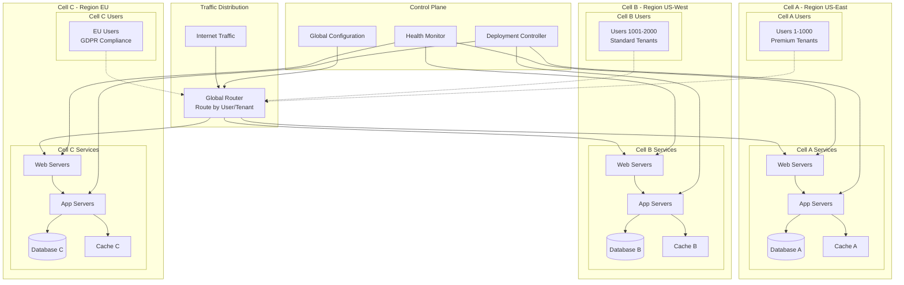
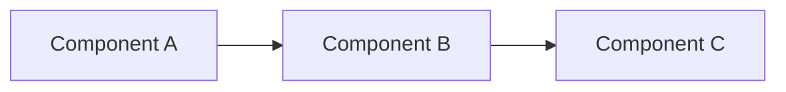
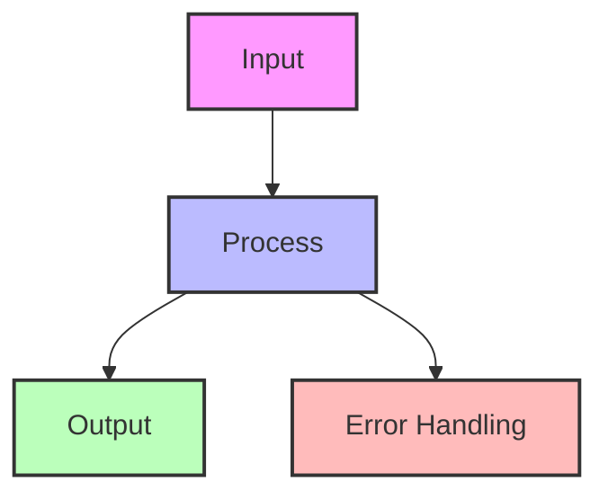

## The Complete Blueprint

Cell-based architecture is a deployment and isolation pattern that partitions applications into independent, self-contained units (cells) with shared-nothing architecture, enabling complete failure isolation and independent scaling. This pattern addresses the challenge of blast radius containment by ensuring that failures in one cell cannot propagate to other cells, making it ideal for large-scale, multi-tenant systems where availability is critical. Each cell contains all the resources needed to serve a subset of users - including compute, storage, networking, and data - creating natural boundaries that prevent cascading failures. The key insight is that by accepting some resource duplication overhead, you gain predictable failure domains, simplified capacity planning, and the ability to perform maintenance or updates on individual cells without affecting the entire system.



### What You'll Master

- **Cell partitioning strategies**: Design user and data partitioning schemes that evenly distribute load while maintaining isolation
- **Routing and discovery**: Implement intelligent routing systems that direct requests to the correct cell based on user, geography, or tenant
- **Cross-cell operations**: Handle rare operations that span multiple cells while maintaining the isolation guarantees
- **Operational management**: Establish procedures for cell provisioning, decommissioning, monitoring, and disaster recovery

# Cell-Based Architecture Pattern

!!! warning "🥈 Silver Tier Pattern"
    **Advanced isolation pattern with high complexity**
    
    Cell-based architecture provides excellent isolation and scaling properties but requires significant engineering investment. Best suited for large-scale systems where failure isolation justifies the complexity.
    
    **Production Success:**
    - AWS: Entire infrastructure built on cells
    - Slack: Isolated customer workspaces
    - Salesforce: Multi-tenant isolation

## Essential Questions

**1. Do you need hard isolation between customer groups?**
- YES → Cells provide complete isolation
- NO → Consider simpler multi-tenancy

**2. Can you afford 20-30% infrastructure overhead?**
- YES → Cells duplicate resources for isolation
- NO → Shared infrastructure more efficient

**3. Is your team experienced with distributed systems?**
- YES → Can handle cell complexity
- NO → Start with simpler patterns

## When to Use / When NOT to Use

### ✅ Use Cell-Based When

| Scenario | Why It Works | Example |
|----------|--------------|---------|
| **Compliance requirements** | Data isolation by region/customer | Healthcare SaaS |
| **Large multi-tenant** | Isolate noisy neighbors | Salesforce |
| **Variable workloads** | Scale cells independently | Gaming platforms |
| **Failure isolation critical** | Limit blast radius | Financial services |
| **Geographic distribution** | Cells per region | Global SaaS |

### ❌ DON'T Use When

| Scenario | Why It Fails | Alternative |
|----------|--------------|-------------|
| **< 100 tenants** | Overhead too high | Shared infrastructure |
| **Tight data coupling** | Cross-cell queries complex | Monolithic database |
| **Small team** | Operational burden | Simpler architecture |
| **Cost sensitive** | 20-30% overhead | Resource pooling |
| **Frequent cross-tenant** | Cell boundaries problematic | Shared services |

## Architecture Overview


## Cell Design Principles

### 1. Complete Isolation

### 2. Cell Sizing Strategy

| Strategy | Cell Size | Pros | Cons |
|----------|-----------|------|------|
| **Fixed Size** | 100 customers each | Predictable capacity | Waste at boundaries |
| **Percentage** | 5% of traffic | Even distribution | Complex routing |
| **Geographic** | Per region | Low latency | Uneven sizes |
| **Customer Tier** | By plan level | Resource alignment | Migration complexity |

### 3. Routing Architecture

## Level 1: Intuition (5 minutes)

*Start your journey with relatable analogies*

### The Elevator Pitch
[Pattern explanation in simple terms]

### Real-World Analogy
[Everyday comparison that explains the concept]

## Level 2: Foundation (10 minutes)

*Build core understanding*

### Core Concepts
- Key principle 1
- Key principle 2
- Key principle 3

### Basic Example


## Level 3: Deep Dive (15 minutes)

*Understand implementation details*

### How It Really Works
[Technical implementation details]

### Common Patterns
[Typical usage patterns]

## Level 4: Expert (20 minutes)

*Master advanced techniques*

### Advanced Configurations
[Complex scenarios and optimizations]

### Performance Tuning
[Optimization strategies]

## Level 5: Mastery (30 minutes)

*Apply in production*

### Real-World Case Studies
[Production examples from major companies]

### Lessons from the Trenches
[Common pitfalls and solutions]


## Decision Matrix

### Quick Decision Table

| Factor | Low Complexity | Medium Complexity | High Complexity |
|--------|----------------|-------------------|-----------------|
| Team Size | < 5 developers | 5-20 developers | > 20 developers |
| Traffic | < 1K req/s | 1K-100K req/s | > 100K req/s |
| Data Volume | < 1GB | 1GB-1TB | > 1TB |
| **Recommendation** | ❌ Avoid | ⚠️ Consider | ✅ Implement |

## Implementation Patterns

### Cell Router Implementation




### Cell Capacity Planning


## Cross-Cell Operations

### Challenge: Cross-Cell Queries

### Control Plane Design

| Component | Purpose | Scope |
|-----------|---------|-------|
| **Cell Registry** | Track cell metadata | Global |
| **Configuration** | Shared settings | Per cell type |
| **Deployment** | Orchestrate updates | Cross-cell |
| **Monitoring** | Aggregate metrics | Global view |
| **Admin APIs** | Management operations | Privileged |

## Migration Strategies


## Fundamental Law Connections

### Blast Radius Control (Law 1)
Cell-based architecture is the ultimate expression of Law 1's correlation prevention:
- **Hard Isolation Boundaries**: Cells share nothing, preventing correlation
- **Predictable Failure Scope**: Blast radius = 1/N where N = number of cells
- **Shuffle Sharding Within Cells**: Further reduces correlation to ~2% per Amazon
- **Mathematical Proof**: P(system failure) = P(all cells fail) ≈ 0 with independence

### Chaos Isolation (Law 4)
Cells contain emergent behaviors before they cascade:
- **Phase Transition Prevention**: Cell boundaries stop percolation
- **Butterfly Effect Containment**: Small changes can't affect other cells
- **Safe Chaos Testing**: Can chaos-test individual cells without system risk
- **Emergent Behavior Scope**: Complex interactions limited to cell boundary

### Cognitive Boundaries (Law 3)
Cells reduce operational cognitive load:
- **Simplified Mental Models**: Operators think about one cell at a time
- **Reduced Alert Scope**: Cell-specific alerts don't overwhelm
- **Debugging Isolation**: Problems confined to known boundary
- **Team Ownership**: Single team can own and understand a cell

### Knowledge Partitioning (Law 5)
Each cell maintains independent knowledge:
- **State Isolation**: No shared state between cells
- **Configuration Independence**: Cell-local configs don't affect others
- **Data Sovereignty**: Complete data isolation per cell
- **Schema Evolution**: Cells can have different versions during migration

### Economic Trade-offs (Law 7)
- **Infrastructure Overhead**: 20-30% cost increase for duplication
- **ROI Calculation**: Cost of isolation vs cost of outages
- **Optimal Cell Size**: Balance between overhead and blast radius
- **Economy of Scale Loss**: Can't share resources across cells

## Advanced Hash-Based Cell Routing

### Core Routing Algorithm

The foundation of cell-based architecture is deterministic routing that ensures users consistently reach the same cell:

```python
import hashlib
import mmh3  # MurmurHash3 for better performance
from typing import Dict, List, Optional
import struct

class AdvancedCellRouter:
    """Production-grade cell routing with multiple algorithms and fallback strategies"""
    
    def __init__(self, total_cells: int = 10, algorithm: str = 'sha256'):
        self.total_cells = total_cells
        self.algorithm = algorithm
        self.cell_weights = {}  # For weighted routing
        self.cell_health = {}   # For health-aware routing
        self.routing_cache = {} # LRU cache for performance
        
    def route_to_cell(self, user_id: str, context: Optional[Dict] = None) -> int:
        """Main routing function with multiple strategies"""
        
        # 1. Check cache first (sub-microsecond lookup)
        if user_id in self.routing_cache:
            return self.routing_cache[user_id]
        
        # 2. Apply routing algorithm
        if self.algorithm == 'sha256':
            # SHA256 for cryptographic distribution
            hash_value = int(hashlib.sha256(user_id.encode()).hexdigest(), 16)
            cell_id = hash_value % self.total_cells
            
        elif self.algorithm == 'murmur3':
            # MurmurHash3 for speed (10x faster than SHA256)
            hash_value = mmh3.hash128(user_id)
            cell_id = hash_value % self.total_cells
            
        elif self.algorithm == 'consistent':
            # Consistent hashing for minimal remapping on cell changes
            cell_id = self._consistent_hash_route(user_id)
            
        elif self.algorithm == 'rendezvous':
            # Rendezvous hashing for weighted distribution
            cell_id = self._rendezvous_hash_route(user_id)
            
        # 3. Apply compliance overrides
        if context and 'country' in context:
            cell_id = self._apply_compliance_routing(cell_id, context['country'])
            
        # 4. Health-aware failover
        if not self._is_cell_healthy(cell_id):
            cell_id = self._find_healthy_fallback(cell_id, user_id)
            
        # 5. Cache the result
        self.routing_cache[user_id] = cell_id
        
        return cell_id
    
    def _consistent_hash_route(self, user_id: str) -> int:
        """Consistent hashing with virtual nodes for better distribution"""
        virtual_nodes = 150  # Virtual nodes per physical cell
        ring = {}
        
        # Build hash ring with virtual nodes
        for cell in range(self.total_cells):
            for vnode in range(virtual_nodes):
                vnode_id = f"{cell}:{vnode}"
                hash_value = mmh3.hash128(vnode_id)
                ring[hash_value] = cell
                
        # Find cell for user
        user_hash = mmh3.hash128(user_id)
        sorted_hashes = sorted(ring.keys())
        
        # Binary search for nearest node
        import bisect
        idx = bisect.bisect_right(sorted_hashes, user_hash)
        if idx == len(sorted_hashes):
            idx = 0
            
        return ring[sorted_hashes[idx]]
    
    def _rendezvous_hash_route(self, user_id: str) -> int:
        """Rendezvous hashing for weighted cell selection"""
        max_weight = -1
        selected_cell = 0
        
        for cell_id in range(self.total_cells):
            # Combine user_id and cell_id for hash
            combined = f"{user_id}:{cell_id}"
            hash_value = mmh3.hash128(combined)
            
            # Apply cell weight if configured
            weight = hash_value
            if cell_id in self.cell_weights:
                weight *= self.cell_weights[cell_id]
                
            if weight > max_weight:
                max_weight = weight
                selected_cell = cell_id
                
        return selected_cell
    
    def _apply_compliance_routing(self, cell_id: int, country: str) -> int:
        """Override routing for regulatory compliance"""
        compliance_map = {
            'EU': [0, 1],      # Cells 0-1 are GDPR compliant
            'US': [2, 3, 4],   # Cells 2-4 are US-based
            'APAC': [5, 6],    # Cells 5-6 are in Asia-Pacific
            'CN': [7],         # Cell 7 is China-specific
        }
        
        region = self._get_region_for_country(country)
        allowed_cells = compliance_map.get(region, list(range(self.total_cells)))
        
        # If current cell is not compliant, re-route
        if cell_id not in allowed_cells:
            # Use hash to select from allowed cells
            hash_value = mmh3.hash128(f"{cell_id}:{country}")
            cell_id = allowed_cells[hash_value % len(allowed_cells)]
            
        return cell_id

### Cell Capacity and Load Management

```python
class CellCapacityManager:
    """Manages cell capacity and implements load-aware routing"""
    
    def __init__(self):
        self.cell_capacities = {}  # Max capacity per cell
        self.cell_loads = {}       # Current load per cell
        self.overflow_routing = {} # Overflow cell mappings
        
    def route_with_capacity(self, user_id: str, base_cell: int) -> int:
        """Route considering cell capacity constraints"""
        
        # Check if base cell has capacity
        if self._has_capacity(base_cell):
            return base_cell
            
        # Find overflow cell using consistent hashing
        overflow_candidates = self._get_overflow_cells(base_cell)
        
        for candidate in overflow_candidates:
            if self._has_capacity(candidate):
                # Log overflow event for monitoring
                self._log_overflow(user_id, base_cell, candidate)
                return candidate
                
        # All cells full - apply backpressure
        raise CellCapacityExceeded(f"No capacity available for user {user_id}")
    
    def _has_capacity(self, cell_id: int) -> bool:
        """Check if cell has available capacity"""
        current_load = self.cell_loads.get(cell_id, 0)
        max_capacity = self.cell_capacities.get(cell_id, float('inf'))
        
        # Apply 80% threshold for better performance
        return current_load < (max_capacity * 0.8)
    
    def _get_overflow_cells(self, primary_cell: int) -> List[int]:
        """Get ordered list of overflow cells for a primary cell"""
        # Pre-computed overflow mappings for fast lookup
        if primary_cell not in self.overflow_routing:
            # Generate overflow order using consistent hashing
            all_cells = list(range(len(self.cell_capacities)))
            all_cells.remove(primary_cell)
            
            # Sort by hash distance for consistent overflow
            overflow_order = sorted(all_cells, 
                key=lambda x: mmh3.hash128(f"{primary_cell}:{x}"))
            
            self.overflow_routing[primary_cell] = overflow_order
            
        return self.overflow_routing[primary_cell]
```

### Cross-Cell Correlation Monitoring

```python
class CrossCellMonitor:
    """Advanced monitoring for cross-cell operations and correlation detection"""
    
    def __init__(self):
        self.correlation_matrix = {}  # Cell-to-cell correlation scores
        self.trace_aggregator = {}    # Distributed trace collection
        self.alert_thresholds = {
            'correlation': 0.7,       # Alert if correlation > 0.7
            'cross_cell_rate': 0.05,  # Alert if >5% requests span cells
            'latency_p99': 100,       # Alert if cross-cell p99 > 100ms
        }
        
    def track_request(self, request_id: str, cells_involved: List[int], 
                     latency_ms: float, success: bool):
        """Track cross-cell request for correlation analysis"""
        
        # Update correlation matrix
        if len(cells_involved) > 1:
            for i, cell_a in enumerate(cells_involved):
                for cell_b in cells_involved[i+1:]:
                    self._update_correlation(cell_a, cell_b, success)
                    
        # Aggregate trace data
        trace_data = {
            'request_id': request_id,
            'cells': cells_involved,
            'latency_ms': latency_ms,
            'success': success,
            'timestamp': time.time(),
            'is_cross_cell': len(cells_involved) > 1
        }
        
        self._aggregate_trace(trace_data)
        
        # Check for threshold violations
        self._check_alert_conditions(trace_data)
        
    def _update_correlation(self, cell_a: int, cell_b: int, success: bool):
        """Update correlation coefficient between two cells"""
        key = tuple(sorted([cell_a, cell_b]))
        
        if key not in self.correlation_matrix:
            self.correlation_matrix[key] = {
                'success_together': 0,
                'fail_together': 0,
                'total': 0
            }
            
        stats = self.correlation_matrix[key]
        stats['total'] += 1
        
        if success:
            stats['success_together'] += 1
        else:
            stats['fail_together'] += 1
            
        # Calculate correlation coefficient
        correlation = stats['fail_together'] / max(stats['total'], 1)
        
        if correlation > self.alert_thresholds['correlation']:
            self._raise_correlation_alert(cell_a, cell_b, correlation)
            
    def get_cell_health_score(self, cell_id: int) -> float:
        """Calculate health score for a cell based on multiple factors"""
        
        # Factors for health score
        factors = {
            'success_rate': self._get_success_rate(cell_id),
            'latency_score': self._get_latency_score(cell_id),
            'isolation_score': self._get_isolation_score(cell_id),
            'capacity_score': self._get_capacity_score(cell_id),
        }
        
        # Weighted average
        weights = {
            'success_rate': 0.4,
            'latency_score': 0.2,
            'isolation_score': 0.2,
            'capacity_score': 0.2,
        }
        
        health_score = sum(factors[k] * weights[k] for k in factors)
        
        return health_score
    
    def detect_correlated_failures(self) -> List[tuple]:
        """Detect cells with correlated failure patterns"""
        correlated_pairs = []
        
        for (cell_a, cell_b), stats in self.correlation_matrix.items():
            correlation = stats['fail_together'] / max(stats['total'], 1)
            
            if correlation > self.alert_thresholds['correlation']:
                correlated_pairs.append((cell_a, cell_b, correlation))
                
        return sorted(correlated_pairs, key=lambda x: x[2], reverse=True)
```

### Independent Infrastructure Per Cell

```python
class CellInfrastructure:
    """Defines independent infrastructure components per cell"""
    
    def __init__(self, cell_id: int):
        self.cell_id = cell_id
        
        # Independent database per cell
        self.database = {
            'primary': f"postgres-cell-{cell_id}-primary.internal",
            'replica': f"postgres-cell-{cell_id}-replica.internal",
            'connection_pool_size': 100,
            'max_connections': 500,
        }
        
        # Independent cache per cell
        self.cache = {
            'redis_cluster': [
                f"redis-cell-{cell_id}-{i}.internal" 
                for i in range(3)  # 3-node Redis cluster
            ],
            'memcached': f"memcached-cell-{cell_id}.internal",
            'cache_size_gb': 64,
        }
        
        # Independent app servers per cell
        self.app_servers = [
            f"app-cell-{cell_id}-{i}.internal" 
            for i in range(10)  # 10 app servers per cell
        ]
        
        # Independent message queue per cell
        self.messaging = {
            'kafka_brokers': [
                f"kafka-cell-{cell_id}-{i}.internal" 
                for i in range(3)
            ],
            'rabbitmq': f"rabbitmq-cell-{cell_id}.internal",
        }
        
        # Cell-specific configuration
        self.config = {
            'region': self._get_cell_region(),
            'availability_zones': self._get_cell_azs(),
            'network_cidr': f"10.{cell_id}.0.0/16",
            'dns_zone': f"cell-{cell_id}.internal",
        }
    
    def provision_cell(self) -> Dict:
        """Provision all infrastructure for a cell"""
        return {
            'terraform': self._generate_terraform_config(),
            'kubernetes': self._generate_k8s_manifests(),
            'monitoring': self._setup_cell_monitoring(),
            'networking': self._configure_cell_networking(),
        }
```

## Real-World Examples

### AWS Cell Architecture

<div class="decision-box">
<h4>🏢 AWS Service Cells</h4>

**Scale**: Thousands of cells globally

**Cell Design**:
- Each Availability Zone is a cell
- Complete infrastructure isolation
- No cross-cell dependencies
- Automated cell provisioning

**Laws Demonstrated**:
- **Law 1**: Reduced blast radius from 100% to <5% per incident
- **Law 4**: 2019 Kinesis event contained to single cell
- **Law 7**: Accepted 25% overhead for 10x availability improvement

**Results**:
- 99.99% availability
- Predictable blast radius
- Linear scaling
- Regional compliance
</div>

### Slack's Workspace Isolation

**Laws Demonstrated**:
- **Law 1**: Noisy neighbor correlation eliminated
- **Law 3**: Per-workspace debugging simplified
- **Law 5**: Workspace data completely isolated

| Aspect | Implementation | Benefit |
|--------|----------------|---------
| **Routing** | Workspace ID → Cell | Fast lookup |
| **Data** | Sharded by workspace | Complete isolation |
| **Scale** | ~100 workspaces/cell | Predictable size |
| **Migration** | Live workspace moves | Zero downtime |

## Advanced Operational Patterns

### Cell Rebalancing and Migration

```python
class CellRebalancer:
    """Handles live migration of users between cells"""
    
    def __init__(self):
        self.migration_state = {}  # Track ongoing migrations
        self.double_write_enabled = {}  # Users in migration
        
    def migrate_user(self, user_id: str, from_cell: int, to_cell: int):
        """Live migration with zero downtime"""
        
        # Phase 1: Enable double-write
        self.enable_double_write(user_id, from_cell, to_cell)
        
        # Phase 2: Copy historical data
        self.copy_user_data(user_id, from_cell, to_cell)
        
        # Phase 3: Verify data consistency
        if self.verify_data_consistency(user_id, from_cell, to_cell):
            
            # Phase 4: Switch routing
            self.update_routing_table(user_id, to_cell)
            
            # Phase 5: Monitor for issues
            self.monitor_migration(user_id, to_cell)
            
            # Phase 6: Cleanup old data
            self.schedule_cleanup(user_id, from_cell)
            
        return True
    
    def rebalance_cells(self, target_distribution: Dict[int, float]):
        """Rebalance users across cells to achieve target distribution"""
        
        current_distribution = self.calculate_current_distribution()
        migrations_needed = self.calculate_migrations(current_distribution, target_distribution)
        
        # Execute migrations in batches to avoid overload
        for batch in self.batch_migrations(migrations_needed, batch_size=100):
            self.execute_migration_batch(batch)
            time.sleep(60)  # Wait between batches
```

### Chaos Engineering for Cells

```python
class CellChaosEngine:
    """Chaos engineering specifically for cell-based architectures"""
    
    def run_cell_failure_test(self, cell_id: int):
        """Simulate complete cell failure"""
        
        # 1. Mark cell as unhealthy
        self.mark_cell_unhealthy(cell_id)
        
        # 2. Verify routing bypasses failed cell
        assert self.verify_no_traffic_to_cell(cell_id)
        
        # 3. Verify affected users get rerouted
        affected_users = self.get_cell_users(cell_id)
        for user in affected_users:
            new_cell = self.get_user_routing(user)
            assert new_cell != cell_id
            
        # 4. Verify blast radius containment
        other_cells_healthy = all(
            self.is_cell_healthy(c) 
            for c in range(self.total_cells) 
            if c != cell_id
        )
        assert other_cells_healthy
        
        # 5. Restore cell
        self.mark_cell_healthy(cell_id)
        
    def run_partial_cell_degradation(self, cell_id: int, component: str):
        """Test partial cell degradation scenarios"""
        
        scenarios = {
            'database': self.degrade_database,
            'cache': self.degrade_cache,
            'network': self.add_network_latency,
            'cpu': self.consume_cpu,
        }
        
        scenarios[component](cell_id)
        
        # Verify cell remains functional but degraded
        assert self.is_cell_degraded(cell_id)
        assert not self.is_cell_failed(cell_id)
```

## Operational Considerations

### Monitoring Strategy


### Cell Operations Playbook

| Operation | Process | Automation |
|-----------|---------|------------|
| **Add Cell** | 1. Provision infrastructure<br/>2. Deploy services<br/>3. Validate health<br/>4. Enable routing | Terraform + CI/CD |
| **Drain Cell** | 1. Stop new assignments<br/>2. Migrate customers<br/>3. Verify empty<br/>4. Decommission | Orchestration scripts |
| **Update Cell** | 1. Blue-green deploy<br/>2. Canary validation<br/>3. Full rollout<br/>4. Monitor | Progressive delivery |
| **Cell Failure** | 1. Detect via health checks<br/>2. Disable routing<br/>3. Alert operators<br/>4. Investigate | Automated failover |

## Cost Analysis

### Infrastructure Overhead

## Decision Framework

## Anti-Patterns to Avoid

| Anti-Pattern | Problem | Solution |
|--------------|---------|----------|
| **Leaky Cells** | Cross-cell dependencies | Enforce boundaries |
| **Oversized Cells** | Blast radius too large | Smaller cells |
| **Undersized Cells** | Overhead too high | Consolidate |
| **Static Routing** | Can't rebalance | Dynamic mapping |
| **No Control Plane** | Unmanageable | Centralized control |

## Related Patterns

- **[Bulkhead Pattern](../resilience/bulkhead.md)** - Isolation within services
- **[Sharding](../scaling/sharding.md)** - Data partitioning strategy
- **[Multi-Region](../scaling/multi-region.md)** - Geographic distribution
- **[Service Mesh](../communication/service-mesh.md)** - Network-level isolation
- **[Circuit Breaker](../resilience/circuit-breaker.md)** - Failure handling

## References

- [AWS Well-Architected Framework - Cell-Based Architecture](https://docs.aws.amazon.com/wellarchitected/latest/framework/cell-based-architecture.html/)
- [Slack's Cell-Based Architecture](https://slack.engineering/cell-based-architecture/)
- [Azure Mission-Critical - Deployment Stamps](https://docs.microsoft.com/en-us/azure/architecture/reference-architectures/containers/aks-mission-critical/mission-critical-deployment-stamps/)

