---
best-for:
- Multi-tenant SaaS platforms
- Services requiring compliance isolation
- Systems where blast radius must be minimized
- Organizations with mature engineering practices
category: architecture
current_relevance: mainstream
description: Architecture pattern that isolates failures by partitioning systems into
  independent cells with shared-nothing design
essential_question: How do we limit the blast radius of failures to a subset of users?
excellence_tier: silver
introduced: 2024-01
pattern_status: recommended
title: Cell-Based Architecture Pattern
trade-offs:
  cons:
  - Higher infrastructure cost
  - Complex cell routing logic
  - Cross-cell operations difficult
  - Data consistency challenges
  - Operational complexity
  pros:
  - Complete failure isolation between cells
  - Independent scaling per cell
  - Predictable blast radius
  - Simplified capacity planning
  - Easier compliance boundaries
---


# Cell-Based Architecture Pattern

!!! warning "🥈 Silver Tier Pattern"
    **Advanced isolation pattern with high complexity**
    
    Cell-based architecture provides excellent isolation and scaling properties but requires significant engineering investment. Best suited for large-scale systems where failure isolation justifies the complexity.
    
    **Production Success:**
    - AWS: Entire infrastructure built on cells
    - Slack: Isolated customer workspaces
    - Salesforce: Multi-tenant isolation

## Essential Questions

**1. Do you need hard isolation between customer groups?**
- YES → Cells provide complete isolation
- NO → Consider simpler multi-tenancy

**2. Can you afford 20-30% infrastructure overhead?**
- YES → Cells duplicate resources for isolation
- NO → Shared infrastructure more efficient

**3. Is your team experienced with distributed systems?**
- YES → Can handle cell complexity
- NO → Start with simpler patterns

## When to Use / When NOT to Use

### ✅ Use Cell-Based When

| Scenario | Why It Works | Example |
|----------|--------------|---------|
| **Compliance requirements** | Data isolation by region/customer | Healthcare SaaS |
| **Large multi-tenant** | Isolate noisy neighbors | Salesforce |
| **Variable workloads** | Scale cells independently | Gaming platforms |
| **Failure isolation critical** | Limit blast radius | Financial services |
| **Geographic distribution** | Cells per region | Global SaaS |

### ❌ DON'T Use When

| Scenario | Why It Fails | Alternative |
|----------|--------------|-------------|
| **< 100 tenants** | Overhead too high | Shared infrastructure |
| **Tight data coupling** | Cross-cell queries complex | Monolithic database |
| **Small team** | Operational burden | Simpler architecture |
| **Cost sensitive** | 20-30% overhead | Resource pooling |
| **Frequent cross-tenant** | Cell boundaries problematic | Shared services |

## Architecture Overview


<details>
<summary>View implementation code</summary>


</details>

## Cell Design Principles

### 1. Complete Isolation

```mermaid
graph LR
    subgraph "Shared Nothing"
        Cell1[Cell 1] 
        Cell2[Cell 2]
        Cell3[Cell 3]
        
        Note1[No shared:<br/>• Database<br/>• Cache<br/>• Queue<br/>• Storage]
    end
    
    subgraph "Failure Isolation"
        F1[Cell 1 Fails] -.-> I1[Others Unaffected]
        O1[Overload Cell 2] -.-> I2[Others Protected]
        B1[Bug in Cell 3] -.-> I3[Limited Impact]
    end
```



### 2. Cell Sizing Strategy

| Strategy | Cell Size | Pros | Cons |
|----------|-----------|------|------|
| **Fixed Size** | 100 customers each | Predictable capacity | Waste at boundaries |
| **Percentage** | 5% of traffic | Even distribution | Complex routing |
| **Geographic** | Per region | Low latency | Uneven sizes |
| **Customer Tier** | By plan level | Resource alignment | Migration complexity |

### 3. Routing Architecture


## Level 1: Intuition (5 minutes)

*Start your journey with relatable analogies*

### The Elevator Pitch
[Pattern explanation in simple terms]

### Real-World Analogy
[Everyday comparison that explains the concept]

## Level 2: Foundation (10 minutes)

*Build core understanding*

### Core Concepts
- Key principle 1
- Key principle 2
- Key principle 3

### Basic Example


## Level 3: Deep Dive (15 minutes)

*Understand implementation details*

### How It Really Works
[Technical implementation details]

### Common Patterns
[Typical usage patterns]

## Level 4: Expert (20 minutes)

*Master advanced techniques*

### Advanced Configurations
[Complex scenarios and optimizations]

### Performance Tuning
[Optimization strategies]

## Level 5: Mastery (30 minutes)

*Apply in production*

### Real-World Case Studies
[Production examples from major companies]

### Lessons from the Trenches
[Common pitfalls and solutions]


## Decision Matrix


### Quick Decision Table

| Factor | Low Complexity | Medium Complexity | High Complexity |
|--------|----------------|-------------------|-----------------|
| Team Size | < 5 developers | 5-20 developers | > 20 developers |
| Traffic | < 1K req/s | 1K-100K req/s | > 100K req/s |
| Data Volume | < 1GB | 1GB-1TB | > 1TB |
| **Recommendation** | ❌ Avoid | ⚠️ Consider | ✅ Implement |

## Implementation Patterns

### Cell Router Implementation


<details>
<summary>View implementation code</summary>

```yaml
# Cell routing configuration
cell_routing:
  strategy: "consistent_hash"  # or "lookup_table", "range_based"
  
  cells:
    - name: "cell-1"
      endpoint: "https://cell1.api.example.com"
      capacity: 1000  # customers
      status: "active"
      
    - name: "cell-2"  
      endpoint: "https://cell2.api.example.com"
      capacity: 1000
      status: "active"
      
    - name: "cell-3"
      endpoint: "https://cell3.api.example.com"
      capacity: 1000
      status: "maintenance"  # temporarily disabled
      
  routing_rules:
    - type: "hash_range"
      hash_function: "murmur3"
      assignments:
        - range: [0, 33]
          cell: "cell-1"
        - range: [34, 66]
          cell: "cell-2"
        - range: [67, 100]
          cell: "cell-3"
          
  fallback:
    strategy: "nearest_neighbor"
    health_check_interval: 5s
    circuit_breaker:
      error_threshold: 50
      timeout: 30s
```

</details>

### Cell Capacity Planning


<details>
<summary>View implementation code</summary>


</details>

## Cross-Cell Operations

### Challenge: Cross-Cell Queries

```mermaid
graph TB
    subgraph "Anti-Pattern"
        Q1[Query Cell 1] --> A1[Aggregate]
        Q2[Query Cell 2] --> A1
        Q3[Query Cell 3] --> A1
        A1 --> R1[Slow Response]
        
        Note1[❌ Breaks isolation<br/>❌ Poor performance<br/>❌ Complex consistency]
    end
    
    subgraph "Solution Patterns"
        S1[Read Replicas<br/>in Control Plane]
        S2[Event Streaming<br/>to Analytics]
        S3[Batch ETL<br/>for Reporting]
        
        Note2[✓ Maintains isolation<br/>✓ Better performance<br/>✓ Eventually consistent]
    end
```



### Control Plane Design

| Component | Purpose | Scope |
|-----------|---------|-------|
| **Cell Registry** | Track cell metadata | Global |
| **Configuration** | Shared settings | Per cell type |
| **Deployment** | Orchestrate updates | Cross-cell |
| **Monitoring** | Aggregate metrics | Global view |
| **Admin APIs** | Management operations | Privileged |

## Migration Strategies


<details>
<summary>View implementation code</summary>


</details>

## Real-World Examples

### AWS Cell Architecture

<div class="decision-box">
<h4>🏢 AWS Service Cells</h4>

**Scale**: Thousands of cells globally

**Cell Design**:
- Each Availability Zone is a cell
- Complete infrastructure isolation
- No cross-cell dependencies
- Automated cell provisioning

**Results**:
- 99.99% availability
- Predictable blast radius
- Linear scaling
- Regional compliance
</div>

### Slack's Workspace Isolation

| Aspect | Implementation | Benefit |
|--------|----------------|---------|
| **Routing** | Workspace ID → Cell | Fast lookup |
| **Data** | Sharded by workspace | Complete isolation |
| **Scale** | ~100 workspaces/cell | Predictable size |
| **Migration** | Live workspace moves | Zero downtime |

## Operational Considerations

### Monitoring Strategy


<details>
<summary>View implementation code</summary>


</details>

### Cell Operations Playbook

| Operation | Process | Automation |
|-----------|---------|------------|
| **Add Cell** | 1. Provision infrastructure<br/>2. Deploy services<br/>3. Validate health<br/>4. Enable routing | Terraform + CI/CD |
| **Drain Cell** | 1. Stop new assignments<br/>2. Migrate customers<br/>3. Verify empty<br/>4. Decommission | Orchestration scripts |
| **Update Cell** | 1. Blue-green deploy<br/>2. Canary validation<br/>3. Full rollout<br/>4. Monitor | Progressive delivery |
| **Cell Failure** | 1. Detect via health checks<br/>2. Disable routing<br/>3. Alert operators<br/>4. Investigate | Automated failover |

## Cost Analysis

### Infrastructure Overhead


## Decision Framework


## Anti-Patterns to Avoid

| Anti-Pattern | Problem | Solution |
|--------------|---------|----------|
| **Leaky Cells** | Cross-cell dependencies | Enforce boundaries |
| **Oversized Cells** | Blast radius too large | Smaller cells |
| **Undersized Cells** | Overhead too high | Consolidate |
| **Static Routing** | Can't rebalance | Dynamic mapping |
| **No Control Plane** | Unmanageable | Centralized control |

## Related Patterns

- **[Bulkhead Pattern](../resilience/bulkhead.md)** - Isolation within services
- **[Sharding](../scaling/sharding.md)** - Data partitioning strategy
- **[Multi-Region](../scaling/multi-region.md)** - Geographic distribution
- **[Service Mesh](service-mesh.md)** - Network-level isolation
- **[Circuit Breaker](../resilience/circuit-breaker.md)** - Failure handling

## References

- [AWS Well-Architected Framework - Cell-Based Architecture](https://docs.aws.amazon.com/wellarchitected/latest/framework/cell-based-architecture.html)
- [Slack's Cell-Based Architecture](https://slack.engineering/cell-based-architecture/)
- [Azure Mission-Critical - Deployment Stamps](https://docs.microsoft.com/en-us/azure/architecture/reference-architectures/containers/aks-mission-critical/mission-critical-deployment-stamps)