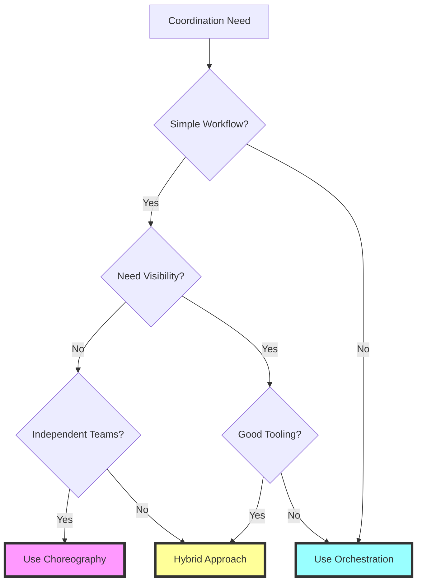
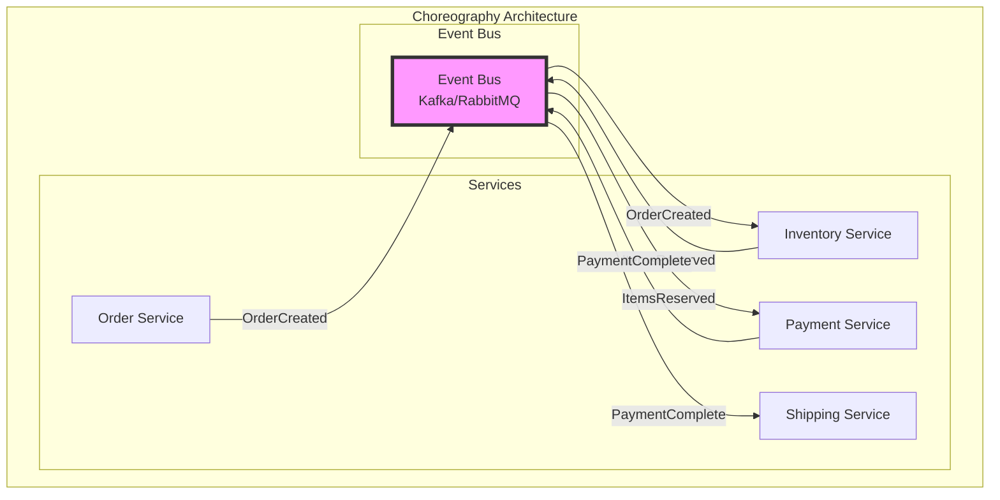
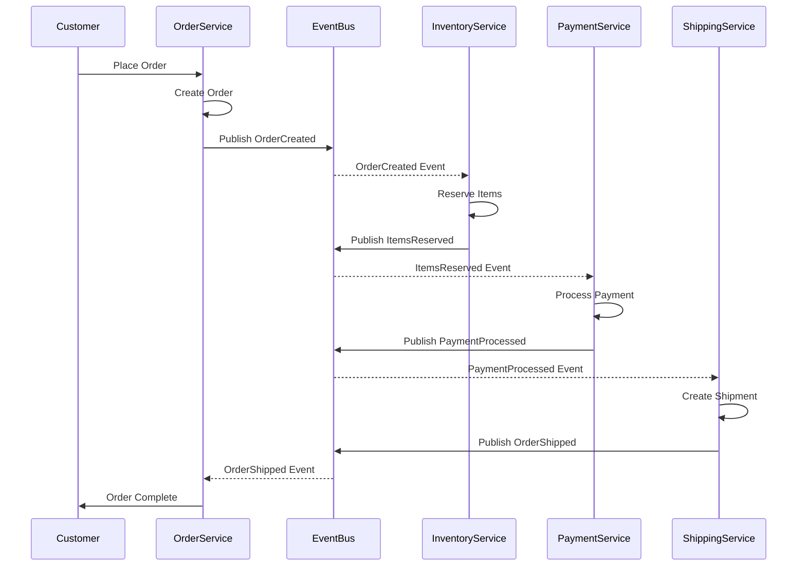
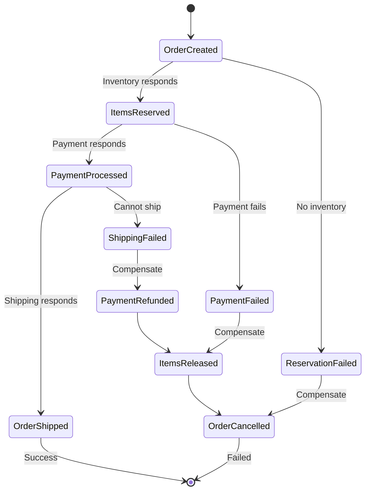
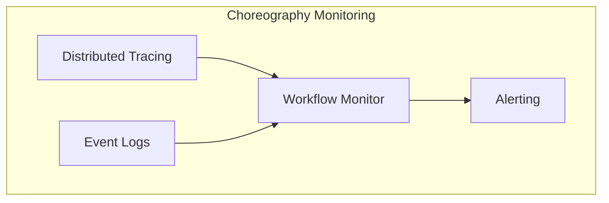

# Choreography Pattern

!!! danger "🥉 Bronze Tier Pattern"
    **Legacy Approach** • Consider modern alternatives
    
    Pure choreography leads to hard-to-debug distributed workflows. Modern systems use event streaming platforms (Kafka) or saga orchestration for better visibility and control. See our [migration guide](/excellence/migrations/choreography-to-event-streaming).

**Decentralized coordination where services react to events without central orchestration**

> *"Services coordinate through events without central control - like dancers responding to music and each other rather than a choreographer's commands."*

---

## Essential Questions for Architects

### 🤔 Key Decision Points

1. **Do you need workflow visibility?**
   - High visibility needed → Use orchestration
   - Distributed visibility OK → Choreography viable
   - No visibility needed → Pure choreography

2. **How complex are your workflows?**
   - Simple, linear → Choreography works well
   - Complex branching → Consider orchestration
   - Dynamic flows → Hybrid approach

3. **What's your error handling strategy?**
   - Centralized handling → Orchestration better
   - Service-level handling → Choreography OK
   - Complex compensation → Saga orchestration

4. **How important is service autonomy?**
   - Maximum autonomy → Pure choreography
   - Some coordination OK → Hybrid approach
   - Central control fine → Orchestration

5. **What's your debugging capability?**
   - Distributed tracing → Choreography possible
   - Limited tooling → Avoid choreography
   - Central monitoring → Use orchestration

---

## Decision Criteria Matrix

| Factor | Use Choreography | Use Orchestration | Use Hybrid |
|--------|------------------|-------------------|------------|
| **Workflow Complexity** | Simple, linear | Complex, branching | Mixed complexity |
| **Service Coupling** | Must be loose | Can be tighter | Selective coupling |
| **Error Handling** | Local to services | Centralized needed | Both approaches |
| **Monitoring Needs** | Distributed OK | Central required | Selective monitoring |
| **Team Structure** | Independent teams | Central team | Mixed teams |
| **Performance** | High scalability | Acceptable latency | Balanced |

## Architectural Decision Framework

## Core Architecture Patterns

## Architecture Trade-offs

| Aspect | Choreography | Orchestration | Hybrid |
|--------|--------------|---------------|--------|
| **Control** | ❌ Distributed | ✅ Centralized | 🔶 Mixed |
| **Debugging** | ❌ Complex | ✅ Simple | 🔶 Moderate |
| **Scalability** | ✅ Excellent | ❌ Limited | 🔶 Good |
| **Flexibility** | ✅ High | ❌ Low | 🔶 Balanced |
| **Monitoring** | ❌ Distributed | ✅ Central | 🔶 Both |
| **Team Autonomy** | ✅ Maximum | ❌ Minimal | 🔶 Selective |

## Implementation Strategies

### Event-Driven Choreography Architecture

### Key Design Patterns

| Pattern | Purpose | Complexity | When to Use |
|---------|---------|------------|-------------|
| **Event Notification** | Simple state changes | Low | Status updates |
| **Event-Carried State** | Share data via events | Medium | Reduce queries |
| **Event Sourcing** | Complete audit trail | High | Compliance needs |
| **Saga Pattern** | Distributed transactions | High | Complex workflows |

### Saga Implementation with Choreography

### Event Correlation Strategies

| Strategy | Implementation | Use Case | Complexity |
|----------|----------------|----------|------------|
| **Correlation ID** | UUID in all events | Track workflows | Low |
| **Saga ID** | Dedicated saga tracking | Complex flows | Medium |
| **Event Sourcing** | Complete event log | Full audit | High |
| **Process Manager** | Stateful coordinator | Complex logic | High |

## Failure Handling Strategies

### Common Failure Modes

| Failure Mode | Impact | Mitigation Strategy |
|--------------|--------|--------------------|
| **Event Loss** | Workflow stuck | Persistent event bus, retries |
| **Out-of-Order** | Invalid state | Event versioning, buffering |
| **Duplicate Events** | Incorrect state | Idempotency keys |
| **Service Failure** | Incomplete flow | Circuit breakers, timeouts |
| **Network Partition** | Split brain | Event sourcing, reconciliation |

### Monitoring and Observability

| Tool | Purpose | Complexity |
|------|---------|------------|
| **Distributed Tracing** | Track event flow | High |
| **Event Store** | Audit trail | Medium |
| **Correlation Dashboard** | Workflow visibility | Medium |
| **SLO Monitoring** | Performance tracking | Low |

## Critical Design Decisions

| Decision Point | Options | Trade-offs |
|----------------|---------|------------|
| **Event Bus Technology** | Kafka / RabbitMQ / Cloud (SQS/EventBridge) | Throughput vs Features vs Cost |
| **Event Schema** | JSON / Avro / Protobuf | Flexibility vs Performance vs Evolution |
| **Event Granularity** | Fine-grained / Coarse-grained | Flexibility vs Chattiness |
| **Error Strategy** | Retry / DLQ / Compensation | Reliability vs Complexity |
| **State Management** | Stateless / Event Sourced / Hybrid | Simplicity vs Auditability |

## Migration Path from Choreography

### Modern Alternatives

| Current State | Migration Target | Benefits |
|---------------|------------------|----------|
| **Pure Choreography** | Event Streaming (Kafka) | Better visibility, replay |
| **Complex Choreography** | Saga Orchestration | Explicit flow, monitoring |
| **Mixed Patterns** | Service Mesh + Events | Better control, observability |
| **Legacy Events** | Event Gateway | Centralized management |

## Implementation Checklist

- [ ] **Event Bus Selection**
  - [ ] Evaluate throughput needs
  - [ ] Consider operational complexity
  - [ ] Plan for growth
  
- [ ] **Event Design**
  - [ ] Define event schema
  - [ ] Plan versioning strategy
  - [ ] Design correlation approach
  
- [ ] **Error Handling**
  - [ ] Define retry policies
  - [ ] Implement idempotency
  - [ ] Plan compensation logic
  
- [ ] **Monitoring**
  - [ ] Set up distributed tracing
  - [ ] Create workflow dashboards
  - [ ] Define SLOs
  
- [ ] **Testing**
  - [ ] Test event ordering
  - [ ] Simulate failures
  - [ ] Verify compensations

## Quick Reference

### When to Use Choreography

✅ **Use When:**
- Simple, linear workflows
- Service autonomy critical
- High scalability needed
- Teams work independently

❌ **Avoid When:**
- Complex business workflows
- Need workflow visibility
- Debugging is critical
- Strict ordering required

### Choreography vs Alternatives

| Pattern | Use Case | Complexity | Visibility |
|---------|----------|------------|------------|
| **Choreography** | Simple flows | Low | Poor |
| **Orchestration** | Complex flows | Medium | Excellent |
| **Saga** | Transactions | High | Good |
| **Event Streaming** | Event processing | Medium | Good |

---

## 🎓 Key Takeaways

1. **Trade-off Awareness** - Choreography sacrifices visibility for autonomy
2. **Modern Alternatives** - Consider event streaming or saga orchestration
3. **Debugging Challenge** - Plan monitoring strategy upfront
4. **Start Simple** - Begin with orchestration, evolve to choreography
5. **Hybrid Approach** - Mix patterns based on workflow needs

---

*"Choreography is elegant in theory but challenging in practice. Choose wisely based on your operational maturity."*

---

**Previous**: Backends for Frontends ← | **Next**: → GraphQL Federation