# Choreography Pattern

!!! warning "🥉 Bronze Tier Pattern"
    **Legacy Event Coordination** • Kafka Streaming, Saga Orchestration recommended
    
    Pure choreography creates debugging nightmares in complex workflows. Modern alternatives like Apache Kafka streaming provide event ordering and replay, while saga orchestration offers workflow visibility.
    
    **Migration Path:** Replace with event streaming platforms or explicit workflow orchestration for production systems

## Essential Question

**How do we coordinate distributed workflows without central control while maintaining observability?**

## When to Use / When NOT to Use

### ✅ Use When

| Scenario | Example | Impact |
|----------|---------|--------|
| Simple linear workflows | User registration → Email → Welcome message | Easy to track, minimal states |
| Maximum service autonomy | Independent team boundaries | Faster development cycles |
| Event-driven system already | Existing event bus infrastructure | Leverages current architecture |

### ❌ DON'T Use When

| Scenario | Why | Alternative |
|----------|-----|-------------|
| Complex business workflows | Impossible to debug multi-step failures | Saga orchestration patterns |
| Need workflow visibility | No central place to see process state | Workflow engines (Temporal, Zeebe) |
| Strict ordering requirements | Events can arrive out of order | Event streaming with ordering |
| Regulatory compliance | No audit trail of business processes | Event sourcing + orchestration |

## Level 1: Intuition (5 min) {#intuition}

### The Story

Imagine a flash mob where dancers coordinate without a visible choreographer. Each dancer watches for cues from others and responds with their moves. It looks magical when it works, but when someone misses a cue, the entire performance falls apart—and no one knows who to blame or how to fix it.

### Visual Metaphor

```mermaid
graph LR
    subgraph "Choreography Flow"
        A["🎪 Order Service<br/>Creates order"] --> B["📦 Inventory Service<br/>Reserves items"]
        B --> C["💳 Payment Service<br/>Processes payment"]
        C --> D["🚚 Shipping Service<br/>Ships order"]
    end
    
    style A fill:#81c784,stroke:#388e3c
    style D fill:#64b5f6,stroke:#1976d2
```


### Core Insight
> **Key Takeaway:** Choreography trades workflow visibility for service autonomy—great for simple flows, problematic for complex business processes.

### In One Sentence
Choreography coordinates distributed services through event reactions without central control, enabling autonomy but sacrificing observability.

## Level 2: Foundation (10 min) {#foundation}

### The Problem Space

<div class="failure-vignette">
<h4>🚨 What Happens Without Proper Coordination</h4>

**E-commerce Company, 2019**: Used pure choreography for order processing. During Black Friday, a payment service bug caused orders to get stuck in "pending" state. With no central visibility, it took 6 hours to identify which step failed, losing $3M in sales.

**Impact**: 40% customer satisfaction drop, emergency architecture redesign, 3-month recovery period
</div>

### How It Works

#### Architecture Overview


#### Key Components

| Component | Purpose | Responsibility |
|-----------|---------|----------------|
| **Event Bus** | Message routing | Delivers events to interested services |
| **Services** | Business logic | React to events, publish new events |
| **Event Schema** | Message format | Defines event structure and versioning |

### Basic Example

```python
# Choreography event handling (simplified)
def handle_order_created(event):
    """Shows service reaction to events"""
    # Each service reacts independently
    if event.type == "OrderCreated":
        reserve_inventory(event.order_id)
        publish_event("InventoryReserved", event.order_id)
    elif event.type == "PaymentProcessed":
        create_shipment(event.order_id)
        publish_event("ShipmentCreated", event.order_id)
```

## Level 3: Deep Dive (15 min) {#deep-dive}

### Implementation Details

#### State Management


#### Critical Design Decisions

| Decision | Options | Trade-off | Recommendation |
|----------|---------|-----------|----------------|
| **Event Ordering** | Strict order<br>Best effort | Consistency vs performance<br>Simple vs complex | Use event streaming for ordering |
| **Failure Handling** | Retry forever<br>Dead letter queue | Reliability vs complexity<br>Automatic vs manual | Implement circuit breakers |
| **Event Schema** | Flexible JSON<br>Strict schema | Evolution vs compatibility<br>Fast vs safe | Use schema registry |

### Common Pitfalls

<div class="decision-box">
<h4>⚠️ Avoid These Mistakes</h4>

1. **No event ordering**: Events arrive out of sequence causing invalid states → Use message keys or event streaming
2. **Infinite retry loops**: Failed events retry forever consuming resources → Implement exponential backoff and dead letter queues
3. **Event schema evolution**: Breaking changes break consumers → Use schema registry with compatibility rules
</div>

### Production Considerations

#### Performance Characteristics

| Metric | Typical Range | Optimization Target |
|--------|---------------|---------------------|
| Event Latency | 10-100ms | Minimize event bus overhead |
| Throughput | 10K-1M events/sec | Scale event bus horizontally |
| Memory | Low per service | Stateless event handlers |
| Debugging Time | Hours-Days | Add distributed tracing |

## Level 4: Expert (20 min) {#expert}

### Advanced Techniques

#### Optimization Strategies

1. **Event Sourcing Integration**
   - When to apply: Need complete audit trail and event replay
   - Impact: 100% workflow visibility but 3x storage requirements
   - Trade-off: Perfect debugging vs operational complexity

2. **Saga Pattern Compensation**
   - When to apply: Complex workflows requiring rollback
   - Impact: Reliable error recovery but increased code complexity
   - Trade-off: Business consistency vs development overhead

### Scaling Considerations


### Monitoring & Observability

#### Key Metrics to Track

| Metric | Alert Threshold | Dashboard Panel |
|--------|----------------|------------------|
| **Event Processing Lag** | > 5 seconds | Event consumer lag by topic |
| **Dead Letter Queue Size** | > 100 messages | Failed event processing rate |
| **Workflow Completion Rate** | < 95% | End-to-end business process success |
| **Event Ordering Violations** | > 0.1% | Out-of-order event detection |

## Level 5: Mastery (30 min) {#mastery}

### Real-World Case Studies

#### Case Study 1: Netflix Streaming Pipeline

<div class="truth-box">
<h4>💡 Production Insights from Netflix</h4>

**Challenge**: Process billions of viewing events without central bottlenecks while maintaining user experience

**Implementation**: Event choreography for view tracking, recommendations updates, and content analytics

**Results**: 
- **Scale**: 500B+ events/day processed globally
- **Latency**: Sub-100ms event processing
- **Availability**: 99.99% uptime with regional failover

**Lessons Learned**: Works well for analytics pipelines but required extensive monitoring infrastructure for debugging
</div>

### Pattern Evolution

#### Migration from Legacy


#### Future Directions

| Trend | Impact on Pattern | Adaptation Strategy |
|-------|------------------|---------------------|
| **Serverless Computing** | Event-driven functions replace services | Use cloud event routers (EventBridge) |
| **AI/ML Integration** | Events trigger ML pipelines | Add event schema for ML features |
| **Edge Computing** | Distributed event processing | Design for network partitions |

### Pattern Combinations

#### Works Well With

| Pattern | Combination Benefit | Integration Point |
|---------|-------------------|------------------|
| **CQRS** | Separate read/write event handling | Event sourcing store |
| **Circuit Breaker** | Graceful degradation during failures | Event processing services |
| **Event Sourcing** | Complete audit trail + replay | Event store as system of record |

## Quick Reference

### Decision Matrix


### Comparison with Alternatives

| Aspect | Choreography | Event Streaming | Saga Orchestration | Workflow Engine |
|--------|--------------|----------------|-------------------|----------------|
| Complexity | Low | Medium | High | Very High |
| Visibility | Poor | Good | Excellent | Excellent |
| Autonomy | Maximum | High | Medium | Low |
| Debugging | Very Hard | Moderate | Easy | Easy |
| When to use | Simple flows | Event processing | Complex workflows | Business processes |

### Implementation Checklist

**Pre-Implementation**
- [ ] Validated simple, linear workflow requirements
- [ ] Confirmed team has distributed tracing expertise
- [ ] Evaluated debugging and monitoring tools
- [ ] Designed event schema and versioning strategy

**Implementation**
- [ ] Set up event bus with ordering guarantees
- [ ] Implemented idempotent event handlers
- [ ] Added correlation IDs for workflow tracking
- [ ] Created dead letter queues for failed events

**Post-Implementation**
- [ ] Comprehensive distributed tracing enabled
- [ ] End-to-end workflow monitoring dashboards
- [ ] Chaos engineering tests for event failures
- [ ] Migration plan to modern alternatives documented

### Related Resources

<div class="grid cards" markdown>

- :material-book-open-variant:{ .lg .middle } **Related Patterns**
    
    ---
    
    - [Event Sourcing](../data-management/event-sourcing.md) - Audit trail for choreography
    - [Saga Pattern](../coordination/saga.md) - Orchestrated alternative
    - [CQRS](../data-management/cqrs.md) - Event-driven read/write separation

- :material-flask:{ .lg .middle } **Fundamental Laws**
    
    ---
    
    - [Law 2: Asynchronous Reality](../../part1-axioms/law2/) - Event timing challenges
    - [Law 3: Emergent Chaos](../../part1-axioms/law3/) - Unpredictable interactions

- :material-pillar:{ .lg .middle } **Foundational Pillars**
    
    ---
    
    - [Control Distribution](../../part2-pillars/control/) - Coordination mechanisms
    - [Intelligence Distribution](../../part2-pillars/intelligence/) - Distributed decision making

- :material-tools:{ .lg .middle } **Migration Guides**
    
    ---
    
    - [Choreography to Event Streaming](../../excellence/migrations/choreography-to-streaming.md)
    - [Choreography to Saga Orchestration](../../excellence/migrations/choreography-to-saga.md)
    - [Event Bus Setup Guide](../../excellence/guides/event-bus-setup.md)

</div>

---