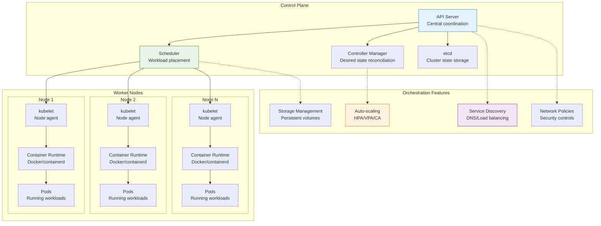

# Container Orchestration

!!! info "🥇 Gold Tier Pattern"
    **Cloud-Native Foundation** • Essential for modern application deployment
    
    Container orchestration has become the backbone of cloud-native applications, enabling automatic scaling, healing, and management of containerized workloads. Critical for any organization running microservices or cloud-native applications at scale.
    
    **Best For:** Microservices architectures, auto-scaling applications, multi-environment deployments, DevOps automation

## Essential Question

**How do we automatically manage containerized applications at scale with high availability, efficient resource utilization, and operational simplicity?**

## When to Use / When NOT to Use

### ✅ Use When

| Scenario | Example | Impact |
|----------|---------|--------|
| Microservices deployment | Netflix's 1000+ services | Automated scaling and service discovery |
| Multi-environment consistency | Dev/staging/production parity | Consistent deployment across environments |
| Auto-scaling requirements | E-commerce traffic spikes | Automatic resource scaling based on demand |
| High availability needs | Financial services, SaaS platforms | Self-healing with automatic failover |
| Resource optimization | Cost-sensitive cloud deployments | Efficient resource utilization through scheduling |

### ❌ DON'T Use When

| Scenario | Why | Alternative |
|----------|-----|-------------|
| Simple monolithic apps | Complexity overhead | Traditional server deployment |
| Small team/single service | Operational complexity | Container hosting services (ECS, Cloud Run) |
| Legacy applications | Difficult to containerize | VM-based deployment |
| Ultra-low latency requirements | Network/orchestration overhead | Bare metal deployment |
| Limited operational expertise | Complex troubleshooting | Managed container services |

## Level 1: Intuition (5 min) {#intuition}

### The Story

Imagine managing a massive shipping port with thousands of containers arriving and departing daily. You need automated cranes that can move containers, storage systems that optimize space, scheduling systems that handle traffic, and repair crews that fix problems instantly. Container orchestration is like having an intelligent port management system that automatically handles all container operations - scheduling, moving, storing, monitoring, and repairing - without human intervention.

### Visual Metaphor



### Core Insight
> **Key Takeaway:** Container orchestration transforms container management from manual operations to intelligent automation, enabling self-healing, auto-scaling infrastructure.

## Level 2: Foundation (10 min) {#foundation}

### The Problem Space

<div class="failure-vignette">
<h4>🚨 What Happens Without Container Orchestration</h4>

**Startup Company, 2021**: Manually managed 50+ microservices across Docker containers. During a traffic spike, 15 services crashed but weren't automatically restarted. Manual intervention took 4 hours, resulting in complete service outage and $500K revenue loss.

**Impact**: $500K revenue loss, 4-hour complete outage, 160 person-hours spent on manual recovery operations
</div>

### How It Works

#### Basic Kubernetes Example

```yaml
# Complete microservice deployment with orchestration features
apiVersion: apps/v1
kind: Deployment
metadata:
  name: web-service
  labels:
    app: web-service
spec:
  replicas: 3
  selector:
    matchLabels:
      app: web-service
  template:
    metadata:
      labels:
        app: web-service
    spec:
      containers:
      - name: web-service
        image: myapp:v1.2.0
        ports:
        - containerPort: 8080
        resources:
          requests:
            memory: "256Mi"
            cpu: "250m"
          limits:
            memory: "512Mi"
            cpu: "500m"
        livenessProbe:
          httpGet:
            path: /health
            port: 8080
          initialDelaySeconds: 30
          periodSeconds: 10
        readinessProbe:
          httpGet:
            path: /ready
            port: 8080
          initialDelaySeconds: 5
          periodSeconds: 5
        env:
        - name: DATABASE_URL
          valueFrom:
            secretKeyRef:
              name: db-secret
              key: url

---
apiVersion: v1
kind: Service
metadata:
  name: web-service
spec:
  selector:
    app: web-service
  ports:
    - protocol: TCP
      port: 80
      targetPort: 8080
  type: ClusterIP

---
apiVersion: autoscaling/v2
kind: HorizontalPodAutoscaler
metadata:
  name: web-service-hpa
spec:
  scaleTargetRef:
    apiVersion: apps/v1
    kind: Deployment
    name: web-service
  minReplicas: 3
  maxReplicas: 50
  metrics:
  - type: Resource
    resource:
      name: cpu
      target:
        type: Utilization
        averageUtilization: 70
  - type: Resource
    resource:
      name: memory
      target:
        type: Utilization
        averageUtilization: 80

---
apiVersion: networking.k8s.io/v1
kind: NetworkPolicy
metadata:
  name: web-service-netpol
spec:
  podSelector:
    matchLabels:
      app: web-service
  policyTypes:
  - Ingress
  - Egress
  ingress:
  - from:
    - podSelector:
        matchLabels:
          app: frontend
    ports:
    - protocol: TCP
      port: 8080
  egress:
  - to:
    - podSelector:
        matchLabels:
          app: database
    ports:
    - protocol: TCP
      port: 5432
```

## Level 3: Deep Dive (15 min) {#deep-dive}

### Advanced Orchestration Patterns

```python
# Python operator for advanced container orchestration
import asyncio
import kubernetes
from kubernetes import client, config, watch
import yaml
import json
from datetime import datetime, timedelta
from typing import Dict, List, Any

class AdvancedOrchestrator:
    """Advanced container orchestration with intelligent automation"""
    
    def __init__(self):
        # Load Kubernetes config
        try:
            config.load_incluster_config()  # For in-cluster deployment
        except:
            config.load_kube_config()  # For local development
            
        self.v1 = client.CoreV1Api()
        self.apps_v1 = client.AppsV1Api()
        self.autoscaling_v1 = client.AutoscalingV1Api()
        self.custom_objects = client.CustomObjectsApi()
        
        # Monitoring and metrics
        self.metrics_history = {}
        self.scaling_decisions = []
        
    async def intelligent_scaling(self, namespace: str = "default"):
        """Implement intelligent auto-scaling beyond basic HPA"""
        
        while True:
            try:
                # Get current deployments
                deployments = self.apps_v1.list_namespaced_deployment(namespace)
                
                for deployment in deployments.items:
                    await self._analyze_and_scale_deployment(deployment, namespace)
                    
                # Wait before next analysis cycle
                await asyncio.sleep(30)
                
            except Exception as e:
                print(f"Error in intelligent scaling: {e}")
                await asyncio.sleep(60)
    
    async def _analyze_and_scale_deployment(self, deployment, namespace: str):
        """Analyze deployment metrics and make scaling decisions"""
        app_name = deployment.metadata.labels.get('app', deployment.metadata.name)
        
        # Collect multiple metrics
        metrics = await self._collect_deployment_metrics(deployment, namespace)
        
        # Store metrics history
        if app_name not in self.metrics_history:
            self.metrics_history[app_name] = []
            
        self.metrics_history[app_name].append({
            'timestamp': datetime.now(),
            'metrics': metrics
        })
        
        # Keep only recent history (last 1 hour)
        cutoff_time = datetime.now() - timedelta(hours=1)
        self.metrics_history[app_name] = [
            m for m in self.metrics_history[app_name] 
            if m['timestamp'] > cutoff_time
        ]
        
        # Make scaling decision
        scaling_decision = self._make_scaling_decision(app_name, metrics)
        
        if scaling_decision['action'] != 'none':
            await self._execute_scaling_action(deployment, namespace, scaling_decision)
    
    async def _collect_deployment_metrics(self, deployment, namespace: str) -> Dict[str, float]:
        """Collect comprehensive metrics for scaling decisions"""
        app_name = deployment.metadata.labels.get('app', deployment.metadata.name)
        
        # Get pods for this deployment
        pods = self.v1.list_namespaced_pod(
            namespace, 
            label_selector=f"app={app_name}"
        )
        
        metrics = {
            'cpu_usage': 0.0,
            'memory_usage': 0.0,
            'request_rate': 0.0,
            'error_rate': 0.0,
            'response_time': 0.0,
            'pod_count': len(pods.items),
            'ready_pods': sum(1 for pod in pods.items if self._is_pod_ready(pod))
        }
        
        # This would integrate with metrics systems like Prometheus
        # For demo purposes, simulating metrics collection
        if pods.items:
            # Simulate collecting metrics from monitoring system
            metrics.update(await self._simulate_metrics_collection(app_name))
            
        return metrics
    
    def _make_scaling_decision(self, app_name: str, current_metrics: Dict[str, float]) -> Dict[str, Any]:
        """Make intelligent scaling decisions based on multiple factors"""
        
        # Get historical metrics for trend analysis
        history = self.metrics_history.get(app_name, [])
        
        decision = {
            'action': 'none',
            'target_replicas': current_metrics['pod_count'],
            'reason': 'No scaling needed',
            'confidence': 0.0
        }
        
        # Scale up conditions
        scale_up_signals = []
        
        # CPU/Memory pressure
        if current_metrics['cpu_usage'] > 0.8:
            scale_up_signals.append(('cpu_high', 0.9))
        if current_metrics['memory_usage'] > 0.85:
            scale_up_signals.append(('memory_high', 0.8))
            
        # Request rate increase
        if len(history) >= 3:
            recent_request_rates = [h['metrics']['request_rate'] for h in history[-3:]]
            if current_metrics['request_rate'] > max(recent_request_rates) * 1.5:
                scale_up_signals.append(('request_spike', 0.7))
        
        # Error rate increase
        if current_metrics['error_rate'] > 0.05:  # 5% error rate
            scale_up_signals.append(('high_errors', 0.6))
            
        # Response time degradation
        if current_metrics['response_time'] > 1000:  # 1 second
            scale_up_signals.append(('slow_response', 0.5))
        
        # Scale down conditions
        scale_down_signals = []
        
        # Low utilization
        if (current_metrics['cpu_usage'] < 0.3 and 
            current_metrics['memory_usage'] < 0.3 and
            current_metrics['pod_count'] > 2):
            scale_down_signals.append(('low_utilization', 0.4))
            
        # Consistent low load
        if len(history) >= 5:
            recent_cpu = [h['metrics']['cpu_usage'] for h in history[-5:]]
            if all(cpu < 0.4 for cpu in recent_cpu):
                scale_down_signals.append(('sustained_low_load', 0.3))
        
        # Make decision based on strongest signals
        if scale_up_signals:
            strongest_signal = max(scale_up_signals, key=lambda x: x[1])
            decision['action'] = 'scale_up'
            decision['target_replicas'] = min(
                current_metrics['pod_count'] * 2,  # Double at most
                50  # Max replicas
            )
            decision['reason'] = f"Scale up due to {strongest_signal[0]}"
            decision['confidence'] = strongest_signal[1]
            
        elif scale_down_signals and not scale_up_signals:
            strongest_signal = max(scale_down_signals, key=lambda x: x[1])
            decision['action'] = 'scale_down'
            decision['target_replicas'] = max(
                current_metrics['pod_count'] / 2,  # Halve at most
                2  # Min replicas
            )
            decision['reason'] = f"Scale down due to {strongest_signal[0]}"
            decision['confidence'] = strongest_signal[1]
        
        return decision
    
    async def _execute_scaling_action(self, deployment, namespace: str, decision: Dict[str, Any]):
        """Execute scaling action with safety checks"""
        
        # Safety checks
        if decision['confidence'] < 0.6:
            print(f"Scaling confidence too low ({decision['confidence']:.2f}), skipping")
            return
            
        # Record scaling decision
        self.scaling_decisions.append({
            'timestamp': datetime.now(),
            'deployment': deployment.metadata.name,
            'action': decision['action'],
            'from_replicas': deployment.spec.replicas,
            'to_replicas': decision['target_replicas'],
            'reason': decision['reason'],
            'confidence': decision['confidence']
        })
        
        print(f"Scaling {deployment.metadata.name}: {deployment.spec.replicas} -> {decision['target_replicas']} ({decision['reason']})")
        
        # Update deployment
        deployment.spec.replicas = decision['target_replicas']
        
        try:
            self.apps_v1.patch_namespaced_deployment(
                name=deployment.metadata.name,
                namespace=namespace,
                body=deployment
            )
            print(f"Successfully scaled {deployment.metadata.name}")
            
        except Exception as e:
            print(f"Failed to scale {deployment.metadata.name}: {e}")
    
    async def cluster_optimization(self, namespace: str = "default"):
        """Optimize cluster resource utilization"""
        
        while True:
            try:
                # Analyze node utilization
                nodes = self.v1.list_node()
                node_metrics = await self._analyze_node_utilization(nodes)
                
                # Check for optimization opportunities
                optimizations = self._identify_optimizations(node_metrics)
                
                for optimization in optimizations:
                    await self._apply_optimization(optimization, namespace)
                
                await asyncio.sleep(300)  # Check every 5 minutes
                
            except Exception as e:
                print(f"Error in cluster optimization: {e}")
                await asyncio.sleep(600)
    
    def _is_pod_ready(self, pod) -> bool:
        """Check if pod is ready"""
        if not pod.status.conditions:
            return False
            
        for condition in pod.status.conditions:
            if condition.type == "Ready":
                return condition.status == "True"
        return False
    
    async def _simulate_metrics_collection(self, app_name: str) -> Dict[str, float]:
        """Simulate metrics collection (replace with real metrics integration)"""
        import random
        
        # Simulate varying load patterns
        base_load = 0.5
        spike_probability = 0.1
        
        if random.random() < spike_probability:
            # Traffic spike
            multiplier = random.uniform(2.0, 5.0)
        else:
            # Normal variation
            multiplier = random.uniform(0.8, 1.2)
        
        return {
            'cpu_usage': min(base_load * multiplier + random.uniform(-0.1, 0.1), 1.0),
            'memory_usage': min(base_load * multiplier * 0.8 + random.uniform(-0.1, 0.1), 1.0),
            'request_rate': max(100 * multiplier + random.uniform(-20, 20), 0),
            'error_rate': max(0.01 * multiplier + random.uniform(-0.005, 0.005), 0),
            'response_time': max(200 / multiplier + random.uniform(-50, 100), 50)
        }

# Usage example
async def main():
    orchestrator = AdvancedOrchestrator()
    
    # Start intelligent scaling and optimization
    tasks = [
        orchestrator.intelligent_scaling("production"),
        orchestrator.cluster_optimization("production")
    ]
    
    await asyncio.gather(*tasks)

# Run the orchestrator
# asyncio.run(main())
```

### Production Considerations

#### Performance Characteristics

| Metric | Target Range | Optimization Strategy |
|--------|--------------|----------------------|
| **Pod Startup Time** | 10-30 seconds | Optimized images + readiness probes + resource pre-allocation |
| **Cluster Availability** | 99.9%+ | Multi-zone deployment + node auto-repair + control plane HA |
| **Resource Utilization** | 70-85% | Intelligent scheduling + right-sizing + auto-scaling |
| **Recovery Time** | 30-120 seconds | Health checks + fast failover + automated restart policies |

## Quick Reference

### Decision Matrix

| Application Type | Complexity | Team Size | Traffic Pattern | Recommendation |
|------------------|------------|-----------|-----------------|----------------|
| Microservices | High | Large team | Variable | Full Kubernetes with service mesh |
| Web applications | Medium | Medium team | Predictable | Managed Kubernetes (EKS, GKE) |
| Background jobs | Low | Small team | Batch | Kubernetes Jobs + CronJobs |
| Legacy apps | Low | Any | Stable | Container services (ECS, Cloud Run) |

### Implementation Checklist

**Planning Phase**
- [ ] Assess application containerization readiness
- [ ] Design cluster architecture and networking
- [ ] Plan security policies and access controls
- [ ] Create disaster recovery and backup strategy

**Implementation Phase**  
- [ ] Set up multi-zone Kubernetes cluster
- [ ] Configure auto-scaling (HPA, VPA, CA)
- [ ] Implement monitoring and alerting
- [ ] Set up CI/CD integration with rolling deployments

**Production Phase**
- [ ] Monitor cluster health and resource utilization
- [ ] Implement cost optimization measures
- [ ] Regular security updates and patches
- [ ] Capacity planning and scaling optimization

### Related Resources

<div class="grid cards" markdown>

- :material-book-open-variant:{ .lg .middle } **Related Patterns**
    
    ---
    
    - [Service Mesh](../communication/service-mesh.md) - Advanced service communication
    - [Auto Scaling](../scaling/auto-scaling.md) - Dynamic resource scaling
    - [GitOps Deployment](gitops-deployment.md) - Automated deployment workflows

- :material-flask:{ .lg .middle } **Fundamental Laws**
    
    ---
    
    - [Emergent Chaos](../core-principles/laws/emergent-chaos.md) - Managing complex distributed systems
    - [Cognitive Load](../core-principles/laws/cognitive-load.md) - Simplifying operational complexity

- :material-tools:{ .lg .middle } **Implementation Guides**
    
    ---
    
    - [Kubernetes Production Setup](../excellence/guides/k8s-production.md)
    - [Container Security Best Practices](../excellence/guides/container-security.md)
    - [Cluster Monitoring and Observability](../excellence/guides/k8s-monitoring.md)

</div>

---