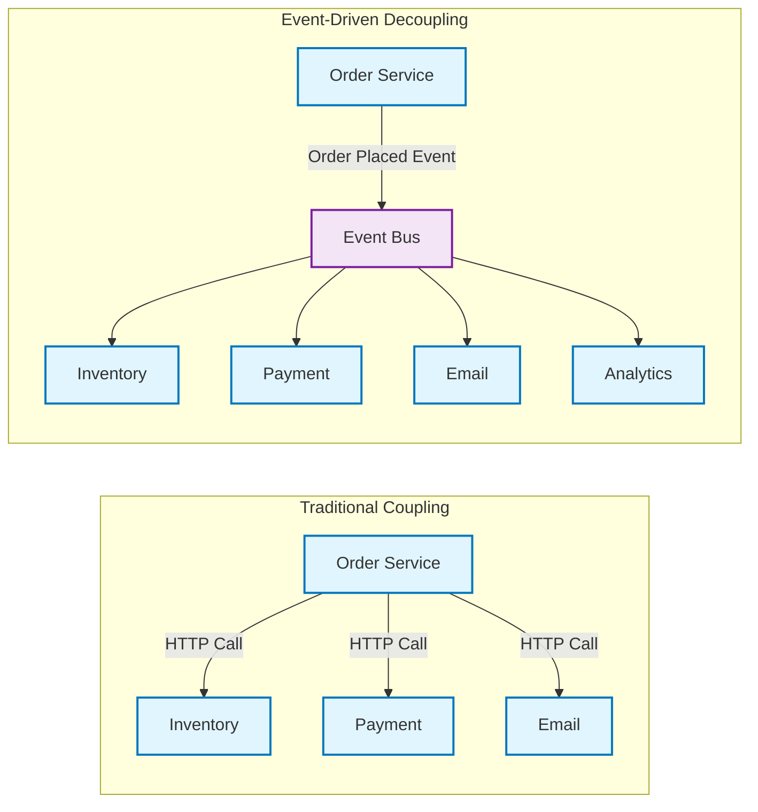
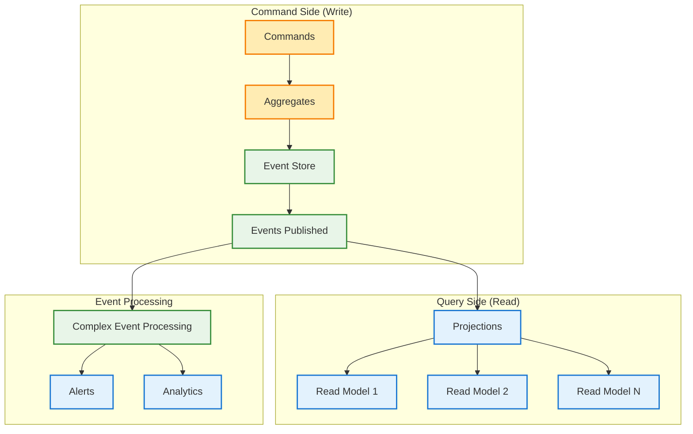
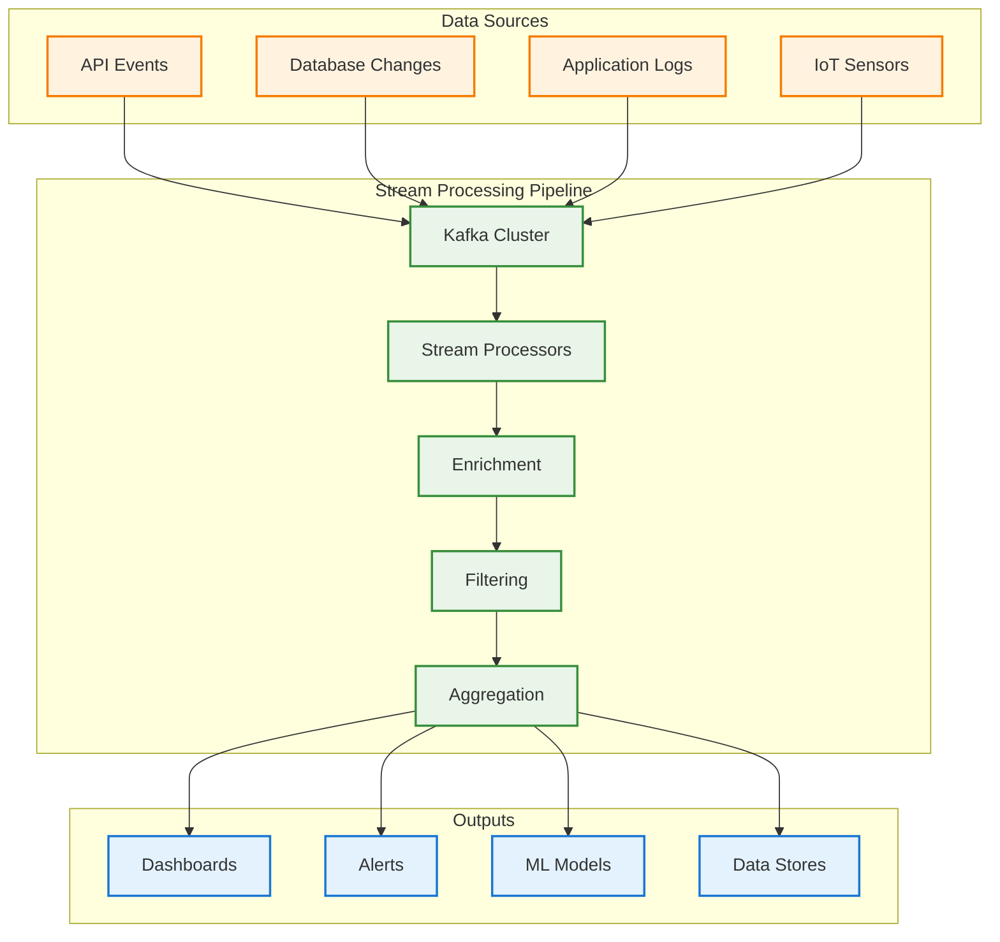
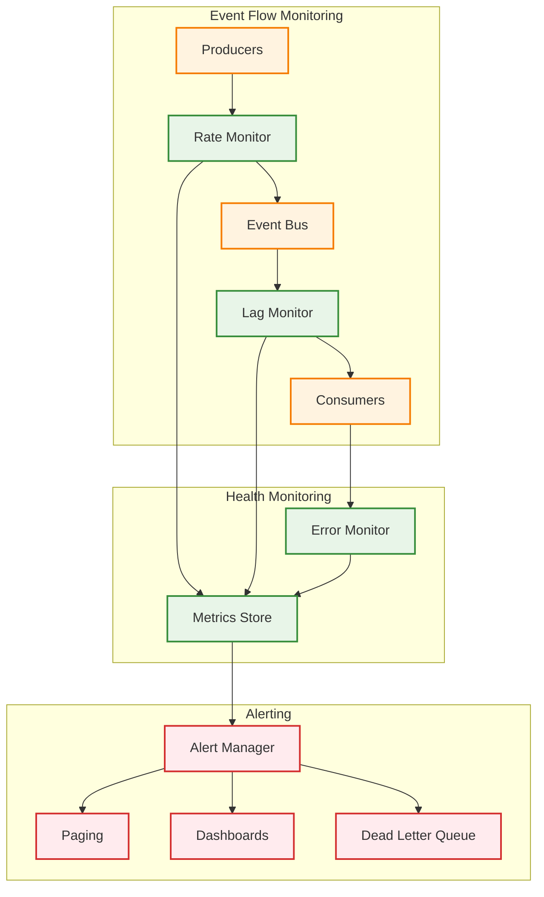
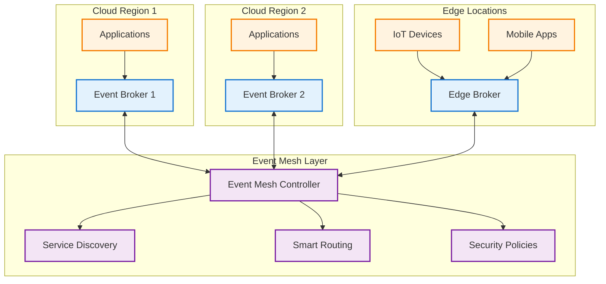

# Event-Driven Architecture

!!! success "🏆 Gold Standard Pattern"
    **Asynchronous Service Communication** • LinkedIn, Uber, Netflix proven
    
    The foundation for building scalable, loosely-coupled systems. Event-driven architecture enables services to react to changes without direct dependencies, processing trillions of events daily at scale.
    
    **Key Success Metrics:**
    - LinkedIn Kafka: 7 trillion messages/day with millisecond latency
    - Uber Events: 25B+ events/day coordinating global rides
    - Netflix Streaming: 500B+ events/day driving personalization

## Essential Questions

**1. Do multiple services need to react to the same business changes?**
- YES → Event-driven enables publish once, consume many
- NO → Direct API calls may be simpler

**2. Can your operations tolerate eventual consistency?**
- YES → Events provide natural decoupling
- NO → Synchronous patterns required

**3. Do you need an audit trail of all changes?**
- YES → Event sourcing provides complete history
- NO → Traditional state storage sufficient

---

## When to Use / When NOT to Use

### ✅ Use Event-Driven When

| Scenario | Why It Works | Example |
|----------|--------------|---------||
| **Multiple consumers** | One event → many reactions | Order placed → inventory, payment, email, analytics |
| **Temporal decoupling** | Producer/consumer work at different speeds | Batch processing, async workflows |
| **Loose coupling required** | Services evolve independently | Microservices communication |
| **Audit requirements** | Natural event log | Financial transactions, compliance |
| **Real-time streaming** | Continuous data flow | IoT sensors, live analytics |

### ❌ DON'T Use When

| Scenario | Why It Fails | Alternative |
|----------|--------------|-------------|
| **Immediate consistency** | Events are eventually consistent | Synchronous APIs, 2PC |
| **Simple request-response** | Overkill for basic queries | REST/GraphQL APIs |
| **< 5 services** | Complexity exceeds benefits | Direct service calls |
| **Ordered processing critical** | Global ordering expensive | Database transactions |
| **Team lacks experience** | Debugging async is hard | Start with simpler patterns |

## Level 1: Intuition

<h4>⚛️ Law 2: Asynchronous Reality</h4>

Event-driven architecture embraces the fundamental truth that in distributed systems, everything is asynchronous. Rather than fighting this reality with synchronous calls that can fail or timeout, events let services communicate through time - a service can publish an event now and interested services can process it when they're ready.

**Key Insight**: Events naturally handle the speed-of-light problem in distributed systems - you can't wait for a response from a service on another continent, but you can tell it what happened.

### The News Broadcasting Analogy

Think of event-driven architecture like a news broadcasting system:

- **Publisher (News Station)**: Broadcasts events without knowing who's listening
- **Subscribers (Viewers)**: Tune in to topics they care about
- **Event Bus (Airwaves)**: Delivers messages to all interested parties
- **Asynchronous**: Viewers watch on their own schedule, not in real time

### Saga Pattern Comparison

| Saga Type | Coordination | Complexity | Use Case |
|-----------|--------------|------------|----------|
| **Orchestration** | Central coordinator | Medium | Well-defined workflows |
| **Choreography** | Event-driven | High | Loosely coupled services |
| **Hybrid** | Mixed approach | Very High | Complex requirements |

---

## Level 3: Deep Dive

<h4>💥 The Knight Capital Event-Driven Disaster (2012)</h4>

**What Happened**: Knight Capital lost $440 million in 45 minutes due to an event processing bug in their algorithmic trading system

**Root Cause**: 
- Old code accidentally reactivated during deployment
- System started processing market events as if it were 8 years in the past
- Events triggered massive buy orders for 150 stocks
- Each event amplified the next in a runaway feedback loop
- No circuit breakers on event-driven trading logic

**Impact**: 
- $440M loss in 45 minutes
- 10% of NYSE daily volume
- Company bankruptcy within days
- Thousands of jobs lost

**Lessons Learned**:
- Event handlers must be idempotent 
- Event versioning is critical for system evolution
- Circuit breakers essential in event chains
- Event replay capability requires careful state management
- Dead letter queues prevent infinite retry loops

<h4>🎯 Event-Driven Implementation Strategy</h4>

**Start Simple - Notification Pattern:**
- Events contain minimal data (just IDs)
- Consumers fetch details as needed
- Easier to implement and debug
- Natural rate limiting through pull model

**Scale Up - Event-Carried State Transfer:**
- Events contain all necessary data
- Eliminates synchronous dependencies
- Higher throughput but larger events
- Schema evolution becomes critical

**Go Full-Scale - Event Sourcing:**
- Events as the single source of truth
- Complete audit trail and replay capability
- Most complex but most powerful
- Requires sophisticated tooling

**Hybrid Approach - Smart Routing:**
- Critical events carry full state
- Bulk events use notification pattern
- Analytics events use different retention
- Optimize per use case

**Key Decision Factors:**
- Team experience with eventual consistency
- Performance requirements (latency vs throughput)
- Data consistency requirements
- Infrastructure complexity tolerance
- Debugging and operational capabilities

### Advanced Event Patterns

### CQRS with Event Sourcing

| Component | Purpose | Storage | Update Frequency |
|-----------|---------|---------|------------------|
| **Event Store** | Source of truth | Append-only | Real-time |
| **Projections** | Optimized queries | Denormalized | Eventual |
| **Snapshots** | Performance | Point-in-time | Periodic |
| **Read Models** | UI/API serving | Various DBs | Near real-time |

### Complex Event Processing Patterns

| Use Case | Pattern Type | Window | Example |
|----------|--------------|--------|---------||
| **Fraud Detection** | Threshold + Correlation | 5 min sliding | 5+ payments, 3+ cards |
| **System Monitoring** | Sequence | 1 min tumbling | Error → Retry → Fail |
| **User Analytics** | Session | Activity-based | Click → View → Purchase |
| **Anomaly Detection** | Statistical | 1 hour sliding | 3σ deviation |

### Stream Processing Architecture

---

## Level 4: Expert

### Production Case Study: LinkedIn's Kafka Platform

<h4>🏢 LinkedIn Event Architecture</h4>

**Scale**: 7 trillion messages/day across 100+ Kafka clusters

**Architecture Tiers**:
1. **Local Kafka** (per data center)
   - 6-hour retention, LZ4 compression
   - Handles regional traffic
   
2. **Regional Kafka** (aggregation)
   - 3-day retention, Zstd compression
   - Cross-datacenter replication
   
3. **Hadoop** (long-term storage)
   - 365-day retention, Avro format
   - Historical analysis

**Key Design Decisions**:
- Partition by entity type (member, job, company)
- Separate streams for different use cases
- Multi-tier storage for cost optimization
- Exactly-once semantics for critical flows

### Event Ordering Strategies

| Strategy | Use Case | Trade-offs |
|----------|----------|------------|
| **Key-based** | User actions | Hotspots possible |
| **Round-robin** | Metrics, logs | No ordering |
| **Hash-based** | Even distribution | Ordering per key |
| **Custom** | Business logic | Complex to manage |

### Event Store Design Decisions

| Storage Tier | Retention | Access Pattern | Cost |
|--------------|-----------|----------------|------|
| **Hot** | 7 days | Real-time queries | $$$ |
| **Warm** | 30 days | Recent history | $$ |
| **Cold** | Forever | Compliance/replay | $ |
| **Snapshots** | Latest | Fast rebuilds | $$ |

### Production Monitoring Strategy

### Critical Monitoring Points

| Metric | Warning | Critical | Action |
|--------|---------|----------|--------|
| **Consumer Lag** | > 10k | > 100k | Scale consumers |
| **Processing Time** | > 500ms | > 1s | Optimize handlers |
| **Error Rate** | > 0.1% | > 1% | Check logs |
| **DLQ Size** | > 100 | > 1000 | Manual intervention |

---

## Level 5: Mastery

### Theoretical Foundations

### Event Ordering Guarantees

### Performance Modeling

| Model | Formula | Use Case |
|-------|---------|----------|
| **Little's Law** | L = λW | Queue length from rate & wait time |
| **M/M/1 Queue** | ρ = λ/μ | Single processor utilization |
| **M/M/n Queue** | Complex | Multi-processor systems |
| **Amdahl's Law** | S = 1/((1-P)+P/N) | Parallel processing speedup |

### Capacity Planning

### Future Directions

### Event Mesh Architecture (Future)

### AI-Enhanced Event Processing

| Capability | Technology | Use Case |
|------------|------------|----------|
| **Anomaly Detection** | Isolation Forest | Fraud, system failures |
| **Pattern Prediction** | LSTM/Transformer | Capacity planning |
| **Auto-scaling** | Reinforcement Learning | Resource optimization |
| **Event Classification** | Deep Learning | Routing, prioritization |

### ROI Analysis

| Factor | Traditional | Event-Driven | Savings |
|--------|-------------|--------------|----------|
| **Coupling incidents** | 10/year @ $50k | 2/year @ $50k | $400k/year |
| **Scaling efficiency** | 40% over-provisioned | 10% over-provisioned | $300k/year |
| **Feature velocity** | 30 days | 10 days | $480k/year |
| **Operations** | 40 hrs/week | 20 hrs/week | $150k/year |

**Total Annual Savings**: $1.33M  
**Investment**: $650k  
**Payback Period**: 6 months  
**5-Year ROI**: 925%

---

## Quick Reference

<h4>💡 Event-Driven Architecture Insights</h4>

**The Event Ordering Paradox:**
- Most events don't need strict ordering, but the 5% that do are critical
- Partition keys provide order within stream, but can create hotspots
- Global ordering is expensive - use only when business requires it

**Eventual Consistency Reality:**
- 95% of business operations can tolerate eventual consistency
- The other 5% need careful design with compensation patterns
- Most "real-time" requirements are actually "fast enough" requirements

**Event Storage Economics:**
- Kafka retention costs: ~$0.10/GB/month
- Traditional database storage: ~$1.00/GB/month  
- Event replay value: Often worth 10x storage cost during incidents

**Production Wisdom:**
> "Event-driven systems amplify both good design and bad design. There's no middle ground."

**The Three Laws of Event Evolution:**
1. Events will grow larger over time (plan for schema evolution)
2. Consumers will multiply faster than expected (design for fan-out)
3. Event ordering requirements emerge late (prepare for partitioning changes)

### Decision Framework

| Question | Yes → Event-Driven | No → Alternative |
|----------|-------------------|------------------|
| Multiple services need same data? | ✅ Publish events | ⚠️ Direct API calls |
| Need loose coupling? | ✅ Event bus | ⚠️ Shared database |
| Async processing acceptable? | ✅ Event queues | ⚠️ Synchronous APIs |
| Need audit trail? | ✅ Event sourcing | ⚠️ Traditional logging |
| Complex workflows? | ✅ Event-driven saga | ⚠️ Orchestration service |

#
## Decision Matrix

### Quick Decision Table

| Factor | Low Complexity | Medium Complexity | High Complexity |
|--------|----------------|-------------------|-----------------|
| Team Size | < 5 developers | 5-20 developers | > 20 developers |
| Traffic | < 1K req/s | 1K-100K req/s | > 100K req/s |
| Data Volume | < 1GB | 1GB-1TB | > 1TB |
| **Recommendation** | ❌ Avoid | ⚠️ Consider | ✅ Implement |

## Implementation Checklist

- [ ] Define event schema and versioning strategy
- [ ] Choose event bus/broker (Kafka, RabbitMQ, etc.)
- [ ] Implement event publishing with retries
- [ ] Create event handlers with idempotency
- [ ] Set up event store if using event sourcing
- [ ] Configure dead letter queues
- [ ] Implement monitoring and tracing
- [ ] Plan for event replay capability
- [ ] Document event flows
- [ ] Test failure scenarios

### Common Anti-Patterns

1. **Event spaghetti** - Too many fine-grained events
2. **Missing schemas** - No event versioning strategy
3. **Synchronous events** - Using events for request-response
4. **Fat events** - Including entire aggregate state
5. **No idempotency** - Handlers not handling duplicates

---

## 🎓 Key Takeaways

1. **Events enable autonomy** - Services can evolve independently
2. **Async by default** - Embrace eventual consistency
3. **Events are facts** - Immutable, business-focused
4. **Order matters sometimes** - Use partitioning strategically
5. **Monitor everything** - Event flows need observability

---

*"In an event-driven architecture, the question isn't 'what should I call?' but 'who should I tell?'"*

---

**Previous**: [← Edge Computing/IoT Patterns](../../pattern-library/scaling/edge-computing.md) | **Next**: [Event Sourcing Pattern →](../../pattern-library/data-management/event-sourcing.md)

