# Event Streaming Pattern

!!! warning "🥈 Silver Tier Pattern"
    **Powerful but complex streaming solution**
    
    Event streaming provides unmatched capabilities for real-time processing but comes with significant complexity. Requires deep expertise in distributed systems, careful capacity planning, and robust monitoring.
    
    **Best suited for:**
    - Real-time analytics and monitoring
    - IoT and sensor data processing
    - Event-driven microservices
    - Teams with streaming expertise

<div class="pattern-type">Data Processing Pattern</div>

Build systems that process continuous, unbounded streams of events in real-time, enabling reactive architectures and real-time analytics at scale.

## Problem Context

!!! warning "🎯 The Challenge"

    Modern systems generate continuous streams of events that traditional batch processing can't handle:
    
    - **Unbounded data**: No clear beginning or end
    - **Real-time requirements**: Millisecond latency processing
    - **High volume**: Millions of events per second
    - **Out-of-order arrival**: Network delays cause temporal disorder
    - **Exactly-once semantics**: Each event must be processed exactly once
    - **Distributed state**: Maintain consistency across stream processors

## Core Concepts

### Event Streaming vs Batch Processing

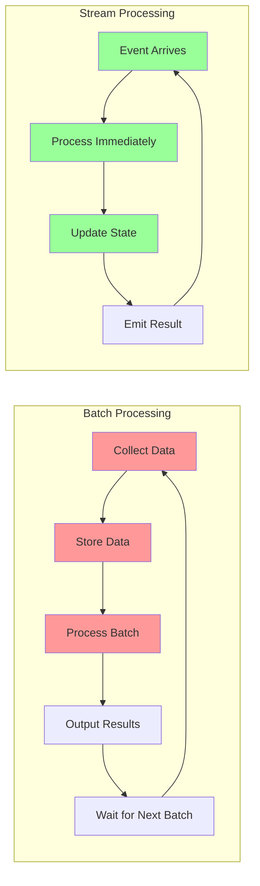

<table class="comparison-table">
<thead>
<tr>
<th>Aspect</th>
<th>Batch Processing</th>
<th>Stream Processing</th>
</tr>
</thead>
<tbody>
<tr>
<td><strong>Data Model</strong></td>
<td>Bounded datasets</td>
<td>Unbounded streams</td>
</tr>
<tr>
<td><strong>Latency</strong></td>
<td>Minutes to hours</td>
<td>Milliseconds to seconds</td>
</tr>
<tr>
<td><strong>Throughput</strong></td>
<td>Very high (optimized)</td>
<td>High (continuous)</td>
</tr>
<tr>
<td><strong>State Management</strong></td>
<td>Between batches</td>
<td>Continuous, distributed</td>
</tr>
<tr>
<td><strong>Reprocessing</strong></td>
<td>Simple (re-run batch)</td>
<td>Complex (replay stream)</td>
</tr>
<tr>
<td><strong>Use Cases</strong></td>
<td>ETL, reporting, ML training</td>
<td>Real-time analytics, monitoring, CEP</td>
</tr>
</tbody>
</table>

### Stream Components

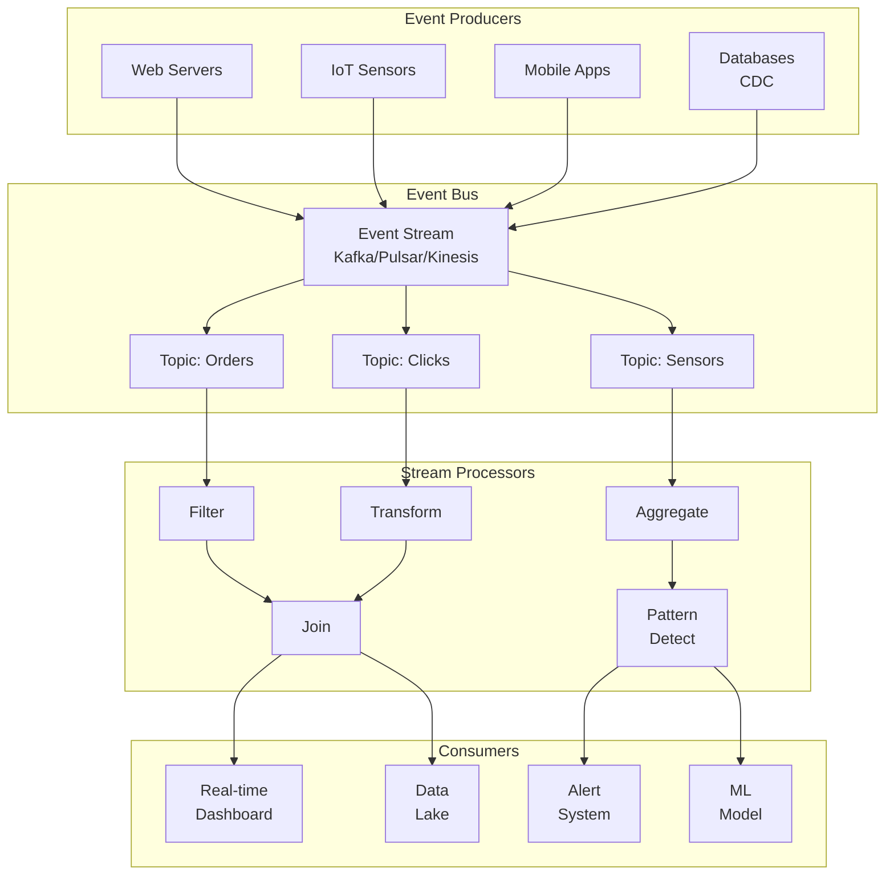

## Architecture Patterns

### 1. Lambda Architecture

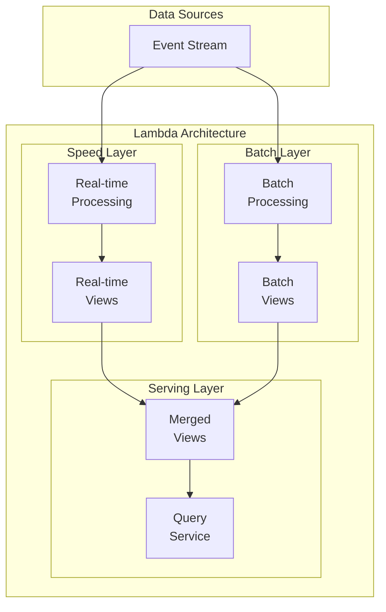

### 2. Kappa Architecture

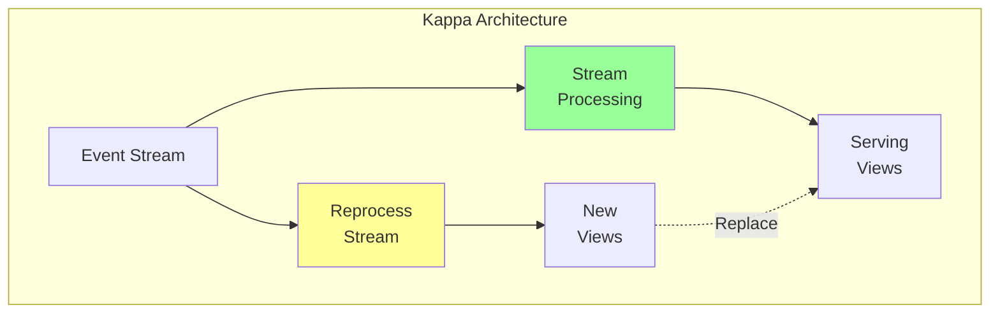

### 3. Event Sourcing Integration

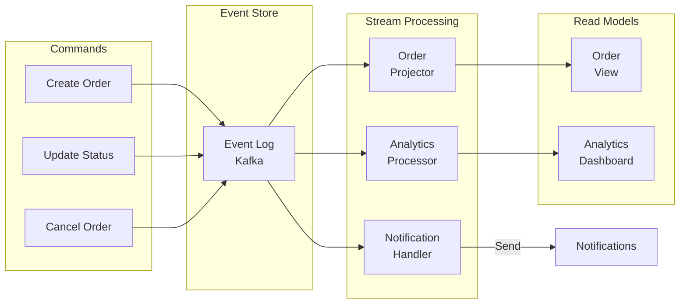

## Technology Comparison

### Stream Processing Platforms

<table class="tech-comparison">
<thead>
<tr>
<th>Technology</th>
<th>Architecture</th>
<th>Throughput</th>
<th>Latency</th>
<th>Durability</th>
<th>Best For</th>
</tr>
</thead>
<tbody>
<tr>
<td><strong>Apache Kafka</strong></td>
<td>Distributed log</td>
<td>1M+ msg/sec</td>
<td>2-10ms</td>
<td>Replicated</td>
<td>Event bus, log aggregation</td>
</tr>
<tr>
<td><strong>Apache Pulsar</strong></td>
<td>Segmented storage</td>
<td>1M+ msg/sec</td>
<td>5-15ms</td>
<td>BookKeeper</td>
<td>Multi-tenancy, geo-replication</td>
</tr>
<tr>
<td><strong>AWS Kinesis</strong></td>
<td>Managed shards</td>
<td>1K-1M rec/sec</td>
<td>70-200ms</td>
<td>3 AZ replication</td>
<td>AWS ecosystem, serverless</td>
</tr>
<tr>
<td><strong>Redis Streams</strong></td>
<td>In-memory</td>
<td>100K+ msg/sec</td>
<td><1ms</td>
<td>Optional</td>
<td>Low latency, simple streams</td>
</tr>
</tbody>
</table>

### Processing Frameworks

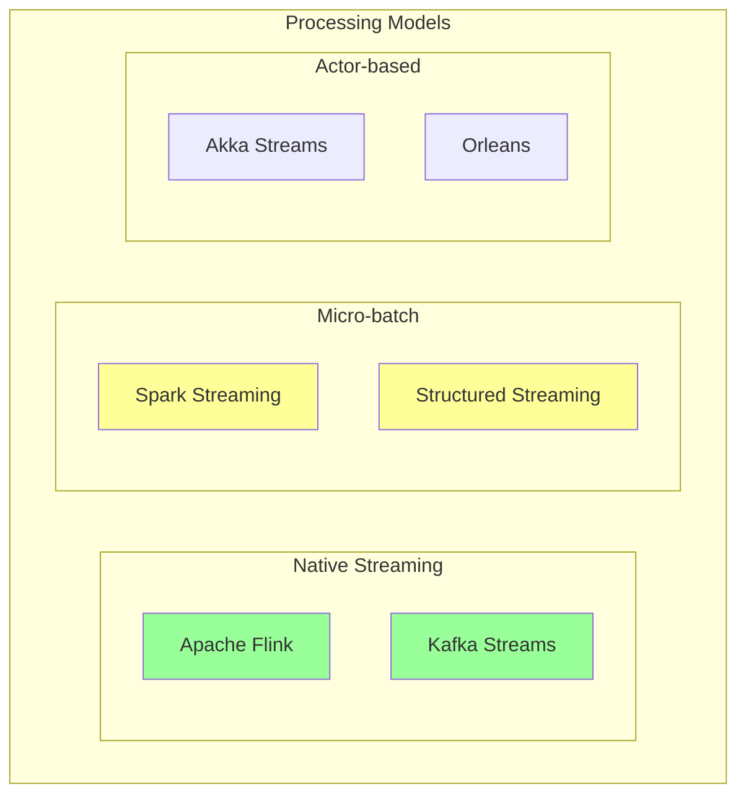

## Stream Processing Patterns

### 1. Windowing

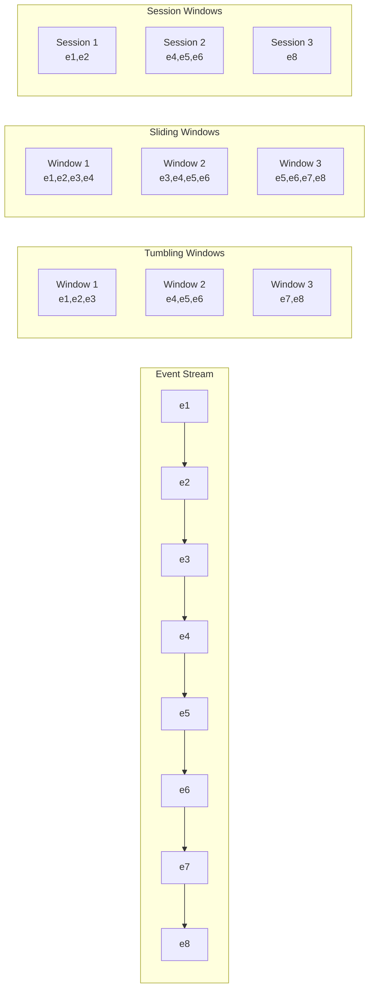

### 2. Watermarks and Late Data

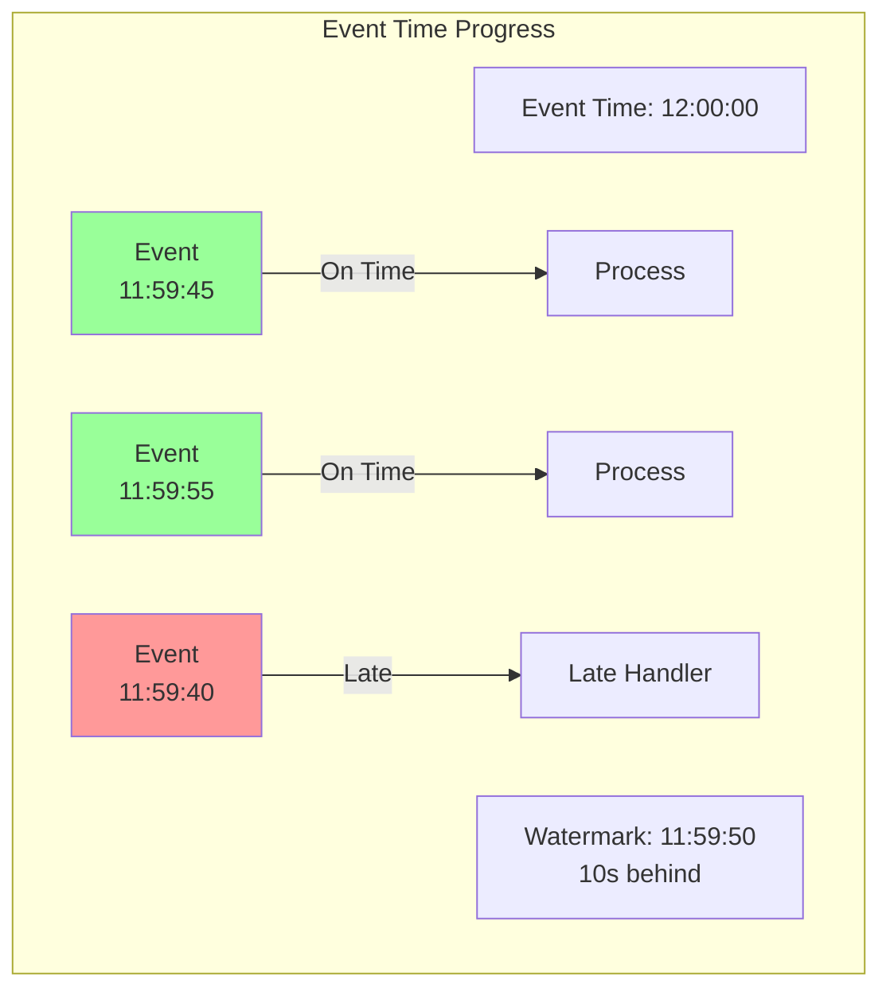

### 3. Exactly-Once Processing

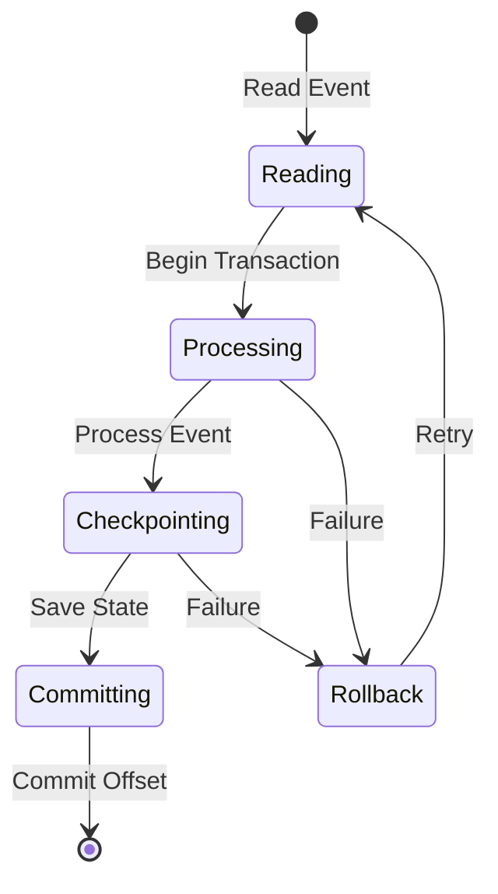

## Real-World Examples

### Netflix Real-Time Analytics

<div class="failure-vignette">
<h4>📊 Netflix Streaming Metrics</h4>

**Scale**: 200M+ subscribers, billions of events/day

**Architecture**:
- Apache Kafka for event ingestion
- Apache Flink for stream processing
- Druid for real-time analytics

**Challenges Solved**:
- Global event ordering
- Multi-region aggregation
- Sub-second dashboards

**Key Metrics**:
- 4M events/second peak
- 50ms p99 latency
- 99.99% processing guarantee
</div>

### Uber Dynamic Pricing

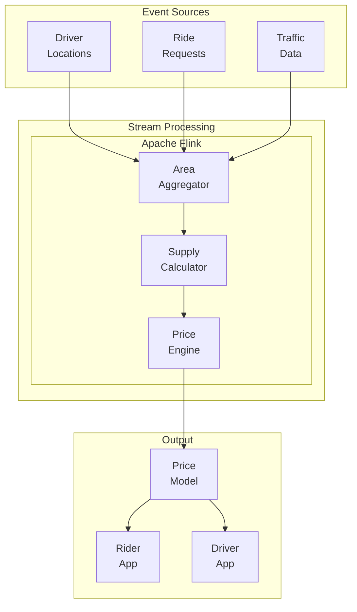

**Performance Metrics**:
- Latency: < 1 second price updates
- Throughput: 100K+ events/second
- Accuracy: 95%+ demand prediction

### LinkedIn Real-Time Anomaly Detection

<div class="decision-box">
<h4>🔍 LinkedIn Security Monitoring</h4>

**Problem**: Detect account takeovers in real-time

**Solution**:
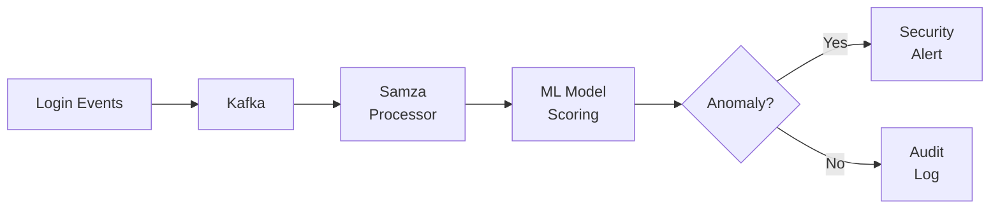

**Results**:
- 90% reduction in detection time
- 50ms average processing latency
- 99.9% accuracy rate
</div>

## Implementation Guide

### Basic Stream Processor

```python
from abc import ABC, abstractmethod
from typing import List, Dict, Any, Optional
from dataclasses import dataclass
from datetime import datetime
import asyncio

@dataclass
class StreamEvent:
    key: str
    value: Any
    timestamp: datetime
    headers: Dict[str, str] = None

class StreamProcessor(ABC):
    """Base class for stream processors"""
    
    @abstractmethod
    async def process(self, event: StreamEvent) -> Optional[StreamEvent]:
        pass

class FilterProcessor(StreamProcessor):
    """Filter events based on predicate"""
    def __init__(self, predicate):
        self.predicate = predicate
    
    async def process(self, event: StreamEvent) -> Optional[StreamEvent]:
        if self.predicate(event):
            return event
        return None

class MapProcessor(StreamProcessor):
    """Transform event values"""
    def __init__(self, mapper):
        self.mapper = mapper
    
    async def process(self, event: StreamEvent) -> Optional[StreamEvent]:
        transformed = await self.mapper(event.value)
        return StreamEvent(
            key=event.key,
            value=transformed,
            timestamp=event.timestamp,
            headers=event.headers
        )

class StreamPipeline:
    """Chain multiple processors"""
    def __init__(self):
        self.processors = []
    
    def add_processor(self, processor: StreamProcessor):
        self.processors.append(processor)
        return self
    
    async def process(self, event: StreamEvent) -> Optional[StreamEvent]:
        current = event
        for processor in self.processors:
            if current is None:
                break
            current = await processor.process(current)
        return current
```

### Windowed Aggregation

```python
from collections import defaultdict
from datetime import timedelta
import heapq

class WindowedAggregator:
    """Time-based windowed aggregation"""
    
    def __init__(self, window_size: timedelta, slide: timedelta = None):
        self.window_size = window_size
        self.slide = slide or window_size
        self.windows = defaultdict(list)
        self.watermark = datetime.min
        self.late_events = 0
    
    def process_event(self, event: StreamEvent) -> List[Dict]:
        """Process event and return completed windows"""
        # Update watermark
        self.watermark = max(self.watermark, 
                           event.timestamp - timedelta(seconds=10))
        
        # Check if event is late
        if event.timestamp < self.watermark:
            self.late_events += 1
            return []
        
        # Assign to windows
        window_start = self._get_window_start(event.timestamp)
        self.windows[window_start].append(event)
        
        # Check for completed windows
        completed = []
        for start, events in list(self.windows.items()):
            if start + self.window_size <= self.watermark:
                # Window is complete
                result = self._aggregate(events)
                completed.append({
                    'window_start': start,
                    'window_end': start + self.window_size,
                    'result': result,
                    'event_count': len(events)
                })
                del self.windows[start]
        
        return completed
    
    def _get_window_start(self, timestamp: datetime) -> datetime:
        """Calculate window start time"""
        epoch = datetime(1970, 1, 1)
        window_ms = int(self.window_size.total_seconds() * 1000)
        ts_ms = int((timestamp - epoch).total_seconds() * 1000)
        window_start_ms = (ts_ms // window_ms) * window_ms
        return epoch + timedelta(milliseconds=window_start_ms)
    
    def _aggregate(self, events: List[StreamEvent]) -> Any:
        """Override this for custom aggregation"""
        return len(events)  # Default: count
```

### State Management

```python
class StatefulProcessor:
    """Processor with managed state"""
    
    def __init__(self, state_backend):
        self.state_backend = state_backend
        self.pending_checkpoints = []
    
    async def process_with_state(self, event: StreamEvent):
        """Process event with exactly-once semantics"""
        # Begin transaction
        tx = await self.state_backend.begin_transaction()
        
        try:
            # Get current state
            state = await tx.get(event.key)
            
            # Process event
            new_state = await self.update_state(state, event)
            
            # Update state
            await tx.put(event.key, new_state)
            
            # Commit transaction
            await tx.commit()
            
            return new_state
        except Exception as e:
            # Rollback on failure
            await tx.rollback()
            raise e
    
    async def update_state(self, state: Any, event: StreamEvent) -> Any:
        """Override this for custom state updates"""
        if state is None:
            state = {'count': 0, 'sum': 0}
        
        state['count'] += 1
        state['sum'] += event.value
        return state
```

## Performance Optimization

### Partitioning Strategy

```mermaid
graph TB
    subgraph "Input Stream"
        IS[1M events/sec]
    end
    
    subgraph "Partitioning"
        P[Partitioner<br/>hash(key) % N]
    end
    
    subgraph "Parallel Processing"
        PP1[Partition 1<br/>200K/sec]
        PP2[Partition 2<br/>200K/sec]
        PP3[Partition 3<br/>200K/sec]
        PP4[Partition 4<br/>200K/sec]
        PP5[Partition 5<br/>200K/sec]
    end
    
    IS --> P
    P --> PP1
    P --> PP2
    P --> PP3
    P --> PP4
    P --> PP5
```

### Backpressure Handling

<table class="strategy-table">
<thead>
<tr>
<th>Strategy</th>
<th>Implementation</th>
<th>Pros</th>
<th>Cons</th>
</tr>
</thead>
<tbody>
<tr>
<td><strong>Rate Limiting</strong></td>
<td>Limit input rate</td>
<td>Simple, predictable</td>
<td>May drop events</td>
</tr>
<tr>
<td><strong>Buffering</strong></td>
<td>Queue events</td>
<td>No data loss</td>
<td>Memory pressure</td>
</tr>
<tr>
<td><strong>Dynamic Scaling</strong></td>
<td>Add processors</td>
<td>Handles spikes</td>
<td>Complex, costly</td>
</tr>
<tr>
<td><strong>Sampling</strong></td>
<td>Process subset</td>
<td>Reduces load</td>
<td>Loses accuracy</td>
</tr>
</tbody>
</table>

## When to Use vs Message Queues

### Decision Matrix

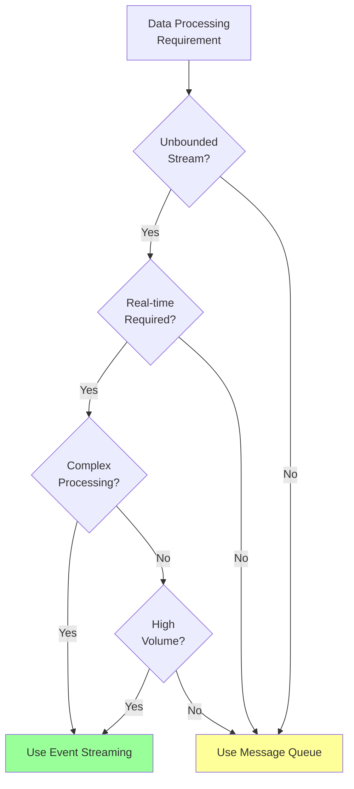

### Comparison Table

<table class="comparison-table">
<thead>
<tr>
<th>Aspect</th>
<th>Event Streaming</th>
<th>Message Queues</th>
</tr>
</thead>
<tbody>
<tr>
<td><strong>Data Model</strong></td>
<td>Continuous streams</td>
<td>Discrete messages</td>
</tr>
<tr>
<td><strong>Processing</strong></td>
<td>Stateful, windowed</td>
<td>Stateless, per-message</td>
</tr>
<tr>
<td><strong>Ordering</strong></td>
<td>Per-partition ordering</td>
<td>FIFO or priority</td>
</tr>
<tr>
<td><strong>Replay</strong></td>
<td>Full replay capability</td>
<td>Limited/no replay</td>
</tr>
<tr>
<td><strong>Use Cases</strong></td>
<td>Analytics, CEP, ETL</td>
<td>Task queues, RPC</td>
</tr>
</tbody>
</table>

## Common Pitfalls

<div class="failure-vignette">
<h4>⚠️ Late Data Handling</h4>

**Problem**: Events arrive after window closes

**Symptoms**:
- Missing data in aggregations
- Incorrect results
- Customer complaints

**Solution**:
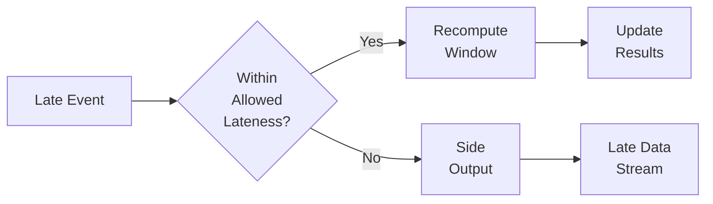
</div>

## Best Practices

<div class="axiom-box">
<h4>🎯 Stream Processing Guidelines</h4>

1. **Design for Failure**
   - Checkpointing strategy
   - Idempotent operations
   - Dead letter queues

2. **Optimize State**
   - Minimize state size
   - Use appropriate backends
   - Regular compaction

3. **Monitor Everything**
   - Lag metrics
   - Throughput/latency
   - State size
   - Rebalancing events

4. **Handle Time Properly**
   - Event time > processing time
   - Appropriate watermarks
   - Late data strategy
</div>

## Implementation Checklist

- [ ] **Event Design**
  - [ ] Define event schema
  - [ ] Choose serialization format
  - [ ] Plan versioning strategy

- [ ] **Processing Logic**
  - [ ] Select time semantics
  - [ ] Design windowing strategy
  - [ ] Plan state management
  - [ ] Implement exactly-once

- [ ] **Infrastructure**
  - [ ] Choose streaming platform
  - [ ] Design partitioning
  - [ ] Plan scaling strategy
  - [ ] Set up monitoring

- [ ] **Operations**
  - [ ] Checkpointing configuration
  - [ ] Backpressure handling
  - [ ] Replay procedures
  - [ ] Failure recovery

## Related Patterns

- [Event-Driven Architecture](event-driven.md) - Architectural style using events
- [Event Sourcing](event-sourcing.md) - Store state as event sequence
- [CQRS](cqrs.md) - Separate read/write models
- [Saga Pattern](saga.md) - Distributed transactions
- [Message Queue Case Study](../case-studies/distributed-message-queue.md) - Deep dive into queuing

## References

- "Streaming Systems" - Tyler Akidau, Slava Chernyak, Reuven Lax
- "Designing Data-Intensive Applications" - Martin Kleppmann
- "Kafka: The Definitive Guide" - Neha Narkhede, Gwen Shapira, Todd Palino
- Apache Flink Documentation
- Google Dataflow Model Paper