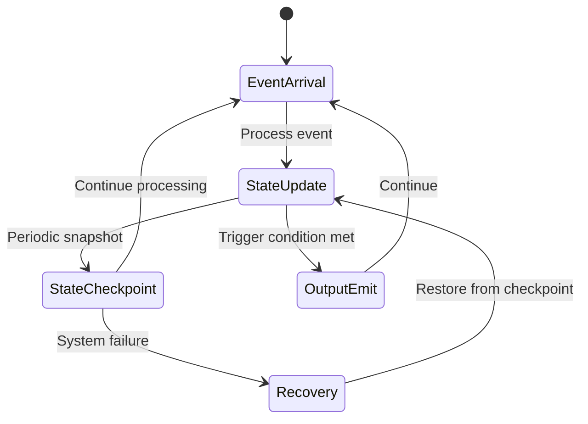
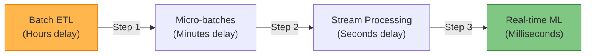

# Event Streaming

!!! info "🥈 Silver Tier Pattern"
    **Real-Time Stream Processing** • Specialized for high-throughput, low-latency scenarios
    
    Event streaming enables powerful real-time analytics and event-driven architectures but requires significant expertise in distributed systems. Best for teams with streaming experience handling high-volume, time-sensitive data.
    
    **Best For:** Real-time analytics, IoT processing, financial trading systems, recommendation engines

## Essential Question

**How do we process unbounded streams of real-time events while handling late data, maintaining state, and ensuring exactly-once semantics?**

## When to Use / When NOT to Use

### ✅ Use When

| Scenario | Example | Impact |
|----------|---------|--------|
| Real-time analytics | Fraud detection, system monitoring | Sub-second insights prevent losses |
| IoT data processing | Smart cities, manufacturing sensors | Continuous processing of sensor streams |
| Event-driven microservices | Service choreography at scale | Loose coupling with high throughput |
| Complex event processing | Trading systems, security monitoring | Pattern detection across event streams |
| Continuous computation | Recommendation engines, personalization | Always-on processing for real-time results |

### ❌ DON'T Use When

| Scenario | Why | Alternative |
|----------|-----|-------------|
| Simple request-response | No continuous data flow | REST APIs or RPC calls |
| Batch processing sufficient | Hourly/daily processing acceptable | Apache Spark or scheduled ETL |
| Small data volume | < 1000 events/second | Message queues (RabbitMQ, SQS) |
| No real-time requirements | Results can wait hours/days | Batch processing systems |
| Limited expertise | Team lacks streaming experience | Start with simpler message queues |

## Level 1: Intuition (5 min) {#intuition}

### The Story

Imagine a security guard monitoring a building with hundreds of cameras. Instead of reviewing footage later (batch), they watch live feeds and react instantly to suspicious activity. Event streaming is like having AI that can watch all feeds simultaneously, detect patterns, and alert immediately.

### Visual Metaphor

📄 View mermaid code (9 lines)

**Architecture Components:**
- Service layer
- Processing components
- Data storage
- External integrations

### Core Insight
> **Key Takeaway:** Stream processing turns data into intelligence in real-time, enabling immediate responses to events as they happen.

### In One Sentence
Event streaming processes infinite sequences of events in real-time, maintaining state and enabling immediate reactions to patterns and anomalies.

## Level 2: Foundation (10 min) {#foundation}

### The Problem Space

<h4>🚨 What Happens Without Real-Time Processing</h4>

**Financial Services Company, 2020**: Used batch processing to detect fraudulent transactions, running analysis every 4 hours. During a coordinated attack, fraudsters stole $2.3M before the next batch job detected the pattern.

**Impact**: $2.3M direct loss, 3x increase in false positives due to reactive measures, 18-month recovery period

### How It Works

#### Architecture Overview
#### Key Components

| Component | Purpose | Responsibility |
|-----------|---------|----------------|
| **Stream Ingestion** | Event collection | Reliably capture high-velocity event streams |
| **Processing Engine** | Real-time computation | Apply transformations, aggregations, and logic |
| **State Management** | Memory for streams | Maintain running state for stateful operations |
| **Output Sinks** | Result delivery | Send processed results to downstream systems |

### Basic Example

## Level 3: Deep Dive (15 min) {#deep-dive}

### Implementation Details

#### State Management

📄 View mermaid code (9 lines)

#### Critical Design Decisions

| Decision | Options | Trade-off | Recommendation |
|----------|---------|-----------|----------------|
| **Time Semantics** | Event time Processing time | Accuracy vs simplicity Complex vs fast | Use event time for business logic |
| **State Backend** | In-memory Persistent (RocksDB) | Speed vs durability Fast vs fault-tolerant | Persistent for production systems |
| **Delivery Guarantees** | At-most-once Exactly-once | Performance vs correctness Fast vs accurate | Exactly-once for critical operations |

### Common Pitfalls

<h4>⚠️ Avoid These Mistakes</h4>

1. **Ignoring event time**: Using processing time for business logic → Always use event time for correctness
2. **No watermark strategy**: Late events cause incorrect results → Configure watermarks based on data characteristics
3. **Unbounded state growth**: Memory leaks in stateful operations → Implement state TTL and cleanup policies

### Production Considerations

#### Performance Characteristics

| Metric | Typical Range | Optimization Target |
|--------|---------------|--------------------|
| Latency | 1-100ms | Minimize processing overhead |
| Throughput | 10K-10M events/sec | Scale processing parallelism |
| State Size | GB-TB per operator | Optimize state access patterns |
| Checkpoint Time | Seconds-Minutes | Balance frequency vs performance |

## Level 4: Expert (20 min) {#expert}

### Advanced Techniques

#### Optimization Strategies

1. **Adaptive Checkpointing**
   - When to apply: High-throughput systems with varying load
   - Impact: 30-50% improvement in throughput during peak times
   - Trade-off: More complex failure recovery

2. **Dynamic Parallelism**
   - When to apply: Workloads with time-varying complexity
   - Impact: Automatic scaling based on processing lag
   - Trade-off: Additional coordination overhead

### Scaling Considerations

### Monitoring & Observability

#### Key Metrics to Track

| Metric | Alert Threshold | Dashboard Panel |
|--------|----------------|------------------|
| **Processing Lag** | > 10 seconds | Event processing delay by topic |
| **Checkpoint Duration** | > 60 seconds | State checkpoint success rate |
| **Throughput** | < 80% capacity | Events processed per second |
| **Error Rate** | > 1% | Failed event processing rate |

## Level 5: Mastery (30 min) {#mastery}

### Real-World Case Studies

#### Case Study 1: Uber's Real-Time Pricing

<h4>💡 Production Insights from Uber</h4>

**Challenge**: Calculate dynamic pricing for millions of ride requests globally with sub-second latency

**Implementation**: Apache Flink processes driver location, rider demand, and traffic data in real-time

**Results**: 
- **Scale**: 1M+ pricing calculations per second
- **Latency**: Average 50ms response time for pricing decisions
- **Accuracy**: 15% improvement in supply-demand matching

**Lessons Learned**: Stateful stream processing enables complex business logic at scale while maintaining low latency

### Pattern Evolution

#### Migration from Legacy

📄 View mermaid code (7 lines)

#### Future Directions

| Trend | Impact on Pattern | Adaptation Strategy |
|-------|------------------|---------------------|
| **Edge Computing** | Processing moves closer to data sources | Distributed stream processing at edge |
| **AI/ML Integration** | Real-time model inference and training | Stream-native ML pipelines |
| **Quantum Computing** | Enhanced pattern detection capabilities | Quantum-classical hybrid streaming |

### Pattern Combinations

#### Works Well With

| Pattern | Combination Benefit | Integration Point |
|---------|-------------------|------------------|
| **Event Sourcing** | Complete audit trail + real-time processing | Event store as streaming source |
| **CQRS** | Separate read/write with streaming updates | Stream processing for read models |
| **Circuit Breaker** | Resilient streaming with graceful degradation | Backpressure and error handling |

## Quick Reference

### Decision Matrix

### Comparison with Alternatives

| Aspect | Event Streaming | Message Queues | Batch Processing | Real-time Databases |
|--------|-----------------|----------------|------------------|---------------------|
| Latency | Milliseconds | Seconds | Minutes-Hours | Milliseconds |
| Throughput | Very High | Medium | Very High | High |
| Complexity | Very High | Low | Medium | Medium |
| State Management | Built-in | None | External | Built-in |
| When to use | Real-time analytics | Simple pub-sub | Periodic reports | Real-time queries |

### Implementation Checklist

**Pre-Implementation**
- [ ] Validated real-time processing requirements and SLAs
- [ ] Assessed team expertise in distributed systems and streaming
- [ ] Designed event schemas with evolution strategy
- [ ] Planned state management and checkpointing approach

**Implementation**
- [ ] Set up distributed streaming infrastructure (Kafka + processing engine)
- [ ] Implemented proper time semantics (event time vs processing time)
- [ ] Configured watermarks and late data handling policies
- [ ] Added comprehensive monitoring for lag, throughput, and errors

**Post-Implementation**
- [ ] Load testing with realistic event volumes and patterns
- [ ] Chaos engineering tests for failure scenarios
- [ ] Performance tuning for optimal throughput and latency
- [ ] Team training on streaming concepts and operational procedures

### Related Resources

- :material-book-open-variant:{ .lg .middle } **Related Patterns**
    
    ---
    
    - [Event-Driven Architecture](../../pattern-library/architecture/event-driven.md) - Foundation for streaming systems
    - [Event Sourcing](../../pattern-library/data-management/event-sourcing.md) - Stream-based data storage
    - [CQRS](../../pattern-library/data-management/cqrs.md) - Read/write separation with streams

- :material-flask:{ .lg .middle } **Fundamental Laws**
    
    ---
    
    - [Law 2: Asynchronous Reality](../../core-principles/laws/asynchronous-reality/) - Time and ordering challenges
    - [Law 3: Emergent Chaos](../../core-principles/laws/emergent-chaos/) - Complex system behaviors

- :material-pillar:{ .lg .middle } **Foundational Pillars**
    
    ---
    
    - [Work Distribution](../../core-principles/pillars/work-distribution/) - Parallel stream processing
    - [State Distribution](../../core-principles/pillars/state-distribution/) - Distributed state management

- :material-tools:{ .lg .middle } **Implementation Guides**
    
    ---
    
    - [Kafka Setup Guide](../../excellence/guides/kafka-setup.md)
    - [Flink Best Practices](../../excellence/guides/flink-best-practices.md)
    - [Stream Processing Testing](../../excellence/guides/stream-testing.md)

---

