# Event Streaming

!!! warning "🥈 Silver Tier Pattern"
    **Powerful but complex streaming solution**
    
    Event streaming provides unmatched capabilities for real-time processing but comes with significant complexity. Requires deep expertise in distributed systems, careful capacity planning, and robust monitoring.
    
    **Best suited for:**
    - Real-time analytics and monitoring
    - IoT and sensor data processing
    - Event-driven microservices
    - Teams with streaming expertise

**Process infinite streams of events in real-time, enabling reactive architectures and continuous intelligence**

> *"In streaming, the data is the API, and time is a first-class citizen."*

---

## The Essential Question

**How do we process unbounded streams of real-time events while handling late data, maintaining state, and ensuring exactly-once semantics?**

## When to Use / When NOT to Use

### ✅ Use Event Streaming When

| Scenario | Why Streaming Wins | Example |
|----------|-------------------|---------|
| **Real-time Analytics** | Sub-second insights | Fraud detection, monitoring |
| **IoT Data Processing** | Continuous sensor data | Smart cities, manufacturing |
| **Event-Driven Architecture** | Loose coupling at scale | Microservices choreography |
| **Complex Event Processing** | Pattern detection | Trading systems, security |
| **Continuous Computation** | Always-on processing | Recommendation engines |

### ❌ Don't Use Streaming When

| Scenario | Why It's Overkill | Better Alternative |
|----------|------------------|-------------------|
| **Simple Request-Response** | No continuous data | REST API or RPC |
| **Batch is Sufficient** | Hourly/daily processing OK | Apache Spark, ETL |
| **Small Data Volume** | < 1000 events/sec | Message queue |
| **No Real-time Need** | Results can wait | Scheduled batch jobs |
| **Limited Expertise** | Team lacks experience | Start with queues |

### Decision Framework


---

## Level 1: Intuition

### The River Metaphor

<div class="axiom-box">
<h4>🌊 The Streaming River</h4>

Imagine standing by a river. You can't process all the water that has flowed or will flow - you can only work with what's passing by right now. That's event streaming.

- **Batch Processing** = Analyzing a lake (bounded)
- **Stream Processing** = Analyzing a river (unbounded)
- **Real-time** = Working with water as it flows by
</div>

### Visual Comparison

```mermaid
graph TB
    subgraph "Batch: Process Historical Data"
        B1[Collect<br/>12 hours] --> B2[Store<br/>in HDFS]
        B2 --> B3[Process<br/>with Spark]
        B3 --> B4[Generate<br/>Report]
        BNote[⏱️ 12-hour delay]
    end
    
    subgraph "Stream: Process as it Arrives"
        S1[Event<br/>Arrives] --> S2[Process<br/>Immediately]
        S2 --> S3[Update<br/>State]
        S3 --> S4[Emit<br/>Result]
        SNote[⚡ Millisecond latency]
    end
    
    style B1 fill:#ffcccc
    style S1 fill:#ccffcc
    style BNote fill:#ffeeee,stroke:#ff6666
    style SNote fill:#eeffee,stroke:#66ff66
```



### Real-World Example

```python
# ❌ Batch: Detect fraud after the fact
def batch_fraud_detection():
    # Run every hour
    transactions = load_last_hour_transactions()
    
    for transaction in transactions:
        if is_fraudulent(transaction):
            # Too late! Money already gone
            flag_for_investigation(transaction)

# ✅ Stream: Prevent fraud in real-time
async def stream_fraud_detection(transaction_stream):
    async for transaction in transaction_stream:
        if await is_fraudulent_realtime(transaction):
            # Block the transaction immediately!
            await block_transaction(transaction)
            await alert_security_team(transaction)
```

---

## Level 2: Foundation

### Core Streaming Concepts

| Concept | Definition | Example |
|---------|------------|---------|
| **Event** | Immutable fact that happened | User clicked button at time T |
| **Stream** | Unbounded sequence of events | All clicks from all users |
| **Window** | Time-bounded view of stream | Clicks in last 5 minutes |
| **Watermark** | Progress indicator for event time | "All events before T have arrived" |
| **State** | Accumulated information | Running count of clicks |

### Stream Processing Patterns


### Time in Streaming

<div class="decision-box">
<h4>🕐 Three Types of Time</h4>

1. **Event Time**: When the event actually occurred
2. **Processing Time**: When the system processes the event
3. **Ingestion Time**: When the event enters the streaming system

**Golden Rule**: Always use event time for business logic!
</div>

### Windowing Strategies


---

## Level 3: Deep Dive

### Stream Processing Architecture

```mermaid
graph TB
    subgraph "Complete Streaming Architecture"
        subgraph "Sources"
            Web[Web Events]
            IoT[IoT Sensors]
            DB[Database CDC]
            Mobile[Mobile Apps]
        end
        
        subgraph "Ingestion"
            Kafka[Apache Kafka<br/>Distributed Log]
            Partitions[P1|P2|P3|P4|P5|P6]
        end
        
        subgraph "Processing"
            Flink[Apache Flink<br/>Stream Processor]
            State[(State Store)]
            Checkpoint[(Checkpoints)]
        end
        
        subgraph "Sinks"
            Analytics[Real-time<br/>Dashboard]
            Alert[Alert<br/>System]
            Lake[Data Lake]
            Database[(Database)]
        end
        
        Web --> Kafka
        IoT --> Kafka
        DB --> Kafka
        Mobile --> Kafka
        
        Kafka --> Partitions
        Partitions --> Flink
        
        Flink <--> State
        Flink --> Checkpoint
        
        Flink --> Analytics
        Flink --> Alert
        Flink --> Lake
        Flink --> Database
    end
    
    style Kafka fill:#4CAF50,stroke:#333,stroke-width:3px
    style Flink fill:#2196F3,stroke:#333,stroke-width:3px
```

### Handling Late Data


### Exactly-Once Semantics

| Guarantee | Description | Implementation | Use When |
|-----------|-------------|----------------|----------|
| **At-Most-Once** | May lose events | No retry on failure | Metrics, logs |
| **At-Least-Once** | May duplicate events | Retry on failure | With deduplication |
| **Exactly-Once** | Process each event once | Checkpoints + transactions | Financial data |

<div class="axiom-box">
<h4>⚡ Achieving Exactly-Once</h4>

```python
class ExactlyOnceProcessor:
    def __init__(self):
        self.processed_ids = set()  # In practice, use distributed store
        
    async def process(self, event):
        # Idempotency key prevents reprocessing
        if event.id in self.processed_ids:
            return  # Already processed
            
        async with transaction():
            # Process event
            result = await transform(event)
            
            # Update state
            await update_state(result)
            
            # Mark as processed
            self.processed_ids.add(event.id)
            
            # Commit transaction
            await commit()
```
</div>

### State Management Patterns

```python
# Example: Real-time user session analysis
class SessionAnalyzer:
    def __init__(self):
        self.sessions = {}  # user_id -> session_state
        
    async def process_event(self, event):
        user_id = event.user_id
        
        # Initialize or get existing session
        if user_id not in self.sessions:
            self.sessions[user_id] = {
                'start_time': event.timestamp,
                'events': [],
                'page_views': 0,
                'total_time': 0
            }
        
        session = self.sessions[user_id]
        
        # Update session state
        session['events'].append(event)
        session['page_views'] += 1
        session['last_seen'] = event.timestamp
        
        # Check for session timeout (30 min inactivity)
        if event.timestamp - session['last_seen'] > timedelta(minutes=30):
            # Emit completed session
            await self.emit_session(session)
            
            # Start new session
            self.sessions[user_id] = {
                'start_time': event.timestamp,
                'events': [event],
                'page_views': 1
            }
        
        # Emit real-time metrics
        await self.emit_metrics({
            'active_sessions': len(self.sessions),
            'avg_session_length': self.calculate_avg_length()
        })
```

---

## Level 4: Expert

### Production Streaming Architectures

#### Netflix's Keystone Platform


<div class="failure-vignette">
<h4>💥 Netflix's Streaming Evolution</h4>

**Challenge**: Processing 500B+ events/day across 190 countries

**Initial Architecture (Failed)**:
- Lambda architecture with duplicate logic
- 6-hour delay for accurate metrics
- Massive operational overhead

**Current Architecture (Successful)**:
- Unified streaming with selective routing
- Sub-second metrics with Druid
- 90% cost reduction through sampling
- Automated pipeline management

**Key Learning**: "Not all events are created equal - sample intelligently"
</div>

#### Uber's Real-Time Pricing

| Component | Technology | Scale | Purpose |
|-----------|------------|-------|---------|
| **Ingestion** | Kafka | 1M events/sec | Driver/rider events |
| **Processing** | Apache Flink | 100K events/sec | Supply/demand calculation |
| **State Store** | RocksDB | 10TB state | City-level aggregations |
| **ML Scoring** | Ray | 50K predictions/sec | Demand forecasting |
| **Output** | Redis | 1M reads/sec | Price lookup |

### Advanced Patterns

#### 1. Watermark Strategies

```python
class AdaptiveWatermarkGenerator:
    """Dynamically adjust watermarks based on stream characteristics"""
    
    def __init__(self):
        self.max_event_time = datetime.min
        self.event_time_histogram = {}
        self.lateness_percentile = 0.99  # Allow 1% late events
        
    def update(self, event):
        # Track event time distribution
        self.max_event_time = max(self.max_event_time, event.timestamp)
        
        # Calculate lateness
        lateness = datetime.now() - event.timestamp
        self.track_lateness(lateness)
        
    def get_watermark(self):
        # Adaptive watermark based on observed lateness
        allowed_lateness = self.calculate_percentile(self.lateness_percentile)
        return self.max_event_time - allowed_lateness
        
    def calculate_percentile(self, percentile):
        # Return lateness value at given percentile
        sorted_lateness = sorted(self.event_time_histogram.items())
        index = int(len(sorted_lateness) * percentile)
        return sorted_lateness[index][0] if sorted_lateness else timedelta(0)
```

#### 2. Complex Event Processing (CEP)

```mermaid
graph LR
    subgraph "Fraud Detection Pattern"
        E1[Login] --> E2[Large Transfer]
        E2 --> E3[Location Change]
        E3 --> E4[Another Transfer]
        
        E1 -.->|"< 5 min"| Pattern[PATTERN:<br/>Suspicious Activity]
        E2 -.->|"< 10 min"| Pattern
        E3 -.->|"< 15 min"| Pattern
        E4 -.->|Match!| Alert[🚨 Fraud Alert]
    end
    
    style Pattern fill:#ff9800
    style Alert fill:#f44336,color:#fff
```



---

## Level 5: Mastery

### Theoretical Foundations

<div class="axiom-box">
<h4>🔬 Stream Processing Theory</h4>

**Dataflow Model** (Google, 2015):
- **What**: Transformations (ParDo, GroupByKey)
- **Where**: Windowing (Fixed, Sliding, Session)
- **When**: Triggers (Watermark, Processing Time, Count)
- **How**: Accumulation (Discarding, Accumulating, Retracting)

This unified model underlies Apache Beam, Flink, and modern streaming systems.
</div>

### Lambda vs Kappa Architecture

| Aspect | Lambda Architecture | Kappa Architecture |
|--------|-------------------|-------------------|
| **Concept** | Parallel batch + stream | Stream-only processing |
| **Complexity** | High (duplicate logic) | Lower (single codebase) |
| **Accuracy** | Eventually perfect | Good enough real-time |
| **Maintenance** | Complex | Simpler |
| **Use Case** | When batch accuracy critical | When streaming sufficient |


### Performance Optimization

#### 1. Backpressure Handling

```python
class BackpressureAwareProcessor:
    def __init__(self):
        self.input_rate = RateMonitor()
        self.processing_rate = RateMonitor()
        self.output_buffer = BoundedBuffer(max_size=10000)
        
    async def process_with_backpressure(self, stream):
        async for event in stream:
            # Monitor input rate
            self.input_rate.record()
            
            # Check if we're falling behind
            if self.is_overloaded():
                await self.apply_backpressure()
            
            # Process event
            start = time.time()
            result = await self.process_event(event)
            self.processing_rate.record(time.time() - start)
            
            # Buffer output
            await self.output_buffer.put(result)
            
    def is_overloaded(self):
        return (self.input_rate.rate > self.processing_rate.rate * 1.1 or
                self.output_buffer.size() > 0.8 * self.output_buffer.max_size)
                
    async def apply_backpressure(self):
        # Strategy 1: Sampling
        if self.input_rate.rate > 100000:
            self.enable_sampling(rate=0.1)
            
        # Strategy 2: Load shedding  
        elif self.output_buffer.is_near_full():
            self.shed_low_priority_events()
            
        # Strategy 3: Dynamic scaling
        else:
            await self.request_scale_up()
```

#### 2. State Store Optimization

| State Size | Storage | Access Pattern | Example |
|------------|---------|----------------|---------|
| **< 1GB** | In-memory | Random access | User sessions |
| **1-100GB** | RocksDB | Sequential + random | Aggregations |
| **> 100GB** | External DB | Key-based lookup | Historical data |

### Economic Analysis

```python
def streaming_vs_batch_tco():
    """Total Cost of Ownership comparison"""
    
    # Batch processing costs
    batch_costs = {
        'infrastructure': {
            'hadoop_cluster': 50000,  # Monthly
            'storage': 20000,
            'network': 5000
        },
        'operational': {
            'delay_cost': 100000,  # Business impact of 6-hour delay
            'engineering': 30000,   # Maintenance
            'incidents': 20000      # Downtime costs
        }
    }
    
    # Streaming costs
    streaming_costs = {
        'infrastructure': {
            'kafka_cluster': 30000,
            'flink_cluster': 40000,
            'state_storage': 10000
        },
        'operational': {
            'complexity': 20000,    # Additional expertise
            'monitoring': 10000,
            'incidents': 10000      # Less downtime
        }
    }
    
    # Benefits
    streaming_benefits = {
        'real_time_value': 200000,  # Business value of real-time
        'cost_reduction': 50000,    # Reduced infrastructure
        'agility': 100000          # Faster feature development
    }
    
    batch_total = sum(sum(c.values()) for c in batch_costs.values())
    streaming_total = sum(sum(c.values()) for c in streaming_costs.values())
    streaming_roi = sum(streaming_benefits.values()) - streaming_total
    
    return {
        'batch_monthly_cost': batch_total,
        'streaming_monthly_cost': streaming_total,
        'streaming_net_benefit': streaming_roi,
        'payback_months': streaming_total / (batch_total - streaming_total)
    }
```

---

## 📚 Quick Reference

### Stream Processing Checklist

- [ ] **Event Design**
  - [ ] Include event time in every event
  - [ ] Make events immutable
  - [ ] Use schemas (Avro/Protobuf)
  - [ ] Plan for evolution

- [ ] **Time Handling**
  - [ ] Choose time semantic (event vs processing)
  - [ ] Define watermark strategy
  - [ ] Set allowed lateness
  - [ ] Handle late data

- [ ] **State Management**
  - [ ] Identify stateful operations
  - [ ] Choose state backend
  - [ ] Plan checkpointing
  - [ ] Size state appropriately

- [ ] **Operations**
  - [ ] Monitor lag and throughput
  - [ ] Set up alerting
  - [ ] Plan capacity
  - [ ] Test failure scenarios

### Common Patterns

```python
# 1. Windowed Aggregation
stream
  .key_by(lambda e: e.user_id)
  .window(TumblingWindow(minutes=5))
  .aggregate(CountAggregator())
  .filter(lambda c: c > 100)

# 2. Stream-Stream Join  
orders.key_by(lambda o: o.user_id)
  .join(users.key_by(lambda u: u.id))
  .window(SlidingWindow(minutes=10))
  .apply(EnrichOrderWithUser())

# 3. Pattern Detection
stream
  .key_by(lambda e: e.user_id)
  .pattern(
    Pattern()
      .begin("login").where(lambda e: e.type == "LOGIN")
      .followed_by("purchase").where(lambda e: e.type == "PURCHASE")
      .within(minutes=30)
  )
  .select(DetectFraud())
```

### Monitoring Metrics

| Metric | Target | Alert Threshold |
|--------|--------|-----------------|
| **Lag** | < 1 second | > 10 seconds |
| **Throughput** | 90% capacity | > 95% capacity |
| **Error Rate** | < 0.1% | > 1% |
| **Checkpointing** | < 1 minute | > 5 minutes |
| **State Size** | < 80% limit | > 90% limit |

---

## Related Patterns

- [Event-Driven Architecture](../architecture/event-driven.md) - Architectural foundation
- [Event Sourcing](../architecture/event-sourcing.md) - Storing streams as events
- [CQRS](../architecture/cqrs.md) - Separating read/write with streams
- [Distributed Queue](../coordination/distributed-queue.md) - Simpler alternative
- [Saga Pattern](../coordination/saga.md) - Stream-based transactions

---

**Previous**: [← GraphQL Federation](graphql-federation.md) | **Next**: [Distributed Queue →](../coordination/distributed-queue.md)