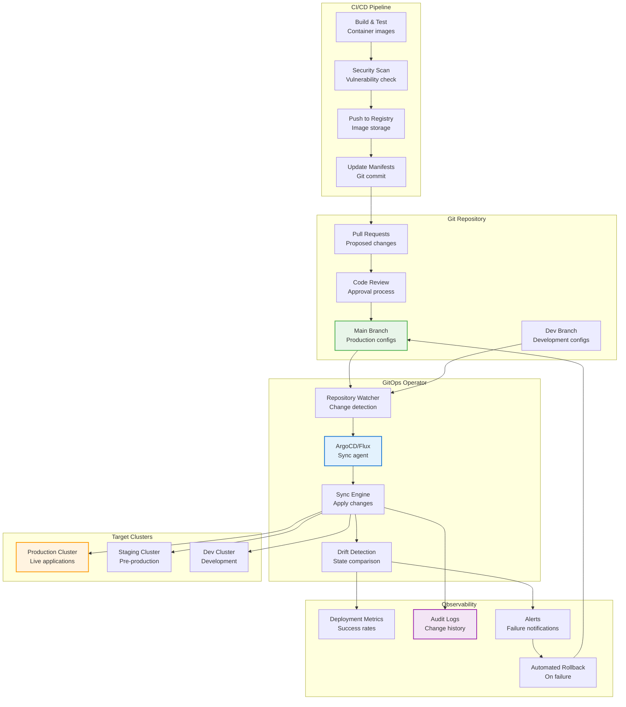
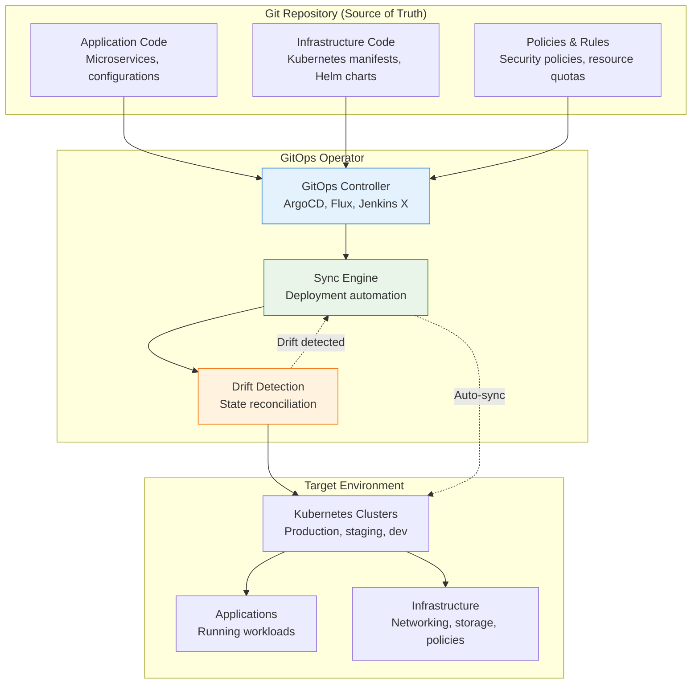

## The Complete Blueprint

GitOps Deployment revolutionizes infrastructure and application management by using Git repositories as the single source of truth for declarative infrastructure and application definitions, with automated agents continuously reconciling the actual state with the desired state stored in Git. This pattern transforms deployment workflows from imperative commands and manual interventions to declarative configurations that are version-controlled, peer-reviewed, and automatically synchronized across environments. By treating infrastructure as code and leveraging Git's robust versioning, branching, and collaboration features, GitOps provides complete auditability, easy rollbacks through Git revert, and consistent deployments across multiple clusters and environments. The architecture typically employs operators like ArgoCD or Flux that monitor Git repositories for changes and automatically apply them to target environments, ensuring that production always reflects what's defined in Git while preventing configuration drift and unauthorized changes.



### What You'll Master

- **GitOps workflow design** including repository structure, branching strategies, and environment promotion patterns
- **Operator configuration** with ArgoCD, Flux, or other GitOps tools for multi-cluster deployments and application management
- **Progressive deployment strategies** implementing canary releases, blue-green deployments, and feature flags through Git
- **Security and compliance** including secret management, policy as code, RBAC integration, and audit trail maintenance
- **Disaster recovery procedures** for Git repository failures, operator outages, and automated rollback mechanisms
- **Monitoring and observability** tracking deployment metrics, drift detection, and automated remediation workflows

# GitOps Deployment

!!! info "🥈 Silver Tier Pattern"
    **Declarative Deployment Standard** • Essential for Kubernetes and cloud-native operations
    
    GitOps deployment has become the gold standard for managing Kubernetes applications and infrastructure, providing consistency, auditability, and automation through Git-based workflows.
    
    **Best For:** Kubernetes environments, regulated industries, multi-team organizations, infrastructure as code

## Essential Question

**How do we achieve consistent, auditable, and automated deployments using Git as the single source of truth?**

## When to Use / When NOT to Use

### ✅ Use When

| Scenario | Example | Impact |
|----------|---------|--------|
| Kubernetes deployments | Cloud-native microservices | Automated sync and drift detection |
| Multi-environment consistency | Dev/staging/production parity | Identical deployment processes |
| Audit compliance | Financial services, healthcare | Complete change history and approvals |
| Team collaboration | Multiple developers and ops teams | Centralized deployment coordination |

### ❌ DON'T Use When

| Scenario | Why | Alternative |
|----------|-----|-------------|
| Simple single-server apps | Process overhead | Traditional CI/CD pipelines |
| Rapid prototyping | Git workflow slows iteration | Direct deployment tools |
| Non-containerized applications | Limited GitOps tooling support | Infrastructure automation tools |
| Teams unfamiliar with Git | Steep learning curve | Managed deployment services |

## Level 1: Intuition (5 min) {#intuition}

### The Story

GitOps is like having a master blueprint (Git repository) for your entire digital infrastructure. Every change goes through the blueprint first, then automated construction crews (GitOps operators) continuously compare the actual infrastructure with the blueprint and make corrections. If something breaks, you simply revert the blueprint, and the automated crews rebuild everything to match the previous working state.

### Visual Metaphor



## Level 2: Foundation (10 min) {#foundation}

### Basic GitOps Setup

```yaml
## ArgoCD Application for GitOps deployment
apiVersion: argoproj.io/v1alpha1
kind: Application
metadata:
  name: web-application
  namespace: argocd
spec:
  project: default
  source:
    repoURL: https://github.com/company/k8s-manifests
    targetRevision: HEAD
    path: applications/web-app
  destination:
    server: https://kubernetes.default.svc
    namespace: production
  syncPolicy:
    automated:
      prune: true
      selfHeal: true
    syncOptions:
    - CreateNamespace=true
    retry:
      limit: 5
      backoff:
        duration: 5s
        factor: 2
        maxDuration: 3m

---
## Kubernetes manifest in Git repository
apiVersion: apps/v1
kind: Deployment
metadata:
  name: web-app
  labels:
    app: web-app
    version: v1.2.0
spec:
  replicas: 3
  selector:
    matchLabels:
      app: web-app
  template:
    metadata:
      labels:
        app: web-app
        version: v1.2.0
    spec:
      containers:
      - name: web-app
        image: myregistry/web-app:v1.2.0
        ports:
        - containerPort: 8080
        env:
        - name: DATABASE_URL
          valueFrom:
            secretKeyRef:
              name: db-credentials
              key: url

---
## Sealed Secret for GitOps (encrypted in Git)
apiVersion: bitnami.com/v1alpha1
kind: SealedSecret
metadata:
  name: db-credentials
  namespace: production
spec:
  encryptedData:
    url: AgBy3i4OJSWK+PiTySYZZA9rO43cGDEQAx...
  template:
    metadata:
      name: db-credentials
      namespace: production
```

### Advanced GitOps Workflow

```python
## GitOps automation and deployment management
import git
import yaml
import json
import os
from typing import Dict, List, Any
from pathlib import Path
import subprocess
import logging

class GitOpsManager:
    """Manage GitOps deployments and workflows"""
    
    def __init__(self, repo_path: str, environments: List[str]):
        self.repo_path = Path(repo_path)
        self.environments = environments
        self.repo = git.Repo(repo_path)
        
        logging.basicConfig(level=logging.INFO)
        self.logger = logging.getLogger(__name__)
        
    def promote_application(self, app_name: str, from_env: str, to_env: str, 
                          image_tag: str = None) -> bool:
        """Promote application from one environment to another"""
        
        try:
            # Create promotion branch
            branch_name = f"promote-{app_name}-{from_env}-to-{to_env}-{image_tag or 'latest'}"
            
            # Ensure we're on main branch
            self.repo.git.checkout('main')
            self.repo.git.pull('origin', 'main')
            
            # Create new branch
            promotion_branch = self.repo.create_head(branch_name)
            promotion_branch.checkout()
            
            # Copy configuration from source to target environment
            source_path = self.repo_path / 'environments' / from_env / 'applications' / app_name
            target_path = self.repo_path / 'environments' / to_env / 'applications' / app_name
            
            if not source_path.exists():
                raise ValueError(f"Source application {app_name} not found in {from_env}")
                
            # Read source configuration
            manifests = self._load_manifests(source_path)
            
            # Update image tags if specified
            if image_tag:
                manifests = self._update_image_tags(manifests, image_tag)
                
            # Write to target environment
            self._save_manifests(target_path, manifests)
            
            # Commit changes
            self.repo.git.add('--all')
            commit_message = f"Promote {app_name} from {from_env} to {to_env}"
            if image_tag:
                commit_message += f" with image tag {image_tag}"
                
            self.repo.git.commit('-m', commit_message)
            
            # Push branch
            self.repo.git.push('origin', branch_name)
            
            self.logger.info(f"Created promotion branch: {branch_name}")
            return True
            
        except Exception as e:
            self.logger.error(f"Promotion failed: {e}")
            return False
    
    def create_pull_request(self, branch_name: str, title: str, description: str) -> str:
        """Create pull request for deployment changes"""
        
        # This would integrate with GitHub/GitLab API
        # For demo purposes, creating a mock PR
        pr_data = {
            'title': title,
            'head': branch_name,
            'base': 'main',
            'body': description
        }
        
        # Simulate PR creation
        pr_number = hash(branch_name) % 10000
        self.logger.info(f"Created PR #{pr_number}: {title}")
        
        return f"https://github.com/company/k8s-manifests/pull/{pr_number}"
    
    def rollback_deployment(self, app_name: str, environment: str, 
                          target_commit: str = None) -> bool:
        """Rollback deployment to previous version"""
        
        try:
            # If no target commit specified, find previous deployment
            if not target_commit:
                target_commit = self._find_previous_deployment_commit(app_name, environment)
                
            if not target_commit:
                raise ValueError("No previous deployment found for rollback")
                
            # Create rollback branch
            branch_name = f"rollback-{app_name}-{environment}-{target_commit[:8]}"
            
            # Checkout main and create rollback branch
            self.repo.git.checkout('main')
            self.repo.git.pull('origin', 'main')
            
            rollback_branch = self.repo.create_head(branch_name)
            rollback_branch.checkout()
            
            # Get files from target commit
            app_path = f"environments/{environment}/applications/{app_name}"
            
            # Revert files to target commit
            self.repo.git.checkout(target_commit, '--', app_path)
            
            # Commit rollback
            commit_message = f"Rollback {app_name} in {environment} to {target_commit[:8]}"
            self.repo.git.commit('-m', commit_message)
            
            # Push rollback branch
            self.repo.git.push('origin', branch_name)
            
            self.logger.info(f"Created rollback branch: {branch_name}")
            return True
            
        except Exception as e:
            self.logger.error(f"Rollback failed: {e}")
            return False
    
    def validate_manifests(self, environment: str) -> List[Dict[str, Any]]:
        """Validate Kubernetes manifests for deployment"""
        
        validation_results = []
        env_path = self.repo_path / 'environments' / environment
        
        for app_dir in env_path.glob('applications/*'):
            if app_dir.is_dir():
                result = self._validate_application_manifests(app_dir)
                validation_results.append({
                    'application': app_dir.name,
                    'valid': result['valid'],
                    'errors': result['errors'],
                    'warnings': result['warnings']
                })
                
        return validation_results
    
    def _load_manifests(self, path: Path) -> List[Dict[str, Any]]:
        """Load YAML manifests from directory"""
        manifests = []
        
        for yaml_file in path.glob('*.yaml'):
            with open(yaml_file, 'r') as f:
                docs = yaml.safe_load_all(f)
                manifests.extend([doc for doc in docs if doc])
                
        return manifests
    
    def _save_manifests(self, path: Path, manifests: List[Dict[str, Any]]):
        """Save manifests to directory"""
        path.mkdir(parents=True, exist_ok=True)
        
        # Group manifests by kind for better organization
        manifest_groups = {}
        for manifest in manifests:
            kind = manifest.get('kind', 'unknown')
            if kind not in manifest_groups:
                manifest_groups[kind] = []
            manifest_groups[kind].append(manifest)
        
        # Save each group to separate files
        for kind, group_manifests in manifest_groups.items():
            filename = f"{kind.lower()}.yaml"
            filepath = path / filename
            
            with open(filepath, 'w') as f:
                yaml.dump_all(group_manifests, f, default_flow_style=False)
    
    def _update_image_tags(self, manifests: List[Dict[str, Any]], 
                          image_tag: str) -> List[Dict[str, Any]]:
        """Update image tags in Kubernetes manifests"""
        
        updated_manifests = []
        
        for manifest in manifests:
            if manifest.get('kind') == 'Deployment':
                containers = manifest['spec']['template']['spec']['containers']
                for container in containers:
                    if 'image' in container:
                        # Update image tag
                        image_parts = container['image'].split(':')
                        container['image'] = f"{image_parts[0]}:{image_tag}"
                        
            updated_manifests.append(manifest)
            
        return updated_manifests
    
    def _find_previous_deployment_commit(self, app_name: str, environment: str) -> str:
        """Find the commit hash of the previous deployment"""
        
        app_path = f"environments/{environment}/applications/{app_name}"
        
        # Get commits that modified this application
        commits = list(self.repo.iter_commits(paths=app_path, max_count=5))
        
        if len(commits) >= 2:
            return commits[1].hexsha  # Second most recent commit
        
        return None
    
    def _validate_application_manifests(self, app_dir: Path) -> Dict[str, Any]:
        """Validate Kubernetes manifests using kubectl dry-run"""
        
        result = {
            'valid': True,
            'errors': [],
            'warnings': []
        }
        
        try:
            # Use kubectl to validate manifests
            for yaml_file in app_dir.glob('*.yaml'):
                cmd = ['kubectl', 'apply', '--dry-run=client', '-f', str(yaml_file)]
                process = subprocess.run(cmd, capture_output=True, text=True)
                
                if process.returncode != 0:
                    result['valid'] = False
                    result['errors'].append({
                        'file': yaml_file.name,
                        'error': process.stderr.strip()
                    })
                    
        except Exception as e:
            result['valid'] = False
            result['errors'].append({
                'file': 'general',
                'error': str(e)
            })
            
        return result

## Usage example
def main():
    # Initialize GitOps manager
    gitops = GitOpsManager(
        repo_path="/path/to/k8s-manifests",
        environments=['dev', 'staging', 'production']
    )
    
    # Promote application from staging to production
    success = gitops.promote_application(
        app_name='web-service',
        from_env='staging',
        to_env='production',
        image_tag='v1.2.3'
    )
    
    if success:
        # Create pull request for review
        pr_url = gitops.create_pull_request(
            branch_name='promote-web-service-staging-to-production-v1.2.3',
            title='Promote web-service v1.2.3 to production',
            description='Promoting web-service from staging to production with image tag v1.2.3'
        )
        print(f"Pull request created: {pr_url}")
    
    # Validate manifests before deployment
    validation_results = gitops.validate_manifests('production')
    for result in validation_results:
        if not result['valid']:
            print(f"Validation failed for {result['application']}: {result['errors']}")

if __name__ == "__main__":
    main()
```

## Quick Reference

### Implementation Checklist

**Setup Phase**
- [ ] Set up Git repositories with proper structure and access controls
- [ ] Install and configure GitOps operator (ArgoCD, Flux)
- [ ] Create environment-specific configurations and secrets management
- [ ] Set up monitoring and alerting for deployments

**Operational Phase**
- [ ] Implement promotion workflows between environments
- [ ] Set up automated rollback procedures
- [ ] Create compliance and audit reporting
- [ ] Train teams on GitOps workflows and best practices

### Related Resources

<div class="grid cards" markdown>

- :material-book-open-variant:{ .lg .middle } **Related Patterns**
    
    ---
    
    - [Container Orchestration](container-orchestration.md) - Kubernetes deployment target
    - <!-- TODO: Add CI/CD Pipeline from Architects Handbook --> - Integration with GitOps

- :material-flask:{ .lg .middle } **Fundamental Laws**
    
    ---
    
    - [Distributed Knowledge](../../core-principles/laws/distributed-knowledge.md) - Git as single source of truth
    - [Asynchronous Reality](../../core-principles/laws/asynchronous-reality.md) - Eventual consistency in deployments

- :material-tools:{ .lg .middle } **Implementation Guides**
    
    ---
    
    - <!-- TODO: Add ArgoCD Setup Guide from Architects Handbook -->
    - <!-- TODO: Add GitOps Security Best Practices from Architects Handbook -->

</div>

---